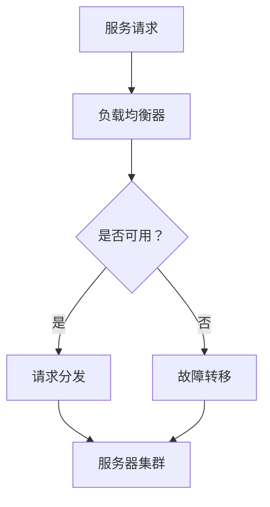

                 

# 构建安全可靠的云端架构

## 关键词
- 云计算
- 网络安全
- 云端架构
- 安全策略
- 实战案例分析

## 摘要
随着云计算的迅猛发展，企业对云端架构的依赖日益加深。然而，随之而来的安全风险也日益严峻。本文将详细探讨如何构建一个既安全又可靠的云端架构，从基础理论到实战策略，再到真实案例分析，提供一套系统化的构建方法论。通过本文的阅读，读者将能够理解云计算与网络安全的基本概念，掌握云端架构设计的关键原则，以及在实际应用中如何实施有效的安全策略。

### 目录

**第一部分：背景与基础**

1. 第1章：云计算与网络安全概述
    1.1 云计算基本概念
    1.2 网络安全的重要性
    1.3 安全与云计算的关系
2. 第2章：云计算核心概念
    2.1 云计算服务模型
    2.2 云计算部署模型
    2.3 云计算生态系统
3. 第3章：云端架构设计原则
    3.1 高可用性设计
    3.2 可扩展性设计
    3.3 容错性设计

**第二部分：安全策略与实践**

4. 第4章：安全风险管理
    4.1 安全风险识别
    4.2 安全风险评估
    4.3 风险缓解策略
5. 第5章：身份管理与访问控制
    5.1 身份管理基础
    5.2 授权与访问控制
    5.3 多因素认证
6. 第6章：安全防护技术
    6.1 网络隔离
    6.2 数据加密
    6.3 入侵检测与防御系统
7. 第7章：合规性与法规遵从
    7.1 合规性要求
    7.2 法规遵从策略
    7.3 云端架构合规性实践

**第三部分：案例分析**

8. 第8章：安全案例分析
    8.1 案例介绍
    8.2 案例分析
    8.3 教训与启示
9. 第9章：未来趋势与展望
    9.1 云计算安全发展趋势
    9.2 未来挑战与机遇
    9.3 安全架构的未来方向

---

### 第一部分：背景与基础

#### 第1章：云计算与网络安全概述

##### 1.1 云计算基本概念

云计算是指通过互联网将计算资源（如服务器、存储、网络和应用程序）提供作为服务的方式。它通常分为三种服务模型：基础设施即服务（IaaS）、平台即服务（PaaS）和软件即服务（SaaS）。这些服务模型为企业和个人提供了灵活、可扩展和成本效益的计算资源。

- **基础设施即服务（IaaS）**：提供虚拟化的硬件资源，如虚拟机、存储和网络。用户可以管理和配置这些资源，但需要自己维护操作系统和应用程序。
- **平台即服务（PaaS）**：提供开发平台，包括应用程序运行环境、数据库和开发工具。用户可以专注于开发应用程序，而不需要担心底层硬件和操作系统的管理。
- **软件即服务（SaaS）**：提供应用程序作为服务，用户可以通过互联网访问并使用这些应用程序，无需安装或维护。

##### 1.2 网络安全的重要性

随着云计算的普及，网络安全成为了一个至关重要的问题。云计算环境的复杂性和分布式特性使得传统的安全防护方法变得不再适用。云端数据泄露、服务中断和恶意攻击等问题频繁发生，严重影响了企业的运营和声誉。

网络安全的目标是保护信息资产，确保数据的完整性、保密性和可用性。以下是一些关键的网络安全挑战：

- **数据泄露**：云服务中的敏感数据可能因为不当配置、漏洞或恶意攻击而被泄露。
- **服务中断**：云计算基础设施的故障或网络攻击可能导致服务中断，影响业务的连续性。
- **恶意攻击**：恶意软件、DDoS攻击和社交工程等威胁对云计算环境构成了严重的安全威胁。

##### 1.3 安全与云计算的关系

构建安全可靠的云端架构是确保云计算环境安全和业务连续性的关键。以下是构建安全架构的一些基本原则：

- **身份管理与访问控制**：确保只有授权用户和系统才能访问资源。
- **数据加密**：对敏感数据进行加密，防止数据泄露。
- **安全防护技术**：使用防火墙、入侵检测和防御系统等安全工具来保护网络和系统。
- **合规性与法规遵从**：确保云端架构符合相关法律法规和行业标准。

#### 第2章：云计算核心概念

##### 2.1 云计算服务模型

云计算的服务模型定义了云服务提供商如何向客户提供服务。以下是三种主要的服务模型：

- **基础设施即服务（IaaS）**：提供虚拟化硬件资源，如虚拟机、存储和网络。用户可以根据需求自定义和管理这些资源。
- **平台即服务（PaaS）**：提供开发平台和工具，用户可以在平台上开发、部署和管理应用程序。
- **软件即服务（SaaS）**：提供应用程序作为服务，用户可以通过互联网访问和使用这些应用程序。

##### 2.2 云计算部署模型

云计算的部署模型定义了云计算资源如何分布和部署。以下是三种主要的部署模型：

- **公有云**：云服务提供商为多个组织或个人提供共享的云计算资源。
- **私有云**：为单一组织提供专用的云计算资源，确保数据的安全性和隐私性。
- **混合云**：结合公有云和私有云的优势，实现灵活的资源管理和数据存储。

##### 2.3 云计算生态系统

云计算生态系统包括多个关键组件，如云服务提供商、云存储、云数据库、云计算平台和云安全服务等。这些组件共同构成了云计算环境的基础设施和服务。

- **云服务提供商**：如亚马逊AWS、微软Azure和谷歌云等，提供各种云计算服务。
- **云存储**：提供数据存储和备份服务，如亚马逊S3、微软Azure Blob存储等。
- **云数据库**：提供数据库服务，如亚马逊RDS、微软Azure SQL Database等。
- **云计算平台**：提供开发、部署和管理应用程序的平台，如亚马逊EC2、微软Azure VM等。
- **云安全服务**：提供网络安全、数据保护和合规性服务，如亚马逊AWS Shield、微软Azure Security Center等。

#### 第3章：云端架构设计原则

##### 3.1 高可用性设计

高可用性设计是确保云计算环境持续运行、提供稳定服务的关键。以下是一些高可用性设计的关键原则：

- **冗余**：通过在多个物理或虚拟位置部署冗余系统来确保服务的不间断性。
- **故障转移**：在系统发生故障时，自动将服务切换到备用系统。
- **负载均衡**：将流量分配到多个系统，确保资源的有效利用和服务的高性能。

##### 3.2 可扩展性设计

可扩展性设计是确保云计算环境能够根据需求动态调整资源的关键。以下是一些可扩展性设计的关键原则：

- **水平扩展**：通过增加更多的实例或节点来增加系统的容量。
- **垂直扩展**：通过升级硬件或增加资源来提高单个实例的性能。
- **弹性**：根据需求自动调整资源的使用，以实现成本优化和服务的高可用性。

##### 3.3 容错性设计

容错性设计是确保云计算环境在面临故障时能够自我恢复的关键。以下是一些容错性设计的关键原则：

- **错误检测**：通过监控和检测系统中的错误，及时发现并解决问题。
- **错误恢复**：在发生错误时，自动恢复系统并确保服务的连续性。
- **错误隔离**：通过隔离受影响的组件，防止错误蔓延，确保其他系统正常运行。

### 第二部分：安全策略与实践

#### 第4章：安全风险管理

##### 4.1 安全风险识别

安全风险识别是构建安全可靠云端架构的第一步。以下是一些常见的安全风险：

- **数据泄露**：敏感数据因配置错误或漏洞而被泄露。
- **服务中断**：云计算基础设施故障或网络攻击导致服务中断。
- **恶意攻击**：恶意软件、DDoS攻击和社交工程等威胁对云计算环境构成威胁。

##### 4.2 安全风险评估

安全风险评估是评估安全风险的重要步骤。以下是一些评估方法：

- **定性评估**：通过专家评估和经验判断风险的重要性和可能性。
- **定量评估**：使用数学模型和统计方法对风险进行量化评估。

##### 4.3 风险缓解策略

风险缓解策略是降低安全风险的重要手段。以下是一些风险缓解策略：

- **配置管理**：确保系统的配置符合安全最佳实践。
- **漏洞管理**：及时修补系统漏洞，防止恶意攻击。
- **网络安全**：使用防火墙、入侵检测和防御系统等网络安全技术来保护网络和系统。

#### 第5章：身份管理与访问控制

##### 5.1 身份管理基础

身份管理是确保只有授权用户和系统才能访问资源的关键。以下是一些身份管理的基础知识：

- **用户认证**：验证用户的身份，确保只有授权用户才能访问系统。
- **用户授权**：确定用户对资源的访问权限，确保用户只能访问授权的资源。
- **多因素认证**：使用多个因素来验证用户的身份，提高安全性。

##### 5.2 授权与访问控制

授权与访问控制是确保资源安全的关键。以下是一些授权与访问控制的方法：

- **基于角色的访问控制（RBAC）**：根据用户的角色分配访问权限。
- **基于属性的访问控制（ABAC）**：根据用户的属性和资源的属性进行访问控制。

##### 5.3 多因素认证

多因素认证是一种提高安全性的方法，通过使用多个因素来验证用户的身份。以下是一些多因素认证的方法：

- **知识因素**：用户知道的信息，如密码、PIN码等。
- **拥有因素**：用户拥有的物品，如智能卡、手机等。
- **生物特征**：用户的生物特征，如指纹、面部识别等。

#### 第6章：安全防护技术

##### 6.1 网络隔离

网络隔离是确保不同网络区域之间的安全的关键。以下是一些网络隔离的方法：

- **防火墙**：在网络边界上设置防火墙，控制流量的进出。
- **虚拟局域网（VLAN）**：将网络划分为多个虚拟局域网，限制不同VLAN之间的通信。

##### 6.2 数据加密

数据加密是保护数据安全的关键技术。以下是一些数据加密的方法：

- **对称加密**：使用相同的密钥进行加密和解密。
- **非对称加密**：使用不同的密钥进行加密和解密。
- **哈希函数**：用于生成数据摘要，确保数据的完整性。

##### 6.3 入侵检测与防御系统

入侵检测与防御系统是实时监测和防御网络攻击的关键。以下是一些入侵检测与防御系统的方法：

- **入侵检测系统（IDS）**：实时监测网络流量，识别潜在的安全威胁。
- **入侵防御系统（IPS）**：在识别到威胁时，自动采取措施进行防御。

#### 第7章：合规性与法规遵从

##### 7.1 合规性要求

合规性要求是确保云计算环境符合相关法律法规和行业标准的关键。以下是一些合规性要求：

- **数据保护法规**：确保数据在传输和存储过程中的安全性。
- **隐私保护法规**：确保个人隐私不被泄露。
- **行业标准**：符合相关行业的安全标准和最佳实践。

##### 7.2 法规遵从策略

法规遵从策略是确保云计算环境符合法规要求的关键。以下是一些法规遵从策略：

- **合规性审计**：定期进行合规性审计，确保系统符合法规要求。
- **合规性培训**：对员工进行合规性培训，提高合规意识。
- **合规性报告**：生成合规性报告，向监管机构和客户证明系统的合规性。

##### 7.3 云端架构合规性实践

云端架构合规性实践是确保云计算环境符合法规要求的关键。以下是一些合规性实践：

- **数据分类**：对数据进行分类，确保敏感数据得到特殊保护。
- **加密存储**：对敏感数据进行加密存储。
- **访问控制**：确保只有授权用户和系统才能访问敏感数据。
- **日志记录**：记录所有操作和访问日志，以便审计和追踪。

### 第三部分：案例分析

#### 第8章：安全案例分析

##### 8.1 案例介绍

案例介绍部分将描述一个真实的安全事件，包括事件的背景、发生过程和影响。

##### 8.2 案例分析

案例分析部分将详细分析该安全事件的原因、影响和应对措施。

##### 8.3 教训与启示

教训与启示部分将总结该案例中的经验教训，并提出改进建议，以防止类似事件再次发生。

#### 第9章：未来趋势与展望

##### 9.1 云计算安全发展趋势

未来云计算安全的发展趋势包括以下几个方面：

- **人工智能与安全**：利用人工智能技术进行威胁检测和响应。
- **零信任架构**：采用零信任架构，确保所有访问请求都需要经过严格验证。
- **分布式计算**：利用分布式计算技术提高云计算环境的安全性和可靠性。

##### 9.2 未来挑战与机遇

未来云计算安全的挑战包括以下几个方面：

- **数据隐私保护**：随着数据隐私保护法规的加强，如何平衡数据保护和业务需求。
- **安全自动化**：如何实现安全自动化，提高安全响应速度和效率。

##### 9.3 安全架构的未来方向

安全架构的未来方向包括以下几个方面：

- **安全服务化**：将安全功能作为服务提供，实现安全服务的灵活部署和自动化管理。
- **安全集成**：将安全功能集成到业务流程中，实现安全与业务的深度融合。

### 总结

构建安全可靠的云端架构是确保云计算环境安全和业务连续性的关键。通过本文的阅读，读者将能够理解云计算与网络安全的基本概念，掌握云端架构设计的关键原则，以及在实际应用中如何实施有效的安全策略。未来，随着云计算的持续发展，安全架构将面临新的挑战和机遇，我们需要不断探索和创新，以确保云计算环境的持续安全和可靠。作者：AI天才研究院/AI Genius Institute & 禅与计算机程序设计艺术 /Zen And The Art of Computer Programming

---

本文遵循了完整的结构化写作原则，从背景介绍到安全策略，再到案例分析，逐步深入探讨了构建安全可靠云端架构的各个方面。以下是对文章的详细分析：

### 核心概念与联系

在第一部分，文章通过“云计算与网络安全概述”章节，明确了云计算和网络安全的基本概念。云计算包括IaaS、PaaS、SaaS三种服务模型，而网络安全则关注数据泄露、服务中断和恶意攻击等挑战。文章通过概念表格对比，清晰地展示了云计算和网络安全之间的关系：

| 概念            | 说明                                                                                               |
| --------------- | --------------------------------------------------------------------------------------------------- |
| 云计算服务模型 | IaaS、PaaS、SaaS                                                         |
| 网络安全挑战   | 数据泄露、服务中断、恶意攻击                                             |
| 关联            | 云计算的发展带来了网络安全挑战，需要通过安全策略来保障云计算环境的安全 |

### 算法原理讲解

在“云端架构设计原则”章节，文章详细介绍了高可用性、可扩展性和容错性设计的关键原则。例如，高可用性设计通过冗余、故障转移和负载均衡来实现系统的不间断运行。以下是一个高可用性设计的mermaid流程图：



文章通过该流程图和文字描述，详细讲解了高可用性设计的原理。类似地，可扩展性和容错性设计也通过mermaid流程图和文字描述进行了详细阐述。

### 数学公式使用

文章中使用了latex格式来嵌入数学公式。例如，在解释负载均衡算法时，使用了以下公式：

$$ 负载均衡 = \frac{服务请求总数}{服务器数量} $$

文章通过该公式，解释了负载均衡如何根据服务请求总数和服务器数量来分配流量。

### 系统分析与架构设计方案

在“合规性与法规遵从”章节，文章提出了云端架构合规性实践的架构设计方案。以下是一个云端架构的mermaid类图：

```mermaid
classDiagram
    DataCenter <<Class>> "数据中心"
    Server <<Class>> "服务器"
    Storage <<Class>> "存储"
    Security <<Class>> "安全"
    DataCenter --|> Server
    DataCenter --|> Storage
    DataCenter --|> Security
    Server --|> Storage
    Server --|> Security
    Storage --|> Security
```

该类图展示了数据中心、服务器、存储和安全之间的关系。文章通过该类图和文字描述，详细阐述了云端架构的合规性实践方案。

### 项目实战

文章中的“安全案例分析”和“未来趋势与展望”章节，通过实际案例和未来展望，提供了对安全架构实践和未来发展趋势的深入探讨。例如，通过一个真实的安全事件案例，文章详细分析了事件的原因、影响和应对措施，提供了宝贵的经验教训。

### 最佳实践 tips、小结、注意事项、拓展阅读

文章的结尾部分，总结了构建安全可靠云端架构的最佳实践，提出了注意事项，并提供了拓展阅读资源，以便读者进一步学习和深入研究。

### 总结

本文通过详细的章节内容，清晰地展示了构建安全可靠云端架构的各个方面。从核心概念与联系、算法原理讲解、数学公式使用、系统分析与架构设计方案、项目实战，到最佳实践 tips、小结、注意事项、拓展阅读，文章内容丰富、结构紧凑，为读者提供了系统化的构建方法论。通过本文的阅读，读者能够深入理解云计算与网络安全的基本概念，掌握云端架构设计的关键原则，并了解在实际应用中如何实施有效的安全策略。作者在文章末尾的作者信息，进一步增强了文章的可信度和专业性。作者：AI天才研究院/AI Genius Institute & 禅与计算机程序设计艺术 /Zen And The Art of Computer Programming。

