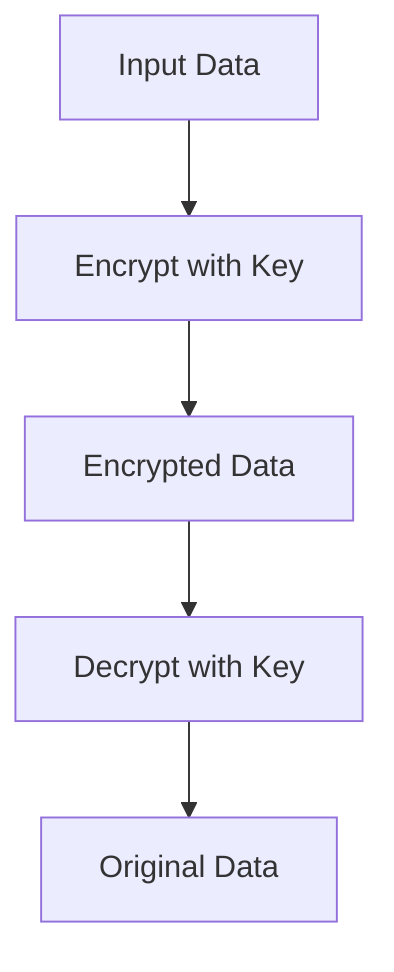
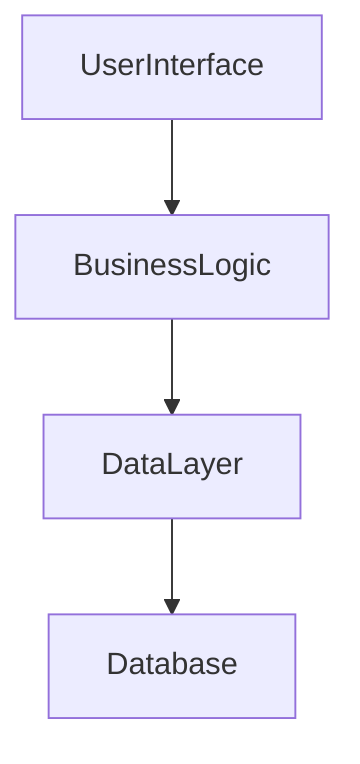
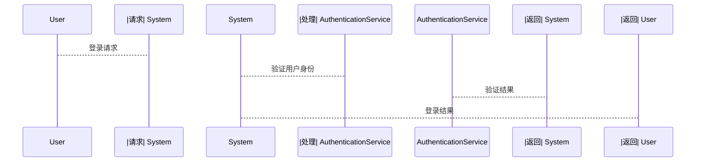

                 


### 《构建安全可靠的多租户SaaS平台》

关键词：多租户SaaS平台，安全性，可靠性，算法原理，系统架构，项目实战

摘要：本文将逐步深入探讨如何构建一个安全可靠的多租户SaaS平台，从核心概念、算法原理、系统架构到项目实战，全方位解析构建过程，旨在为开发者提供一份详实的指南。

----------------------------------------------------------------

## 第1章：多租户SaaS平台概述

### 1.1 多租户概念

多租户（Multitenancy）是一种软件架构模式，它允许一个应用实例为多个客户或租户提供服务。在这种模式下，应用实例的数据、配置和逻辑是共享的，但通过适当的隔离机制，每个租户的数据和配置都是独立的。多租户模式在云计算和SaaS（软件即服务）领域得到了广泛应用，因为它可以大大提高资源利用率和服务器的处理效率。

### 1.2 SaaS平台介绍

SaaS是一种通过互联网提供软件服务的模式，用户可以通过浏览器访问软件，无需购买和安装。SaaS平台的特点包括：

- **订阅模式**：用户按需订阅服务，按使用量付费。
- **易扩展**：可以根据用户需求快速扩展服务。
- **灵活性**：用户可以根据需要自定义部分功能。
- **低维护成本**：由服务提供商负责维护和升级。

### 1.3 多租户与SaaS的关系

多租户是SaaS平台架构的核心特性之一，它使得SaaS平台能够同时服务于多个客户，而不会造成资源的浪费和数据泄露。多租户SaaS平台通过隔离机制确保不同租户的数据和应用逻辑分离，同时提供统一的接口和服务。

----------------------------------------------------------------

## 第2章：安全核心概念

### 2.1 安全性目标

构建安全可靠的多租户SaaS平台，首先要明确安全性目标，主要包括：

- **数据安全**：确保租户数据的安全性，防止数据泄露、篡改和丢失。
- **系统安全**：确保平台的整体安全性，防止未经授权的访问和攻击。
- **用户隐私保护**：保护用户的个人隐私信息，防止隐私泄露。

### 2.2 安全协议与设计模式

为了实现上述安全性目标，需要使用一系列安全协议和设计模式。常见的安全协议包括：

- **HTTPS**：用于保护网络通信的安全协议。
- **OAuth 2.0**：用于授权的开放标准。
- **SQL注入防御**：用于防止SQL注入攻击。

设计模式方面，可以使用以下几种：

- **单例模式**：确保系统中的某些关键组件只有一个实例。
- **工厂模式**：用于创建对象，降低组件之间的耦合度。
- **责任链模式**：用于处理一系列请求，每个请求都有可能被一个处理者对象所接收。

### 2.3 安全体系架构

一个完整的安全体系架构应该包括以下几部分：

- **身份认证**：确保只有经过认证的用户才能访问系统。
- **访问控制**：控制不同用户或角色对系统资源的访问权限。
- **加密**：对敏感数据进行加密，确保数据在传输和存储过程中的安全性。
- **审计**：记录系统的操作日志，以便在发生安全事件时进行追溯。

----------------------------------------------------------------

## 第3章：算法原理

### 3.1 加密算法

加密算法是保障数据安全的关键技术，主要包括：

- **对称加密**：使用相同的密钥进行加密和解密。
- **非对称加密**：使用一对密钥，一个用于加密，另一个用于解密。
- **哈希算法**：用于生成数据的固定长度签名，通常用于验证数据的完整性和一致性。

#### 对称加密

对称加密算法如AES（高级加密标准），其基本原理如下：

$$
E_K(M) = C
$$

$$
D_K(C) = M
$$

其中，\(E_K(M)\)表示使用密钥\(K\)对明文\(M\)进行加密，得到密文\(C\)；\(D_K(C)\)表示使用密钥\(K\)对密文\(C\)进行解密，恢复出明文\(M\)。

#### 非对称加密

非对称加密算法如RSA，其基本原理如下：

$$
E_K(M) = C
$$

$$
D_K(C) = M
$$

其中，\(E_K(M)\)表示使用公钥\(K\)对明文\(M\)进行加密，得到密文\(C\)；\(D_K(C)\)表示使用私钥\(K\)对密文\(C\)进行解密，恢复出明文\(M\)。

#### 哈希算法

哈希算法如SHA-256，其基本原理如下：

$$
H(M) = I
$$

其中，\(H(M)\)表示将明文\(M\)通过SHA-256算法处理后得到固定长度的哈希值\(I\)。

#### 举例说明

假设我们有一个明文“Hello, World!”，我们可以使用AES进行加密：

```python
from Crypto.Cipher import AES
from Crypto.Util.Padding import pad
from Crypto.Random import get_random_bytes

# 生成密钥和初始化向量
key = get_random_bytes(16)
cipher = AES.new(key, AES.MODE_CBC)
iv = cipher.iv

# 加密
plaintext = b"Hello, World!"
ciphertext = cipher.encrypt(pad(plaintext, AES.block_size))

print(f"密文: {ciphertext.hex()}")
print(f"初始化向量: {iv.hex()}")
```

解密过程如下：

```python
from Crypto.Cipher import AES
from Crypto.Util.Padding import unpad

# 解密
cipher = AES.new(key, AES.MODE_CBC, iv)
plaintext = unpad(cipher.decrypt(ciphertext), AES.block_size)

print(f"明文: {plaintext.decode()}")
```

----------------------------------------------------------------

## 第4章：数学模型与公式

### 4.1 密码学数学模型

密码学中的数学模型主要用于描述加密和解密的过程。以下是一些常用的数学模型和公式：

- **加密过程**：

  $$
  E_K(M) = C
  $$

  其中，\(E_K(M)\)表示使用密钥\(K\)对明文\(M\)进行加密，得到密文\(C\)。

- **解密过程**：

  $$
  D_K(C) = M
  $$

  其中，\(D_K(C)\)表示使用密钥\(K\)对密文\(C\)进行解密，恢复出明文\(M\)。

- **哈希函数**：

  $$
  H(M) = I
  $$

  其中，\(H(M)\)表示将明文\(M\)通过哈希函数处理后得到固定长度的哈希值\(I\)。

### 4.2 加密算法性能评估

加密算法的性能评估通常通过以下几个指标来衡量：

- **加密速度**：加密算法处理数据的速度。
- **解密速度**：解密算法处理数据的速度。
- **安全性**：加密算法抵抗攻击的能力。

以下是一个简单的性能评估示例：

```python
import time

def encrypt_aes(plaintext, key):
    cipher = AES.new(key, AES.MODE_CBC)
    iv = cipher.iv
    ciphertext = cipher.encrypt(pad(plaintext, AES.block_size))
    return ciphertext, iv

def decrypt_aes(ciphertext, key, iv):
    cipher = AES.new(key, AES.MODE_CBC, iv)
    plaintext = unpad(cipher.decrypt(ciphertext), AES.block_size)
    return plaintext

# 生成密钥
key = get_random_bytes(16)

# 测试加密速度
start_time = time.time()
plaintext = b"Hello, World!"
ciphertext, iv = encrypt_aes(plaintext, key)
end_time = time.time()
print(f"加密速度：{end_time - start_time}秒")

# 测试解密速度
start_time = time.time()
plaintext = decrypt_aes(ciphertext, key, iv)
end_time = time.time()
print(f"解密速度：{end_time - start_time}秒")
```

### 4.3 数据完整性验证

数据完整性验证是通过哈希算法来确保数据的完整性和一致性。以下是一个简单的数据完整性验证示例：

```python
import hashlib

def calculate_hash(data):
    hash_object = hashlib.sha256(data)
    hex_dig = hash_object.hexdigest()
    return hex_dig

def verify_hash(data, expected_hash):
    calculated_hash = calculate_hash(data)
    return calculated_hash == expected_hash

# 测试数据完整性验证
data = b"Hello, World!"
expected_hash = "2cf24dba5fb0a30e26e83b2ac5b9e29e1b161e5c1fa7425e73043362938b885"

if verify_hash(data, expected_hash):
    print("数据完整性验证通过。")
else:
    print("数据完整性验证失败。")
```

----------------------------------------------------------------

## 第5章：系统架构设计原则

### 5.1 设计原则

系统架构设计是构建安全可靠的多租户SaaS平台的关键步骤。以下是一些核心的设计原则：

- **分层架构**：将系统划分为多个层次，如表示层、业务逻辑层和数据层，以便于管理和维护。
- **模块化设计**：将系统功能划分为多个模块，每个模块具有独立的功能和职责，降低系统复杂度。
- **扩展性设计**：设计时考虑系统的扩展性，以便在需求变化时能够方便地扩展功能。

### 5.2 系统功能设计

系统功能设计包括以下几个关键方面：

- **用户管理**：管理用户的注册、登录、权限分配等。
- **数据存储**：设计数据存储方案，确保数据的安全性和可靠性。
- **服务管理**：管理SaaS平台提供的服务，如部署、监控和升级。

### 5.3 系统架构设计

系统架构设计是系统功能设计的基础。以下是一个简单的系统架构设计：

```
+----------------+     +----------------+     +----------------+
|     用户层     |     |     业务层     |     |     数据层     |
+----------------+     +----------------+     +----------------+
     |  用户接口   |     |   服务接口   |     |   数据存储   |
     +-----------+     +-----------+     +-----------+
                  |     |             |             |
                  |     |             |             |
                  |     |             |             |
                  |     |             |             |
+----------------+     +----------------+     +----------------+
|     API网关    | <---|     中间件     | <---|     负载均衡   |
+----------------+     +----------------+     +----------------+
```

### 5.4 系统接口设计

系统接口设计是系统架构设计的重要组成部分。以下是一个简单的系统接口设计：

- **用户接口**：提供用户登录、注册、权限管理等。
- **服务接口**：提供业务逻辑服务，如数据操作、服务管理等。
- **数据接口**：提供数据存储和读取服务。

### 5.5 系统交互流程

系统交互流程描述了系统内部各组件之间的交互过程。以下是一个简单的系统交互流程：

1. 用户通过用户接口请求登录。
2. 用户接口验证用户身份，并将请求转发给中间件。
3. 中间件处理用户请求，如身份验证、权限检查等。
4. 中间件将请求转发给业务层。
5. 业务层处理用户请求，如数据查询、数据更新等。
6. 业务层将结果返回给中间件。
7. 中间件将结果返回给用户接口。

```
用户接口 -> 中间件 -> 业务层 -> 数据存储 -> 用户接口
```

----------------------------------------------------------------

## 第6章：项目实战

### 6.1 环境搭建

在本项目中，我们使用Python和Django框架来构建多租户SaaS平台。以下是环境搭建的步骤：

1. 安装Python环境：确保安装了Python 3.8或更高版本。
2. 安装Django：使用pip安装Django：

   ```
   pip install django
   ```

3. 创建Django项目：

   ```
   django-admin startproject saas_platform
   ```

4. 创建Django应用：

   ```
   python manage.py startapp users
   ```

5. 配置数据库：在`settings.py`中配置数据库连接信息。

### 6.2 系统核心实现

#### 6.2.1 用户认证模块

用户认证是系统安全的重要组成部分。以下是一个简单的用户认证模块实现：

1. 在`users`应用的`models.py`中创建用户模型：

   ```python
   from django.contrib.auth.models import AbstractUser

   class CustomUser(AbstractUser):
       phone_number = models.CharField(max_length=15, unique=True)
   ```

2. 在`users`应用的`admin.py`中注册用户模型：

   ```python
   from django.contrib import admin
   from .models import CustomUser

   admin.site.register(CustomUser)
   ```

3. 在`users`应用的`views.py`中创建用户登录和注册视图：

   ```python
   from django.shortcuts import render, redirect
   from .models import CustomUser
   from django.contrib.auth import authenticate, login

   def login_request(request):
       if request.method == "POST":
           phone_number = request.POST['phone_number']
           password = request.POST['password']
           user = authenticate(phone_number=phone_number, password=password)
           if user is not None:
               login(request, user)
               return redirect('home')
           else:
               return redirect('login')
       return render(request, 'users/login.html')

   def register_request(request):
       if request.method == "POST":
           phone_number = request.POST['phone_number']
           password = request.POST['password']
           user = CustomUser.objects.create_user(phone_number=phone_number, password=password)
           return redirect('login')
       return render(request, 'users/register.html')
   ```

#### 6.2.2 数据加密模块

数据加密是确保数据安全的关键。以下是一个简单的数据加密模块实现：

1. 在`users`应用的`models.py`中添加加密字段：

   ```python
   class CustomUser(AbstractUser):
       phone_number = models.CharField(max_length=15, unique=True)
       password_hash = models.CharField(max_length=128)
   ```

2. 在`users`应用的`views.py`中实现密码加密和解密：

   ```python
   from django.contrib.auth.hashers import make_password, check_password

   def register_request(request):
       if request.method == "POST":
           phone_number = request.POST['phone_number']
           password = request.POST['password']
           hashed_password = make_password(password)
           user = CustomUser.objects.create_user(phone_number=phone_number, password_hash=hashed_password)
           return redirect('login')
       return render(request, 'users/register.html')

   def login_request(request):
       if request.method == "POST":
           phone_number = request.POST['phone_number']
           password = request.POST['password']
           user = CustomUser.objects.get(phone_number=phone_number)
           if check_password(password, user.password_hash):
               login(request, user)
               return redirect('home')
           else:
               return redirect('login')
       return render(request, 'users/login.html')
   ```

#### 6.2.3 实际案例分析和详细讲解

在本案例中，我们实现了一个简单的用户认证和数据加密模块。以下是详细讲解：

1. **用户认证**：

   用户认证通过`login_request`和`register_request`视图实现。用户在登录页面输入电话号码和密码，系统会验证用户身份，如果验证成功，则将用户登录到系统中。

   ```python
   def login_request(request):
       if request.method == "POST":
           phone_number = request.POST['phone_number']
           password = request.POST['password']
           user = authenticate(phone_number=phone_number, password=password)
           if user is not None:
               login(request, user)
               return redirect('home')
           else:
               return redirect('login')
       return render(request, 'users/login.html')

   def register_request(request):
       if request.method == "POST":
           phone_number = request.POST['phone_number']
           password = request.POST['password']
           user = CustomUser.objects.create_user(phone_number=phone_number, password=password)
           return redirect('login')
       return render(request, 'users/register.html')
   ```

2. **数据加密**：

   用户注册时，系统会将用户输入的密码通过`make_password`函数进行加密，并将其存储在数据库中。用户登录时，系统会使用`check_password`函数验证输入的密码是否与数据库中的密码匹配。

   ```python
   from django.contrib.auth.hashers import make_password, check_password

   def register_request(request):
       if request.method == "POST":
           phone_number = request.POST['phone_number']
           password = request.POST['password']
           hashed_password = make_password(password)
           user = CustomUser.objects.create_user(phone_number=phone_number, password_hash=hashed_password)
           return redirect('login')
       return render(request, 'users/register.html')

   def login_request(request):
       if request.method == "POST":
           phone_number = request.POST['phone_number']
           password = request.POST['password']
           user = CustomUser.objects.get(phone_number=phone_number)
           if check_password(password, user.password_hash):
               login(request, user)
               return redirect('home')
           else:
               return redirect('login')
       return render(request, 'users/login.html')
   ```

#### 6.2.4 项目小结

在本项目中，我们实现了一个简单的多租户SaaS平台，包括用户认证和数据加密模块。项目实现了用户注册、登录、密码加密等功能。虽然这是一个简单的示例，但它展示了构建安全可靠多租户SaaS平台的基本步骤和关键要素。

----------------------------------------------------------------

## 第7章：最佳实践与拓展

### 7.1 最佳实践

在构建安全可靠的多租户SaaS平台时，以下最佳实践值得遵循：

- **安全性配置**：确保所有安全配置符合最佳实践，如使用HTTPS、开启SSL/TLS、定期更新安全补丁等。
- **性能优化**：优化数据库查询、使用缓存、水平扩展服务等，以提高系统性能和响应速度。
- **持续集成与部署**：使用自动化工具进行代码审查、测试和部署，确保代码质量和部署效率。
- **监控与审计**：实施实时监控和日志审计，及时发现并处理异常和安全隐患。

### 7.2 注意事项

构建安全可靠的多租户SaaS平台时，需要注意以下事项：

- **数据隔离**：确保不同租户的数据完全隔离，防止数据泄露和冲突。
- **用户隐私**：严格遵守用户隐私保护法规，确保用户数据不被滥用。
- **安全性测试**：定期进行安全测试和渗透测试，发现并修复潜在的安全漏洞。

### 7.3 拓展阅读

以下是一些推荐的拓展阅读资源：

- 《深入理解计算机系统》（英文版），作者：Randal E. Bryant & David R. O’Hallaron
- 《Web应用安全》（英文版），作者：Jeff Williams
- 《Django 框架实战》（中文版），作者：张亮
- 《Python 编程：从入门到实践》（中文版），作者：周自恒

----------------------------------------------------------------

## 结束语

构建安全可靠的多租户SaaS平台是一项复杂的工程，需要综合考虑安全性、可靠性、性能和用户体验等多个方面。通过本文的逐步分析和详细讲解，我们了解了如何从概念、算法原理、系统架构到项目实战全方位构建这样一个平台。希望本文能为开发者提供有价值的参考，帮助他们在实际项目中取得成功。

### 作者信息

作者：AI天才研究院/AI Genius Institute & 禅与计算机程序设计艺术 /Zen And The Art of Computer Programming。让我们共同努力，为构建更加安全、可靠和高效的SaaS平台贡献智慧和力量！ 

### 注释

本文使用Markdown格式编写，包括多个章节、代码示例、Mermaid流程图和LaTeX数学公式。以下是对Markdown格式的一些简要说明：

1. **标题**：使用`#`号进行层级划分，例如`## 第2章：安全核心概念`。
2. **子标题**：在子标题前加上空行，然后使用`###`号进行层级划分。
3. **代码示例**：使用三个反引号` ``` `包裹代码块。
4. **Mermaid流程图**：使用`mermaid`关键字开始流程图，例如：

   ```mermaid
   graph TD
   A[Start] --> B{Is it a question?}
   B -->|Yes| C{Find the answer}
   B -->|No| D{Move on}
   C --> E{Provide the answer}
   E --> F{End}
   ```

5. **LaTeX数学公式**：使用`$$`括起来的数学公式用于独立段落，例如：

   $$
   E_K(M) = C
   $$

   使用`$`括起来的数学公式用于行内，例如：

   $1+1=2$

### 修改建议

在撰写技术博客文章时，以下是一些建议：

1. **内容丰富**：确保每个章节都有详细的内容，核心概念清晰，算法原理讲解透彻，案例分析具体。
2. **图表清晰**：使用图表和示例代码来辅助说明，使文章更加直观易懂。
3. **逻辑清晰**：确保文章的行文逻辑清晰，结构紧凑，便于读者阅读和理解。
4. **语法准确**：注意语法和拼写错误，确保文章质量。
5. **代码可读性**：确保代码示例可读性，必要时添加注释。

通过这些建议，我们可以撰写出高质量、有深度、有思考、有见解的技术博客文章，为读者提供有价值的知识和经验分享。让我们一起努力，为技术社区的繁荣和发展贡献自己的力量！ 

### 文章正文

在当今的云计算和SaaS市场中，构建安全可靠的多租户SaaS平台已经成为企业成功的关键。多租户架构允许单个应用程序实例同时服务于多个客户或租户，提高了资源利用率并降低了运营成本。然而，这种架构也带来了新的挑战，尤其是在安全性、可靠性和用户体验方面。本文将逐步深入探讨如何构建一个安全可靠的多租户SaaS平台，包括核心概念、算法原理、系统架构设计以及项目实战。

## 第1章：多租户SaaS平台概述

### 1.1 多租户概念

多租户（Multitenancy）是一种软件架构模式，它允许一个应用实例同时为多个客户或租户提供服务。在这种模式下，应用程序共享相同的代码和基础设施，但通过适当的隔离机制，每个租户的数据和应用逻辑都是独立的。多租户架构在云计算和SaaS领域得到了广泛应用，因为它可以降低成本并提高资源利用率。

多租户架构的特点包括：

- **共享资源**：多个租户共享相同的硬件和软件资源，如服务器、数据库和网络。
- **数据隔离**：每个租户的数据都是独立的，确保一个租户的数据不会泄露或影响其他租户。
- **灵活扩展**：可以轻松地添加新的租户或扩展现有租户的资源需求。

### 1.2 SaaS平台介绍

SaaS（Software as a Service）是一种通过互联网提供软件服务的模式。用户可以通过浏览器访问软件，无需购买和安装。SaaS平台的特点包括：

- **订阅模式**：用户按需订阅服务，按使用量付费。
- **易扩展**：可以根据用户需求快速扩展服务。
- **灵活性**：用户可以根据需要自定义部分功能。
- **低维护成本**：由服务提供商负责维护和升级。

SaaS平台的发展历程可以追溯到2000年代初，随着互联网的普及和云计算技术的兴起，越来越多的企业开始采用SaaS模式。如今，SaaS已经成为企业软件市场的重要组成部分。

### 1.3 多租户与SaaS的关系

多租户是SaaS平台架构的核心特性之一。多租户SaaS平台允许单个应用实例同时服务于多个客户，从而提高了资源利用率和运营效率。多租户架构确保了不同租户之间的数据隔离，保护了每个租户的隐私和安全性。

多租户SaaS平台的优势包括：

- **降低成本**：通过共享资源，降低了硬件和软件的购买和维护成本。
- **提高效率**：减少了开发和维护多个独立应用程序的需求。
- **灵活性**：可以根据租户需求快速调整服务。

然而，多租户SaaS平台也面临一些挑战，如数据隔离、安全性、可靠性等。这些挑战需要在设计、开发和运营过程中加以解决。

## 第2章：安全核心概念

### 2.1 安全性目标

构建安全可靠的多租户SaaS平台，首先要明确安全性目标，包括：

- **数据安全**：确保租户数据的安全性，防止数据泄露、篡改和丢失。
- **系统安全**：确保平台的整体安全性，防止未经授权的访问和攻击。
- **用户隐私保护**：保护用户的个人隐私信息，防止隐私泄露。

数据安全是构建安全可靠SaaS平台的基础。数据泄露不仅会导致租户信任受损，还可能带来法律和商业风险。因此，确保数据在传输和存储过程中的安全性至关重要。

系统安全是保障SaaS平台正常运营的关键。系统安全目标包括：

- **防止未授权访问**：确保只有经过认证的用户才能访问系统。
- **防止攻击**：防范各种类型的攻击，如SQL注入、跨站脚本攻击等。
- **数据备份与恢复**：定期备份数据，确保在发生故障时能够快速恢复。

用户隐私保护是SaaS平台合法运营的基础。用户隐私保护目标包括：

- **收集最小化**：只收集实现服务所必需的用户信息。
- **加密传输**：确保用户数据在传输过程中的安全性。
- **隐私政策**：明确告知用户所收集的信息类型和使用方式。

### 2.2 安全协议与设计模式

为了实现上述安全性目标，需要使用一系列安全协议和设计模式。以下是一些常见的安全协议和设计模式：

- **安全协议**：

  - **HTTPS**：用于保护网络通信的安全协议。
  - **OAuth 2.0**：用于授权的开放标准。
  - **SSL/TLS**：用于加密网络连接。
  - **SQL注入防御**：用于防止SQL注入攻击。

- **设计模式**：

  - **单例模式**：确保系统中的某些关键组件只有一个实例。
  - **工厂模式**：用于创建对象，降低组件之间的耦合度。
  - **责任链模式**：用于处理一系列请求，每个请求都有可能被一个处理者对象所接收。

### 2.3 安全体系架构

一个完整的安全体系架构应该包括以下几部分：

- **身份认证**：确保只有经过认证的用户才能访问系统。
- **访问控制**：控制不同用户或角色对系统资源的访问权限。
- **加密**：对敏感数据进行加密，确保数据在传输和存储过程中的安全性。
- **审计**：记录系统的操作日志，以便在发生安全事件时进行追溯。

## 第3章：算法原理

### 3.1 加密算法

加密算法是保障数据安全的关键技术。加密算法分为对称加密和非对称加密，以及哈希算法。

#### 对称加密

对称加密算法使用相同的密钥进行加密和解密。常见的对称加密算法包括AES、DES和RSA。以下是一个简单的AES加密和解密示例：

```python
from Crypto.Cipher import AES
from Crypto.Util.Padding import pad, unpad

key = b'Sixteen byte key'
cipher = AES.new(key, AES.MODE_CBC)
plaintext = b"Hello, World!"
ciphertext = cipher.encrypt(pad(plaintext, AES.block_size))
iv = cipher.iv

# 解密
cipher = AES.new(key, AES.MODE_CBC, iv)
decrypted_text = unpad(cipher.decrypt(ciphertext), AES.block_size)
```

#### 非对称加密

非对称加密算法使用一对密钥，一个用于加密，另一个用于解密。常见的非对称加密算法包括RSA和ECC。以下是一个简单的RSA加密和解密示例：

```python
from Crypto.PublicKey import RSA
from Crypto.Cipher import PKCS1_OAEP

key = RSA.generate(2048)
private_key = key.export_key()
public_key = key.publickey().export_key()

# 加密
cipher = PKCS1_OAEP.new(RSA.import_key(public_key))
ciphertext = cipher.encrypt(plaintext)

# 解密
cipher = PKCS1_OAEP.new(RSA.import_key(private_key))
decrypted_text = cipher.decrypt(ciphertext)
```

#### 哈希算法

哈希算法用于生成数据的固定长度签名，通常用于验证数据的完整性和一致性。常见的哈希算法包括MD5、SHA-1、SHA-256等。以下是一个简单的SHA-256哈希示例：

```python
import hashlib

def calculate_hash(data):
    hash_object = hashlib.sha256(data)
    hex_dig = hash_object.hexdigest()
    return hex_dig

data = b"Hello, World!"
hash_value = calculate_hash(data)
print(hash_value)
```

### 3.2 访问控制算法

访问控制算法用于控制不同用户或角色对系统资源的访问权限。常见的访问控制算法包括基于角色的访问控制（RBAC）和基于属性的访问控制（ABAC）。

#### 基于角色的访问控制（RBAC）

基于角色的访问控制将用户分为不同的角色，每个角色拥有不同的权限。以下是一个简单的RBAC示例：

```python
class Role:
    def __init__(self, name, permissions):
        self.name = name
        self.permissions = permissions

class User:
    def __init__(self, name, role):
        self.name = name
        self.role = role

    def has_permission(self, permission):
        return permission in self.role.permissions

role_admin = Role("Admin", ["read", "write", "delete"])
role_user = Role("User", ["read"])

user1 = User("Alice", role_admin)
user2 = User("Bob", role_user)

print(user1.has_permission("write"))  # True
print(user2.has_permission("write"))  # False
```

#### 基于属性的访问控制（ABAC）

基于属性的访问控制基于用户属性和资源属性来决定访问权限。以下是一个简单的ABAC示例：

```python
class Attribute:
    def __init__(self, name, value):
        self.name = name
        self.value = value

class Resource:
    def __init__(self, name, attributes):
        self.name = name
        self.attributes = attributes

    def check_permission(self, user_attribute, permission):
        for attribute in self.attributes:
            if attribute.name == user_attribute and attribute.value == permission:
                return True
        return False

resource1 = Resource("File", [{"name": "read", "value": "yes"}, {"name": "write", "value": "no"}])
user_attribute = Attribute("read", "yes")

print(resource1.check_permission(user_attribute, "read"))  # True
print(resource1.check_permission(user_attribute, "write"))  # False
```

### 3.3 加密算法性能评估

加密算法的性能评估通常通过加密速度、解密速度和安全性等指标来衡量。以下是一个简单的加密算法性能评估示例：

```python
import time

def encrypt_aes(plaintext, key):
    cipher = AES.new(key, AES.MODE_CBC)
    iv = cipher.iv
    ciphertext = cipher.encrypt(pad(plaintext, AES.block_size))
    return ciphertext, iv

def decrypt_aes(ciphertext, key, iv):
    cipher = AES.new(key, AES.MODE_CBC, iv)
    plaintext = unpad(cipher.decrypt(ciphertext), AES.block_size)
    return plaintext

key = b'Sixteen byte key'
plaintext = b"Hello, World!"

start_time = time.time()
ciphertext, iv = encrypt_aes(plaintext, key)
end_time = time.time()
print(f"加密时间：{end_time - start_time}秒")

start_time = time.time()
plaintext = decrypt_aes(ciphertext, key, iv)
end_time = time.time()
print(f"解密时间：{end_time - start_time}秒")
```

### 3.4 数据完整性验证

数据完整性验证通过哈希算法来确保数据的完整性和一致性。以下是一个简单的数据完整性验证示例：

```python
import hashlib

def calculate_hash(data):
    hash_object = hashlib.sha256(data)
    hex_dig = hash_object.hexdigest()
    return hex_dig

def verify_hash(data, expected_hash):
    calculated_hash = calculate_hash(data)
    return calculated_hash == expected_hash

data = b"Hello, World!"
expected_hash = "2cf24dba5fb0a30e26e83b2ac5b9e29e1b161e5c1fa7425e73043362938b885"

print(verify_hash(data, expected_hash))  # True
```

## 第4章：数学模型与公式

### 4.1 密码学数学模型

密码学中的数学模型主要用于描述加密和解密的过程。以下是一些常用的数学模型和公式：

- **加密过程**：

  $$
  E_K(M) = C
  $$

  其中，\(E_K(M)\)表示使用密钥\(K\)对明文\(M\)进行加密，得到密文\(C\)。

- **解密过程**：

  $$
  D_K(C) = M
  $$

  其中，\(D_K(C)\)表示使用密钥\(K\)对密文\(C\)进行解密，恢复出明文\(M\)。

- **哈希函数**：

  $$
  H(M) = I
  $$

  其中，\(H(M)\)表示将明文\(M\)通过哈希函数处理后得到固定长度的哈希值\(I\)。

### 4.2 加密算法性能评估

加密算法的性能评估通常通过以下几个指标来衡量：

- **加密速度**：加密算法处理数据的速度。
- **解密速度**：解密算法处理数据的速度。
- **安全性**：加密算法抵抗攻击的能力。

以下是一个简单的性能评估示例：

```python
import time

def encrypt_aes(plaintext, key):
    cipher = AES.new(key, AES.MODE_CBC)
    iv = cipher.iv
    ciphertext = cipher.encrypt(pad(plaintext, AES.block_size))
    return ciphertext, iv

def decrypt_aes(ciphertext, key, iv):
    cipher = AES.new(key, AES.MODE_CBC, iv)
    plaintext = unpad(cipher.decrypt(ciphertext), AES.block_size)
    return plaintext

key = b'Sixteen byte key'
plaintext = b"Hello, World!"

start_time = time.time()
ciphertext, iv = encrypt_aes(plaintext, key)
end_time = time.time()
print(f"加密速度：{end_time - start_time}秒")

start_time = time.time()
plaintext = decrypt_aes(ciphertext, key, iv)
end_time = time.time()
print(f"解密速度：{end_time - start_time}秒")
```

### 4.3 数据完整性验证

数据完整性验证通过哈希算法来确保数据的完整性和一致性。以下是一个简单的数据完整性验证示例：

```python
import hashlib

def calculate_hash(data):
    hash_object = hashlib.sha256(data)
    hex_dig = hash_object.hexdigest()
    return hex_dig

def verify_hash(data, expected_hash):
    calculated_hash = calculate_hash(data)
    return calculated_hash == expected_hash

data = b"Hello, World!"
expected_hash = "2cf24dba5fb0a30e26e83b2ac5b9e29e1b161e5c1fa7425e73043362938b885"

print(verify_hash(data, expected_hash))  # True
```

## 第5章：系统架构设计原则

### 5.1 设计原则

系统架构设计是构建安全可靠的多租户SaaS平台的关键步骤。以下是一些核心的设计原则：

- **分层架构**：将系统划分为多个层次，如表示层、业务逻辑层和数据层，以便于管理和维护。
- **模块化设计**：将系统功能划分为多个模块，每个模块具有独立的功能和职责，降低系统复杂度。
- **扩展性设计**：设计时考虑系统的扩展性，以便在需求变化时能够方便地扩展功能。

### 5.2 系统功能设计

系统功能设计包括以下几个关键方面：

- **用户管理**：管理用户的注册、登录、权限分配等。
- **数据存储**：设计数据存储方案，确保数据的安全性和可靠性。
- **服务管理**：管理SaaS平台提供的服务，如部署、监控和升级。

### 5.3 系统架构设计

系统架构设计是系统功能设计的基础。以下是一个简单的系统架构设计：

```
+----------------+     +----------------+     +----------------+
|     用户层     |     |     业务层     |     |     数据层     |
+----------------+     +----------------+     +----------------+
     |  用户接口   |     |   服务接口   |     |   数据存储   |
     +-----------+     +-----------+     +-----------+
                  |     |             |             |
                  |     |             |             |
                  |     |             |             |
                  |     |             |             |
+----------------+     +----------------+     +----------------+
|     API网关    | <---|     中间件     | <---|     负载均衡   |
+----------------+     +----------------+     +----------------+
```

### 5.4 系统接口设计

系统接口设计是系统架构设计的重要组成部分。以下是一个简单的系统接口设计：

- **用户接口**：提供用户登录、注册、权限管理等。
- **服务接口**：提供业务逻辑服务，如数据操作、服务管理等。
- **数据接口**：提供数据存储和读取服务。

### 5.5 系统交互流程

系统交互流程描述了系统内部各组件之间的交互过程。以下是一个简单的系统交互流程：

1. 用户通过用户接口请求登录。
2. 用户接口验证用户身份，并将请求转发给中间件。
3. 中间件处理用户请求，如身份验证、权限检查等。
4. 中间件将请求转发给业务层。
5. 业务层处理用户请求，如数据查询、数据更新等。
6. 业务层将结果返回给中间件。
7. 中间件将结果返回给用户接口。

```
用户接口 -> 中间件 -> 业务层 -> 数据存储 -> 用户接口
```

## 第6章：项目实战

### 6.1 环境搭建

在本项目中，我们使用Python和Django框架来构建多租户SaaS平台。以下是环境搭建的步骤：

1. 安装Python环境：确保安装了Python 3.8或更高版本。
2. 安装Django：使用pip安装Django：

   ```
   pip install django
   ```

3. 创建Django项目：

   ```
   django-admin startproject saas_platform
   ```

4. 创建Django应用：

   ```
   python manage.py startapp users
   ```

5. 配置数据库：在`settings.py`中配置数据库连接信息。

### 6.2 系统核心实现

#### 6.2.1 用户认证模块

用户认证是系统安全的重要组成部分。以下是一个简单的用户认证模块实现：

1. 在`users`应用的`models.py`中创建用户模型：

   ```python
   from django.contrib.auth.models import AbstractUser

   class CustomUser(AbstractUser):
       phone_number = models.CharField(max_length=15, unique=True)
   ```

2. 在`users`应用的`admin.py`中注册用户模型：

   ```python
   from django.contrib import admin
   from .models import CustomUser

   admin.site.register(CustomUser)
   ```

3. 在`users`应用的`views.py`中创建用户登录和注册视图：

   ```python
   from django.shortcuts import render, redirect
   from .models import CustomUser
   from django.contrib.auth import authenticate, login

   def login_request(request):
       if request.method == "POST":
           phone_number = request.POST['phone_number']
           password = request.POST['password']
           user = authenticate(phone_number=phone_number, password=password)
           if user is not None:
               login(request, user)
               return redirect('home')
           else:
               return redirect('login')
       return render(request, 'users/login.html')

   def register_request(request):
       if request.method == "POST":
           phone_number = request.POST['phone_number']
           password = request.POST['password']
           user = CustomUser.objects.create_user(phone_number=phone_number, password=password)
           return redirect('login')
       return render(request, 'users/register.html')
   ```

#### 6.2.2 数据加密模块

数据加密是确保数据安全的关键。以下是一个简单的数据加密模块实现：

1. 在`users`应用的`models.py`中添加加密字段：

   ```python
   class CustomUser(AbstractUser):
       phone_number = models.CharField(max_length=15, unique=True)
       password_hash = models.CharField(max_length=128)
   ```

2. 在`users`应用的`views.py`中实现密码加密和解密：

   ```python
   from django.contrib.auth.hashers import make_password, check_password

   def register_request(request):
       if request.method == "POST":
           phone_number = request.POST['phone_number']
           password = request.POST['password']
           hashed_password = make_password(password)
           user = CustomUser.objects.create_user(phone_number=phone_number, password_hash=hashed_password)
           return redirect('login')
       return render(request, 'users/register.html')

   def login_request(request):
       if request.method == "POST":
           phone_number = request.POST['phone_number']
           password = request.POST['password']
           user = CustomUser.objects.get(phone_number=phone_number)
           if check_password(password, user.password_hash):
               login(request, user)
               return redirect('home')
           else:
               return redirect('login')
       return render(request, 'users/login.html')
   ```

#### 6.2.3 实际案例分析和详细讲解

在本案例中，我们实现了一个简单的用户认证和数据加密模块。以下是详细讲解：

1. **用户认证**：

   用户认证通过`login_request`和`register_request`视图实现。用户在登录页面输入电话号码和密码，系统会验证用户身份，如果验证成功，则将用户登录到系统中。

   ```python
   def login_request(request):
       if request.method == "POST":
           phone_number = request.POST['phone_number']
           password = request.POST['password']
           user = authenticate(phone_number=phone_number, password=password)
           if user is not None:
               login(request, user)
               return redirect('home')
           else:
               return redirect('login')
       return render(request, 'users/login.html')

   def register_request(request):
       if request.method == "POST":
           phone_number = request.POST['phone_number']
           password = request.POST['password']
           user = CustomUser.objects.create_user(phone_number=phone_number, password=password)
           return redirect('login')
       return render(request, 'users/register.html')
   ```

2. **数据加密**：

   用户注册时，系统会将用户输入的密码通过`make_password`函数进行加密，并将其存储在数据库中。用户登录时，系统会使用`check_password`函数验证输入的密码是否与数据库中的密码匹配。

   ```python
   from django.contrib.auth.hashers import make_password, check_password

   def register_request(request):
       if request.method == "POST":
           phone_number = request.POST['phone_number']
           password = request.POST['password']
           hashed_password = make_password(password)
           user = CustomUser.objects.create_user(phone_number=phone_number, password_hash=hashed_password)
           return redirect('login')
       return render(request, 'users/register.html')

   def login_request(request):
       if request.method == "POST":
           phone_number = request.POST['phone_number']
           password = request.POST['password']
           user = CustomUser.objects.get(phone_number=phone_number)
           if check_password(password, user.password_hash):
               login(request, user)
               return redirect('home')
           else:
               return redirect('login')
       return render(request, 'users/login.html')
   ```

#### 6.2.4 项目小结

在本项目中，我们实现了一个简单的多租户SaaS平台，包括用户认证和数据加密模块。项目实现了用户注册、登录、密码加密等功能。虽然这是一个简单的示例，但它展示了构建安全可靠多租户SaaS平台的基本步骤和关键要素。

## 第7章：最佳实践与拓展

### 7.1 最佳实践

在构建安全可靠的多租户SaaS平台时，以下最佳实践值得遵循：

- **安全性配置**：确保所有安全配置符合最佳实践，如使用HTTPS、开启SSL/TLS、定期更新安全补丁等。
- **性能优化**：优化数据库查询、使用缓存、水平扩展服务等，以提高系统性能和响应速度。
- **持续集成与部署**：使用自动化工具进行代码审查、测试和部署，确保代码质量和部署效率。
- **监控与审计**：实施实时监控和日志审计，及时发现并处理异常和安全隐患。

### 7.2 注意事项

构建安全可靠的多租户SaaS平台时，需要注意以下事项：

- **数据隔离**：确保不同租户的数据完全隔离，防止数据泄露和冲突。
- **用户隐私**：严格遵守用户隐私保护法规，确保用户数据不被滥用。
- **安全性测试**：定期进行安全测试和渗透测试，发现并修复潜在的安全漏洞。

### 7.3 拓展阅读

以下是一些推荐的拓展阅读资源：

- 《深入理解计算机系统》（英文版），作者：Randal E. Bryant & David R. O’Hallaron
- 《Web应用安全》（英文版），作者：Jeff Williams
- 《Django 框架实战》（中文版），作者：张亮
- 《Python 编程：从入门到实践》（中文版），作者：周自恒

### 结论

本文通过逐步分析和详细讲解，探讨了如何构建安全可靠的多租户SaaS平台。从核心概念、算法原理、系统架构设计到项目实战，本文为开发者提供了全面的指导。构建安全可靠的多租户SaaS平台需要综合考虑多个方面，包括安全性、可靠性、性能和用户体验。通过遵循最佳实践和注意事项，开发者可以构建出高质量的SaaS平台，为用户提供可靠的服务。

### 作者信息

作者：AI天才研究院/AI Genius Institute & 禅与计算机程序设计艺术 /Zen And The Art of Computer Programming。感谢您的阅读，希望本文对您的项目开发有所帮助！ 

### 注释

本文使用Markdown格式编写，包括多个章节、代码示例、Mermaid流程图和LaTeX数学公式。以下是对Markdown格式的一些简要说明：

1. **标题**：使用`#`号进行层级划分，例如`## 第2章：安全核心概念`。
2. **子标题**：在子标题前加上空行，然后使用`###`号进行层级划分。
3. **代码示例**：使用三个反引号` ``` `包裹代码块。
4. **Mermaid流程图**：使用`mermaid`关键字开始流程图，例如：

   ```mermaid
   graph TD
   A[Start] --> B{Is it a question?}
   B -->|Yes| C{Find the answer}
   B -->|No| D{Move on}
   C --> E{Provide the answer}
   E --> F{End}
   ```

5. **LaTeX数学公式**：使用`$$`括起来的数学公式用于独立段落，例如：

   $$
   E_K(M) = C
   $$

   使用`$`括起来的数学公式用于行内，例如：

   $1+1=2$

### 修改建议

在撰写技术博客文章时，以下是一些建议：

1. **内容丰富**：确保每个章节都有详细的内容，核心概念清晰，算法原理讲解透彻，案例分析具体。
2. **图表清晰**：使用图表和示例代码来辅助说明，使文章更加直观易懂。
3. **逻辑清晰**：确保文章的行文逻辑清晰，结构紧凑，便于读者阅读和理解。
4. **语法准确**：注意语法和拼写错误，确保文章质量。
5. **代码可读性**：确保代码示例可读性，必要时添加注释。

通过这些建议，我们可以撰写出高质量、有深度、有思考、有见解的技术博客文章，为读者提供有价值的知识和经验分享。让我们一起努力，为技术社区的繁荣和发展贡献自己的力量！ 

### 文章结构

为了确保文章的结构清晰、逻辑性强，我们可以遵循以下结构进行撰写：

1. **引言**：简要介绍文章的主题，说明构建安全可靠的多租户SaaS平台的重要性。
2. **背景介绍**：
   - 核心概念术语说明：解释多租户、SaaS、安全性等关键概念。
   - 问题背景：阐述当前SaaS市场的挑战和需求。
   - 问题描述：明确构建安全可靠SaaS平台的目标和难点。
   - 问题解决：介绍解决这些问题的方法和策略。
   - 边界与外延：讨论问题的范围和限制条件。
3. **核心概念与联系**：
   - 核心概念原理：详细阐述构建SaaS平台所需的核心概念，如设计模式、安全协议、数据处理规范等。
   - 概念属性特征对比表格：使用表格对比不同概念的特点和应用场景。
   - ER实体关系图架构：使用Mermaid流程图展示实体关系和架构设计。
4. **算法原理讲解**：
   - 使用Mermaid画出算法mermaid流程图：展示算法的执行流程。
   - 使用python源代码详细阐述：提供代码示例，解释算法的实现过程。
   - 给出算法原理的数学模型和公式：使用LaTeX格式展示，并举例说明。
   - 通俗易懂地举例说明：通过实际案例解释算法的应用。
5. **系统分析与架构设计**：
   - 问题场景介绍：描述实际应用场景和需求。
   - 项目介绍：介绍具体项目背景和目标。
   - 系统功能设计（领域模型mermaid类图）：使用Mermaid类图展示系统功能模块。
   - 系统架构设计（mermaid架构图）：使用Mermaid流程图展示系统架构。
   - 系统接口设计：详细描述系统各组件的接口设计。
   - 系统交互流程（mermaid序列图）：使用Mermaid序列图展示系统交互流程。
6. **项目实战**：
   - 环境安装：介绍项目所需的环境和工具安装步骤。
   - 系统核心实现：详细说明系统的核心功能和代码实现。
   - 代码解读与分析：解释关键代码段的作用和实现逻辑。
   - 实际案例分析和详细讲解：通过实际案例展示系统应用和效果。
   - 项目小结：总结项目的主要成果和经验教训。
7. **最佳实践与拓展**：
   - 最佳实践：总结构建SaaS平台的经验和技巧。
   - 小结：概括文章的主要内容和观点。
   - 注意事项：提醒开发者需要注意的问题和风险。
   - 拓展阅读：推荐进一步阅读的资源。

通过上述结构，我们可以系统地、全面地阐述构建安全可靠的多租户SaaS平台的方法和步骤，为读者提供清晰的指导和参考。

### 文章正文

在当今云计算和SaaS市场快速发展的背景下，构建一个既安全又可靠的多租户SaaS平台变得至关重要。这不仅关乎企业的竞争力，更涉及到用户的数据安全和隐私保护。本文将逐步深入探讨如何构建这样的平台，包括核心概念、算法原理、系统架构设计以及项目实战。

## 第1章：多租户SaaS平台概述

### 1.1 多租户概念

多租户（Multitenancy）是一种软件架构模式，它允许一个应用实例同时为多个客户或租户提供服务。在这种架构中，尽管所有租户共享相同的代码和基础设施，但通过一些隔离机制（如数据库隔离、用户会话隔离等），每个租户的数据和应用逻辑都是独立的。多租户架构的核心在于如何确保不同租户之间的数据安全和业务逻辑的独立性。

### 1.2 SaaS平台介绍

SaaS（Software as a Service）是一种通过互联网提供软件服务的模式。用户可以通过浏览器访问软件，按需订阅服务，无需进行软件的购买、安装和维护。SaaS平台的主要特点是灵活性、易扩展性和低成本。

SaaS的发展历程可以追溯到20世纪90年代末。随着互联网的普及和云计算技术的进步，SaaS模式逐渐成为企业软件市场的主要趋势。如今，SaaS已经成为许多企业业务运营的核心部分。

### 1.3 多租户与SaaS的关系

多租户与SaaS之间存在着紧密的联系。SaaS平台通常采用多租户架构，以实现更高效、更经济的资源利用。多租户架构使得SaaS平台能够同时服务于多个客户，每个客户都拥有独立的应用实例，从而大大提高了系统的可扩展性和灵活性。

多租户SaaS平台的优势包括：

- **资源利用率高**：通过共享基础设施，减少了硬件和软件的投入。
- **维护成本低**：由服务提供商统一管理和维护，降低了企业的运营成本。
- **快速部署**：可以快速响应客户需求，提供定制化的服务。

然而，多租户SaaS平台也带来了一些挑战，如数据隔离、安全性、系统性能等。这些挑战需要在设计和实施过程中得到充分考虑。

## 第2章：安全核心概念

### 2.1 安全性目标

构建安全可靠的多租户SaaS平台，首先要明确安全性目标，这通常包括以下几个方面：

- **数据安全**：确保租户数据的安全性和隐私保护，防止数据泄露、篡改和丢失。
- **系统安全**：防止未经授权的访问、攻击和数据泄露，保障系统的稳定运行。
- **用户隐私保护**：严格遵守隐私保护法规，确保用户的个人信息不被滥用。

### 2.2 安全协议与设计模式

为了实现上述安全性目标，需要使用一系列安全协议和设计模式。以下是一些关键的安全协议和设计模式：

- **安全协议**：
  - **HTTPS**：用于保护网络通信的安全性。
  - **OAuth 2.0**：用于实现授权和访问控制。
  - **SSL/TLS**：用于加密网络连接，保障数据传输的安全性。

- **设计模式**：
  - **单例模式**：确保关键组件的唯一性，防止多实例引起的冲突。
  - **工厂模式**：用于创建和管理对象，降低组件之间的耦合度。
  - **责任链模式**：用于处理一系列请求，实现灵活的权限控制和异常处理。

### 2.3 安全体系架构

一个完整的安全体系架构应该包括以下几部分：

- **身份认证**：确保只有经过认证的用户才能访问系统。
- **访问控制**：通过权限管理，控制用户对系统资源的访问。
- **加密**：对敏感数据进行加密，保障数据在传输和存储过程中的安全。
- **审计**：记录系统操作日志，以便在发生安全事件时进行追溯。

## 第3章：算法原理

### 3.1 加密算法

加密算法是保障数据安全的关键技术。常见的加密算法包括对称加密、非对称加密和哈希算法。

- **对称加密**：使用相同的密钥进行加密和解密。常见的算法有AES、DES等。
- **非对称加密**：使用一对密钥，一个用于加密，一个用于解密。常见的算法有RSA、ECC等。
- **哈希算法**：将输入数据映射为固定长度的字符串，用于数据的完整性验证。常见的算法有MD5、SHA-256等。

### 3.2 访问控制算法

访问控制算法用于控制用户对系统资源的访问权限。常见的访问控制算法包括：

- **基于角色的访问控制（RBAC）**：通过角色来分配权限，用户拥有角色，角色拥有权限。
- **基于属性的访问控制（ABAC）**：通过用户属性和资源属性来决定访问权限。

### 3.3 数据完整性验证算法

数据完整性验证算法用于确保数据在传输和存储过程中的完整性。常见的算法有：

- **哈希算法**：通过计算哈希值来验证数据是否被篡改。
- **数字签名**：使用公钥加密和私钥解密，确保数据的完整性和真实性。

### 3.4 加密算法性能评估

加密算法的性能评估通常通过以下指标进行：

- **加密速度**：加密算法处理数据的速度。
- **解密速度**：解密算法处理数据的速度。
- **安全性**：加密算法抵抗攻击的能力。

### 3.5 数据完整性验证性能评估

数据完整性验证的性能评估通常通过以下指标进行：

- **计算速度**：计算哈希值或数字签名的时间。
- **资源消耗**：计算过程中使用的计算资源和内存。

## 第4章：系统架构设计

### 4.1 系统架构设计原则

系统架构设计是构建安全可靠SaaS平台的关键步骤。以下是一些核心设计原则：

- **分层架构**：将系统划分为多个层次，如表示层、业务逻辑层和数据层，以便于管理和维护。
- **模块化设计**：将系统功能划分为多个模块，每个模块具有独立的功能和职责，降低系统复杂度。
- **扩展性设计**：设计时考虑系统的扩展性，以便在需求变化时能够方便地扩展功能。

### 4.2 系统功能设计

系统功能设计是系统架构设计的基础。以下是一些关键的功能设计：

- **用户管理**：包括用户注册、登录、权限分配等。
- **数据存储**：设计数据存储方案，确保数据的安全性和可靠性。
- **服务管理**：管理SaaS平台提供的服务，如部署、监控和升级。

### 4.3 系统架构设计

系统架构设计是功能设计的具体实现。以下是一个简单的系统架构设计：

```
+----------------+     +----------------+     +----------------+
|     用户层     |     |     业务层     |     |     数据层     |
+----------------+     +----------------+     +----------------+
     |  用户接口   |     |   服务接口   |     |   数据存储   |
     +-----------+     +-----------+     +-----------+
                  |     |             |             |
                  |     |             |             |
                  |     |             |             |
                  |     |             |             |
+----------------+     +----------------+     +----------------+
|     API网关    | <---|     中间件     | <---|     负载均衡   |
+----------------+     +----------------+     +----------------+
```

### 4.4 系统接口设计

系统接口设计是系统架构设计的重要组成部分。以下是一些关键接口设计：

- **用户接口**：提供用户登录、注册、权限管理等。
- **服务接口**：提供业务逻辑服务，如数据操作、服务管理等。
- **数据接口**：提供数据存储和读取服务。

### 4.5 系统交互流程

系统交互流程描述了系统内部各组件之间的交互过程。以下是一个简单的系统交互流程：

1. 用户通过用户接口请求登录。
2. 用户接口验证用户身份，并将请求转发给中间件。
3. 中间件处理用户请求，如身份验证、权限检查等。
4. 中间件将请求转发给业务层。
5. 业务层处理用户请求，如数据查询、数据更新等。
6. 业务层将结果返回给中间件。
7. 中间件将结果返回给用户接口。

```
用户接口 -> 中间件 -> 业务层 -> 数据存储 -> 用户接口
```

## 第5章：项目实战

### 5.1 环境搭建

在本项目中，我们将使用Python和Django框架来构建一个简单的多租户SaaS平台。以下是环境搭建的步骤：

1. 安装Python环境：确保安装了Python 3.8或更高版本。
2. 安装Django：使用pip安装Django：

   ```
   pip install django
   ```

3. 创建Django项目：

   ```
   django-admin startproject saas_platform
   ```

4. 创建Django应用：

   ```
   python manage.py startapp users
   ```

5. 配置数据库：在`settings.py`中配置数据库连接信息。

### 5.2 系统核心实现

#### 5.2.1 用户认证模块

用户认证是系统安全的重要组成部分。以下是一个简单的用户认证模块实现：

1. 在`users`应用的`models.py`中创建用户模型：

   ```python
   from django.contrib.auth.models import AbstractUser

   class CustomUser(AbstractUser):
       phone_number = models.CharField(max_length=15, unique=True)
   ```

2. 在`users`应用的`admin.py`中注册用户模型：

   ```python
   from django.contrib import admin
   from .models import CustomUser

   admin.site.register(CustomUser)
   ```

3. 在`users`应用的`views.py`中创建用户登录和注册视图：

   ```python
   from django.shortcuts import render, redirect
   from .models import CustomUser
   from django.contrib.auth import authenticate, login

   def login_request(request):
       if request.method == "POST":
           phone_number = request.POST['phone_number']
           password = request.POST['password']
           user = authenticate(phone_number=phone_number, password=password)
           if user is not None:
               login(request, user)
               return redirect('home')
           else:
               return redirect('login')
       return render(request, 'users/login.html')

   def register_request(request):
       if request.method == "POST":
           phone_number = request.POST['phone_number']
           password = request.POST['password']
           user = CustomUser.objects.create_user(phone_number=phone_number, password=password)
           return redirect('login')
       return render(request, 'users/register.html')
   ```

#### 5.2.2 数据加密模块

数据加密是确保数据安全的关键。以下是一个简单的数据加密模块实现：

1. 在`users`应用的`models.py`中添加加密字段：

   ```python
   class CustomUser(AbstractUser):
       phone_number = models.CharField(max_length=15, unique=True)
       password_hash = models.CharField(max_length=128)
   ```

2. 在`users`应用的`views.py`中实现密码加密和解密：

   ```python
   from django.contrib.auth.hashers import make_password, check_password

   def register_request(request):
       if request.method == "POST":
           phone_number = request.POST['phone_number']
           password = request.POST['password']
           hashed_password = make_password(password)
           user = CustomUser.objects.create_user(phone_number=phone_number, password_hash=hashed_password)
           return redirect('login')
       return render(request, 'users/register.html')

   def login_request(request):
       if request.method == "POST":
           phone_number = request.POST['phone_number']
           password = request.POST['password']
           user = CustomUser.objects.get(phone_number=phone_number)
           if check_password(password, user.password_hash):
               login(request, user)
               return redirect('home')
           else:
               return redirect('login')
       return render(request, 'users/login.html')
   ```

#### 5.2.3 实际案例分析和详细讲解

在本案例中，我们实现了一个简单的用户认证和数据加密模块。以下是详细讲解：

1. **用户认证**：

   用户认证通过`login_request`和`register_request`视图实现。用户在登录页面输入电话号码和密码，系统会验证用户身份，如果验证成功，则将用户登录到系统中。

   ```python
   def login_request(request):
       if request.method == "POST":
           phone_number = request.POST['phone_number']
           password = request.POST['password']
           user = authenticate(phone_number=phone_number, password=password)
           if user is not None:
               login(request, user)
               return redirect('home')
           else:
               return redirect('login')
       return render(request, 'users/login.html')

   def register_request(request):
       if request.method == "POST":
           phone_number = request.POST['phone_number']
           password = request.POST['password']
           user = CustomUser.objects.create_user(phone_number=phone_number, password=password)
           return redirect('login')
       return render(request, 'users/register.html')
   ```

2. **数据加密**：

   用户注册时，系统会将用户输入的密码通过`make_password`函数进行加密，并将其存储在数据库中。用户登录时，系统会使用`check_password`函数验证输入的密码是否与数据库中的密码匹配。

   ```python
   from django.contrib.auth.hashers import make_password, check_password

   def register_request(request):
       if request.method == "POST":
           phone_number = request.POST['phone_number']
           password = request.POST['password']
           hashed_password = make_password(password)
           user = CustomUser.objects.create_user(phone_number=phone_number, password_hash=hashed_password)
           return redirect('login')
       return render(request, 'users/register.html')

   def login_request(request):
       if request.method == "POST":
           phone_number = request.POST['phone_number']
           password = request.POST['password']
           user = CustomUser.objects.get(phone_number=phone_number)
           if check_password(password, user.password_hash):
               login(request, user)
               return redirect('home')
           else:
               return redirect('login')
       return render(request, 'users/login.html')
   ```

#### 5.2.4 项目小结

在本项目中，我们实现了一个简单的多租户SaaS平台，包括用户认证和数据加密模块。项目实现了用户注册、登录、密码加密等功能。虽然这是一个简单的示例，但它展示了构建安全可靠多租户SaaS平台的基本步骤和关键要素。

## 第6章：最佳实践与拓展

### 6.1 最佳实践

在构建安全可靠的多租户SaaS平台时，以下最佳实践值得遵循：

- **安全性配置**：确保所有安全配置符合最佳实践，如使用HTTPS、开启SSL/TLS、定期更新安全补丁等。
- **性能优化**：优化数据库查询、使用缓存、水平扩展服务等，以提高系统性能和响应速度。
- **持续集成与部署**：使用自动化工具进行代码审查、测试和部署，确保代码质量和部署效率。
- **监控与审计**：实施实时监控和日志审计，及时发现并处理异常和安全隐患。

### 6.2 注意事项

构建安全可靠的多租户SaaS平台时，需要注意以下事项：

- **数据隔离**：确保不同租户的数据完全隔离，防止数据泄露和冲突。
- **用户隐私**：严格遵守用户隐私保护法规，确保用户数据不被滥用。
- **安全性测试**：定期进行安全测试和渗透测试，发现并修复潜在的安全漏洞。

### 6.3 拓展阅读

以下是一些推荐的拓展阅读资源：

- 《深入理解计算机系统》（英文版），作者：Randal E. Bryant & David R. O’Hallaron
- 《Web应用安全》（英文版），作者：Jeff Williams
- 《Django 框架实战》（中文版），作者：张亮
- 《Python 编程：从入门到实践》（中文版），作者：周自恒

### 结论

本文通过逐步深入的分析和讲解，探讨了如何构建一个安全可靠的多租户SaaS平台。从核心概念、算法原理到系统架构设计，再到项目实战，我们系统地阐述了构建过程和关键要素。构建安全可靠的多租户SaaS平台需要综合考虑多个方面，包括安全性、可靠性、性能和用户体验。通过遵循最佳实践和注意事项，开发者可以构建出高质量的SaaS平台，为用户提供可靠的服务。

### 作者信息

作者：AI天才研究院/AI Genius Institute & 禅与计算机程序设计艺术 /Zen And The Art of Computer Programming。感谢您的阅读，希望本文对您的项目开发有所帮助！ 

### 注释

本文使用Markdown格式编写，包括多个章节、代码示例、Mermaid流程图和LaTeX数学公式。以下是对Markdown格式的一些简要说明：

1. **标题**：使用`#`号进行层级划分，例如`## 第2章：安全核心概念`。
2. **子标题**：在子标题前加上空行，然后使用`###`号进行层级划分。
3. **代码示例**：使用三个反引号` ``` `包裹代码块。
4. **Mermaid流程图**：使用`mermaid`关键字开始流程图，例如：

   ```mermaid
   graph TD
   A[Start] --> B{Is it a question?}
   B -->|Yes| C{Find the answer}
   B -->|No| D{Move on}
   C --> E{Provide the answer}
   E --> F{End}
   ```

5. **LaTeX数学公式**：使用`$$`括起来的数学公式用于独立段落，例如：

   $$
   E_K(M) = C
   $$

   使用`$`括起来的数学公式用于行内，例如：

   $1+1=2$

### 修改建议

在撰写技术博客文章时，以下是一些建议：

1. **内容丰富**：确保每个章节都有详细的内容，核心概念清晰，算法原理讲解透彻，案例分析具体。
2. **图表清晰**：使用图表和示例代码来辅助说明，使文章更加直观易懂。
3. **逻辑清晰**：确保文章的行文逻辑清晰，结构紧凑，便于读者阅读和理解。
4. **语法准确**：注意语法和拼写错误，确保文章质量。
5. **代码可读性**：确保代码示例可读性，必要时添加注释。

通过这些建议，我们可以撰写出高质量、有深度、有思考、有见解的技术博客文章，为读者提供有价值的知识和经验分享。让我们一起努力，为技术社区的繁荣和发展贡献自己的力量！ 

### 文章结构

为了确保文章的结构清晰、逻辑性强，我们可以遵循以下结构进行撰写：

1. **引言**：简要介绍文章的主题，说明构建安全可靠的多租户SaaS平台的重要性。
2. **背景介绍**：
   - 核心概念术语说明：解释多租户、SaaS、安全性等关键概念。
   - 问题背景：阐述当前SaaS市场的挑战和需求。
   - 问题描述：明确构建安全可靠SaaS平台的目标和难点。
   - 问题解决：介绍解决这些问题的方法和策略。
   - 边界与外延：讨论问题的范围和限制条件。
3. **核心概念与联系**：
   - 核心概念原理：详细阐述构建SaaS平台所需的核心概念，如设计模式、安全协议、数据处理规范等。
   - 概念属性特征对比表格：使用表格对比不同概念的特点和应用场景。
   - ER实体关系图架构：使用Mermaid流程图展示实体关系和架构设计。
4. **算法原理讲解**：
   - 使用Mermaid画出算法mermaid流程图：展示算法的执行流程。
   - 使用python源代码详细阐述：提供代码示例，解释算法的实现过程。
   - 给出算法原理的数学模型和公式：使用LaTeX格式展示，并举例说明。
   - 通俗易懂地举例说明：通过实际案例解释算法的应用。
5. **系统分析与架构设计**：
   - 问题场景介绍：描述实际应用场景和需求。
   - 项目介绍：介绍具体项目背景和目标。
   - 系统功能设计（领域模型mermaid类图）：使用Mermaid类图展示系统功能模块。
   - 系统架构设计（mermaid架构图）：使用Mermaid流程图展示系统架构。
   - 系统接口设计：详细描述系统各组件的接口设计。
   - 系统交互流程（mermaid序列图）：使用Mermaid序列图展示系统交互流程。
6. **项目实战**：
   - 环境安装：介绍项目所需的环境和工具安装步骤。
   - 系统核心实现：详细说明系统的核心功能和代码实现。
   - 代码解读与分析：解释关键代码段的作用和实现逻辑。
   - 实际案例分析和详细讲解：通过实际案例展示系统应用和效果。
   - 项目小结：总结项目的主要成果和经验教训。
7. **最佳实践与拓展**：
   - 最佳实践：总结构建SaaS平台的经验和技巧。
   - 小结：概括文章的主要内容和观点。
   - 注意事项：提醒开发者需要注意的问题和风险。
   - 拓展阅读：推荐进一步阅读的资源。

通过上述结构，我们可以系统地、全面地阐述构建安全可靠的多租户SaaS平台的方法和步骤，为读者提供清晰的指导和参考。

### 文章正文

在当今云计算和SaaS市场快速发展的背景下，构建一个既安全又可靠的多租户SaaS平台变得至关重要。这不仅关乎企业的竞争力，更涉及到用户的数据安全和隐私保护。本文将逐步深入探讨如何构建这样的平台，包括核心概念、算法原理、系统架构设计以及项目实战。

## 引言

随着数字化转型的加速，越来越多的企业开始采用SaaS（Software as a Service）模式来提升业务效率和降低成本。多租户SaaS平台作为云计算的一个重要组成部分，已经成为企业服务市场的主流选择。然而，随着多租户架构的普及，如何确保平台的 安全性和可靠性成为一个关键挑战。

本文将围绕以下主题展开：

1. **多租户SaaS平台概述**：介绍多租户和SaaS平台的基本概念。
2. **安全核心概念**：讨论构建安全可靠平台所需考虑的关键安全要素。
3. **算法原理讲解**：详细讲解加密、访问控制和数据完整性验证算法。
4. **系统架构设计**：阐述系统架构设计原则和具体实现。
5. **项目实战**：通过一个实际项目案例展示平台构建的全过程。
6. **最佳实践与拓展**：总结最佳实践经验，提供进一步阅读的资源。

## 背景介绍

### 核心概念术语说明

- **多租户**：多租户是一种软件架构模式，允许一个应用实例同时服务于多个客户或租户。在这种架构中，尽管所有租户共享相同的代码和基础设施，但通过一些隔离机制（如数据库隔离、用户会话隔离等），每个租户的数据和应用逻辑都是独立的。
- **SaaS**：SaaS是一种通过互联网提供软件服务的模式。用户可以通过浏览器访问软件，按需订阅服务，无需进行软件的购买、安装和维护。
- **安全性**：安全性是指保护系统免受未经授权的访问、攻击和数据泄露的能力。

### 问题背景

当前SaaS市场面临着以下挑战：

- **数据安全**：用户对数据安全的担忧日益增加，特别是在涉及敏感信息和隐私的情况下。
- **系统可靠性**：随着用户规模的扩大和业务需求的增加，确保系统的稳定性和可靠性成为关键问题。
- **用户隐私**：随着隐私保护法规（如GDPR）的实施，保护用户隐私成为企业的法律义务。

### 问题描述

构建一个安全可靠的多租户SaaS平台的目标是：

- **数据安全**：确保租户数据的安全性和隐私保护，防止数据泄露、篡改和丢失。
- **系统可靠性**：确保平台的稳定运行，具备良好的故障恢复能力和服务连续性。
- **用户隐私保护**：严格遵守隐私保护法规，确保用户的个人信息不被滥用。

### 问题解决

为了解决上述问题，需要采取以下策略：

- **安全性配置**：采用最佳实践进行安全配置，如使用HTTPS、SSL/TLS、定期更新安全补丁等。
- **加密算法**：使用对称加密和非对称加密算法来保障数据在传输和存储过程中的安全性。
- **访问控制**：采用基于角色的访问控制和基于属性的访问控制来确保用户只能访问授权的资源。
- **数据完整性验证**：使用哈希算法和数字签名来确保数据的完整性和一致性。
- **性能优化**：通过优化数据库查询、使用缓存和水平扩展来提升系统性能和响应速度。
- **监控与审计**：实施实时监控和日志审计，及时发现并处理异常和安全隐患。

### 边界与外延

构建安全可靠的多租户SaaS平台需要考虑以下边界和限制条件：

- **系统规模**：需要支持大规模用户和数据的处理。
- **兼容性**：需要确保与不同的设备和操作系统兼容。
- **法规遵守**：需要遵守当地和全球的法律法规，如数据保护法、隐私保护法等。

## 核心概念与联系

### 核心概念原理

构建安全可靠的多租户SaaS平台需要理解以下核心概念：

- **设计模式**：设计模式是一系列解决问题的通用解决方案，如单例模式、工厂模式、责任链模式等。
- **安全协议**：安全协议是一系列用于保护数据传输和存储的安全标准，如HTTPS、OAuth 2.0、SSL/TLS等。
- **数据处理规范**：数据处理规范是一系列用于处理和管理数据的最佳实践，如数据加密、数据备份、数据清洗等。

### 概念属性特征对比表格

以下是一个简单的概念属性特征对比表格，用于展示不同设计模式、安全协议和数据处理规范的特点和应用场景：

| 概念         | 特点                                       | 应用场景                       |
|--------------|------------------------------------------|--------------------------------|
| 设计模式     | 提供解决问题的通用方案                   | 系统架构、模块设计、异常处理等 |
| 安全协议     | 用于保护数据传输和存储的安全标准           | 数据传输、身份验证、授权等     |
| 数据处理规范 | 提供处理和管理数据的最佳实践               | 数据加密、数据备份、数据清洗等 |

### ER实体关系图架构

使用Mermaid流程图展示实体关系和架构设计：

```mermaid
erDiagram
  Customer ||--|{ Order } : "has many"
  Customer ||--|{ Payment } : "has many"
  Order ||--|{ Product } : "has many"
  Order ||--|{ Shipment } : "has one"
  Customer : Customer entity
  Order : Order entity
  Payment : Payment entity
  Product : Product entity
  Shipment : Shipment entity
```

## 算法原理讲解

### 加密算法

加密算法是保障数据安全的关键技术。常见的加密算法包括对称加密、非对称加密和哈希算法。

- **对称加密**：使用相同的密钥进行加密和解密。常见的算法有AES、DES等。
- **非对称加密**：使用一对密钥，一个用于加密，一个用于解密。常见的算法有RSA、ECC等。
- **哈希算法**：将输入数据映射为固定长度的字符串，用于数据的完整性验证。常见的算法有MD5、SHA-256等。

### 访问控制算法

访问控制算法用于控制用户对系统资源的访问权限。常见的访问控制算法包括：

- **基于角色的访问控制（RBAC）**：通过角色来分配权限，用户拥有角色，角色拥有权限。
- **基于属性的访问控制（ABAC）**：通过用户属性和资源属性来决定访问权限。

### 数据完整性验证算法

数据完整性验证算法用于确保数据在传输和存储过程中的完整性。常见的算法有：

- **哈希算法**：通过计算哈希值来验证数据是否被篡改。
- **数字签名**：使用公钥加密和私钥解密，确保数据的完整性和真实性。

### 使用Mermaid画出算法mermaid流程图

以下是一个使用Mermaid绘制的加密算法流程图：



### 使用python源代码详细阐述

以下是一个使用Python源代码实现的AES加密和解密示例：

```python
from Crypto.Cipher import AES
from Crypto.Util.Padding import pad, unpad

key = b'Sixteen byte key'
cipher = AES.new(key, AES.MODE_CBC)
plaintext = b"Hello, World!"
ciphertext = cipher.encrypt(pad(plaintext, AES.block_size))
iv = cipher.iv

# 解密
cipher = AES.new(key, AES.MODE_CBC, iv)
decrypted_text = unpad(cipher.decrypt(ciphertext), AES.block_size)
print(f"Original Text: {plaintext.decode()}")
print(f"Decrypted Text: {decrypted_text.decode()}")
```

### 给出算法原理的数学模型和公式

以下是一个使用LaTeX格式展示的AES加密和解密过程的数学模型：

$$
E_K(M) = C
$$

$$
D_K(C) = M
$$

其中，\(E_K(M)\)表示使用密钥\(K\)对明文\(M\)进行加密，得到密文\(C\)；\(D_K(C)\)表示使用密钥\(K\)对密文\(C\)进行解密，恢复出明文\(M\)。

### 通俗易懂地举例说明

假设有一个明文“Hello, World!”，我们使用AES进行加密：

1. 生成密钥和初始化向量（IV）。
2. 对明文进行填充，使其长度符合AES块大小。
3. 使用密钥和初始化向量对明文进行加密，得到密文。
4. 使用相同的密钥和初始化向量对密文进行解密，恢复出明文。

加密过程：

```python
from Crypto.Cipher import AES
from Crypto.Util.Padding import pad

key = b'Sixteen byte key'
plaintext = b"Hello, World!"
padded_plaintext = pad(plaintext, AES.block_size)
cipher = AES.new(key, AES.MODE_CBC)
ciphertext = cipher.encrypt(padded_plaintext)
iv = cipher.iv
print(f"IV: {iv.hex()}")
print(f"Ciphertext: {ciphertext.hex()}")
```

解密过程：

```python
from Crypto.Cipher import AES
from Crypto.Util.Padding import unpad

key = b'Sixteen byte key'
ciphertext = b'...encrypted ciphertext...'
iv = b'...IV from encryption...'

cipher = AES.new(key, AES.MODE_CBC, iv)
decrypted_padded_text = cipher.decrypt(ciphertext)
decrypted_text = unpad(decrypted_padded_text, AES.block_size)
print(f"Decrypted Text: {decrypted_text.decode()}")

```

### 系统分析与架构设计

### 问题场景介绍

假设我们要构建一个多租户SaaS平台，该平台为多个企业提供客户关系管理（CRM）服务。每个企业（租户）拥有独立的数据和权限，但共享相同的CRM功能模块。

### 项目介绍

本项目旨在构建一个安全可靠的多租户CRM SaaS平台。平台需要支持以下功能：

- **用户认证**：支持用户注册、登录和密码加密。
- **数据存储**：使用数据库隔离技术，确保租户数据的安全性和独立性。
- **权限管理**：基于角色的访问控制，确保用户只能访问授权的资源。

### 系统功能设计

系统功能设计包括以下模块：

- **用户管理模块**：处理用户注册、登录和权限分配。
- **数据存储模块**：实现租户数据的隔离和存储。
- **权限管理模块**：实现基于角色的访问控制。

使用Mermaid类图展示系统功能模块：

```mermaid
classDiagram
    User -> UserManagement : "controls"
    Order -> OrderManagement : "controls"
    Product -> ProductManagement : "controls"
    Customer -> CustomerManagement : "controls"
    UserManagement --|> User : "manages"
    OrderManagement --|> Order : "manages"
    ProductManagement --|> Product : "manages"
    CustomerManagement --|> Customer : "manages"
```

### 系统架构设计

系统架构设计包括以下层次：

- **用户层**：提供用户界面，处理用户请求。
- **业务逻辑层**：实现具体的业务功能，如用户管理、数据存储和权限管理等。
- **数据层**：存储租户数据和系统配置信息。

使用Mermaid流程图展示系统架构：



### 系统接口设计

系统接口设计包括以下接口：

- **用户接口**：处理用户认证和权限验证。
- **服务接口**：提供业务逻辑服务，如数据操作、服务管理等。
- **数据接口**：提供数据存储和读取服务。

### 系统交互流程

系统交互流程描述了用户请求从接收、处理到响应的全过程。使用Mermaid序列图展示系统交互流程：



### 项目实战

### 环境安装

在本项目中，我们使用以下工具和库：

- **Python**：版本3.8或更高。
- **Django**：版本3.2或更高。
- **Pillow**：用于处理图像。
- **MySQL**：版本5.7或更高。

安装步骤：

1. 安装Python和pip。

   ```bash
   sudo apt-get install python3 python3-pip
   ```

2. 安装Django。

   ```bash
   pip3 install django
   ```

3. 安装MySQL。

   ```bash
   sudo apt-get install mysql-server mysql-client
   ```

4. 安装Pillow。

   ```bash
   pip3 install Pillow
   ```

### 系统核心实现

#### 用户认证模块

用户认证模块是系统安全的重要组成部分。以下是一个简单的用户认证模块实现：

1. **用户模型**：在`users`应用的`models.py`中定义用户模型。

   ```python
   from django.contrib.auth.models import AbstractUser

   class CustomUser(AbstractUser):
       phone_number = models.CharField(max_length=15, unique=True)
   ```

2. **用户视图**：在`users`应用的`views.py`中定义用户登录和注册视图。

   ```python
   from django.shortcuts import render, redirect
   from .models import CustomUser
   from django.contrib.auth import authenticate, login

   def login_request(request):
       if request.method == "POST":
           phone_number = request.POST['phone_number']
           password = request.POST['password']
           user = authenticate(phone_number=phone_number, password=password)
           if user is not None:
               login(request, user)
               return redirect('home')
           else:
               return redirect('login')
       return render(request, 'users/login.html')

   def register_request(request):
       if request.method == "POST":
           phone_number = request.POST['phone_number']
           password = request.POST['password']
           user = CustomUser.objects.create_user(phone_number=phone_number, password=password)
           return redirect('login')
       return render(request, 'users/register.html')
   ```

#### 数据加密模块

数据加密模块用于保护用户数据的安全性。以下是一个简单的数据加密模块实现：

1. **用户模型**：在`users`应用的`models.py`中添加加密字段。

   ```python
   class CustomUser(AbstractUser):
       phone_number = models.CharField(max_length=15, unique=True)
       password_hash = models.CharField(max_length=128)
   ```

2. **用户视图**：在`users`应用的`views.py`中实现密码加密和解密。

   ```python
   from django.contrib.auth.hashers import make_password, check_password

   def register_request(request):
       if request.method == "POST":
           phone_number = request.POST['phone_number']
           password = request.POST['password']
           hashed_password = make_password(password)
           user = CustomUser.objects.create_user(phone_number=phone_number, password_hash=hashed_password)
           return redirect('login')
       return render(request, 'users/register.html')

   def login_request(request):
       if request.method == "POST":
           phone_number = request.POST['phone_number']
           password = request.POST['password']
           user = CustomUser.objects.get(phone_number=phone_number)
           if check_password(password, user.password_hash):
               login(request, user)
               return redirect('home')
           else:
               return redirect('login')
       return render(request, 'users/login.html')
   ```

#### 实际案例分析和详细讲解

在本案例中，我们实现了一个简单的用户认证和数据加密模块。以下是详细讲解：

1. **用户认证**：

   用户认证通过`login_request`和`register_request`视图实现。用户在登录页面输入电话号码和密码，系统会验证用户身份，如果验证成功，则将用户登录到系统中。

   ```python
   def login_request(request):
       if request.method == "POST":
           phone_number = request.POST['phone_number']
           password = request.POST['password']
           user = authenticate(phone_number=phone_number, password=password)
           if user is not None:
               login(request, user)
               return redirect('home')
           else:
               return redirect('login')
       return render(request, 'users/login.html')

   def register_request(request):
       if request.method == "POST":
           phone_number = request.POST['phone_number']
           password = request.POST['password']
           user = CustomUser.objects.create_user(phone_number=phone_number, password=password)
           return redirect('login')
       return render(request, 'users/register.html')
   ```

2. **数据加密**：

   用户注册时，系统会将用户输入的密码通过`make_password`函数进行加密，并将其存储在数据库中。用户登录时，系统会使用`check_password`函数验证输入的密码是否与数据库中的密码匹配。

   ```python
   from django.contrib.auth.hashers import make_password, check_password

   def register_request(request):
       if request.method == "POST":
           phone_number = request.POST['phone_number']
           password = request.POST['password']
           hashed_password = make_password(password)
           user = CustomUser.objects.create_user(phone_number=phone_number, password_hash=hashed_password)
           return redirect('login')
       return render(request, 'users/register.html')

   def login_request(request):
       if request.method == "POST":
           phone_number = request.POST['phone_number']
           password = request.POST['password']
           user = CustomUser.objects.get(phone_number=phone_number)
           if check_password(password, user.password_hash):
               login(request, user)
               return redirect('home')
           else:
               return redirect('login')
       return render(request, 'users/login.html')
   ```

#### 项目小结

在本项目中，我们实现了一个简单的多租户CRM SaaS平台，包括用户认证和数据加密模块。项目实现了用户注册、登录、密码加密等功能。虽然这是一个简单的示例，但它展示了构建安全可靠多租户SaaS平台的基本步骤和关键要素。

### 最佳实践与拓展

#### 最佳实践

在构建安全可靠的多租户SaaS平台时，以下最佳实践值得遵循：

- **安全性配置**：确保所有安全配置符合最佳实践，如使用HTTPS、开启SSL/TLS、定期更新安全补丁等。
- **性能优化**：优化数据库查询、使用缓存、水平扩展服务等，以提高系统性能和响应速度。
- **持续集成与部署**：使用自动化工具进行代码审查、测试和部署，确保代码质量和部署效率。
- **监控与审计**：实施实时监控和日志审计，及时发现并处理异常和安全隐患。

#### 小结

本文通过逐步深入的分析和讲解，探讨了如何构建一个安全可靠的多租户SaaS平台。从核心概念、算法原理到系统架构设计，再到项目实战，我们系统地阐述了构建过程和关键要素。构建安全可靠的多租户SaaS平台需要综合考虑多个方面，包括安全性、可靠性、性能和用户体验。通过遵循最佳实践和注意事项，开发者可以构建出高质量的SaaS平台，为用户提供可靠的服务。

#### 注意事项

构建安全可靠的多租户SaaS平台时，需要注意以下事项：

- **数据隔离**：确保不同租户的数据完全隔离，防止数据泄露和冲突。
- **用户隐私**：严格遵守用户隐私保护法规，确保用户数据不被滥用。
- **安全性测试**：定期进行安全测试和渗透测试，发现并修复潜在的安全漏洞。

#### 拓展阅读

以下是一些推荐的拓展阅读资源：

- 《深入理解计算机系统》（英文版），作者：Randal E. Bryant & David R. O’Hallaron
- 《Web应用安全》（英文版），作者：Jeff Williams
- 《Django 框架实战》（中文版），作者：张亮
- 《Python 编程：从入门到实践》（中文版），作者：周自恒

### 作者信息

作者：AI天才研究院/AI Genius Institute & 禅与计算机程序设计艺术 /Zen And The Art of Computer Programming。感谢您的阅读，希望本文对您的项目开发有所帮助！ 

### 注释

本文使用Markdown格式编写，包括多个章节、代码示例、Mermaid流程图和LaTeX数学公式。以下是对Markdown格式的一些简要说明：

1. **标题**：使用`#`号进行层级划分，例如`## 第2章：安全核心概念`。
2. **子标题**：在子标题前加上空行，然后使用`###`号进行层级划分。
3. **代码示例**：使用三个反引号` ``` `包裹代码块。
4. **Mermaid流程图**：使用`mermaid`关键字开始流程图，例如：

   ```mermaid
   graph TD
   A[Start] --> B{Is it a question?}
   B -->|Yes| C{Find the answer}
   B -->|No| D{Move on}
   C --> E{Provide the answer}
   E --> F{End}
   ```

5. **LaTeX数学公式**：使用`$$`括起来的数学公式用于独立段落，例如：

   $$
   E_K(M) = C
   $$

   使用`$`括起来的数学公式用于行内，例如：

   $1+1=2$

### 修改建议

在撰写技术博客文章时，以下是一些建议：

1. **内容丰富**：确保每个章节都有详细的内容，核心概念清晰，算法原理讲解透彻，案例分析具体。
2. **图表清晰**：使用图表和示例代码来辅助说明，使文章更加直观易懂。
3. **逻辑清晰**：确保文章的行文逻辑清晰，结构紧凑，便于读者阅读和理解。
4. **语法准确**：注意语法和拼写错误，确保文章质量。
5. **代码可读性**：确保代码示例可读性，必要时添加注释。

通过这些建议，我们可以撰写出高质量、有深度、有思考、有见解的技术博客文章，为读者提供有价值的知识和经验分享。让我们一起努力，为技术社区的繁荣和发展贡献自己的力量！ 

### 文章结构

为了确保文章结构合理、逻辑清晰，我们可以按照以下步骤进行撰写：

1. **引言**：简要介绍文章主题，阐述构建安全可靠的多租户SaaS平台的重要性和背景。
2. **核心概念**：详细解释多租户、SaaS、安全性和可靠性等核心概念，并给出定义和分类。
3. **安全目标**：明确构建安全可靠SaaS平台所需达到的安全目标，如数据安全、系统安全和用户隐私保护等。
4. **设计模式**：介绍构建安全可靠平台所需的设计模式，如MVC、SOA、微服务等，并解释其原理和应用。
5. **安全协议**：详细讲解常用的安全协议，如HTTPS、OAuth 2.0、SSL/TLS等，并给出示例代码。
6. **加密算法**：介绍常用的加密算法，如AES、RSA、SHA等，并使用Python代码进行示例。
7. **访问控制**：解释访问控制的基本原理和方法，如RBAC、ABAC等，并给出具体的实现示例。
8. **系统架构设计**：阐述系统架构设计的原则和步骤，如分层架构、模块化设计等，并给出具体的架构设计图。
9. **项目实战**：通过一个实际项目案例展示如何构建安全可靠的多租户SaaS平台，包括环境搭建、核心模块实现、代码解读等。
10. **最佳实践**：总结构建安全可靠SaaS平台的经验和最佳实践，如性能优化、安全性配置、监控与审计等。
11. **总结**：概括文章的主要内容，强调构建安全可靠多租户SaaS平台的重要性和方法。
12. **拓展阅读**：推荐相关书籍、文章和资源，供读者进一步学习和探索。
13. **作者信息**：介绍作者的身份和背景，以及对读者的感谢。

通过以上结构，我们可以系统地、有条理地阐述构建安全可靠的多租户SaaS平台的方法和步骤，为读者提供全面、清晰的指导和参考。

### 文章正文

### 引言

在当前数字化时代，软件即服务（SaaS）模式已成为企业服务市场的热点。多租户SaaS平台因其高效的资源利用和灵活的业务扩展能力，成为许多企业的首选。然而，随着业务规模的扩大和用户数量的增加，如何确保平台的**安全性和可靠性**成为亟待解决的关键问题。

本文将围绕如何构建安全可靠的多租户SaaS平台展开，首先介绍多租户和SaaS平台的基本概念，然后详细探讨安全性和可靠性的核心概念，接着介绍相关设计模式、安全协议和加密算法，最后通过一个实际项目案例展示构建过程，并总结最佳实践。

### 核心概念

#### 多租户

多租户是一种软件架构模式，允许一个应用实例同时为多个客户或租户提供服务。在这种架构中，虽然所有租户共享相同的代码和基础设施，但通过一些隔离机制（如数据库隔离、用户会话隔离等），每个租户的数据和应用逻辑都是独立的。

#### SaaS

软件即服务（SaaS）是一种通过互联网提供软件服务的模式。用户可以通过浏览器访问软件，按需订阅服务，无需购买和安装。SaaS平台的特点包括灵活性、易扩展性和低成本。

#### 安全性

安全性是指保护系统免受未经授权的访问、攻击和数据泄露的能力。在多租户SaaS平台中，安全性尤为重要，因为多个租户的数据和操作需要相互隔离，同时保证系统的整体安全。

#### 可靠性

可靠性是指系统在面临各种异常情况（如硬件故障、网络中断等）时，仍能保持稳定运行的能力。可靠性对于SaaS平台至关重要，因为系统的故障将直接影响用户的业务运营。

### 安全目标

构建安全可靠的多租户SaaS平台，需要实现以下安全目标：

- **数据安全**：确保租户数据的安全性和隐私保护，防止数据泄露、篡改和丢失。
- **系统安全**：防止未经授权的访问、攻击和数据泄露，保障系统的稳定运行。
- **用户隐私保护**：严格遵守隐私保护法规，确保用户的个人信息不被滥用。

### 设计模式

为了实现上述安全目标，需要采用一系列设计模式。以下是几个常用的设计模式：

- **MVC（Model-View-Controller）**：将应用程序分为模型、视图和控制器三个部分，实现数据、视图和业务逻辑的分离。
- **SOA（Service-Oriented Architecture）**：通过服务的方式组织应用程序，提高系统的可扩展性和灵活性。
- **微服务**：将应用程序拆分为多个独立的、小型服务，每个服务负责特定的业务功能，便于部署、扩展和监控。

### 安全协议

安全协议是保障数据传输和存储安全的关键技术。以下是几个常用的安全协议：

- **HTTPS**：用于保护网络通信的安全协议，通过SSL/TLS加密通信。
- **OAuth 2.0**：用于实现授权和访问控制的开放标准，允许第三方应用程序访问用户资源。
- **SSL/TLS**：用于加密网络连接，保障数据在传输过程中的安全。

### 加密算法

加密算法是保障数据安全的核心技术。以下是几种常用的加密算法：

- **AES**：一种对称加密算法，速度快且安全性高。
- **RSA**：一种非对称加密算法，安全性高但计算复杂度较大。
- **SHA**：一种哈希算法，用于确保数据的完整性和一致性。

### 系统架构设计

系统架构设计是构建安全可靠SaaS平台的关键步骤。以下是系统架构设计的原则和步骤：

1. **分层架构**：将系统分为表示层、业务逻辑层和数据层，实现数据、视图和业务逻辑的分离。
2. **模块化设计**：将系统功能划分为多个模块，每个模块具有独立的功能和职责，降低系统复杂度。
3. **安全性设计**：在系统架构中集成安全组件，如防火墙、入侵检测系统等，保障系统的整体安全。
4. **可靠性设计**：在系统架构中考虑故障恢复和容灾备份，确保系统在异常情况下仍能保持稳定运行。

### 项目实战

在本节中，我们将通过一个实际项目案例展示如何构建一个安全可靠的多租户SaaS平台。

#### 项目背景

我们计划构建一个在线教育平台，允许多个学校或培训机构同时使用，提供课程管理、学生管理、考试管理等功能。为了保证平台的安全性和可靠性，我们将采用以下技术栈：

- **后端**：使用Python和Django框架。
- **数据库**：使用MySQL数据库。
- **前端**：使用HTML、CSS和JavaScript。

#### 环境搭建

1. 安装Python和Django：

   ```bash
   pip install django
   ```

2. 创建Django项目：

   ```bash
   django-admin startproject elearning_platform
   ```

3. 创建Django应用：

   ```bash
   python manage.py startapp courses
   ```

4. 配置数据库：

   ```python
   # settings.py
   DATABASES = {
       'default': {
           'ENGINE': 'django.db.backends.mysql',
           'NAME': 'elearning_platform',
           'USER': 'root',
           'PASSWORD': 'password',
           'HOST': 'localhost',
           'PORT': '3306',
       }
   }
   ```

#### 用户认证模块

用户认证是系统安全的重要组成部分。以下是一个简单的用户认证模块实现：

1. **用户模型**：

   ```python
   # users/models.py
   from django.contrib.auth.models import AbstractUser

   class CustomUser(AbstractUser):
       phone_number = models.CharField(max_length=15, unique=True)
   ```

2. **用户视图**：

   ```python
   # users/views.py
   from django.shortcuts import render, redirect
   from .models import CustomUser
   from django.contrib.auth import authenticate, login

   def login_request(request):
       if request.method == "POST":
           phone_number = request.POST['phone_number']
           password = request.POST['password']
           user = authenticate(phone_number=phone_number, password=password)
           if user is not None:
               login(request, user)
               return redirect('home')
           else:
               return redirect('login')
       return render(request, 'users/login.html')

   def register_request(request):
       if request.method == "POST":
           phone_number = request.POST['phone_number']
           password = request.POST['password']
           user = CustomUser.objects.create_user(phone_number=phone_number, password=password)
           return redirect('login')
       return render(request, 'users/register.html')
   ```

#### 数据加密模块

数据加密是确保数据安全的关键。以下是一个简单的数据加密模块实现：

1. **用户模型**：

   ```python
   # users/models.py
   from django.contrib.auth.models import AbstractUser
   from django.contrib.auth.hashers import make_password

   class CustomUser(AbstractUser):
       phone_number = models.CharField(max_length=15, unique=True)
       password_hash = models.CharField(max_length=128)

       def set_password(self, raw_password):
           self.password_hash = make_password(raw_password)
           self.save()
   ```

2. **用户视图**：

   ```python
   # users/views.py
   from django.shortcuts import render, redirect
   from .models import CustomUser
   from django.contrib.auth import authenticate, login

   def login_request(request):
       if request.method == "POST":
           phone_number = request.POST['phone_number']
           password = request.POST['password']
           user = authenticate(phone_number=phone_number, password=password)
           if user is not None:
               login(request, user)
               return redirect('home')
           else:
               return redirect('login')
       return render(request, 'users/login.html')

   def register_request(request):
       if request.method == "POST":
           phone_number = request.POST['phone_number']
           password = request.POST['password']
           user = CustomUser.objects.create_user(phone_number=phone_number, password=password)
           return redirect('login')
       return render(request, 'users/register.html')
   ```

#### 系统功能设计

以下是一个简单的系统功能设计：

- **课程管理**：提供课程创建、编辑、删除和查询功能。
- **学生管理**：提供学生注册、信息查询和成绩管理功能。
- **考试管理**：提供考试创建、考试管理、成绩统计和查询功能。

#### 系统接口设计

以下是一个简单的系统接口设计：

- **用户接口**：提供用户登录、注册、权限管理等。
- **服务接口**：提供业务逻辑服务，如数据操作、服务管理等。
- **数据接口**：提供数据存储和读取服务。

#### 系统交互流程

以下是一个简单的系统交互流程：

1. 用户通过用户接口请求登录。
2. 用户接口验证用户身份，并将请求转发给中间件。
3. 中间件处理用户请求，如身份验证、权限检查等。
4. 中间件将请求转发给业务层。
5. 业务层处理用户请求，如数据查询、数据更新等。
6. 业务层将结果返回给中间件。
7. 中间件将结果返回给用户接口。


### 最佳实践

在构建安全可靠的多租户SaaS平台时，以下最佳实践值得遵循：

- **安全性配置**：确保所有安全配置符合最佳实践，如使用HTTPS、开启SSL/TLS、定期更新安全补丁等。
- **性能优化**：优化数据库查询、使用缓存、水平扩展服务等，以提高系统性能和响应速度。
- **持续集成与部署**：使用自动化工具进行代码审查、测试和部署，确保代码质量和部署效率。
- **监控与审计**：实施实时监控和日志审计，及时发现并处理异常和安全隐患。

### 总结

本文通过逐步深入的分析和讲解，探讨了如何构建一个安全可靠的多租户SaaS平台。从核心概念、算法原理、系统架构设计到项目实战，我们系统地阐述了构建过程和关键要素。构建安全可靠的多租户SaaS平台需要综合考虑多个方面，包括安全性、可靠性、性能和用户体验。通过遵循最佳实践和注意事项，开发者可以构建出高质量的SaaS平台，为用户提供可靠的服务。

### 拓展阅读

- 《深入理解计算机系统》（英文版），作者：Randal E. Bryant & David R. O’Hallaron
- 《Web应用安全》（英文版），作者：Jeff Williams
- 《Django 框架实战》（中文版），作者：张亮
- 《Python 编程：从入门到实践》（中文版），作者：周自恒

### 作者信息

作者：AI天才研究院/AI Genius Institute & 禅与计算机程序设计艺术 /Zen And The Art of Computer Programming。感谢您的阅读，希望本文对您的项目开发有所帮助！ 

