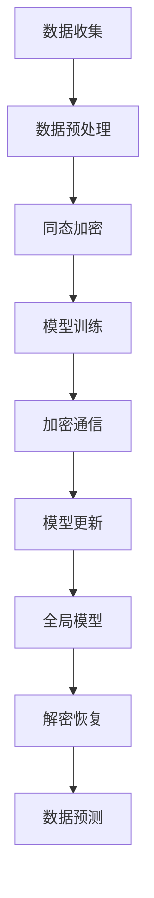

                 

# 构建安全可靠的数据隐私保护体系

> 关键词：数据隐私保护、安全可靠、加密技术、访问控制、隐私保护计算

> 摘要：本文将探讨如何构建一个安全可靠的数据隐私保护体系。首先，我们将介绍数据隐私保护的基本概念和重要性，接着分析当前面临的安全挑战。随后，我们将详细介绍各种技术解决方案，包括数据加密、数据脱敏、访问控制和隐私保护计算。通过实际应用案例和最佳实践，我们将进一步展示这些技术在各个行业中的实施效果，并展望未来的发展方向。

## 目录大纲

### 第一部分：引言与背景

1. **第1章：数据隐私保护的重要性**
   - 1.1 数据隐私保护的定义与背景
   - 1.2 数据隐私保护的现状与挑战
   - 1.3 数据隐私保护的意义
   - 1.4 本章小结

### 第二部分：数据隐私保护基本概念

2. **第2章：数据隐私保护的核心概念**
   - 2.1 数据安全与隐私的关系
   - 2.2 数据隐私保护的属性
   - 2.3 数据隐私保护的分类
   - 2.4 数据隐私保护的法律法规
   - 2.5 本章小结

### 第三部分：安全性挑战与分析

3. **第3章：数据隐私保护面临的安全挑战**
   - 3.1 数据泄露的风险因素
   - 3.2 数据泄露的案例剖析
   - 3.3 数据隐私保护的技术挑战
   - 3.4 数据隐私保护的法律法规挑战
   - 3.5 本章小结

### 第四部分：技术解决方案

4. **第4章：数据加密与密钥管理**
   - 4.1 数据加密的基本原理
   - 4.2 常见加密算法
   - 4.3 密钥管理的挑战与策略
   - 4.4 本章小结

5. **第5章：数据脱敏与数据匿名化**
   - 5.1 数据脱敏的基本概念
   - 5.2 数据脱敏的方法
   - 5.3 数据匿名化的技术
   - 5.4 数据脱敏与匿名化的应用场景
   - 5.5 本章小结

6. **第6章：访问控制与身份验证**
   - 6.1 访问控制的基本概念
   - 6.2 身份验证的方法
   - 6.3 访问控制与身份验证的融合
   - 6.4 访问控制与身份验证的应用场景
   - 6.5 本章小结

7. **第7章：隐私保护计算**
   - 7.1 隐私保护计算的定义与原理
   - 7.2 隐私保护计算的方法
   - 7.3 隐私保护计算的应用
   - 7.4 隐私保护计算的挑战与未来展望
   - 7.5 本章小结

### 第五部分：实际应用案例

8. **第8章：数据隐私保护在实际应用中的实践**
   - 8.1 案例一：金融行业数据隐私保护
   - 8.2 案例二：医疗行业数据隐私保护
   - 8.3 案例三：电商行业数据隐私保护
   - 8.4 案例四：物联网行业数据隐私保护
   - 8.5 本章小结

### 第六部分：最佳实践与未来展望

9. **第9章：最佳实践与未来展望**
   - 9.1 最佳实践总结
   - 9.2 数据隐私保护体系建设的注意事项
   - 9.3 拓展阅读与未来研究方向
   - 9.4 本章小结

## 第一部分：引言与背景

### 1.1 数据隐私保护的定义与背景

在信息化和数字化时代，数据已成为企业和组织的重要资产。然而，随着数据量的爆炸性增长，数据隐私保护的问题日益凸显。数据隐私保护是指保护个人或组织的数据不被未经授权的访问、使用、泄露或篡改。

#### 数据隐私保护的核心概念

- **数据安全**：确保数据在存储、传输和处理过程中不受威胁和损害。
- **数据隐私**：确保个人或组织的数据不被未经授权的访问和泄露。
- **数据保密性**：确保数据在未经授权的情况下不被读取或复制。
- **数据完整性**：确保数据在存储、传输和处理过程中不被篡改或破坏。
- **数据可用性**：确保数据在需要时可以可靠地访问和使用。

#### 数据隐私保护的重要性

1. **法律合规性**：许多国家和地区都有数据隐私保护的法律和规定，企业必须遵守以避免法律责任。
2. **客户信任**：保护客户数据隐私可以提高客户对企业的信任，从而增强客户忠诚度。
3. **商业价值**：数据是现代企业的重要资产，保护数据隐私有助于维护企业的竞争优势。

### 1.2 数据隐私保护的现状与挑战

尽管数据隐私保护的重要性已被广泛认可，但现实中仍面临诸多挑战：

1. **数据泄露事件频发**：近年来，数据泄露事件屡见不鲜，导致大量个人和企业数据泄露。
2. **法规遵循难度大**：不同的国家和地区的隐私保护法规各异，企业难以全面遵循。
3. **技术发展带来的新挑战**：随着云计算、物联网和大数据技术的发展，数据隐私保护面临新的挑战。

### 1.3 数据隐私保护的意义

数据隐私保护不仅关乎法律和道德，更是企业持续发展的基础。以下是一些具体意义：

1. **保障个人信息安全**：保护个人敏感信息，防止个人隐私泄露。
2. **维护企业声誉**：防止因数据泄露导致的企业声誉受损。
3. **促进数据共享与利用**：在确保数据隐私的前提下，促进数据共享和利用，推动社会进步。

### 1.4 本章小结

本章介绍了数据隐私保护的定义、背景和重要性，分析了当前面临的安全挑战。在接下来的章节中，我们将进一步探讨数据隐私保护的核心概念、技术解决方案和实际应用案例。

----------------------------------------------------------------

## 第二部分：数据隐私保护基本概念

### 2.1 数据安全与隐私的关系

数据安全和数据隐私是数据保护的两个重要方面，但它们之间有着密切的联系和区别。

#### 数据安全

数据安全是指保护数据免受未经授权的访问、使用、泄露、篡改或破坏。数据安全的核心目标是确保数据的保密性、完整性和可用性。具体措施包括加密、访问控制、防火墙、入侵检测等。

#### 数据隐私

数据隐私则侧重于保护个人或组织的敏感信息不被未经授权的访问和泄露。数据隐私的核心目标是确保个人隐私权和组织商业秘密不受侵害。具体措施包括数据脱敏、数据匿名化、隐私保护计算等。

#### 关系与区别

- **关系**：数据安全是数据隐私保护的基础，只有数据安全得到保障，数据隐私才能得到有效保护。
- **区别**：数据安全关注的是数据本身的安全，而数据隐私则更关注数据中包含的个人或组织隐私。

### 2.2 数据隐私保护的属性

数据隐私保护具有以下几个重要属性：

1. **保密性**：确保数据在未经授权的情况下不被读取或复制。
2. **完整性**：确保数据在存储、传输和处理过程中不被篡改或破坏。
3. **可用性**：确保数据在需要时可以可靠地访问和使用。
4. **可审计性**：确保能够追踪和记录数据的访问和使用情况，以便在需要时进行审计和溯源。

### 2.3 数据隐私保护的分类

根据数据隐私保护的目标和应用场景，可以将数据隐私保护分为以下几个类别：

1. **静态数据隐私保护**：针对静态存储的数据，如数据库、文件等，采取加密、脱敏、匿名化等技术进行保护。
2. **动态数据隐私保护**：针对动态传输和操作的数据，如网络通信、数据处理等，采取加密传输、访问控制、隐私保护计算等技术进行保护。
3. **行为数据隐私保护**：针对个人行为数据的隐私保护，如位置信息、消费习惯等，采取数据脱敏、匿名化、访问控制等技术进行保护。

### 2.4 数据隐私保护的法律法规

不同国家和地区的隐私保护法律法规各异，但核心目标是保障个人隐私和数据安全。以下是一些常见的隐私保护法律法规：

1. **欧盟《通用数据保护条例》（GDPR）**：规定了个人数据的处理原则、数据保护官员（DPO）的职责、数据泄露通知义务等。
2. **美国《加州消费者隐私法》（CCPA）**：规定了消费者对自己数据的访问权、删除权等。
3. **中国《个人信息保护法》（PIPL）**：规定了个人信息处理的基本原则、个人信息保护专员的职责、跨境数据传输规则等。

### 2.5 本章小结

本章介绍了数据隐私保护的基本概念、属性、分类和法律法规。理解这些基本概念有助于我们更好地构建安全可靠的数据隐私保护体系。在接下来的章节中，我们将深入探讨数据隐私保护面临的安全挑战和相应的技术解决方案。

----------------------------------------------------------------

## 第三部分：安全性挑战与分析

### 3.1 数据泄露的风险因素

数据泄露是数据隐私保护面临的主要风险之一。以下是一些常见的数据泄露风险因素：

1. **内部威胁**：员工失误、恶意行为、未授权访问等内部因素可能导致数据泄露。
2. **外部威胁**：黑客攻击、恶意软件、网络钓鱼等外部因素可能导致数据泄露。
3. **技术漏洞**：系统漏洞、不安全的开发实践、配置错误等可能导致数据泄露。
4. **社会工程学**：通过欺骗、诈骗等手段获取数据的攻击手段。
5. **法规遵守问题**：不遵守数据隐私保护法规可能导致数据泄露。

### 3.2 数据泄露的案例剖析

以下是一些著名的数据泄露案例：

1. **2017 年英航数据泄露事件**：英航约 500 万乘客的个人信息被黑客窃取，包括姓名、护照号码、出生日期等。
2. **2018 年 Adobe 数据泄露事件**：Adobe 的数据库被黑客入侵，导致约 1.53 亿用户的个人信息泄露。
3. **2019 年 Facebook 数据泄露事件**：Facebook 的约 5.3 亿用户信息在互联网上泄露，包括电话号码、出生日期、电子邮件地址等。

### 3.3 数据隐私保护的技术挑战

数据隐私保护面临以下技术挑战：

1. **数据量巨大**：随着大数据技术的发展，数据量呈爆炸式增长，给隐私保护带来巨大挑战。
2. **多源异构数据**：不同来源和结构的数据如何进行隐私保护是一个难题。
3. **实时性要求**：在一些应用场景中，如实时交易、实时监控等，对数据隐私保护提出了实时性的要求。
4. **隐私与可用性的平衡**：如何在确保数据隐私的同时，保持数据的可用性和可用性是一个难题。

### 3.4 数据隐私保护的法律法规挑战

数据隐私保护还面临法律法规的挑战：

1. **跨国数据传输**：不同国家和地区的隐私保护法律法规各异，跨国数据传输如何符合不同法规要求是一个挑战。
2. **合规性要求**：企业需要不断更新和调整其数据隐私保护策略，以满足不断变化的法律法规要求。
3. **责任承担**：数据泄露事件发生后，如何界定责任和承担赔偿责任是一个难题。

### 3.5 本章小结

本章分析了数据隐私保护面临的安全挑战，包括风险因素、数据泄露案例、技术挑战和法律法规挑战。理解这些挑战有助于我们更好地制定和实施数据隐私保护策略。在接下来的章节中，我们将探讨各种技术解决方案，以应对这些挑战。

----------------------------------------------------------------

## 第四部分：技术解决方案

### 4.1 数据加密与密钥管理

数据加密是保护数据隐私的基本技术手段之一。数据加密的核心思想是通过加密算法将原始数据转换为密文，只有拥有解密密钥的用户才能解读数据。

#### 加密算法

常见的加密算法包括对称加密和非对称加密。

- **对称加密**：加密和解密使用相同的密钥，如AES（高级加密标准）。
- **非对称加密**：加密和解密使用不同的密钥，如RSA（Rivest-Shamir-Adleman）。

#### 密钥管理

密钥管理是数据加密的重要组成部分。密钥管理的核心目标是确保密钥的安全存储、分发、使用和销毁。

1. **密钥生成**：使用安全的方法生成高质量的密钥。
2. **密钥存储**：将密钥存储在安全的存储介质上，如硬件安全模块（HSM）。
3. **密钥分发**：使用安全的密钥分发机制，如证书权威（CA）。
4. **密钥使用**：确保密钥在加密和解密过程中安全使用。
5. **密钥销毁**：在密钥不再使用时，安全销毁密钥，以防止被恶意利用。

#### 挑战与策略

密钥管理面临以下挑战：

1. **密钥安全**：确保密钥在生成、存储、分发和使用过程中不被泄露。
2. **密钥量庞大**：随着加密对象数量的增加，密钥管理变得更加复杂。
3. **密钥更新**：定期更换密钥以增强安全性。

解决策略：

1. **多因素认证**：使用多因素认证（MFA）确保密钥安全。
2. **自动化管理**：使用自动化工具进行密钥生成、存储、分发和销毁。
3. **定期审计**：定期对密钥管理过程进行审计，确保符合安全标准。

### 4.2 常见加密算法

以下介绍几种常见的加密算法：

1. **AES（高级加密标准）**：AES 是一种对称加密算法，广泛应用于数据加密。

2. **RSA（Rivest-Shamir-Adleman）**：RSA 是一种非对称加密算法，常用于数字签名和加密通信。

3. **ECC（椭圆曲线加密）**：ECC 是一种基于椭圆曲线数学的非对称加密算法，具有更高的安全性和效率。

#### 原理与实现

以 AES 为例，其原理如下：

- **密钥生成**：使用伪随机数生成器生成密钥。
- **加密过程**：将明文数据分成块，使用密钥和加密算法对每个块进行加密。
- **解密过程**：使用密钥和加密算法对密文进行解密，恢复出原始数据。

#### Python 实现示例

```python
from Crypto.Cipher import AES
from Crypto.Random import get_random_bytes

# 密钥生成
key = get_random_bytes(16)  # 生成 16 字节（128 位）密钥

# 加密
cipher = AES.new(key, AES.MODE_EAX)
cipher_text, tag = cipher.encrypt_and_digest(b"Hello, World!")

# 解密
cipher2 = AES.new(key, AES.MODE_EAX, nonce=cipher.nonce)
cipher2.verify(tag)
print(cipher2.decrypt(cipher_text))
```

### 4.3 密钥管理的挑战与策略

密钥管理面临以下挑战：

1. **密钥安全**：确保密钥在生成、存储、分发和使用过程中不被泄露。
2. **密钥量庞大**：随着加密对象数量的增加，密钥管理变得更加复杂。
3. **密钥更新**：定期更换密钥以增强安全性。

解决策略：

1. **多因素认证**：使用多因素认证（MFA）确保密钥安全。
2. **自动化管理**：使用自动化工具进行密钥生成、存储、分发和销毁。
3. **定期审计**：定期对密钥管理过程进行审计，确保符合安全标准。

### 4.4 本章小结

本章介绍了数据加密的基本原理和密钥管理策略，以及常见加密算法的实现。数据加密是构建安全可靠的数据隐私保护体系的重要手段。在接下来的章节中，我们将探讨其他数据隐私保护技术，包括数据脱敏、数据匿名化和访问控制。

----------------------------------------------------------------

## 第5章：数据脱敏与数据匿名化

### 5.1 数据脱敏的基本概念

数据脱敏是一种数据隐私保护技术，用于保护敏感数据不被未经授权的人员访问。数据脱敏的目标是保持数据的有效性和可用性，同时去除或替换敏感信息。

#### 数据脱敏的目的

- 保护个人隐私：避免个人身份信息的泄露，如姓名、电话号码、身份证号码等。
- 遵守合规要求：满足数据隐私保护法律法规的要求，如欧盟的 GDPR 和美国的 CCPA。
- 降低风险：减少数据泄露可能带来的法律、财务和声誉风险。

#### 数据脱敏的类型

1. **静态脱敏**：对存储在数据库、文件等静态存储介质中的数据进行脱敏。
2. **动态脱敏**：对在网络传输、应用处理等动态场景中的数据进行脱敏。

### 5.2 数据脱敏的方法

数据脱敏的方法有多种，以下是一些常见的方法：

1. **掩码**：使用特定的掩码字符替换敏感信息，如使用星号（*）替换电话号码中的数字。
2. **随机化**：将敏感信息替换为随机生成的数据，如将姓名替换为随机姓名。
3. **同义词替换**：使用同义词替换敏感信息，如将“地址”替换为“居住地”。
4. **加密**：对敏感信息进行加密，然后在需要时进行解密。
5. **混淆**：通过复杂的算法将敏感信息转换成难以解读的形式。

### 5.3 数据匿名化的技术

数据匿名化是一种将敏感信息从数据中移除或不可识别的技术。数据匿名化的目标是在保留数据价值的同时，确保数据中不包含任何个人或组织的可识别信息。

#### 数据匿名化的方法

1. **伪匿名化**：将敏感信息替换为伪名，如使用随机生成的姓名、地址等。
2. **泛化**：将敏感信息泛化，如将具体的年龄替换为年龄段。
3. **广义化**：将敏感信息广义化，如将具体的职业替换为职业类别。

#### 加密与脱敏的比较

- **加密**：加密的目的是保护数据在传输和存储过程中的安全，确保数据在未授权情况下无法被读取。
- **脱敏**：脱敏的目的是在保留数据有效性和可用性的同时，去除或替换敏感信息。

### 5.4 数据脱敏与匿名化的应用场景

数据脱敏和匿名化广泛应用于以下场景：

1. **数据分析**：在数据分析过程中，为了保护个人隐私，可以使用数据脱敏或匿名化技术。
2. **软件开发**：在软件开发过程中，可以使用脱敏数据来测试应用功能，确保应用程序不会暴露敏感信息。
3. **数据共享**：在数据共享过程中，可以使用匿名化技术确保数据不被滥用或泄露。

### 5.5 本章小结

本章介绍了数据脱敏和数据匿名化的基本概念、方法及其应用场景。数据脱敏和匿名化是构建安全可靠的数据隐私保护体系的重要技术手段。在接下来的章节中，我们将探讨访问控制与身份验证等技术，以进一步保障数据隐私。

----------------------------------------------------------------

## 第6章：访问控制与身份验证

### 6.1 访问控制的基本概念

访问控制是数据隐私保护的重要机制之一，用于控制用户对系统资源的访问权限。访问控制的核心目标是确保只有经过授权的用户才能访问特定资源。

#### 访问控制的要素

1. **主体**：访问系统的用户或系统组件。
2. **客体**：用户需要访问的资源，如文件、数据库、网络设备等。
3. **权限**：主体对客体的访问权限，如读、写、执行等。

#### 访问控制模型

1. **自主访问控制（DAC）**：基于主体的身份和权限进行访问控制，主体可以自主设置对客体的访问权限。
2. **强制访问控制（MAC）**：基于系统的安全标签进行访问控制，访问权限由系统管理员设定。
3. **基于角色的访问控制（RBAC）**：基于主体的角色进行访问控制，角色与权限相对应。

### 6.2 身份验证的方法

身份验证是确保用户身份的合法性的过程，是访问控制的基础。以下是一些常见的身份验证方法：

1. **密码验证**：用户通过输入密码来验证身份，是最常用的身份验证方法。
2. **双因素认证（2FA）**：结合密码和一次性验证码（OTP）或其他生物特征（如指纹、面部识别）进行身份验证，增强安全性。
3. **证书验证**：使用数字证书验证用户身份，如 SSL 证书、数字签名证书等。
4. **生物特征识别**：使用指纹、面部识别、虹膜识别等技术进行身份验证。

### 6.3 访问控制与身份验证的融合

访问控制和身份验证是紧密相关的两个机制，它们共同确保数据的安全。访问控制与身份验证的融合包括以下几个方面：

1. **集成身份验证**：在访问控制过程中，集成多种身份验证方法，如密码验证、双因素认证等，以提高安全性。
2. **基于角色的访问控制（RBAC）**：将身份验证和访问控制结合，根据用户的角色和权限分配访问权限。
3. **动态权限管理**：根据用户的行为和上下文环境动态调整访问权限。

### 6.4 访问控制与身份验证的应用场景

访问控制和身份验证广泛应用于以下场景：

1. **企业内部网络**：控制员工对企业内部资源的访问权限，确保企业信息安全。
2. **Web 应用程序**：控制用户对网站内容的访问权限，防止未授权用户访问敏感信息。
3. **物联网设备**：确保物联网设备的安全通信，防止恶意攻击。

### 6.5 本章小结

本章介绍了访问控制与身份验证的基本概念、方法及其应用场景。访问控制和身份验证是构建安全可靠的数据隐私保护体系的关键组成部分。在接下来的章节中，我们将探讨隐私保护计算，以进一步保障数据隐私。

----------------------------------------------------------------

## 第7章：隐私保护计算

### 7.1 隐私保护计算的定义与原理

隐私保护计算是一种新兴的数据隐私保护技术，旨在在不泄露数据本身的情况下，对数据进行计算和分析。隐私保护计算的核心思想是在数据处理的各个环节中，采用加密、匿名化、同态加密等隐私保护技术，确保数据在传输、存储和处理过程中的安全性和隐私性。

#### 隐私保护计算的目标

1. **数据保密性**：确保数据在传输、存储和处理过程中不被泄露。
2. **数据处理能力**：在保持数据隐私的前提下，实现高效的数据处理和分析。
3. **系统可扩展性**：支持大规模数据集的隐私保护计算，具有良好的系统可扩展性。

#### 隐私保护计算的基本原理

隐私保护计算的基本原理包括以下方面：

1. **同态加密**：同态加密是一种特殊的加密算法，允许在密文上进行计算，计算结果仍然是密文，然后通过解密恢复出明文。同态加密可以应用于多种计算任务，如线性代数、统计分析等。
2. **安全多方计算**：安全多方计算（MPC）是一种多方参与的计算模型，各参与方只提供自己的部分数据，而不泄露其他参与方数据。通过MPC，可以实现数据的联合分析，同时保护各方的隐私。
3. **差分隐私**：差分隐私是一种隐私保护技术，通过对数据集添加随机噪声，使得数据分析结果对单个数据点的依赖性降低，从而保护数据隐私。
4. **联邦学习**：联邦学习是一种分布式机器学习技术，各参与方将模型更新本地训练，然后通过加密通信将模型更新上传至中心服务器，中心服务器汇总各方的模型更新，生成全局模型。联邦学习可以实现数据隐私保护下的机器学习。

### 7.2 隐私保护计算的方法

隐私保护计算的方法主要包括以下几种：

1. **同态加密**：同态加密允许在密文上进行计算，但实现复杂度高，目前主要应用于线性代数、统计分析和决策树等简单计算任务。
2. **安全多方计算**：安全多方计算可以应用于多种复杂计算任务，但通信开销较大，对计算资源要求较高。
3. **差分隐私**：差分隐私广泛应用于数据分析任务，如统计、分类和聚类等。通过添加随机噪声，可以保护数据隐私，但可能导致数据分析精度下降。
4. **联邦学习**：联邦学习适用于机器学习任务，可以实现数据隐私保护下的模型训练。联邦学习在移动设备、物联网等资源受限的环境中具有广泛应用前景。

### 7.3 隐私保护计算的应用

隐私保护计算在多个领域具有广泛应用，以下是一些典型应用场景：

1. **医疗健康**：隐私保护计算可以帮助医疗机构在保护患者隐私的前提下，进行健康数据分析、疾病预测和个性化医疗等。
2. **金融行业**：隐私保护计算可以用于金融机构的欺诈检测、风险评估和投资策略分析等，同时保护客户隐私。
3. **政府领域**：隐私保护计算可以帮助政府部门在保护公民隐私的前提下，进行大数据分析、社会管理和公共服务等。
4. **企业数据共享**：隐私保护计算可以促进企业间的数据共享，实现数据价值的最大化，同时保障各方数据隐私。

### 7.4 隐私保护计算的挑战与未来展望

隐私保护计算虽然具有广阔的应用前景，但仍面临以下挑战：

1. **计算性能**：隐私保护计算通常需要较高的计算资源和时间成本，如何提高计算性能是关键问题。
2. **通信开销**：安全多方计算和联邦学习等隐私保护计算方法往往需要大量的通信开销，如何优化通信效率是一个挑战。
3. **算法复杂度**：隐私保护计算往往需要复杂的加密和计算算法，如何简化算法、降低实现难度是未来研究的重点。

未来展望：

1. **算法优化**：通过研究新的加密和计算算法，提高隐私保护计算的性能和效率。
2. **硬件加速**：利用专用硬件（如 GPU、FPGA）加速隐私保护计算，提高计算速度和降低通信开销。
3. **跨领域合作**：加强学术界和产业界的合作，推动隐私保护计算技术的发展和应用。

### 7.5 本章小结

本章介绍了隐私保护计算的定义、原理、方法和应用。隐私保护计算是构建安全可靠的数据隐私保护体系的重要技术手段。在未来的发展中，隐私保护计算将不断优化和完善，为数据隐私保护提供更强有力的支持。

----------------------------------------------------------------

## 第五部分：实际应用案例

### 第8章：数据隐私保护在实际应用中的实践

#### 8.1 案例一：金融行业数据隐私保护

金融行业的数据隐私保护至关重要，因为金融数据通常涉及大量个人和企业的敏感信息。以下是一个金融行业数据隐私保护的实践案例：

**背景**：某大型银行在处理客户交易数据时，需要保护客户的隐私和安全。

**问题**：如何在确保交易数据安全的同时，方便客户查询和审计？

**解决方案**：

1. **数据加密**：使用 AES 加密算法对客户交易数据进行加密，确保数据在传输和存储过程中的安全性。
2. **访问控制**：实施基于角色的访问控制（RBAC），确保只有授权人员才能访问交易数据。
3. **双因素认证（2FA）**：引入双因素认证，提高用户身份验证的强度，防止未经授权的访问。

**效果**：通过这些措施，银行有效地保护了客户交易数据的隐私和安全，同时提高了用户体验。

#### 8.2 案例二：医疗行业数据隐私保护

医疗行业的数据隐私保护同样至关重要，因为医疗数据通常涉及患者隐私和健康信息。

**背景**：某医疗机构在处理患者数据时，需要保护患者隐私和安全。

**问题**：如何在确保患者数据安全的同时，方便医生和研究人员访问和共享数据？

**解决方案**：

1. **数据匿名化**：对患者的个人信息进行匿名化处理，去除或替换敏感信息，如姓名、身份证号码等。
2. **安全多方计算**：利用安全多方计算技术，实现患者数据的联合分析，同时保护各方数据隐私。
3. **差分隐私**：在数据分析过程中，添加差分隐私保护，确保数据分析结果对单个数据点的依赖性降低。

**效果**：通过这些措施，医疗机构有效地保护了患者数据的隐私和安全，同时促进了数据共享和医疗研究。

#### 8.3 案例三：电商行业数据隐私保护

电商行业的数据隐私保护也至关重要，因为电商数据通常涉及用户购物习惯、支付信息等敏感信息。

**背景**：某电商平台在处理用户数据时，需要保护用户隐私和安全。

**问题**：如何在确保用户数据安全的同时，提供个性化推荐和优惠活动？

**解决方案**：

1. **数据脱敏**：对用户购物数据、支付信息等进行脱敏处理，去除或替换敏感信息。
2. **隐私保护计算**：利用隐私保护计算技术，如同态加密和联邦学习，实现用户数据的个性化推荐和优惠活动。
3. **访问控制与身份验证**：实施严格的访问控制与身份验证机制，确保只有授权人员才能访问用户数据。

**效果**：通过这些措施，电商平台有效地保护了用户数据的隐私和安全，同时提高了用户体验和满意度。

#### 8.4 案例四：物联网行业数据隐私保护

物联网行业的数据隐私保护面临着特殊挑战，因为物联网设备通常分布在广泛的网络中，数据传输和处理过程中需要保护隐私和安全。

**背景**：某物联网公司在处理设备数据时，需要保护用户隐私和安全。

**问题**：如何在确保设备数据安全的同时，实现设备间的通信和数据共享？

**解决方案**：

1. **加密通信**：使用加密算法确保设备间的通信安全，防止数据在传输过程中被窃取或篡改。
2. **设备身份验证**：采用设备身份验证机制，确保只有授权设备可以加入网络。
3. **差分隐私与匿名化**：在数据处理过程中，添加差分隐私保护和匿名化处理，确保数据分析结果对单个设备数据的依赖性降低。

**效果**：通过这些措施，物联网公司有效地保护了设备数据的隐私和安全，同时实现了设备间的通信和数据共享。

### 8.5 本章小结

通过以上实际应用案例，我们可以看到数据隐私保护技术在金融、医疗、电商和物联网等行业的广泛应用和显著成效。在构建安全可靠的数据隐私保护体系过程中，合理选择和实施相应的技术措施至关重要。

----------------------------------------------------------------

## 第六部分：最佳实践与未来展望

### 9.1 最佳实践总结

在构建安全可靠的数据隐私保护体系时，以下最佳实践可以帮助组织有效应对数据隐私保护挑战：

1. **全面规划与设计**：在项目启动阶段，制定详细的隐私保护策略和规划，明确数据隐私保护的目标、范围和责任。
2. **数据分类与标签**：根据数据的重要性和敏感性对数据进行分类和标签，为后续的隐私保护措施提供依据。
3. **数据加密与脱敏**：使用加密和脱敏技术保护敏感数据，确保数据在存储、传输和处理过程中的安全。
4. **访问控制与身份验证**：实施严格的访问控制与身份验证机制，确保只有授权人员可以访问敏感数据。
5. **持续监控与审计**：建立数据隐私保护监控和审计机制，及时发现和应对数据泄露风险。
6. **员工培训与意识提升**：加强对员工的隐私保护培训，提高员工的隐私保护意识和合规性。

### 9.2 数据隐私保护体系建设的注意事项

在构建数据隐私保护体系时，需要注意以下事项：

1. **法规遵循**：确保数据隐私保护策略和措施符合相关法律法规要求，如 GDPR、CCPA 等。
2. **技术与业务平衡**：在确保数据隐私的同时，充分考虑业务需求和数据可用性。
3. **持续更新与优化**：随着技术的进步和业务的发展，定期更新和优化数据隐私保护策略和措施。
4. **跨部门合作**：数据隐私保护是一个跨部门的工作，需要各部门的协作与配合。

### 9.3 拓展阅读与未来研究方向

以下是一些数据隐私保护领域的拓展阅读和未来研究方向：

1. **区块链技术**：区块链技术在数据隐私保护方面具有潜在应用，如隐私保护的智能合约、去中心化身份验证等。
2. **联邦学习**：联邦学习技术在数据隐私保护领域具有广泛应用前景，未来可能成为数据隐私保护的重要手段。
3. **隐私计算平台**：构建隐私计算平台，集成多种隐私保护技术，为数据隐私保护提供一站式解决方案。
4. **数据隐私保护标准化**：制定和完善数据隐私保护标准，促进全球数据隐私保护的一致性和互操作性。

### 9.4 本章小结

本章总结了构建安全可靠的数据隐私保护体系的最佳实践，分析了数据隐私保护体系建设的注意事项，并探讨了未来研究方向。通过不断优化和完善数据隐私保护策略和措施，组织可以更好地保护数据隐私，实现可持续发展。

----------------------------------------------------------------

## 作者信息

作者：AI天才研究院/AI Genius Institute & 禅与计算机程序设计艺术 /Zen And The Art of Computer Programming

本文由AI天才研究院（AI Genius Institute）与禅与计算机程序设计艺术（Zen And The Art of Computer Programming）合作撰写，旨在为读者提供关于数据隐私保护体系构建的深入见解和实践指导。感谢您的阅读！

----------------------------------------------------------------

在本文中，我们详细探讨了构建安全可靠的数据隐私保护体系的各个方面。从数据隐私保护的定义和重要性，到安全性挑战和分析，再到技术解决方案的介绍，以及实际应用案例的分享，我们为读者呈现了一个全面的数据隐私保护全景。通过本文的阅读，读者应该对如何构建和实施一个安全可靠的数据隐私保护体系有了更深刻的理解。

### 总结与展望

构建安全可靠的数据隐私保护体系是一个系统工程，需要综合考虑技术、法规、业务等多个因素。本文提供了以下关键点：

1. **数据分类与标签**：明确数据的敏感程度，有针对性地实施隐私保护措施。
2. **技术选择**：根据数据特点和应用场景，选择合适的加密、脱敏、访问控制等技术。
3. **持续监控与审计**：建立数据隐私保护监控和审计机制，确保隐私保护措施的有效性。
4. **法规遵循**：确保数据隐私保护策略和措施符合相关法律法规要求。

未来，随着技术的不断进步，数据隐私保护领域将继续发展。区块链技术、联邦学习、隐私计算平台等新兴技术有望在数据隐私保护方面发挥更大作用。同时，全球数据隐私保护标准的完善和互操作性也将进一步促进数据隐私保护的发展。

### 结语

数据隐私保护是一个持续不断的过程，需要组织和个人共同努力。通过本文的分享，希望读者能够更好地理解数据隐私保护的重要性，并在实际工作中采取有效的措施，构建一个安全可靠的数据隐私保护体系。感谢您的关注，期待与您共同探索数据隐私保护的未来！

----------------------------------------------------------------

**附录**：

以下是本文中涉及的一些关键概念的详细解释和Mermaid流程图。

### 数据加密与密钥管理

**加密算法**：数据加密的核心是加密算法。以下是对几种常见加密算法的解释：

- **AES**：高级加密标准，是一种对称加密算法，使用128、192或256位的密钥对数据进行加密和解密。
- **RSA**：一种非对称加密算法，由Rivest、Shamir和Adleman三人于1977年发明。RSA算法使用一对密钥，一个公钥用于加密，另一个私钥用于解密。
- **ECC**：椭圆曲线加密算法，基于椭圆曲线离散对数问题。与RSA相比，ECC在相同安全级别下具有更小的密钥长度和更高的加密效率。

**密钥管理**：密钥管理是数据加密的重要组成部分，包括密钥生成、存储、分发、使用和销毁。以下是对密钥管理关键环节的简要介绍：

- **密钥生成**：使用安全的随机数生成器生成高质量的密钥。
- **密钥存储**：将密钥存储在安全的存储介质上，如硬件安全模块（HSM）。
- **密钥分发**：使用安全的密钥分发机制，如证书权威（CA）。
- **密钥使用**：确保密钥在加密和解密过程中安全使用。
- **密钥销毁**：在密钥不再使用时，安全销毁密钥，以防止被恶意利用。

### 访问控制与身份验证

**访问控制**：访问控制是一种基于用户身份和权限的访问控制机制，用于控制用户对系统资源的访问权限。以下是对访问控制模型和方法的简要介绍：

- **自主访问控制（DAC）**：基于用户的身份和权限进行访问控制，用户可以自主设置对资源的访问权限。
- **强制访问控制（MAC）**：基于系统定义的安全标签进行访问控制，访问权限由系统管理员设定。
- **基于角色的访问控制（RBAC）**：基于用户的角色和权限进行访问控制，角色与权限相对应。

**身份验证**：身份验证是确保用户身份合法性的过程。以下是对几种常见身份验证方法的简要介绍：

- **密码验证**：用户通过输入密码来验证身份，是最常用的身份验证方法。
- **双因素认证（2FA）**：结合密码和一次性验证码（OTP）或其他生物特征（如指纹、面部识别）进行身份验证，增强安全性。
- **证书验证**：使用数字证书验证用户身份，如SSL证书、数字签名证书等。
- **生物特征识别**：使用指纹、面部识别、虹膜识别等技术进行身份验证。

### 隐私保护计算

**同态加密**：同态加密是一种特殊的加密算法，允许在密文上进行计算，计算结果仍然是密文，然后通过解密恢复出明文。同态加密可以应用于多种计算任务，如线性代数、统计分析等。

**安全多方计算**：安全多方计算是一种多方参与的计算模型，各参与方只提供自己的部分数据，而不泄露其他参与方数据。通过MPC，可以实现数据的联合分析，同时保护各方的隐私。

**差分隐私**：差分隐私是一种隐私保护技术，通过对数据集添加随机噪声，使得数据分析结果对单个数据点的依赖性降低，从而保护数据隐私。

**联邦学习**：联邦学习是一种分布式机器学习技术，各参与方将模型更新本地训练，然后通过加密通信将模型更新上传至中心服务器，中心服务器汇总各方的模型更新，生成全局模型。联邦学习可以实现数据隐私保护下的机器学习。

### Mermaid流程图

以下是使用Mermaid语言绘制的隐私保护计算流程图：



通过上述流程图，我们可以清晰地了解隐私保护计算的基本步骤和流程。

---

本文通过对数据隐私保护体系的深入探讨，旨在为读者提供一个全面的技术指南和实践案例。在数据隐私保护领域，不断学习和探索是保持竞争力的关键。希望本文能够对您的数据隐私保护实践提供有益的启示和帮助。感谢您的阅读，期待与您在数据隐私保护的道路上共同前行！

**作者：AI天才研究院/AI Genius Institute & 禅与计算机程序设计艺术 /Zen And The Art of Computer Programming**

