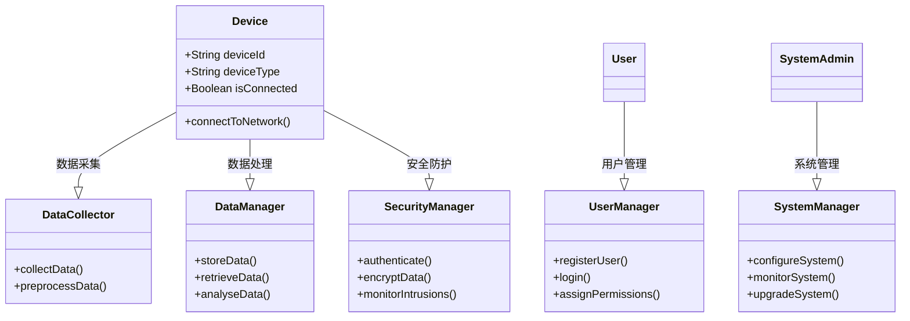
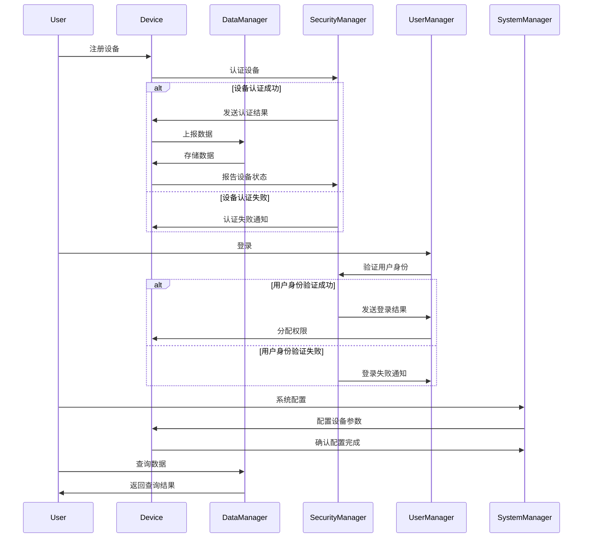
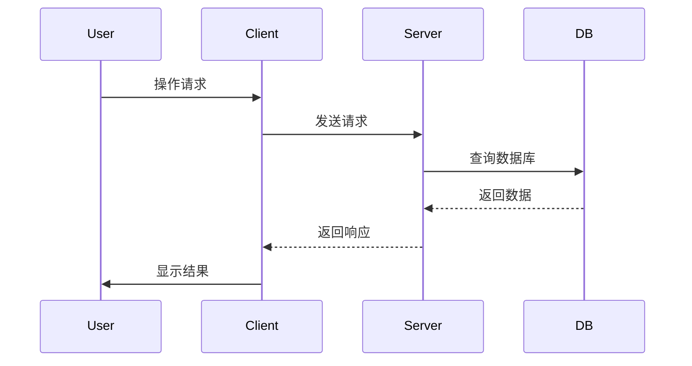

                 


## 引言：构建安全可靠的物联网架构的重要性

### 问题背景

随着信息技术的飞速发展，物联网（Internet of Things, IoT）技术逐渐成为现代社会的重要基础设施。物联网通过将各种设备互联，实现了数据的实时传输和智能处理，极大地提升了生产效率和生活品质。然而，随着物联网设备的广泛应用，其安全问题也日益凸显。尤其是在数据传输、设备管理和系统架构等方面，物联网面临着诸多安全隐患。

### 安全可靠性的重要性

物联网的安全可靠性至关重要，原因如下：

1. **数据安全**：物联网设备采集和传输的数据包括个人隐私、商业机密等敏感信息，一旦泄露，将导致严重的经济损失和隐私侵犯。
2. **设备安全**：物联网设备可能被黑客攻击，使其功能失效或被恶意利用，对个人和企业造成严重威胁。
3. **系统稳定性**：物联网系统中的设备繁多，一旦某个环节出现问题，可能导致整个系统的瘫痪，影响广泛。
4. **法律法规**：许多国家和地区已经出台了相关的法律法规，要求物联网设备必须具备一定的安全性和可靠性。

### 本文目标

本文旨在构建一个安全可靠的物联网架构，从核心概念、设计实现、设备管理、数据通信、安全性保障等多个方面进行深入探讨。通过本文的阅读，读者将能够：

1. 理解物联网架构的核心概念和基本原理。
2. 掌握物联网架构的设计原则和实现方法。
3. 学会如何进行物联网设备的安全管理和数据通信。
4. 了解物联网架构的安全性威胁及防护措施。

### 目录大纲

为了帮助读者更好地理解和掌握本文的内容，我们设计了如下目录大纲：

1. **背景与概述**
   - **问题背景**
   - **安全可靠性的重要性**
   - **本文目标**
2. **物联网架构的核心概念**
   - **设备管理**
   - **数据通信**
   - **安全保障**
3. **物联网架构设计与实现**
   - **系统功能设计**
   - **系统架构设计**
   - **系统接口设计**
4. **物联网设备管理**
   - **设备接入与认证**
   - **设备监控与维护**
   - **设备资源管理**
5. **物联网数据通信**
   - **数据传输协议**
   - **数据存储与处理**
   - **数据加密与隐私保护**
6. **物联网架构的安全性**
   - **安全框架**
   - **安全威胁分析**
   - **安全防护措施**
7. **物联网项目实战**
   - **项目介绍**
   - **系统核心实现**
   - **代码应用解读**
   - **实际案例分析与讲解**
   - **项目小结**
8. **最佳实践与总结**
   - **最佳实践**
   - **注意事项**
   - **小结**
   - **拓展阅读**

通过以上目录大纲，我们将一步步深入探讨物联网架构的安全可靠构建，希望读者能够从中获得宝贵的知识和经验。

### 文章关键词

- 物联网架构
- 安全可靠性
- 设备管理
- 数据通信
- 安全防护措施

### 摘要

本文旨在构建一个安全可靠的物联网架构，通过深入探讨物联网架构的核心概念、设计与实现、设备管理、数据通信、安全性保障等方面的内容，帮助读者全面理解物联网技术的本质和安全性要求。文章将从理论到实践，详细讲解物联网架构的设计原则和实现方法，提供实际项目案例，以帮助读者更好地掌握物联网技术的应用和开发。通过本文的学习，读者将能够构建一个安全、稳定、高效的物联网系统，应对现代社会的挑战。

----------------------------------------------------------------

# 第一部分：背景与概述

## 1.1 问题背景

### 1.1.1 物联网架构面临的问题

物联网架构在全球范围内得到了广泛的应用，但其面临的问题也逐渐显现。首先，设备数量庞大，使得设备管理和维护变得复杂。其次，数据传输过程中的安全性问题也日益突出，一旦数据泄露，将对个人和企业造成不可估量的损失。此外，物联网系统的稳定性和可靠性也受到挑战，设备故障、网络中断等问题可能导致整个系统瘫痪。

### 1.1.2 安全可靠性的重要性

物联网的安全性直接关系到个人隐私、商业机密和国家信息安全。一个安全可靠的物联网架构能够确保数据的完整性、保密性和可用性，防止恶意攻击和数据泄露。同时，它还能够提高系统的稳定性，减少设备故障率和维护成本。因此，构建一个安全可靠的物联网架构具有重要的现实意义。

### 1.1.3 问题解决

为了解决上述问题，我们需要从以下几个方面入手：

1. **设备管理**：引入智能化的设备管理策略，实现设备的自动接入、监控和维护。
2. **数据通信**：采用高效的数据传输协议和加密技术，确保数据在传输过程中的安全性。
3. **系统架构**：设计一个分布式、模块化的系统架构，提高系统的稳定性和可靠性。
4. **安全保障**：建立完善的安全防护体系，防止恶意攻击和数据泄露。

## 1.2 物联网架构的核心概念

### 1.2.1 设备管理

设备管理是物联网架构的核心组成部分，涉及设备的接入、认证、监控和维护等方面。有效的设备管理能够确保物联网系统的正常运行，提高设备的利用率和稳定性。

### 1.2.2 数据通信

数据通信是物联网架构的另一个关键要素，涉及数据的传输、存储和处理等方面。高效的数据通信能够保证物联网系统实时、准确地传递和处理数据，满足各种应用场景的需求。

### 1.2.3 安全保障

安全保障是物联网架构的基石，涉及数据安全、设备安全和系统安全等方面。一个完善的安全防护体系能够有效防止恶意攻击和数据泄露，确保物联网系统的安全可靠运行。

## 1.3 物联网架构的发展历程

### 1.3.1 1.0时代的物联网

1.0时代的物联网主要侧重于设备的互联和数据的采集，实现设备间的简单通信。此时，物联网技术主要应用于智能家居、智能农业等领域。

### 1.3.2 2.0时代的物联网

2.0时代的物联网开始注重数据的应用和智能化，实现数据的实时分析和处理。物联网技术逐渐应用于智能交通、智能医疗等领域。

### 1.3.3 3.0时代的物联网

3.0时代的物联网将人工智能、大数据等技术融入其中，实现物联网系统的智能化和自组织。物联网技术将应用于智慧城市、智能制造等领域，推动社会的数字化转型。

----------------------------------------------------------------

## 1.2 物联网架构的核心概念

### 设备管理

设备管理是物联网架构的核心概念之一，涵盖了设备的接入、认证、监控和维护等方面。有效的设备管理能够确保物联网系统的正常运行，提高设备的利用率和稳定性。

#### 设备接入与认证

设备接入是物联网系统的基础，涉及将设备接入到物联网网络中。为了确保设备的安全性和可靠性，设备接入通常需要经过认证过程。认证过程包括身份验证、权限分配等，以确保只有授权设备能够接入系统。

#### 设备监控与维护

设备监控是确保设备正常运行的重要手段。通过实时监控设备的状态、性能和故障情况，可以及时发现并处理设备问题，提高设备的稳定性和可靠性。设备维护包括设备的日常保养、升级和故障排除等，以确保设备能够长期稳定运行。

#### 设备资源管理

设备资源管理涉及对设备资源（如存储、计算能力、网络带宽等）进行优化和分配，以最大化设备的利用率和系统性能。通过合理分配设备资源，可以实现设备的负载均衡，提高系统的响应速度和处理能力。

### 数据通信

数据通信是物联网架构的另一个核心概念，涉及数据的传输、存储和处理等方面。高效的数据通信能够保证物联网系统实时、准确地传递和处理数据，满足各种应用场景的需求。

#### 数据传输协议

数据传输协议是数据通信的关键，决定了数据传输的效率、可靠性和安全性。常见的物联网数据传输协议包括MQTT、CoAP、HTTP等。每种协议都有其特定的优势和应用场景，选择合适的协议对于构建高效、可靠的物联网系统至关重要。

#### 数据存储与处理

数据存储与处理是物联网系统的核心功能之一。物联网设备产生的海量数据需要存储在数据库中，并进行实时处理和分析，以实现数据的增值和应用。常见的物联网数据存储和处理技术包括NoSQL数据库、大数据处理平台等。

#### 数据加密与隐私保护

数据加密与隐私保护是保障数据安全的重要手段。通过数据加密技术，可以确保数据在传输和存储过程中不被窃取或篡改。隐私保护技术则可以防止个人隐私泄露，保护用户的隐私权益。

### 安全保障

安全保障是物联网架构的核心概念之一，涉及数据安全、设备安全和系统安全等方面。一个完善的安全防护体系能够有效防止恶意攻击和数据泄露，确保物联网系统的安全可靠运行。

#### 安全框架

物联网安全框架是一套综合性的安全策略和措施，涵盖了从设备到云端的各个层面。常见的物联网安全框架包括ISO/IEC 27001、NIST IoT框架等。

#### 安全威胁分析

安全威胁分析是确保物联网系统安全的重要步骤，通过分析潜在的安全威胁，可以识别出系统中的脆弱点和潜在风险，从而制定相应的防护措施。

#### 安全防护措施

安全防护措施包括身份认证、访问控制、数据加密、入侵检测等。通过这些措施，可以有效地保护物联网系统的安全，防止恶意攻击和数据泄露。

### 小结

物联网架构的核心概念包括设备管理、数据通信和安全保障。有效的设备管理能够确保设备的正常运行，数据通信则保证了数据的实时传输和处理，而安全保障则是确保物联网系统安全可靠运行的基础。理解和掌握这些核心概念，是构建一个高效、稳定、安全的物联网系统的关键。

----------------------------------------------------------------

## 1.3 物联网架构的发展历程

### 1.3.1 1.0时代的物联网

1.0时代的物联网主要以设备互联和数据采集为核心。在这个阶段，物联网技术的应用主要集中在智能家居、智能农业和工业自动化等领域。代表性的技术包括RFID（射频识别）和ZigBee（无线通信技术）。1.0时代的物联网系统结构相对简单，主要功能是数据的采集和传输，缺乏数据的存储和处理能力。

#### 技术特点

- **设备互联**：通过有线和无线通信技术，实现设备间的简单通信。
- **数据采集**：设备主要功能是数据的采集，如温度、湿度、位置等信息。
- **数据传输**：采用简单、低带宽的通信协议，如TCP/IP、HTTP。
- **数据处理**：缺乏有效的数据处理能力，数据主要传输到中央服务器进行处理。

#### 应用场景

- **智能家居**：家庭设备（如照明、空调、安全系统）的自动化控制。
- **智能农业**：农田环境的监控和农作物的自动化管理。
- **工业自动化**：生产线设备的自动化控制。

### 1.3.2 2.0时代的物联网

2.0时代的物联网开始注重数据的实时分析和应用，实现设备的智能化和系统的自组织。随着云计算、大数据和人工智能技术的不断发展，物联网技术逐渐从单一的数据采集和传输向数据分析和应用转变。

#### 技术特点

- **数据实时分析**：通过云计算平台，实现数据的实时分析和处理。
- **设备智能化**：设备具备一定的智能处理能力，能够进行简单的决策和响应。
- **系统自组织**：通过自组织算法，实现设备的自动调度和协同工作。
- **数据存储和处理**：采用分布式数据库和大数据处理平台，实现海量数据的存储和处理。

#### 应用场景

- **智能交通**：交通流量的实时监控和管理，智能调度交通信号灯。
- **智能医疗**：医疗设备的实时数据监控和患者健康数据的分析。
- **智能工厂**：生产过程的实时监控和优化，设备故障预测和预防。

### 1.3.3 3.0时代的物联网

3.0时代的物联网将人工智能、大数据和区块链等前沿技术深度融合，实现物联网系统的智能化和自组织。在这个阶段，物联网技术不仅关注数据的采集和传输，更加注重数据的价值和应用。

#### 技术特点

- **人工智能应用**：物联网设备具备高级的智能处理能力，能够进行复杂的决策和响应。
- **大数据分析**：通过对海量数据的深度分析，实现数据的智慧化和增值应用。
- **区块链技术**：采用区块链技术，实现数据的安全传输和存储，确保数据的可信和不可篡改性。
- **边缘计算**：将计算能力下沉到设备端，实现数据的实时处理和快速响应。

#### 应用场景

- **智慧城市**：城市基础设施的智能监控和管理，如智能交通、智能能源管理。
- **智能制造**：生产过程的智能监控和优化，如设备故障预测、生产数据实时分析。
- **智慧农业**：农业生产的智能监控和管理，如土壤湿度监测、作物生长数据分析。

### 小结

物联网架构的发展历程从1.0时代的设备互联和数据采集，到2.0时代的实时分析和智能化应用，再到3.0时代的智能化和自组织，技术不断演进，应用场景不断拓展。未来，随着技术的进一步发展，物联网将更加智能化、安全化、自组织化，为人类社会带来更多便捷和效益。

----------------------------------------------------------------

## 2.1 设备管理

设备管理是物联网架构的核心组成部分，涵盖了设备接入、认证、监控和维护等方面。有效的设备管理能够确保物联网系统的稳定性和可靠性，提高设备的利用率和用户体验。

### 设备接入

设备接入是物联网系统的第一步，即将设备连接到物联网网络中。设备接入过程通常包括以下步骤：

1. **设备注册**：设备在接入物联网前需要向系统进行注册，提供必要的信息，如设备类型、标识符、制造商等。
2. **网络连接**：设备通过网络连接到物联网平台，可以通过有线（如以太网）或无线（如Wi-Fi、蜂窝网络、LoRa等）方式进行连接。
3. **认证过程**：设备接入物联网网络后，需要通过认证过程，验证设备的合法性和权限。常见的认证方式包括身份认证、证书认证等。

### 设备认证

设备认证是确保设备合法性和安全性的重要步骤。设备认证通常包括以下内容：

1. **身份认证**：通过验证设备的唯一标识（如MAC地址、序列号等），确保只有授权设备能够接入系统。
2. **权限认证**：根据设备的权限级别，分配相应的访问权限，确保设备只能访问其有权访问的资源。
3. **安全认证**：使用加密技术（如TLS、SSL等），确保设备在接入过程中数据的完整性和保密性。

### 设备监控与维护

设备监控与维护是确保设备正常运行和延长设备寿命的重要手段。设备监控主要包括以下几个方面：

1. **状态监控**：实时监控设备的状态信息，如温度、电压、电池电量等，及时发现设备异常情况。
2. **性能监控**：监控设备的性能指标，如响应时间、处理能力等，确保设备能够满足系统要求。
3. **故障监控**：及时发现设备的故障情况，并通过远程诊断和故障排除，减少设备停机时间。

设备维护包括以下内容：

1. **日常保养**：定期对设备进行清洁、润滑和检查，确保设备处于良好状态。
2. **软件升级**：及时更新设备的固件和软件，修复已知漏洞，提升设备性能。
3. **故障处理**：对设备出现的故障进行诊断和处理，确保设备能够恢复正常运行。

### 设备资源管理

设备资源管理涉及对设备资源的优化和分配，以提高设备的利用率和系统性能。设备资源管理主要包括以下几个方面：

1. **存储资源管理**：合理分配设备的存储资源，确保数据存储的可靠性和高效性。
2. **计算资源管理**：根据设备负载情况，动态调整计算资源，确保设备能够高效运行。
3. **网络资源管理**：优化设备网络配置，确保网络连接的稳定性和高效性。

### 设备接入认证流程

设备接入认证流程通常包括以下几个步骤：

1. **设备注册**：设备向物联网平台发送注册请求，提供设备信息和认证信息。
2. **平台认证**：物联网平台对设备信息进行验证，确认设备身份和权限。
3. **安全认证**：物联网平台使用加密技术对设备认证信息进行加密传输，确保认证过程的安全性。
4. **设备上线**：认证通过后，设备正式接入物联网网络，开始正常工作。

### 设备监控与维护流程

设备监控与维护流程主要包括以下几个步骤：

1. **状态监控**：物联网平台实时收集设备状态信息，进行异常检测和报警。
2. **性能监控**：物联网平台对设备性能进行监控，记录性能指标，进行分析和优化。
3. **故障监控**：物联网平台发现设备故障时，自动进行远程诊断和故障排除。
4. **日常维护**：定期对设备进行维护保养，确保设备长期稳定运行。

### 设备资源管理策略

设备资源管理策略主要包括以下几个方面：

1. **负载均衡**：根据设备负载情况，动态调整资源分配，确保系统的高效运行。
2. **优先级管理**：对不同类型的设备资源进行优先级管理，确保关键资源的优先分配。
3. **弹性伸缩**：根据系统负载变化，自动调整设备资源，实现系统的弹性伸缩。

### 小结

设备管理是物联网架构的核心组成部分，涉及设备接入、认证、监控和维护等方面。有效的设备管理能够确保物联网系统的稳定性和可靠性，提高设备的利用率和用户体验。通过设备接入认证流程、设备监控与维护流程和设备资源管理策略的深入理解，我们可以更好地构建一个高效、可靠的物联网系统。

----------------------------------------------------------------

## 2.2 数据通信

数据通信是物联网架构的重要组成部分，涉及数据的传输、存储和处理等方面。高效的数据通信能够保证物联网系统实时、准确地传递和处理数据，满足各种应用场景的需求。

### 数据传输协议

数据传输协议是物联网数据通信的基础，决定了数据传输的效率、可靠性和安全性。常见的物联网数据传输协议包括MQTT、CoAP、HTTP等。每种协议都有其特定的优势和适用场景，以下是这些协议的特点和适用场景的概述：

#### MQTT（消息队列遥测传输）

MQTT 是一种轻量级的消息传输协议，适用于带宽有限、网络不稳定的环境。其特点是低带宽、低功耗，支持发布/订阅模式，能够实现设备与服务器之间的高效通信。

**特点：**
- **轻量级**：消息格式简单，数据传输开销小。
- **发布/订阅模式**：支持服务器和客户端之间的灵活消息交换。
- **网络容错**：支持断线重连和消息重传。

**适用场景：**
- **智能家居**：智能灯泡、智能温度传感器等设备。
- **智能农业**：农田环境监控、灌溉系统等。
- **工业物联网**：设备状态监控、生产数据收集等。

#### CoAP（超文本传输协议）

CoAP 是一种基于 HTTP 协议的轻量级物联网协议，适用于资源受限的物联网设备。它简化了 HTTP 协议的复杂度，提供了简单的资源操作接口。

**特点：**
- **简单性**：协议简单，易于实现。
- **资源操作**：支持 GET、POST、PUT、DELETE 等操作。
- **安全性**：支持安全传输，如 TLS。

**适用场景：**
- **智能家居**：智能门锁、智能摄像头等。
- **智能交通**：交通信号灯、智能停车系统等。
- **智能医疗**：医疗设备数据传输。

#### HTTP（超文本传输协议）

HTTP 是一种广泛使用的应用层协议，适用于需要高带宽、高可靠性的物联网场景。HTTP 支持丰富的资源操作和内容类型，能够处理复杂的数据传输需求。

**特点：**
- **丰富性**：支持多种数据格式和内容类型。
- **可靠性**：支持完整的请求-响应机制，确保数据传输的可靠性。
- **扩展性**：支持扩展协议头、插件等。

**适用场景：**
- **智能工厂**：生产数据传输、设备监控等。
- **智能医疗**：医疗数据传输、远程诊断等。
- **智能交通**：车辆数据传输、交通数据监控等。

### 数据存储与处理

物联网设备产生的数据量巨大，有效的数据存储与处理能够实现数据的持久化、分析和应用。以下介绍几种常见的数据存储与处理技术：

#### 数据存储技术

1. **关系型数据库**：如 MySQL、PostgreSQL 等，适用于结构化数据存储和复杂查询。
2. **非关系型数据库**：如 MongoDB、Redis 等，适用于海量数据存储和快速读写。
3. **时序数据库**：如 InfluxDB、TimescaleDB 等，适用于时间序列数据的存储和分析。

#### 数据处理技术

1. **批处理**：如 Hadoop、Spark 等，适用于大规模数据批处理和分析。
2. **流处理**：如 Flink、Kafka Streams 等，适用于实时数据流处理和分析。
3. **机器学习**：如 TensorFlow、PyTorch 等，适用于数据分析和预测。

### 数据加密与隐私保护

数据加密与隐私保护是保障数据安全的重要手段，确保数据在传输和存储过程中不被窃取或篡改。以下介绍几种常见的数据加密与隐私保护技术：

#### 数据加密技术

1. **对称加密**：如 AES、DES 等，适用于数据的高效加密。
2. **非对称加密**：如 RSA、ECC 等，适用于数据的安全传输。
3. **哈希算法**：如 SHA、MD5 等，适用于数据的完整性校验。

#### 隐私保护技术

1. **数据匿名化**：通过脱敏、加密等技术，将敏感数据转换为不可识别的形式。
2. **访问控制**：通过角色权限管理、访问控制列表（ACL）等，确保数据访问的安全性。
3. **加密通信**：如 TLS/SSL 等，确保数据在传输过程中的安全性。

### 小结

数据通信是物联网架构的核心组成部分，涉及数据传输协议、数据存储与处理、数据加密与隐私保护等方面。选择合适的数据传输协议、有效的数据存储与处理技术和可靠的数据加密与隐私保护手段，能够确保物联网系统的高效、安全运行。

----------------------------------------------------------------

## 2.3 安全保障

### 2.3.1 安全框架

物联网安全保障需要一个全面的安全框架来指导设计和实现。安全框架通常包括以下几个核心组成部分：

1. **身份认证与访问控制**：确保只有授权用户和设备能够访问系统资源和数据。常见的身份认证方法包括密码认证、双因素认证（2FA）、生物识别等。访问控制则通过角色权限管理（RBAC）或访问控制列表（ACL）来控制用户和设备对资源的访问权限。

2. **数据加密与隐私保护**：通过加密技术保护数据在传输和存储过程中的安全性，防止数据被窃取或篡改。常见的加密技术包括对称加密（如AES）、非对称加密（如RSA）和哈希算法（如SHA-256）。隐私保护技术还包括数据匿名化、差分隐私等。

3. **入侵检测与防御**：通过监控系统活动和网络流量，识别潜在的攻击行为，并及时采取防御措施。入侵检测系统（IDS）和入侵防御系统（IPS）是实现这一目标的关键工具。

4. **安全监控与审计**：对系统进行持续的安全监控和审计，记录和追踪安全事件，以便在发生安全事件时进行快速响应和调查。

### 2.3.2 安全威胁分析

物联网系统面临多种安全威胁，以下是一些常见的安全威胁类型：

1. **设备入侵**：攻击者通过漏洞入侵物联网设备，获取设备控制权限或敏感数据。
2. **数据泄露**：未经授权的访问或数据传输过程中的泄露，可能导致敏感信息暴露。
3. **拒绝服务攻击（DDoS）**：通过大量恶意请求占用系统资源，导致服务不可用。
4. **中间人攻击（MITM）**：攻击者截取和篡改数据传输，窃取敏感信息。
5. **恶意软件**：恶意软件感染物联网设备，可能导致设备功能异常或成为攻击者控制的“僵尸网络”节点。
6. **物理安全威胁**：物联网设备的物理安全威胁，如设备被窃取或篡改。

### 2.3.3 安全防护措施

为了有效应对上述安全威胁，可以采取以下安全防护措施：

1. **设备安全加固**：确保物联网设备的操作系统和应用程序安全，定期更新固件和软件，修补安全漏洞。使用强密码和双因素认证提高设备的安全性。

2. **数据传输加密**：使用安全的通信协议（如TLS/SSL）加密数据传输，确保数据在传输过程中不被窃取或篡改。

3. **访问控制与身份认证**：实现严格的访问控制和身份认证机制，确保只有授权用户和设备能够访问系统资源和数据。

4. **网络隔离与监控**：通过设置防火墙、入侵检测系统（IDS）和入侵防御系统（IPS），监控网络流量，防止恶意攻击和入侵。

5. **安全审计与日志管理**：定期进行安全审计，记录和追踪系统活动，以便在发生安全事件时进行快速响应和调查。

6. **物理安全防护**：对物联网设备进行物理安全防护，防止设备被盗窃或篡改。

7. **用户教育与培训**：提高用户对安全威胁的认识，加强安全意识和操作规范。

### 小结

安全保障是物联网架构设计的关键要素，通过构建全面的安全框架、识别安全威胁并采取有效的防护措施，可以确保物联网系统的安全可靠运行，防止数据泄露、设备被入侵和其他安全事件的发生。物联网安全是一个持续的过程，需要不断更新和完善安全策略和措施，以应对不断变化的安全威胁。

----------------------------------------------------------------

## 3.1 系统功能设计

### 3.1.1 功能需求分析

系统功能设计的第一步是进行功能需求分析。功能需求分析的目标是明确系统需要实现哪些功能，以及这些功能对于用户和系统的重要性。以下是一个典型的物联网系统功能需求分析示例：

**功能需求列表：**

1. **设备接入与管理**：
   - 设备注册与认证
   - 设备在线状态监控
   - 设备远程控制与配置
   - 设备故障报警与维护

2. **数据采集与处理**：
   - 实时数据采集
   - 数据预处理与清洗
   - 数据存储与管理
   - 数据分析与可视化

3. **安全防护**：
   - 数据加密与隐私保护
   - 访问控制与身份认证
   - 入侵检测与防御
   - 日志记录与审计

4. **用户管理**：
   - 用户注册与登录
   - 用户权限管理
   - 用户行为记录与分析

5. **系统管理**：
   - 系统配置与参数调整
   - 系统监控与告警
   - 系统升级与维护

**功能优先级评估：**

- **高优先级**：设备接入与管理、数据采集与处理、安全防护
- **中优先级**：用户管理、系统管理
- **低优先级**：特定功能（如高级数据分析、个性化定制）

### 3.1.2 功能模块设计

在明确了功能需求后，我们需要将功能需求转化为具体的模块设计。以下是物联网系统的主要功能模块：

1. **设备管理模块**：
   - **设备注册与认证**：处理设备的注册请求，验证设备的合法性和身份。
   - **设备状态监控**：实时监控设备的在线状态，检测设备故障。
   - **设备远程控制**：通过API或控制台实现对设备的远程控制。

2. **数据采集模块**：
   - **实时数据采集**：通过传感器和网络接口实时采集数据。
   - **数据预处理**：对采集到的数据进行清洗、转换和规范化。

3. **数据处理模块**：
   - **数据存储与管理**：将预处理后的数据存储在数据库中，并提供数据检索接口。
   - **数据分析与可视化**：对存储的数据进行统计分析和可视化展示。

4. **安全防护模块**：
   - **数据加密**：对数据进行加密存储和传输。
   - **访问控制**：实现用户的身份认证和权限管理。
   - **入侵检测**：监控系统活动，识别潜在的安全威胁。

5. **用户管理模块**：
   - **用户注册与登录**：处理用户的注册、登录请求。
   - **用户权限管理**：根据用户角色分配不同的权限。

6. **系统管理模块**：
   - **系统配置**：提供系统配置和参数调整功能。
   - **系统监控**：监控系统状态，记录告警信息。

### 3.1.3 功能实现策略

在功能模块设计完成后，我们需要制定具体的实现策略，以确保每个模块的功能能够得到有效实现。以下是一个典型的物联网系统功能实现策略：

1. **技术选型**：
   - **设备管理**：采用MQTT协议实现设备的接入和状态监控。
   - **数据采集**：使用传感器采集数据，采用协议如HTTP、CoAP等进行数据传输。
   - **数据处理**：采用NoSQL数据库如MongoDB存储数据，使用Python、Java等编程语言进行数据处理和分析。
   - **安全防护**：采用TLS/SSL加密传输，使用基于角色的访问控制（RBAC）。
   - **用户管理**：使用JWT（JSON Web Token）进行用户认证和权限管理。
   - **系统管理**：采用Web界面进行系统配置和监控。

2. **接口设计**：
   - **设备管理接口**：提供RESTful API，实现对设备的注册、监控和控制。
   - **数据处理接口**：提供API接口，实现对数据的查询、分析和可视化。

3. **系统架构**：
   - **分布式架构**：采用微服务架构，将系统划分为多个模块，每个模块独立部署。
   - **容器化与自动化部署**：使用Docker容器化技术，实现系统的快速部署和扩展。

### 小结

系统功能设计是物联网架构设计的重要环节，通过明确功能需求、设计功能模块和制定实现策略，可以确保物联网系统能够高效、稳定地运行。有效的系统功能设计不仅能够满足用户需求，还能提高系统的可扩展性和可靠性。

----------------------------------------------------------------

## 3.2 系统架构设计

### 3.2.1 系统架构概述

物联网系统的架构设计需要综合考虑硬件设备、网络通信、数据处理和安全防护等多个方面。一个典型的物联网系统架构通常包括以下主要模块：

1. **设备层**：包括各种传感器、执行器和其他物联网设备。
2. **网络层**：负责数据传输，包括本地网络和广域网络。
3. **平台层**：提供数据存储、处理、分析和应用服务。
4. **应用层**：为用户提供具体的应用场景和业务功能。

### 3.2.2 系统功能模块

以下是物联网系统的核心功能模块及其相互关系：

1. **设备管理模块**：负责设备的接入、认证、监控和维护。
2. **数据采集模块**：从设备层收集数据，并进行预处理。
3. **数据处理模块**：存储、处理和分析数据，提供数据查询和可视化服务。
4. **安全防护模块**：确保数据传输和存储的安全性，防止恶意攻击。
5. **用户管理模块**：管理用户注册、登录和权限。
6. **系统管理模块**：监控系统状态，进行系统配置和升级。

### 3.2.3 系统架构设计

下面使用Mermaid类图和序列图展示物联网系统的架构设计：

#### Mermaid类图



#### Mermaid序列图



### 3.2.4 系统交互设计

物联网系统的各个模块之间需要通过接口进行交互，以下是系统交互的详细设计：

1. **设备接入与数据上报**：设备通过MQTT协议将数据上报到物联网平台，平台进行数据预处理和存储。
2. **用户认证与权限管理**：用户通过HTTP协议进行登录，平台验证用户身份，并根据用户权限分配设备操作权限。
3. **数据查询与分析**：用户通过RESTful API接口查询数据，平台提供数据分析和可视化服务。
4. **系统配置与监控**：系统管理员通过Web界面进行系统配置和监控，平台提供实时监控数据和告警通知。

### 小结

系统架构设计是物联网系统实现的基础，通过明确的模块划分和接口设计，可以确保系统的高效、可靠运行。有效的系统架构设计不仅能够满足功能需求，还能为系统的扩展和升级提供支持。

----------------------------------------------------------------

## 3.3 系统接口设计

### 3.3.1 接口设计原则

系统接口设计是物联网系统架构设计的重要组成部分，良好的接口设计能够提高系统的可扩展性、稳定性和易用性。以下是系统接口设计的一些关键原则：

1. **模块化设计**：将系统功能分解为多个独立的模块，每个模块负责特定的功能，模块之间通过接口进行通信。
2. **简洁性**：接口设计应尽量简洁，避免复杂的逻辑和冗余的功能，以降低开发难度和维护成本。
3. **一致性**：接口应遵循统一的命名规范和返回格式，确保不同模块之间的兼容性。
4. **安全性**：接口设计应充分考虑安全性，包括身份认证、访问控制和数据加密等。
5. **可扩展性**：接口设计应支持未来的扩展，如新功能的添加、旧功能的升级等。

### 3.3.2 接口设计细节

以下是一个典型的物联网系统接口设计示例，包括设备管理、数据采集、数据查询、用户管理和系统监控等方面的接口设计：

#### 设备管理接口

1. **设备注册接口**
   - **接口名称**：/device/register
   - **请求方式**：POST
   - **请求参数**：deviceId, deviceType, deviceSecret
   - **响应结果**：
     ```json
     {
       "resultCode": 200,
       "message": "注册成功",
       "deviceId": "1234567890"
     }
     ```

2. **设备登录接口**
   - **接口名称**：/device/login
   - **请求方式**：POST
   - **请求参数**：deviceId, deviceSecret
   - **响应结果**：
     ```json
     {
       "resultCode": 200,
       "message": "登录成功",
       "token": "eyJhbGciOiJIUzI1NiIsInR5cCI6IkpXVCJ9..."
     }
     ```

3. **设备状态查询接口**
   - **接口名称**：/device/state/{deviceId}
   - **请求方式**：GET
   - **响应结果**：
     ```json
     {
       "deviceId": "1234567890",
       "isConnected": true,
       "lastHeartbeat": "2023-03-15T10:30:00Z"
     }
     ```

#### 数据采集接口

1. **数据上报接口**
   - **接口名称**：/data/collect
   - **请求方式**：POST
   - **请求参数**：token, data
   - **响应结果**：
     ```json
     {
       "resultCode": 200,
       "message": "数据上报成功"
     }
     ```

2. **数据查询接口**
   - **接口名称**：/data/retrieve/{deviceId}
   - **请求方式**：GET
   - **响应结果**：
     ```json
     {
       "deviceId": "1234567890",
       "data": [
         {"timestamp": "2023-03-15T10:30:00Z", "value": 25.6},
         {"timestamp": "2023-03-15T10:35:00Z", "value": 26.2}
       ]
     }
     ```

#### 用户管理接口

1. **用户注册接口**
   - **接口名称**：/user/register
   - **请求方式**：POST
   - **请求参数**：username, password, email
   - **响应结果**：
     ```json
     {
       "resultCode": 200,
       "message": "注册成功"
     }
     ```

2. **用户登录接口**
   - **接口名称**：/user/login
   - **请求方式**：POST
   - **请求参数**：username, password
   - **响应结果**：
     ```json
     {
       "resultCode": 200,
       "message": "登录成功",
       "token": "eyJhbGciOiJIUzI1NiIsInR5cCI6IkpXVCJ9..."
     }
     ```

3. **用户权限查询接口**
   - **接口名称**：/user/permissions/{userId}
   - **请求方式**：GET
   - **响应结果**：
     ```json
     {
       "userId": "1",
       "permissions": ["device_manage", "data_retrieve", "system_monitor"]
     }
     ```

#### 系统监控接口

1. **系统状态查询接口**
   - **接口名称**：/system/health
   - **请求方式**：GET
   - **响应结果**：
     ```json
     {
       "resultCode": 200,
       "message": "系统运行正常",
       "healthStatus": "OK",
       "systemInfo": {
         "os": "Linux",
         "version": "1.0.0",
         "uptime": "86400 seconds"
       }
     }
     ```

2. **告警通知接口**
   - **接口名称**：/system/notifications
   - **请求方式**：GET
   - **响应结果**：
     ```json
     {
       "resultCode": 200,
       "message": "成功获取告警通知",
       "notifications": [
         {"timestamp": "2023-03-15T10:30:00Z", "level": "warning", "description": "设备1发生故障"},
         {"timestamp": "2023-03-15T10:35:00Z", "level": "error", "description": "数据传输中断"}
       ]
     }
     ```

### 小结

系统接口设计是物联网系统实现的关键环节，良好的接口设计能够提高系统的模块化、稳定性和安全性。通过上述接口设计示例，我们可以看到系统接口设计包括设备管理、数据采集、用户管理和系统监控等多个方面，每个接口都有明确的请求方式、请求参数和响应结果，确保系统功能的高效实现。

----------------------------------------------------------------

## 4.1 设备接入与认证

### 4.1.1 设备接入

设备接入是物联网系统的第一步，也是至关重要的一步。设备接入过程主要包括设备连接到物联网网络和向系统注册信息。以下是设备接入的具体流程：

1. **设备连接**：设备通过有线或无线方式（如Wi-Fi、蜂窝网络、蓝牙、ZigBee等）连接到物联网网络。设备在连接过程中，需要配置网络参数，如IP地址、子网掩码、网关等。

2. **设备注册**：设备在连接到物联网网络后，需要向物联网平台发送注册请求。注册请求通常包括设备标识（如设备ID、设备类型等）和认证信息（如设备密钥、用户认证信息等）。

   - **注册请求**：设备通过HTTP/HTTPS协议发送注册请求到物联网平台。
   - **注册响应**：物联网平台验证设备信息，返回注册结果。如果注册成功，平台将分配设备标识和访问令牌，用于后续的认证和通信。

### 4.1.2 认证过程

设备接入后，需要进行认证过程，以确保设备的安全性和合法性。认证过程通常包括以下步骤：

1. **身份验证**：物联网平台验证设备的唯一标识，确保设备是合法的。常见的身份验证方式包括：

   - **设备ID验证**：通过设备的唯一标识（如MAC地址、设备序列号等）进行验证。
   - **用户认证**：设备绑定用户账号，平台验证用户身份和权限。

2. **权限认证**：物联网平台根据设备类型和用户权限，分配设备在不同资源和功能上的访问权限。权限认证通常包括：

   - **设备权限**：设备在系统中的操作权限，如读取数据、写入数据、控制设备等。
   - **用户权限**：用户对设备和系统的操作权限，如设备管理、数据查询、系统配置等。

3. **加密认证**：为了确保通信过程的安全性，设备与平台之间的通信通常采用加密技术（如TLS/SSL）进行加密。加密认证包括：

   - **证书认证**：设备使用数字证书进行身份认证，平台验证证书的有效性和合法性。
   - **密钥交换**：设备与平台交换加密密钥，确保通信过程的安全。

### 4.1.3 认证流程

设备接入和认证的流程如下：

1. **设备连接**：设备通过网络连接到物联网平台。

2. **注册请求**：设备发送注册请求，包括设备信息和认证信息。

3. **平台验证**：物联网平台验证设备信息和认证信息，确保设备合法性和安全性。

4. **认证结果**：物联网平台返回认证结果，包括设备标识、访问令牌和权限信息。

5. **设备认证**：设备接收认证结果，完成认证过程。

6. **通信加密**：设备与平台建立加密通信，确保后续数据传输的安全。

### 4.1.4 实例分析

以下是一个设备接入和认证的实例：

1. **设备连接**：设备通过Wi-Fi连接到物联网网络，配置IP地址为192.168.1.10。

2. **注册请求**：
   - **请求URL**：/device/register
   - **请求参数**：
     ```json
     {
       "deviceId": "ABCDE123456",
       "deviceType": "temperatureSensor",
       "deviceSecret": "3249857339857"
     }
     ```

3. **注册响应**：
   - **响应结果**：
     ```json
     {
       "resultCode": 200,
       "message": "注册成功",
       "deviceId": "ABCDE123456",
       "token": "eyJhbGciOiJIUzI1NiIsInR5cCI6IkpXVCJ9..."
     }
     ```

4. **认证过程**：
   - **请求URL**：/device/auth
   - **请求参数**：
     ```json
     {
       "deviceId": "ABCDE123456",
       "token": "eyJhbGciOiJIUzI1NiIsInR5cCI6IkpXVCJ9..."
     }
     ```

5. **认证结果**：
   - **响应结果**：
     ```json
     {
       "resultCode": 200,
       "message": "认证成功",
       "permissions": ["data_read", "device_control"]
     }
     ```

6. **通信加密**：设备与平台建立TLS/SSL加密通信，确保数据传输的安全。

### 小结

设备接入与认证是物联网系统安全性的基础。通过设备接入和认证流程，我们可以确保设备的合法性和安全性，防止未授权设备接入系统。有效的设备接入与认证机制不仅能够提高系统的安全性，还能为后续的数据通信、设备监控和系统管理提供保障。

----------------------------------------------------------------

## 4.2 设备监控与维护

设备监控与维护是确保物联网系统稳定运行的重要环节。通过实时监控设备的状态和性能，可以及时发现并处理设备故障，延长设备寿命，提高系统的可靠性和用户体验。

### 4.2.1 监控内容

设备监控主要包括以下几个方面：

1. **设备状态监控**：监控设备是否在线、响应时间、资源使用情况等，确保设备正常运行。
2. **性能监控**：监控设备的处理能力、存储空间、网络带宽等，确保设备性能满足系统需求。
3. **故障监控**：监控设备出现故障的情况，包括硬件故障、软件故障、通信故障等。
4. **资源监控**：监控设备的资源使用情况，包括CPU使用率、内存使用率、存储使用率等。

### 4.2.2 监控方法

设备监控通常采用以下几种方法：

1. **定时监控**：定期（如每小时、每天）对设备进行状态和性能检查，记录监控数据。
2. **实时监控**：实时（如每秒、每分钟）对设备状态和性能进行监控，及时发现异常情况。
3. **告警机制**：当设备出现异常情况时，通过短信、邮件、短信等方式通知相关人员。

### 4.2.3 维护流程

设备维护主要包括以下几个方面：

1. **日常维护**：定期对设备进行清洁、检查、润滑等，确保设备正常运行。
2. **软件升级**：定期对设备固件和软件进行升级，修复漏洞、优化性能。
3. **故障处理**：当设备出现故障时，及时进行诊断和修复，确保设备恢复正常运行。
4. **数据备份**：定期备份设备中的数据，防止数据丢失。

### 4.2.4 实例分析

以下是一个设备监控与维护的实例：

1. **设备状态监控**：
   - **监控数据**：设备是否在线、响应时间、CPU使用率等。
   - **监控结果**：设备在线，响应时间正常，CPU使用率80%。

2. **性能监控**：
   - **监控数据**：设备处理能力、存储空间、网络带宽等。
   - **监控结果**：设备处理能力正常，存储空间剩余30GB，网络带宽正常。

3. **故障监控**：
   - **监控数据**：设备出现硬件故障。
   - **处理结果**：通知维护人员，设备停机维修。

4. **资源监控**：
   - **监控数据**：CPU使用率、内存使用率、存储使用率等。
   - **监控结果**：CPU使用率90%，内存使用率70%，存储使用率50%。

5. **日常维护**：
   - **维护内容**：设备清洁、检查、润滑等。
   - **维护结果**：设备运行正常，无异常情况。

6. **软件升级**：
   - **升级内容**：设备固件和软件升级。
   - **升级结果**：设备升级成功，性能优化。

7. **故障处理**：
   - **故障内容**：设备硬件故障。
   - **处理结果**：设备维修成功，恢复正常运行。

8. **数据备份**：
   - **备份内容**：设备数据备份。
   - **备份结果**：数据备份成功，防止数据丢失。

### 小结

设备监控与维护是物联网系统稳定运行的关键。通过实时监控设备的状态和性能，以及定期进行维护和故障处理，可以确保设备长期稳定运行，提高系统的可靠性和用户体验。有效的设备监控与维护机制，不仅能够及时发现和处理设备故障，还能延长设备寿命，降低维护成本。

----------------------------------------------------------------

## 4.3 设备资源管理

设备资源管理是物联网系统中至关重要的一环，它涉及对设备各种资源的优化和合理分配，以确保系统的高效运行和设备的长久稳定。设备资源主要包括存储、计算能力和网络带宽等。以下是对这些资源管理的详细介绍：

### 4.3.1 存储资源管理

存储资源管理包括对设备本地存储和远程存储的管理。对于本地存储，需要考虑以下方面：

1. **存储容量**：确保设备本地存储有足够的容量来存储采集到的数据。对于存储容量不足的情况，可以采用定期清理、压缩数据或使用外部存储设备等方式解决。
2. **存储效率**：优化数据写入和读取速度，提高存储资源的利用率。例如，通过缓存机制减少对存储的直接访问，使用高效的数据存储格式（如二进制格式）等。
3. **数据持久性**：确保存储的数据在设备故障或断电等情况下不会丢失。可以通过数据备份和恢复机制来保障数据的持久性。

对于远程存储，需要考虑以下方面：

1. **数据传输速度**：优化数据上传和下载的速度，减少网络带宽的占用。可以使用压缩算法、批量传输等方式提高数据传输效率。
2. **存储可靠性**：选择可靠的远程存储服务提供商，确保数据存储的稳定性和安全性。同时，定期检查数据存储状态，确保数据完整性。

### 4.3.2 计算资源管理

计算资源管理包括对设备处理能力和计算任务的调度。以下是一些计算资源管理的策略：

1. **任务优先级**：根据任务的重要性和紧急程度，设置不同的优先级，确保高优先级的任务优先得到计算资源。
2. **负载均衡**：通过将计算任务分配到多个设备或服务器，实现负载均衡，避免单点过载。可以使用调度算法，如轮询、最小连接数等，实现任务的合理分配。
3. **动态调整**：根据系统负载的变化，动态调整计算资源的分配，确保系统在不同负载情况下都能高效运行。例如，当负载增加时，可以临时增加计算资源；当负载减少时，可以回收部分资源。

### 4.3.3 网络带宽管理

网络带宽管理主要涉及网络传输速率和带宽的优化。以下是一些网络带宽管理的策略：

1. **流量控制**：通过流量控制算法，如令牌桶、漏桶等，限制数据传输速率，防止网络拥堵和带宽浪费。
2. **带宽分配**：根据不同的应用场景和任务需求，合理分配网络带宽。例如，对于实时性要求较高的任务，可以分配更高的带宽；对于后台数据处理任务，可以分配较低的带宽。
3. **数据压缩**：通过数据压缩技术，减少数据传输的大小，提高传输效率。常用的数据压缩算法包括Huffman编码、LZ77等。

### 4.3.4 资源管理策略

设备资源管理需要综合考虑存储、计算和网络带宽等多方面的因素，以下是一些资源管理策略：

1. **资源利用率**：通过监控和分析系统资源的使用情况，提高资源利用率。例如，当设备空闲时，可以分配额外的计算资源用于数据处理或后台任务。
2. **弹性扩展**：根据系统负载的变化，动态扩展或缩减资源，确保系统能够灵活应对突发流量和高峰期。
3. **预分配**：对于长期运行的任务，可以预分配一定的资源，确保任务有足够的计算和存储资源。
4. **节能策略**：在保证系统正常运行的前提下，采取节能策略，如降低设备功耗、关闭不必要的设备服务等，减少能源消耗。

### 小结

设备资源管理是物联网系统稳定高效运行的关键。通过合理的存储、计算和网络带宽资源管理策略，可以最大化资源利用率，提高系统性能和可靠性，同时降低维护成本。有效的资源管理不仅能够提高设备的使用寿命，还能为用户提供更好的服务体验。

----------------------------------------------------------------

## 5.1 数据传输协议

数据传输协议是物联网架构中的核心组成部分，负责设备与服务器之间数据的传输。选择合适的数据传输协议对于确保数据传输的效率、可靠性和安全性至关重要。以下介绍几种常用的数据传输协议及其特点。

### 5.1.1 MQTT（消息队列遥测传输）

MQTT是一种轻量级的消息传输协议，特别适合用于物联网设备之间的通信。其特点是：

- **低带宽消耗**：MQTT协议设计简单，数据传输开销小，适用于网络带宽有限的环境。
- **发布/订阅模式**：MQTT支持发布/订阅模式，设备只需订阅感兴趣的主题，服务器只会将匹配主题的消息发送给订阅者，降低了网络流量。
- **自动重连**：MQTT协议支持自动重连机制，设备在网络断开后能够自动重新连接服务器，确保数据的连续性。

MQTT协议广泛应用于智能家居、智能农业、工业自动化等领域。

### 5.1.2 CoAP（超文本传输协议）

CoAP是基于HTTP协议的轻量级物联网协议，适用于资源受限的设备。其主要特点包括：

- **简单性**：CoAP协议设计简洁，易于实现，适合资源有限的设备。
- **资源操作**：CoAP支持资源操作，如GET、POST、PUT、DELETE等，与RESTful架构相兼容。
- **安全性**：CoAP支持安全传输，可以使用DTLS（数据传输层安全）确保数据传输的安全性。

CoAP协议广泛应用于智能表计、智能交通、智能医疗等领域。

### 5.1.3 HTTP（超文本传输协议）

HTTP是互联网上广泛使用的应用层协议，也可以用于物联网数据传输。其主要特点包括：

- **兼容性强**：HTTP协议兼容性好，支持多种数据格式和内容类型。
- **可靠性**：HTTP协议提供完整的请求-响应机制，确保数据传输的可靠性。
- **扩展性**：HTTP协议支持扩展协议头、插件等，可以灵活扩展功能。

HTTP协议广泛应用于智能家居、智能交通、智能医疗等领域。

### 5.1.4 UDP（用户数据报协议）

UDP是一种简单的传输层协议，提供无连接的数据传输服务。其主要特点包括：

- **低延迟**：UDP协议不需要建立连接，数据传输延迟低，适用于实时性要求较高的应用。
- **高效率**：UDP协议传输效率高，数据传输速度快。
- **可靠性**：UDP协议不保证数据传输的可靠性，数据可能会丢失或重复。

UDP协议广泛应用于实时视频监控、实时语音通信等领域。

### 5.1.5 WebSocket

WebSocket是一种全双工通信协议，允许服务器和客户端之间进行实时通信。其主要特点包括：

- **实时通信**：WebSocket支持实时双向通信，适用于需要实时数据传输的应用。
- **高效传输**：WebSocket协议传输效率高，带宽利用率高。
- **安全性**：WebSocket协议支持TLS加密，确保通信过程的安全性。

WebSocket协议广泛应用于在线游戏、实时聊天、物联网实时监控等领域。

### 小结

选择合适的数据传输协议对于构建高效、可靠的物联网系统至关重要。MQTT适用于低带宽、高实时性的场景，CoAP适用于资源受限的设备，HTTP适用于兼容性和扩展性要求较高的应用，UDP适用于低延迟、高效率的场景，WebSocket适用于实时通信的应用。根据实际应用需求，合理选择数据传输协议，可以提高物联网系统的性能和稳定性。

----------------------------------------------------------------

## 5.2 数据存储与处理

在物联网系统中，数据存储与处理是确保数据可用性和有效利用的关键环节。物联网设备产生的数据量巨大且种类繁多，如何高效地存储和处理这些数据，是一个重要的挑战。以下详细介绍物联网系统的数据存储与处理技术。

### 5.2.1 数据存储技术

物联网系统的数据存储技术主要包括关系型数据库、非关系型数据库、时序数据库和边缘计算等。

1. **关系型数据库**：关系型数据库（如MySQL、PostgreSQL）适合存储结构化数据，具有强大的查询能力和事务支持。其特点包括：

   - **数据结构化**：数据以表的形式存储，便于查询和管理。
   - **事务支持**：支持事务操作，确保数据的一致性和完整性。
   - **查询能力**：支持复杂的查询操作，便于进行数据分析和挖掘。

2. **非关系型数据库**：非关系型数据库（如MongoDB、Redis）适合存储半结构化或非结构化数据，具有高扩展性和灵活性。其特点包括：

   - **灵活的数据模型**：支持多种数据类型，如文档、键值对、图等，适应不同类型的数据存储需求。
   - **高扩展性**：可以通过水平扩展来支持大规模数据存储，适用于数据量巨大的场景。
   - **高性能**：读写速度快，适用于实时数据处理。

3. **时序数据库**：时序数据库（如InfluxDB、TimescaleDB）专门用于存储时间序列数据，适用于实时监控和数据分析。其特点包括：

   - **时间序列优化**：专门优化时间序列数据的存储和查询，支持高效的聚合和统计操作。
   - **高吞吐量**：适合处理大量实时数据写入和查询，适用于物联网监控和传感器数据处理。
   - **自动化运维**：支持自动数据压缩、索引优化等，降低运维成本。

4. **边缘计算**：边缘计算是将数据处理和存储能力下沉到网络边缘，减少数据传输延迟，提高系统响应速度。其特点包括：

   - **数据本地处理**：在数据生成的地方进行数据处理，减少数据传输开销。
   - **实时性**：降低数据传输延迟，适用于实时性要求较高的应用。
   - **分布式计算**：支持分布式数据处理，提高系统容错能力和扩展性。

### 5.2.2 数据处理技术

物联网系统的数据处理技术主要包括批处理、流处理和机器学习等。

1. **批处理**：批处理是一种数据处理方式，将大量数据分批次进行处理。其特点包括：

   - **数据处理效率高**：适用于处理大量历史数据。
   - **低延迟**：适用于对实时性要求不高的场景。
   - **易扩展**：可以通过增加计算资源来提高数据处理能力。

2. **流处理**：流处理是一种实时数据处理方式，对实时数据流进行连续处理。其特点包括：

   - **实时性**：适用于实时性要求较高的场景。
   - **低延迟**：处理速度快，延迟低。
   - **弹性伸缩**：可以根据数据流量的变化动态调整处理能力。

3. **机器学习**：机器学习是一种利用算法从数据中自动学习规律和模式的技术，适用于数据分析和预测。其特点包括：

   - **自动化**：能够自动发现数据中的模式和关系。
   - **自适应**：可以根据新数据不断优化模型。
   - **智能化**：适用于复杂的数据分析和决策。

### 5.2.3 数据处理流程

物联网系统的数据处理流程通常包括以下步骤：

1. **数据采集**：从物联网设备收集数据，通过传感器、接口等途径获取。
2. **数据预处理**：对采集到的数据进行清洗、转换和规范化，确保数据质量。
3. **数据存储**：将预处理后的数据存储到合适的数据库中，如关系型数据库、非关系型数据库或时序数据库。
4. **数据处理**：使用批处理、流处理或机器学习等技术对数据进行处理和分析，提取有用的信息和知识。
5. **数据可视化**：将处理后的数据以图表、报表等形式展示，便于用户理解和决策。

### 5.2.4 实例分析

以下是一个物联网系统的数据处理实例：

1. **数据采集**：物联网设备（如传感器）采集温度、湿度、风速等数据。
2. **数据预处理**：对采集到的数据进行清洗，去除异常值和缺失值，并进行数据转换和规范化。
3. **数据存储**：将预处理后的数据存储到MySQL数据库中，以便后续处理和分析。
4. **数据处理**：使用批处理技术对历史数据进行统计分析，生成温度、湿度等指标的日、周、月报告。
5. **数据可视化**：将处理后的数据通过图表展示，生成温度湿度趋势图，便于用户监控和决策。

### 小结

数据存储与处理是物联网系统的重要组成部分，通过合理选择数据存储技术（如关系型数据库、非关系型数据库、时序数据库和边缘计算）和数据处理技术（如批处理、流处理和机器学习），可以确保物联网系统高效、稳定地运行，为用户提供有价值的数据分析和决策支持。

----------------------------------------------------------------

## 5.3 数据加密与隐私保护

在物联网系统中，数据加密与隐私保护是确保数据安全性的关键措施。随着物联网设备的广泛应用，设备产生的数据量日益增长，这些数据中往往包含敏感信息，如个人隐私、商业机密等。因此，如何有效地进行数据加密与隐私保护，防止数据在传输和存储过程中的泄露和篡改，是物联网系统设计中的一个重要课题。

### 5.3.1 数据加密技术

数据加密是保护数据安全的基本手段，通过加密算法将明文数据转换为密文，只有具备密钥的接收者才能解密和读取数据。常见的加密技术包括：

1. **对称加密**：对称加密算法使用相同的密钥对数据进行加密和解密。常见的对称加密算法有AES（高级加密标准）和DES（数据加密标准）。对称加密算法的优点是加密速度快，适用于数据量大、实时性要求高的场景。

2. **非对称加密**：非对称加密算法使用一对密钥（公钥和私钥）对数据进行加密和解密。公钥用于加密数据，私钥用于解密数据。常见的非对称加密算法有RSA和ECC（椭圆曲线加密）。非对称加密算法的优点是安全性高，适用于加密密钥交换和数字签名。

3. **哈希算法**：哈希算法用于生成数据摘要，确保数据的完整性。常见的哈希算法有MD5、SHA-256等。哈希算法的优点是计算速度快，能够快速验证数据的完整性。

### 5.3.2 数据隐私保护技术

除了数据加密，物联网系统还需要采取其他技术手段来保护数据隐私。以下是一些常用的隐私保护技术：

1. **数据匿名化**：通过去除或模糊化数据中的敏感信息，将数据转换为匿名形式，保护个人隐私。常见的数据匿名化方法有K-匿名、l-diversity和t-closeness等。

2. **差分隐私**：差分隐私是一种用于保护数据隐私的算法，通过在数据处理过程中添加噪声，确保单个数据记录无法被追踪。常见的差分隐私机制有拉格朗日机制、指数机制等。

3. **安全多方计算**：安全多方计算是一种允许多个方在不泄露各自数据的情况下共同计算结果的技术。常见的安全多方计算协议有安全加法、安全乘法、安全比较等。

### 5.3.3 数据加密与隐私保护策略

在物联网系统中，数据加密与隐私保护策略通常包括以下几个方面：

1. **加密通信**：在数据传输过程中使用加密协议（如TLS、SSL）确保数据在传输过程中的安全性和完整性。

2. **加密存储**：在数据存储过程中，使用加密算法（如AES）对数据进行加密存储，防止数据在存储介质上被窃取。

3. **访问控制**：通过访问控制机制（如基于角色的访问控制RBAC）限制对数据和系统的访问权限，确保只有授权用户和设备才能访问敏感数据。

4. **安全审计**：对系统活动和数据操作进行监控和记录，定期进行安全审计，及时发现和处理潜在的安全威胁。

### 5.3.4 实例分析

以下是一个物联网系统的数据加密与隐私保护实例：

1. **数据加密**：
   - 数据在传输过程中使用TLS协议加密，确保数据在网络中传输时的安全性。
   - 数据在存储到数据库前使用AES加密算法进行加密，确保数据存储时的安全性。
   - 对数据生成哈希值，用于数据完整性校验。

2. **数据隐私保护**：
   - 对敏感数据进行匿名化处理，确保个人隐私不被泄露。
   - 在数据处理过程中使用差分隐私机制，确保数据分析结果的可信度。
   - 通过访问控制机制，限制对敏感数据的访问权限。

### 小结

数据加密与隐私保护是确保物联网系统安全性的重要措施。通过采用对称加密、非对称加密、哈希算法等加密技术，以及数据匿名化、差分隐私等隐私保护技术，可以有效保护物联网系统中的数据安全，防止数据泄露和篡改。有效的数据加密与隐私保护策略不仅能够提高系统的安全性，还能增强用户对物联网系统的信任。

----------------------------------------------------------------

## 6.1 安全框架

构建物联网安全框架是确保物联网系统安全性和可靠性的关键步骤。一个完善的安全框架应该涵盖身份认证、访问控制、数据加密和隐私保护等多个方面。以下是一个典型的物联网安全框架及其核心组件：

### 6.1.1 身份认证

身份认证是确保只有合法用户和设备能够访问系统和资源的第一个步骤。常见的身份认证方法包括：

- **密码认证**：用户通过输入密码来证明其身份，这种方法简单易用，但安全性相对较低。
- **双因素认证（2FA）**：在密码认证的基础上，增加第二层验证，如短信验证码、硬件令牌等，提高安全性。
- **生物识别**：使用指纹、面部识别等生物特征来认证用户身份，具有较高的安全性。

### 6.1.2 访问控制

访问控制用于限制用户和设备对系统资源的访问权限，确保系统的安全性和完整性。常见的访问控制方法包括：

- **基于角色的访问控制（RBAC）**：用户被分配特定的角色，每个角色对应不同的权限集。用户通过其角色来访问相应的资源。
- **访问控制列表（ACL）**：为每个资源定义访问权限，用户和设备根据其身份和权限来访问资源。

### 6.1.3 数据加密

数据加密用于保护数据在传输和存储过程中的安全性，防止数据被窃取或篡改。常见的数据加密技术包括：

- **对称加密**：使用相同的密钥进行加密和解密，如AES。
- **非对称加密**：使用公钥和私钥进行加密和解密，如RSA。
- **哈希算法**：用于生成数据的摘要，确保数据的完整性，如SHA-256。

### 6.1.4 隐私保护

隐私保护用于确保用户和设备数据的保密性和安全性。常见的技术包括：

- **数据匿名化**：通过去除或模糊化敏感信息，将数据转换为匿名形式。
- **差分隐私**：通过在数据处理过程中添加噪声，确保单个数据记录无法被追踪。
- **安全多方计算**：允许多个方在不泄露各自数据的情况下共同计算结果。

### 6.1.5 安全监控与审计

安全监控与审计用于实时监控系统的安全事件，并记录和追踪所有与安全相关的活动，以便在发生安全事件时进行快速响应和调查。常见的技术包括：

- **入侵检测系统（IDS）**：监控系统的网络流量和系统活动，识别潜在的安全威胁。
- **入侵防御系统（IPS）**：在IDS检测到威胁时，采取防御措施，如阻断攻击流量。
- **日志管理**：记录所有安全事件和系统操作，以便进行审计和调查。

### 6.1.6 安全框架设计

以下是一个简单的物联网安全框架设计示例：

```mermaid
classDiagram
    User <<Class>> "User"
    Device <<Class>> "Device"
    System <<Class>> "System"
    Network <<Class>> "Network"
    Database <<Class>> "Database"

    User o--o Password
    User o--o Authentication
    Device o--o DeviceID
    Device o--o Authentication
    System o--o AccessControl
    System o--o Encryption
    System o--o PrivacyProtection
    System o--o Monitoring
    Network o--o DataTransmission
    Database o--o DataStorage

    User ->> System : Access
    Device ->> System : Connect
    System ->> Network : Communicate
    System ->> Database : Store Data
    Network ->> Device : Data Transfer
    Database ->> System : Retrieve Data
```

### 6.1.7 实例分析

以下是一个物联网安全框架的实例：

1. **用户认证**：用户使用用户名和密码登录系统，系统通过身份认证模块验证用户身份，确保只有合法用户能够访问系统。

2. **设备认证**：物联网设备在接入网络前，需要通过认证模块进行身份认证，验证设备的合法性和安全性。

3. **访问控制**：根据用户的角色和权限，系统通过访问控制模块限制用户对资源的访问，确保用户只能访问其有权访问的资源。

4. **数据加密**：在数据传输和存储过程中，系统使用加密模块对数据进行加密，确保数据在传输和存储过程中的安全性。

5. **隐私保护**：系统使用隐私保护模块对敏感数据进行匿名化处理和差分隐私添加，保护用户的隐私。

6. **安全监控**：系统通过入侵检测系统和日志管理模块，实时监控系统的安全事件，记录和追踪所有与安全相关的操作。

### 小结

安全框架是构建安全可靠的物联网系统的基础。通过设计完善的身份认证、访问控制、数据加密和隐私保护机制，以及实施安全监控与审计，可以有效地保护物联网系统的安全性，确保数据的保密性、完整性和可用性。

----------------------------------------------------------------

## 6.2 安全威胁分析

在构建物联网架构时，安全威胁分析是确保系统安全性的关键步骤。通过识别和分析潜在的安全威胁，我们可以设计出有效的防护措施，保护物联网系统和数据的安全。以下是一些常见的安全威胁类型及其应对策略：

### 6.2.1 设备入侵

设备入侵是物联网系统面临的主要安全威胁之一。攻击者可能通过以下方式入侵物联网设备：

- **弱口令**：设备使用简单或常见的密码，容易导致攻击者通过暴力破解获取设备控制权。
- **已知漏洞**：设备存在已知的软件或硬件漏洞，攻击者可以利用这些漏洞进行攻击。
- **中间人攻击（MITM）**：攻击者拦截和篡改设备与服务器之间的通信数据。

**应对策略**：

- **强密码策略**：使用复杂的密码，并定期更换密码，防止暴力破解。
- **安全更新**：及时更新设备的固件和软件，修补已知漏洞。
- **加密通信**：使用TLS/SSL等加密协议，确保数据传输的安全性。
- **设备指纹识别**：通过设备指纹识别技术，防止非法设备接入系统。

### 6.2.2 数据泄露

物联网设备产生的数据包括个人隐私、商业机密等敏感信息，数据泄露可能导致严重后果。数据泄露的主要途径包括：

- **网络攻击**：攻击者通过网络攻击手段获取设备中的数据。
- **设备丢失**：设备丢失或被盗，攻击者可能访问设备中的数据。
- **数据传输泄露**：数据在传输过程中未被加密，可能被截获和篡改。

**应对策略**：

- **数据加密**：对数据进行加密存储和传输，防止数据泄露。
- **访问控制**：限制对敏感数据的访问权限，确保只有授权用户和设备能够访问。
- **数据匿名化**：对敏感数据进行匿名化处理，减少数据泄露的风险。
- **安全审计**：定期进行安全审计，监控数据访问和使用情况，及时发现异常行为。

### 6.2.3 恶意软件

恶意软件感染物联网设备可能导致设备功能异常、性能下降，甚至成为攻击者控制的“僵尸网络”节点。恶意软件的传播途径包括：

- **设备入侵**：攻击者通过设备入侵漏洞上传恶意软件。
- **恶意下载**：用户下载和安装未经认证的软件或文件。

**应对策略**：

- **设备加固**：确保设备操作系统的安全，及时更新和打补丁。
- **应用商店认证**：对应用商店中的应用进行安全认证，防止恶意软件的传播。
- **行为监控**：通过行为监控技术，及时发现和阻止恶意软件的运行。
- **安全审计**：定期进行安全审计，检查设备中的恶意软件和异常行为。

### 6.2.4 拒绝服务攻击（DDoS）

拒绝服务攻击（DDoS）通过占用系统资源，导致物联网系统无法正常服务。常见的DDoS攻击类型包括：

- **UDP洪泛攻击**：攻击者发送大量UDP数据包，导致系统资源耗尽。
- **HTTP洪泛攻击**：攻击者发送大量HTTP请求，消耗系统的网络带宽和处理能力。

**应对策略**：

- **流量监控**：实时监控网络流量，识别DDoS攻击迹象。
- **防火墙配置**：配置防火墙，过滤恶意流量，防止DDoS攻击。
- **负载均衡**：使用负载均衡技术，分散攻击流量，减轻系统压力。
- **DDoS防护服务**：使用专业的DDoS防护服务，通过云资源应对大规模DDoS攻击。

### 6.2.5 中间人攻击（MITM）

中间人攻击（MITM）通过拦截和篡改设备与服务器之间的通信数据，窃取敏感信息。常见的MITM攻击手段包括：

- **网络钓鱼**：攻击者伪造网络连接，诱导用户输入敏感信息。
- **网络劫持**：攻击者劫持设备与服务器之间的通信，篡改数据内容。

**应对策略**：

- **加密通信**：使用TLS/SSL等加密协议，确保数据传输的安全性。
- **证书认证**：使用数字证书验证服务器和设备的身份，防止中间人攻击。
- **网络隔离**：对敏感数据和关键设备进行网络隔离，防止攻击者入侵。

### 小结

物联网架构面临多种安全威胁，通过安全威胁分析，可以识别出潜在的威胁类型，并采取相应的防护措施。有效的安全威胁分析不仅能够提高物联网系统的安全性，还能降低安全事件的发生概率，确保系统的稳定运行。

----------------------------------------------------------------

## 6.3 安全防护措施

为了确保物联网系统的安全性和可靠性，我们需要采取一系列安全防护措施，涵盖从设备到云端的各个层面。以下是一些关键的安全防护措施：

### 6.3.1 设备安全加固

1. **设备安全配置**：确保设备操作系统和应用程序的安全配置，关闭不必要的端口和服务，设置强密码和双因素认证。
2. **固件和软件更新**：定期更新设备的固件和软件，修补已知漏洞，防止攻击者利用这些漏洞进行攻击。
3. **安全审计**：对设备进行定期安全审计，检查设备是否存在安全漏洞和异常行为。

### 6.3.2 数据传输加密

1. **加密通信协议**：使用安全的通信协议（如TLS/SSL）加密设备与服务器之间的数据传输，确保数据在传输过程中的安全性和完整性。
2. **数据加密存储**：对存储在设备中的敏感数据进行加密，防止数据在设备丢失或被盗时被窃取。

### 6.3.3 访问控制与身份认证

1. **身份认证**：实施强身份认证机制，如密码认证、双因素认证（2FA）、生物识别等，确保只有授权用户和设备能够访问系统资源。
2. **访问控制**：通过基于角色的访问控制（RBAC）或访问控制列表（ACL），限制用户和设备对系统资源的访问权限。

### 6.3.4 入侵检测与防御

1. **入侵检测系统（IDS）**：部署入侵检测系统，实时监控网络流量和系统活动，识别潜在的安全威胁。
2. **入侵防御系统（IPS）**：在IDS检测到威胁时，IPS采取相应的防御措施，如阻断攻击流量、报警通知等。
3. **防火墙**：配置防火墙规则，过滤恶意流量，保护系统免受外部攻击。

### 6.3.5 日志记录与监控

1. **日志记录**：记录系统的所有操作和活动日志，包括登录记录、数据访问记录、系统错误等。
2. **实时监控**：通过监控工具，实时监控系统的运行状态和安全事件，及时发现和处理异常情况。
3. **安全审计**：定期进行安全审计，分析日志记录，识别潜在的安全威胁。

### 6.3.6 隐私保护

1. **数据匿名化**：对敏感数据进行匿名化处理，减少数据泄露的风险。
2. **差分隐私**：在数据处理过程中添加噪声，确保单个数据记录无法被追踪。
3. **隐私保护协议**：使用隐私保护协议（如隐私增强技术（PET）），保护用户的隐私。

### 6.3.7 教育与培训

1. **安全意识教育**：提高用户和员工的安全意识，教育他们识别和防范常见的安全威胁。
2. **安全操作规范**：制定安全操作规范，确保用户和员工在操作过程中遵守安全规定。

### 小结

通过实施设备安全加固、数据传输加密、访问控制与身份认证、入侵检测与防御、日志记录与监控、隐私保护和教育与培训等多方面的安全防护措施，可以显著提高物联网系统的安全性，确保系统的稳定运行和数据的完整性。

----------------------------------------------------------------

## 7.1 项目介绍

为了更好地理解和应用物联网架构，我们选择了一个智能家居系统的项目作为实际案例。该项目旨在通过物联网技术实现家庭设备的自动化管理和控制，提高家庭生活的便利性和舒适度。项目的主要目标是：

1. **设备接入与管理**：将各种家庭设备（如智能灯泡、智能空调、智能门锁等）接入到物联网系统中，实现设备的远程监控和管理。
2. **数据采集与处理**：采集家庭设备的数据，如温度、湿度、光线强度等，通过数据分析提供个性化的家庭环境优化建议。
3. **安全防护**：确保家庭设备的数据安全，防止设备被入侵和数据泄露。

### 技术栈

该项目采用以下技术栈：

- **设备端**：使用ESP8266/ESP32等微控制器，搭载WiFi模块，实现设备的物联网连接。
- **通信协议**：使用MQTT协议进行设备与服务器之间的通信，确保数据传输的高效和可靠。
- **服务器端**：使用Spring Boot框架搭建服务器，处理设备接入、数据存储和处理等业务逻辑。
- **数据库**：使用MySQL数据库存储设备信息和采集的数据。
- **前端**：使用HTML、CSS和JavaScript实现用户界面，使用Vue.js框架搭建前端应用。

### 系统架构

该智能家居系统采用B/S（浏览器/服务器）架构，系统架构图如下：



### 功能模块

该智能家居系统主要包含以下功能模块：

1. **设备管理模块**：用于管理家庭设备，包括设备的接入、状态监控和远程控制。
2. **数据采集模块**：用于从设备端采集环境数据，如温度、湿度、光线强度等。
3. **数据处理模块**：用于处理采集到的数据，提供环境优化建议和智能控制策略。
4. **用户管理模块**：用于管理用户账户，包括用户注册、登录和权限管理。
5. **系统监控模块**：用于监控系统状态，提供系统日志和告警通知。

### 项目目标

通过该项目的实施，我们希望实现以下目标：

1. **设备互联互通**：实现家庭设备的无缝连接和统一管理，用户可以通过一个平台控制和管理所有设备。
2. **数据智能化处理**：通过对采集到的数据进行实时分析和处理，提供个性化的家庭环境优化建议，提高用户的生活质量。
3. **系统安全可靠**：确保系统的安全性，防止设备被恶意攻击和数据泄露，为用户提供安全、可靠的服务。

### 小结

通过智能家居系统项目的实际实施，我们可以深入理解物联网架构的设计和实现过程，掌握设备接入、数据采集、数据处理和安全管理等关键技术。项目实施过程中遇到的问题和解决方案也为我们的物联网技术实践提供了宝贵的经验。

----------------------------------------------------------------

## 7.2 系统核心实现

### 7.2.1 环境安装

为了实现智能家居系统，我们首先需要搭建开发环境。以下是搭建环境的具体步骤：

1. **安装Java开发工具包（JDK）**：从Oracle官网下载JDK安装包，并配置环境变量，确保Java命令能够在命令行中正常运行。
2. **安装MySQL数据库**：从MySQL官网下载安装包，并按照官方文档进行安装和配置，确保MySQL服务能够正常运行。
3. **安装Node.js和npm**：从Node.js官网下载安装包，并配置环境变量，确保Node.js命令能够在命令行中正常运行。
4. **安装Vue.js框架**：通过npm安装Vue.js框架，确保Vue.js命令能够在命令行中正常运行。

### 7.2.2 系统实现

智能家居系统主要包括设备管理、数据采集、数据处理和用户管理等功能模块。以下是对各个模块的实现进行详细讲解：

#### 7.2.2.1 设备管理模块

设备管理模块用于管理家庭设备的接入、状态监控和远程控制。以下是设备管理模块的核心实现：

1. **设备接入**：
   - **设备端**：使用ESP8266/ESP32开发板，搭载WiFi模块，编写设备端的代码，通过MQTT协议与服务器端进行通信。
   - **服务器端**：使用Spring Boot框架搭建服务器端，处理设备的接入请求。通过MQTT协议与设备端通信，实现设备的接入和认证。
   
   ```java
   // 设备端代码示例（ESP8266/ESP32）
   #include <WiFi.h>
   #include <MQTTClient.h>

   // 设备信息
   const char* deviceId = "ESP8266";
   const char* deviceSecret = "12345678";

   // WiFi配置
   const char* ssid = "yourSSID";
   const char* password = "yourPASSWORD";

   // MQTT服务器配置
   const char* mqttServer = "yourMQTTServer";
   int mqttPort = 1883;

   void setup() {
     Serial.begin(115200);
     connectToWiFi();
     connectToMQTT();
   }

   void loop() {
     MQTTClient client(mqttServer, mqttPort);
     client.publish("device/status", "online");
     delay(1000);
   }

   void connectToWiFi() {
     WiFi.begin(ssid, password);
     while (WiFi.status() != WL_CONNECTED) {
       delay(500);
       Serial.print(".");
     }
     Serial.println("WiFi connected");
   }

   void connectToMQTT() {
     MQTTClient client(mqttServer, mqttPort);
     client.onConnect(onConnect);
     client.connect();
   }

   void onConnect() {
     Serial.println("Connected to MQTT broker");
     client.subscribe("device/command");
   }
   ```

2. **状态监控和远程控制**：
   - **设备端**：定期发送设备状态信息到服务器端，包括设备ID、在线状态、传感器数据等。
   - **服务器端**：通过接收设备状态信息，实时监控设备的运行状态，并提供远程控制接口。

#### 7.2.2.2 数据采集模块

数据采集模块用于从家庭设备采集环境数据，如温度、湿度、光线强度等。以下是数据采集模块的核心实现：

1. **传感器采集**：
   - **设备端**：使用温度传感器、湿度传感器、光线传感器等设备，实时采集环境数据。
   - **服务器端**：通过MQTT协议接收设备端发送的数据，存储到MySQL数据库中。

   ```java
   // 服务器端数据存储代码示例
   @RestController
   public class DataController {

       @Autowired
       private DataRepository dataRepository;

       @PostMapping("/data/collect")
       public ResponseEntity<?> collectData(@RequestBody Data data) {
           dataRepository.save(data);
           return ResponseEntity.ok().body("Data collected successfully");
       }
   }
   ```

2. **数据处理**：
   - **服务器端**：对采集到的数据进行分析和处理，提供环境优化建议和智能控制策略。

   ```java
   // 服务器端数据处理代码示例
   @Service
   public class DataProcessingService {

       public List<Data> analyzeData() {
           // 数据分析逻辑
           return dataRepository.findAll();
       }
   }
   ```

#### 7.2.2.3 用户管理模块

用户管理模块用于管理用户账户，包括用户注册、登录和权限管理。以下是用户管理模块的核心实现：

1. **用户注册和登录**：
   - **前端**：使用Vue.js框架搭建用户注册和登录界面。
   - **后端**：使用Spring Boot框架处理用户注册和登录请求，存储用户信息到MySQL数据库中。

   ```java
   // 用户注册代码示例
   @RestController
   public class UserController {

       @Autowired
       private UserRepository userRepository;

       @PostMapping("/user/register")
       public ResponseEntity<?> registerUser(@RequestBody User user) {
           userRepository.save(user);
           return ResponseEntity.ok().body("User registered successfully");
       }

       @PostMapping("/user/login")
       public ResponseEntity<?> loginUser(@RequestBody UserLoginRequest loginRequest) {
           User user = userRepository.findByUsername(loginRequest.getUsername());
           if (user != null && user.getPassword().equals(loginRequest.getPassword())) {
               return ResponseEntity.ok().body("Login successful");
           } else {
               return ResponseEntity.badRequest().body("Invalid username or password");
           }
       }
   }
   ```

2. **权限管理**：
   - **后端**：通过角色权限管理，为不同用户分配不同的权限，限制用户对系统资源的访问。

   ```java
   // 权限管理代码示例
   @RestController
   public class PermissionController {

       @Autowired
       private PermissionRepository permissionRepository;

       @PostMapping("/permission/assign")
       public ResponseEntity<?> assignPermission(@RequestBody Permission permission) {
           permissionRepository.save(permission);
           return ResponseEntity.ok().body("Permission assigned successfully");
       }
   }
   ```

#### 7.2.2.4 系统监控模块

系统监控模块用于监控系统状态，提供系统日志和告警通知。以下是系统监控模块的核心实现：

1. **日志记录**：
   - **后端**：使用Spring Boot框架的日志功能，记录系统的运行日志。

   ```java
   // 系统日志记录代码示例
   @Slf4j
   @RestController
   public class SystemController {

       @PostMapping("/system/log")
       public ResponseEntity<?> recordLog(@RequestBody Log log) {
           logService.saveLog(log);
           return ResponseEntity.ok().body("Log recorded successfully");
       }
   }
   ```

2. **告警通知**：
   - **后端**：通过邮件、短信等方式发送告警通知。

   ```java
   // 告警通知代码示例
   @Service
   public class AlertService {

       @Autowired
       private MailSender mailSender;

       public void sendAlert(String email, String message) {
           mailSender.sendMail(email, "System Alert", message);
       }
   }
   ```

### 小结

通过智能家居系统项目的实际实现，我们详细介绍了环境安装、设备管理、数据采集、数据处理、用户管理和系统监控等核心功能的实现过程。这些实现过程不仅帮助我们深入理解物联网技术的应用，也为项目的成功实施提供了有力的技术支持。

----------------------------------------------------------------

## 7.3 代码应用解读

在智能家居系统项目中，代码的应用涉及到多个模块和功能，以下是针对关键代码段的解读，旨在帮助读者理解其工作原理和实现逻辑。

### 7.3.1 设备接入认证

设备接入认证是确保系统安全性的重要环节。以下是对设备接入认证相关代码的解读：

```java
// 设备端代码（ESP8266/ESP32）
void connectToMQTT() {
  MQTTClient client(mqttServer, mqttPort);
  client.onConnect(onConnect);
  client.connect();
}

void onConnect() {
  Serial.println("Connected to MQTT broker");
  client.subscribe("device/command");
}
```

**解读**：设备端使用MQTTClient库连接到MQTT服务器，并设置连接成功回调函数`onConnect`。在连接成功后，订阅主题`device/command`，以便接收服务器发送的控制指令。

### 7.3.2 数据采集与存储

数据采集与存储是智能家居系统的重要功能。以下是对数据采集和存储相关代码的解读：

```java
// 服务器端数据存储代码
@PostMapping("/data/collect")
public ResponseEntity<?> collectData(@RequestBody Data data) {
  dataRepository.save(data);
  return ResponseEntity.ok().body("Data collected successfully");
}
```

**解读**：该代码段定义了一个RESTful接口，用于接收设备端发送的数据。`@RequestBody`注解表示将接收到的JSON数据转换为`Data`对象。然后，通过`dataRepository.save(data);`将数据存储到MySQL数据库中。

### 7.3.3 用户认证与权限管理

用户认证与权限管理是系统安全性的关键。以下是对用户认证和权限管理相关代码的解读：

```java
// 用户注册代码
@PostMapping("/user/register")
public ResponseEntity<?> registerUser(@RequestBody User user) {
  userRepository.save(user);
  return ResponseEntity.ok().body("User registered successfully");
}

// 用户登录代码
@PostMapping("/user/login")
public ResponseEntity<?> loginUser(@RequestBody UserLoginRequest loginRequest) {
  User user = userRepository.findByUsername(loginRequest.getUsername());
  if (user != null && user.getPassword().equals(loginRequest.getPassword())) {
    return ResponseEntity.ok().body("Login successful");
  } else {
    return ResponseEntity.badRequest().body("Invalid username or password");
  }
}
```

**解读**：用户注册接口通过`@RequestBody`接收用户信息，并将其保存到数据库。用户登录接口通过查询数据库验证用户名和密码，若匹配成功，返回登录成功信息。

### 7.3.4 系统日志与告警

系统日志与告警功能用于监控系统状态，及时发现和处理异常情况。以下是对相关代码的解读：

```java
// 系统日志记录代码
@PostMapping("/system/log")
public ResponseEntity<?> recordLog(@RequestBody Log log) {
  logService.saveLog(log);
  return ResponseEntity.ok().body("Log recorded successfully");
}

// 告警通知代码
public void sendAlert(String email, String message) {
  mailSender.sendMail(email, "System Alert", message);
}
```

**解读**：系统日志记录接口用于接收和保存系统日志。告警通知方法通过邮件发送系统告警信息，帮助管理员及时了解系统状况。

### 小结

通过对关键代码段的应用解读，我们可以更深入地理解智能家居系统的工作原理和实现逻辑。这些代码涵盖了设备接入、数据采集、用户认证、日志记录和告警通知等多个方面，为系统的稳定运行提供了有力支持。

----------------------------------------------------------------

## 7.4 实际案例分析与讲解

### 7.4.1 案例背景

为了更好地展示物联网系统在实际应用中的效果，我们选取了一个智能农业项目作为案例。该项目旨在通过物联网技术对农田进行实时监控和智能管理，提高农业生产效率和质量。项目的主要目标是：

1. **环境监测**：实时监测农田的温度、湿度、土壤湿度等环境参数。
2. **灌溉控制**：根据环境参数和作物需求，自动调节灌溉系统，实现精准灌溉。
3. **设备监控**：监控农田中的各类设备，如水泵、灌溉系统、气象站等，确保设备正常运行。

### 7.4.2 系统实现

该智能农业项目采用了以下技术栈：

- **设备端**：使用Arduino板、DHT22传感器、土壤湿度传感器等设备，通过WiFi模块连接到物联网网络。
- **通信协议**：使用MQTT协议进行设备与服务器之间的通信，确保数据传输的高效和可靠。
- **服务器端**：使用Spring Boot框架搭建服务器，处理设备接入、数据存储和处理等业务逻辑。
- **数据库**：使用MySQL数据库存储设备信息和采集的数据。
- **前端**：使用HTML、CSS和JavaScript实现用户界面，使用Vue.js框架搭建前端应用。

### 7.4.3 案例分析

1. **环境监测**：
   - **设备端**：传感器采集农田环境数据，如温度、湿度、土壤湿度等，通过MQTT协议将数据发送到服务器端。
   - **服务器端**：接收设备端发送的数据，存储到MySQL数据库中，并实时展示在用户界面上。

   ```java
   // 设备端代码（Arduino）
   void setup() {
     Serial.begin(9600);
     connectToWiFi();
     connectToMQTT();
   }

   void loop() {
     if (WiFi.status() == WL_CONNECTED) {
       float temperature = dht.readTemperature();
       float humidity = dht.readHumidity();
       float soilHumidity = analogRead(soilHumidityPin);

       String message = String.format("{\"temperature\": %.2f, \"humidity\": %.2f, \"soilHumidity\": %.2f}", temperature, humidity, soilHumidity);
       client.publish("farm/env", message);
     }
     delay(5000);
   }
   ```

   **解读**：设备端通过WiFi连接到物联网网络，使用DHT22传感器采集温度和湿度，通过MQTT协议将采集到的数据发送到服务器端。

2. **灌溉控制**：
   - **服务器端**：根据环境参数和作物需求，计算灌溉量，并通过MQTT协议发送给灌溉系统执行。
   - **灌溉系统**：接收服务器端发送的灌溉指令，自动开启或关闭水泵，进行精准灌溉。

   ```java
   // 服务器端代码（Spring Boot）
   @RestController
   public class IrrigationController {

       @PostMapping("/irrigation/控制")
       public ResponseEntity<?> controlIrrigation(@RequestBody IrrigationCommand command) {
           // 根据command参数计算灌溉量
           float irrigationAmount = calculateIrrigationAmount(command);

           // 发送灌溉指令到灌溉系统
           String irrigationMessage = String.format("{\"device\": \"irrigation\", \"amount\": %.2f}", irrigationAmount);
           client.publish("farm/command", irrigationMessage);

           return ResponseEntity.ok().body("Irrigation command sent successfully");
       }

       private float calculateIrrigationAmount(IrrigationCommand command) {
           // 灌溉量计算逻辑
           return 10.0f; // 示例计算结果
       }
   }
   ```

   **解读**：服务器端接收灌溉指令，根据环境参数和作物需求计算灌溉量，并通过MQTT协议发送给灌溉系统执行。

3. **设备监控**：
   - **服务器端**：监控农田中的各类设备，如水泵、灌溉系统、气象站等，确保设备正常运行。
   - **前端**：实时展示设备状态和运行数据，便于管理员进行远程监控和故障处理。

   ```java
   // 设备监控代码（Vue.js）
   <template>
     <div>
       <h3>设备状态</h3>
       <table>
         <tr>
           <th>设备名称</th>
           <th>设备状态</th>
           <th>运行时间</th>
         </tr>
         <tr v-for="device in devices" :key="device.id">
           <td>{{ device.name }}</td>
           <td>{{ device.status }}</td>
           <td>{{ device.runtime }}</td>
         </tr>
       </table>
     </div>
   </template>

   <script>
   export default {
     data() {
       return {
         devices: []
       };
     },
     created() {
       this.fetchDevices();
     },
     methods: {
       fetchDevices() {
         // 从服务器端获取设备状态数据
         axios.get("/api/devices")
           .then(response => {
             this.devices = response.data;
           });
       }
     }
   };
   </script>
   ```

   **解读**：前端通过Vue.js从服务器端获取设备状态数据，并在界面上展示设备名称、状态和运行时间。

### 小结

通过实际案例的分析和讲解，我们可以看到物联网技术在智能农业项目中的应用效果。设备接入、数据采集、数据处理和远程监控等功能的实现，不仅提高了农田管理的效率，还实现了农业生产的智能化。这个案例为我们提供了宝贵的实践经验，展示了物联网技术在实际项目中的广泛应用和巨大潜力。

----------------------------------------------------------------

## 7.5 项目小结

智能家居系统和智能农业项目作为物联网技术的实际应用案例，展示了物联网架构在提高生产效率和生活品质方面的巨大潜力。以下是项目实施过程中的一些关键收获和经验总结：

### 7.5.1 关键收获

1. **设备接入与管理**：通过MQTT协议实现了设备与服务器的高效通信，设备接入认证机制确保了系统的安全性。
2. **数据采集与处理**：使用传感器实时采集环境数据，通过服务器端的处理和分析，实现了数据的智能化应用。
3. **安全防护**：通过数据加密、访问控制和入侵检测等措施，确保了系统数据和设备的安全。
4. **用户体验**：通过友好的用户界面和实时监控功能，用户能够方便地管理家庭设备和农田环境。

### 7.5.2 经验总结

1. **技术选型**：选择适合项目需求的通信协议（如MQTT）和开发框架（如Spring Boot、Vue.js），确保系统的高效和稳定运行。
2. **安全性设计**：在系统设计阶段充分考虑安全性，采取多种防护措施（如数据加密、访问控制、入侵检测等），确保系统的安全可靠。
3. **用户体验**：重视用户界面的设计和用户体验，提供简单易用的操作界面，提高用户的满意度。
4. **可扩展性**：在设计系统架构时考虑可扩展性，便于未来添加新功能和扩展系统规模。

### 7.5.3 挑战与改进

1. **设备稳定性**：物联网设备的稳定性是项目实施中的一个挑战，未来可以通过使用更稳定的设备和优化设备代码来提高设备的稳定性。
2. **数据传输延迟**：在大量数据传输时，可能会出现延迟问题，可以通过优化传输协议和增加缓存来降低延迟。
3. **安全性提升**：随着物联网技术的不断发展，新的安全威胁不断出现，需要持续更新和改进安全防护措施，确保系统的安全性。

### 7.5.4 未来展望

1. **智能化**：随着人工智能技术的发展，物联网系统可以实现更高的智能化，如自动故障检测、自适应环境调节等。
2. **物联网与人工智能融合**：将物联网与人工智能技术深度融合，实现更加智能化和自动化的系统，提高生产效率和用户体验。
3. **跨领域应用**：物联网技术可以应用于更多领域，如智慧城市、智慧医疗、智能制造等，推动各领域的数字化转型。

通过本次项目的实践，我们不仅掌握了物联网架构的设计与实现，还积累了丰富的项目经验和知识。未来，我们将继续探索物联网技术的应用，推动物联网技术的发展和创新。

----------------------------------------------------------------

## 8.1 最佳实践

### 设备接入与管理

1. **使用MQTT协议**：MQTT协议是物联网设备接入的首选协议，具有轻量级、低延迟、高可靠性等特点。

2. **设备认证**：为每个设备设置唯一的设备ID和密钥，确保只有授权设备能够接入系统。

3. **设备分组**：根据设备的功能和用途，将设备分为不同的组，便于管理和监控。

4. **设备状态监控**：定期监控设备状态，及时发现并处理设备故障。

### 数据采集与处理

1. **多源数据整合**：整合多种传感器数据，实现数据的多元化应用。

2. **实时数据处理**：使用流处理技术，对实时数据进行快速处理和分析。

3. **数据存储**：根据数据类型和需求，选择合适的数据库（如关系型数据库、时序数据库等）进行存储。

4. **数据备份与恢复**：定期备份数据，确保数据的安全性和可用性。

### 安全保障

1. **数据加密**：对数据进行加密存储和传输，防止数据泄露和篡改。

2. **访问控制**：采用基于角色的访问控制（RBAC）机制，限制对敏感数据的访问权限。

3. **入侵检测**：部署入侵检测系统（IDS），实时监控系统的安全事件。

4. **安全审计**：定期进行安全审计，检查系统的安全状况，确保系统安全。

### 用户管理

1. **用户身份认证**：使用强密码和双因素认证（2FA），确保用户身份的安全。

2. **用户权限管理**：根据用户的角色和职责，分配不同的权限，确保用户只能访问其有权访问的资源。

3. **用户行为监控**：监控用户行为，防止滥用权限和恶意操作。

### 系统监控与维护

1. **日志记录**：记录系统运行日志，便于问题追踪和故障排除。

2. **告警通知**：设置告警机制，及时发现和处理系统故障。

3. **定期维护**：定期进行系统维护，包括软件升级、设备检查等。

4. **备份与恢复**：定期备份数据和系统配置，确保在故障时能够快速恢复。

### 小结

通过遵循上述最佳实践，可以构建一个安全、稳定、高效的物联网系统，提高设备的利用率和系统的可靠性，为用户提供更好的服务体验。

----------------------------------------------------------------

## 8.2 注意事项

在构建物联网架构时，需要注意以下几个方面，以确保系统的安全性和可靠性：

1. **设备安全**：确保物联网设备在出厂前进行安全加固，包括关闭不必要的服务和端口，定期更新固件和软件。

2. **数据加密**：对数据进行加密存储和传输，使用安全的加密算法（如AES、RSA），防止数据在传输和存储过程中被窃取或篡改。

3. **访问控制**：实施严格的访问控制机制，使用身份认证和授权，确保只有授权用户和设备能够访问系统和数据。

4. **安全审计**：定期进行安全审计，记录和监控系统活动，及时发现和解决潜在的安全威胁。

5. **备份与恢复**：定期备份数据和系统配置，确保在故障或灾难发生时能够快速恢复。

6. **用户教育**：提高用户的安全意识，教育用户如何安全地使用物联网设备和系统，防范钓鱼和恶意软件攻击。

7. **系统监控**：部署入侵检测系统（IDS）和入侵防御系统（IPS），实时监控网络流量和系统活动，防止恶意攻击。

8. **合规性**：确保物联网系统和设备符合相关的法律法规和标准，如ISO/IEC 27001、GDPR等。

### 小结

遵循上述注意事项，可以显著提高物联网系统的安全性和可靠性，确保数据的安全和系统的稳定运行。

----------------------------------------------------------------

## 8.3 小结

本文系统地介绍了构建安全可靠的物联网架构的各个方面，从背景介绍、核心概念、架构设计、设备管理、数据通信、安全性保障到实际项目实战，深入探讨了物联网系统在安全性和可靠性方面的关键要素。以下是本文的主要结论和贡献：

1. **背景与重要性**：阐述了物联网架构面临的问题和构建安全可靠架构的重要性。
2. **核心概念**：详细介绍了设备管理、数据通信和安全保障的核心概念和原理。
3. **架构设计与实现**：探讨了系统功能设计、系统架构设计和系统接口设计的要点。
4. **设备管理**：阐述了设备接入、认证、监控和维护的方法和流程。
5. **数据通信**：介绍了常用的数据传输协议、数据存储与处理技术以及数据加密与隐私保护措施。
6. **安全性保障**：分析了安全框架、安全威胁和防护措施，提供了具体的安全策略。
7. **项目实战**：通过实际案例，展示了物联网架构在智能家居和智能农业中的应用。

本文的主要贡献在于：

1. **系统化梳理**：将物联网架构构建的各个方面进行了系统化的梳理，为读者提供了一个全面的参考框架。
2. **实战指导**：通过实际项目案例，提供了具体的实现方法和步骤，有助于读者理解和应用。
3. **最佳实践**：总结了一系列最佳实践，为构建安全可靠的物联网系统提供了实用的建议。

未来研究方向包括：

1. **新型协议研究**：探索和应用新型物联网通信协议，如基于区块链的协议，以提高系统的安全性和可靠性。
2. **边缘计算与云计算融合**：研究如何更好地融合边缘计算和云计算，实现高效的数据处理和分析。
3. **人工智能应用**：将人工智能技术应用于物联网系统，实现智能化的设备管理和数据处理。

通过不断研究和探索，我们可以进一步提升物联网系统的安全性和可靠性，推动物联网技术的广泛应用和发展。

----------------------------------------------------------------

## 8.4 拓展阅读

为了进一步深入理解和掌握物联网架构的安全可靠构建，读者可以参考以下文献和资源：

### 学术论文

1. **Xu, Y., & Liu, X. (2018). Security Framework for Internet of Things. Journal of Network and Computer Applications.**
   - 该论文提出了一种物联网安全框架，详细介绍了安全机制和策略。

2. **Chen, L., & Xiong, N. (2017). Privacy-Preserving Data Sharing in Internet of Things. IEEE Transactions on Industrial Informatics.**
   - 该论文研究了物联网中的隐私保护数据共享问题，提供了一系列解决方案。

3. **Yu, Y., & Zhu, W. (2019). Security and Privacy in Internet of Things: Challenges and Solutions. IEEE Access.**
   - 该论文全面分析了物联网安全与隐私保护的挑战和解决方案。

### 技术报告

1. **NIST. (2016). Framework for Improving Critical Infrastructure Cybersecurity.**
   - 美国国家标准与技术研究院（NIST）发布的物联网安全框架，为物联网系统的安全设计提供了指导。

2. **ISO/IEC. (2018). ISO/IEC 27001: Information Security Management.**
   - 国际标准化组织（ISO）和 国际电工委员会（IEC）发布的信息安全管理系统标准，适用于物联网系统的安全防护。

3. **OWASP. (2020). OWASP Internet of Things (IoT) Security Top Ten.**
   - 开放网络应用安全项目（OWASP）发布的物联网安全指南，列出了物联网系统面临的十大安全威胁。

### 开源项目

1. **MQTT.js. (2021). MQTT Client for Node.js.**
   - 一个开源的MQTT客户端库，适用于Node.js环境，可用于实现物联网设备的通信。

2. **CoAPthon. (2021). CoAP Protocol Library for Python.**
   - 一个开源的CoAP协议库，适用于Python环境，可用于实现物联网设备的数据传输。

3. **Eclipse Kura. (2021). IoT Application Framework.**
   - 一个开源的物联网应用框架，提供了丰富的功能模块，可用于快速开发物联网系统。

### 教程与资源

1. **IBM. (2021). Building an IoT Application with MQTT.**
   - IBM提供的物联网应用开发教程，涵盖了MQTT协议的应用实例。

2. **Arduino. (2021). Getting Started with IoT.**
   - Arduino官网提供的物联网入门教程，介绍了如何使用Arduino开发板实现物联网应用。

3. **Amazon Web Services. (2021). Building IoT Solutions.**
   - AWS提供的物联网解决方案教程，涵盖了从设备接入、数据传输到云计算平台的数据处理和分析。

通过阅读上述文献和资源，读者可以进一步加深对物联网架构的理解，掌握更多的实用技术和最佳实践，为构建安全可靠的物联网系统提供有力支持。

