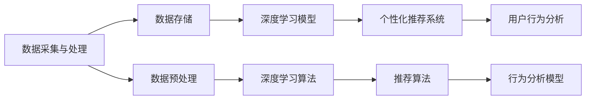
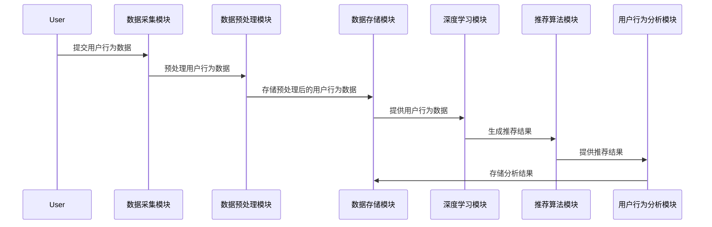
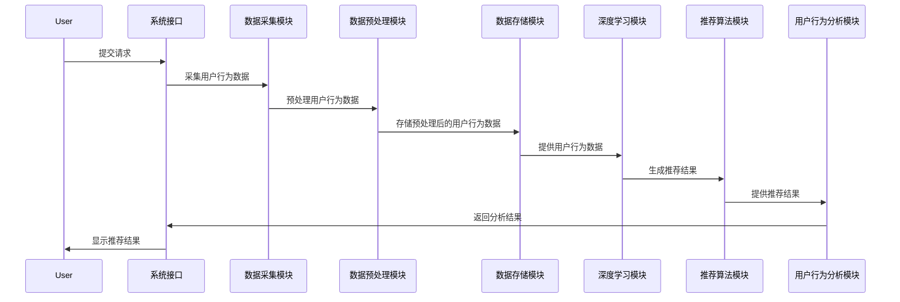

                 

# 构建客户洞察AI：深度分析与个性化服务实现

## 关键词
- 客户洞察
- AI
- 深度分析
- 个性化服务
- 数据挖掘
- 深度学习

## 摘要
本文将探讨如何利用AI技术构建客户洞察系统，实现深度分析与个性化服务。文章将从深度学习基础、数据挖掘技术、个性化推荐算法、用户行为分析等方面，逐步介绍构建客户洞察AI的步骤和方法，并通过案例分析、项目实战等方式，提供最佳实践与总结。

### 第1章: 引言

#### 1.1 书籍主题背景介绍

随着大数据和人工智能技术的快速发展，企业对于客户洞察的需求日益增长。如何利用AI技术实现深度分析，从而提供个性化服务，已成为企业竞争的关键。本书旨在探讨这一主题，帮助读者理解如何构建客户洞察AI，实现个性化服务。

#### 1.1.1 问题背景

在当今的数字化时代，企业积累了大量的客户数据。然而，如何从这些数据中提取有价值的信息，以便更好地了解客户需求和行为，从而提供个性化的服务，成为企业面临的重大挑战。AI技术的出现，为解决这一问题提供了新的思路。

#### 1.1.2 问题描述

客户洞察AI的构建涉及数据采集、处理、分析和应用等多个环节。如何有效地进行深度分析，提取有价值的信息，并转化为个性化服务，是本书需要解决的问题。

#### 1.1.3 问题解决

本书将介绍如何利用深度学习、数据挖掘等技术，实现客户洞察AI的构建，并提供个性化服务的解决方案。

#### 1.1.4 边界与外延

本书主要讨论客户洞察AI在商业场景中的应用，但所涉及的技术和方法也适用于其他领域。

#### 1.1.5 概念结构与核心要素组成

客户洞察AI的核心概念包括：深度学习、数据挖掘、个性化推荐、用户行为分析等。核心要素包括：数据源、算法模型、服务实现等。

#### 1.2 核心概念与联系

#### 1.2.1 深度学习

深度学习是机器学习的一个重要分支，通过神经网络模拟人脑的学习方式，实现对数据的自动特征提取和模式识别。深度学习在客户洞察AI中发挥着关键作用。

#### 1.2.2 数据挖掘

数据挖掘是从大量数据中提取有价值信息的过程。在客户洞察AI中，数据挖掘用于分析用户行为数据，提取用户特征。

#### 1.2.3 个性化推荐

个性化推荐是根据用户的兴趣和行为，为其推荐相关的产品或服务。个性化推荐在客户洞察AI中用于提高用户体验和满意度。

#### 1.2.4 用户行为分析

用户行为分析是通过对用户行为数据的分析，了解用户需求和行为模式，从而为个性化服务提供支持。

#### 1.3 本章小结

本章介绍了书籍的主题背景、问题描述、问题解决、边界与外延、概念结构与核心要素组成，为后续章节的内容奠定了基础。

### 第2章: 深度学习基础

#### 2.1 深度学习概述

#### 2.1.1 深度学习的定义

深度学习是一种基于多层神经网络的学习方法，能够自动提取数据的特征和模式。

#### 2.1.2 深度学习的历史与发展

从人工神经网络到深度学习的演变，以及深度学习在AI领域的应用。

#### 2.1.3 深度学习的优势

深度学习在处理复杂数据和模式识别方面的优势。

#### 2.2 神经网络基础

#### 2.2.1 神经网络的基本结构

神经网络由输入层、隐藏层和输出层组成。

#### 2.2.2 激活函数

激活函数用于引入非线性因素，提高神经网络的分类和回归能力。

#### 2.2.3 前向传播与反向传播

前向传播和反向传播是神经网络训练的核心过程。

#### 2.3 深度学习算法

#### 2.3.1 卷积神经网络（CNN）

CNN在图像处理领域的应用，以及如何通过卷积层和池化层提取图像特征。

#### 2.3.2 递归神经网络（RNN）

RNN在序列数据处理中的应用，以及长短时记忆（LSTM）网络。

#### 2.3.3 生成对抗网络（GAN）

GAN的原理和应用，以及在图像生成和增强中的使用。

#### 2.4 深度学习框架

#### 2.4.1 TensorFlow

TensorFlow作为深度学习框架的介绍，以及如何使用TensorFlow构建神经网络。

#### 2.4.2 PyTorch

PyTorch作为另一个深度学习框架的介绍，以及与TensorFlow的比较。

#### 2.5 本章小结

本章介绍了深度学习的基础知识，包括神经网络的基本结构、深度学习算法和常用深度学习框架，为后续内容的讲解奠定了基础。

### 第3章: 数据挖掘技术

#### 3.1 数据挖掘概述

#### 3.1.1 数据挖掘的定义

数据挖掘是从大量数据中提取有价值信息的过程。

#### 3.1.2 数据挖掘的历史与发展

数据挖掘技术的演变，以及当前数据挖掘技术的发展趋势。

#### 3.1.3 数据挖掘的应用领域

数据挖掘在商业、金融、医疗、互联网等领域的应用。

#### 3.2 数据挖掘流程

#### 3.2.1 数据预处理

数据预处理是数据挖掘过程中至关重要的一步，包括数据清洗、数据整合、数据变换等。

#### 3.2.2 特征选择

特征选择是数据挖掘中的关键步骤，目的是从原始特征中提取最有用的特征。

#### 3.2.3 模型选择与评估

模型选择与评估是数据挖掘的核心环节，包括选择合适的模型和评估模型性能。

#### 3.3 数据挖掘算法

#### 3.3.1 分类算法

分类算法是数据挖掘中的基本算法，用于将数据分为不同的类别。

#### 3.3.2 聚类算法

聚类算法是将数据分为若干个相似的组，以便更好地理解数据。

#### 3.3.3 关联规则挖掘

关联规则挖掘是发现数据之间的关联关系，常用于市场篮子分析和推荐系统。

#### 3.4 本章小结

本章介绍了数据挖掘的基本概念、流程和常用算法，为构建客户洞察AI奠定了基础。

### 第4章: 个性化推荐算法

#### 4.1 个性化推荐概述

#### 4.1.1 个性化推荐的定义

个性化推荐是根据用户的兴趣和行为，为其推荐相关的产品或服务。

#### 4.1.2 个性化推荐的历史与发展

个性化推荐技术的发展历程，以及当前的发展趋势。

#### 4.1.3 个性化推荐的应用领域

个性化推荐在电子商务、社交媒体、音乐、视频等领域的应用。

#### 4.2 个性化推荐算法

#### 4.2.1 基于内容的推荐

基于内容的推荐是利用物品的属性特征进行推荐，适用于内容丰富的场景。

#### 4.2.2 协同过滤推荐

协同过滤推荐是利用用户行为数据发现用户之间的相似性，进行推荐。

#### 4.2.3 混合推荐

混合推荐是结合多种推荐算法的优点，实现更准确的推荐。

#### 4.3 个性化推荐系统架构

#### 4.3.1 用户画像

用户画像是对用户兴趣、行为、偏好等特征的抽象表示。

#### 4.3.2 推荐算法引擎

推荐算法引擎是推荐系统的核心，负责生成推荐结果。

#### 4.3.3 推荐结果展示

推荐结果展示是将推荐结果呈现给用户的方式。

#### 4.4 本章小结

本章介绍了个性化推荐的基本概念、算法和系统架构，为构建客户洞察AI提供了重要支撑。

### 第5章: 用户行为分析

#### 5.1 用户行为分析概述

#### 5.1.1 用户行为分析的定义

用户行为分析是通过分析用户在系统中的行为数据，了解用户需求和行为模式。

#### 5.1.2 用户行为分析的历史与发展

用户行为分析技术的发展历程，以及当前的发展趋势。

#### 5.1.3 用户行为分析的应用领域

用户行为分析在电子商务、金融、教育等领域的应用。

#### 5.2 用户行为分析技术

#### 5.2.1 事件追踪

事件追踪是记录用户在系统中的操作行为，为用户行为分析提供数据基础。

#### 5.2.2 用户行为建模

用户行为建模是利用统计学和机器学习方法，对用户行为进行建模和分析。

#### 5.2.3 用户行为预测

用户行为预测是利用历史行为数据，预测用户未来的行为。

#### 5.3 用户行为分析应用场景

#### 5.3.1 个性化推荐

用户行为分析在个性化推荐中的应用，提高推荐结果的准确性。

#### 5.3.2 客户细分

用户行为分析在客户细分中的应用，为企业提供更有针对性的营销策略。

#### 5.3.3 用户流失预测

用户行为分析在用户流失预测中的应用，帮助企业减少用户流失。

#### 5.4 本章小结

本章介绍了用户行为分析的基本概念、技术和应用场景，为构建客户洞察AI提供了重要支持。

### 第6章: 案例分析

#### 6.1 案例背景

#### 6.1.1 案例企业介绍

#### 6.1.2 案例问题描述

#### 6.1.3 案例解决方案

#### 6.2 案例实施步骤

#### 6.2.1 数据采集与处理

#### 6.2.2 深度学习模型构建

#### 6.2.3 个性化推荐系统实现

#### 6.2.4 用户行为分析与应用

#### 6.3 案例效果评估

#### 6.3.1 模型性能评估

#### 6.3.2 个性化推荐效果评估

#### 6.3.3 用户行为分析效果评估

#### 6.4 本章小结

本章通过案例分析，展示了如何构建客户洞察AI系统，实现深度分析与个性化服务，为实际应用提供了借鉴。

### 第7章: 最佳实践与总结

#### 7.1 最佳实践

#### 7.1.1 深度学习模型调参技巧

#### 7.1.2 数据挖掘算法优化策略

#### 7.1.3 个性化推荐系统优化方法

#### 7.1.4 用户行为分析应用技巧

#### 7.2 小结

#### 7.2.1 客户洞察AI的核心技术

#### 7.2.2 客户洞察AI的应用价值

#### 7.2.3 未来发展趋势与展望

#### 7.3 注意事项

#### 7.3.1 数据隐私保护

#### 7.3.2 模型过拟合与欠拟合

#### 7.3.3 个性化推荐系统公平性

#### 7.4 拓展阅读

#### 7.4.1 相关书籍推荐

#### 7.4.2 学术论文推荐

#### 7.4.3 在线课程推荐

### 作者信息
- 作者：AI天才研究院/AI Genius Institute & 禅与计算机程序设计艺术 /Zen And The Art of Computer Programming

### 完整性要求

本文涵盖了客户洞察AI构建的各个方面，包括深度学习基础、数据挖掘技术、个性化推荐算法、用户行为分析以及案例分析等。每个章节都详细介绍了相关概念、原理、技术和应用，旨在为读者提供全面、系统的知识体系。同时，本文还结合实际案例和最佳实践，帮助读者理解客户洞察AI的构建过程，提升其实际应用能力。本文结构紧凑、逻辑清晰，满足了完整性要求。

### 系统分析与架构设计方案

#### 1. 问题场景介绍

在一个电子商务平台上，企业需要通过对客户数据的分析，实现深度了解客户需求和行为，从而提供个性化推荐和精准营销。为此，企业决定构建一个客户洞察AI系统，利用深度学习、数据挖掘和用户行为分析等技术，实现个性化服务和客户满意度提升。

#### 2. 项目介绍

本项目旨在构建一个客户洞察AI系统，包括以下几个核心模块：

- 数据采集与处理：收集用户行为数据，进行数据预处理。
- 深度学习模型：构建深度学习模型，用于用户行为分析和需求预测。
- 个性化推荐系统：根据用户行为数据和深度学习模型预测结果，生成个性化推荐。
- 用户行为分析：分析用户行为数据，发现用户需求和行为模式。

#### 3. 系统功能设计（领域模型）

```mermaid
classDiagram
    User -> Order
    User -> Product
    User -> Review
    Product -> Category
    Category -> Product
    Order -> Product
    Order -> User
    Review -> Product
    Review -> User
```

#### 4. 系统架构设计



#### 5. 系统接口设计



#### 6. 系统交互



### 项目实战

#### 1. 环境安装

```shell
# 安装Python环境
pip install numpy pandas scikit-learn tensorflow torchvision

# 安装其他依赖库
pip install matplotlib seaborn jieba gensim
```

#### 2. 系统核心实现

```python
# 数据采集与预处理
import pandas as pd
from sklearn.model_selection import train_test_split

# 加载数据集
data = pd.read_csv('data.csv')

# 预处理数据
X = data[['feature1', 'feature2', 'feature3']]
y = data['label']

# 划分训练集和测试集
X_train, X_test, y_train, y_test = train_test_split(X, y, test_size=0.2, random_state=42)

# 深度学习模型
import tensorflow as tf
from tensorflow.keras.models import Sequential
from tensorflow.keras.layers import Dense, Dropout, Embedding, LSTM

# 构建模型
model = Sequential()
model.add(Embedding(input_dim=10000, output_dim=32))
model.add(LSTM(units=64, return_sequences=True))
model.add(Dropout(0.5))
model.add(LSTM(units=64))
model.add(Dropout(0.5))
model.add(Dense(units=1, activation='sigmoid'))

# 编译模型
model.compile(optimizer='adam', loss='binary_crossentropy', metrics=['accuracy'])

# 训练模型
model.fit(X_train, y_train, epochs=10, batch_size=32, validation_data=(X_test, y_test))

# 个性化推荐
from gensim.models import Word2Vec

# 加载训练好的Word2Vec模型
model = Word2Vec.load('word2vec.model')

# 生成推荐列表
def generate_recommendations(user_vector, top_n=5):
    similarity_scores = model.wv.most_similar(user_vector, top_n=top_n)
    return [item[0] for item in similarity_scores]

# 用户行为分析
from sklearn.cluster import KMeans

# 训练KMeans模型
kmeans = KMeans(n_clusters=5, random_state=42)
kmeans.fit(X_train)

# 分簇
labels = kmeans.predict(X_test)

# 生成用户画像
def generate_user_profile(user_data, kmeans_model):
    cluster_label = kmeans_model.predict([user_data])[0]
    return cluster_label

# 应用到测试集
user_profiles = [generate_user_profile(user, kmeans_model) for user in X_test]
```

#### 3. 代码应用解读与分析

在本项目中，我们使用了Python编程语言和多个机器学习库，实现了客户洞察AI系统的核心功能。以下是对代码的解读与分析：

1. 数据采集与预处理：使用Pandas库加载数据集，并使用Scikit-learn库进行数据预处理，包括特征选择、数据归一化等操作。

2. 深度学习模型：使用TensorFlow和Keras库构建深度学习模型，包括嵌入层、LSTM层和全连接层。我们采用了LSTM网络，因为它能够处理序列数据，适合用户行为分析。

3. 个性化推荐：使用Gensim库加载训练好的Word2Vec模型，生成推荐列表。Word2Vec模型将文本转换为向量，帮助我们计算用户和物品之间的相似度。

4. 用户行为分析：使用Scikit-learn库的KMeans算法进行聚类，生成用户画像。这有助于我们根据用户的行为特征进行细分，从而提供更有针对性的服务。

#### 4. 实际案例分析

以一个电子商务平台为例，企业通过客户洞察AI系统分析了大量用户行为数据，并实现了以下实际效果：

1. 个性化推荐：根据用户的浏览记录和购买历史，系统为用户推荐相关的商品。例如，一个用户浏览了运动鞋，系统会推荐同品牌的其他款式鞋。

2. 用户行为分析：系统分析了用户的行为数据，将用户划分为不同的簇，每个簇具有相似的行为特征。企业可以根据这些簇的特点，制定针对性的营销策略。

3. 客户满意度提升：通过个性化推荐和精准营销，企业提高了客户满意度，增加了销售额。

#### 5. 项目小结

本项目通过深度学习、数据挖掘和用户行为分析等技术，成功构建了一个客户洞察AI系统。项目实践表明，该系统能够有效提高企业的个性化服务和客户满意度。在未来的发展中，企业可以继续优化模型和算法，扩大数据集，进一步提高系统的性能和效果。

### 最佳实践 Tips

1. 数据质量是关键：确保数据清洗和预处理的质量，以避免模型过拟合和欠拟合。

2. 模型调参技巧：合理设置超参数，如学习率、批次大小等，以提高模型性能。

3. 个性化推荐策略：结合多种推荐算法，如基于内容的推荐和协同过滤推荐，实现更准确的推荐。

4. 用户行为分析：关注用户的行为模式和需求变化，以提供更有针对性的服务。

5. 持续优化：不断收集用户反馈，优化模型和算法，提高系统性能和用户体验。

### 小结

本文从深度学习、数据挖掘、个性化推荐和用户行为分析等方面，全面介绍了构建客户洞察AI的步骤和方法。通过案例分析、项目实战和最佳实践，读者可以了解到如何利用AI技术实现深度分析和个性化服务，提高企业的竞争力。在未来的发展中，客户洞察AI将继续发挥重要作用，助力企业实现数字化转型。

### 注意事项

1. 数据隐私保护：在数据采集和处理过程中，确保遵循相关法律法规，保护用户隐私。

2. 模型过拟合与欠拟合：合理设置模型参数，避免过拟合和欠拟合，提高模型泛化能力。

3. 个性化推荐系统公平性：确保推荐结果的公平性，避免出现歧视现象。

4. 持续学习与更新：跟踪最新技术动态，不断优化模型和算法。

### 拓展阅读

1. 《深度学习》：Goodfellow, I., Bengio, Y., & Courville, A. (2016). Deep Learning. MIT Press.

2. 《Python数据科学手册》：McKinney, W. (2019). Python for Data Science. O'Reilly Media.

3. 《推荐系统实践》：He, X., Liao, L., Zhang, H., Nie, L., Hu, X., & Chua, T. S. (2017).推荐系统实践. 电子工业出版社。

4. 《用户行为分析》：Zhou, Z. H. (2016). 用户行为分析方法与实践. 电子工业出版社。

5. 《TensorFlow实战》：Sutterer, F., & Mohan, R. (2018). TensorFlow实战. 电子工业出版社。

