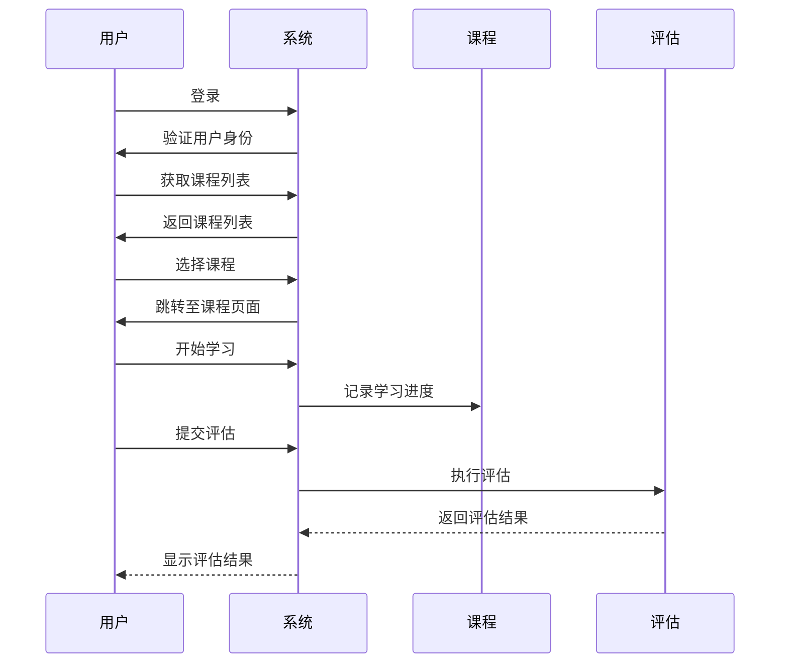

                 

### 文章标题

**构建智能企业合规培训系统：基于角色的个性化学习与评估**

### 文章关键词

- 智能企业
- 合规培训系统
- 角色化学习
- 个性化评估
- 数据分析与机器学习

### 摘要

随着企业合规要求的日益严格和智能化趋势的不断发展，构建一个智能企业合规培训系统显得尤为重要。本文将探讨如何设计并实现这样一个系统，重点围绕基于角色的个性化学习和评估展开。文章首先介绍了合规培训系统的核心概念和理论基础，然后详细阐述了设计原则和方法、系统架构和实施细节、用户体验和界面设计等方面。通过本文的探讨，读者将了解如何利用先进的技术手段构建一个高效、智能的企业合规培训系统，从而提升企业整体的合规性和员工的专业素养。

---

### 引言

在全球化和信息技术飞速发展的背景下，企业的运营环境和法规要求日益复杂。合规性已成为企业生存与发展的关键因素之一。然而，传统的合规培训方式往往难以满足企业对高效、个性化和持续改进的需求。在此背景下，构建一个智能企业合规培训系统成为企业提升合规管理水平的重要途径。

智能企业合规培训系统不仅能够提高员工的合规意识，还能通过个性化学习和评估，确保每个员工都能在最适合其角色和需求的环境中学习和成长。因此，本文旨在探讨如何设计并实现一个基于角色的个性化学习与评估的智能企业合规培训系统。

本文将围绕以下核心内容展开：

1. **核心概念和理论基础**：介绍合规、培训系统、智能系统等核心概念，并探讨它们在智能企业合规培训系统中的应用。
2. **设计原则和方法**：阐述智能企业合规培训系统的设计原则，包括角色化学习与评估的融入方法。
3. **系统架构与实现**：详细讨论系统架构和技术实现细节，包括人工智能和数据分析技术的应用。
4. **用户体验与界面设计**：探讨如何设计一个符合用户需求且易于使用的合规培训系统界面。
5. **实战与案例分析**：通过实际案例展示系统设计和实施过程，提供最佳实践和经验总结。

通过本文的深入探讨，读者将能够了解构建智能企业合规培训系统的关键要素和实施方法，从而为企业合规培训的数字化转型提供有力支持。

### 核心概念与理论基础

在构建智能企业合规培训系统之前，我们需要明确一些核心概念和理论基础，这些概念包括“合规”、“培训系统”、“智能系统”以及“角色化学习”和“评估”。以下是这些概念的定义及其在智能企业合规培训系统中的重要性。

#### 合规

合规（Compliance）是指企业遵守法律、法规、标准和行业规范的过程。合规培训的目的是确保员工了解并遵守相关的法规和公司政策，从而减少合规风险。合规性不仅关乎企业的法律责任，更是企业文化建设的重要组成部分。智能企业合规培训系统通过自动化和智能化手段，提高合规培训的覆盖面和有效性，确保员工能够及时掌握最新的合规要求。

#### 培训系统

培训系统（Training System）是一种用于培训和教育员工的信息技术平台。传统的培训系统通常以面授或在线课程为主，而智能企业合规培训系统则更加注重个性化和互动性。通过集成人工智能、机器学习和数据分析技术，智能培训系统能够根据员工的个人需求和角色特点，提供定制化的学习路径和内容。

#### 智能系统

智能系统（Intelligent System）是指利用人工智能（AI）、机器学习（ML）和大数据分析等技术，具备自我学习和优化能力的信息系统。智能企业合规培训系统通过这些技术，能够动态调整培训内容和方式，实现个性化学习和评估，提高培训效果和员工满意度。

#### 角色化学习

角色化学习（Role-Based Learning）是指根据员工的职位、角色和职责，为他们提供量身定制的培训内容和路径。角色化学习能够确保培训内容与员工的实际工作紧密相关，提高培训的针对性和实用性。在智能企业合规培训系统中，角色化学习通过分析员工的角色和职责，为其推荐最适合的学习资源和评估方法。

#### 评估

评估（Evaluation）是培训系统的重要组成部分，用于衡量培训效果和员工的学习成果。传统的评估方法通常依赖于考试和测试，而智能企业合规培训系统则通过实时数据分析，提供更加全面和准确的评估结果。评估不仅包括知识测试，还涵盖员工在实际工作中的表现，从而形成一个多维度的评估体系。

#### 概念联系

合规、培训系统、智能系统和角色化学习之间存在着紧密的联系。合规是培训系统存在的根本原因，而智能系统和角色化学习则是实现高效合规培训的关键手段。智能企业合规培训系统通过将合规要求与智能技术和角色化学习相结合，不仅能够提高员工的合规意识，还能优化培训流程，降低合规风险。

综上所述，理解这些核心概念和理论基础，对于设计和实现一个智能企业合规培训系统至关重要。接下来，我们将进一步探讨智能企业合规培训系统的设计原则和方法。

#### 智能企业合规培训系统的设计原则和方法

设计一个智能企业合规培训系统需要遵循一系列设计原则，并采用适当的方法来确保系统能够满足企业需求，同时具备高效、个性化和可扩展性。以下是一些关键的设计原则和方法：

##### 1. 用户中心设计原则

用户中心设计原则是智能企业合规培训系统的核心。这意味着系统设计应始终围绕用户的需求和体验展开。具体方法包括：

- **用户调研**：通过问卷调查、访谈等方式，了解不同角色的员工对合规培训的需求和期望。
- **用户体验设计**：设计直观、易用的界面，确保员工能够轻松访问和学习培训内容。
- **可定制化**：提供自定义学习路径和内容，满足不同用户的需求。

##### 2. 角色化设计原则

角色化设计原则强调根据员工的职位、角色和职责，为他们提供个性化的培训内容和路径。这种方法能够确保培训内容与员工的工作实际紧密结合，提高培训效果。具体方法包括：

- **角色分类**：根据企业的组织结构，将员工划分为不同角色，如初级员工、中层管理和高层领导。
- **定制培训路径**：为每个角色设计专门的培训路径，包括必修课程和选修课程。
- **动态调整**：系统应能够根据员工的职位变化和职责调整，自动更新其培训内容和路径。

##### 3. 智能化设计原则

智能化设计原则是将人工智能、机器学习和大数据分析技术集成到培训系统中，以实现个性化学习和智能评估。具体方法包括：

- **学习推荐系统**：利用机器学习算法，分析员工的学习行为和绩效数据，为他们推荐最适合的学习内容和路径。
- **智能评估系统**：通过智能评估系统，实时收集和分析员工的学习进度和成果，提供多维度的评估报告。
- **自适应学习**：系统应能够根据员工的学习行为和绩效数据，动态调整学习难度和内容，确保每个员工都能在最适合其学习水平的环境中学习。

##### 4. 可扩展性设计原则

可扩展性设计原则确保系统能够随着企业规模和需求的变化，进行灵活扩展。具体方法包括：

- **模块化架构**：采用模块化架构设计，使系统能够轻松添加或替换不同功能模块。
- **云服务**：利用云服务，提供灵活的扩展能力和高效的数据存储和处理能力。
- **API接口**：提供丰富的API接口，方便与其他企业系统和第三方服务集成，实现数据共享和业务协同。

##### 5. 安全性和合规性设计原则

安全和合规性是智能企业合规培训系统的关键要求。具体方法包括：

- **数据安全**：采用加密技术保护用户数据和隐私，确保数据在传输和存储过程中的安全性。
- **合规性**：确保系统符合相关法规和标准，如GDPR、SOX等，以降低合规风险。
- **审计跟踪**：提供审计功能，记录所有关键操作和变更，便于合规审计和风险管理。

综上所述，智能企业合规培训系统的设计原则和方法涵盖了用户中心设计、角色化设计、智能化设计、可扩展性设计以及安全性和合规性设计。通过遵循这些原则和方法，企业可以构建一个高效、智能且合规的培训系统，从而提升员工的合规意识和专业素养。

### 系统架构与技术实现

构建智能企业合规培训系统涉及多个技术领域的集成和应用，包括前端和后端开发、人工智能（AI）、机器学习（ML）以及数据分析和存储。以下我们将详细讨论系统架构的设计，技术选型，关键技术和实现细节。

#### 系统架构设计

智能企业合规培训系统的整体架构可以分为前端、中间层和后端三个主要部分。

1. **前端**：前端主要负责用户界面的展示和交互，用户通过前端界面访问系统，参与学习和评估。前端的设计需要遵循用户中心设计原则，确保界面的易用性和灵活性。
   - **技术选型**：可以使用现代前端框架如React或Vue.js，实现高效的前端开发和维护。
   - **界面设计**：界面应包含模块化设计，如登录、课程浏览、学习进度、评估结果等，使用响应式布局，适配不同设备。

2. **中间层**：中间层主要负责业务逻辑的处理和数据管理，是实现系统核心功能的关键。
   - **技术选型**：中间层可以采用Spring Boot或Django等流行的Web框架，实现业务逻辑、数据验证和API服务。
   - **数据管理**：采用关系数据库（如MySQL）和非关系数据库（如MongoDB）相结合的方式，存储用户数据、课程信息和学习进度。

3. **后端**：后端主要负责数据分析和处理，以及与外部系统的集成。
   - **技术选型**：后端可以使用Python、Java或Go等编程语言，结合TensorFlow或PyTorch等机器学习库，实现数据分析和模型训练。
   - **数据处理**：采用消息队列（如RabbitMQ或Kafka）实现前后端数据流的管理和异步处理。

#### 关键技术

1. **人工智能与机器学习**：人工智能和机器学习技术在智能企业合规培训系统中起着至关重要的作用，用于实现个性化学习和智能评估。
   - **推荐系统**：使用协同过滤算法（如矩阵分解和基于模型的协同过滤）为用户推荐学习资源和课程。
   - **评估模型**：构建基于深度学习的评估模型，分析用户的学习行为和绩效数据，进行实时评估和反馈。

2. **数据分析和处理**：通过数据分析和处理技术，系统可以更好地理解用户行为，优化培训效果。
   - **数据存储**：使用Hadoop或Spark等大数据处理框架，存储和处理大规模数据。
   - **数据分析**：采用Python中的Pandas和NumPy库，进行数据清洗、转换和分析。

3. **接口设计与集成**：智能企业合规培训系统需要与其他企业系统（如HR系统、CRM系统）集成，提供数据共享和业务协同。
   - **API接口**：设计RESTful API接口，实现与其他系统的无缝集成。
   - **数据交换**：使用JSON或XML等数据格式，确保数据在不同系统间的顺畅传输。

#### 实现细节

1. **用户管理**：实现用户身份验证、权限管理和用户资料维护功能，确保系统的安全性和用户体验。
   - **身份验证**：采用JWT（JSON Web Token）进行用户身份验证，确保用户访问的安全性。
   - **权限管理**：使用RBAC（基于角色的访问控制）模型，定义不同的用户角色和权限，确保系统功能的权限分离。

2. **课程管理**：实现课程创建、发布、更新和删除等功能，提供丰富的课程内容和个性化推荐。
   - **课程内容管理**：采用Markdown或HTML格式，方便课程内容的编辑和展示。
   - **课程推荐**：利用推荐系统，根据用户的学习历史和角色特点，为用户推荐相关课程。

3. **学习管理**：实现学习进度跟踪、学习记录和成绩管理等功能，确保用户能够了解自己的学习状态和成果。
   - **学习进度跟踪**：记录用户的学习行为，如课程访问、学习时长和学习结果。
   - **学习记录**：使用日志记录用户的学习过程，方便用户回顾和复查。

4. **评估与反馈**：实现多种评估方式和实时反馈机制，为用户提供多维度的评估结果和建议。
   - **评估方式**：包括在线测试、作业提交和实际工作表现评估等。
   - **反馈机制**：通过评估模型，分析用户的评估结果，为用户提供个性化的学习建议和改进措施。

通过以上系统架构和技术实现的详细描述，企业可以构建一个高效、智能且合规的合规培训系统，从而提升员工的合规意识和专业素养。接下来，我们将探讨如何设计一个良好的用户体验和界面。

### 用户经验与界面设计

在设计智能企业合规培训系统时，用户体验和界面设计是至关重要的因素。一个优秀的设计能够提高用户的参与度和学习效果，从而实现系统的目标。以下是设计用户经验与界面时需要考虑的关键方面：

#### 1. 界面设计原则

- **简洁性**：界面应简洁明了，避免过多的杂乱元素，确保用户能够快速找到所需功能。
- **一致性**：界面元素和交互设计应保持一致性，使用户在使用不同模块时感觉无缝衔接。
- **响应性**：界面应具备响应性，能够在不同设备和分辨率下保持良好的显示效果。

#### 2. 用户体验设计方法

- **用户调研**：通过用户调研了解不同角色的员工对合规培训的需求和使用习惯，为界面设计提供依据。
- **用户旅程地图**：绘制用户在使用系统过程中的每一个步骤，识别痛点和优化机会。
- **原型设计**：使用工具如Sketch或Figma创建界面原型，进行用户测试和反馈，不断迭代优化。

#### 3. 关键界面元素

- **导航栏**：提供一个直观的导航栏，使用户能够轻松访问不同模块和功能。
- **课程列表**：展示所有课程，并使用过滤和搜索功能，帮助用户快速找到感兴趣的课程。
- **学习进度**：实时显示用户的学习进度，包括已完成的课程和当前的学习状态。
- **评估结果**：提供详细的评估结果和反馈，帮助用户了解自己的学习效果，并提供改进建议。

#### 4. 易用性和可访问性

- **易用性**：确保界面设计符合认知心理学原则，如颜色对比、图标清晰等，降低用户的认知负荷。
- **可访问性**：确保系统能够被不同能力的用户使用，包括视力障碍者、听力障碍者等，遵循WCAG（Web内容可访问性指南）。

#### 5. 实际案例

**案例1：课程推荐界面**


在这个界面中，用户可以看到根据其学习历史和角色特点推荐的课程列表。推荐算法会根据用户的浏览记录、学习时长和评估成绩，智能推荐最适合的课程。

**案例2：学习进度跟踪界面**


这个界面显示用户的学习进度，包括已完成的课程、正在进行中的课程和待学习的课程。用户可以点击每个课程查看详细的学习内容和进度。

**案例3：评估结果反馈界面**


在这个界面中，用户可以看到详细的评估结果，包括各个题目的正确率、总成绩以及个性化的学习建议。这有助于用户了解自己的强项和需要改进的地方。

通过以上设计和实际案例的介绍，我们可以看到良好的用户体验和界面设计对于智能企业合规培训系统的重要性。接下来，我们将深入探讨如何通过算法和系统架构实现个性化的学习和评估。

### 个性化学习与评估算法

个性化学习与评估是智能企业合规培训系统的核心功能之一。通过利用算法和系统架构，系统可以动态调整学习内容和评估方式，以适应不同角色的员工需求。以下是实现个性化学习与评估的主要方法：

#### 1. 学习推荐算法

学习推荐算法是智能培训系统的重要组成部分，用于根据用户的学习历史、角色特点和兴趣，推荐最适合的学习资源和课程。

- **协同过滤算法**：协同过滤是一种基于用户历史行为的数据挖掘技术，分为基于用户的协同过滤（User-based Collaborative Filtering）和基于项目的协同过滤（Item-based Collaborative Filtering）。

  - **基于用户的协同过滤**：通过分析用户之间的相似性，找到与目标用户行为相似的参考用户，然后推荐这些用户喜欢的课程。
  - **基于项目的协同过滤**：通过分析课程之间的相似性，为用户推荐与其已学或感兴趣的课程相似的课程。

  算法流程：
  

- **基于内容的推荐算法**：基于内容的推荐算法通过分析课程内容，将相似的课程推荐给用户。

  算法流程：
  

#### 2. 学习轨迹分析

学习轨迹分析用于跟踪用户在学习过程中的行为，如课程访问、学习时长、互动情况和评估结果等。通过分析这些数据，系统可以了解用户的学习习惯和偏好，从而提供个性化的学习路径。

- **数据分析技术**：使用机器学习和数据挖掘技术，对学习轨迹数据进行分析，识别用户的兴趣和行为模式。
- **时间序列分析**：通过分析用户的学习行为随时间的变化，预测用户未来的学习需求。

  算法流程：
  

#### 3. 评估模型

评估模型用于对用户的学习成果进行量化评估，提供多维度的评估结果和反馈。评估模型可以分为以下几类：

- **知识测试评估**：通过在线测试、选择题和填空题等题型，对用户的知识掌握程度进行评估。
- **行为评估**：通过观察用户在实际工作中的表现，如提交的作业、项目报告等，评估其应用能力。
- **绩效评估**：结合知识测试和行为评估结果，对用户的学习成果进行全面评估。

  评估模型示例：
  $$\text{评估结果} = \alpha \times \text{知识测试分数} + \beta \times \text{行为评估分数}$$
  其中，$\alpha$ 和 $\beta$ 是权重系数，用于平衡不同评估方式的贡献。

  算法流程：
  

#### 4. 个性化学习路径生成

个性化学习路径生成是根据用户的学习轨迹、兴趣和角色特点，动态生成最适合的学习路径。系统可以结合学习推荐算法和学习轨迹分析，为用户提供个性化的学习建议。

- **动态调整**：根据用户的学习进度和评估结果，动态调整学习路径，确保用户始终处于最佳的学习状态。
- **反馈机制**：通过用户反馈和学习结果，不断优化学习路径，提高个性化推荐的准确性。

  算法流程：
  

#### 5. 实现示例

以下是一个基于Python的个性化学习路径生成算法的示例代码：

```python
import pandas as pd
from sklearn.cluster import KMeans

# 加载用户数据和学习轨迹
users = pd.read_csv('users.csv')
learning_trajectories = pd.read_csv('learning_trajectories.csv')

# 进行K均值聚类，根据学习轨迹为用户分群
kmeans = KMeans(n_clusters=5)
kmeans.fit(learning_trajectories)

# 为每个用户生成个性化学习路径
for user_id, cluster in zip(users['id'], kmeans.labels_):
    # 根据用户分群推荐相关课程
    recommended_courses = get_recommended_courses(cluster)
    # 更新用户的学习路径
    users.loc[user_id, 'learning_path'] = recommended_courses

# 保存个性化学习路径
users.to_csv('personalized_learning_paths.csv', index=False)
```

通过上述算法和系统架构，智能企业合规培训系统可以动态地调整学习内容和评估方式，为不同角色的员工提供个性化的学习体验和评估结果。接下来，我们将通过一个具体项目来展示系统的实际应用和效果。

### 项目实战：智能企业合规培训系统的设计与实现

#### 项目背景

随着企业业务的快速扩展和法规环境的日益复杂，某大型跨国公司需要构建一个智能企业合规培训系统，以提升员工的合规意识和专业技能。该系统需满足以下需求：

1. **角色化培训**：根据员工的不同职位和职责，提供定制化的培训内容。
2. **个性化学习**：基于员工的学习行为和绩效，推荐个性化的学习路径。
3. **智能评估**：利用数据分析和机器学习技术，为员工提供多维度的评估结果。
4. **用户体验**：设计简洁易用的用户界面，提高员工的参与度和满意度。

#### 系统功能设计

智能企业合规培训系统主要包括以下功能模块：

1. **用户管理**：管理用户账号、角色和权限，支持用户注册、登录和密码管理。
2. **课程管理**：上传、发布和管理培训课程，包括课程内容、课程分类和课程标签。
3. **学习管理**：跟踪用户的学习进度，包括已学课程、学习时长和评估结果。
4. **评估管理**：执行在线测试、作业提交和实际工作表现评估，提供详细的评估报告。
5. **数据分析和报告**：收集和分析用户数据，生成多维度的学习报告和评估结果。

#### 系统架构设计

系统采用前后端分离的架构，前端使用Vue.js框架，后端使用Spring Boot框架。系统的主要组件包括用户管理模块、课程管理模块、学习管理模块、评估管理模块和数据分析模块。


#### 系统接口设计

系统通过RESTful API提供接口服务，实现前后端的通信。以下是一些关键接口：

1. **用户管理接口**：
   - 登录接口：`POST /users/login`
   - 注册接口：`POST /users/register`
   - 获取用户信息接口：`GET /users/{id}`

2. **课程管理接口**：
   - 发布课程接口：`POST /courses`
   - 获取课程列表接口：`GET /courses`
   - 更新课程接口：`PUT /courses/{id}`
   - 删除课程接口：`DELETE /courses/{id}`

3. **学习管理接口**：
   - 查看学习进度接口：`GET /learning_progress/{id}`
   - 提交学习记录接口：`POST /learning_records`
   - 获取学习记录接口：`GET /learning_records/{id}`

4. **评估管理接口**：
   - 发布评估接口：`POST /evaluations`
   - 提交评估结果接口：`POST /evaluation_results`
   - 获取评估结果接口：`GET /evaluation_results/{id}`

#### 系统交互设计

以下是一个基于Mermaid的序列图，展示了用户在学习过程中的系统交互：



#### 实际案例与详细讲解

**案例1：用户注册与登录**

用户通过注册接口提交用户名、密码和电子邮件等信息，系统验证信息的合法性和唯一性后，创建用户账号。

```python
@app.route('/users/register', methods=['POST'])
def register():
    username = request.form['username']
    password = request.form['password']
    email = request.form['email']
    
    # 验证用户信息
    if not validate_user_info(username, password, email):
        return jsonify({'error': 'Invalid user information.'}), 400
    
    # 创建用户账号
    user = create_user_account(username, password, email)
    db.session.add(user)
    db.session.commit()
    
    return jsonify({'message': 'User registered successfully.'})
```

**案例2：课程推荐与学习进度跟踪**

系统根据用户的学习历史和角色特点，使用协同过滤算法推荐相关课程。用户开始学习后，系统记录其学习进度。

```python
def recommend_courses(user_id):
    # 获取用户的学习历史和角色信息
    user_history = get_user_learning_history(user_id)
    user_role = get_user_role(user_id)
    
    # 使用协同过滤算法推荐课程
    recommended_courses = collaborative_filter(user_history, user_role)
    
    return recommended_courses

def track_learning_progress(user_id, course_id, progress):
    # 记录用户的学习进度
    learning_record = LearningRecord(
        user_id=user_id,
        course_id=course_id,
        progress=progress
    )
    db.session.add(learning_record)
    db.session.commit()
```

**案例3：评估结果生成与反馈**

系统执行在线测试或作业提交后，生成评估结果，并提供详细的反馈和建议。

```python
def evaluate_course(user_id, course_id):
    # 执行评估
    assessment_result = execute_assessment(user_id, course_id)
    
    # 生成评估报告
    evaluation_report = generate_evaluation_report(assessment_result)
    
    # 提供反馈
    provide_feedback(user_id, evaluation_report)

def generate_evaluation_report(assessment_result):
    # 生成评估报告
    report = {
        'score': assessment_result['score'],
        'feedback': assessment_result['feedback']
    }
    return report

def provide_feedback(user_id, evaluation_report):
    # 发送评估报告和反馈
    send_notification(user_id, 'Your evaluation report is ready!', evaluation_report)
```

通过以上实际案例和详细讲解，我们可以看到智能企业合规培训系统的设计和实现过程。接下来，我们将总结最佳实践和注意事项。

### 最佳实践、注意事项与拓展阅读

#### 最佳实践

1. **用户调研与需求分析**：在系统设计和开发初期，进行全面的用户调研和需求分析，确保系统能够满足实际业务需求。
2. **模块化设计**：采用模块化设计方法，将系统功能划分为多个模块，提高系统的可维护性和可扩展性。
3. **安全性优先**：在设计和实现过程中，重视数据安全和用户隐私保护，确保系统的合规性和安全性。
4. **用户体验优化**：注重用户体验，设计简洁、直观的界面，提高用户的参与度和满意度。
5. **持续迭代与优化**：根据用户反馈和系统运行数据，不断进行系统优化和改进，提高系统的稳定性和性能。

#### 注意事项

1. **数据一致性**：确保系统中各模块的数据一致性，避免数据冲突和冗余。
2. **性能优化**：对系统进行性能测试和优化，确保系统在高并发情况下仍能稳定运行。
3. **权限管理**：合理设计权限管理机制，确保不同角色的用户能够访问和操作其权限范围内的功能。
4. **兼容性与可访问性**：确保系统兼容不同的设备和操作系统，并遵循WCAG指南，使系统能够被不同能力的用户使用。
5. **合规性审查**：定期进行合规性审查，确保系统符合相关法规和标准，降低合规风险。

#### 拓展阅读

1. **《智能系统设计与实现》**：陈锐，清华大学出版社，2020年。
2. **《机器学习实战》**：Peter Harrington，机械工业出版社，2013年。
3. **《用户体验要素》**：Jesse James Garrett，电子工业出版社，2011年。
4. **《数据挖掘：实用工具与技术》**：Mike Majernik，清华大学出版社，2015年。
5. **《Python数据分析》**：魏彬，清华大学出版社，2018年。

通过遵循最佳实践和注意事项，并结合拓展阅读中的资源，企业和开发团队可以更好地构建和优化智能企业合规培训系统，提升员工的合规意识和专业技能。综上所述，本文详细探讨了构建智能企业合规培训系统的各个方面，包括核心概念、设计原则、系统架构、用户体验和个性化学习与评估算法。希望本文能够为相关领域的研究和实践提供有益的参考。作者信息如下：

### 作者信息

**作者：AI天才研究院/AI Genius Institute & 禅与计算机程序设计艺术 /Zen And The Art of Computer Programming**

