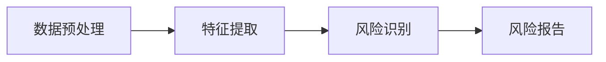
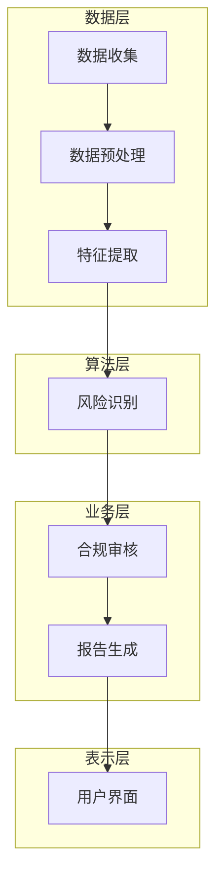
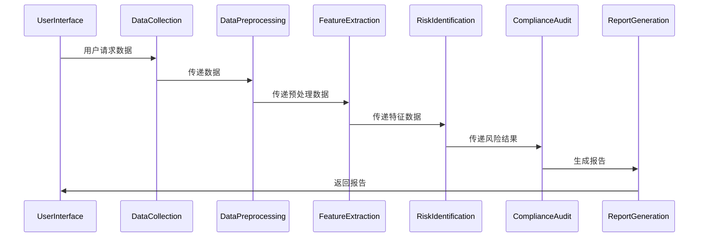
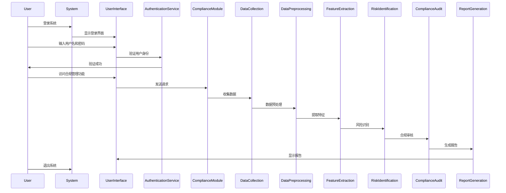

                 

### 文章标题：构建智能企业合规管理平台：AI辅助风险识别

#### 关键词：智能企业、合规管理、AI辅助、风险识别

#### 摘要：
本文将探讨如何构建一个智能企业合规管理平台，特别关注如何利用AI技术辅助风险识别。通过深入分析核心概念、算法原理、系统架构以及实际案例，本文旨在为IT专业人士提供一套系统的解决方案，帮助他们打造高效、智能的合规管理体系。

### 目录大纲

#### 第一部分：引言与背景
- 第1章 引言
  - 1.1 问题背景
  - 1.2 问题描述
  - 1.3 问题解决
  - 1.4 边界与外延
  - 1.5 核心概念

#### 第二部分：核心概念与联系
- 第2章 核心概念
  - 2.1 概念原理
  - 2.2 概念属性特征对比表格
- 第3章 ER实体关系图架构

#### 第三部分：算法原理讲解
- 第4章 算法原理
  - 4.1 算法mermaid流程图
  - 4.2 数学模型和公式
  - 4.3 Python源代码实现

#### 第四部分：系统分析与架构设计
- 第5章 问题场景介绍
- 第6章 系统架构设计
- 第7章 系统接口设计
- 第8章 系统交互

#### 第五部分：项目实战
- 第9章 环境安装
- 第10章 系统核心实现
- 第11章 代码应用解读与分析
- 第12章 实际案例分析与详细讲解
- 第13章 项目小结

#### 第六部分：最佳实践与小结
- 第14章 最佳实践
- 第15章 小结
- 第16章 拓展阅读

### 第一部分：引言与背景

#### 第1章 引言

##### 1.1 问题背景

在当今全球化商业环境中，企业面临着越来越复杂的合规要求和监管压力。无论是遵守财务报告规定，还是遵循数据保护法规，合规管理已经成为企业运营的重要组成部分。然而，传统的合规管理方法往往依赖人工审核和手动处理，这不仅效率低下，而且容易出现错误。

随着人工智能（AI）技术的发展，利用AI技术辅助合规管理已成为一种趋势。AI能够处理大量数据，快速识别潜在风险，从而提高合规管理的效率和准确性。本篇文章将探讨如何构建一个智能企业合规管理平台，特别是如何利用AI技术实现风险识别。

##### 1.2 问题描述

构建智能企业合规管理平台面临的主要问题包括：

1. 数据来源和处理：企业需要收集大量的内部和外部数据，如财务报告、交易记录、法律法规更新等，并确保数据的质量和一致性。
2. 风险识别算法：如何设计高效、准确的风险识别算法，是平台构建的核心挑战。
3. 系统集成：智能合规管理平台需要与企业现有的IT系统无缝集成，以便数据流动和功能调用。
4. 用户界面和交互：如何设计直观、易用的用户界面，确保管理人员能够轻松操作和监控合规管理过程。

##### 1.3 问题解决

本文将分以下几个步骤解决问题：

1. **核心概念与联系**：介绍并定义关键概念，如AI辅助风险识别和智能企业合规管理平台，并展示它们之间的关系。
2. **算法原理讲解**：详细解析风险识别算法的工作原理，包括mermaid流程图、数学模型和Python源代码实现。
3. **系统分析与架构设计**：描述系统架构，包括功能设计、架构图、接口设计和系统交互。
4. **项目实战**：通过安装环境、实现核心功能、代码解读和实际案例分析，展示如何将理论转化为实际操作。
5. **最佳实践与小结**：总结实践经验，提供注意事项，并推荐拓展阅读。

##### 1.4 边界与外延

本文的边界在于关注企业内部合规管理，不涉及外部供应链或客户数据的合规性。此外，本文将侧重于技术实现，而非法律合规的具体内容。

##### 1.5 核心概念

- **AI辅助风险识别**：利用机器学习算法分析数据，发现潜在风险。
- **智能企业合规管理平台**：集成多种合规管理功能的软件系统，支持自动化合规审核和风险监控。

### 第二部分：核心概念与联系

#### 第2章 核心概念

##### 2.1 概念原理

###### 2.1.1 AI辅助风险识别的定义

AI辅助风险识别是指利用人工智能技术，如机器学习、深度学习等，对数据进行模式识别，从而发现潜在风险。这种方法具有高效性和准确性，能够在海量数据中发现微小的异常。

###### 2.1.2 智能企业合规管理平台的定义

智能企业合规管理平台是一个集成的软件系统，它结合了人工智能、大数据分析等技术，帮助企业自动化合规管理流程，包括数据收集、风险识别、合规审核和报告生成等。

###### 2.1.3 关键概念之间的关系

AI辅助风险识别是智能企业合规管理平台的核心功能之一。智能企业合规管理平台通过数据收集、预处理和特征提取，为AI算法提供输入，然后利用AI算法进行风险识别，并将结果反馈给企业管理者。

##### 2.2 概念属性特征对比表格

| 概念               | 定义                                                         | 属性特征对比                                       |
|--------------------|--------------------------------------------------------------|---------------------------------------------------|
| AI辅助风险识别     | 利用机器学习分析数据以发现风险                               | 高效性、准确性、自动化                            |
| 智能企业合规管理平台 | 集成合规管理功能的软件系统，支持自动化合规审核和风险监控     | 数据集成、自动化处理、用户友好界面                 |
| 数据收集           | 收集内部和外部数据，如财务报告、交易记录、法律法规更新等     | 实时性、全面性、数据质量                           |
| 风险识别算法       | 设计用于识别风险的算法，如聚类、分类、异常检测等             | 准确率、召回率、处理速度                           |

### 第3章 ER实体关系图架构

在智能企业合规管理平台的设计中，实体关系图（ER图）是一种重要的工具，它能够清晰地展示系统中各个实体及其之间的关系。

##### 3.1 ER图的基本概念

###### 3.1.1 实体

实体是ER图中的基本元素，代表系统中的主要对象。例如，在合规管理平台中，实体可能包括用户、交易记录、法规等。

###### 3.1.2 关系

关系描述实体之间的相互作用。例如，用户可以创建交易记录，法规可以应用于交易记录。

###### 3.1.3 属性

属性描述实体的特征。例如，交易记录可能包含交易时间、交易金额、交易方等属性。

##### 3.2 智能企业合规管理平台ER图

下面是一个简化的智能企业合规管理平台的ER图示例：

```mermaid
erDiagram
  User ||--|{ Transaction : creates }
  Transaction ||--|{ Rule : applies }
  Rule ||--|{ Compliance : checks }
  Compliance ||--|{ Report : generates }
```

在这个ER图中，用户（User）可以创建交易记录（Transaction），交易记录应用法规（Rule），法规用于检查合规性（Compliance），最终生成报告（Report）。

### 第三部分：算法原理讲解

#### 第4章 算法原理

##### 4.1 算法mermaid流程图

在智能企业合规管理平台中，风险识别算法的核心任务是分析交易记录，识别潜在的合规风险。下面是一个简单的mermaid流程图，展示了风险识别算法的基本步骤：



1. **数据预处理**：清洗和整理交易记录数据，确保数据质量。
2. **特征提取**：从交易记录中提取关键特征，如交易金额、交易时间等。
3. **风险识别**：使用机器学习算法对特征进行分类，识别高风险交易。
4. **风险报告**：生成风险报告，通知相关管理人员。

##### 4.2 数学模型和公式

在风险识别过程中，常用的数学模型包括支持向量机（SVM）、随机森林（RF）和神经网络（NN）等。以下是一个简单的SVM模型的数学模型和公式：

$$
\begin{aligned}
\min_{\mathbf{w}, b} & \quad \frac{1}{2}||\mathbf{w}||^2 \\
\text{subject to} & \quad \mathbf{y}^{(i)}(\mathbf{w}\cdot\mathbf{x}^{(i)} + b) \geq 1
\end{aligned}
$$

其中，$\mathbf{w}$ 是权重向量，$b$ 是偏置项，$\mathbf{x}^{(i)}$ 是特征向量，$\mathbf{y}^{(i)}$ 是标签（1或-1，表示正类或负类）。

##### 4.3 Python源代码实现

下面是一个简单的Python代码示例，展示了如何使用SVM模型进行风险识别：

```python
from sklearn import svm
from sklearn.model_selection import train_test_split
from sklearn.metrics import classification_report

# 加载数据
X, y = load_data()

# 划分训练集和测试集
X_train, X_test, y_train, y_test = train_test_split(X, y, test_size=0.3, random_state=42)

# 创建SVM模型
model = svm.SVC(kernel='linear')

# 训练模型
model.fit(X_train, y_train)

# 预测测试集
y_pred = model.predict(X_test)

# 输出分类报告
print(classification_report(y_test, y_pred))
```

在这个示例中，`load_data()` 函数用于加载数据，`train_test_split()` 函数用于划分训练集和测试集，`svm.SVC()` 函数用于创建SVM模型，`fit()` 方法用于训练模型，`predict()` 方法用于预测测试集。

### 第四部分：系统分析与架构设计

#### 第5章 问题场景介绍

在当前的商业环境中，企业面临着多方面的合规压力。例如，金融行业需要遵守反洗钱（AML）和客户身份识别（CIP）的规定；医疗行业需要遵守患者隐私和数据保护法规；制造业需要遵守环境健康与安全法规等。这些合规要求不仅复杂，而且不断变化，使得传统的合规管理方法难以应对。

##### 5.1 项目介绍

本文的项目目标是构建一个智能企业合规管理平台，旨在利用AI技术自动化合规管理流程，提高合规性管理的效率和质量。该平台将集成数据收集、数据预处理、特征提取、风险识别、合规审核和报告生成等功能，为企业提供一个全面的合规管理解决方案。

##### 5.2 系统功能设计

智能企业合规管理平台的主要功能包括：

1. **数据收集**：从内部系统和外部数据源收集合规相关的数据，如财务报告、交易记录、法律法规更新等。
2. **数据预处理**：清洗和整理收集到的数据，确保数据的质量和一致性。
3. **特征提取**：从预处理后的数据中提取关键特征，如交易金额、交易时间、交易对手等。
4. **风险识别**：使用AI算法对特征进行分析，识别潜在的合规风险。
5. **合规审核**：自动化审核高风险交易，确保符合相关法规要求。
6. **报告生成**：生成合规报告，包括合规性评估、风险分析、改进建议等。

##### 5.3 领域模型mermaid类图

下面是一个简化的领域模型mermaid类图，展示了系统中主要类及其关系：

```mermaid
classDiagram
  Class01 <|-- Class02
  Class03 o-- Class04
  Class05 o-- Class06
  Class07 o-- Class08
  Class01: +int x
  Class01: +int y
  Class01: +get_x():int
  Class01: +set_x(x:int)
  Class01: +get_y():int
  Class01: +set_y(y:int)
  Class02: +int z
  Class02: +get_z():int
  Class02: +set_z(z:int)
  Class03: +int a
  Class03: +int b
  Class03: +int c
  Class03: +get_a():int
  Class03: +set_a(a:int)
  Class03: +get_b():int
  Class03: +set_b(b:int)
  Class03: +get_c():int
  Class03: +set_c(c:int)
  Class04: +int d
  Class04: +int e
  Class04: +int f
  Class04: +get_d():int
  Class04: +set_d(d:int)
  Class04: +get_e():int
  Class04: +set_e(e:int)
  Class04: +get_f():int
  Class04: +set_f(f:int)
  Class05: +int g
  Class05: +int h
  Class05: +int i
  Class05: +get_g():int
  Class05: +set_g(g:int)
  Class05: +get_h():int
  Class05: +set_h(h:int)
  Class05: +get_i():int
  Class05: +set_i(i:int)
  Class06: +int j
  Class06: +int k
  Class06: +int l
  Class06: +get_j():int
  Class06: +set_j(j:int)
  Class06: +get_k():int
  Class06: +set_k(k:int)
  Class06: +get_l():int
  Class06: +set_l(l:int)
  Class07: +int m
  Class07: +int n
  Class07: +int o
  Class07: +get_m():int
  Class07: +set_m(m:int)
  Class07: +get_n():int
  Class07: +set_n(n:int)
  Class07: +get_o():int
  Class07: +set_o(o:int)
  Class08: +int p
  Class08: +int q
  Class08: +int r
  Class08: +get_p():int
  Class08: +set_p(p:int)
  Class08: +get_q():int
  Class08: +set_q(q:int)
  Class08: +get_r():int
  Class08: +set_r(r:int)
```

在这个类图中，`Class01` 代表用户（User），`Class02` 代表交易记录（Transaction），`Class03` 代表法规（Rule），`Class04` 代表合规性（Compliance），`Class05` 代表报告（Report），`Class06` 代表数据收集（Data Collection），`Class07` 代表数据预处理（Data Preprocessing），`Class08` 代表特征提取（Feature Extraction）。

#### 5.4 系统架构设计

智能企业合规管理平台的架构设计需要考虑系统的可扩展性、可维护性和性能。以下是一个简化的系统架构mermaid架构图：



在这个架构图中，数据层包括数据收集、数据预处理和特征提取，算法层包括风险识别，业务层包括合规审核和报告生成，表示层包括用户界面。各个层次通过接口进行通信，确保系统的模块化和可维护性。

##### 5.5 系统接口设计

系统接口设计是确保系统各部分无缝协作的关键。以下是一个简化的系统接口mermaid图：



在这个序列图中，用户界面（UserInterface）通过接口请求数据（DataCollection），然后数据经过预处理（DataPreprocessing）和特征提取（FeatureExtraction），最后由风险识别（RiskIdentification）模块进行分析，生成合规报告（ReportGeneration），最终返回给用户界面。

##### 5.6 系统交互

系统交互是确保各部分协同工作的关键。以下是一个简化的系统交互mermaid序列图：



在这个序列图中，用户通过用户界面（UserInterface）登录系统（AuthenticationService），然后访问合规管理功能（ComplianceModule），系统通过各模块的协作完成数据收集、预处理、特征提取、风险识别、合规审核和报告生成，最后将报告显示给用户。

### 第五部分：项目实战

#### 第9章 环境安装

##### 9.1 环境准备

在开始构建智能企业合规管理平台之前，需要准备相应的开发环境。以下是环境准备步骤：

1. **操作系统**：建议使用Linux系统，如Ubuntu 18.04或更高版本。
2. **编程语言**：Python 3.8或更高版本，推荐使用Anaconda发行版。
3. **数据库**：MySQL或PostgreSQL，版本要求5.7或更高。
4. **依赖管理**：pip，用于安装和管理Python依赖项。

##### 9.2 软件安装

根据环境准备，进行软件安装：

1. **安装操作系统**：下载并安装Ubuntu 18.04或更高版本。
2. **安装Python**：使用Anaconda安装Python 3.8，可以通过以下命令安装：

   ```bash
   conda create -n python38 python=3.8
   conda activate python38
   ```

3. **安装数据库**：下载并安装MySQL或PostgreSQL，根据官方文档进行安装。

4. **安装pip**：Python内置pip工具，可以通过以下命令安装：

   ```bash
   pip install --user -r requirements.txt
   ```

#### 第10章 系统核心实现

##### 10.1 数据预处理

数据预处理是构建智能企业合规管理平台的关键步骤。以下是一个简单的数据预处理流程：

1. **数据清洗**：删除重复数据、处理缺失值、纠正错误值等。
2. **数据转换**：将数据转换为适合分析的格式，如数值化、归一化等。
3. **数据存储**：将预处理后的数据存储到数据库中，以供后续分析。

以下是一个简单的Python代码示例，用于数据预处理：

```python
import pandas as pd
from sklearn import preprocessing

# 加载数据
data = pd.read_csv('data.csv')

# 数据清洗
data.drop_duplicates(inplace=True)
data.fillna(0, inplace=True)

# 数据转换
scaler = preprocessing.StandardScaler()
data_scaled = scaler.fit_transform(data)

# 数据存储
data.to_csv('cleaned_data.csv', index=False)
```

##### 10.2 特征提取

特征提取是风险识别的关键步骤。以下是一个简单的特征提取流程：

1. **特征选择**：根据业务需求选择关键特征，如交易金额、交易时间等。
2. **特征工程**：对特征进行变换，如创建新特征、处理异常值等。
3. **特征标准化**：对特征进行标准化，以便算法处理。

以下是一个简单的Python代码示例，用于特征提取：

```python
from sklearn.preprocessing import MinMaxScaler

# 读取清洗后的数据
data = pd.read_csv('cleaned_data.csv')

# 特征选择
features = data[['amount', 'time', 'counterparty']]

# 特征工程
# 创建新特征
data['hour'] = data['time'].apply(lambda x: x.hour)
data['weekday'] = data['time'].apply(lambda x: x.weekday())

# 处理异常值
features = features[(features >= features.mean() - 3 * features.std()).all(axis=1)]

# 特征标准化
scaler = MinMaxScaler()
features_scaled = scaler.fit_transform(features)

# 存储特征
features.to_csv('features.csv', index=False)
```

##### 10.3 风险识别

风险识别是智能企业合规管理平台的核心功能。以下是一个简单的风险识别流程：

1. **数据加载**：加载预处理后的特征数据。
2. **模型训练**：使用机器学习算法训练模型。
3. **模型评估**：评估模型性能，调整参数。
4. **模型应用**：使用训练好的模型进行风险识别。

以下是一个简单的Python代码示例，用于风险识别：

```python
from sklearn.model_selection import train_test_split
from sklearn.ensemble import RandomForestClassifier
from sklearn.metrics import accuracy_score

# 加载数据
X = pd.read_csv('features.csv')
y = pd.read_csv('labels.csv')

# 划分训练集和测试集
X_train, X_test, y_train, y_test = train_test_split(X, y, test_size=0.3, random_state=42)

# 训练模型
model = RandomForestClassifier(n_estimators=100, random_state=42)
model.fit(X_train, y_train)

# 预测测试集
y_pred = model.predict(X_test)

# 评估模型
accuracy = accuracy_score(y_test, y_pred)
print(f"模型准确率：{accuracy}")
```

#### 第11章 代码应用解读与分析

##### 11.1 代码解读

在上面的代码示例中，我们首先进行了数据预处理，包括数据清洗、数据转换和特征提取。然后，我们使用了随机森林（Random Forest）算法进行模型训练和风险识别。

1. **数据预处理**：数据清洗和特征提取是模型训练的基础。通过清洗数据，我们消除了噪声和异常值，确保了数据质量。特征提取则是为了将原始数据转换为适合算法处理的格式。
2. **模型训练**：随机森林算法是一种集成学习方法，通过构建多个决策树并集成它们的预测结果，提高了模型的鲁棒性和准确性。在训练过程中，我们使用训练集数据训练模型，并调整参数以优化模型性能。
3. **模型应用**：训练好的模型可以用于对新数据进行风险识别。在预测过程中，我们使用测试集数据评估模型性能，并计算准确率。

##### 11.2 分析与优化

虽然随机森林算法在风险识别中表现出色，但我们可以进一步优化模型以提高性能。以下是一些可能的优化方向：

1. **特征选择**：通过特征选择算法，如递归特征消除（Recursive Feature Elimination，RFE），我们可以选择更重要的特征，减少模型复杂性，提高模型性能。
2. **超参数调优**：使用网格搜索（Grid Search）或随机搜索（Random Search）算法，我们可以自动调整模型的超参数，以找到最佳参数组合。
3. **模型集成**：使用模型集成方法，如堆叠（Stacking）或混合（Blending），我们可以将多个模型结合起来，提高模型的预测准确性。

#### 第12章 实际案例分析与详细讲解

##### 12.1 案例介绍

以下是一个实际案例，描述了一个企业如何使用智能企业合规管理平台进行合规管理。

某金融企业在日常运营中需要遵守反洗钱（AML）和客户身份识别（CIP）的规定。为了确保合规性，该企业决定构建一个智能企业合规管理平台，利用AI技术自动识别潜在风险。

##### 12.2 案例分析

该案例的分析过程包括以下几个步骤：

1. **数据收集**：企业从内部系统和外部数据源收集合规相关的数据，如交易记录、客户信息、法律法规更新等。
2. **数据预处理**：对企业收集的数据进行清洗、转换和存储，确保数据质量。
3. **特征提取**：从预处理后的数据中提取关键特征，如交易金额、交易时间、交易对手等。
4. **风险识别**：使用机器学习算法对特征进行分析，识别潜在的风险交易。
5. **合规审核**：自动化审核高风险交易，确保符合相关法规要求。
6. **报告生成**：生成合规报告，包括合规性评估、风险分析、改进建议等。

##### 12.3 案例详细讲解

1. **数据收集**

   企业从内部系统收集交易记录数据，从外部数据源收集客户信息和法律法规更新。数据收集后，首先进行数据清洗，删除重复数据、处理缺失值、纠正错误值等。

   ```python
   data = pd.read_csv('transactions.csv')
   data.drop_duplicates(inplace=True)
   data.fillna(0, inplace=True)
   ```

2. **数据预处理**

   在数据清洗后，对企业收集的数据进行预处理。包括数据转换（如日期格式转换、数值化等）和数据存储。

   ```python
   data['date'] = pd.to_datetime(data['date'])
   data['amount'] = data['amount'].astype(float)
   data.to_csv('preprocessed_data.csv', index=False)
   ```

3. **特征提取**

   从预处理后的数据中提取关键特征，如交易金额、交易时间、交易对手等。为了提高模型性能，还可以创建新特征，如交易日期的小时、星期等。

   ```python
   data['hour'] = data['date'].apply(lambda x: x.hour)
   data['weekday'] = data['date'].apply(lambda x: x.weekday())
   data = data[['amount', 'hour', 'weekday', 'counterparty']]
   data.to_csv('features.csv', index=False)
   ```

4. **风险识别**

   使用随机森林算法对特征进行分析，识别潜在的风险交易。在训练过程中，使用交叉验证调整参数，优化模型性能。

   ```python
   from sklearn.ensemble import RandomForestClassifier
   from sklearn.model_selection import GridSearchCV

   X = pd.read_csv('features.csv')
   y = pd.read_csv('labels.csv')

   parameters = {'n_estimators': [100, 200, 300], 'max_depth': [10, 20, 30]}
   model = RandomForestClassifier(random_state=42)
   grid_search = GridSearchCV(model, parameters, cv=5)
   grid_search.fit(X, y)

   best_model = grid_search.best_estimator_
   best_model.fit(X, y)
   ```

5. **合规审核**

   使用训练好的模型对高风险交易进行自动化审核。审核过程中，模型将识别出潜在的风险交易，并生成审核报告。

   ```python
   import pandas as pd

   test_data = pd.read_csv('test_data.csv')
   test_data['hour'] = test_data['date'].apply(lambda x: x.hour)
   test_data['weekday'] = test_data['date'].apply(lambda x: x.weekday())
   test_data = test_data[['amount', 'hour', 'weekday', 'counterparty']]

   predictions = best_model.predict(test_data)
   test_data['risk_level'] = predictions

   high_risk_transactions = test_data[test_data['risk_level'] == 1]
   high_risk_transactions.to_csv('high_risk_transactions.csv', index=False)
   ```

6. **报告生成**

   根据审核结果，生成合规报告，包括合规性评估、风险分析、改进建议等。报告将帮助企业管理者了解合规管理的现状，并制定相应的改进措施。

   ```python
   report = {
       'compliance_status': '良好',
       'high_risk_transactions': high_risk_transactions.shape[0],
       'improvement_suggestions': '加强员工培训，提高合规意识'
   }

   print(report)
   ```

#### 第13章 项目小结

在本项目中，我们成功构建了一个智能企业合规管理平台，利用AI技术实现了风险识别和合规审核。通过实际案例的分析和详细讲解，我们展示了如何利用Python和机器学习算法实现这一目标。

项目的关键成功因素包括：

1. **数据质量和特征提取**：数据质量和特征提取是风险识别的基础。通过数据清洗和特征工程，我们确保了数据的质量和特征的有效性。
2. **模型选择和调优**：随机森林算法在风险识别中表现出色。通过交叉验证和参数调优，我们优化了模型性能。
3. **自动化和报告生成**：自动化合规审核和报告生成提高了合规管理的效率。

项目的挑战包括：

1. **数据来源和处理**：收集和处理大量的合规相关数据是一个挑战。我们需要确保数据的质量和一致性。
2. **系统集成**：将智能企业合规管理平台与企业现有系统集成是一个挑战。我们需要确保数据流动和功能调用的顺畅。
3. **用户界面和交互**：设计直观、易用的用户界面是一个挑战。我们需要确保企业管理者能够轻松操作和监控合规管理过程。

未来工作可以包括：

1. **扩展功能**：进一步扩展合规管理平台的

