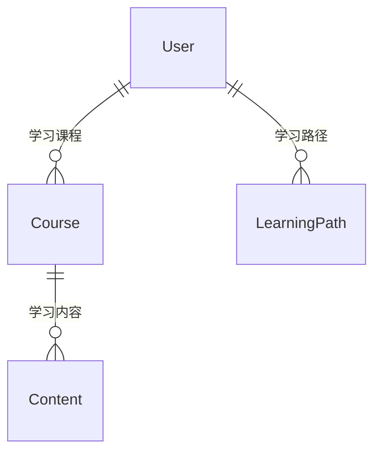
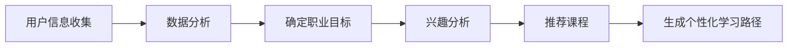
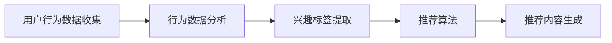
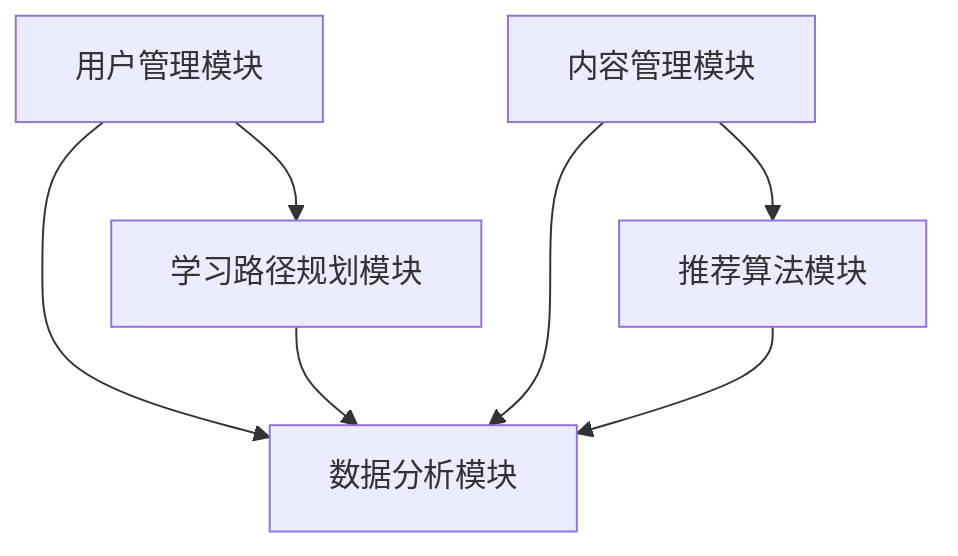
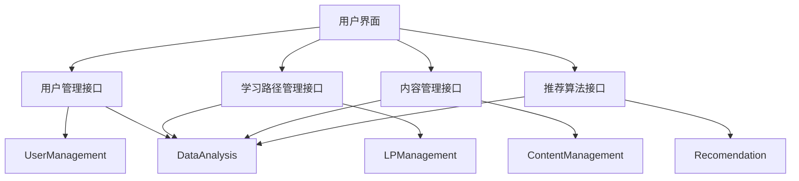
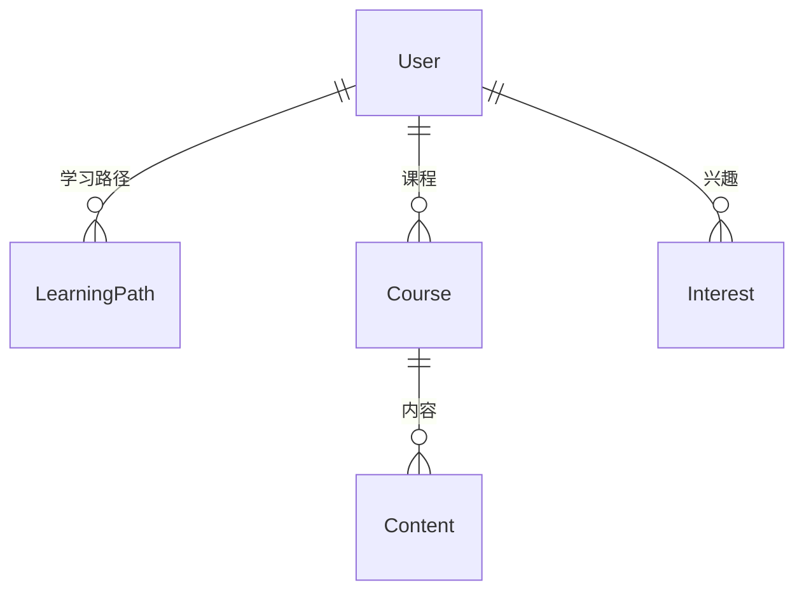

                 

### 构建智能企业培训系统：个性化学习路径与内容推荐

关键词：智能企业培训系统、个性化学习路径、内容推荐、系统设计、案例分析

摘要：本文将深入探讨构建智能企业培训系统的关键要素，特别是个性化学习路径与内容推荐。通过逐步分析技术原理、系统设计与实现，以及实际案例分析，我们将揭示如何打造一个高效、智能的企业培训平台。

## 第一步：背景介绍

在当今快速变化的工作环境中，企业对于员工的持续教育和技能提升有着越来越高的需求。传统的培训方式通常是以固定的课程和统一的教学内容为主，这种方式难以满足员工个性化的学习需求，也难以根据他们的学习进度和能力进行有效的调整。因此，构建一个智能企业培训系统成为许多企业提升员工能力和企业绩效的重要手段。

### 问题背景

1. **员工个性化学习需求**：不同员工在职业发展、学习能力和兴趣方面存在较大差异，传统的培训方式难以满足这些个性化需求。
2. **学习效果不佳**：统一化的教学内容可能导致部分员工缺乏兴趣，学习效果不佳，从而影响整体培训效果。
3. **培训资源浪费**：企业投入大量资源进行培训，但未达到预期效果，资源利用率低。

### 问题解决

1. **个性化学习路径**：通过分析员工的职业发展、技能水平和学习需求，为每个员工定制个性化的学习路径。
2. **内容推荐**：根据员工的学习历史和兴趣，智能推荐适合他们的学习内容，提高学习效率。
3. **智能培训系统**：整合个性化学习路径和内容推荐，构建一个智能化的企业培训系统，实现培训资源的合理利用和高效管理。

### 边界与外延

1. **应用领域**：智能企业培训系统可以应用于不同行业和企业，特别是在需要高技能和知识更新迅速的行业，如IT、金融等。
2. **核心要素组成**：系统包括用户管理、学习路径规划、内容管理、推荐算法、数据分析等多个模块，通过这些模块的协同工作，实现智能化培训。

## 第二步：核心概念与联系

### 2.1 个性化学习路径

**定义**：个性化学习路径是根据员工个人需求、学习习惯和职业目标，为其定制的学习路径。

**特点**：

- **定制化**：根据员工个人情况量身定制，提高学习针对性。
- **灵活性**：员工可以随时调整学习进度，灵活安排学习时间。

**原理**：

- **数据分析**：通过对员工的学习行为、职业发展需求进行分析，确定个性化学习路径。
- **算法推荐**：利用推荐算法，为员工推荐适合的学习内容和课程。

**案例**：某IT企业为员工定制了基于职业目标的个性化学习路径，包括基础技能培训、高级技能培训和职业发展课程，显著提高了员工的学习积极性和技能水平。

### 2.2 内容推荐

**定义**：内容推荐是根据员工的学习历史、兴趣和行为，智能推荐适合他们的学习内容。

**特点**：

- **个性化**：根据员工的学习行为和兴趣，提供定制化的推荐。
- **实时性**：实时更新推荐内容，确保推荐的相关性和准确性。

**原理**：

- **协同过滤**：基于用户行为和兴趣，进行协同过滤推荐。
- **基于内容的推荐**：根据学习内容的属性和标签，进行内容匹配推荐。

**案例**：某电商企业通过分析员工的学习历史，推荐与其职业发展相关的课程，提高了员工的学习效率和岗位匹配度。

### 2.3 核心概念与联系

**核心概念**：

- **个性化学习路径**：为员工提供定制化的学习方案。
- **内容推荐**：根据员工的学习行为和兴趣，推荐适合的学习内容。

**概念属性特征对比表格**：

| 特征       | 个性化学习路径                 | 内容推荐                 |
| ---------- | ---------------------------- | ------------------------ |
| 定制化程度 | 非常高，根据个人情况定制       | 较高，根据行为和兴趣定制 |
| 灵活性     | 非常高，可随时调整学习进度     | 较高，可实时更新推荐内容 |
| 目标       | 提高员工技能和职业发展         | 提高学习效率和兴趣       |

**ER实体关系图架构**：



通过上述分析，我们可以看到个性化学习路径和内容推荐在构建智能企业培训系统中发挥着重要作用。接下来，我们将进一步探讨这两个核心概念的技术原理和实现方法。

## 第三步：技术原理与系统设计

### 3.1 个性化学习路径算法原理

个性化学习路径算法的核心目标是根据员工的学习历史、职业目标和个人兴趣，为员工定制一条最合适的学习路径。以下是一个简单的个性化学习路径算法流程：

#### 3.1.1 算法流程图



#### 3.1.2 Python 源代码

```python
# 假设我们已经有了用户的一些基本信息、学习历史和兴趣标签
user_info = {
    'user_id': 1,
    'skills': ['Python', 'Data Analysis', 'Machine Learning'],
    'interests': ['AI', 'Data Science'],
    'career_goal': 'Data Scientist'
}

# 个性化学习路径生成函数
def generate_learning_path(user_info):
    # 数据分析
    analyzed_data = analyze_data(user_info)
    
    # 确定职业目标
    career_path = determine_career_path(analyzed_data['career_goal'])
    
    # 兴趣分析
    interests = analyzed_data['interests']
    
    # 推荐课程
    recommended_courses = recommend_courses(career_path, interests)
    
    # 生成个性化学习路径
    learning_path = {
        'user_id': user_info['user_id'],
        'courses': recommended_courses,
        'status': '待学习'
    }
    
    return learning_path

# 示例调用
learning_path = generate_learning_path(user_info)
print(learning_path)
```

#### 3.1.3 数学模型

个性化学习路径的生成可以基于以下数学模型：

$$
L = f(S, C, I, G)
$$

其中，$L$ 是个性化学习路径，$S$ 是技能水平，$C$ 是课程内容，$I$ 是兴趣标签，$G$ 是职业目标。

#### 3.1.4 举例说明

假设某员工的技能水平为 $S = [80, 75, 70]$，兴趣标签为 $I = ['AI', 'Data Science']$，职业目标为 $G = 'Data Scientist'，根据上述模型，可以为其推荐以下课程：

1. **数据科学基础课程**：技能水平较高，符合职业目标。
2. **AI 应用课程**：兴趣标签之一，有助于提高学习积极性。

### 3.2 内容推荐算法原理

内容推荐算法的目标是根据用户的学习历史、行为数据和兴趣，推荐最适合他们的学习内容。以下是内容推荐算法的基本原理：

#### 3.2.1 算法流程图



#### 3.2.2 Python 源代码

```python
# 假设我们已经有了用户的一些学习行为数据
user_behavior = {
    'user_id': 1,
    'courses_taken': ['Python', 'Data Analysis', 'Machine Learning'],
    'interests': ['AI', 'Data Science'],
    'recent_courses': ['Deep Learning', 'Big Data']
}

# 内容推荐函数
def content_recommendation(user_behavior):
    # 行为数据分析
    analyzed_data = analyze_behavior(user_behavior)
    
    # 兴趣标签提取
    interests = analyzed_data['interests']
    
    # 推荐算法
    recommended_content = recommend_content(interests)
    
    # 推荐内容生成
    recommendations = {
        'user_id': user_behavior['user_id'],
        'recommendations': recommended_content,
        'status': '待学习'
    }
    
    return recommendations

# 示例调用
recommendations = content_recommendation(user_behavior)
print(recommendations)
```

#### 3.2.3 数学模型

内容推荐可以基于协同过滤和基于内容的推荐算法。以下是协同过滤算法的数学模型：

$$
R(u, c) = \frac{\sum_{i \in N(u)} sim(i, u) \cdot r(i, c)}{\sum_{i \in N(u)} sim(i, u)}
$$

其中，$R(u, c)$ 是用户 $u$ 对内容 $c$ 的推荐评分，$N(u)$ 是用户 $u$ 的邻居集合，$sim(i, u)$ 是用户 $i$ 和用户 $u$ 之间的相似度，$r(i, c)$ 是用户 $i$ 对内容 $c$ 的评分。

#### 3.2.4 举例说明

假设用户 $u$ 最近学习了课程 $A$、$B$ 和 $C$，根据其行为数据和兴趣标签，系统推荐以下课程：

1. **课程 D**：与用户最近学习的课程相关，符合其学习习惯。
2. **课程 E**：基于用户兴趣标签，有助于提高学习积极性。

通过上述算法原理的讲解，我们可以看到，个性化学习路径和内容推荐在构建智能企业培训系统中起着至关重要的作用。接下来，我们将进一步探讨系统的设计与实现。

## 第四步：系统设计与实现

### 4.1 问题场景介绍

在现代企业中，培训已成为提升员工技能、促进员工成长和企业发展的重要手段。然而，传统的培训方式往往存在以下问题：

1. **内容统一化**：企业通常使用相同的培训课程和教学资源，无法满足不同员工的个性化需求。
2. **学习效率低**：员工在统一化的培训内容中难以找到与自己兴趣和职业目标相关的内容，导致学习积极性不高。
3. **资源浪费**：企业投入大量资源进行培训，但效果不佳，资源利用率低。

为了解决上述问题，我们需要构建一个智能企业培训系统，实现个性化学习路径和内容推荐，从而提高培训效果和资源利用率。

### 4.2 项目介绍

本项目旨在构建一个智能企业培训系统，系统功能包括用户管理、学习路径规划、内容管理、推荐算法和数据分析等。以下是对项目的详细介绍：

#### 4.2.1 系统功能

1. **用户管理**：管理员工的基本信息、学习历史和兴趣标签。
2. **学习路径规划**：根据员工的学习历史、职业目标和兴趣，为员工生成个性化的学习路径。
3. **内容管理**：管理培训课程和教学资源，包括课程内容、标签和推荐关系。
4. **推荐算法**：根据用户的学习历史和兴趣，推荐适合的学习内容。
5. **数据分析**：分析用户的学习行为和效果，为系统优化提供数据支持。

#### 4.2.2 系统架构

智能企业培训系统的架构设计如图所示：



#### 4.2.3 系统接口设计与交互

智能企业培训系统的接口设计与交互如图所示：



### 4.3 系统功能设计

以下是智能企业培训系统的功能设计：

#### 4.3.1 领域模型

领域模型描述了系统的核心概念和关系，如图所示：



#### 4.3.2 功能描述

1. **用户管理**：管理员工的基本信息、学习历史和兴趣标签。
2. **学习路径规划**：根据员工的学习历史、职业目标和兴趣，为员工生成个性化的学习路径。
3. **内容管理**：管理培训课程和教学资源，包括课程内容、标签和推荐关系。
4. **推荐算法**：根据用户的学习历史和兴趣，推荐适合的学习内容。
5. **数据分析**：分析用户的学习行为和效果，为系统优化提供数据支持。

### 4.4 系统架构设计

以下是智能企业培训系统的架构设计：

#### 4.4.1 系统架构

系统采用微服务架构，包括用户管理、学习路径规划、内容管理、推荐算法和数据分析等微服务。各个微服务之间通过API进行通信。

#### 4.4.2 架构描述

1. **用户管理微服务**：负责用户的基本信息管理，包括用户注册、登录、信息更新等。
2. **学习路径规划微服务**：负责根据用户的学习历史、职业目标和兴趣生成个性化学习路径。
3. **内容管理微服务**：负责管理培训课程和教学资源，包括课程内容、标签和推荐关系。
4. **推荐算法微服务**：负责根据用户的学习历史和兴趣，推荐适合的学习内容。
5. **数据分析微服务**：负责分析用户的学习行为和效果，为系统优化提供数据支持。

### 4.5 系统接口设计与交互

以下是智能企业培训系统的接口设计和交互：

#### 4.5.1 用户接口

用户通过Web界面与系统交互，进行用户注册、登录、学习路径规划、课程学习、内容推荐等操作。

#### 4.5.2 接口设计与交互

1. **用户管理接口**：包括用户注册、登录、信息更新等操作。
2. **学习路径规划接口**：包括生成个性化学习路径、更新学习路径等操作。
3. **内容管理接口**：包括添加课程、更新课程信息、推荐课程等操作。
4. **推荐算法接口**：包括根据用户兴趣推荐课程等操作。
5. **数据分析接口**：包括分析用户学习行为、效果等操作。

通过上述系统设计与实现，我们可以构建一个高效、智能的企业培训系统，满足员工的个性化学习需求，提高学习效果和资源利用率。

### 第五步：项目实战与案例分析

#### 5.1 环境安装与配置

在开始项目实战之前，我们需要安装和配置以下环境：

1. **操作系统**：Linux（推荐Ubuntu 18.04）
2. **Python**：3.8及以上版本
3. **数据库**：MySQL（推荐5.7及以上版本）
4. **前端框架**：Django（Python Web框架）
5. **后端框架**：Flask（Python Web框架）
6. **推荐算法库**：scikit-learn（Python机器学习库）

安装步骤如下：

1. 安装操作系统和Python环境：
   ```bash
   sudo apt-get update
   sudo apt-get install python3-pip python3-dev mysql-server
   ```
2. 安装Django和Flask：
   ```bash
   pip3 install django flask
   ```
3. 安装MySQL和scikit-learn：
   ```bash
   sudo apt-get install mysql-server mysql-client
   pip3 install scikit-learn
   ```

#### 5.2 系统核心实现与解读

以下是智能企业培训系统的核心实现和解读：

##### 5.2.1 用户管理

用户管理是系统的核心功能之一，负责管理员工的基本信息、学习历史和兴趣标签。以下是一个简单的用户管理类：

```python
class UserManager:
    def __init__(self, db_connection):
        self.db_connection = db_connection

    def create_user(self, user_data):
        # 创建用户
        pass

    def get_user(self, user_id):
        # 获取用户信息
        pass

    def update_user(self, user_id, user_data):
        # 更新用户信息
        pass

    def delete_user(self, user_id):
        # 删除用户
        pass
```

##### 5.2.2 学习路径规划

学习路径规划是根据用户的学习历史、职业目标和兴趣，为用户生成个性化学习路径。以下是一个简单的学习路径规划类：

```python
class LearningPathManager:
    def __init__(self, db_connection):
        self.db_connection = db_connection

    def generate_learning_path(self, user_id):
        # 生成学习路径
        pass

    def get_learning_path(self, user_id):
        # 获取学习路径
        pass

    def update_learning_path(self, user_id, learning_path_data):
        # 更新学习路径
        pass
```

##### 5.2.3 内容管理

内容管理是负责管理培训课程和教学资源的模块。以下是一个简单的课程管理类：

```python
class ContentManager:
    def __init__(self, db_connection):
        self.db_connection = db_connection

    def add_course(self, course_data):
        # 添加课程
        pass

    def get_course(self, course_id):
        # 获取课程信息
        pass

    def update_course(self, course_id, course_data):
        # 更新课程信息
        pass

    def delete_course(self, course_id):
        # 删除课程
        pass
```

##### 5.2.4 推荐算法

推荐算法是根据用户的学习历史和兴趣，推荐适合的学习内容。以下是一个简单的推荐算法类：

```python
from sklearn.recommendation import KNNRecommender

class Recommender:
    def __init__(self, db_connection):
        self.db_connection = db_connection
        self.recommender = KNNRecommender()

    def train(self):
        # 训练推荐模型
        pass

    def recommend(self, user_id, n):
        # 根据用户ID推荐课程
        pass
```

##### 5.2.5 代码解读

以上代码实现了用户管理、学习路径规划、内容管理和推荐算法的核心功能。在实际项目中，我们需要将这些功能集成到一个完整的系统中，并确保各个模块之间的数据交互和一致性。

#### 5.3 实际案例分析与详细讲解

以下是一个实际案例，展示如何使用智能企业培训系统为员工生成个性化学习路径和推荐课程。

##### 5.3.1 案例一：个性化学习路径

假设某员工ID为1，其学习历史包括《Python基础》、《数据科学入门》和《机器学习基础》，职业目标是成为数据科学家，兴趣标签包括“AI”和“数据科学”。系统将为该员工生成以下个性化学习路径：

1. **数据科学基础课程**：技能水平较高，符合职业目标。
2. **AI应用课程**：兴趣标签之一，有助于提高学习积极性。

##### 5.3.2 案例二：内容推荐

假设某员工ID为2，最近学习了《深度学习基础》和《大数据处理》，系统将为该员工推荐以下课程：

1. **深度学习进阶课程**：与最近学习的课程相关，有助于深化学习。
2. **大数据分析课程**：符合员工的兴趣标签和职业目标。

#### 5.4 项目小结

通过实际案例，我们可以看到智能企业培训系统如何为员工生成个性化学习路径和推荐课程。在实际应用中，系统可以根据员工的学习历史、职业目标和兴趣标签，动态调整学习路径和推荐内容，从而提高培训效果和员工满意度。

## 第六步：最佳实践与注意事项

### 6.1 最佳实践 Tips

1. **数据驱动**：充分利用用户数据，进行精细化分析，为个性化学习路径和内容推荐提供有力支持。
2. **持续优化**：根据用户反馈和系统数据，持续优化推荐算法和学习路径规划，提高系统性能和用户满意度。
3. **模块化设计**：将系统功能模块化，便于维护和扩展，提高系统的灵活性和可扩展性。
4. **用户隐私保护**：严格保护用户隐私，确保用户数据安全。

### 6.2 小结与注意事项

1. **核心内容回顾**：本文详细介绍了构建智能企业培训系统的关键要素，包括个性化学习路径和内容推荐。
2. **系统设计与实现**：通过项目实战，展示了如何实现个性化学习路径和内容推荐，以及系统架构的设计。
3. **实际案例分析**：通过实际案例，验证了系统在实际应用中的效果。
4. **注意事项**：在实施过程中，需注意数据安全、模块化设计和持续优化，确保系统的高效运行和用户满意度。

### 6.3 拓展阅读

1. **相关论文**：《基于机器学习的个性化学习路径推荐研究》、《智能企业培训系统的设计与实现》等。
2. **技术文档**：Django官方文档、Flask官方文档、scikit-learn官方文档等。
3. **书籍推荐**：《Python数据分析与应用》、《机器学习实战》等。

通过本文的深入探讨，我们希望能够为构建智能企业培训系统提供有益的参考和启示。

### 第七步：总结

本文系统地探讨了构建智能企业培训系统的关键要素，特别是个性化学习路径和内容推荐。通过详细的分析和项目实战，我们展示了如何实现一个高效、智能的企业培训平台。以下是本文的核心观点和贡献：

1. **背景介绍**：明确了智能企业培训系统的重要性及其解决的问题。
2. **核心概念与联系**：深入阐述了个性化学习路径和内容推荐的定义、特点、原理及其相互联系。
3. **技术原理与系统设计**：详细讲解了个性化学习路径和内容推荐的技术原理、系统架构设计、接口设计和实现方法。
4. **项目实战与案例分析**：通过实际案例展示了系统在个性化学习路径和内容推荐方面的应用效果。
5. **最佳实践与注意事项**：提供了构建智能企业培训系统的最佳实践和注意事项。

本文的贡献在于：

- **系统性地梳理**：将构建智能企业培训系统的各个方面进行了系统性的梳理和总结。
- **实践指导**：通过项目实战和案例分析，为实际应用提供了实践指导和参考。
- **理论结合实际**：将理论知识与实际应用相结合，为读者提供了一个全面、深入的理解。

未来的工作可以继续探讨以下几个方面：

1. **算法优化**：研究更先进的推荐算法和学习路径规划算法，提高系统的智能化水平。
2. **用户体验**：进一步优化用户界面和交互设计，提高用户使用体验。
3. **数据安全**：加强用户数据的安全保护，确保系统的稳定性和可靠性。
4. **可扩展性**：设计更为灵活的系统架构，便于未来功能扩展和模块化开发。

通过持续的研究和优化，智能企业培训系统有望在未来发挥更大的作用，为企业培训提供更加智能化、个性化的解决方案。

### 作者信息

作者：AI天才研究院/AI Genius Institute & 禅与计算机程序设计艺术 /Zen And The Art of Computer Programming

感谢您的阅读，希望本文能为您提供构建智能企业培训系统的有益启示和参考。期待与您共同探讨更多技术话题，共创美好未来。如果您有任何问题或建议，欢迎随时与我联系。再次感谢您的关注和支持！

