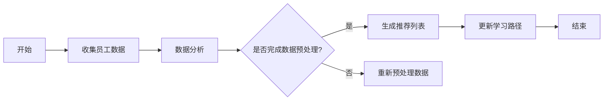
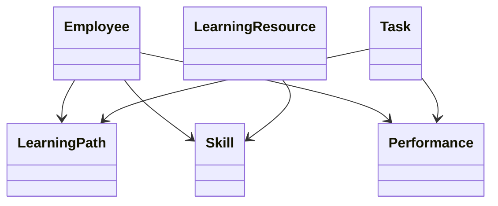
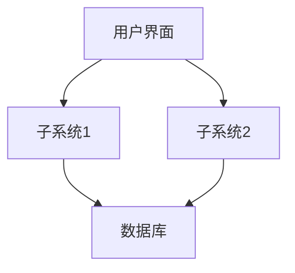
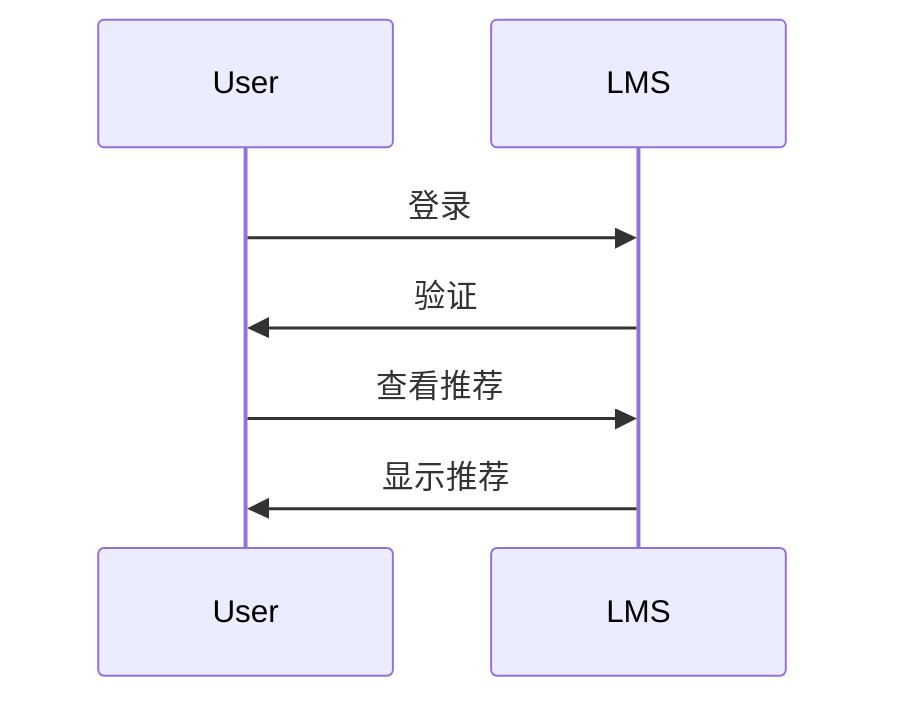

                 


### 确定文章标题和关键词

**文章标题：**
《构建智能企业学习管理系统：个性化技能发展》

**关键词：**
- 智能学习管理系统
- 个性化技能发展
- 企业培训
- 数据分析
- 机器学习算法
- 教育技术

**摘要：**
本文将深入探讨如何构建一个智能企业学习管理系统，专注于个性化技能发展。我们将分析现代企业培训的需求，介绍关键技术和算法，详细讲解系统架构设计和实现过程，并分享实际案例和最佳实践。

### 第1章：背景介绍

**1.1 问题背景**

在当今快速变化的工作环境中，员工需要不断更新和提升自己的技能，以适应新的技术和管理方法。然而，传统的企业学习管理系统往往缺乏个性化，无法满足员工多样化的学习需求。

**1.2 问题描述**

企业面临的挑战是设计一个灵活、智能的学习管理系统，该系统能够：
- 自动分析员工的技能水平
- 提供个性化的学习路径
- 根据员工的学习进度和效果进行动态调整
- 集成数据分析工具，以优化培训效果

**1.3 问题解决**

智能企业学习管理系统的解决方案涉及以下几个关键方面：
- 使用机器学习算法分析员工数据
- 设计个性化的学习路径和推荐系统
- 实施自适应学习策略
- 集成先进的数据分析工具，提供实时反馈

**1.4 边界与外延**

本文将探讨以下边界：
- 系统的适用范围
- 技术实现的可行性
- 数据隐私和安全

**1.5 概念结构与核心要素组成**

核心概念包括：
- 智能学习管理系统的架构
- 个性化技能发展的定义
- 数据分析的关键技术
- 机器学习算法的应用

### 第2章：核心概念与联系

**2.1 智能企业学习管理系统概述**

智能企业学习管理系统（LMS）结合了现代技术，如人工智能、机器学习和数据分析，以提供个性化的学习体验。

**2.2 个性化技能发展**

个性化技能发展是指根据员工的学习历史、兴趣和职业目标，定制化培训内容和路径。

**2.3 核心概念属性特征对比表格**

创建一个表格，对比智能学习管理系统和传统学习管理系统的属性和特征。

**2.4 智能企业学习管理系统的ER实体关系图架构**

使用Mermaid绘制ER实体关系图，展示系统中的关键实体及其关系。

```mermaid
erDiagram
    EMPLOYEE ||--|{ SKILL }
    EMPLOYEE ||--|{ LEARNING_PATH }
    EMPLOYEE ||--|{ PERFORMANCE }
    SKILL ||--|{ LEARNING_RESOURCE }
    LEARNING_PATH ||--|{ TASK }
    TASK ||--|{ PERFORMANCE }
```

### 第3章：算法原理讲解

**3.1 个性化学习算法概述**

个性化学习算法是智能学习管理系统的核心，负责分析员工数据，提供个性化推荐。

**3.2 Mermaid流程图展示**

使用Mermaid绘制个性化学习算法的流程图。



**3.3 Python源代码讲解**

提供Python源代码示例，展示如何实现个性化学习算法。

```python
# Python示例代码
def preprocess_data(data):
    # 数据预处理代码
    pass

def analyze_data(preprocessed_data):
    # 数据分析代码
    pass

def generate_recommendations(analysis_result):
    # 生成推荐列表代码
    pass

def update_learning_path(recommendations):
    # 更新学习路径代码
    pass

# 主函数
def main():
    data = collect_employee_data()
    preprocessed_data = preprocess_data(data)
    analysis_result = analyze_data(preprocessed_data)
    recommendations = generate_recommendations(analysis_result)
    update_learning_path(recommendations)

if __name__ == "__main__":
    main()
```

**3.4 算法原理数学模型和公式**

介绍个性化学习算法的数学模型和公式。

$$
\text{推荐列表} = \text{f}(\text{学习历史}, \text{兴趣}, \text{职业目标})
$$

**3.5 通俗易懂的举例说明**

通过一个简单的例子，说明个性化学习算法如何工作。

### 第4章：数学模型和数学公式解析

**4.1 数学模型概述**

解释个性化学习算法的数学模型，包括输入和输出。

**4.2 公式嵌入文中独立段落**

$$
\text{个性化评分} = \text{w}_1 \cdot \text{学习历史相似度} + \text{w}_2 \cdot \text{兴趣相似度} + \text{w}_3 \cdot \text{职业目标相似度}
$$

**4.3 公式段落的详细讲解**

详细解释上述公式的每个组成部分及其意义。

**4.4 实例分析**

通过实例分析，展示如何使用数学模型计算个性化评分。

### 第5章：系统分析与架构设计方案

**5.1 问题场景介绍**

描述一个企业培训的场景，说明为什么需要一个智能学习管理系统。

**5.2 项目介绍**

介绍智能学习管理系统的项目背景、目标和预期成果。

**5.3 系统功能设计**

使用Mermaid绘制领域模型类图，展示系统的关键功能。



**5.4 系统架构设计**

使用Mermaid绘制系统架构图，展示系统的各个组件及其交互。



**5.5 系统接口设计**

描述系统与外部服务（如数据存储、API接口等）的交互接口。

**5.6 系统交互**

使用Mermaid绘制系统交互序列图，展示用户与系统的交互过程。



### 第6章：项目实战

**6.1 环境安装**

说明如何搭建项目所需的环境，包括软件和硬件配置。

**6.2 系统核心实现源代码**

提供系统的核心实现源代码，并进行解读。

**6.3 代码应用解读与分析**

分析系统代码，解释关键部分的实现原理。

**6.4 实际案例分析和详细讲解剖析**

通过实际案例，展示系统的应用效果。

**6.5 项目小结**

总结项目的成果和经验，提出改进建议。

### 第7章：最佳实践、小结和注意事项

**7.1 最佳实践**

分享在构建智能企业学习管理系统过程中的最佳实践。

**7.2 小结**

回顾文章的主要内容和核心观点。

**7.3 注意事项**

提醒读者在实施智能学习管理系统时需要注意的事项。

**7.4 拓展阅读**

推荐相关的扩展阅读材料，帮助读者深入理解相关技术。

### 结论

通过上述章节的逐步分析，我们为构建智能企业学习管理系统提供了全面的指导。希望本文能为读者在实施个性化技能发展的智能学习管理系统过程中提供有价值的参考。

---

以上是构建《构建智能企业学习管理系统：个性化技能发展》这篇文章的详细大纲和思路。接下来，我们将逐步填充每个章节的内容，确保文章的完整性和专业性。如果有任何疑问或需要进一步的细化，请随时提出。让我们一起让这篇文章成为一份高质量的技术博客！

