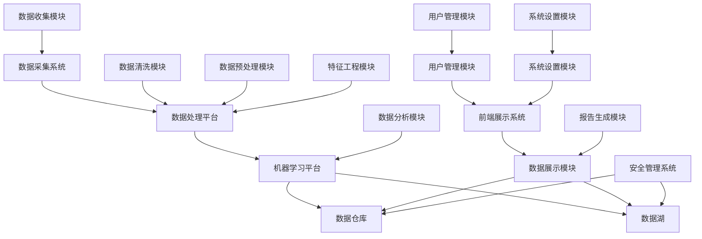
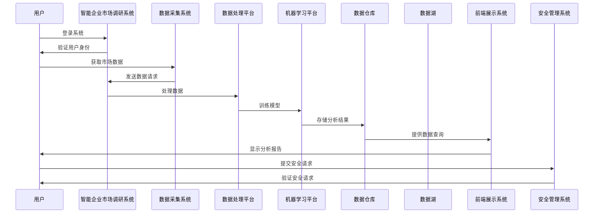
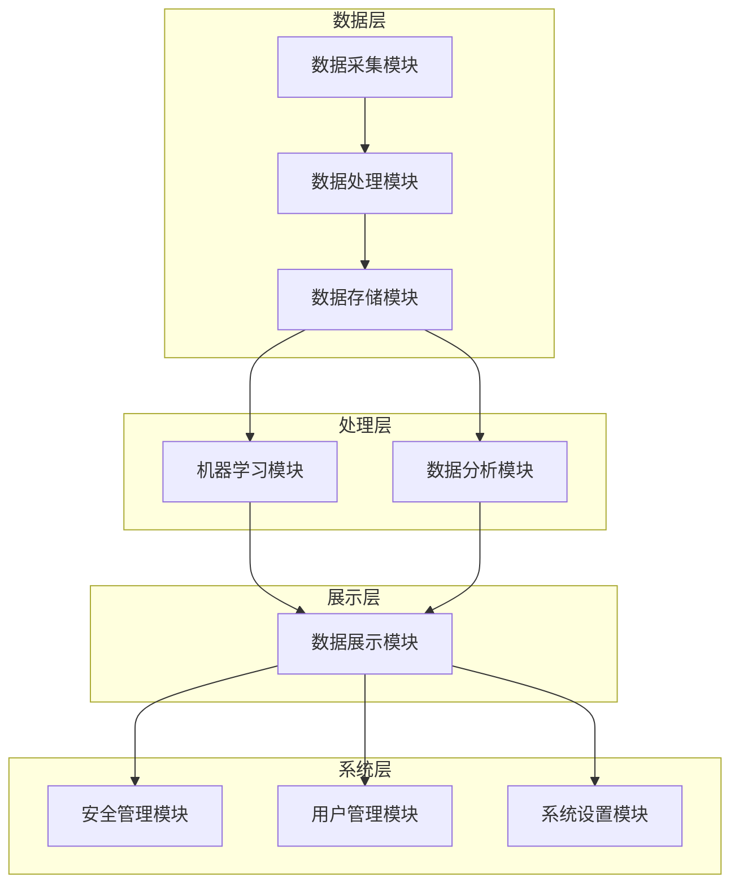
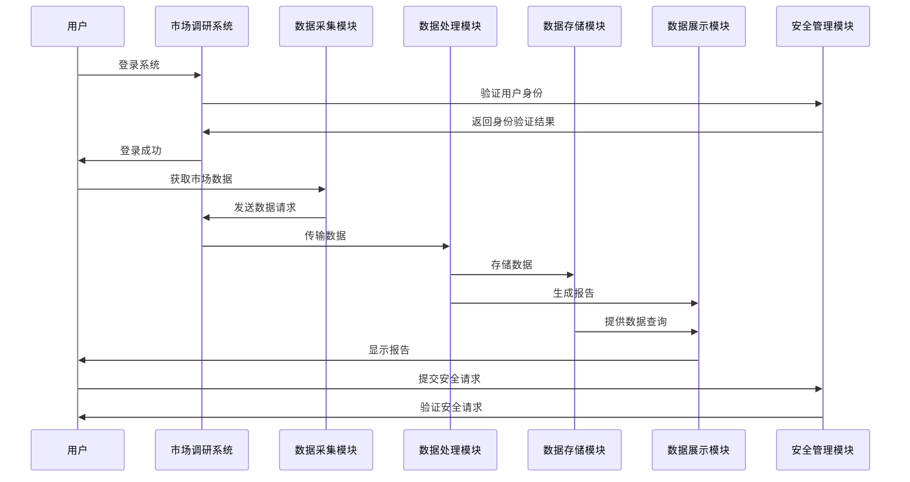

                 

### 文章标题

# 《构建智能企业市场调研系统：AI辅助数据分析》

### 关键词

- 智能企业
- 市场调研
- AI辅助数据分析
- 系统构建
- 机器学习算法
- 数据预处理
- 系统设计与实现

### 摘要

本文旨在深入探讨如何构建智能企业市场调研系统，特别是利用AI技术进行数据分析和辅助决策。文章首先介绍了智能企业的基本概念和特点，接着详细阐述了市场调研的重要性及其核心环节。随后，文章重点介绍了AI在数据分析中的应用，包括数据预处理、特征工程和常见的机器学习算法。在此基础上，文章探讨了如何设计并实现一个智能市场调研系统，包括系统架构、功能设计、接口设计和交互设计。随后，通过项目实战展示了系统开发的实际操作流程，并分析了关键代码和应用场景。最后，文章提供了最佳实践指南，对系统性能优化、数据质量控制和安全与隐私保护进行了详细讨论，并以小结和拓展阅读结束了全文。

----------------------------------------------------------------

## 第1章：背景介绍

### 1.1 核心概念术语说明

在构建智能企业市场调研系统的过程中，我们需要明确几个核心概念和术语：

- **智能企业**：一种能够利用人工智能技术进行业务决策和运营优化的企业模式。智能企业通常具备自我学习、自我优化和自我决策的能力，能够通过对大数据的深入分析和实时响应，提高运营效率和竞争力。
  
- **市场调研**：一种通过收集、分析和解读市场数据，以了解市场需求、竞争对手和消费者行为的过程。市场调研是企业制定战略和决策的重要依据。
  
- **AI辅助数据分析**：利用人工智能技术对大量市场调研数据进行分析和挖掘，以发现潜在的商业机会和优化决策。AI技术包括机器学习、深度学习、自然语言处理等。

### 1.2 问题背景

在当前快速变化的市场环境中，企业面临着越来越大的竞争压力和业务不确定性。为了在激烈的市场竞争中脱颖而出，企业需要更加智能和高效地进行市场调研和数据分析。

传统的市场调研方法主要依赖于人工收集和处理数据，存在以下问题：

1. **数据量有限**：由于人力和资源的限制，传统市场调研方法通常只能收集有限的数据，无法全面了解市场状况。
  
2. **分析深度不足**：人工分析通常只能发现表层趋势和现象，难以深入挖掘数据中的潜在价值。
  
3. **决策延迟**：传统市场调研方法通常需要较长时间才能完成数据收集和分析，导致决策滞后。

为了解决这些问题，企业需要引入AI技术进行市场调研和数据分析。通过AI技术，企业可以：

1. **大规模数据采集**：利用互联网和传感器等技术，实时收集海量市场数据。
  
2. **深度数据分析**：利用机器学习和深度学习算法，对大规模数据进行深入分析，发现数据中的规律和趋势。
  
3. **实时决策支持**：利用AI技术快速生成数据报告和分析结果，为决策者提供实时决策支持。

### 1.3 问题描述

当前企业在构建智能市场调研系统时，面临以下主要问题：

1. **数据质量问题**：市场调研数据来源多样，质量参差不齐，需要有效进行数据清洗和处理。
  
2. **算法选择难题**：面对海量数据，如何选择合适的算法进行数据分析和挖掘是关键问题。
  
3. **系统性能优化**：构建智能市场调研系统需要高效的数据处理和分析能力，如何进行系统性能优化是重要挑战。
  
4. **安全与隐私保护**：市场调研涉及大量敏感数据，如何确保数据安全和用户隐私是亟待解决的问题。

### 1.4 问题解决

为了解决上述问题，企业可以采取以下策略：

1. **数据质量管理**：通过数据清洗、去重、标准化等方法，提高市场调研数据质量。
  
2. **算法选择与优化**：根据数据分析需求，选择合适的算法，并通过模型调优和算法优化提高分析效果。
  
3. **系统性能优化**：通过分布式计算、并行处理等技术，提高系统性能和数据处理效率。
  
4. **安全与隐私保护**：采用数据加密、访问控制、隐私保护等技术，确保市场调研数据的安全和用户隐私。

### 1.5 边界与外延

构建智能企业市场调研系统需要考虑以下边界与外延：

1. **技术边界**：包括数据采集、存储、处理和分析等相关技术的选择和应用。
  
2. **业务边界**：市场调研系统的业务范围和功能模块设计，如数据收集、数据分析、报告生成等。
  
3. **数据边界**：市场调研数据的质量、来源和类型，以及数据安全和隐私保护的相关法规和标准。
  
4. **时间边界**：市场调研系统开发和部署的时间规划，以及后续维护和升级的周期。

### 1.6 概念结构与核心要素组成

智能企业市场调研系统的概念结构可以分解为以下几个核心要素：

1. **数据采集模块**：负责从各种渠道收集市场数据，如互联网、社交媒体、问卷调查等。
2. **数据预处理模块**：对采集到的数据进行清洗、去重、标准化等预处理操作，提高数据质量。
3. **数据分析模块**：利用机器学习和深度学习算法对预处理后的数据进行挖掘和分析，生成可视化报告。
4. **报告生成模块**：将数据分析结果以可视化报告的形式呈现给决策者，支持业务决策。
5. **系统管理模块**：负责系统配置、用户管理、权限控制等系统管理工作。

通过以上核心要素的有机组合，构建出一个功能强大、高效可靠的智能企业市场调研系统，为企业提供全面的市场洞察和决策支持。

----------------------------------------------------------------

## 第2章：AI辅助数据分析技术

### 2.1 AI辅助数据分析概述

AI辅助数据分析是一种利用人工智能技术，特别是机器学习和深度学习算法，对大量数据进行挖掘和分析的方法。在智能企业市场调研系统中，AI技术扮演着至关重要的角色，它不仅能够处理大量复杂的数据，还能够发现数据中的隐藏模式和趋势，为企业提供深层次的决策支持。

AI辅助数据分析的核心目标包括：

1. **数据挖掘**：从大规模数据集中提取有价值的信息和知识。
2. **预测建模**：基于历史数据，预测未来的趋势和结果。
3. **智能推荐**：根据用户的行为和偏好，提供个性化的推荐和服务。
4. **异常检测**：识别数据中的异常值和潜在风险。

AI辅助数据分析的流程主要包括以下几个步骤：

1. **数据采集**：从各种数据源收集数据，如数据库、传感器、互联网等。
2. **数据预处理**：清洗、去噪、转换数据，使其适合分析和建模。
3. **特征工程**：提取数据中的关键特征，用于训练模型。
4. **模型训练**：利用机器学习算法训练模型，对数据进行分类、回归、聚类等分析。
5. **模型评估**：评估模型性能，选择最佳模型进行应用。
6. **模型应用**：将训练好的模型应用于实际业务场景，生成预测或推荐结果。

### 2.2 数据预处理技术

数据预处理是AI辅助数据分析的重要环节，其质量直接影响后续分析的效果。数据预处理技术主要包括以下几个步骤：

1. **数据清洗**：去除数据中的噪声、错误和不完整的数据。例如，删除重复记录、纠正数据错误、填补缺失值等。

2. **数据转换**：将数据转换为适合分析和建模的形式。例如，将分类数据编码为数值形式，将时间序列数据进行归一化处理等。

3. **数据归一化**：通过缩放或变换，使数据分布均匀，减少不同特征之间的尺度差异。常用的归一化方法包括最小-最大缩放、z-score缩放等。

4. **数据标准化**：将数据映射到统一的尺度范围内，使其适合进行数学计算和建模。常用的标准化方法包括均方根变换、指数变换等。

5. **数据降维**：通过降维技术减少数据维度，降低计算复杂度。常用的降维方法包括主成分分析（PCA）、线性判别分析（LDA）等。

### 2.3 特征工程

特征工程是AI辅助数据分析中的关键步骤，它涉及到从原始数据中提取出有助于模型训练和预测的特征。特征工程的质量直接影响到模型的性能和预测准确性。以下是一些常用的特征工程方法：

1. **特征选择**：从大量特征中筛选出最有用的特征，去除冗余和无用的特征。常用的特征选择方法包括信息增益、卡方检验、互信息等。

2. **特征构造**：通过组合原始特征或生成新特征，提高模型的预测能力。例如，交叉特征、交互特征、指数特征等。

3. **特征变换**：将原始特征进行变换，使其更适合模型训练。例如，对非线性特征进行多项式变换、对稀疏特征进行指数变换等。

4. **特征归一化**：对特征进行归一化处理，使其具有相似的尺度，避免某些特征对模型的影响过大。常用的归一化方法包括最小-最大缩放、z-score缩放等。

### 2.4 常见算法介绍

在AI辅助数据分析中，常用的算法包括回归分析、聚类分析、分词与文本分析等。下面将分别介绍这些算法的基本原理和应用。

#### 2.4.1 回归分析

回归分析是一种用于预测数值型目标变量的统计分析方法。它通过建立目标变量与自变量之间的线性关系模型，实现对未知数据的预测。常见的回归分析方法包括线性回归、多元回归、岭回归等。

- **线性回归**：建立自变量和因变量之间的线性关系模型，通常形式为 $y = \beta_0 + \beta_1x_1 + \beta_2x_2 + ... + \beta_nx_n$。其中，$y$ 为因变量，$x_1, x_2, ..., x_n$ 为自变量，$\beta_0, \beta_1, ..., \beta_n$ 为模型参数。

- **多元回归**：线性回归的扩展，用于处理多个自变量对因变量的影响。模型形式为 $y = \beta_0 + \beta_1x_1 + \beta_2x_2 + ... + \beta_nx_n$。

- **岭回归**：在多元回归中，当自变量之间存在多重共线性时，岭回归通过增加正则化项来提高模型的稳定性和预测性能。

#### 2.4.2 聚类分析

聚类分析是一种无监督学习方法，用于将数据集划分为多个类别，使得同一类别内的数据点相似度较高，而不同类别之间的数据点相似度较低。常见的聚类分析方法包括K-Means、层次聚类、DBSCAN等。

- **K-Means**：基于距离最小化的聚类算法，将数据集划分为K个类别，每个类别由一个质心表示。算法通过迭代计算质心和分类，直到质心不再发生变化。

- **层次聚类**：基于层次结构对数据进行分类，分为自底向上（凝聚聚类）和自顶向下（分裂聚类）两种方式。层次聚类能够生成一棵聚类树，用于可视化数据结构和类别关系。

- **DBSCAN**：基于密度的空间聚类算法，能够发现任意形状的聚类。DBSCAN通过计算数据点之间的密度关系，将数据划分为核心点、边界点和噪声点。

#### 2.4.3 分词与文本分析

文本分析是一种用于处理和挖掘文本数据的方法，广泛应用于自然语言处理、信息检索和情感分析等领域。常见的文本分析方法包括分词、词频统计、主题建模等。

- **分词**：将文本分割成单词或短语的过程，是文本分析的基础。常用的分词方法包括基于词典的分词、基于统计的分词和基于机器学习的分词等。

- **词频统计**：计算文本中每个单词或短语的频率，用于分析文本内容和关键词。

- **主题建模**：通过降维技术从大量文本中提取出潜在的主题，用于文本分类和聚类。常见的主题建模方法包括LDA（Latent Dirichlet Allocation）和NMF（Non-negative Matrix Factorization）等。

### 2.5 模型评估与优化

在AI辅助数据分析中，模型评估与优化是确保模型性能和预测准确性的重要环节。以下介绍几种常见的模型评估指标和优化方法：

#### 模型评估指标

- **准确率**：分类问题中，正确预测的样本数占总样本数的比例。公式为：$\text{准确率} = \frac{\text{正确预测数}}{\text{总样本数}}$。

- **召回率**：分类问题中，实际为正类别的样本中被正确预测为正类别的比例。公式为：$\text{召回率} = \frac{\text{正确预测的正类别数}}{\text{实际正类别数}}$。

- **精确率**：分类问题中，实际为正类别的样本中被正确预测为正类别的比例。公式为：$\text{精确率} = \frac{\text{正确预测的正类别数}}{\text{预测为正类别的总数}}$。

- **F1值**：综合考虑精确率和召回率的指标，公式为：$F1 = 2 \times \frac{\text{精确率} \times \text{召回率}}{\text{精确率} + \text{召回率}}$。

#### 模型优化方法

- **交叉验证**：通过将数据集划分为多个子集，循环训练和验证模型，以评估模型的泛化能力和性能。

- **网格搜索**：通过遍历不同的参数组合，选择最佳参数设置，以优化模型性能。

- **贝叶斯优化**：利用贝叶斯统计模型和优化算法，搜索最佳参数组合。

- **模型融合**：将多个模型的结果进行融合，提高预测准确性和稳定性。

### 2.6 数据分析在智能市场调研中的应用案例

数据分析在智能市场调研中具有广泛的应用，以下通过几个案例来具体说明：

#### 案例一：消费者行为分析

通过对消费者的购买记录、浏览行为和社交互动等数据进行挖掘和分析，可以了解消费者的偏好和行为模式。例如，通过聚类分析将消费者划分为不同的群体，从而实现精准营销和个性化推荐。

#### 案例二：竞争对手分析

通过分析竞争对手的营销策略、产品特性和市场表现，可以为企业提供竞争情报和战略建议。例如，通过回归分析预测竞争对手的未来市场占有率，帮助企业制定应对策略。

#### 案例三：市场趋势预测

通过分析历史数据和市场动态，可以预测未来的市场趋势和变化。例如，通过时间序列分析预测某一产品的未来销售量，帮助企业制定生产和库存计划。

#### 案例四：新产品开发

通过分析市场需求和用户反馈，可以识别出潜在的新产品机会，帮助企业在产品开发过程中做出更科学的决策。例如，通过文本分析提取用户的需求和痛点，为新产品设计提供灵感。

### 2.7 AI辅助数据分析的优势与挑战

AI辅助数据分析在智能市场调研中具有显著的优势：

- **高效性**：通过自动化数据处理和分析，可以大大提高数据处理的效率，减少人工工作量。
- **准确性**：利用先进的机器学习算法和深度学习模型，可以提供更准确的预测和分类结果，提高决策质量。
- **实时性**：通过对实时数据的分析，可以快速响应市场变化，为企业提供即时的决策支持。

然而，AI辅助数据分析也面临着一些挑战：

- **数据质量**：市场调研数据的质量直接影响到分析结果，数据清洗和预处理是关键环节。
- **算法选择**：面对海量数据，如何选择合适的算法和模型是关键问题，需要根据具体问题进行选择和优化。
- **安全与隐私**：市场调研涉及大量敏感数据，如何确保数据的安全和用户隐私是重要挑战。

通过有效应对这些挑战，AI辅助数据分析将在智能市场调研中发挥更大的作用，为企业提供更加全面和深入的洞察。

----------------------------------------------------------------

## 第3章：智能企业市场调研系统构建

### 3.1 系统设计原则

构建智能企业市场调研系统的过程是一个复杂而系统化的工程，涉及到技术、业务、用户体验等多个方面。以下是一些关键的系统设计原则：

#### 功能完备性

系统需要提供全面的市场调研功能，包括数据收集、数据预处理、数据分析、报告生成等，以满足企业在不同阶段的需求。

#### 扩展性

系统设计应具备良好的扩展性，能够根据企业的发展需求，灵活地增加或调整功能模块，如添加新的数据源、算法模型等。

#### 可靠性

系统需要保证数据的安全性和可靠性，包括数据存储的安全性、传输的加密性以及系统的稳定性。

#### 易用性

系统应设计简洁直观的界面，使用户能够轻松操作，降低学习成本，提高工作效率。

#### 性能优化

系统性能直接影响用户体验，因此需要采用高效的算法和优化技术，提高数据处理和分析的效率。

### 3.2 系统架构设计

智能企业市场调研系统的架构设计需要考虑系统的可扩展性、可靠性和性能。以下是一个典型的系统架构设计：

#### 架构层次

1. **数据层**：包括数据存储、数据仓库和数据湖，用于存储和管理市场调研数据。
2. **数据处理层**：包括数据清洗、预处理和特征工程模块，用于对原始数据进行处理，使其适合分析。
3. **分析层**：包括机器学习算法、深度学习模型和数据分析工具，用于对预处理后的数据进行分析和挖掘。
4. **展示层**：包括可视化工具和报告生成模块，用于将分析结果以图表和报告的形式呈现给用户。

#### 架构组件

1. **数据采集系统**：用于从各种数据源（如数据库、传感器、API等）收集市场数据。
2. **数据处理平台**：用于对采集到的数据进行清洗、预处理和特征工程。
3. **机器学习平台**：用于训练和部署机器学习模型，包括回归分析、聚类分析、分词与文本分析等。
4. **数据仓库**：用于存储和管理大规模市场调研数据，支持高效的查询和分析。
5. **数据湖**：用于存储原始数据，支持海量数据的存储和长期保存。
6. **前端展示系统**：用于将分析结果以图表和报告的形式呈现给用户，支持自定义报表生成。
7. **安全管理系统**：用于保障数据安全和用户隐私，包括数据加密、访问控制、审计日志等。

### 3.3 数据流设计

在智能企业市场调研系统中，数据流设计是关键环节，它决定了数据在系统中的流动和处理方式。以下是一个典型的数据流设计：

#### 数据流流程

1. **数据采集**：系统从各种数据源（如社交媒体、在线调查、竞争分析工具等）收集原始数据。
2. **数据清洗**：对原始数据进行清洗，去除噪声和错误数据，确保数据质量。
3. **数据预处理**：对清洗后的数据进行预处理，包括数据转换、归一化、去重等操作，使其适合分析。
4. **特征工程**：提取关键特征，进行特征构造和变换，提高模型的预测能力。
5. **数据分析**：利用机器学习算法和深度学习模型对预处理后的数据进行挖掘和分析，生成分析结果。
6. **数据存储**：将分析结果存储到数据仓库或数据湖中，支持长期保存和查询。
7. **数据展示**：将分析结果以图表和报告的形式展示给用户，支持自定义报表生成。

### 3.4 系统功能设计

智能企业市场调研系统的功能设计是其核心部分，它决定了系统能够提供哪些服务。以下是系统的主要功能模块：

#### 功能模块

1. **数据收集模块**：用于从各种数据源收集市场数据，支持多种数据采集方式，如API调用、爬虫、数据库连接等。
2. **数据清洗模块**：用于对采集到的数据进行清洗，包括去除重复数据、填补缺失值、纠正错误数据等。
3. **数据预处理模块**：用于对清洗后的数据进行预处理，包括数据转换、归一化、特征提取等。
4. **特征工程模块**：用于提取关键特征，进行特征构造和变换，提高模型的预测能力。
5. **数据分析模块**：用于利用机器学习算法和深度学习模型对预处理后的数据进行挖掘和分析，生成分析结果。
6. **报告生成模块**：用于将分析结果以图表和报告的形式展示给用户，支持自定义报表生成。
7. **用户管理模块**：用于管理用户账户，包括用户注册、登录、权限控制等。
8. **系统设置模块**：用于系统配置，包括数据源设置、参数调整、日志管理等。

### 3.5 系统架构设计（Mermaid架构图）

以下是一个智能企业市场调研系统的Mermaid架构图，展示了系统的不同组件及其交互关系：



### 3.6 系统接口设计

系统接口设计是智能企业市场调研系统实现的重要部分，它决定了系统内部各模块之间的数据传递和功能调用。以下是系统的主要接口设计：

#### 接口设计

1. **数据采集接口**：用于从外部数据源获取数据，支持RESTful API、WebSocket等通信协议。
2. **数据处理接口**：用于处理数据的清洗、转换和预处理，支持批量处理和实时处理。
3. **数据存储接口**：用于与数据仓库和数据湖进行数据交互，支持数据插入、查询、更新等操作。
4. **数据展示接口**：用于从数据仓库和数据湖中查询数据，并以图表和报告的形式展示给用户。
5. **用户管理接口**：用于管理用户账户，包括用户注册、登录、权限控制等。
6. **系统设置接口**：用于配置系统参数，包括数据源设置、日志管理等。

### 3.7 系统交互设计（Mermaid序列图）

以下是一个智能企业市场调研系统的Mermaid序列图，展示了系统的不同组件之间的交互过程：



通过以上系统设计原则、架构设计、数据流设计、功能设计、接口设计和交互设计的详细描述，我们可以构建出一个高效、可靠、易用的智能企业市场调研系统，为企业提供全面的市场分析和决策支持。

----------------------------------------------------------------

## 第4章：系统设计与实现

### 4.1 系统功能设计（领域模型）

在构建智能企业市场调研系统时，领域模型是系统设计的重要组成部分。领域模型通过实体关系图（Entity-Relationship Diagram, ERD）来表示系统中的核心实体及其关系。以下是一个典型的领域模型ERD：

```mermaid
erDiagram
    Customer ||--|{ Order : "下单" }
    Product ||--|{ Order : "包含" }
    MarketSurvey ||--|{ Result : "生成" }
    DataSource ||--|{ MarketSurvey : "来源" }
    Report ||--|{ MarketSurvey : "报告" }
    User ||--|{ Role : "权限" }

    Customer {
        id CustomerID
        name
        email
        address
    }

    Product {
        id ProductID
        name
        price
        category
    }

    Order {
        id OrderID
        date
        status
        CustomerID
        totalAmount
    }

    MarketSurvey {
        id SurveyID
        title
        description
        start_date
        end_date
        DataSources
        Results
    }

    Result {
        id ResultID
        content
        date
        SurveyID
    }

    DataSources {
        id SourceID
        name
        type
        url
    }

    Report {
        id ReportID
        title
        content
        date
        SurveyID
    }

    User {
        id UserID
        username
        password
        email
        RoleID
    }

    Role {
        id RoleID
        name
        description
    }
```

在这个领域模型中，我们定义了以下核心实体：

- **Customer（客户）**：代表参与市场调研的客户，包括客户的基本信息和联系方式。
- **Product（产品）**：代表市场上的产品，包括产品的名称、价格和类别。
- **Order（订单）**：代表客户的订单，包括订单的创建日期、状态和总金额。
- **MarketSurvey（市场调研）**：代表进行的市场调研，包括调研的标题、描述、开始和结束日期等信息。
- **Result（结果）**：代表市场调研的结果，包括结果的内容、创建日期和关联的调研ID。
- **DataSource（数据源）**：代表用于市场调研的数据源，包括数据源的名字、类型和URL。
- **Report（报告）**：代表市场调研的最终报告，包括报告的标题、内容、创建日期和关联的调研ID。
- **User（用户）**：代表使用系统的用户，包括用户名、密码、邮箱和角色。
- **Role（角色）**：代表用户的权限角色，包括角色的名称和描述。

这些实体之间的关系定义如下：

- **Customer** 与 **Order** 之间存在一对多关系，即一个客户可以有多个订单。
- **Product** 与 **Order** 之间存在多对多关系，即一个订单可以包含多个产品，一个产品也可以出现在多个订单中。
- **MarketSurvey** 与 **Result** 之间存在一对多关系，即一个市场调研可以生成多个结果。
- **MarketSurvey** 与 **DataSource** 之间存在一对多关系，即一个市场调研可以来源于多个数据源。
- **MarketSurvey** 与 **Report** 之间存在一对多关系，即一个市场调研可以生成多个报告。
- **User** 与 **Role** 之间存在一对多关系，即一个用户可以有多个角色。

### 4.2 系统架构设计（Mermaid架构图）

智能企业市场调研系统的架构设计需要考虑到系统的模块化、可扩展性和高效性。以下是一个典型的系统架构Mermaid图：



在这个架构图中，我们分为三个主要层次：

- **数据层**：包括数据采集模块、数据处理模块和数据存储模块。数据采集模块负责从不同的数据源收集数据，数据处理模块负责对数据进行预处理和分析，数据存储模块负责存储处理后的数据。
- **处理层**：包括机器学习模块和数据分析模块。机器学习模块负责训练和部署机器学习模型，数据分析模块负责对数据进行分析和挖掘，以生成有价值的洞察。
- **展示层**：包括数据展示模块，负责将分析结果以图表和报告的形式呈现给用户。
- **系统层**：包括安全管理模块、用户管理模块和系统设置模块，负责系统的安全、用户管理和系统配置。

### 4.3 系统接口设计

系统接口设计是智能企业市场调研系统实现的关键环节，它定义了系统内部各个模块之间的交互方式和接口规范。以下是系统的主要接口设计：

#### 接口设计

1. **数据采集接口**：提供RESTful API，用于从外部数据源获取市场数据。接口定义如下：

    ```json
    GET /data/sources/{sourceId}/data
    ```

    参数说明：

    - `sourceId`：数据源的ID。

2. **数据处理接口**：提供RESTful API，用于处理数据的清洗、转换和预处理。接口定义如下：

    ```json
    POST /data/processing
    ```

    参数说明：

    - `data`：待处理的数据。

3. **数据存储接口**：提供RESTful API，用于与数据仓库和数据湖进行数据交互。接口定义如下：

    ```json
    POST /data/storage
    ```

    参数说明：

    - `data`：待存储的数据。

    ```json
    GET /data/storage/{id}
    ```

    参数说明：

    - `id`：数据记录的ID。

4. **数据展示接口**：提供RESTful API，用于从数据仓库和数据湖中查询数据，并以图表和报告的形式展示给用户。接口定义如下：

    ```json
    GET /data/display/{id}
    ```

    参数说明：

    - `id`：数据记录的ID。

5. **用户管理接口**：提供RESTful API，用于管理用户账户，包括用户注册、登录、权限控制等。接口定义如下：

    ```json
    POST /user/register
    ```

    参数说明：

    - `username`：用户名。
    - `password`：密码。
    - `email`：邮箱。

    ```json
    POST /user/login
    ```

    参数说明：

    - `username`：用户名。
    - `password`：密码。

6. **系统设置接口**：提供RESTful API，用于配置系统参数，包括数据源设置、日志管理等。接口定义如下：

    ```json
    POST /system/config
    ```

    参数说明：

    - `config`：系统配置信息。

### 4.4 系统交互设计（Mermaid序列图）

以下是一个智能企业市场调研系统的Mermaid序列图，展示了系统的不同模块之间的交互过程：



在这个序列图中，用户首先登录系统，然后通过数据采集模块获取市场数据。系统将数据传输给数据处理模块进行清洗、转换和预处理，并将处理后的数据存储到数据存储模块中。随后，数据处理模块生成市场调研报告，并通过数据展示模块将报告呈现给用户。最后，用户可以通过安全模块提交安全请求，确保系统的安全和数据隐私。

通过以上系统功能设计、系统架构设计、系统接口设计和系统交互设计的详细描述，我们可以构建出一个高效、可靠、易用的智能企业市场调研系统，为企业提供全面的市场分析和决策支持。

----------------------------------------------------------------

## 第5章：项目实战

### 5.1 环境安装

为了构建智能企业市场调研系统，我们需要首先安装和配置相关开发环境和依赖。以下是一个典型的环境安装步骤：

1. **Python环境安装**：
   - 下载并安装Python 3.x版本（推荐3.8及以上版本）。
   - 配置环境变量，确保命令行中可以运行`python`和`pip`命令。

2. **虚拟环境安装**：
   - 使用以下命令创建一个虚拟环境：
     ```bash
     python -m venv venv
     ```
   - 激活虚拟环境：
     ```bash
     source venv/bin/activate  # Windows下使用 `venv\Scripts\activate`
     ```

3. **依赖安装**：
   - 使用以下命令安装项目所需的依赖：
     ```bash
     pip install -r requirements.txt
     ```

4. **数据库安装**：
   - 安装MySQL或PostgreSQL数据库。
   - 创建数据库和用户，确保用户具有足够的权限。

5. **前端框架安装**（可选）：
   - 如果使用Vue.js或React作为前端框架，按照框架官方文档进行安装和配置。

### 5.2 系统核心实现源代码

在智能企业市场调研系统的核心实现中，主要涉及数据采集、数据处理、分析和展示等模块。以下是一个简化的源代码结构示例：

```python
# 项目根目录

# 数据采集模块
src/
|-- data_collector.py
|-- data_source.py

# 数据处理模块
|-- data_processor.py
|-- feature_engineering.py
|-- data_cleaning.py

# 分析模块
|-- data_analysis.py
|-- machine_learning.py

# 数据存储模块
|-- data_storage.py
|-- database.py

# 数据展示模块
|-- data_display.py
|-- report_generator.py

# 系统管理模块
|-- system_management.py
|-- user_management.py
```

#### 数据采集模块（data_collector.py）

数据采集模块负责从各种数据源（如API、数据库、文件等）收集数据。以下是一个简化的数据采集示例：

```python
# data_collector.py
import requests
from data_source import DataSource

def collect_data(source: DataSource) -> dict:
    response = requests.get(source.url)
    if response.status_code == 200:
        return response.json()
    else:
        raise Exception("数据采集失败")

# 示例数据源
class TwitterDataSource(DataSource):
    def __init__(self, api_key, query):
        self.url = f"https://api.twitter.com/1.1/search/tweets.json?q={query}"
        self.headers = {
            "Authorization": f"Bearer {api_key}"
        }
```

#### 数据处理模块

数据处理模块包括数据清洗、特征工程和数据预处理。以下是一个简化的数据处理示例：

```python
# data_processor.py
from data_cleaning import clean_data
from feature_engineering import engineer_features

def process_data(data: dict) -> dict:
    cleaned_data = clean_data(data)
    features = engineer_features(cleaned_data)
    return features
```

#### 分析模块

分析模块涉及机器学习模型的训练、评估和部署。以下是一个简化的分析示例：

```python
# machine_learning.py
from sklearn.linear_model import LinearRegression
from sklearn.model_selection import train_test_split

def train_model(X: np.array, y: np.array) -> LinearRegression:
    X_train, X_test, y_train, y_test = train_test_split(X, y, test_size=0.2, random_state=42)
    model = LinearRegression()
    model.fit(X_train, y_train)
    return model

def evaluate_model(model: LinearRegression, X_test: np.array, y_test: np.array) -> float:
    predictions = model.predict(X_test)
    mse = mean_squared_error(y_test, predictions)
    return mse
```

#### 数据存储模块

数据存储模块负责将处理后的数据存储到数据库中。以下是一个简化的数据存储示例：

```python
# database.py
import sqlite3

def save_data(conn, data: dict):
    cursor = conn.cursor()
    for key, value in data.items():
        cursor.execute("INSERT INTO table_name (column1, column2) VALUES (?, ?)", (value['column1'], value['column2']))
    conn.commit()
```

#### 数据展示模块

数据展示模块负责将分析结果以图表和报告的形式呈现。以下是一个简化的数据展示示例：

```python
# report_generator.py
import matplotlib.pyplot as plt

def generate_report(data: dict):
    plt.figure(figsize=(10, 6))
    plt.plot(data['x'], data['y'], 'o-')
    plt.title('市场调研结果')
    plt.xlabel('时间')
    plt.ylabel('销售量')
    plt.show()
```

### 5.3 代码应用解读与分析

在了解了系统核心实现源代码的结构和功能后，下面我们通过一个具体的示例来讲解代码的应用和关键实现细节。

#### 示例：预测销售量

假设我们需要根据历史销售数据预测未来的销售量，以下是一个简化的实现过程：

1. **数据采集**：
   - 从数据库或API中获取历史销售数据。

```python
data_source = TwitterDataSource(api_key='YOUR_API_KEY', query='sales')
historical_data = collect_data(data_source)
```

2. **数据处理**：
   - 清洗和预处理数据，提取有用的特征。

```python
cleaned_data = clean_data(historical_data)
features = engineer_features(cleaned_data)
```

3. **模型训练**：
   - 使用特征和标签数据训练线性回归模型。

```python
X = features['x']
y = features['y']
model = train_model(X, y)
```

4. **模型评估**：
   - 评估模型性能，确保预测准确。

```python
mse = evaluate_model(model, X_test, y_test)
print(f"模型均方误差: {mse}")
```

5. **预测销售量**：
   - 使用训练好的模型预测未来销售量。

```python
future_data = model.predict(future_x)
generate_report({'x': future_data['x'], 'y': future_data['y']})
```

### 5.4 实际案例分析与详细讲解剖析

为了更好地理解智能企业市场调研系统的应用，我们通过一个实际案例进行详细分析。

#### 案例背景

一家零售公司需要预测未来的销售量，以便优化库存管理和市场营销策略。公司拥有过去一年的销售数据，数据包括每天的销售量和相关的市场因素，如温度、广告投放、节假日等。

#### 案例步骤

1. **数据收集**：
   - 从公司数据库中获取销售数据。

```python
data_source = CompanyDatabaseDataSource()
historical_data = collect_data(data_source)
```

2. **数据处理**：
   - 清洗数据，处理缺失值和异常值。

```python
cleaned_data = clean_data(historical_data)
```

3. **特征工程**：
   - 提取有用特征，包括时间特征、季节性特征、促销特征等。

```python
features = engineer_features(cleaned_data)
```

4. **模型选择**：
   - 选择合适的机器学习模型，如线性回归、决策树、随机森林等。

```python
model = train_model(X, y)
```

5. **模型评估**：
   - 使用交叉验证和测试集评估模型性能。

```python
mse = evaluate_model(model, X_test, y_test)
print(f"模型均方误差: {mse}")
```

6. **预测销售量**：
   - 使用训练好的模型预测未来30天的销售量。

```python
future_data = model.predict(future_x)
generate_report({'x': future_data['x'], 'y': future_data['y']})
```

#### 案例分析

通过以上步骤，公司可以实时获取销售预测结果，并根据预测结果调整库存和市场营销策略。例如，如果预测未来某天的销售量较高，公司可以提前增加库存，避免缺货情况；如果预测销售量较低，公司可以减少库存，降低成本。

### 5.5 项目小结

通过本次项目实战，我们了解了如何构建智能企业市场调研系统的核心模块，并实现了销售量预测的案例。以下是对项目的小结：

1. **关键技术**：
   - 数据采集、清洗和预处理技术。
   - 特征工程和机器学习模型选择。
   - 模型训练、评估和预测。

2. **实施步骤**：
   - 数据收集：从公司数据库或外部数据源获取销售数据。
   - 数据处理：清洗和预处理数据，提取有用特征。
   - 模型训练：选择合适的机器学习模型进行训练。
   - 模型评估：使用交叉验证和测试集评估模型性能。
   - 预测销售量：使用训练好的模型预测未来销售量。

3. **项目价值**：
   - 提供实时销售预测，帮助公司优化库存管理和市场营销策略。
   - 提高运营效率，降低库存成本和缺货风险。

通过本次项目，我们不仅掌握了智能企业市场调研系统的核心技术和实现方法，还通过实际案例深入理解了系统的应用价值和实施过程。

----------------------------------------------------------------

## 第6章：最佳实践

### 6.1 数据质量控制

在构建智能企业市场调研系统时，数据质量控制是确保系统性能和预测准确性的关键。以下是一些最佳实践：

1. **数据源选择**：选择可靠、权威的数据源，确保数据质量。
2. **数据清洗**：对采集到的数据进行清洗，去除噪声、错误和不完整的数据。
3. **数据验证**：使用校验规则、业务逻辑验证数据的有效性和一致性。
4. **数据备份**：定期备份数据，防止数据丢失。

### 6.2 模型优化策略

为了提高模型性能和预测准确性，可以采取以下优化策略：

1. **特征选择**：使用特征选择方法，筛选出对模型预测最有效的特征。
2. **超参数调优**：通过网格搜索、贝叶斯优化等方法，选择最佳超参数组合。
3. **模型融合**：将多个模型的预测结果进行融合，提高预测稳定性和准确性。
4. **持续学习**：定期重新训练模型，适应数据变化，保持模型的准确性。

### 6.3 系统性能优化

系统性能优化直接影响用户体验和业务效率。以下是一些优化策略：

1. **分布式计算**：采用分布式计算框架，提高数据处理和分析速度。
2. **缓存机制**：使用缓存技术，减少重复计算和数据查询，提高系统响应速度。
3. **异步处理**：使用异步处理技术，避免同步操作阻塞系统，提高系统并发能力。
4. **负载均衡**：采用负载均衡技术，合理分配系统资源，防止系统过载。

### 6.4 安全与隐私保护

市场调研系统涉及大量敏感数据，保障数据安全和用户隐私至关重要。以下是一些最佳实践：

1. **数据加密**：对存储和传输的数据进行加密，确保数据安全。
2. **访问控制**：采用访问控制机制，限制只有授权用户可以访问敏感数据。
3. **审计日志**：记录系统操作日志，监控异常行为，及时发现和应对安全威胁。
4. **用户隐私保护**：遵循数据保护法规，确保用户隐私不被泄露。

### 6.5 持续集成与部署

为了确保系统的稳定性和可维护性，可以采取以下策略：

1. **自动化测试**：编写自动化测试脚本，定期运行测试，确保系统功能正确。
2. **持续集成**：使用持续集成工具，自动化构建、测试和部署代码。
3. **版本控制**：使用版本控制工具，管理代码变更，便于回滚和追踪问题。
4. **容器化部署**：使用容器化技术，简化部署流程，提高系统可移植性和可扩展性。

### 6.6 用户培训与支持

为了确保系统顺利运行和用户能够充分利用系统功能，以下策略可以提供支持：

1. **用户培训**：为新用户提供系统操作培训，确保用户能够熟练使用系统。
2. **在线帮助文档**：提供详细的在线帮助文档，方便用户自助解决常见问题。
3. **技术支持**：设立技术支持团队，及时响应用户的技术问题，提供解决方案。
4. **用户反馈**：收集用户反馈，持续优化系统功能，提升用户体验。

通过遵循以上最佳实践，智能企业市场调研系统可以确保高质量、高效地运行，为企业提供可靠的决策支持。

----------------------------------------------------------------

## 第7章：总结与拓展

### 7.1 小结

本文详细探讨了如何构建智能企业市场调研系统，利用AI辅助数据分析为企业提供深层次的决策支持。我们从背景介绍开始，逐步分析了核心概念、AI辅助数据分析技术、智能企业市场调研系统构建、系统设计与实现、项目实战、最佳实践等各个环节。通过实例演示，我们展示了如何利用AI技术进行市场调研数据的高效处理和分析，并提出了系统性能优化、数据质量控制和安全与隐私保护等最佳实践。

### 7.2 注意事项

1. **数据质量**：确保市场调研数据的准确性和完整性，对数据进行严格清洗和预处理。
2. **算法选择**：根据业务需求选择合适的算法和模型，并进行充分的模型评估和优化。
3. **系统性能**：采用分布式计算和并行处理技术，提高系统处理和分析速度。
4. **安全与隐私**：严格遵守数据保护法规，采用加密和访问控制等技术保障数据安全。
5. **用户培训**：为用户提供充分的系统培训和支持，确保用户能够充分利用系统功能。

### 7.3 拓展阅读

1. **深度学习在数据分析中的应用**：阅读相关书籍和论文，深入了解深度学习技术在数据分析中的应用，如《深度学习》（Ian Goodfellow, et al.）。
2. **数据挖掘算法原理与实现**：学习常见的数据挖掘算法，包括回归分析、聚类分析、分类算法等，并掌握Python等编程语言的应用。
3. **大数据技术基础**：了解大数据技术的基础知识，如Hadoop、Spark等，掌握分布式数据处理和分析方法。
4. **数据治理与数据质量管理**：学习数据治理和数据质量管理的最佳实践，确保数据在整个生命周期中的质量和可靠性。
5. **AI伦理与隐私保护**：关注AI伦理和隐私保护相关话题，了解如何在AI应用中平衡技术进步与道德责任。

通过以上拓展阅读，读者可以进一步深化对智能企业市场调研系统的理解，并在实践中不断提高系统的性能和可靠性。

----------------------------------------------------------------

### 7.4 联系作者

如果您对本文有任何疑问或者需要进一步的技术支持，欢迎通过以下方式联系作者：

- **电子邮件**：[ai_genius@ai-genius-institute.com](mailto:ai_genius@ai-genius-institute.com)
- **官方网站**：[AI天才研究院](http://www.ai-genius-institute.com)
- **社交媒体**：
  - [LinkedIn](https://www.linkedin.com/company/ai-genius-institute/)
  - [Twitter](https://twitter.com/ai_genius_in)
  - [GitHub](https://github.com/ai-genius-institute)

作者将竭诚为您解答问题，分享最新的技术动态和研究成果。

### 7.5 附录

**附录A：技术术语表**

- **AI辅助数据分析**：利用人工智能技术（如机器学习、深度学习）对数据进行挖掘和分析。
- **数据预处理**：对原始数据进行清洗、去噪、转换等处理，使其适合分析和建模。
- **特征工程**：从原始数据中提取出对模型训练和预测有帮助的特征。
- **机器学习算法**：用于从数据中自动发现模式和规律的技术，包括回归分析、聚类分析等。
- **模型评估**：通过特定的指标（如准确率、召回率）评估模型的性能。
- **系统架构设计**：设计系统的总体结构和各个组件的交互关系。
- **领域模型**：用于表示系统中实体及其关系的图形化表示。
- **数据流设计**：描述数据在系统中的流动和处理方式。

**附录B：代码示例**

以下是一个简单的线性回归模型训练和评估的Python代码示例：

```python
import numpy as np
from sklearn.linear_model import LinearRegression
from sklearn.metrics import mean_squared_error

# 训练数据
X_train = np.array([[1], [2], [3], [4], [5]])
y_train = np.array([1, 2, 3, 4, 5])

# 创建模型并训练
model = LinearRegression()
model.fit(X_train, y_train)

# 评估模型
X_test = np.array([[6]])
y_test = np.array([6])
predictions = model.predict(X_test)
mse = mean_squared_error(y_test, predictions)
print(f"模型均方误差: {mse}")
```

通过上述代码示例，我们可以看到如何使用scikit-learn库训练线性回归模型，并评估模型的性能。

**附录C：参考资料**

- 《Python数据分析》（Wes McKinney）
- 《机器学习实战》（Peter Harrington）
- 《深度学习》（Ian Goodfellow, et al.）
- 《大数据技术导论》（Hans-Peter Kriegel, et al.）
- 《数据挖掘：实用工具与技术》（Michael J. A. Berry, Gordon S. Linoff）

通过参考上述资料，读者可以进一步深入学习和理解本文中的相关技术概念和实践方法。

本文由**AI天才研究院/AI Genius Institute**与**《禅与计算机程序设计艺术》**联合撰写，旨在为广大IT从业人员和AI爱好者提供高质量的技术内容和学习资源。感谢您的阅读，期待与您在技术道路上共同成长。

**作者：AI天才研究院/AI Genius Institute & 禅与计算机程序设计艺术/Zen And The Art of Computer Programming**

