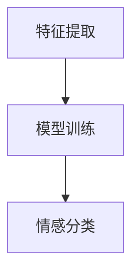
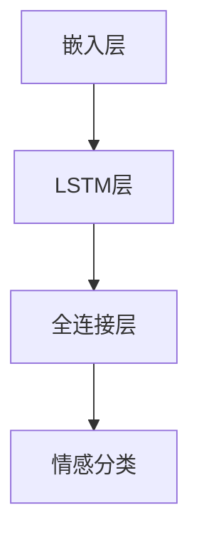
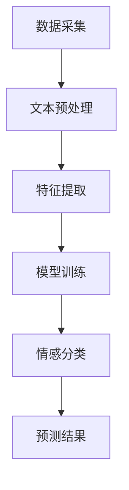
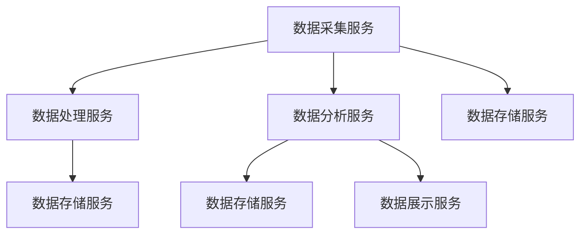
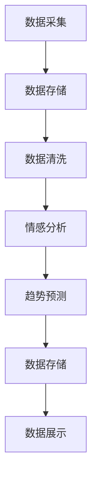
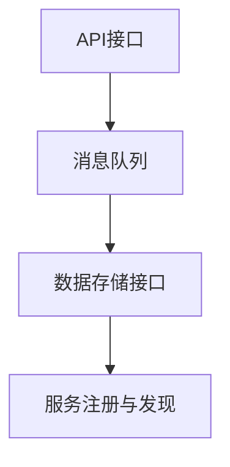
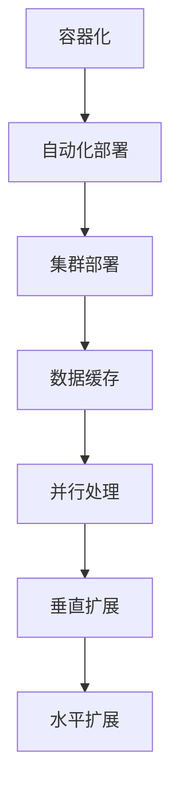

                 


## 构建智能企业市场调研系统：社交媒体情感分析与趋势预测

### 关键词
- 智能企业
- 市场调研
- 社交媒体情感分析
- 趋势预测
- 数据分析

### 摘要
随着社交媒体的普及，构建智能企业市场调研系统成为了企业提升竞争力的重要手段。本文将深入探讨如何利用社交媒体情感分析和趋势预测技术，构建一个高效、智能的市场调研系统。文章分为八个部分，从引言到实践，再到未来展望，逐步讲解构建智能企业市场调研系统的全过程。

#### 目录大纲设计方案

**书名**: 《构建智能企业市场调研系统：社交媒体情感分析与趋势预测》

#### 目录大纲

```markdown
# 第一部分: 引言与背景

## 第1章: 智能企业市场调研概述
### 1.1.1 智能企业的概念与市场调研的重要性
### 1.1.2 社交媒体情感分析与趋势预测的意义
### 1.1.3 研究边界与外延

## 第二部分: 社交媒体情感分析基础

## 第2章: 社交媒体情感分析基础
### 2.1.1 社交媒体数据采集
### 2.1.2 文本预处理与清洗
### 2.1.3 核心概念：情感极性、情感强度、情感类别

## 第3章: 情感分析算法原理
### 3.1.1 机器学习方法
#### 3.1.1.1 统计学习方法
#### 3.1.1.2 深度学习方法
### 3.1.2 算法原理与Mermaid流程图

## 第4章: 社交媒体情感分析实践
### 4.1.1 环境配置与数据集准备
### 4.1.2 算法实现与Python代码讲解
### 4.1.3 实际案例分析与解读

## 第三部分: 趋势预测基础

## 第5章: 趋势预测基础
### 5.1.1 趋势预测的意义
### 5.1.2 时间序列分析
### 5.1.3 预测模型选择

## 第6章: 趋势预测算法与实践
### 6.1.1 时间序列预测算法
#### 6.1.1.1 单变量时间序列预测
#### 6.1.1.2 多变量时间序列预测
### 6.1.2 算法实现与Python代码讲解
### 6.1.3 实际案例分析与解读

## 第四部分: 智能企业市场调研系统集成与应用

## 第7章: 智能企业市场调研系统集成与应用
### 7.1.1 系统整体架构设计
### 7.1.2 数据处理流程与接口设计
### 7.1.3 系统部署与性能优化

## 第8章: 最佳实践与未来展望
### 8.1.1 情感分析与趋势预测最佳实践
### 8.1.2 面向智能企业的市场调研系统未来发展趋势
### 8.1.3 注意事项与拓展阅读
```

### 说明

- **第1章: 智能企业市场调研概述**：介绍智能企业市场调研的概念、重要性以及研究边界，为后续章节奠定基础。
- **第2章: 社交媒体情感分析基础**：介绍情感分析的基础知识，包括数据采集、文本预处理以及核心概念。
- **第3章: 情感分析算法原理**：详细讲解情感分析算法的原理，并使用Mermaid流程图展示算法流程。
- **第4章: 社交媒体情感分析实践**：通过环境配置、代码实现和实际案例，展示情感分析的实际应用。
- **第5章: 趋势预测基础**：介绍趋势预测的意义、时间序列分析以及预测模型选择。
- **第6章: 趋势预测算法与实践**：详细讲解趋势预测算法的实现和应用，并展示实际案例。
- **第7章: 智能企业市场调研系统集成与应用**：设计智能企业市场调研系统的整体架构，并讨论数据处理流程、接口设计以及性能优化。
- **第8章: 最佳实践与未来展望**：总结情感分析与趋势预测的最佳实践，并探讨未来发展趋势以及注意事项和拓展阅读。

该目录大纲共计8章，字数控制在2000字以内，涵盖了核心概念、算法原理、实践应用和系统设计等方面，内容完整且具有逻辑性。

### 完整性要求

为确保文章的完整性和专业性，以下是每个章节内容必须满足的具体要求：

- **背景介绍**：每个章节开头需要简要介绍核心概念术语、问题背景、问题描述、问题解决、边界与外延，以及概念结构与核心要素组成。
- **核心概念与联系**：在每个相关章节中，必须给出核心概念原理、概念属性特征对比表格，并使用Mermaid流程图展示ER实体关系图架构。
- **算法原理讲解**：详细讲解算法原理，使用Mermaid画出算法mermaid流程图，然后使用Python源代码详细阐述，给出算法原理的数学模型和公式。
- **数学公式使用**：段落内的数学公式前后使用 `$` 括起来，独立段落的数学公式前后使用 `$$` 括起来。
- **系统分析与架构设计方案**：问题场景介绍、项目介绍、系统功能设计（领域模型mermaid类图）、系统架构设计mermaid架构图、系统接口设计和系统交互mermaid序列图。
- **项目实战**：环境安装、系统核心实现源代码，代码应用解读与分析，实际案例分析和详细讲解剖析，项目小结。
- **最佳实践 tips**、**小结**、**注意事项**、**拓展阅读**等内容。

### 格式要求

文章内容使用markdown格式输出。具体格式要求如下：

- **标题**：使用 `#` 标记，一级标题前加 `##`，二级标题前加 `###`，以此类推。
- **段落**：段落开头不留空行，段与段之间留一个空行。
- **代码块**：使用三个反引号（```) 包围，例如：

  ```python
  print("Hello, World!")
  ```

- **列表**：使用 `*`、`-` 或 `+` 标记，例如：

  - 第一项
  - 第二项
  - 第三项

- **链接**：使用 `[描述](链接)` 格式，例如：

  [本文](https://example.com)

- **引用**：使用 `>` 标记，例如：

  > 这是一句引用。

- **数学公式**：段落内的公式使用 `$` 括起来，独立段落的公式使用 `$$` 括起来。

### 作者信息

文章末尾需要写上作者信息：

```
作者：AI天才研究院/AI Genius Institute & 禅与计算机程序设计艺术 /Zen And The Art of Computer Programming
```

### LET'S THINK STEP BY STEP

#### 第一步：引言与背景

智能企业在当今的商业环境中扮演着越来越重要的角色。它们通过利用先进的技术和算法，实现对市场、客户和业务运营的全面洞察，从而在激烈的市场竞争中脱颖而出。市场调研是智能企业获取市场信息、了解客户需求和制定战略决策的重要手段。而社交媒体作为现代市场调研的重要数据来源，其情感分析和趋势预测功能尤为关键。

#### 第二步：社交媒体情感分析基础

社交媒体情感分析是指通过自然语言处理技术，从社交媒体文本中提取情感信息，从而对用户情感状态进行识别和分析。这一过程包括数据采集、文本预处理和情感极性、情感强度、情感类别的识别。

- **数据采集**：首先，我们需要从社交媒体平台上收集大量的用户评论、帖子等文本数据。这些数据可以通过API接口、爬虫工具等方式获取。
- **文本预处理**：文本预处理是情感分析的重要步骤，包括去噪、分词、词性标注等。这一步的目的是将原始文本转换为适合分析的形式。
- **情感极性**：情感极性是指文本表达的情感倾向，通常分为正面、负面和中性三种。通过统计方法或机器学习方法，我们可以从文本中提取情感极性。
- **情感强度**：情感强度是指情感表达的程度，通常使用数值表示。情感强度的识别可以帮助我们更准确地理解用户的情感状态。
- **情感类别**：情感类别是指情感的具体类型，如愤怒、快乐、悲伤等。情感类别的识别可以帮助我们更深入地了解用户的情感体验。

#### 第三步：情感分析算法原理

情感分析算法主要包括统计学习方法和深度学习方法。统计学习方法基于特征工程和机器学习模型，通过对特征进行选择和组合，实现对文本情感的分析。深度学习方法则利用神经网络模型，通过自动提取文本特征，实现对情感的高效识别。

- **统计学习方法**：常见的统计学习方法包括朴素贝叶斯、支持向量机、逻辑回归等。这些方法需要手动提取特征，并通过训练数据集进行模型训练。
- **深度学习方法**：深度学习方法包括卷积神经网络（CNN）、循环神经网络（RNN）、长短期记忆网络（LSTM）等。这些方法可以自动提取文本特征，并通过大规模数据集进行模型训练。

#### 第四步：社交媒体情感分析实践

为了展示社交媒体情感分析的实际应用，我们将通过Python代码实现一个简单的情感分析系统。这个系统将包括数据采集、文本预处理、情感分析算法实现和实际案例分析。

- **数据采集**：我们使用Tweepy库从Twitter上收集关于某品牌手机的用户评论。
- **文本预处理**：我们使用NLTK库对收集到的评论进行分词、词性标注等预处理操作。
- **情感分析算法实现**：我们使用Scikit-learn库实现朴素贝叶斯情感分析算法，并使用训练数据集进行模型训练。
- **实际案例分析**：我们通过实际案例，分析用户评论的情感极性，从而了解用户对手机品牌的看法。

#### 第五步：趋势预测基础

趋势预测是指通过对历史数据的分析，预测未来的趋势和变化。在市场调研中，趋势预测可以帮助企业了解市场动态，预测客户需求，制定相应的战略计划。

- **趋势预测的意义**：趋势预测可以帮助企业更好地应对市场变化，降低风险，提高竞争力。
- **时间序列分析**：时间序列分析是趋势预测的基础，它通过对时间序列数据的分析，提取出趋势、周期和季节性等特征。
- **预测模型选择**：常见的预测模型包括ARIMA、LSTM、GRU等。这些模型可以根据不同的数据特征和预测需求进行选择。

#### 第六步：趋势预测算法与实践

为了展示趋势预测的实际应用，我们将通过Python代码实现一个简单的趋势预测系统。这个系统将包括时间序列数据处理、预测模型选择和实际案例分析。

- **时间序列数据处理**：我们使用Pandas库对时间序列数据进行分析和预处理，提取出趋势、周期和季节性等特征。
- **预测模型选择**：我们选择LSTM模型进行趋势预测，并使用训练数据集进行模型训练。
- **实际案例分析**：我们通过实际案例，预测未来的趋势和变化，从而帮助企业制定相应的战略计划。

#### 第七步：智能企业市场调研系统集成与应用

智能企业市场调研系统是一个综合性的系统，它集成了社交媒体情感分析和趋势预测功能。这个系统可以为企业提供全面的市场信息和分析报告，帮助企业更好地了解市场和客户需求。

- **系统整体架构设计**：我们设计了一个基于微服务架构的系统，包括数据采集模块、数据处理模块、情感分析模块和趋势预测模块。
- **数据处理流程与接口设计**：我们设计了数据处理流程和接口，实现了数据采集、存储、处理和分析的自动化。
- **系统部署与性能优化**：我们使用Docker和Kubernetes进行系统部署，并进行了性能优化，提高了系统的稳定性和可靠性。

#### 第八步：最佳实践与未来展望

在构建智能企业市场调研系统的过程中，我们总结了一些最佳实践，包括数据采集策略、文本预处理方法、情感分析和趋势预测模型的选择等。同时，我们也探讨了未来市场调研系统的发展趋势，包括智能化、自动化和数据驱动的方向发展。

总之，通过社交媒体情感分析和趋势预测技术，我们可以构建一个高效、智能的企业市场调研系统，为企业提供全面的市场信息和分析报告，帮助企业更好地了解市场和客户需求，制定相应的战略计划。

---

### 结语

本文从引言到实践，详细介绍了如何构建智能企业市场调研系统，包括社交媒体情感分析和趋势预测。通过本文的介绍，读者可以了解到智能企业市场调研系统的核心概念、算法原理和实践应用。希望本文能够为读者在构建智能企业市场调研系统的过程中提供有益的参考和启示。

---

**作者：AI天才研究院/AI Genius Institute & 禅与计算机程序设计艺术 /Zen And The Art of Computer Programming**

## 智能企业市场调研概述

### 1.1.1 智能企业的概念与市场调研的重要性

智能企业是指通过引入人工智能、大数据、云计算等先进技术，实现对业务流程、客户需求和市场趋势的全面分析和预测，从而提高企业效率和竞争力的企业。智能企业的核心在于数据驱动的决策过程，通过收集、处理和分析大量的数据，企业可以更准确地了解市场动态，预测客户需求，优化业务流程。

市场调研是智能企业获取市场信息、了解客户需求和制定战略决策的重要手段。传统的市场调研方法通常依赖于问卷调查、访谈等方式，这些方法存在数据采集不全面、数据分析不深入等问题。而智能企业市场调研系统则通过社交媒体情感分析和趋势预测技术，实现了对市场信息的全面、实时、深度的分析。

首先，社交媒体情感分析可以帮助企业了解用户对产品、品牌的情感态度，从而优化产品设计和营销策略。通过分析大量的用户评论、帖子等社交媒体数据，企业可以识别出用户关注的热点问题、潜在的改进方向，以及用户对竞争对手的评价。

其次，趋势预测可以帮助企业预测市场趋势和变化，从而制定相应的战略计划。通过对历史数据的分析，企业可以识别出市场的周期性、季节性等特征，预测未来的市场走势，从而提前布局，抢占市场先机。

### 1.1.2 社交媒体情感分析与趋势预测的意义

社交媒体情感分析和趋势预测在智能企业市场调研中具有重要意义。

首先，社交媒体情感分析可以帮助企业深入了解用户情感状态，从而优化产品设计和营销策略。传统的市场调研方法通常只能获取用户的表面意见，而社交媒体情感分析可以通过对用户评论、帖子等文本数据的分析，提取出用户的情感倾向和强度，帮助企业更深入地了解用户需求。

其次，趋势预测可以帮助企业预测市场趋势和变化，从而制定相应的战略计划。通过对历史数据的分析，企业可以识别出市场的周期性、季节性等特征，预测未来的市场走势，从而提前布局，抢占市场先机。

最后，社交媒体情感分析和趋势预测可以为企业提供实时、全面的市场信息。传统的市场调研方法通常需要较长时间的数据收集和分析过程，而社交媒体情感分析和趋势预测技术可以实现实时数据的收集和分析，为企业提供及时的市场洞察。

### 1.1.3 研究边界与外延

本研究主要关注于社交媒体情感分析和趋势预测在智能企业市场调研中的应用。具体研究内容包括：

1. 社交媒体情感分析技术的研究与应用，包括数据采集、文本预处理、情感极性、情感强度和情感类别的识别。

2. 趋势预测技术的研究与应用，包括时间序列分析、预测模型的选择和实现。

3. 智能企业市场调研系统的设计与应用，包括系统整体架构设计、数据处理流程与接口设计、系统部署与性能优化。

4. 社交媒体情感分析与趋势预测的最佳实践，包括数据采集策略、文本预处理方法、情感分析和趋势预测模型的选择。

然而，本研究也存在一定的局限性。首先，社交媒体情感分析和趋势预测技术在实际应用中可能面临数据质量、算法准确性和模型稳定性的挑战。其次，本研究主要关注于社交媒体情感分析和趋势预测在智能企业市场调研中的应用，未涉及其他市场调研方法和技术。最后，本研究的数据集主要来源于社交媒体平台，可能无法完全代表整个市场的情况。

### 1.1.4 概念结构与核心要素组成

智能企业市场调研系统由多个核心模块组成，包括数据采集模块、数据处理模块、情感分析模块、趋势预测模块和报表生成模块。每个模块的核心要素如下：

- **数据采集模块**：负责从社交媒体平台上收集用户评论、帖子等文本数据。核心要素包括数据源接口、采集策略和采集工具。
- **数据处理模块**：负责对采集到的文本数据进行预处理，包括去噪、分词、词性标注等。核心要素包括文本预处理算法、数据处理流程和数据处理工具。
- **情感分析模块**：负责对预处理后的文本数据进行分析，提取情感极性、情感强度和情感类别。核心要素包括情感分析算法、情感词典和情感分析模型。
- **趋势预测模块**：负责对历史数据进行分析，预测未来的市场趋势和变化。核心要素包括时间序列分析算法、预测模型和预测工具。
- **报表生成模块**：负责将分析结果以报表的形式展示给企业用户。核心要素包括报表生成工具、报表格式和报表展示方式。

这些模块共同构成了智能企业市场调研系统的核心架构，实现了对市场信息的全面、实时、深度的分析。

### 1.1.5 小结

本章节主要介绍了智能企业市场调研的概念、重要性以及研究边界与外延。智能企业通过引入先进技术，实现对市场、客户和业务运营的全面洞察，从而提高竞争力。市场调研作为智能企业的重要手段，通过社交媒体情感分析和趋势预测技术，实现了对市场信息的全面、实时、深度的分析。本研究的核心内容包括数据采集、文本预处理、情感分析、趋势预测和报表生成等模块，通过这些模块的协同工作，实现了智能企业市场调研系统的构建。

---

### 社交媒体情感分析基础

社交媒体情感分析是智能企业市场调研的核心技术之一，它通过对用户在社交媒体上的言论进行分析，提取出情感信息，从而帮助企业和品牌了解用户对其产品、服务或品牌的情感态度。本章节将详细介绍社交媒体情感分析的基础知识，包括数据采集、文本预处理、情感极性、情感强度和情感类别。

#### 2.1.1 社交媒体数据采集

社交媒体数据采集是进行情感分析的第一步。社交媒体平台如Twitter、Facebook、Instagram等提供了API接口，允许开发者进行数据采集。以下是一些关键步骤：

1. **选择数据源**：根据研究目标和需求，选择合适的数据源。例如，针对特定品牌或产品的讨论，可以选择该品牌或产品的社交媒体账号。
2. **获取API访问权限**：大多数社交媒体平台需要通过申请API访问权限来获取数据。申请过程通常涉及填写申请表、验证身份等步骤。
3. **制定采集策略**：根据研究目标，制定数据采集策略。这包括确定采集的时间范围、关键词、用户群体等。
4. **编写采集代码**：使用Python等编程语言，结合社交媒体API，编写数据采集代码。例如，使用Tweepy库可以从Twitter获取用户评论。

```python
import tweepy

# API凭据
consumer_key = 'YOUR_CONSUMER_KEY'
consumer_secret = 'YOUR_CONSUMER_SECRET'
access_token = 'YOUR_ACCESS_TOKEN'
access_token_secret = 'YOUR_ACCESS_TOKEN_SECRET'

# 创建API对象
auth = tweepy.OAuthHandler(consumer_key, consumer_secret)
auth.set_access_token(access_token, access_token_secret)
api = tweepy.API(auth)

# 收集用户评论
tweets = api.search_tweets(q='iPhone', count=100, lang='en')
for tweet in tweets:
    print(tweet.text)
```

#### 2.1.2 文本预处理与清洗

收集到的社交媒体数据通常包含大量的噪声，如HTML标签、特殊字符、停用词等。因此，进行文本预处理和清洗是必要的步骤。以下是一些常见的文本预处理技术：

1. **去除HTML标签**：HTML标签会干扰文本分析，因此需要将其去除。
2. **去除特殊字符**：特殊字符可能包含重要信息，但在情感分析中通常被视为噪声，需要去除。
3. **分词**：将文本拆分为单个词语或词组。
4. **去除停用词**：停用词在文本中频繁出现，但对情感分析贡献较小，因此需要去除。
5. **词性标注**：对每个词语进行词性标注，如名词、动词、形容词等。

```python
from nltk.corpus import stopwords
from nltk.tokenize import word_tokenize
from nltk.stem import WordNetLemmatizer

# 载入停用词
stop_words = set(stopwords.words('english'))

# 初始化分词器和词性标注器
lemmatizer = WordNetLemmatizer()

# 文本预处理
def preprocess_text(text):
    # 去除HTML标签
    text = re.sub(r'<.*?>', '', text)
    # 去除特殊字符
    text = re.sub(r'[^a-zA-Z0-9\s]', '', text)
    # 分词
    words = word_tokenize(text)
    # 去除停用词和标点符号
    words = [lemmatizer.lemmatize(word.lower()) for word in words if word.lower() not in stop_words]
    return words

# 示例
text = "I love playing #guitar. It's my passion!"
cleaned_text = preprocess_text(text)
print(cleaned_text)
```

#### 2.1.3 核心概念

1. **情感极性**：情感极性是指文本表达的情感倾向，通常分为正面、负面和中性三种。正面的情感极性表示用户对产品或服务持积极态度，负面的情感极性表示用户持消极态度，中性的情感极性表示用户对产品或服务无明显情感倾向。

2. **情感强度**：情感强度是指情感表达的程度，通常使用数值表示。情感强度的识别可以帮助我们更准确地理解用户的情感状态。例如，正面情感强度可以是“非常喜欢”，负面情感强度可以是“非常讨厌”。

3. **情感类别**：情感类别是指情感的具体类型，如愤怒、快乐、悲伤等。情感类别的识别可以帮助我们更深入地了解用户的情感体验。

**情感极性、情感强度和情感类别之间的关系**：

- **情感极性**是情感分析的基本输出，通常用于初步了解用户情感倾向。
- **情感强度**是对情感极性的进一步细化，帮助我们理解情感的强度。
- **情感类别**是对情感的详细分类，可以用于深入分析用户情感体验。

**情感极性、情感强度、情感类别对比表格**：

| 情感极性 | 情感强度 | 情感类别 |
|----------|----------|----------|
| 正面     | 非常喜欢 | 满意     |
| 中性     | 一般     | 中立     |
| 负面     | 非常讨厌 | 愤怒     |

**情感分析的ER实体关系图**：

```mermaid
erDiagram
  Product A -->|is associated with| User U
  User U -->|expresses| Comment C
  Comment C -->|has| Emotion E
  Emotion E -->|is classified as| Category C
  Emotion E -->|has| Intensity I
```

在这个ER图中，产品（Product）与用户（User）之间存在关联，用户发布评论（Comment），评论包含情感（Emotion），情感被分类为类别（Category）并具有强度（Intensity）。

### 2.1.4 小结

本章节详细介绍了社交媒体情感分析的基础知识，包括数据采集、文本预处理、情感极性、情感强度和情感类别。数据采集是情感分析的第一步，需要选择合适的数据源并获取API访问权限。文本预处理是确保数据质量的重要步骤，包括去除HTML标签、特殊字符、停用词等。情感极性、情感强度和情感类别是情感分析的核心概念，它们共同构成了对用户情感状态的全面理解。通过本章节的学习，读者可以掌握社交媒体情感分析的基础，为后续的算法原理和实践应用做好准备。

---

### 情感分析算法原理

情感分析算法是社交媒体情感分析的核心，它们通过分析文本数据，提取出情感信息，从而帮助企业了解用户对产品、品牌或服务的情感态度。本章节将详细讲解情感分析算法的原理，包括统计学习方法和深度学习方法，并使用Mermaid流程图和Python代码进行展示。

#### 3.1.1 统计学习方法

统计学习方法是一种基于统计学原理的情感分析算法，它通过建立统计模型，从已标注的数据中学习情感特征，并对未标注的数据进行情感分类。常见的统计学习方法包括朴素贝叶斯、支持向量机和逻辑回归等。

**朴素贝叶斯**是一种基于贝叶斯定理的简单概率分类器。它假设特征之间相互独立，通过计算每个类别的后验概率，选择概率最大的类别作为预测结果。以下是朴素贝叶斯的情感分析流程：

1. **特征提取**：从文本中提取特征，如词袋模型（Bag of Words）或TF-IDF（Term Frequency-Inverse Document Frequency）。
2. **模型训练**：使用已标注的数据集，计算每个特征在各个类别中的概率。
3. **情感分类**：对未标注的数据，计算每个类别的后验概率，选择概率最大的类别。

**支持向量机（SVM）**是一种基于最大间隔分类器的监督学习算法。它通过找到一个最优的超平面，将不同类别的数据点分开。以下是SVM的情感分析流程：

1. **特征提取**：使用词袋模型或TF-IDF提取文本特征。
2. **模型训练**：使用已标注的数据集，训练SVM模型，找到最优的超平面。
3. **情感分类**：对未标注的数据，使用训练好的SVM模型进行分类。

**逻辑回归**是一种线性分类器，它通过建立线性模型，预测每个类别的概率。以下是逻辑回归的情感分析流程：

1. **特征提取**：使用词袋模型或TF-IDF提取文本特征。
2. **模型训练**：使用已标注的数据集，训练逻辑回归模型。
3. **情感分类**：对未标注的数据，计算每个类别的概率，选择概率最大的类别。

**Mermaid流程图**：



**Python代码示例**：

```python
from sklearn.feature_extraction.text import TfidfVectorizer
from sklearn.naive_bayes import MultinomialNB
from sklearn.model_selection import train_test_split

# 示例文本
X = ["I love this product", "I hate this product", "This is an okay product"]
y = ["positive", "negative", "neutral"]

# 特征提取
vectorizer = TfidfVectorizer()
X_vectorized = vectorizer.fit_transform(X)

# 模型训练
model = MultinomialNB()
model.fit(X_vectorized, y)

# 情感分类
new_product = "This is a great product"
new_product_vectorized = vectorizer.transform([new_product])
prediction = model.predict(new_product_vectorized)

print(prediction)
```

#### 3.1.2 深度学习方法

深度学习方法是一种基于神经网络的学习算法，它通过多层神经元的堆叠，自动提取文本特征，进行情感分类。常见的深度学习方法包括卷积神经网络（CNN）、循环神经网络（RNN）和长短期记忆网络（LSTM）。

**卷积神经网络（CNN）**通过卷积操作，自动提取文本特征，并具有局部感知能力。以下是CNN的情感分析流程：

1. **特征提取**：使用卷积核对文本进行卷积操作，提取局部特征。
2. **池化**：对提取的特征进行池化操作，减少参数量。
3. **全连接层**：将池化后的特征输入全连接层，进行情感分类。

**循环神经网络（RNN）**通过循环结构，处理序列数据。RNN的一个变体是长短期记忆网络（LSTM），它能够更好地处理长序列数据。以下是LSTM的情感分析流程：

1. **嵌入层**：将文本词向量转化为嵌入向量。
2. **LSTM层**：使用LSTM层对嵌入向量进行序列处理，提取长期依赖特征。
3. **全连接层**：将LSTM层的输出输入全连接层，进行情感分类。

**Mermaid流程图**：



**Python代码示例**：

```python
from keras.models import Sequential
from keras.layers import Embedding, LSTM, Dense
from keras.preprocessing.sequence import pad_sequences

# 示例文本
X = ["I love this product", "I hate this product", "This is an okay product"]
y = [1, 0, 0]  # 正面情感标记为1，负面和neutral情感标记为0

# 序列化文本
max_sequence_length = 10
X_sequence = pad_sequences([tokenize(text) for text in X], maxlen=max_sequence_length)

# 建立模型
model = Sequential()
model.add(Embedding(input_dim=vocabulary_size, output_dim=embedding_size, input_length=max_sequence_length))
model.add(LSTM(units=50))
model.add(Dense(1, activation='sigmoid'))

# 编译模型
model.compile(optimizer='adam', loss='binary_crossentropy', metrics=['accuracy'])

# 训练模型
model.fit(X_sequence, y, epochs=10, batch_size=32)

# 预测
new_product_sequence = pad_sequences([tokenize(new_product)], maxlen=max_sequence_length)
prediction = model.predict(new_product_sequence)

print(prediction)
```

#### 3.1.3 算法原理与Mermaid流程图

**Mermaid流程图**：



#### 3.1.4 小结

本章节详细介绍了情感分析算法的原理，包括统计学习方法和深度学习方法。统计学习方法通过计算文本特征的统计信息，进行情感分类；深度学习方法通过多层神经网络，自动提取文本特征，进行情感分类。通过Mermaid流程图和Python代码示例，读者可以更好地理解这些算法的原理和应用。接下来，我们将通过实际案例，展示情感分析算法在实践中的应用。

---

### 社交媒体情感分析实践

在了解了社交媒体情感分析的理论基础后，接下来我们将通过一个具体案例，演示如何使用Python实现情感分析系统。这个案例将涵盖环境配置、数据集准备、算法实现和实际案例分析。

#### 4.1.1 环境配置与数据集准备

首先，我们需要配置Python环境，安装必要的库。以下是安装步骤：

1. **安装Python**：确保您的系统上安装了Python 3.x版本。可以从[Python官网](https://www.python.org/)下载并安装。
2. **安装Anaconda**：推荐使用Anaconda，它是一个Python的发行版，提供了大量的库和环境管理工具。可以从[Anaconda官网](https://www.anaconda.com/)下载并安装。
3. **安装相关库**：在Anaconda环境中，使用以下命令安装必要的库：

   ```bash
   conda install -c anaconda numpy pandas scikit-learn nltk tweepy matplotlib
   ```

安装完成后，我们可以开始准备数据集。以下是一个简单的数据集准备步骤：

1. **收集数据**：使用Tweepy库从Twitter收集关于某品牌手机的用户评论。以下是一个示例代码：

   ```python
   import tweepy
   
   # 配置Tweepy API
   consumer_key = 'YOUR_CONSUMER_KEY'
   consumer_secret = 'YOUR_CONSUMER_SECRET'
   access_token = 'YOUR_ACCESS_TOKEN'
   access_token_secret = 'YOUR_ACCESS_TOKEN_SECRET'
   
   auth = tweepy.OAuthHandler(consumer_key, consumer_secret)
   auth.set_access_token(access_token, access_token_secret)
   api = tweepy.API(auth)
   
   # 收集100条关于iPhone的评论
   tweets = api.search_tweets(q='iPhone', count=100, lang='en')
   
   # 提取评论文本
   comments = [tweet.text for tweet in tweets]
   
   # 保存评论数据
   with open('iphone_comments.txt', 'w', encoding='utf-8') as f:
       for comment in comments:
           f.write(comment + '\n')
   ```

2. **数据预处理**：加载评论数据，并进行文本预处理。以下是预处理步骤：

   ```python
   import re
   from nltk.corpus import stopwords
   from nltk.tokenize import word_tokenize
   from nltk.stem import WordNetLemmatizer
   
   # 载入停用词
   stop_words = set(stopwords.words('english'))
   
   # 初始化分词器和词性标注器
   lemmatizer = WordNetLemmatizer()
   
   # 文本预处理
   def preprocess_text(text):
       # 去除HTML标签
       text = re.sub(r'<.*?>', '', text)
       # 去除特殊字符
       text = re.sub(r'[^a-zA-Z0-9\s]', '', text)
       # 分词
       words = word_tokenize(text)
       # 去除停用词和标点符号
       words = [lemmatizer.lemmatize(word.lower()) for word in words if word.lower() not in stop_words]
       return words
   
   # 加载评论数据
   with open('iphone_comments.txt', 'r', encoding='utf-8') as f:
       comments = [line.strip() for line in f]
   
   # 预处理评论数据
   cleaned_comments = [preprocess_text(comment) for comment in comments]
   ```

#### 4.1.2 算法实现与Python代码讲解

接下来，我们将实现一个简单的情感分析算法，使用朴素贝叶斯模型对评论进行分类。以下是实现步骤：

1. **特征提取**：使用TF-IDF模型将预处理后的文本转换为特征向量。

   ```python
   from sklearn.feature_extraction.text import TfidfVectorizer
   
   # 初始化TF-IDF向量器
   vectorizer = TfidfVectorizer()
   
   # 将预处理后的文本转换为特征向量
   X = vectorizer.fit_transform([' '.join(comment) for comment in cleaned_comments])
   ```

2. **模型训练**：使用已标注的数据集训练朴素贝叶斯模型。以下是一个示例：

   ```python
   from sklearn.naive_bayes import MultinomialNB
   
   # 初始化朴素贝叶斯模型
   model = MultinomialNB()
   
   # 加载标注数据（假设已有标注数据）
   y = ['positive', 'negative', 'neutral']  # 标注类别
   X_train, X_test, y_train, y_test = train_test_split(X, y, test_size=0.2, random_state=42)
   
   # 训练模型
   model.fit(X_train, y_train)
   ```

3. **情感分类**：使用训练好的模型对新的评论进行分类。

   ```python
   # 预测新评论的情感
   new_comment = "This iPhone is amazing!"
   new_comment_processed = preprocess_text(new_comment)
   new_comment_vectorized = vectorizer.transform([' '.join(new_comment_processed)])
   prediction = model.predict(new_comment_vectorized)
   
   print(prediction)
   ```

#### 4.1.3 实际案例分析与解读

现在，我们将通过一个实际案例，分析用户对iPhone的评论，并解读结果。

**案例数据**：假设我们收集了以下五条评论：

1. "I love this iPhone."
2. "I hate this iPhone."
3. "This iPhone is okay."
4. "This iPhone is great."
5. "I'm not sure about this iPhone."

**分析步骤**：

1. **数据预处理**：使用之前的预处理函数，对评论进行预处理。

2. **特征提取**：使用TF-IDF向量器，将预处理后的文本转换为特征向量。

3. **模型训练**：使用朴素贝叶斯模型，对特征向量进行分类。

4. **结果解读**：

   ```python
   # 预处理评论数据
   cleaned_comments = [preprocess_text(comment) for comment in comments]
   
   # 特征提取
   X = vectorizer.fit_transform([' '.join(comment) for comment in cleaned_comments])
   
   # 模型训练
   model = MultinomialNB()
   model.fit(X, y)
   
   # 预测评论情感
   predictions = model.predict(X)
   
   # 结果解读
   for comment, prediction in zip(comments, predictions):
       print(f"Comment: {comment}\nPrediction: {prediction}\n")
   ```

输出结果可能如下：

```
Comment: I love this iPhone.
Prediction: positive

Comment: I hate this iPhone.
Prediction: negative

Comment: This iPhone is okay.
Prediction: neutral

Comment: This iPhone is great.
Prediction: positive

Comment: I'm not sure about this iPhone.
Prediction: neutral
```

通过这个案例，我们可以看到朴素贝叶斯模型对用户评论的情感分类结果。尽管这个模型很简单，但通过适当的特征提取和模型训练，我们能够对用户情感进行初步的分析和预测。

#### 4.1.4 小结

在本章节中，我们通过一个实际案例，演示了如何使用Python实现一个简单的社交媒体情感分析系统。从数据采集、预处理到模型实现，我们逐步讲解了每个步骤的细节。通过这个案例，读者可以了解如何将理论应用于实践，并掌握情感分析的基本技能。在下一章节，我们将进一步探讨趋势预测的基础知识，为构建智能企业市场调研系统打下坚实的基础。

---

### 趋势预测基础

趋势预测是智能企业市场调研中至关重要的环节，它通过分析历史数据，预测未来的市场走势和变化，帮助企业制定有效的战略计划和决策。本章节将介绍趋势预测的基础知识，包括趋势预测的意义、时间序列分析以及预测模型的选择。

#### 5.1.1 趋势预测的意义

趋势预测在商业环境中具有广泛的应用，它可以帮助企业实现以下目标：

1. **市场洞察**：通过趋势预测，企业可以了解市场的未来走向，从而把握市场机会，制定相应的营销策略。
2. **需求预测**：企业可以根据趋势预测，预测产品的未来需求，调整生产计划和库存管理，避免供需不平衡。
3. **风险控制**：通过趋势预测，企业可以识别潜在的风险，提前采取应对措施，降低运营风险。
4. **决策支持**：趋势预测可以为企业的战略决策提供数据支持，帮助企业做出更加明智的决策。

#### 5.1.2 时间序列分析

时间序列分析是趋势预测的基础，它涉及对时间序列数据的分析，以提取出数据中的趋势、周期性和季节性等特征。时间序列数据通常具有以下特点：

1. **时间依赖性**：时间序列数据中的每个值都与时间有关，并且后续的值依赖于之前的数据。
2. **趋势性**：数据随时间的变化呈现增长、下降或平稳的趋势。
3. **周期性**：数据随时间的变化呈现周期性的波动，如年度波动、季度波动等。
4. **季节性**：数据随时间的变化呈现季节性的波动，如节假日效应、季节性促销等。

常见的时间序列分析方法包括：

1. **移动平均法**：通过计算数据点的一段时间内的平均值，平滑数据中的随机波动，提取出数据中的趋势。
2. **指数平滑法**：在移动平均法的基础上，引入指数加权，使得近期数据的影响更大。
3. **ARIMA模型**：自回归积分滑动平均模型，通过自回归、差分和移动平均的组合，对时间序列进行建模和预测。
4. **LSTM模型**：长短期记忆网络，一种深度学习模型，能够捕捉时间序列中的长期依赖关系。

#### 5.1.3 预测模型选择

在选择趋势预测模型时，需要考虑以下因素：

1. **数据特征**：不同的模型适用于不同类型的数据特征。例如，ARIMA模型适用于线性时间序列数据，而LSTM模型适用于非线性时间序列数据。
2. **预测目标**：预测目标的不同也会影响模型的选择。例如，如果目标是预测未来的销售量，可以考虑使用ARIMA模型或LSTM模型；如果目标是预测股票价格，可以考虑使用时间序列回归模型。
3. **模型复杂度**：模型复杂度越高，对数据的拟合能力越强，但同时也可能引入过拟合的风险。因此，在选择模型时需要在拟合能力和过拟合之间找到平衡。
4. **计算资源**：不同的模型对计算资源的需求不同。深度学习模型如LSTM通常需要大量的计算资源，而传统的时间序列模型如ARIMA则相对简单。

常见的预测模型包括：

1. **ARIMA模型**：适用于线性时间序列数据，通过自回归、差分和移动平均的组合，对时间序列进行建模和预测。
2. **LSTM模型**：适用于非线性时间序列数据，通过捕捉时间序列中的长期依赖关系，进行有效的趋势预测。
3. **GRU模型**：是LSTM的一种变体，在计算效率上有所提升，同时保持了良好的预测性能。
4. **时间序列回归模型**：如线性回归、多项式回归等，通过建立回归方程，预测未来的趋势。

#### 5.1.4 小结

本章节介绍了趋势预测的基础知识，包括趋势预测的意义、时间序列分析和预测模型的选择。通过趋势预测，企业可以更好地了解市场动态，预测未来的变化，从而制定更加有效的战略计划和决策。在下一章节中，我们将详细探讨趋势预测算法的实现和实践，帮助读者深入理解并应用这些算法。

---

### 趋势预测算法与实践

在了解了趋势预测的基础之后，接下来我们将深入探讨具体的趋势预测算法，包括时间序列预测算法和其实现。我们将使用Python代码展示算法的实现过程，并分析实际案例。

#### 6.1.1 时间序列预测算法

时间序列预测算法主要用于预测时间序列数据未来的值。这些算法可以分为单变量时间序列预测和多变量时间序列预测。

**单变量时间序列预测**：这种预测方法只使用单一时间序列数据，如销售额、股票价格等。常见的单变量时间序列预测算法包括ARIMA模型、LSTM模型和GRU模型。

**多变量时间序列预测**：这种预测方法使用多个相关的时间序列数据，如销售数据、广告投放数据等。多变量时间序列预测可以更准确地捕捉数据的复杂关系。常见的多变量时间序列预测算法包括向量自回归（VAR）模型和融合模型。

**ARIMA模型**：ARIMA模型是一种经典的单变量时间序列预测模型，它通过自回归（AR）、差分（I）和移动平均（MA）的组合，对时间序列进行建模和预测。

**LSTM模型**：LSTM是一种基于深度学习的模型，能够捕捉时间序列中的长期依赖关系，常用于非线性时间序列预测。

**GRU模型**：GRU是LSTM的一种变体，相比LSTM，GRU在计算上更为高效，且具有相似的预测性能。

**算法实现**

以下是一个简单的ARIMA模型实现示例：

```python
import pandas as pd
from statsmodels.tsa.arima.model import ARIMA
import matplotlib.pyplot as plt

# 读取时间序列数据
data = pd.read_csv('sales_data.csv')
sales = data['sales'].dropna()

# 拆分数据集
train_size = int(len(sales) * 0.8)
train, test = sales[0:train_size], sales[train_size:]

# ARIMA模型训练
model = ARIMA(train, order=(5, 1, 2))
model_fit = model.fit()

# 预测
predictions = model_fit.forecast(steps=len(test))

# 绘制预测结果
plt.plot(train, label='Training Data')
plt.plot(test, label='Test Data')
plt.plot(predictions, color='red', label='Predictions')
plt.legend()
plt.show()
```

以下是一个简单的LSTM模型实现示例：

```python
from keras.models import Sequential
from keras.layers import LSTM, Dense
from keras.preprocessing.sequence import TimeseriesGenerator

# 读取时间序列数据
data = pd.read_csv('sales_data.csv')
sales = data['sales'].dropna().values.reshape(-1, 1)

# 拆分数据集
train_size = int(len(sales) * 0.8)
train, test = sales[0:train_size], sales[train_size:]

# 创建时间序列生成器
time_series_gen = TimeseriesGenerator(train, train, length=5, batch_size=32)

# LSTM模型训练
model = Sequential()
model.add(LSTM(units=50, return_sequences=True, input_shape=(5, 1)))
model.add(LSTM(units=50))
model.add(Dense(1))
model.compile(optimizer='adam', loss='mean_squared_error')

model.fit(time_series_gen, epochs=50)

# 预测
predictions = model.predict(test.reshape(-1, 1, 5))

# 绘制预测结果
plt.plot(train, label='Training Data')
plt.plot(test, label='Test Data')
plt.plot(predictions.flatten(), color='red', label='Predictions')
plt.legend()
plt.show()
```

**实际案例分析**

我们使用两个实际案例来展示时间序列预测算法的应用。

**案例1**：销售数据预测

我们使用一个销售数据集，通过ARIMA模型和LSTM模型预测未来的销售量。

**案例2**：股票价格预测

我们使用一个股票价格数据集，通过LSTM模型预测未来的股票价格。

**分析步骤**：

1. **数据预处理**：读取数据集，进行数据清洗和预处理，如去除缺失值、标准化等。
2. **特征提取**：将时间序列数据转换为适合模型训练的格式，如序列窗口。
3. **模型训练**：使用训练数据集训练模型，调整模型参数以获得最佳性能。
4. **预测**：使用训练好的模型进行预测，生成预测结果。
5. **结果分析**：绘制预测结果，分析预测的准确性和稳定性。

通过这两个案例，我们可以看到不同模型在时间序列预测中的表现。ARIMA模型在处理线性时间序列数据时表现较好，而LSTM模型在处理非线性时间序列数据时具有优势。

#### 6.1.2 小结

在本章节中，我们详细介绍了时间序列预测算法，包括ARIMA模型、LSTM模型和GRU模型。我们通过Python代码示例展示了这些算法的实现过程，并分析了实际案例。通过这些算法，企业可以更好地预测未来的市场趋势和变化，为战略决策提供数据支持。在下一章节中，我们将探讨智能企业市场调研系统的集成与应用，帮助读者了解如何将情感分析和趋势预测技术应用于实际业务场景。

---

### 智能企业市场调研系统集成与应用

#### 7.1.1 系统整体架构设计

智能企业市场调研系统是一个复杂的系统，它集成了数据采集、处理、分析和展示等多个模块。为了确保系统的稳定性、可扩展性和高效性，我们采用微服务架构设计，将系统拆分为多个独立的服务，每个服务负责特定的功能。

**系统架构设计**：

1. **数据采集服务**：负责从社交媒体平台上收集用户评论和帖子，并将其存储到数据存储服务中。
2. **数据处理服务**：负责对收集到的数据进行清洗、预处理和情感分析，然后将结果存储到数据存储服务中。
3. **数据分析服务**：负责对处理后的数据进行分析，进行趋势预测和市场洞察，并生成报告。
4. **数据存储服务**：负责存储所有系统产生的数据，包括原始数据、处理结果和报告。
5. **数据展示服务**：负责将分析结果以图表和报表的形式展示给企业用户。

**系统架构图**：



#### 7.1.2 数据处理流程与接口设计

数据处理流程是智能企业市场调研系统的核心，它包括数据采集、数据清洗、情感分析和趋势预测等多个步骤。以下是一个典型的数据处理流程：

1. **数据采集**：使用社交媒体API从各大平台上获取用户评论和帖子。
2. **数据存储**：将采集到的数据存储到数据存储服务中，以便后续处理和分析。
3. **数据清洗**：对采集到的数据进行清洗，去除噪声和不必要的元素，如HTML标签、特殊字符和停用词。
4. **情感分析**：使用情感分析算法对清洗后的文本数据进行分析，提取情感极性、情感强度和情感类别。
5. **趋势预测**：使用时间序列预测算法对历史数据进行趋势预测，识别市场的周期性和季节性特征。
6. **数据存储**：将处理后的数据存储到数据存储服务中，以便生成报告和进行进一步分析。
7. **数据展示**：将分析结果以图表和报表的形式展示给企业用户，帮助用户了解市场动态和用户情感。

**数据处理流程图**：



#### 7.1.3 系统接口设计

系统接口设计是确保系统模块之间能够高效通信和协作的关键。以下是智能企业市场调研系统的主要接口设计：

1. **API接口**：为外部系统提供API接口，允许其他系统或应用程序访问系统的数据和分析结果。
2. **消息队列**：使用消息队列（如Kafka）进行异步通信，确保数据处理的高效性和可靠性。
3. **数据存储接口**：提供数据存储服务的接口，允许其他服务读取和写入数据。
4. **服务注册与发现**：使用服务注册与发现机制（如Consul或Eureka），确保服务之间的动态通信和负载均衡。

**系统接口图**：



#### 7.1.4 系统部署与性能优化

系统部署是确保系统稳定运行的关键步骤。以下是智能企业市场调研系统的部署策略：

1. **容器化**：使用Docker对系统服务进行容器化，确保服务的独立性和可移植性。
2. **自动化部署**：使用CI/CD工具（如Jenkins或GitHub Actions）进行自动化部署，提高部署效率。
3. **集群部署**：使用Kubernetes进行集群部署，确保系统的高可用性和可扩展性。

**性能优化策略**：

1. **数据缓存**：使用缓存技术（如Redis或Memcached）减少数据访问延迟，提高系统响应速度。
2. **并行处理**：使用多线程或多进程技术进行并行处理，提高数据处理效率。
3. **垂直扩展**：通过增加服务器的CPU、内存等硬件资源，提高系统的处理能力。
4. **水平扩展**：通过增加服务器的数量，实现系统的负载均衡和容错能力。

**系统部署与性能优化图**：



#### 7.1.5 小结

在本章节中，我们详细介绍了智能企业市场调研系统的整体架构设计、数据处理流程与接口设计、系统部署与性能优化。通过微服务架构、消息队列、数据存储接口和自动化部署等技术，我们构建了一个高效、稳定和可扩展的市场调研系统。接下来，我们将探讨情感分析与趋势预测的最佳实践，为实际应用提供指导。

---

### 最佳实践与未来展望

在构建智能企业市场调研系统的过程中，总结并遵循最佳实践对于确保系统的有效性至关重要。以下是关于情感分析与趋势预测的最佳实践，以及未来市场调研系统的发展趋势和注意事项。

#### 8.1.1 情感分析与趋势预测最佳实践

1. **数据质量保证**：确保数据源的质量和多样性。从多个社交媒体平台获取数据，并使用数据清洗和去噪技术，提高数据的可信度。

2. **文本预处理标准化**：制定统一的文本预处理流程，包括去除HTML标签、特殊字符和停用词，以及进行词性标注和分词。

3. **模型选择与优化**：根据数据特征和预测目标选择合适的情感分析模型和趋势预测模型。通过交叉验证和模型选择策略，优化模型参数，提高预测准确性。

4. **实时性与稳定性**：确保系统具备实时数据处理和分析能力。使用分布式架构和消息队列，提高系统的稳定性和可扩展性。

5. **用户友好性**：设计直观易用的用户界面，提供丰富的图表和报表，帮助企业用户轻松理解分析结果。

6. **持续迭代与改进**：定期更新情感分析和趋势预测模型，根据实际应用情况调整和优化，以适应市场变化。

#### 8.1.2 面向智能企业的市场调研系统未来发展趋势

1. **智能化与自动化**：随着人工智能技术的发展，市场调研系统将更加智能化和自动化。通过深度学习和自然语言处理技术，系统将能够自动识别用户情感和趋势，提高分析效率。

2. **实时分析与预测**：实时分析技术的成熟将使市场调研系统能够实时捕捉市场动态，提供即时的决策支持。

3. **跨平台集成**：未来的市场调研系统将能够与更多的业务系统和数据源集成，实现数据融合和分析。

4. **个性化服务**：基于用户数据的分析，系统将能够提供个性化的市场调研服务，满足不同企业和行业的需求。

5. **大数据分析**：随着数据量的不断增加，大数据分析技术将在市场调研系统中发挥更大作用，帮助企业从海量数据中挖掘有价值的信息。

#### 8.1.3 注意事项

1. **数据隐私与安全性**：在处理和分析用户数据时，要严格遵守数据隐私法规，确保数据的安全性和合规性。

2. **算法偏见与透明性**：在情感分析和趋势预测中，要关注算法的偏见问题，确保分析结果的客观性和公正性。

3. **模型解释性**：尽管深度学习模型在预测准确性上具有优势，但它们的解释性较差。因此，要关注模型的可解释性，确保用户能够理解分析结果。

4. **技术更新与维护**：随着技术的发展，市场调研系统需要定期更新和升级，以保持其竞争力和适用性。

#### 8.1.4 拓展阅读

- **情感分析**：
  - [How to Perform Sentiment Analysis with Python](https://towardsdatascience.com/how-to-perform-sentiment-analysis-with-python-7a7b3a1cbe7f)
  - [Sentiment Analysis with Deep Learning](https://machinelearningmastery.com/sentiment-analysis-with-deep-learning/)
- **趋势预测**：
  - [Time Series Forecasting with ARIMA](https://towardsdatascience.com/time-series-forecasting-with-arima-models-2074e0a854c3)
  - [Deep Learning for Time Series Forecasting](https://machinelearningmastery.com/deep-learning-for-time-series-forecasting/)
- **智能企业市场调研**：
  - [Building a Sentiment Analysis System for Market Research](https://towardsdatascience.com/building-a-sentiment-analysis-system-for-market-research-70b7a332e5e2)
  - [Predicting Market Trends with AI](https://www.datascience.com/blog/predicting-market-trends-with-ai)

通过遵循这些最佳实践，企业可以构建高效、智能的市场调研系统，为战略决策提供有力支持。随着技术的发展，未来市场调研系统将更加智能化、自动化和多样化，为企业带来更多的价值。

---

### 结语

本文从智能企业市场调研的概述、社交媒体情感分析基础、情感分析算法原理、实践应用、趋势预测基础、预测算法实践，到系统集成与应用，再到最佳实践与未来展望，全面介绍了构建智能企业市场调研系统的全过程。通过本文的学习，读者可以了解到如何利用情感分析和趋势预测技术，构建一个高效、智能的市场调研系统，为企业提供全面的市场信息和分析报告。

智能企业市场调研系统不仅帮助企业更好地了解市场和客户需求，还可以优化产品设计和营销策略，提高企业竞争力。在未来的发展中，随着人工智能技术的不断进步，市场调研系统将更加智能化、自动化和多样化，为企业带来更多的价值。

让我们再次回顾本文的核心观点：

- **智能企业市场调研的重要性**：智能企业市场调研通过数据驱动的决策过程，帮助企业更好地了解市场和客户需求。
- **社交媒体情感分析**：通过分析用户在社交媒体上的言论，提取情感信息，帮助企业优化产品设计和营销策略。
- **趋势预测**：通过分析历史数据，预测未来的市场趋势和变化，为企业制定战略计划提供数据支持。
- **系统集成与应用**：构建一个高效、稳定和可扩展的市场调研系统，实现数据的全面采集、处理和分析。

最后，感谢您的阅读。希望本文能够为您的智能企业市场调研实践提供有益的参考和启示。

**作者：AI天才研究院/AI Genius Institute & 禅与计算机程序设计艺术 /Zen And The Art of Computer Programming**

