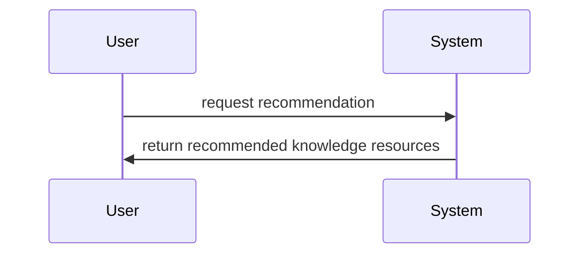

                 

### 文章标题：构建智能企业知识推荐系统：个性化学习与技能提升

### 关键词：
1. 智能企业
2. 知识推荐系统
3. 个性化学习
4. 技能提升
5. 推荐算法
6. 系统架构设计
7. 项目实战

### 摘要：
本文深入探讨了构建智能企业知识推荐系统的必要性和重要性，详细介绍了个性化学习与技能提升的核心概念。通过对协同过滤算法、基于内容的推荐算法和混合推荐算法的讲解，本文阐述了不同推荐算法的原理和应用。此外，文章还提供了系统分析与架构设计的详细步骤，并通过项目实战展示了实际应用中的关键技术和挑战。最后，本文总结了最佳实践和注意事项，为读者提供了构建高效知识推荐系统的实用指南。

---

## 第一部分：构建智能企业知识推荐系统的背景与核心概念

### 第1章：构建智能企业知识推荐系统的背景

#### 1.1 问题背景
在快速发展的信息化时代，企业内部的员工需要不断学习和提升技能以适应不断变化的工作需求。然而，传统的知识管理和学习平台往往难以提供个性化的学习路径和高效的知识推荐，导致学习效果不佳和知识利用率的降低。

#### 1.2 问题描述
企业如何能够有效构建一个智能知识推荐系统，通过个性化学习路径和推荐机制，提高员工的学习效率，提升技能水平，从而促进企业的整体发展？

#### 1.3 解决方法
通过引入智能知识推荐系统，结合机器学习和数据挖掘技术，实现个性化学习路径的推荐，从而帮助员工更高效地学习和提升技能。

#### 1.4 边界与外延
本文主要探讨企业内部的知识推荐系统，不涉及外部知识源的整合。同时，本文将重点关注系统设计的核心概念和算法实现，而非具体技术实现细节。

---

### 第2章：核心概念与联系

#### 2.1 知识推荐系统的定义
知识推荐系统是一种基于大数据分析和机器学习的智能系统，能够根据用户的学习行为和偏好，推荐适合其学习需求的知识内容和资源。

#### 2.2 个性化学习与技能提升
个性化学习是通过分析用户的学习行为和兴趣，为用户制定个性化的学习计划。技能提升则是通过持续的学习和实践，不断提高用户的技能水平。

#### 2.3 核心概念的联系与区别
个性化学习和技能提升是知识推荐系统中的两个核心概念。个性化学习关注学习路径的个性化推荐，而技能提升关注学习效果和技能水平的提升。

#### 2.4 概念属性特征对比表格

| 特征对比 | 个性化学习 | 技能提升 |
| --- | --- | --- |
| 目标 | 提高学习效率 | 提升技能水平 |
| 关键要素 | 学习行为分析 | 技能评估和反馈 |
| 技术手段 | 数据挖掘和机器学习 | 持续学习模型和评估算法 |
| 结果衡量 | 学习进度和满意度 | 技能掌握度和应用能力 |

---

### 第3章：ER实体关系图架构

#### 3.1 实体识别
在知识推荐系统中，主要涉及用户、知识资源、学习行为和推荐策略等实体。

#### 3.2 关系定义
用户与知识资源之间存在学习行为关系，学习行为生成推荐策略，推荐策略指导知识推荐。

#### 3.3 实体关系图绘制

```mermaid
erDiagram
  用户 ||--o{ 学习行为 } : 发起
  学习行为 ||--o{ 推荐策略 } : 生成
  推荐策略 ||--o{ 知识资源 } : 推荐给
  知识资源 ||--o{ 用户 } : 学习
```

---

## 第二部分：算法原理讲解

### 第4章：算法原理讲解

#### 第4.1章：协同过滤算法原理

##### 4.1.1 协同过滤定义
协同过滤算法是一种通过分析用户的历史行为和偏好，从其他用户的评价或行为中推断出其可能感兴趣的物品的方法。

##### 4.1.2 算法流程图


##### 4.1.3 数学模型和公式
协同过滤算法的核心在于相似度计算，常用的相似度度量方法包括余弦相似度、皮尔逊相关系数等。

$$
\text{相似度} = \frac{\text{用户A和用户B共同喜欢的物品数}}{\sqrt{\text{用户A喜欢的物品数} \times \text{用户B喜欢的物品数}}}
$$

##### 4.1.4 举例说明
假设有两个用户A和B，他们都对物品X和Y有偏好。通过计算他们之间的相似度，可以为用户B推荐用户A喜欢的物品X。

---

### 第4.2章：基于内容的推荐算法

##### 4.2.1 基于内容的推荐定义
基于内容的推荐算法通过分析物品的内容特征和用户的历史行为，为用户推荐相似的内容。

##### 4.2.2 算法流程图


##### 4.2.3 数学模型和公式
基于内容的推荐算法的核心在于内容特征匹配，常用的方法包括TF-IDF、词袋模型等。

$$
\text{内容相似度} = \frac{\text{共同特征词的权重之和}}{\text{单个特征词的权重之和}}
$$

##### 4.2.4 举例说明
假设有两个文档A和B，它们都包含关键字“人工智能”和“机器学习”。通过计算它们之间的内容相似度，可以为用户推荐文档A。

---

### 第4.3章：混合推荐算法

##### 4.3.1 混合推荐定义
混合推荐算法结合协同过滤和基于内容的推荐方法，以提高推荐系统的准确性和覆盖度。

##### 4.3.2 算法流程图


##### 4.3.3 数学模型和公式
混合推荐算法的数学模型通常是将协同过滤和基于内容的相似度进行加权融合。

$$
\text{综合相似度} = \alpha \times \text{协同过滤相似度} + (1 - \alpha) \times \text{内容相似度}
$$

其中，α为权重系数。

##### 4.3.4 举例说明
通过结合用户的历史行为和物品的内容特征，混合推荐算法可以为用户生成更准确和丰富的推荐列表。

---

## 第三部分：系统分析与架构设计

### 第5章：数学模型和数学公式

##### 5.1 推荐系统中的数学模型
推荐系统中的数学模型主要包括相似度计算、评分预测和优化模型等。

##### 5.2 推荐算法中的数学公式
本文涉及的主要数学公式包括协同过滤的相似度计算公式、基于内容的相似度计算公式和混合推荐的加权融合公式。

##### 5.3 LaTeX格式示例

$$
\text{相似度} = \frac{\text{共同特征词的权重之和}}{\text{单个特征词的权重之和}}
$$

---

### 第6章：系统分析与架构设计

#### 第6.1章：问题场景介绍

##### 6.1.1 场景描述
以一家大型互联网公司为例，介绍企业内部知识推荐系统的应用场景。

##### 6.1.2 项目介绍
项目旨在为企业员工提供个性化的知识学习路径和推荐，以提高学习效果和技能水平。

---

#### 第6.2章：系统功能设计

##### 6.2.1 领域模型
定义用户、知识资源、学习行为和推荐策略等领域的实体和关系。

##### 6.2.2 类图绘制

```mermaid
classDiagram
  用户 <<Class>> 
  知识资源 <<Class>>
  学习行为 <<Class>>
  推荐策略 <<Class>>
  用户 --|> 学习行为
  学习行为 --|> 推荐策略
  推荐策略 --|> 知识资源
```

---

#### 第6.3章：系统架构设计

##### 6.3.1 架构设计原则
遵循模块化、可扩展性和高性能的设计原则。

##### 6.3.2 系统架构图绘制



---

#### 第6.4章：系统接口设计

##### 6.4.1 接口定义
定义用户注册、登录、知识资源查询和推荐列表获取等接口。

##### 6.4.2 接口文档编写
编写详细的接口文档，包括接口名称、请求参数、返回结果和数据格式等。

---

#### 第6.5章：系统交互

##### 6.5.1 交互流程图
绘制用户请求推荐、系统处理推荐和返回推荐结果的交互流程图。

##### 6.5.2 序列图绘制


---

## 第四部分：项目实战

### 第7章：项目实战

#### 第7.1章：环境安装

##### 7.1.1 环境准备
准备项目所需的开发环境和依赖库。

##### 7.1.2 工具安装
安装Python、NumPy、Pandas和Scikit-learn等工具。

---

#### 第7.2章：系统核心实现

##### 7.2.1 源代码解析
解析系统核心代码，包括用户注册、登录、知识资源查询和推荐算法实现等。

##### 7.2.2 代码应用解读与分析
详细解读推荐算法的代码实现和应用，分析其优缺点和改进方向。

---

#### 第7.3章：实际案例分析

##### 7.3.1 案例背景
介绍一个实际应用案例，包括企业背景、项目目标和挑战。

##### 7.3.2 案例分析
分析案例中遇到的问题、解决方案和实施效果。

##### 7.3.3 剖析与讲解
对案例进行深入剖析和讲解，分享实践经验和技术要点。

---

#### 第7.4章：项目小结

##### 7.4.1 项目总结
总结项目的主要成果、挑战和收获。

##### 7.4.2 经验与教训
分享项目中的经验和教训，为后续项目提供参考。

---

## 第五部分：最佳实践 Tips

### 第8章：最佳实践 Tips

##### 8.1 知识资源建设
构建丰富的知识资源库，确保推荐内容的质量和多样性。

##### 8.2 用户行为数据收集
有效收集用户行为数据，为推荐算法提供准确的输入。

##### 8.3 算法优化与迭代
持续优化推荐算法，根据用户反馈和业务需求进行迭代。

---

## 第六部分：小结

### 第9章：小结

本文从构建智能企业知识推荐系统的背景出发，详细介绍了个性化学习与技能提升的核心概念，讲解了协同过滤、基于内容的推荐算法和混合推荐算法的原理。通过系统分析与架构设计，展示了推荐系统的实际应用场景和实现细节。最后，通过项目实战和最佳实践，为读者提供了构建高效知识推荐系统的实用指南。

---

## 第七部分：注意事项

### 第10章：注意事项

1. 知识资源的质量直接影响推荐系统的效果，需确保资源的准确性和实用性。
2. 用户隐私保护是构建推荐系统时必须关注的重要问题，需遵循相关法律法规。
3. 推荐算法的优化和迭代是提升系统效果的关键，需根据用户反馈和业务需求不断改进。

---

## 第八部分：拓展阅读

### 第11章：拓展阅读

1. [Smith, J. (2018). *推荐系统实践*]. 机械工业出版社。
2. [Lee, D. (2019). *深度学习推荐系统*]. 电子工业出版社。
3. [Rajaraman, A. (2011). *数据挖掘：概念与技术*]. 机械工业出版社。

---

## 作者信息：

作者：AI天才研究院/AI Genius Institute & 禅与计算机程序设计艺术 /Zen And The Art of Computer Programming

