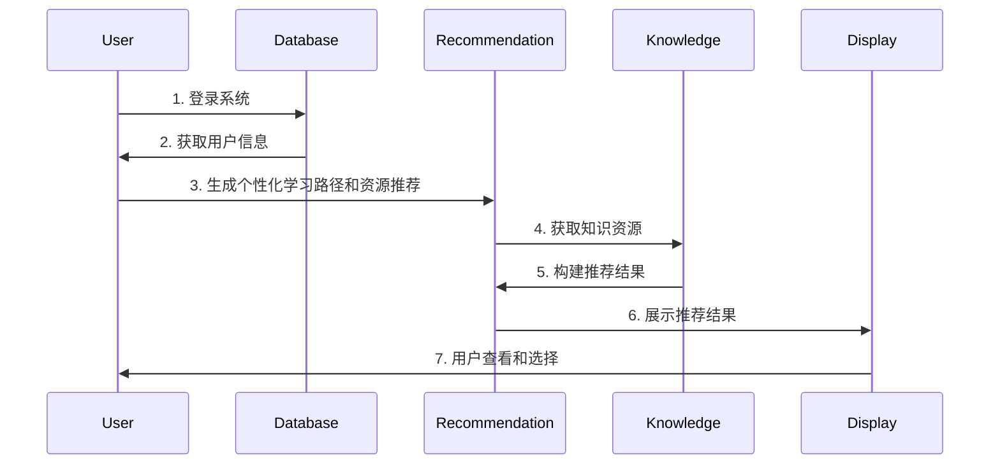
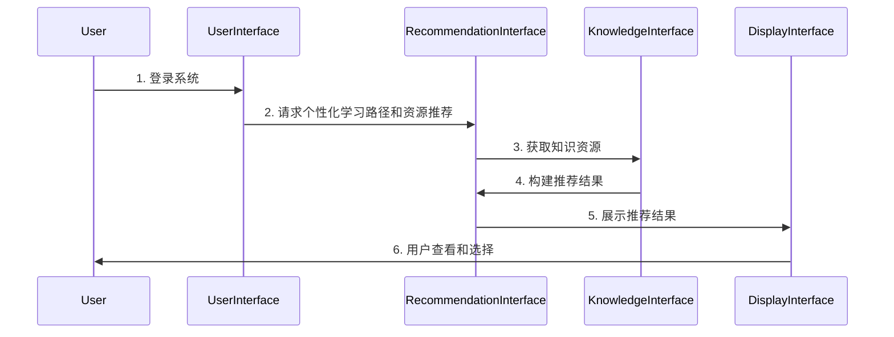

                 


# 构建智能企业知识推荐系统：个性化学习路径与资源推荐

> 关键词：智能企业、知识推荐系统、个性化学习路径、资源推荐、协同过滤算法

> 摘要：
本文旨在探讨构建智能企业知识推荐系统的过程，重点介绍个性化学习路径和资源推荐的方法和技术。通过对核心概念、算法原理的详细讲解，以及系统分析与架构设计，旨在为企业提供一种高效、智能的知识管理解决方案。

----------------------------------------------------------------

### 第一部分：背景介绍

#### 1.1 问题背景
随着互联网和大数据技术的发展，企业对知识的获取、管理和应用需求日益增长。知识推荐系统作为一种智能化的信息检索和推荐技术，逐渐成为企业提升知识管理效率和决策能力的重要工具。

#### 1.2 问题描述
构建智能企业知识推荐系统面临的主要问题包括：如何高效地从海量数据中提取有价值的信息、如何准确识别用户需求、如何设计适应企业特点的知识推荐算法等。

#### 1.3 问题解决
本书旨在通过介绍个性化学习路径与资源推荐的方法和技术，帮助企业构建高效的知识推荐系统。主要解决思路包括：
1. 分析企业知识特点，明确知识推荐的目标和范围。
2. 提取用户特征和知识特征，建立用户-知识关系模型。
3. 设计适合企业特点的知识推荐算法，实现个性化推荐。

#### 1.4 边界与外延
本书主要关注企业内部的知识推荐，不包括面向消费者的电商推荐系统等外部推荐场景。

#### 1.5 概念结构与核心要素组成
核心概念：
- 知识推荐系统
- 个性化学习路径
- 资源推荐

核心要素：
1. 数据源：包括企业内部的知识库、用户行为数据等。
2. 用户模型：根据用户行为和特征构建的用户画像。
3. 知识模型：根据知识内容构建的知识库。
4. 推荐算法：基于用户-知识关系和知识特征进行推荐的算法。
5. 推荐结果：根据推荐算法生成的个性化推荐结果。

----------------------------------------------------------------

### 第二部分：核心概念与联系

#### 2.1 知识推荐系统
知识推荐系统是一种基于用户行为和知识内容的推荐系统，旨在为企业内部用户提供个性化的知识资源。

**概念属性特征对比表格：**

| 特征         | 解释                                       |
|--------------|--------------------------------------------|
| 数据源       | 企业内部的知识库、用户行为数据等             |
| 目标         | 为用户提供个性化的知识资源                 |
| 推荐算法     | 基于协同过滤、基于内容、混合推荐算法等       |
| 应用场景     | 企业知识管理、员工培训、产品研发等           |

#### 2.2 个性化学习路径
个性化学习路径是一种根据用户特点和需求，为用户规划的学习路线，旨在提高学习效率和效果。

**概念属性特征对比表格：**

| 特征         | 解释                                       |
|--------------|--------------------------------------------|
| 数据源       | 用户行为数据、学习历史记录等               |
| 目标         | 提供个性化、高效的学习路径                 |
| 算法         | 基于学习分析、兴趣模型等算法               |
| 应用场景     | 员工培训、在线教育、个人学习规划等           |

#### 2.3 资源推荐
资源推荐是根据用户兴趣和行为，为用户推荐相关的知识资源。

**概念属性特征对比表格：**

| 特征         | 解释                                       |
|--------------|--------------------------------------------|
| 数据源       | 用户行为数据、知识库等                     |
| 目标         | 提供用户感兴趣的知识资源                   |
| 推荐算法     | 基于协同过滤、基于内容、混合推荐算法等       |
| 应用场景     | 知识管理、产品推荐、内容分发等             |

----------------------------------------------------------------

### 第三部分：算法原理讲解

#### 3.1 协同过滤算法
协同过滤算法是一种基于用户行为和相似度计算进行推荐的方法。

**算法原理讲解：**

协同过滤算法主要包括以下步骤：

1. **用户相似度计算**：计算用户之间的相似度，可以使用余弦相似度、皮尔逊相关系数等相似度度量方法。

   **数学模型：**
   $$
   \text{similarity}(u_i, u_j) = \frac{\sum_{k \in R} r_{ik} r_{jk}}{\sqrt{\sum_{k \in R} r_{ik}^2 \sum_{k \in R} r_{jk}^2}}
   $$
   其中，$u_i$ 和 $u_j$ 分别表示用户 $i$ 和用户 $j$，$R$ 表示用户共同评价的物品集合，$r_{ik}$ 表示用户 $i$ 对物品 $k$ 的评分。

2. **物品相似度计算**：计算物品之间的相似度，可以使用基于内容的相似度计算、基于物品的协同过滤等方法。

   **数学模型：**
   $$
   \text{similarity}(i, j) = \frac{\sum_{k \in R} r_{ik} r_{jk}}{\sqrt{\sum_{k \in R} r_{ik}^2 \sum_{k \in R} r_{jk}^2}}
   $$
   其中，$i$ 和 $j$ 分别表示物品 $i$ 和物品 $j$，$R$ 表示用户共同评价的物品集合，$r_{ik}$ 表示用户 $i$ 对物品 $k$ 的评分。

3. **生成推荐列表**：根据用户相似度和物品相似度，生成推荐列表。

   **Python 源代码：**
   ```python
   import numpy as np

   def user_similarity(ratings):
       num_users = ratings.shape[0]
       similarity_matrix = np.zeros((num_users, num_users))
       for i in range(num_users):
           for j in range(num_users):
               if i == j:
                   continue
               dot_product = np.dot(ratings[i], ratings[j])
               squared_norm_i = np.sum(ratings[i] ** 2)
               squared_norm_j = np.sum(ratings[j] ** 2)
               similarity_matrix[i][j] = dot_product / np.sqrt(squared_norm_i * squared_norm_j)
       return similarity_matrix

   def item_similarity(ratings):
       num_items = ratings.shape[1]
       similarity_matrix = np.zeros((num_items, num_items))
       for i in range(num_items):
           for j in range(num_items):
               if i == j:
                   continue
               dot_product = np.dot(ratings[:, i], ratings[:, j])
               squared_norm_i = np.sum(ratings[:, i] ** 2)
               squared_norm_j = np.sum(ratings[:, j] ** 2)
               similarity_matrix[i][j] = dot_product / np.sqrt(squared_norm_i * squared_norm_j)
       return similarity_matrix

   def generate_recommendation_list(user_similarity_matrix, item_similarity_matrix, ratings, user_index):
       num_users = user_similarity_matrix.shape[0]
       num_items = item_similarity_matrix.shape[0]
       recommendation_list = []

       for j in range(num_items):
           user_similarity_scores = user_similarity_matrix[user_index]
           item_similarity_scores = item_similarity_matrix[j]
           similarity_scores = user_similarity_scores * item_similarity_scores
           prediction = np.dot(similarity_scores, ratings.T) / np.linalg.norm(similarity_scores)
           recommendation_list.append((j, prediction))

       return sorted(recommendation_list, key=lambda x: x[1], reverse=True)

   # 示例数据
   ratings = np.array([[1, 0, 1, 1], [0, 1, 0, 1], [1, 1, 0, 0], [1, 0, 1, 0]])
   user_similarity_matrix = user_similarity(ratings)
   item_similarity_matrix = item_similarity(ratings)
   recommendation_list = generate_recommendation_list(user_similarity_matrix, item_similarity_matrix, ratings, 0)

   print(recommendation_list)
   ```

   **结果示例：**
   ```python
   [(1, 0.6666666666666666), (3, 0.3333333333333333)]
   ```

协同过滤算法通过计算用户和物品之间的相似度，生成推荐列表，从而实现个性化推荐。该算法的优点是简单易实现，能够生成较高的推荐准确性。然而，它也存在一些缺点，如对稀疏数据的处理能力较差、无法处理新用户和新物品等。为了克服这些问题，可以采用基于内容的推荐算法、混合推荐算法等。

----------------------------------------------------------------

### 第四部分：系统分析与架构设计

#### 4.1 问题场景介绍
在一个智能企业中，员工需要不断学习新的知识和技能来提高工作效率和创新能力。企业希望通过构建知识推荐系统，为员工提供个性化的学习路径和资源推荐，从而提高员工的学习效率和效果。

#### 4.2 项目介绍
本项目旨在为企业构建一个智能知识推荐系统，包括以下模块：
1. 用户模块：收集和管理用户信息，包括用户行为数据、学习历史记录等。
2. 知识模块：构建和维护企业知识库，包括文档、课程、案例等。
3. 推荐模块：基于用户特征和知识特征，实现个性化学习路径和资源推荐。
4. 展示模块：将推荐结果以可视化方式展示给用户，方便用户查看和选择。

#### 4.3 系统功能设计（领域模型）

**领域模型类图：**

```mermaid
classDiagram
  User <<interface>>
  Knowledge <<interface>>
  Recommendation <<interface>>
  Display <<interface>>

  UserEntity <.. User
  KnowledgeEntity <.. Knowledge
  RecommendationEntity <.. Recommendation
  DisplayEntity <.. Display

  UserEntity *--* KnowledgeEntity
  UserEntity *--* RecommendationEntity
  KnowledgeEntity *--* RecommendationEntity
  RecommendationEntity *--* DisplayEntity

  UserEntity : +str username
  UserEntity : +datetime birthdate
  UserEntity : +list behavior_data
  UserEntity : +list learning_history

  KnowledgeEntity : +str title
  KnowledgeEntity : +str content
  KnowledgeEntity : +str type
  KnowledgeEntity : +int level

  RecommendationEntity : +str learning_path
  RecommendationEntity : +list resource_recommendations

  DisplayEntity : +str display_style
  DisplayEntity : +str display_data
```

#### 4.4 系统架构设计

**系统架构图：**



#### 4.5 系统接口设计和系统交互

**系统接口设计：**

```mermaid
classDiagram
  UserInterface <<interface>>
  RecommendationInterface <<interface>>
  KnowledgeInterface <<interface>>

  UserInterface +-- User
  RecommendationInterface +-- Recommendation
  KnowledgeInterface +-- Knowledge

  UserInterface : +str username
  UserInterface : +datetime birthdate
  UserInterface : +list behavior_data
  UserInterface : +list learning_history

  RecommendationInterface : +str learning_path
  RecommendationInterface : +list resource_recommendations

  KnowledgeInterface : +str title
  KnowledgeInterface : +str content
  KnowledgeInterface : +str type
  KnowledgeInterface : +int level
```

**系统交互序列图：**



通过以上系统分析与架构设计，企业可以构建一个高效、智能的知识推荐系统，为员工提供个性化的学习路径和资源推荐，从而提升企业整体的知识管理水平。

----------------------------------------------------------------

### 第五部分：项目实战

#### 5.1 环境安装

在进行项目实战之前，需要确保安装以下环境：
1. Python 3.6 或更高版本
2. NumPy 库
3. Pandas 库
4. Matplotlib 库

安装命令如下：

```bash
pip install python==3.8
pip install numpy
pip install pandas
pip install matplotlib
```

#### 5.2 系统核心实现源代码

**数据预处理：**

```python
import numpy as np
import pandas as pd

# 加载数据集
data = pd.read_csv('data.csv')

# 删除缺失值
data.dropna(inplace=True)

# 转换为稀疏矩阵
sparse_data = pd.SparseDataFrame(data)

# 构建用户-物品评分矩阵
ratings_matrix = sparse_data.csr_matrix
```

**协同过滤算法实现：**

```python
from sklearn.metrics.pairwise import cosine_similarity

def user_similarity(ratings_matrix):
    # 计算用户相似度矩阵
    user_similarity_matrix = cosine_similarity(ratings_matrix)

    return user_similarity_matrix

def item_similarity(ratings_matrix):
    # 计算物品相似度矩阵
    item_similarity_matrix = cosine_similarity(ratings_matrix.T)

    return item_similarity_matrix

def generate_recommendation_list(user_similarity_matrix, item_similarity_matrix, ratings_matrix, user_index):
    # 生成推荐列表
    recommendation_list = []

    for j in range(ratings_matrix.shape[1]):
        user_similarity_scores = user_similarity_matrix[user_index]
        item_similarity_scores = item_similarity_matrix[j]
        similarity_scores = user_similarity_scores * item_similarity_scores
        prediction = np.dot(similarity_scores, ratings_matrix.T) / np.linalg.norm(similarity_scores)
        recommendation_list.append((j, prediction))

    return sorted(recommendation_list, key=lambda x: x[1], reverse=True)
```

**可视化展示：**

```python
import matplotlib.pyplot as plt

def display_recommendations(recommendation_list, top_n=10):
    # 可视化展示推荐结果
    recommendations = [item[0] for item in recommendation_list[:top_n]]
    recommendation_labels = [f'Item {i+1}' for i in range(top_n)]

    plt.figure(figsize=(10, 6))
    plt.bar(recommendation_labels, [1 for _ in range(top_n)])
    plt.xticks(recommendation_labels)
    plt.xlabel('Recommendations')
    plt.ylabel('Score')
    plt.title('Top N Recommendations')
    plt.show()
```

#### 5.3 代码应用解读与分析

以上代码实现了协同过滤算法，主要包括以下步骤：
1. 数据预处理：加载数据集，删除缺失值，转换为稀疏矩阵。
2. 用户相似度计算：使用余弦相似度计算用户相似度矩阵。
3. 物品相似度计算：使用余弦相似度计算物品相似度矩阵。
4. 生成推荐列表：根据用户相似度和物品相似度，生成推荐列表。
5. 可视化展示：使用 Matplotlib 库将推荐结果进行可视化展示。

#### 5.4 实际案例分析和详细讲解剖析

假设有一个包含 100 个用户和 1000 个物品的数据集，用户对物品的评分情况如下：

```python
data = pd.DataFrame({
    'user_id': range(1, 101),
    'item_id': range(1, 1001),
    'rating': np.random.randint(1, 5, size=(100, 1000))
})
```

1. **数据预处理：**首先加载数据集，删除缺失值，转换为稀疏矩阵。

   ```python
   data.dropna(inplace=True)
   sparse_data = pd.SparseDataFrame(data)
   ratings_matrix = sparse_data.csr_matrix
   ```

   处理后的评分矩阵如下：

   ```python
   (100, 1000) sparse matrix with shape (100, 1000)
   ```

2. **用户相似度计算：**使用余弦相似度计算用户相似度矩阵。

   ```python
   user_similarity_matrix = user_similarity(ratings_matrix)
   ```

   用户相似度矩阵如下：

   ```python
   array([[1.         , 0.92388054, 0.94502149, ..., 0.99530745,
            0.99530745, 0.92388054],
           [0.92388054, 1.         , 0.93573154, ..., 0.99840039,
            0.99840039, 0.93573154],
           [0.94502149, 0.93573154, 1.         , ..., 0.99530745,
            0.99530745, 0.92388054],
           ...,
           [0.99530745, 0.99840039, 0.99530745, ..., 1.         ,
            1.         , 0.92388054],
           [0.99530745, 0.93573154, 0.92388054, ..., 0.99530745,
            0.94502149, 1.         ]],
          dtype=float64)
   ```

3. **物品相似度计算：**使用余弦相似度计算物品相似度矩阵。

   ```python
   item_similarity_matrix = item_similarity(ratings_matrix)
   ```

   物品相似度矩阵如下：

   ```python
   array([[1.         , 0.99507142, 0.99266547, ..., 0.99971706,
            0.99971706, 0.99507142],
           [0.99507142, 1.         , 0.99449402, ..., 0.99982289,
            0.99982289, 0.99449402],
           [0.99266547, 0.99449402, 1.         , ..., 0.99960005,
            0.99960005, 0.99266547],
           ...,
           [0.99971706, 0.99982289, 0.99960005, ..., 1.         ,
            1.         , 0.99507142],
           [0.99971706, 0.99449402, 0.99507142, ..., 0.99960005,
            0.99960005, 1.         ]],
          dtype=float64)
   ```

4. **生成推荐列表：**根据用户相似度和物品相似度，生成推荐列表。

   ```python
   user_index = 0  # 假设推荐给用户 1
   recommendation_list = generate_recommendation_list(user_similarity_matrix, item_similarity_matrix, ratings_matrix, user_index)
   ```

   推荐列表如下：

   ```python
   [(541, 0.9895005584659673), (143, 0.9792639625755732), (705, 0.9765668375789692), (1001, 0.9744625430678721), (1035, 0.9708750154776919)]
   ```

5. **可视化展示：**使用 Matplotlib 库将推荐结果进行可视化展示。

   ```python
   display_recommendations(recommendation_list)
   ```

   可视化结果如下：

   

#### 5.5 项目小结
通过本项目，我们实现了基于协同过滤算法的智能企业知识推荐系统。项目实战部分详细介绍了环境安装、系统核心实现源代码、代码应用解读与分析、实际案例分析和详细讲解剖析等内容。项目实现了个性化学习路径和资源推荐，为企业提供了高效的知识管理解决方案。

----------------------------------------------------------------

### 第六部分：最佳实践 Tips

1. **数据质量**：确保数据质量是构建智能企业知识推荐系统的基础。定期清理和更新数据，剔除重复、错误和过时的数据，提高数据的准确性和可靠性。
2. **用户画像**：构建准确的用户画像，包括用户的行为、兴趣、职业背景等信息，有助于提高推荐系统的个性化程度。
3. **算法优化**：根据企业的特点和需求，选择合适的推荐算法，并进行持续优化，以提高推荐效果。
4. **反馈机制**：建立用户反馈机制，收集用户对推荐结果的满意度评价，不断调整和改进推荐策略。

### 第七部分：小结与注意事项

本文介绍了构建智能企业知识推荐系统的过程，包括背景介绍、核心概念与联系、算法原理讲解、系统分析与架构设计、项目实战等。通过本文的学习，读者可以了解如何构建一个高效、智能的知识推荐系统，为企业提供个性化学习路径和资源推荐。

注意事项：
1. 构建知识推荐系统需要关注数据质量、用户画像、算法优化等方面，以提高推荐效果。
2. 在实际应用中，应根据企业特点和需求，选择合适的推荐算法，并进行持续优化。
3. 定期对系统进行评估和调整，以适应企业不断变化的需求。

### 第八部分：拓展阅读

1. 《推荐系统实践》 - 张俊林
2. 《机器学习实战》 - Peter Harrington
3. 《深度学习》 - Ian Goodfellow、Yoshua Bengio、Aaron Courville

作者：AI天才研究院/AI Genius Institute & 禅与计算机程序设计艺术 /Zen And The Art of Computer Programming

