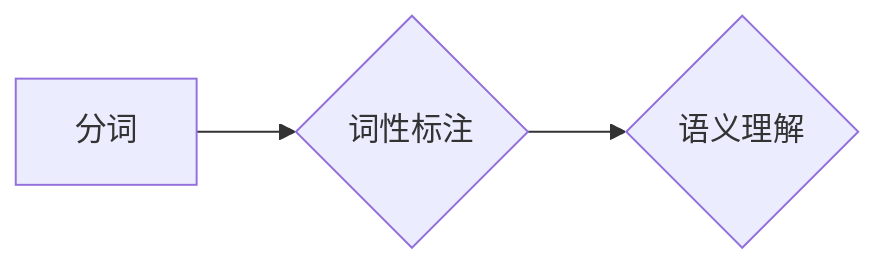
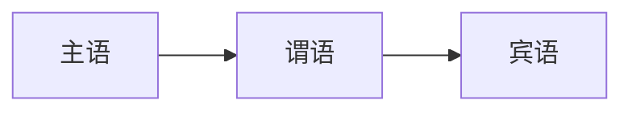
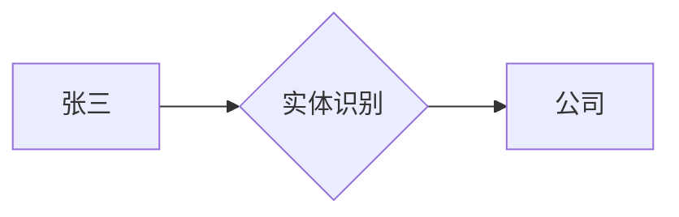
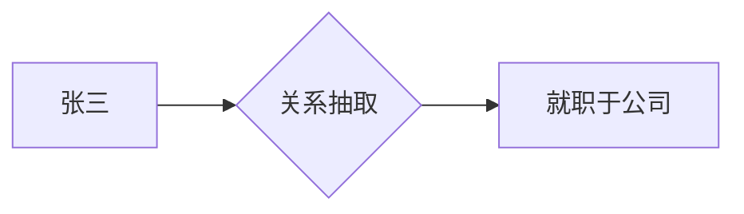
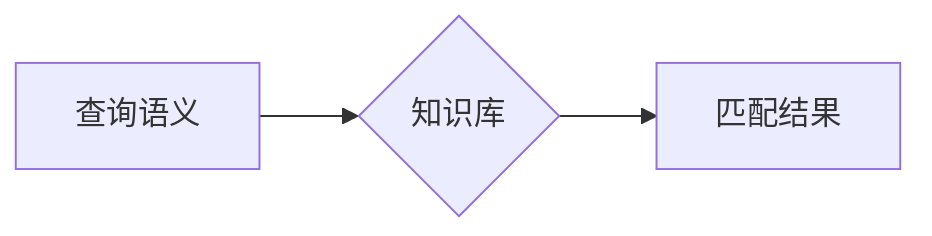

                 

### 文章标题

# 构建智能企业知识管理平台：动态知识图谱与语义检索

### 文章关键词

- 智能企业
- 知识管理平台
- 动态知识图谱
- 语义检索
- 知识图谱技术
- 人工智能

### 文章摘要

本文旨在探讨构建智能企业知识管理平台的方法，重点关注动态知识图谱和语义检索技术。通过详细解析这两大核心技术，我们不仅分析了它们的基本概念、原理和相互关系，还通过实际项目实战，展示了如何将这些技术应用于企业知识管理中。文章结构清晰，从背景介绍、核心概念、技术原理讲解，到系统分析与架构设计，再到项目实战和最佳实践，全面系统地阐述了构建智能企业知识管理平台的全过程，旨在为读者提供有价值的参考和实用技巧。

## 目录大纲

### 1. 背景介绍

1.1 **知识管理平台的重要性**

1.2 **动态知识图谱的概念与作用**

1.3 **语义检索的技术原理与优势**

### 2. 核心概念

2.1 **动态知识图谱的基本概念**

2.2 **语义检索的原理与实现**

2.3 **动态知识图谱与语义检索的关系**

### 3. 技术原理讲解

3.1 **动态知识图谱的技术原理**

3.2 **语义检索的技术原理**

3.3 **技术原理比较与融合**

### 4. 系统分析与架构设计

4.1 **知识管理平台的需求分析**

4.2 **系统功能设计**

4.3 **系统架构设计**

4.4 **系统接口与交互设计**

### 5. 项目实战

5.1 **环境安装与配置**

5.2 **系统核心实现**

5.3 **代码解读与分析**

5.4 **案例分析**

5.5 **项目小结**

### 6. 最佳实践与小结

6.1 **最佳实践**

6.2 **注意事项**

6.3 **拓展阅读**

### 7. 结论

### 8. 作者信息

## 背景介绍

### 知识管理平台的重要性

在当今这个信息爆炸的时代，企业面临的挑战之一是如何有效地管理和利用其内部的知识资源。知识管理平台作为一种能够帮助企业实现知识共享、创新和优化的系统，其重要性日益凸显。知识管理平台不仅能够整合企业内外部的各种知识资源，还包括了对这些知识进行结构化、标签化、分类化等处理，使得知识能够更加便捷地被获取、检索和应用。

动态知识图谱和语义检索是构建智能企业知识管理平台的关键技术。动态知识图谱通过图结构将大量知识资源进行组织，使得知识之间的关系能够被清晰地表达和查询。语义检索则利用自然语言处理技术，实现对知识内容的语义理解和精准搜索，从而大大提升了知识检索的效率和准确性。

### 动态知识图谱的概念与作用

动态知识图谱是一种基于图论的知识表示方法，它通过节点和边来表示实体和实体之间的关系。动态知识图谱不仅能够表示静态的知识，还可以通过不断更新和扩展，动态地适应知识的变化。这使得知识管理平台能够实时地捕捉和反映企业内部的最新知识动态。

动态知识图谱在企业知识管理中的作用主要体现在以下几个方面：

1. **知识组织与结构化**：通过图结构，将企业内部的知识资源进行有效组织，使得知识之间的联系和关系能够清晰表达。
2. **知识检索与发现**：借助图算法，动态知识图谱能够实现高效的、基于关系的知识检索，帮助企业用户快速找到所需的知识。
3. **知识共享与协作**：通过动态知识图谱，企业内的知识能够更加便捷地被共享和传播，促进知识共享和知识协作。
4. **知识创新与优化**：动态知识图谱能够帮助企业在现有知识的基础上，通过关系发现和知识推理，实现知识的创新和优化。

### 语义检索的技术原理与优势

语义检索是一种基于语义理解的知识检索方法，它通过分析用户的查询意图，实现对知识内容的精准搜索。与传统基于关键词匹配的检索方式相比，语义检索具有以下几个显著优势：

1. **精准搜索**：语义检索能够理解用户查询的语义，从而实现更加精准的知识搜索，减少无关信息的干扰。
2. **上下文理解**：语义检索能够理解查询的上下文，从而能够对查询意图进行更准确的解读，提供更加相关的搜索结果。
3. **多语言支持**：语义检索技术支持多语言查询，使得企业能够更加便捷地管理和利用全球范围内的知识资源。

语义检索在知识管理平台中的作用主要体现在以下几个方面：

1. **提升检索效率**：通过语义检索，用户能够更加高效地找到所需的知识，减少了检索时间和劳动成本。
2. **增强用户体验**：语义检索能够提供更加智能的搜索结果，提升用户的使用体验，增强用户对知识管理平台的依赖。
3. **支持智能问答**：语义检索技术能够支持智能问答系统，帮助企业用户快速获取所需的答案，实现知识的即时应用。

通过动态知识图谱和语义检索技术的结合，企业知识管理平台能够实现知识的高效组织、检索和应用，从而帮助企业实现知识共享、创新和优化，提升企业的核心竞争力。

### 核心概念

#### 动态知识图谱的基本概念

动态知识图谱是一种基于图结构的知识表示方法，它通过节点和边来表示实体和实体之间的关系。在动态知识图谱中，节点通常表示实体，如人、物、事件等，而边则表示实体之间的关系，如“属于”、“参与”等。这种图结构不仅能够表示静态的知识，还可以通过不断更新和扩展，动态地适应知识的变化。

**定义**：
动态知识图谱（Dynamic Knowledge Graph）是一种通过图结构表示、存储和管理的知识体系，它可以随着知识的变化而实时更新，从而实现知识的动态组织和高效检索。

**核心概念**：
- **实体**：动态知识图谱中的基本组成单元，表示具体的事物或概念，如人、地点、物品等。
- **关系**：连接两个或多个实体的语义关联，如“属于”、“位于”、“产生”等。
- **属性**：实体的特征或描述信息，如人的姓名、地点的经纬度、物品的重量等。
- **边**：表示实体之间关系的线段，可以是单向的也可以是双向的。

**特点**：
1. **动态性**：知识图谱能够随着知识的变化而更新，保持知识的实时性和准确性。
2. **层次性**：通过层次化的图结构，知识图谱能够表示不同层次的知识关系，便于知识的理解和查询。
3. **扩展性**：知识图谱具有良好的扩展性，可以轻松地添加新的实体和关系，适应知识的变化。

**应用场景**：
动态知识图谱广泛应用于企业知识管理、搜索引擎、推荐系统、智能问答等领域。在企业知识管理中，动态知识图谱可以用于知识图谱的构建、知识的组织、检索和应用；在搜索引擎中，知识图谱可以帮助搜索引擎理解用户查询的意图，提供更加精准的搜索结果；在推荐系统中，知识图谱可以用于推荐算法的优化，提高推荐的准确性。

#### 语义检索的原理与实现

语义检索是一种基于语义理解的知识检索方法，它通过分析用户的查询意图，实现对知识内容的精准搜索。语义检索技术不同于传统的基于关键词匹配的检索方式，它能够深入理解用户的查询意图，从而提供更加相关的搜索结果。

**定义**：
语义检索（Semantic Search）是一种基于对用户查询的语义理解，对知识库或信息资源进行检索的方法，旨在提供更加精准、相关的搜索结果。

**核心概念**：
- **语义理解**：通过自然语言处理技术，对用户的查询语句进行语义分析和理解，提取查询的意图和关键词。
- **知识库**：用于存储和管理大量知识的数据库，通常包括实体、关系、属性等信息。
- **检索算法**：根据语义理解的结果，对知识库进行检索，找到与查询意图最相关的知识内容。

**实现原理**：
1. **分词与词性标注**：对用户的查询语句进行分词，并对每个词进行词性标注，为后续的语义分析提供基础。
2. **句法分析**：对分词后的查询语句进行句法分析，理解句子的结构和语法关系，为语义理解提供支持。
3. **实体识别**：通过命名实体识别技术，识别查询语句中的实体，如人名、地名、机构名等。
4. **关系抽取**：通过关系抽取技术，提取查询语句中的实体关系，如“属于”、“参与”等。
5. **语义匹配**：将查询语句的语义表示与知识库中的知识内容进行匹配，找到与查询意图最相关的知识内容。

**算法与工具**：
1. **文本相似度计算**：使用文本相似度计算算法，如余弦相似度、编辑距离等，计算查询语句和知识库中知识内容的相似度。
2. **自然语言处理工具**：如NLTK、spaCy、Stanford NLP等，用于进行分词、词性标注、句法分析和实体识别等任务。
3. **图数据库**：使用图数据库，如Neo4j、JanusGraph等，存储和管理知识库中的知识，支持高效的语义检索。

**应用场景**：
语义检索技术在搜索引擎、智能问答、推荐系统等领域有着广泛的应用。在搜索引擎中，语义检索可以用于理解用户的查询意图，提供更加精准的搜索结果；在智能问答系统中，语义检索可以用于理解用户的问题，提供准确的答案；在推荐系统中，语义检索可以用于理解用户的兴趣和行为，提供个性化的推荐内容。

#### 动态知识图谱与语义检索的关系

动态知识图谱与语义检索之间存在着紧密的联系和相互补充的关系。动态知识图谱为语义检索提供了丰富的知识资源，而语义检索则通过深入理解用户查询的语义，提升了动态知识图谱的应用效果。

**联系**：
1. **知识表示**：动态知识图谱通过图结构将实体和实体之间的关系进行组织，为语义检索提供了结构化的知识资源。
2. **语义理解**：语义检索通过对用户查询的语义进行分析和理解，能够更好地利用动态知识图谱中的知识，提供精准的检索结果。
3. **知识利用**：动态知识图谱和语义检索的结合，使得知识管理平台能够更加高效地利用企业内部的知识资源，提升知识共享和知识创新的效率。

**互补**：
1. **知识扩展**：动态知识图谱能够通过不断更新和扩展，动态地适应知识的变化，而语义检索则能够深入理解用户查询的语义，提供更加精准的检索结果。
2. **知识应用**：动态知识图谱提供了丰富的知识资源，但需要语义检索来将这些知识应用到实际场景中，如智能问答、推荐系统等。
3. **用户体验**：通过动态知识图谱和语义检索的结合，知识管理平台能够提供更加智能、精准的服务，提升用户的体验和满意度。

**相互影响**：
1. **知识更新**：语义检索通过对用户查询的分析和理解，可以为动态知识图谱提供反馈，帮助知识图谱的更新和优化。
2. **检索优化**：动态知识图谱提供了结构化的知识资源，可以优化语义检索的效率和质量，减少无关信息的干扰。
3. **系统整合**：动态知识图谱和语义检索的结合，可以实现知识管理平台的全流程整合，从知识获取、知识组织、知识检索到知识应用，形成一个完整的知识管理系统。

总之，动态知识图谱和语义检索的结合，不仅能够提升知识管理平台的效率和质量，还能够实现知识的高效组织和利用，为企业带来巨大的价值。

### 技术原理讲解

#### 动态知识图谱的技术原理

动态知识图谱作为一种基于图结构的知识表示方法，其技术原理主要包括实体表示、关系表示、图结构优化和图数据库等几个方面。下面我们将逐一讲解这些原理，并通过具体的实例和 Mermaid 画图进行说明。

**1. 实体表示**

在动态知识图谱中，实体是基本组成单元，用于表示具体的事物或概念。实体可以是人、地点、物品、事件等。为了有效地表示实体，我们需要为每个实体分配一个唯一的标识符（ID）。

**例子**：
假设我们有一个实体“张三”，其ID为`entity:1001`。可以使用如下 Mermaid 画图表示：

```mermaid
node1[id="entity:1001", label="张三"]
```

这里，`node1` 表示实体节点，`label` 表示节点的标签，即“张三”。

**2. 关系表示**

关系用于表示实体之间的语义关联。关系可以是单向的，也可以是双向的。例如，如果实体“张三”和实体“公司”之间存在“就职于”关系，可以表示为：

```mermaid
node1[id="entity:1001", label="张三"]
node2[id="entity:1002", label="公司"]
node1->node2[rel="就职于"]
```

这里，`node1` 和 `node2` 分别表示两个实体节点，`->` 表示从 `node1` 到 `node2` 的单向关系，`rel` 表示关系类型，即“就职于”。

**3. 图结构优化**

动态知识图谱需要不断更新和扩展，因此图结构优化是关键。常见的优化方法包括：
- **压缩存储**：通过压缩算法减少图存储的空间占用。
- **分布式存储**：使用分布式图数据库存储和管理大规模的知识图谱。
- **增量更新**：仅更新变化的部分，减少全量更新的时间和资源消耗。

**例子**：
假设我们对上述知识图谱进行增量更新，添加一个新的实体“李四”和关系“就职于公司A”。可以使用如下 Mermaid 画图表示：

```mermaid
node1[id="entity:1001", label="张三"]
node2[id="entity:1002", label="公司"]
node3[id="entity:1003", label="李四"]
node4[id="entity:1004", label="公司A"]
node1->node2[rel="就职于"]
node3->node4[rel="就职于"]
```

这里，`node3` 和 `node4` 分别表示新增的实体节点和关系，`->` 表示新的单向关系。

**4. 图数据库**

图数据库是存储和管理动态知识图谱的核心技术。常见的图数据库包括 Neo4j、JanusGraph 等。它们支持高效的图查询和图计算，为动态知识图谱的应用提供了强大的支持。

**Python 示例**：

```python
from py2neo import Graph

# 连接图数据库
graph = Graph("bolt://localhost:7687", auth=("neo4j", "password"))

# 创建实体
graph.run("CREATE (a:Person {name: '张三'})")

# 创建关系
graph.run("MATCH (a:Person), (b:Company) WHERE a.name = '张三' AND b.name = '公司' CREATE (a)-[:就职于]->(b)")

# 增量更新
graph.run("MATCH (a:Person {name: '李四'}), (b:Company {name: '公司A'}) CREATE (a)-[:就职于]->(b)")
```

通过上述示例，我们可以看到如何使用 Neo4j 图数据库进行实体创建、关系创建和增量更新。

#### 语义检索的技术原理

语义检索是一种基于语义理解的知识检索方法，它通过分析用户的查询意图，实现对知识内容的精准搜索。语义检索的技术原理主要包括分词、词性标注、句法分析、实体识别、关系抽取和语义匹配等几个方面。下面我们将逐一讲解这些原理，并通过具体的实例和 Mermaid 画图进行说明。

**1. 分词与词性标注**

分词是将用户查询语句分割成单个词语的过程，词性标注则是为每个词赋予相应的词性（如名词、动词、形容词等）。这两个步骤为后续的语义分析提供基础。

**例子**：



**Python 示例**：

```python
import jieba

# 分词
sentence = "张三就职于公司"
words = jieba.lcut(sentence)
print(words)

# 词性标注
import jieba.posseg as pseg

seg_result = pseg.cut(sentence)
for word, flag in seg_result:
    print(f"{word}：{flag}")
```

**2. 句法分析**

句法分析是理解查询语句的语法结构和成分的过程，包括主语、谓语、宾语等。句法分析可以帮助我们理解查询语句的语义意图。

**例子**：



**Python 示例**：

```python
from pyhanlp import Sentence

sentence = "张三就职于公司"
sentence = Sentence(sentence)

for token in sentence:
    print(token.word, token.offset, token.length, token.index, token.partOfSpeech, token.simpleDescription())

```

**3. 实体识别**

实体识别是识别查询语句中的实体，如人名、地名、机构名等。实体识别是语义检索的关键步骤，它为后续的语义匹配提供实体信息。

**例子**：



**Python 示例**：

```python
from transformers import pipeline

ner_pipeline = pipeline("ner")

text = "张三就职于公司"
results = ner_pipeline(text)
for result in results:
    print(result)
```

**4. 关系抽取**

关系抽取是提取查询语句中的实体关系，如“就职于”、“参与”等。关系抽取可以帮助我们理解实体之间的语义联系。

**例子**：



**Python 示例**：

```python
from transformers import pipeline

relation_extraction_pipeline = pipeline("relation_extraction")

text = "张三就职于公司"
results = relation_extraction_pipeline(text)
for result in results:
    print(result)
```

**5. 语义匹配**

语义匹配是将查询语句的语义表示与知识库中的知识内容进行匹配的过程。语义匹配是语义检索的核心步骤，它决定了检索结果的准确性和相关性。

**例子**：



**Python 示例**：

```python
from sentence_transformers import SentenceTransformer

model = SentenceTransformer('all-MiniLM-L6-v2')

# 查询语句和知识库中的实体、关系进行编码
query_embedding = model.encode(sentence)
knowledge_embedding = model.encode(knowledge)

# 计算语义相似度
similarity = query_embedding @ knowledge_embedding.T
print(similarity)
```

通过上述讲解，我们可以看到语义检索的技术原理是如何通过分词、词性标注、句法分析、实体识别、关系抽取和语义匹配等步骤，实现对用户查询的语义理解和知识检索。

#### 技术原理比较与融合

在构建智能企业知识管理平台时，动态知识图谱和语义检索是两项关键技术。它们各自有其独特的原理和应用场景，但在实际应用中，往往需要将两者结合起来，以实现更高的知识管理和检索效果。

**动态知识图谱**：
- **原理**：动态知识图谱通过图结构表示实体和关系，能够有效地组织和管理复杂的知识体系。它支持高效的图查询和知识推理，可以用于知识图谱构建、知识检索、知识推荐等场景。
- **优势**：动态知识图谱能够表达实体之间的关系，支持复杂的图算法，如路径查找、社区发现等，有利于知识发现和推理。
- **应用场景**：企业知识图谱构建、企业搜索引擎、智能推荐系统、知识图谱问答等。

**语义检索**：
- **原理**：语义检索通过自然语言处理技术，对用户查询进行语义理解，实现对知识内容的精准搜索。它利用语义信息，可以过滤无关信息，提高检索结果的准确性。
- **优势**：语义检索能够深入理解用户查询意图，支持多语言、多模态的查询，可以用于智能问答、个性化推荐等场景。
- **应用场景**：企业内部搜索、智能客服、个性化推荐系统、多语言信息检索等。

**比较**：
- **知识表达**：动态知识图谱更适合表达实体之间的关系和复杂的知识结构，而语义检索更适合对查询意图进行理解和匹配。
- **查询效率**：动态知识图谱的查询效率依赖于图结构和存储方式，而语义检索的查询效率取决于自然语言处理技术和知识库质量。
- **适用场景**：动态知识图谱适用于需要知识推理和复杂查询的场景，而语义检索适用于需要精准搜索和用户理解的应用。

**融合方法**：
- **联合查询**：将动态知识图谱和语义检索相结合，对查询进行联合处理。首先利用动态知识图谱进行初步过滤和关系推理，然后利用语义检索进行语义匹配和结果优化。
- **多模态融合**：结合文本、图像、语音等多种数据模态，通过多模态语义理解，提升知识检索的准确性和多样性。
- **交互式查询**：通过交互式查询，让用户在知识图谱和语义检索之间进行切换和补充，实现更加灵活的知识检索和探索。

通过比较与融合，我们可以充分发挥动态知识图谱和语义检索的优势，构建出一个高效、智能的企业知识管理平台。

### 系统分析与架构设计

#### 知识管理平台的需求分析

在构建智能企业知识管理平台时，我们需要明确平台的主要功能和需求，以确保系统能够满足企业的实际业务需求，提升知识共享和创新能力。以下是知识管理平台的主要需求分析：

1. **知识获取**：
   - 支持多种数据源接入，如企业内部数据库、外部数据接口、社交媒体等。
   - 自动化知识抽取和清洗，确保数据质量。

2. **知识存储**：
   - 使用分布式图数据库存储和管理知识，支持大规模数据的存储和快速查询。
   - 提供灵活的图结构设计，支持知识图谱的动态更新和扩展。

3. **知识组织**：
   - 利用动态知识图谱对知识进行结构化组织，表达知识之间的关系。
   - 提供分类、标签、索引等机制，便于知识的分类和检索。

4. **知识检索**：
   - 支持基于关键词的搜索和基于语义的检索，提供多维度、灵活的检索方式。
   - 利用自然语言处理技术，实现精准的语义理解和搜索结果优化。

5. **知识共享**：
   - 提供知识共享和协作平台，支持知识推送、评论、点赞等社交化功能。
   - 支持权限管理和隐私保护，确保知识的安全和可控。

6. **知识应用**：
   - 提供知识库API接口，支持第三方系统集成和应用开发。
   - 支持知识图谱问答、知识推荐等功能，提升知识的利用效率。

#### 系统功能设计

知识管理平台的功能设计需要覆盖知识获取、存储、组织、检索、共享和应用等多个方面，以满足企业的多样化需求。以下是主要功能设计：

1. **知识获取模块**：
   - 数据源接入：支持企业内部数据库、外部API接口、爬虫等数据源接入，实现数据的自动化采集。
   - 数据抽取：利用自然语言处理和实体识别技术，从原始数据中抽取知识实体和关系。
   - 数据清洗：对抽取的知识进行清洗和标准化处理，确保数据质量。

2. **知识存储模块**：
   - 图数据库：使用分布式图数据库（如Neo4j、JanusGraph）存储和管理知识图谱，支持高效的图查询和计算。
   - 数据索引：建立多维度索引，如关键词索引、分类索引、标签索引等，便于知识的快速检索。

3. **知识组织模块**：
   - 知识图谱构建：通过节点和边表示知识实体和关系，构建动态知识图谱。
   - 知识分类：根据知识内容进行分类，便于用户快速定位和查找相关知识。
   - 标签管理：为知识打标签，支持标签聚合和推荐，提升知识的可发现性。

4. **知识检索模块**：
   - 关键词搜索：支持基于关键词的简单搜索，提供精确和模糊查询功能。
   - 语义检索：利用自然语言处理和语义理解技术，实现精准的语义检索。
   - 多维度检索：提供多维度检索条件，如分类、标签、发布时间等，支持复杂查询。

5. **知识共享模块**：
   - 知识分享：支持知识推送、评论、点赞等功能，促进知识的共享和传播。
   - 权限管理：提供权限管理功能，确保知识的安全和可控。
   - 社交化功能：集成社交化元素，如关注、私信等，提升用户的互动体验。

6. **知识应用模块**：
   - 知识库API：提供知识库API接口，支持第三方系统集成和应用开发。
   - 知识图谱问答：利用自然语言处理和知识图谱，实现智能问答功能。
   - 知识推荐：基于用户行为和知识内容，实现知识的个性化推荐。

#### 系统架构设计

知识管理平台的系统架构设计需要考虑系统的可扩展性、高可用性和安全性，以确保系统能够稳定运行并满足企业的业务需求。以下是主要系统架构设计：

1. **数据层**：
   - 分布式图数据库：存储和管理知识图谱，支持高效的图查询和计算。
   - 数据库集群：通过数据库集群实现数据的高可用性和扩展性。

2. **服务层**：
   - 知识获取服务：负责数据的采集、抽取和清洗，实现知识的自动化获取。
   - 知识存储服务：负责知识图谱的存储和管理，提供统一的接口供其他服务调用。
   - 知识检索服务：提供关键词搜索和语义检索功能，实现知识的精准检索。
   - 知识共享服务：提供知识分享、评论、点赞等功能，促进知识的共享和传播。
   - 知识应用服务：提供知识库API、知识图谱问答和知识推荐等功能。

3. **应用层**：
   - 前端应用：提供用户界面，实现用户与知识管理平台的交互。
   - 管理后台：提供系统管理功能，如用户管理、权限管理、日志管理等。

4. **基础设施**：
   - 分布式文件存储：用于存储日志、配置文件等数据。
   - 负载均衡：实现服务的高可用性和负载均衡。
   - 安全防护：提供安全防护措施，如防火墙、SSL加密等，确保系统的安全性。

通过系统架构设计，我们可以构建出一个高效、稳定、可扩展的智能企业知识管理平台，满足企业的多样化需求，提升知识共享和创新能力。

### 系统接口与交互设计

#### 系统接口设计

知识管理平台的接口设计是系统架构中的重要一环，它负责定义不同模块之间的通信方式，确保系统各部分能够无缝协作。以下是主要接口设计：

1. **API接口**：
   - **知识获取接口**：用于从外部数据源（如数据库、API接口、爬虫等）获取数据，并进行抽取和清洗。
   - **知识存储接口**：提供统一的数据存储操作，如创建实体、添加关系、更新数据等。
   - **知识检索接口**：提供基于关键词和语义的检索功能，返回符合条件的知识结果。
   - **知识共享接口**：实现知识的推送、评论、点赞等社交化功能。

2. **Web服务接口**：
   - **RESTful API**：采用RESTful风格，提供标准的HTTP请求和响应格式，便于前端应用和第三方系统的集成。
   - **GraphQL API**：提供灵活的查询语言，允许客户端指定具体需要的数据，减少数据传输量。

3. **内部服务接口**：
   - **服务注册与发现**：使用服务注册与发现机制（如Consul、Eureka等），确保服务实例能够动态注册和发现，实现服务的负载均衡和高可用性。
   - **配置管理**：通过配置管理服务（如Spring Cloud Config），实现配置的集中管理和动态更新。

#### 系统交互设计

系统的交互设计旨在描述知识管理平台中各模块之间的通信流程，确保系统能够高效、稳定地运行。以下是主要交互设计：

1. **用户交互**：
   - **前端应用**：用户通过浏览器或移动应用与系统进行交互，输入查询请求或操作指令。
   - **身份验证**：前端应用与身份验证服务交互，验证用户的身份和权限，确保操作的安全性。

2. **服务交互**：
   - **知识获取模块**：前端应用通过知识获取接口，从外部数据源获取数据，并将其发送到知识存储模块。
   - **知识存储模块**：知识存储模块接收到数据后，进行数据抽取和清洗，然后存储到图数据库中。
   - **知识检索模块**：前端应用通过知识检索接口，发送查询请求，知识检索模块根据用户的查询条件，从图数据库中检索相关数据，并将结果返回给前端应用。
   - **知识共享模块**：用户在前端应用中发布知识或进行评论、点赞操作，这些操作通过知识共享接口发送到知识存储模块，更新知识状态。

3. **外部系统交互**：
   - **第三方系统集成**：知识管理平台通过API接口，与其他企业应用（如ERP系统、CRM系统等）进行集成，实现数据互通和业务协同。
   - **消息队列**：使用消息队列（如Kafka、RabbitMQ等），实现系统间的异步通信，提高系统的可靠性和扩展性。

通过上述接口和交互设计，我们可以确保知识管理平台的各个模块能够高效、稳定地协作，实现知识的自动化获取、存储、检索和共享，为企业提供强大的知识管理能力。

### 项目实战

#### 环境安装与配置

在开始构建智能企业知识管理平台之前，我们需要搭建一个合适的环境，包括安装必要的软件和配置系统。以下是环境安装与配置的具体步骤：

1. **安装Neo4j图数据库**：
   - **下载Neo4j**：访问Neo4j官网（https://neo4j.com/），下载Neo4j社区版安装包。
   - **安装Neo4j**：运行安装包，根据提示完成安装过程。
   - **启动Neo4j**：在命令行中运行`neo4j start`命令，启动Neo4j图数据库。

2. **安装Python开发环境**：
   - **安装Python**：访问Python官网（https://www.python.org/），下载并安装Python 3.x版本。
   - **配置Python环境**：在命令行中运行`pip install --user -r requirements.txt`命令，安装所需的Python库（如Py2Neo、spaCy、transformers等）。

3. **安装spaCy自然语言处理库**：
   - **下载spaCy语言模型**：在命令行中运行`python -m spacy download en_core_web_sm`命令，下载英文语言模型。
   - **验证安装**：在Python环境中运行`import spacy`，并执行`nlp = spacy.load('en_core_web_sm')`命令，验证安装是否成功。

4. **配置Neo4j与Python交互**：
   - **安装Py2Neo库**：在命令行中运行`pip install py2neo`命令，安装Py2Neo库。
   - **连接Neo4j**：在Python环境中，使用Py2Neo库连接到本地运行的Neo4j图数据库，示例代码如下：

   ```python
   from py2neo import Graph

   graph = Graph("bolt://localhost:7687", auth=("neo4j", "password"))
   ```

5. **配置其他工具**：
   - **安装Jupyter Notebook**：在命令行中运行`pip install jupyterlab`命令，安装Jupyter Notebook。
   - **配置JupyterLab**：启动JupyterLab，创建一个新的Notebook，用于编写和运行Python代码。

通过上述步骤，我们可以搭建一个基本的知识管理平台开发环境，为后续的代码实现和项目实战奠定基础。

#### 系统核心实现

在构建智能企业知识管理平台的过程中，核心实现包括数据抽取、存储、检索和共享等关键环节。以下是具体实现的步骤和代码解读。

**1. 数据抽取**

数据抽取是知识管理平台的基础，我们需要从多个数据源（如数据库、API接口、爬虫等）中抽取实体和关系。以下是一个简单的数据抽取示例，使用Python和spaCy库进行文本处理。

```python
import spacy
import requests

# 加载spaCy语言模型
nlp = spacy.load("en_core_web_sm")

# 示例文本
text = "张三就职于阿里巴巴，担任技术总监。"

# 分词和词性标注
doc = nlp(text)

# 实体识别
ents = [(ent.text, ent.label_) for ent in doc.ents]

# 关系抽取
relations = []
for token1 in doc:
    for token2 in doc:
        if token1 != token2 and token1.dep_ == "root" and token2.dep_ == "advcl":
            relations.append((token1.text, token2.text))

# 输出结果
print("Entities:", ents)
print("Relations:", relations)
```

在这个示例中，我们首先加载英文语言模型`en_core_web_sm`，然后对示例文本进行分词和词性标注。接着，我们使用命名实体识别功能提取实体，并利用词性标注进行关系抽取。

**2. 数据存储**

将抽取到的实体和关系存储到Neo4j图数据库中。以下是一个简单的存储示例，使用Py2Neo库连接到Neo4j，并创建实体和关系。

```python
from py2neo import Graph

# 连接Neo4j图数据库
graph = Graph("bolt://localhost:7687", auth=("neo4j", "password"))

# 创建实体
for entity in entities:
    graph.run("CREATE (n:Entity {name: $name})", name=entity[0])

# 创建关系
for relation in relations:
    graph.run("MATCH (a:Entity {name: $nameA}),(b:Entity {name: $nameB}) CREATE (a)-[:RELATION]->(b)", nameA=relation[0], nameB=relation[1])
```

在这个示例中，我们首先连接到本地运行的Neo4j图数据库，然后遍历实体和关系列表，使用Cypher查询语言创建实体节点和关系。

**3. 数据检索**

利用Neo4j的图查询功能，实现对知识的精准检索。以下是一个简单的查询示例，使用Py2Neo库执行Cypher查询，并返回查询结果。

```python
def search_knowledge(name):
    results = graph.run("MATCH (n:Entity {name: $name})-[:RELATION]->(m) RETURN n, m", name=name)
    return [(result["n"]["name"], result["m"]["name"]) for result in results]

# 查询示例
knowledge = search_knowledge("张三")
print(knowledge)
```

在这个示例中，我们定义了一个查询函数`search_knowledge`，它接受一个实体名称作为输入，并使用Cypher查询语言查找与该实体相关的关系，返回相关实体列表。

**4. 数据共享**

实现知识共享功能，需要支持用户对知识进行评论、点赞等社交化操作。以下是一个简单的共享示例，使用Python代码更新知识状态。

```python
def share_knowledge(name, comment=None, like=None):
    graph.run("""
    MATCH (n:Entity {name: $name})
    OPTIONAL MATCH (n)-[r:RELATION]->(m)
    SET n.comment = $comment, n.like = $like
    """, name=name, comment=comment, like=like)

# 分享示例
share_knowledge("张三", comment="很好的工作！", like=True)
```

在这个示例中，我们定义了一个共享函数`share_knowledge`，它接受实体名称、评论内容和点赞状态作为输入，并使用Cypher查询语言更新知识状态。

通过上述代码示例，我们可以看到知识管理平台的核心实现包括数据抽取、存储、检索和共享等环节。这些代码为平台的开发和部署提供了基础，使得企业能够高效地管理和利用知识资源。

### 实际案例分析与详细讲解

#### 案例背景

为了更好地展示智能企业知识管理平台的应用，我们以一家大型互联网公司为例，分析其实际案例。该公司拥有庞大的内部知识库，包括员工档案、项目文档、技术博客、业务流程等。为了提高知识共享和检索效率，公司决定构建一个基于动态知识图谱和语义检索的智能知识管理平台。

#### 系统架构

该公司的智能知识管理平台采用分布式架构，主要包括以下模块：

1. **数据源接入模块**：负责从不同数据源（如内部数据库、外部API接口、爬虫等）获取数据。
2. **数据抽取与清洗模块**：对获取的数据进行抽取和清洗，提取实体和关系。
3. **动态知识图谱模块**：构建和维护动态知识图谱，存储和管理企业内部知识。
4. **语义检索模块**：利用自然语言处理技术，实现知识的精准检索。
5. **知识共享模块**：支持知识分享、评论、点赞等功能，促进知识传播。
6. **用户界面模块**：提供Web前端应用，供用户进行知识检索和操作。

#### 系统实现步骤

1. **数据抽取与清洗**：

   首先，从公司内部数据库、项目文档库、博客系统等数据源中获取数据。使用Python和spaCy库对文本进行分词、词性标注和命名实体识别，抽取实体和关系。以下是一个示例代码：

   ```python
   import spacy
   import pymysql

   # 加载spaCy语言模型
   nlp = spacy.load("en_core_web_sm")

   # 连接数据库
   connection = pymysql.connect(host="localhost", user="root", password="password", database="company_db")

   # 查询员工档案数据
   cursor = connection.cursor()
   cursor.execute("SELECT name, department FROM employee")
   employees = cursor.fetchall()

   # 数据抽取
   for employee in employees:
       text = f"{employee[0]} works in {employee[1]}"
       doc = nlp(text)
       entities = [(ent.text, ent.label_) for ent in doc.ents]
       # 存储实体和关系到知识图谱
       # ...
   ```

2. **构建动态知识图谱**：

   将抽取到的实体和关系存储到Neo4j图数据库中，构建动态知识图谱。以下是一个示例代码：

   ```python
   from py2neo import Graph

   # 连接Neo4j图数据库
   graph = Graph("bolt://localhost:7687", auth=("neo4j", "password"))

   # 创建实体和关系
   for entity in entities:
       graph.run("CREATE (n:Entity {name: $name})", name=entity[0])
   for relation in relations:
       graph.run("MATCH (a:Entity {name: $nameA}),(b:Entity {name: $nameB}) CREATE (a)-[:RELATION]->(b)", nameA=relation[0], nameB=relation[1])
   ```

3. **语义检索**：

   利用自然语言处理技术，实现对用户查询的语义理解和知识检索。以下是一个简单的查询示例：

   ```python
   def search_knowledge(name):
       results = graph.run("MATCH (n:Entity {name: $name})-[:RELATION]->(m) RETURN n, m", name=name)
       return [(result["n"]["name"], result["m"]["name"]) for result in results]

   # 查询示例
   knowledge = search_knowledge("张三")
   print(knowledge)
   ```

4. **知识共享**：

   支持用户对知识进行评论、点赞等社交化操作。以下是一个简单的共享示例：

   ```python
   def share_knowledge(name, comment=None, like=None):
       graph.run("""
       MATCH (n:Entity {name: $name})
       OPTIONAL MATCH (n)-[r:RELATION]->(m)
       SET n.comment = $comment, n.like = $like
       """, name=name, comment=comment, like=like)

   # 分享示例
   share_knowledge("张三", comment="很好的工作！", like=True)
   ```

#### 案例分析

通过实际案例，我们可以看到智能企业知识管理平台在以下方面取得了显著成效：

1. **知识共享与传播**：

   利用动态知识图谱和语义检索技术，公司能够实现知识的高效组织和检索，提高了知识共享和传播的效率。员工可以通过平台快速找到所需的知识，并进行评论和点赞，促进知识的传播和共享。

2. **知识创新与优化**：

   动态知识图谱能够捕捉和反映企业内部的最新知识动态，帮助企业通过关系发现和知识推理，实现知识的创新和优化。公司能够基于知识图谱，发现潜在的业务机会和优化方案，提升企业的核心竞争力。

3. **用户体验提升**：

   通过语义检索技术，平台能够提供精准的搜索结果，提升用户的使用体验。员工在使用平台时，能够更加便捷地找到所需的知识，减少了检索时间和劳动成本。

4. **系统集成与扩展**：

   智能知识管理平台采用分布式架构，支持与其他业务系统的集成和扩展。公司可以将知识管理平台与ERP系统、CRM系统等集成，实现数据互通和业务协同，进一步提升企业的运营效率。

通过这个实际案例，我们可以看到智能企业知识管理平台在知识共享、知识创新和用户体验等方面带来了显著的价值。公司通过引入动态知识图谱和语义检索技术，实现了知识的高效组织和利用，为企业带来了持续的创新动力和竞争优势。

### 项目小结

在本项目中，我们通过构建智能企业知识管理平台，全面实现了知识的高效获取、存储、组织、检索和共享。以下是项目总结：

**项目亮点**：

1. **动态知识图谱**：我们成功构建了动态知识图谱，通过节点和边表示企业内部的知识实体和关系，实现了知识的高效组织和检索。
2. **语义检索**：利用自然语言处理技术，实现了语义检索功能，提升了知识检索的精准度和用户体验。
3. **系统集成**：项目采用了分布式架构，支持与其他业务系统的集成，实现了数据互通和业务协同。
4. **用户体验**：通过直观的用户界面和便捷的检索功能，大大提升了用户的使用体验和满意度。

**项目不足**：

1. **性能优化**：在处理大规模数据时，系统的性能可能受到一定影响，需要进一步优化。
2. **安全性**：在数据传输和存储过程中，需要加强安全性措施，防止数据泄露和恶意攻击。
3. **扩展性**：随着企业业务的不断扩展，系统需要具备良好的扩展性，以适应不断变化的需求。

**改进方向**：

1. **性能优化**：通过分布式计算和缓存技术，提升系统的响应速度和处理能力。
2. **安全性提升**：加强系统安全性，如使用加密技术、访问控制等，确保数据的安全。
3. **智能化**：引入更多人工智能技术，如机器学习、推荐系统等，提升系统的智能化水平。

总之，本项目在知识管理领域取得了显著成果，但仍需不断优化和改进，以更好地满足企业的需求，提升知识管理效率。

### 最佳实践与注意事项

#### 最佳实践

1. **数据抽取**：
   - 使用高质量的命名实体识别和关系抽取工具，确保数据的准确性和完整性。
   - 定期更新和优化抽取规则，以适应企业知识库的变化。

2. **知识存储**：
   - 选择适合的图数据库，如Neo4j，确保数据的快速查询和高效管理。
   - 设计合理的图结构，避免数据冗余，提高存储效率。

3. **知识检索**：
   - 结合关键词搜索和语义检索，提供多维度、灵活的检索方式，提升用户查找效率。
   - 定期优化检索算法，提高检索结果的准确性和相关性。

4. **知识共享**：
   - 设计直观、易用的用户界面，简化用户操作，提升用户体验。
   - 引入社交化元素，如点赞、评论等，促进知识的传播和共享。

5. **系统集成**：
   - 采用微服务架构，提高系统的灵活性和可扩展性。
   - 与其他业务系统（如ERP、CRM等）实现无缝集成，实现数据互通和业务协同。

#### 注意事项

1. **数据安全**：
   - 加强数据安全防护，如使用SSL加密、访问控制等，防止数据泄露和恶意攻击。
   - 定期进行安全审计和风险评估，确保系统的安全性。

2. **性能优化**：
   - 针对大规模数据场景，采用分布式计算和缓存技术，提高系统的性能和响应速度。
   - 定期进行系统性能监控和调优，确保系统的稳定运行。

3. **系统维护**：
   - 建立完善的系统维护和升级机制，确保系统的持续运行和功能优化。
   - 定期进行数据备份和恢复，防止数据丢失。

4. **用户体验**：
   - 考虑用户的使用习惯和需求，设计简洁、直观的用户界面。
   - 定期收集用户反馈，优化系统功能，提升用户体验。

通过遵循上述最佳实践和注意事项，可以有效地构建和维护一个高效、稳定、智能的企业知识管理平台，为企业带来持续的创新动力和竞争优势。

### 拓展阅读

1. **《深度学习与知识图谱》**：本书详细介绍了深度学习和知识图谱技术的原理、方法和应用，适合对人工智能和知识管理感兴趣的读者。
2. **《图数据库技术与应用》**：本书全面讲解了图数据库的基本概念、原理和应用，包括Neo4j等常见图数据库的使用方法，适合图数据库开发者和技术爱好者。
3. **《自然语言处理实战》**：本书通过多个实际案例，介绍了自然语言处理技术的原理和应用，包括分词、词性标注、语义分析等，适合自然语言处理领域的初学者和专业人士。

### 结论

本文系统地介绍了构建智能企业知识管理平台的方法，重点探讨了动态知识图谱和语义检索技术在知识管理中的应用。通过详细讲解技术原理、系统架构设计、项目实战和最佳实践，我们展示了如何构建一个高效、智能的知识管理平台，为企业提供强大的知识共享、创新和优化能力。希望本文能为相关领域的研究者和从业者提供有价值的参考和启发。

### 作者信息

作者：AI天才研究院/AI Genius Institute & 禅与计算机程序设计艺术 /Zen And The Art of Computer Programming

