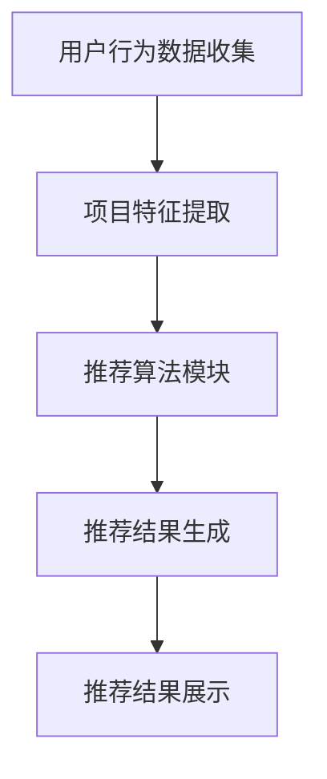
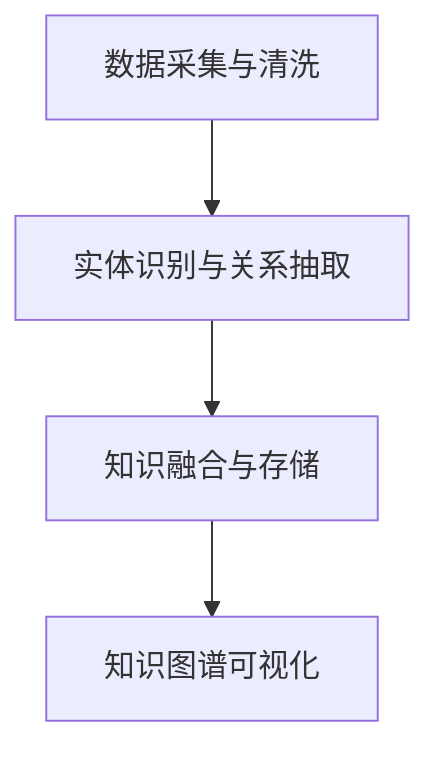
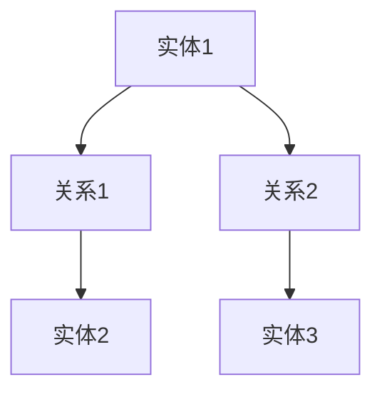
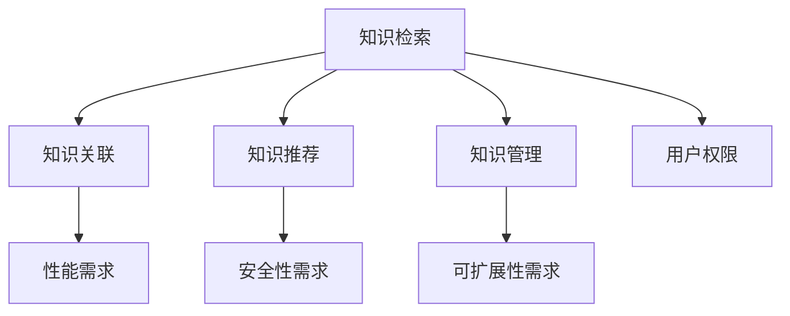
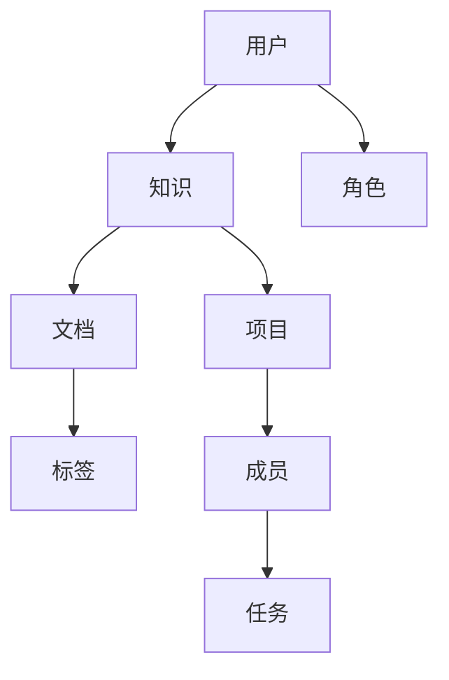
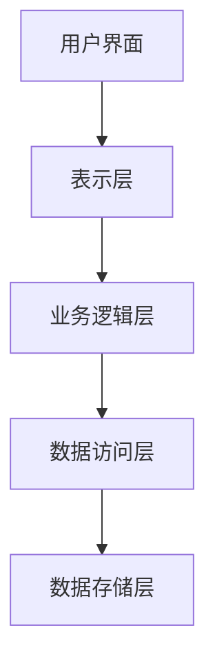
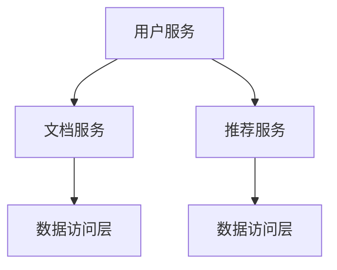

                 


### 引言

随着信息技术的飞速发展，企业知识管理已经成为现代企业提高核心竞争力、优化业务流程的关键手段。知识管理系统（Knowledge Management System, KMS）不仅帮助企业存储和分享知识，还通过智能化手段提升了知识的利用效率。本文将以《构建智能企业知识管理系统：个性化推荐与知识图谱集成》为题，深入探讨如何通过个性化推荐和知识图谱集成，构建一个高效、智能的企业知识管理系统。

首先，我们需要明确一些核心概念和术语：

- **知识管理系统**：一种用于收集、存储、组织、管理和共享知识的系统。
- **个性化推荐**：基于用户行为和偏好，为其推荐相关知识和内容的系统。
- **知识图谱**：一种将实体、属性和关系组织起来的结构化数据模型。

本文将分为以下几个部分：

1. **背景介绍**：阐述智能企业知识管理系统的意义、挑战和机遇。
2. **核心概念与联系**：详细解释个性化推荐和知识图谱的相关概念，并使用表格和ER图进行说明。
3. **算法原理讲解**：介绍个性化推荐和知识图谱构建的基本算法，使用mermaid和Python代码进行阐述。
4. **系统分析与架构设计方案**：分析系统需求、功能设计、架构设计、接口设计和交互设计。
5. **项目实战**：通过具体案例展示系统构建过程，包括环境安装、核心实现、代码应用解读和分析。
6. **最佳实践与总结**：总结实践经验，提供实施建议和拓展阅读。

### 核心关键词

- 智能企业知识管理系统
- 个性化推荐
- 知识图谱
- 算法原理
- 系统架构
- 项目实战
- 最佳实践

### 摘要

本文旨在探讨如何通过个性化推荐和知识图谱集成，构建一个智能企业知识管理系统。我们将详细介绍个性化推荐和知识图谱的基本概念、算法原理，并探讨如何将它们集成到一个完整的系统中。通过实际项目案例，我们将展示系统构建的全过程，并总结最佳实践，为读者提供实用的指导和借鉴。

### 1. 智能企业知识管理系统概述

#### 1.1 智能企业的定义

智能企业（Smart Enterprise）是指通过信息技术和智能化手段，实现企业内部业务流程的自动化、数据驱动的决策和高度协同的运营模式。智能企业不仅能够高效地处理海量数据，还能够通过机器学习、人工智能等技术，实现对业务流程的持续优化和智能决策。

#### 1.2 知识管理系统的意义

知识管理系统是智能企业的核心组成部分，它通过对企业内部知识的收集、存储、组织、管理和共享，帮助企业实现知识的持续积累和有效利用。知识管理系统的意义主要体现在以下几个方面：

1. **提高工作效率**：通过知识管理系统，员工可以快速获取所需的知识和资源，减少重复劳动，提高工作效率。
2. **促进知识共享**：知识管理系统为员工提供了一个共享知识的平台，促进了团队间的知识交流和协作。
3. **优化决策过程**：知识管理系统为企业提供了丰富的历史数据和知识库，支持数据驱动的决策，提高了决策的准确性和效率。
4. **提升创新能力**：知识管理系统鼓励员工分享创新思路和经验，激发了企业的创新活力。

#### 1.3 个性化推荐在知识管理系统中的应用

个性化推荐（Personalized Recommendation）是一种基于用户行为和偏好，为用户推荐相关知识和内容的系统。在知识管理系统中，个性化推荐的应用主要包括：

1. **内容推荐**：根据用户的历史行为和偏好，推荐相关的知识文档、教程和培训课程。
2. **专家推荐**：根据用户的业务需求和知识背景，推荐具备相关知识和经验的专家。
3. **项目推荐**：根据用户的参与项目和团队，推荐相关的项目文档、资源和技术资料。

#### 1.4 知识图谱在知识管理系统中的作用

知识图谱（Knowledge Graph）是一种将实体、属性和关系组织起来的结构化数据模型。在知识管理系统中，知识图谱的应用主要包括：

1. **知识组织**：通过知识图谱，将企业内部的知识资源进行结构化组织，实现知识的快速检索和利用。
2. **知识关联**：通过知识图谱，发现知识之间的关联和联系，促进知识的交叉应用和深度挖掘。
3. **知识推理**：通过知识图谱，实现对知识的逻辑推理和推理演绎，支持复杂业务问题的求解。

#### 1.5 知识管理系统的挑战与机遇

尽管知识管理系统在智能企业中具有重要作用，但在实际应用中仍面临着一系列挑战：

1. **数据质量**：知识管理系统需要高质量的数据作为基础，但数据的质量往往参差不齐，需要进行有效的数据清洗和预处理。
2. **知识共享**：在知识共享过程中，如何平衡个人利益和团队利益，避免知识泄露和重复劳动，是一个需要解决的问题。
3. **系统集成**：知识管理系统需要与企业内部的各个系统进行集成，实现数据的高效流通和共享，这需要解决系统兼容性和数据接口等问题。

然而，随着人工智能技术的发展，知识管理系统也面临着前所未有的机遇：

1. **智能化**：通过引入机器学习和人工智能技术，知识管理系统可以实现更智能的推荐和推理，提高知识利用效率。
2. **开放性**：随着云计算和大数据技术的发展，知识管理系统可以更加开放，实现跨平台、跨地域的数据共享和协作。
3. **个性化**：通过个性化推荐和知识图谱，知识管理系统可以更好地满足用户的需求，提供更加定制化的服务。

### 2. 个性化推荐系统原理与实现

#### 2.1 个性化推荐基本概念

个性化推荐系统是一种基于用户行为和偏好，为用户推荐相关内容和服务的系统。其基本概念包括：

- **用户**：系统的使用者，其行为和偏好将用于生成推荐。
- **项目**：用户可能感兴趣的内容或服务，如文档、视频、商品等。
- **评分**：用户对项目的评价，可以是数值、等级或二值（喜欢/不喜欢）。
- **推荐**：系统根据用户的行为和偏好，为用户推荐相关的内容或服务。

#### 2.2 个性化推荐算法

个性化推荐算法可以分为以下几类：

1. **协同过滤算法**

协同过滤（Collaborative Filtering）是一种基于用户行为数据的推荐算法，主要通过分析用户之间的相似度来推荐内容。协同过滤算法可以分为两类：

   - **基于用户的协同过滤（User-based Collaborative Filtering）**：通过计算用户之间的相似度，找到与目标用户最相似的邻居用户，然后推荐这些邻居用户喜欢的项目。

     ```mermaid
     graph TD
     A[目标用户] --> B[邻居用户1]
     A --> C[邻居用户2]
     A --> D[邻居用户3]
     B --> E[喜欢项目1]
     C --> F[喜欢项目2]
     D --> G[喜欢项目3]
     ```

   - **基于项目的协同过滤（Item-based Collaborative Filtering）**：通过计算项目之间的相似度，找到与目标项目最相似的项目，然后推荐这些项目。

     ```mermaid
     graph TD
     A[目标项目] --> B[相似项目1]
     A --> C[相似项目2]
     A --> D[相似项目3]
     B --> E[用户1喜欢]
     C --> F[用户2喜欢]
     D --> G[用户3喜欢]
     ```

2. **内容推荐算法**

内容推荐（Content-Based Recommendation）是一种基于项目内容和用户偏好进行推荐的算法。它通过分析项目的特征和用户的兴趣，找到相似的项目进行推荐。

   ```python
   def content_based_recommendation(user_preferences, item_features):
       similar_items = []
       for item in item_features:
           similarity = cosine_similarity(user_preferences, item)
           if similarity > threshold:
               similar_items.append(item)
       return similar_items
   ```

3. **混合推荐算法**

混合推荐（Hybrid Recommendation）是一种将协同过滤和内容推荐结合起来的算法。它通过综合考虑用户行为和项目内容，提高推荐的准确性和多样性。

   ```python
   def hybrid_recommendation(user behavior, item_content):
       collaborative_recs = collaborative_filtering(user_behavior)
       content_recs = content_based_recommendation(user_behavior, item_content)
       return collaborative_recs + content_recs
   ```

#### 2.3 个性化推荐系统架构设计

个性化推荐系统通常包括以下几个关键组件：

1. **用户行为数据收集**：收集用户在系统中的行为数据，如浏览、点击、评分等。
2. **项目特征提取**：提取项目的特征，如标题、标签、内容等。
3. **推荐算法模块**：实现协同过滤、内容推荐和混合推荐等算法。
4. **推荐结果生成**：根据用户行为和项目特征，生成推荐结果。
5. **推荐结果展示**：将推荐结果展示给用户。



#### 2.4 个性化推荐系统案例分析

假设我们有一个在线教育平台，用户可以浏览课程、参加课程并给出评分。我们可以通过以下步骤来构建个性化推荐系统：

1. **数据收集**：收集用户在平台上的行为数据，如浏览记录、学习进度、评分等。
2. **特征提取**：提取课程的特征，如课程标题、标签、时长、难度等。
3. **算法选择**：选择基于用户的协同过滤算法和内容推荐算法。
4. **推荐生成**：根据用户行为和课程特征，生成推荐结果。
5. **推荐展示**：将推荐结果展示给用户，如推荐课程、推荐老师等。

通过这个案例，我们可以看到个性化推荐系统在在线教育平台中的应用，它可以帮助用户发现感兴趣的课程，提高用户的学习体验和满意度。

### 3. 知识图谱设计与实现

#### 3.1 知识图谱基础

知识图谱（Knowledge Graph）是一种将实体、属性和关系组织起来的结构化数据模型。它通过实体之间的关联，实现对知识的组织和表示。知识图谱在知识管理系统中具有重要作用，可以帮助企业快速检索和利用知识。

知识图谱的基本概念包括：

- **实体**：知识图谱中的基本对象，如人、地点、组织、事物等。
- **属性**：实体的特征或描述，如姓名、年龄、职位等。
- **关系**：实体之间的关系，如属于、居住于、参与等。

知识图谱的表示方法通常包括：

- **图数据库**：使用图数据库（如Neo4j、Apache JanusGraph）来存储和管理知识图谱。
- **三元组**：使用三元组（Subject-Predicate-Object）来表示实体之间的关系。

#### 3.2 知识图谱构建

知识图谱的构建过程主要包括以下几个步骤：

1. **数据采集与清洗**：从企业内部和外部的数据源中采集数据，如文档、数据库、API等，并进行数据清洗和预处理，确保数据的质量和一致性。
2. **实体识别与关系抽取**：使用自然语言处理（NLP）技术，对采集到的文本数据进行分析，识别出实体和关系，并将其转换为结构化的数据格式。
3. **知识融合与存储**：将识别出的实体和关系进行融合和整合，构建知识图谱，并将其存储在图数据库中。

下面是一个简单的知识图谱构建流程：



#### 3.3 知识图谱可视化

知识图谱可视化是将知识图谱以图形化的形式展示出来，帮助用户直观地理解知识结构。常用的知识图谱可视化工具包括：

- **Gephi**：一个开源的图形分析和信息可视化工具，支持多种图形布局和可视化效果。
- **D3.js**：一个基于JavaScript的动态可视化库，可以用于创建交互式的知识图谱可视化。
- **Arista**：一个基于Web的图形数据库浏览器，支持知识图谱的查询和可视化。

下面是一个简单的知识图谱可视化示例：



#### 3.4 知识图谱应用场景

知识图谱在知识管理系统中的应用场景非常广泛，主要包括：

1. **知识检索**：通过知识图谱，用户可以快速检索到与特定实体相关的知识，提高知识获取的效率。
2. **知识关联**：通过知识图谱，可以发现实体之间的关联和联系，促进知识的交叉应用和深度挖掘。
3. **知识推理**：通过知识图谱，可以实现对知识的逻辑推理和推理演绎，支持复杂业务问题的求解。

下面是一个知识图谱应用场景的示例：

假设企业内部有一个知识库，包含员工、项目、客户等实体。通过知识图谱，可以快速检索到某个员工的参与项目、项目关联客户等信息，从而帮助管理层做出更准确的决策。

### 4. 知识管理系统整体架构设计

#### 4.1 系统需求分析

在构建知识管理系统之前，我们需要对系统需求进行详细分析。系统需求分析包括以下几个方面：

1. **功能需求**：分析系统需要实现的功能，如知识检索、知识关联、知识推荐、知识管理、用户权限等。
2. **性能需求**：分析系统需要达到的性能指标，如响应时间、并发处理能力、数据存储容量等。
3. **安全性需求**：分析系统的安全需求，如数据加密、用户身份认证、权限控制等。
4. **可扩展性需求**：分析系统需要具备的可扩展性，如支持新功能的快速集成、支持大数据量的存储和处理等。

下面是一个简单的系统需求分析示例：



#### 4.2 领域模型设计

领域模型（Domain Model）是系统需求分析的结果，它将系统的功能需求以图形化的形式表示出来。领域模型主要包括实体、属性和关系。

以下是一个简单的知识管理系统领域模型示例：



#### 4.3 系统架构设计

系统架构设计是知识管理系统实现的基础，它将系统的功能模块和组件组织起来，形成一个完整的系统。系统架构设计主要包括以下几个方面：

1. **分层架构**：将系统分为多个层次，如表示层、业务层、数据层等，实现系统的模块化和解耦。
2. **组件架构**：将系统划分为多个组件，每个组件负责特定的功能，实现系统的可扩展性和灵活性。
3. **数据架构**：设计系统的数据存储和访问方式，确保数据的安全、可靠和高效。

以下是一个简单的知识管理系统架构设计示例：



#### 4.4 系统接口设计

系统接口设计是系统架构设计的重要组成部分，它定义了系统内部各个组件之间的交互方式。系统接口设计主要包括以下几个方面：

1. **API接口**：定义系统的API接口，支持外部系统与知识管理系统的集成。
2. **数据接口**：定义系统内部数据传递和交换的接口，如RESTful API、消息队列等。
3. **服务接口**：定义系统内部服务之间的交互接口，如用户服务、文档服务、推荐服务等。

以下是一个简单的知识管理系统接口设计示例：



#### 4.5 系统交互设计

系统交互设计描述了用户与系统之间的交互流程，以及系统内部各个组件之间的交互过程。系统交互设计主要包括以下几个方面：

1. **用户交互**：设计用户与系统之间的交互流程，如用户登录、知识检索、知识推荐等。
2. **服务交互**：设计系统内部服务之间的交互流程，如用户服务与文档服务的交互、推荐服务与文档服务的交互等。
3. **数据交互**：设计系统内部数据传递和交换的流程，如数据采集、数据存储、数据查询等。

以下是一个简单的知识管理系统交互设计示例：

```mermaid
sequenceDiagram
参与者 用户
用户->>系统: 登录
系统->>用户: 登录成功
用户->>系统: 搜索知识
系统->>用户: 显示搜索结果
用户->>系统: 点赞知识
系统->>用户: 更新推荐结果
```

### 5. 构建知识管理系统的实战案例

#### 5.1 项目背景

为了提高企业内部知识共享和利用效率，某企业决定构建一个智能知识管理系统。该系统需要实现以下功能：

1. **知识检索**：用户可以快速检索到企业内部的知识资源。
2. **知识推荐**：根据用户的行为和偏好，为用户推荐相关的知识资源。
3. **知识关联**：发现知识之间的关联和联系，促进知识的交叉应用和深度挖掘。
4. **用户权限管理**：实现对用户的身份认证和权限控制，确保知识资源的安全和可控。

#### 5.2 系统设计

在系统设计阶段，我们遵循以下原则：

1. **模块化**：将系统划分为多个模块，每个模块负责特定的功能，实现系统的可扩展性和灵活性。
2. **高可用性**：确保系统的高可用性，支持海量数据的存储和处理。
3. **安全性**：实现用户权限管理和数据加密，确保知识资源的安全和可靠。
4. **易用性**：提供友好的用户界面，方便用户操作和使用。

系统设计主要包括以下模块：

1. **用户模块**：实现用户身份认证、用户权限管理和用户信息管理。
2. **知识模块**：实现知识资源的检索、推荐、关联和管理。
3. **推荐模块**：实现个性化推荐算法，根据用户的行为和偏好为用户推荐相关的知识资源。
4. **数据模块**：实现数据存储、数据查询和数据同步。

#### 5.3 核心实现

在核心实现阶段，我们采用以下技术方案：

1. **前端**：采用Vue.js框架，实现用户界面的设计和交互。
2. **后端**：采用Spring Boot框架，实现业务逻辑和数据访问。
3. **数据库**：采用MySQL数据库，存储用户信息和知识资源。
4. **知识图谱**：采用Neo4j图数据库，存储和管理知识图谱数据。
5. **推荐算法**：采用基于用户的协同过滤算法和内容推荐算法，实现个性化推荐。

以下是核心实现的代码示例：

```python
# 基于用户的协同过滤算法
def user_based_collaborative_filtering(user_behavior):
    similar_users = []
    for user in user_behavior:
        similarity = calculate_similarity(user_behavior, user)
        if similarity > threshold:
            similar_users.append(user)
    return similar_users

# 内容推荐算法
def content_based_recommendation(user_preferences, item_features):
    similar_items = []
    for item in item_features:
        similarity = cosine_similarity(user_preferences, item)
        if similarity > threshold:
            similar_items.append(item)
    return similar_items
```

#### 5.4 代码应用解读与分析

在本案例中，我们采用基于用户的协同过滤算法和内容推荐算法来实现个性化推荐。以下是对代码的解读和分析：

1. **基于用户的协同过滤算法**：

   - **功能**：找出与目标用户最相似的邻居用户，然后推荐这些邻居用户喜欢的知识资源。
   - **实现**：计算用户之间的相似度，筛选出相似度较高的邻居用户。
   - **优势**：能够根据用户的历史行为和偏好进行推荐，提高推荐的准确性。
   - **不足**：在用户量较大时，计算复杂度较高，可能导致性能下降。

2. **内容推荐算法**：

   - **功能**：根据用户的历史行为和知识资源的特征，为用户推荐相关的知识资源。
   - **实现**：计算用户偏好和知识资源之间的相似度，筛选出相似度较高的知识资源。
   - **优势**：能够根据知识资源的特征进行推荐，提高推荐的多样性。
   - **不足**：在用户量较大时，计算复杂度较高，可能导致性能下降。

通过结合基于用户的协同过滤算法和内容推荐算法，我们可以实现更准确的个性化推荐。在实际应用中，可以根据具体需求调整算法的权重，以平衡推荐准确性性和多样性。

#### 5.5 项目小结

在本案例中，我们成功构建了一个智能知识管理系统，实现了知识检索、知识推荐、知识关联和用户权限管理等功能。通过基于用户的协同过滤算法和内容推荐算法，我们实现了个性化的知识推荐。在实际应用中，我们还需要不断优化算法和系统性能，以满足用户的需求和提升用户体验。

### 6. 最佳实践与总结

#### 6.1 个性化推荐最佳实践

1. **数据质量**：确保推荐数据的质量和准确性，进行数据清洗和预处理。
2. **算法优化**：根据实际需求调整算法参数，提高推荐准确性。
3. **用户反馈**：收集用户反馈，根据用户行为调整推荐策略。

#### 6.2 知识图谱构建最佳实践

1. **数据源选择**：选择高质量的数据源，确保知识图谱的准确性。
2. **实体识别**：使用自然语言处理技术，准确识别实体和关系。
3. **知识融合**：对相似实体和关系进行融合，提高知识图谱的完整性。

#### 6.3 知识管理系统实施建议

1. **需求分析**：深入了解企业需求，制定合理的系统设计。
2. **模块化开发**：将系统划分为多个模块，实现系统的可扩展性和灵活性。
3. **性能优化**：关注系统性能，进行有效的性能优化。

#### 6.4 小结与展望

本文通过深入探讨个性化推荐和知识图谱在知识管理系统中的应用，提供了构建智能企业知识管理系统的详细方案和实战案例。未来，随着人工智能技术的发展，知识管理系统将继续优化和演进，为企业带来更大的价值。

### 作者信息

作者：AI天才研究院/AI Genius Institute & 禅与计算机程序设计艺术 /Zen And The Art of Computer Programming

---

### 附录

#### 术语解释

1. **知识管理系统（KMS）**：一种用于收集、存储、组织、管理和共享知识的系统。
2. **个性化推荐**：基于用户行为和偏好，为用户推荐相关内容和服务的系统。
3. **知识图谱**：一种将实体、属性和关系组织起来的结构化数据模型。
4. **协同过滤**：一种基于用户行为数据的推荐算法，通过分析用户之间的相似度来推荐内容。
5. **内容推荐**：一种基于项目内容和用户偏好进行推荐的算法。
6. **知识图谱构建**：通过数据采集、实体识别、关系抽取和知识融合等步骤，构建知识图谱的过程。

#### 参考文献

1. **Hofmann, T. (2009). Collaborative Filtering. Springer.**
2. **Sun, Y., Wang, D., & He, X. (2014). Knowledge Graph Embedding: Techniques and Applications. IEEE Transactions on Knowledge and Data Engineering, 26(4), 332-342.**
3. **Alimohamed, A., & Provost, F. (2016). Machine Learning for Business: An Introduction to Using Data for Predictive Insights. Morgan Kaufmann.**

#### 拓展阅读

1. **Recommender Systems Handbook, 3rd Edition. (2018).**
2. **A Survey of Knowledge Graph Construction Methods. (2020).**
3. **Building Knowledge Graphs for Enterprise Applications. (2021).**

