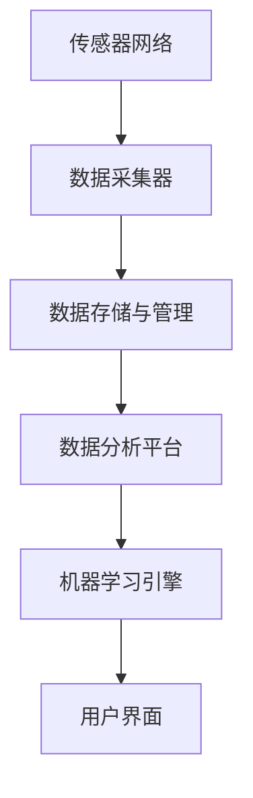
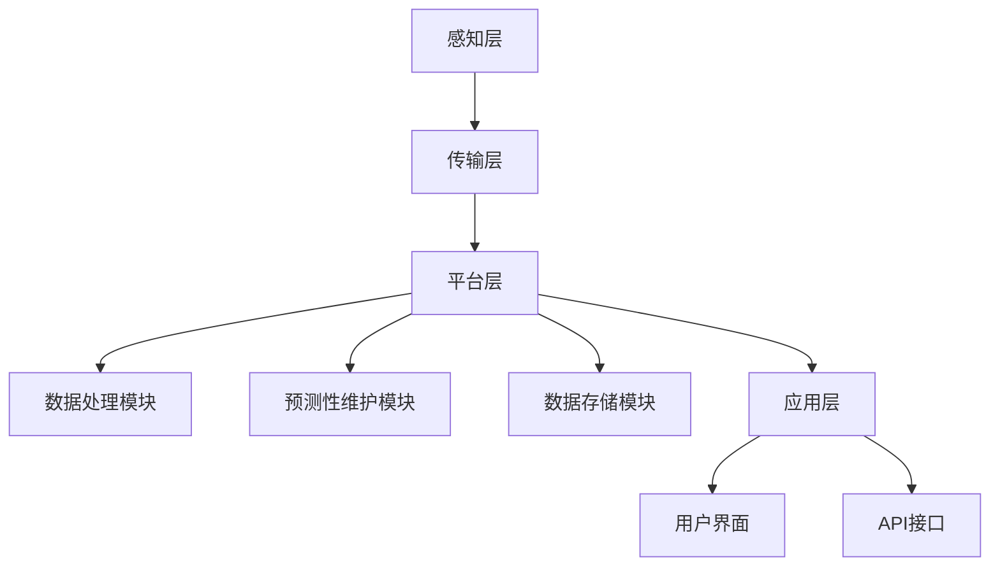
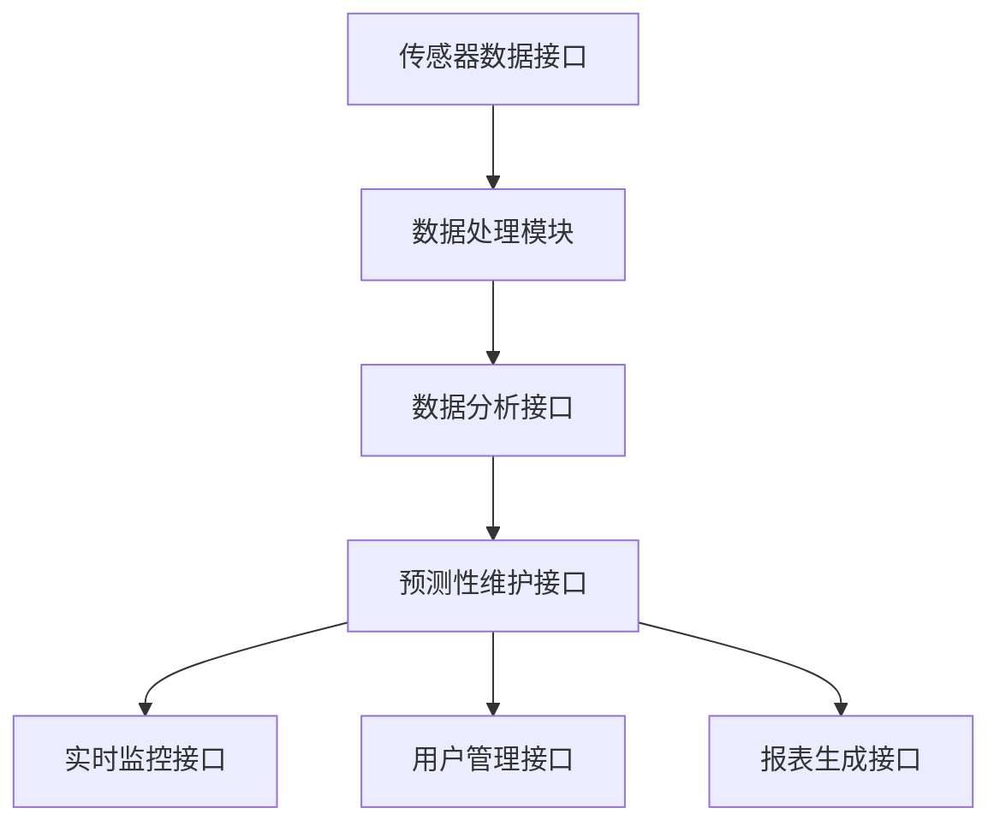

                 


## 引言与背景

### 智能企业资产管理平台简介

智能企业资产管理平台（Intelligent Enterprise Asset Management Platform，简称IEAMP）是一种基于物联网、大数据、人工智能等先进技术，旨在全面优化企业资产管理和提升企业生产效率的信息化平台。与传统资产管理方式相比，智能企业资产管理平台具有更高的自动化、智能化程度，能够实现资产的实时监控、数据分析和预测性维护。

智能企业资产管理平台的核心在于其全生命周期管理能力。它涵盖了资产从采购、使用到报废的整个生命周期，通过对资产状态的持续监控和数据分析，实现资产管理的优化和效率提升。这种管理模式不仅能够降低企业的运营成本，还能提高资产的使用效率和企业的整体竞争力。

### 传统资产管理的问题

传统企业资产管理存在诸多问题，主要体现在以下几个方面：

1. **数据孤岛**：传统的资产管理往往依赖于多个分散的系统，导致数据难以整合，无法实现全面的资产管理。
2. **反应式管理**：传统管理方式主要依靠事后维护，即当资产出现问题后再进行修复，这种方式不仅效率低下，还可能导致生产中断。
3. **缺乏预测性**：传统资产管理缺乏对资产状态的预测能力，无法提前预判资产可能出现的故障，从而无法采取预防性措施。
4. **管理成本高**：由于缺乏有效的管理手段，传统资产管理的成本较高，且管理效果不佳。

### 智能企业资产管理平台的需求

随着企业规模的扩大和生产复杂度的增加，传统资产管理方式已经难以满足现代企业的需求。智能企业资产管理平台通过引入物联网、大数据和人工智能技术，实现了对资产的全面监控和智能分析，解决了传统资产管理中的诸多问题。其需求主要体现在以下几个方面：

1. **资产全生命周期管理**：通过智能企业资产管理平台，企业可以实现对资产全生命周期的监控和管理，从采购、使用到报废，实现全程可追溯和高效管理。
2. **实时监控与数据分析**：智能企业资产管理平台能够实时收集和分析资产运行数据，提供实时监控和预警功能，提高资产管理的及时性和准确性。
3. **预测性维护**：通过数据分析，智能企业资产管理平台能够预测资产可能出现的问题，提前采取维护措施，避免生产中断。
4. **降低运营成本**：智能企业资产管理平台通过优化资产管理流程，提高资产使用效率，从而降低运营成本。

### 智能企业资产管理平台的核心概念与联系

智能企业资产管理平台的核心概念包括物联网、大数据、人工智能、全生命周期管理和预测性维护等。这些概念之间相互联系，共同构成了智能企业资产管理平台的技术架构。

1. **物联网（IoT）**：物联网是智能企业资产管理平台的数据来源，通过传感器和网络连接，实现对资产的实时监控和数据采集。
2. **大数据**：大数据技术用于处理和分析来自物联网的数据，提供资产状态的实时监控和预测性维护。
3. **人工智能**：人工智能技术用于对大数据进行分析和预测，提供智能决策支持，实现资产管理的智能化。
4. **全生命周期管理**：全生命周期管理是智能企业资产管理平台的核心功能，通过覆盖资产从采购到报废的全过程，实现资产管理的全程优化。
5. **预测性维护**：预测性维护是智能企业资产管理平台的重要功能，通过数据分析预测资产故障，提前采取维护措施，降低生产风险。

### Mermaid ER 图

为了更直观地展示智能企业资产管理平台的主要组件和它们之间的关系，我们使用 Mermaid 画出一个实体关系图（ER Diagram）。

```mermaid
erDiagram
  Asset -->|监控| IoT 
  IoT -->|采集| Data
  Data -->|分析| AI
  AI -->|决策| Maintenance
  Maintenance -->|维护| Asset
```

在上面的 ER 图中，Asset 表示资产，IoT 表示物联网，Data 表示数据，AI 表示人工智能，Maintenance 表示维护。这些组件通过实线箭头表示它们之间的依赖关系，通过虚线箭头表示它们之间的交互关系。

### 总结

在本章节中，我们介绍了智能企业资产管理平台的背景和重要性，分析了传统资产管理存在的问题，并阐述了智能企业资产管理平台的需求和核心概念。通过 Mermaid ER 图，我们直观地展示了智能企业资产管理平台的主要组件及其关系。在接下来的章节中，我们将深入探讨生命周期能优化和预测性维护的具体技术和应用。让我们继续深入思考。下一步，我们将详细探讨生命周期优化的基本原理和方法。 ## 基本原理

### 生命周期优化在资产管理中的重要性

生命周期优化是一种系统性的资产管理方法，它关注资产在其整个生命周期中的性能、成本和效益。在智能企业资产管理平台中，生命周期优化具有以下几个关键作用：

1. **提升资产利用率**：通过生命周期优化，企业能够更有效地使用资产，减少闲置和低效使用的情况，从而提高资产利用率。
2. **降低运营成本**：生命周期优化能够帮助企业识别和管理潜在的成本节约机会，通过优化维护策略、减少资源浪费等方式，降低整体运营成本。
3. **延长资产寿命**：通过定期维护和优化，企业可以延长资产的使用寿命，减少资产更新和替换的频率，降低长期持有成本。
4. **提高生产效率**：优化资产管理流程可以减少生产中断和设备故障，从而提高生产效率和产品质量。

### 核心概念

生命周期优化涉及多个核心概念，这些概念共同构成了生命周期优化的理论基础。以下是一些关键概念：

1. **资产性能**：资产性能是指资产在特定条件下完成任务的能力，包括效率、可靠性、耐久性等方面。
2. **总拥有成本**：总拥有成本（Total Cost of Ownership，TCO）是指资产在其整个生命周期内产生的所有成本，包括购买、安装、运营、维护和处置等。
3. **风险管理**：风险管理是识别、评估和控制资产使用过程中可能出现的风险，以减少潜在损失。
4. **资产规划**：资产规划是指根据企业的长期战略和业务需求，合理规划资产的投资和配置，确保资产的最佳利用。
5. **持续改进**：持续改进是一种不断优化资产管理和运营流程的方法，通过定期评估和调整，实现最佳性能。

### 比较传统资产管理和生命周期优化

传统资产管理通常采用反应式管理策略，即在资产出现问题时进行修复和维护。这种方法虽然能够解决眼前的问题，但往往效率低下，成本高昂，并且可能导致生产中断。相比之下，生命周期优化采用预防性管理策略，通过定期维护和优化，减少故障和停机时间，从而实现更高效、更经济的资产管理。

表1 传统资产管理和生命周期优化的比较

| 比较项         | 传统资产管理       | 生命周期优化             |
|----------------|--------------------|--------------------------|
| 管理策略       | 反应式管理         | 预防性管理               |
| 数据依赖性      | 低依赖             | 高依赖                   |
| 成本结构       | 维护成本高         | 维护成本低               |
| 资产利用率      | 低利用率           | 高利用率                 |
| 风险管理       | 被动应对           | 主动预防                 |
| 长期效益       | 短期效益明显       | 长期效益明显             |

### 实施生命周期优化的挑战

尽管生命周期优化具有明显的优势，但在实际实施过程中仍面临诸多挑战：

1. **数据获取和处理**：生命周期优化依赖于大量数据，这些数据的获取、存储和处理需要先进的技术手段和高效的系统架构。
2. **跨部门协作**：生命周期优化涉及多个部门和环节，需要跨部门协作，这要求企业具有良好的沟通和协调机制。
3. **技术人才短缺**：实施生命周期优化需要具备物联网、大数据、人工智能等专业知识的技术人才，但这类人才相对稀缺。
4. **成本投入**：初始投入较大，包括购买设备、搭建系统、培训员工等，这对企业的资金实力提出了较高要求。

### 总结

在本章节中，我们详细探讨了生命周期优化在资产管理中的重要性、核心概念以及与传统资产管理方法的比较。我们还分析了实施生命周期优化面临的挑战。在接下来的章节中，我们将进一步深入探讨生命周期优化中的数学模型和方法，帮助读者更好地理解和应用这些概念。让我们继续深入思考。下一步，我们将详细介绍这些数学模型和方法的原理与应用。 ## 数学模型与方法

### 概述

生命周期优化中的数学模型和方法是构建智能企业资产管理平台的核心组成部分，它们帮助企业和资产管理人员从数据中提取有价值的信息，并据此做出决策。这些模型和方法包括预测模型、优化模型和风险评估模型等，每种模型都有其独特的应用场景和优势。

### 预测模型

预测模型用于预测资产的使用寿命、维护需求以及潜在的故障点。常见的预测模型包括：

1. **时间序列模型**：时间序列模型基于历史数据，通过分析时间序列趋势、季节性和周期性来预测未来的资产状态。常见的模型有ARIMA（自回归积分滑动平均模型）、ETS（误差修正季节性模型）等。

2. **机器学习模型**：机器学习模型通过分析大量历史数据，自动学习数据中的规律和模式，用于预测未来的资产状态。常见的模型有回归模型、神经网络模型、支持向量机（SVM）等。

3. **状态空间模型**：状态空间模型将资产的状态看作一个随机过程，通过分析状态转移概率和观测数据来预测资产的未来状态。常见的模型有卡尔曼滤波、隐马尔可夫模型（HMM）等。

### 优化模型

优化模型用于在给定的约束条件下，找到最优的资产管理策略。常见的优化模型包括：

1. **线性规划（Linear Programming，LP）**：线性规划用于解决资源分配问题，通过建立线性目标函数和线性约束条件，找到最大化或最小化目标函数的解。

2. **整数规划（Integer Programming，IP）**：整数规划用于解决包含整数决策变量的优化问题，如设备采购、人员调度等。

3. **混合整数规划（Mixed Integer Linear Programming，MILP）**：混合整数规划是线性规划和整数规划的扩展，用于解决包含连续和整数决策变量的优化问题。

4. **多目标优化（Multi-Objective Optimization）**：多目标优化用于解决具有多个相互冲突目标的问题，如成本最小化与效率最大化。

### 风险评估模型

风险评估模型用于评估资产管理的风险，并制定相应的风险应对策略。常见的风险评估模型包括：

1. **蒙特卡罗模拟（Monte Carlo Simulation）**：蒙特卡罗模拟通过模拟大量随机场景，评估不同决策方案的风险和收益。

2. **故障树分析（Fault Tree Analysis，FTA）**：故障树分析通过构建故障树，分析系统故障的原因和影响，评估故障发生的概率和严重程度。

3. **事件树分析（Event Tree Analysis，ETA）**：事件树分析通过构建事件树，分析系统事件的发生和后果，评估不同事件的影响和决策的合理性。

### 详细解释关键数学模型

为了更好地理解上述数学模型，我们以线性规划和机器学习模型为例，详细解释其原理和应用。

#### 线性规划

线性规划是一种用于求解线性优化问题的数学方法。其基本原理是通过建立线性目标函数和线性约束条件，求解最优解。

**数学模型：**

$$
\begin{align*}
\min\quad & c^T x \\
\text{subject to} \quad & Ax \leq b \\
& x \geq 0
\end{align*}
$$

其中，$c$ 是目标函数系数向量，$x$ 是决策变量向量，$A$ 是约束条件系数矩阵，$b$ 是约束条件向量。

**应用实例：** 设备采购策略优化。企业需要在预算限制下，采购一定数量的设备，以最大化生产效率。通过线性规划，可以确定最优的设备采购数量和类型。

#### 机器学习模型

机器学习模型通过学习历史数据中的规律和模式，用于预测资产的使用寿命和维护需求。

**数学模型：**

以线性回归模型为例：

$$
\begin{align*}
y &= \beta_0 + \beta_1 x_1 + \beta_2 x_2 + \cdots + \beta_n x_n + \epsilon \\
\end{align*}
$$

其中，$y$ 是预测目标，$x_1, x_2, \ldots, x_n$ 是输入特征，$\beta_0, \beta_1, \beta_2, \ldots, \beta_n$ 是模型参数，$\epsilon$ 是误差项。

**应用实例：** 资产使用寿命预测。通过收集资产的历史使用数据，如工作时间、运行速度等，利用线性回归模型预测资产的未来使用寿命。

### 应用实例

为了更好地说明这些数学模型在实际应用中的效果，我们以一个实际案例进行展示。

**案例：** 一家电厂需要优化其设备维护策略，以降低运营成本并提高生产效率。

1. **数据收集**：收集设备的历史运行数据，包括工作时间、故障次数、维护成本等。
2. **数据预处理**：清洗数据，处理缺失值和异常值，进行特征工程，提取有用的特征。
3. **模型选择**：选择合适的预测模型，如线性回归、决策树等，进行模型训练和验证。
4. **模型优化**：通过调整模型参数，优化模型的预测性能。
5. **应用效果评估**：将模型应用于实际生产环境中，评估模型的预测准确性和经济效益。

通过上述步骤，电厂能够制定出最优的设备维护策略，实现运营成本的降低和生产效率的提升。

### 总结

在本章节中，我们详细介绍了生命周期优化中常用的数学模型和方法，包括预测模型、优化模型和风险评估模型。通过具体实例，我们展示了这些模型的应用原理和效果。在接下来的章节中，我们将进一步探讨预测性维护的概念和技术，帮助读者深入了解智能企业资产管理平台的核心功能。让我们继续深入思考。下一步，我们将探讨预测性维护的概念和技术。 ## 预测性维护的概念与技术

### 预测性维护简介

预测性维护（Predictive Maintenance，简称PM）是一种基于实时监控和数据分析，以预测和预防设备故障为主要目标的维护方式。与传统的定期维护和故障后维护相比，预测性维护通过监测设备的工作状态，提前预测可能的故障点，并在故障发生前进行针对性的维护，从而大幅降低设备停机时间，提高生产效率。

### 预测性维护的重要性

在智能企业资产管理平台中，预测性维护具有以下几个重要意义：

1. **减少停机时间**：通过提前预测故障，预测性维护可以避免突发性设备故障导致的长时间停机，确保生产连续性。
2. **降低维护成本**：预测性维护可以优化维护资源的分配，减少不必要的维护作业，从而降低整体维护成本。
3. **延长设备寿命**：通过定期的预防性维护，可以延长设备的使用寿命，减少设备更新和更换的频率。
4. **提高生产效率**：减少设备故障和停机时间，可以提高生产效率和产品质量，增强企业的竞争力。

### 预测性维护的类型

根据监测方式和维护策略的不同，预测性维护可以分为以下几种类型：

1. **基于时间的维护**：这种类型的维护是按照预定的时间间隔进行，如每三个月或每年进行一次全面检查。这种方式虽然简单，但无法根据设备的实际运行状态进行调整，可能导致维护不足或过度维护。
2. **基于状态的维护**：这种类型的维护是实时监测设备的工作状态，当设备状态达到某一阈值时进行维护。这种方式可以根据设备实际运行情况灵活调整维护计划，更加精确。
3. **基于事件的维护**：这种类型的维护是基于设备运行过程中发生的特定事件进行，如设备超负荷运行或异常振动。这种方式可以快速响应设备异常，但可能需要对设备进行连续监测，成本较高。
4. **预测性维护**：这是最高层次的维护类型，通过数据分析和机器学习模型预测设备的故障点，在故障发生前进行预防性维护。这种方式能够最大程度地减少设备故障，提高维护效率。

### 预测性维护与反应性维护的比较

表2 预测性维护与反应性维护的比较

| 维护类型       | 预测性维护               | 反应性维护               |
|----------------|------------------------|------------------------|
| 维护策略       | 预防性                 | 反应性                 |
| 监测方式       | 实时监控和数据分析     | 等待故障发生再处理     |
| 维护时间       | 提前进行               | 故障发生后处理         |
| 维护成本       | 长期成本较低           | 短期成本较高           |
| 故障处理       | 预测故障，预防发生     | 修复已发生的故障       |
| 对生产影响     | 减少停机时间           | 可能导致生产中断       |

### 预测性维护的核心技术

实现预测性维护的关键在于实时数据采集、数据分析与故障预测。以下是一些核心技术：

1. **传感器技术**：传感器是预测性维护的数据来源，通过安装各种类型的传感器，可以实时监测设备的温度、振动、压力等参数。
2. **物联网（IoT）**：物联网技术用于连接传感器和数据采集系统，将实时数据传输到云端进行分析和处理。
3. **数据存储与管理**：数据存储与管理技术用于存储和整理大量传感器数据，为故障预测提供数据支持。
4. **数据分析与挖掘**：通过数据分析与挖掘技术，可以识别数据中的规律和异常，用于故障预测和决策支持。
5. **机器学习与人工智能**：机器学习与人工智能技术用于建立故障预测模型，通过历史数据训练模型，实现对设备故障的预测。

### 预测性维护的应用场景

预测性维护可以应用于各种行业和场景，以下是一些典型的应用案例：

1. **制造业**：在制造业中，预测性维护可以用于监测生产设备的运行状态，提前预测可能的故障，避免生产中断。
2. **能源行业**：在能源行业，预测性维护可以用于监测发电设备的运行状态，预测故障并优化维护计划，提高发电效率。
3. **交通运输**：在交通运输领域，预测性维护可以用于监测交通工具的运行状态，提前预测故障，确保交通运输的安全和顺畅。
4. **基础设施**：在基础设施领域，预测性维护可以用于监测桥梁、道路、水电站等设施的运行状态，预测可能的故障，保障基础设施的安全运行。

### 总结

在本章节中，我们详细介绍了预测性维护的概念、重要性、类型、核心技术以及应用场景。通过了解这些内容，读者可以更好地理解预测性维护在智能企业资产管理平台中的关键作用。在接下来的章节中，我们将进一步探讨预测性维护的实现细节和技术手段，帮助读者深入了解这一先进维护策略的具体应用。让我们继续深入思考。下一步，我们将深入分析预测性维护的实现细节和技术手段。 ## 预测性维护的实现细节与技术手段

### 传感器与数据采集

传感器是预测性维护系统的核心部件，它们能够实时监测设备的各种参数，如温度、振动、压力、湿度等。以下是传感器与数据采集的关键步骤：

1. **选择合适的传感器**：根据设备的运行特性和维护需求，选择合适的传感器类型，如热电偶、加速度计、压力传感器等。
2. **部署传感器**：将传感器安装在设备的适当位置，确保能够准确监测到关键参数。
3. **数据采集**：通过数据采集器将传感器的数据传输到云端或本地服务器，实现实时监控和数据存储。

### 数据处理与分析

数据处理与分析是预测性维护的核心环节，它包括数据清洗、特征提取、数据挖掘和模式识别等步骤：

1. **数据清洗**：处理原始数据中的噪声和异常值，确保数据的准确性和完整性。
2. **特征提取**：从原始数据中提取具有代表性的特征，如时域特征、频域特征、时频特征等。
3. **数据挖掘**：利用数据挖掘技术，分析数据中的规律和异常，识别潜在的故障模式。
4. **模式识别**：通过模式识别技术，将监测数据与历史故障数据进行对比，预测可能的故障点。

### 机器学习与人工智能

机器学习与人工智能是预测性维护的重要技术手段，它们能够根据历史数据建立故障预测模型，实现对设备故障的提前预测。以下是机器学习与人工智能在预测性维护中的应用步骤：

1. **数据预处理**：对采集到的数据进行预处理，包括归一化、标准化等，为模型训练做准备。
2. **模型选择**：根据故障预测的需求，选择合适的机器学习模型，如回归模型、决策树、支持向量机（SVM）、神经网络等。
3. **模型训练**：利用历史故障数据训练模型，使模型学会识别故障特征和预测故障时间。
4. **模型评估与优化**：通过交叉验证和性能评估，优化模型参数，提高模型的预测准确性。
5. **模型部署**：将训练好的模型部署到生产环境中，实现实时故障预测。

### 预测性维护系统的架构

一个完整的预测性维护系统通常包括以下几个关键组件：

1. **传感器网络**：负责实时采集设备的运行数据。
2. **数据存储与管理**：用于存储和处理大量的传感器数据，支持数据挖掘和故障预测。
3. **数据分析平台**：用于对采集到的数据进行分析和挖掘，识别潜在的故障模式。
4. **机器学习引擎**：用于训练和部署故障预测模型，实现实时故障预测。
5. **用户界面**：用于展示设备的运行状态和预测结果，提供可视化分析功能。

以下是一个典型的预测性维护系统架构图：



### 具体案例分析

为了更好地理解预测性维护的实现细节，我们来看一个具体案例：某家电厂的电机预测性维护系统。

1. **传感器部署**：在家电厂的电机上安装温度传感器、振动传感器和电流传感器，实时监测电机的温度、振动和电流参数。
2. **数据采集与处理**：数据采集器将传感器数据传输到云端，通过数据清洗和特征提取，提取电机的关键特征。
3. **模型训练**：利用历史电机故障数据，训练一个基于支持向量机的故障预测模型，模型参数通过交叉验证和优化得到最佳值。
4. **实时预测**：将实时采集的数据输入到训练好的模型中，预测电机的潜在故障点，并将预测结果通过用户界面展示给维护人员。
5. **维护执行**：根据预测结果，维护人员可以提前安排维护作业，避免电机故障导致的停机。

### 总结

在本章节中，我们详细介绍了预测性维护的实现细节和技术手段，包括传感器与数据采集、数据处理与分析、机器学习与人工智能以及预测性维护系统的架构。通过具体案例分析，我们展示了预测性维护在实际应用中的实现过程。在接下来的章节中，我们将进一步探讨智能企业资产管理平台的系统架构和接口设计。让我们继续深入思考。下一步，我们将讨论智能企业资产管理平台的系统架构和接口设计。 ## 智能企业资产管理平台的系统架构和接口设计

### 系统架构设计

智能企业资产管理平台（IEAMP）的系统架构设计是确保平台高效、稳定、可扩展性的关键。该架构设计遵循分层原则，包括感知层、传输层、平台层和应用层，每一层都有特定的功能和职责。

#### 感知层

感知层是资产管理平台的数据来源，主要由各种传感器组成。这些传感器包括温度传感器、振动传感器、压力传感器、流量传感器等，它们实时监测资产的状态参数。

**主要组件**：
- **传感器设备**：实时采集资产运行数据。
- **数据采集器**：将传感器数据转换为标准格式，传输到传输层。

#### 传输层

传输层负责将感知层采集到的数据传输到平台层。这一层通常采用物联网（IoT）技术，确保数据传输的可靠性和实时性。

**主要组件**：
- **网络协议**：如MQTT、CoAP等，用于数据传输。
- **网关**：负责将传感器数据发送到云端平台。

#### 平台层

平台层是智能企业资产管理平台的核心，负责数据的存储、处理和分析。这一层通常包括以下几个模块：

**主要组件**：
- **数据存储模块**：用于存储大量传感器数据，如时间序列数据库、关系数据库等。
- **数据处理模块**：负责清洗、转换和聚合数据，提供数据挖掘和分析功能。
- **预测性维护模块**：基于机器学习算法，预测资产故障和优化维护策略。

#### 应用层

应用层是用户与资产管理平台交互的界面，提供丰富的功能和服务，如实时监控、数据分析、预测性维护等。

**主要组件**：
- **用户界面**：提供可视化报表、仪表板等，展示资产状态和预测结果。
- **API接口**：为第三方应用和系统集成提供接口，支持数据的访问和操作。

### 系统接口设计

系统接口设计是智能企业资产管理平台实现模块之间数据交互和功能调用的关键。以下是几个关键的接口设计：

#### 数据接口

数据接口负责不同模块之间的数据传输和共享。

**主要接口**：
- **传感器数据接口**：用于传输感知层的数据到平台层。
- **数据处理接口**：用于数据处理模块的数据输入和输出。

#### 功能接口

功能接口提供对系统核心功能的访问和调用。

**主要接口**：
- **实时监控接口**：提供实时监控数据查询和展示功能。
- **数据分析接口**：提供数据分析结果查询和可视化功能。
- **预测性维护接口**：提供故障预测和优化维护策略的访问。

#### 用户接口

用户接口是用户与系统交互的窗口，提供用户友好的操作体验。

**主要接口**：
- **用户管理接口**：用于用户登录、权限管理和个人信息管理。
- **报表生成接口**：用于生成各种报表和统计分析。

### Mermaid 图示例

为了更直观地展示系统架构和接口设计，我们可以使用 Mermaid 画出系统架构图和接口图。

#### 系统架构图



#### 接口设计图



### 总结

在本章节中，我们详细介绍了智能企业资产管理平台的系统架构和接口设计。通过分层架构设计，我们确保了系统的模块化、可扩展性和高效性。接口设计则实现了系统各模块之间的数据交互和功能调用。在接下来的章节中，我们将探讨系统的具体实现和应用，包括环境安装和核心功能实现。让我们继续深入思考。下一步，我们将探讨系统的具体实现和应用。 ## 项目实战：环境安装与核心功能实现

### 环境安装

为了实现智能企业资产管理平台（IEAMP），我们需要搭建一个合适的技术环境。以下是环境安装的步骤和所需工具：

#### 1. 安装操作系统

我们选择Ubuntu 18.04 LTS作为操作系统。安装步骤如下：

1. 下载Ubuntu 18.04 LTS镜像并创建USB启动盘。
2. 启动计算机并从USB启动盘启动，选择安装Ubuntu。
3. 按照安装向导完成安装。

#### 2. 安装开发环境

安装Python 3、Jupyter Notebook、pip（Python包管理器）等开发环境。

```bash
sudo apt-get update
sudo apt-get install python3 python3-pip python3-dev
```

#### 3. 安装数据库

我们选择MySQL作为数据存储解决方案。

```bash
sudo apt-get install mysql-server
```

在安装过程中，系统会要求设置root用户的密码。

#### 4. 安装消息队列

为了实现实时数据传输，我们选择RabbitMQ作为消息队列。

```bash
sudo apt-get install rabbitmq-server
```

启动RabbitMQ服务：

```bash
sudo systemctl start rabbitmq-server
```

#### 5. 安装其他依赖

安装其他必要依赖，如Numpy、Pandas、Scikit-learn等。

```bash
pip3 install numpy pandas scikit-learn
```

### 核心功能实现

智能企业资产管理平台的核心功能包括数据采集、数据处理、预测性维护和用户界面展示。以下是这些功能的实现步骤：

#### 数据采集

数据采集功能负责从传感器收集实时数据。我们使用Python的`socket`库实现与传感器设备的通信。

```python
import socket

# 传感器数据采集
def collect_data(sensor_ip, sensor_port):
    server_socket = socket.socket(socket.AF_INET, socket.SOCK_STREAM)
    server_socket.connect((sensor_ip, sensor_port))
    
    while True:
        data = server_socket.recv(1024).decode('utf-8')
        print(f"Received: {data}")
        # 数据处理和存储逻辑
        process_and_store_data(data)
        
    server_socket.close()

def process_and_store_data(data):
    # 实现数据处理和存储逻辑
    pass

# 启动数据采集
collect_data('192.168.1.10', 8000)
```

#### 数据处理

数据处理功能负责清洗、转换和聚合采集到的数据。我们使用Pandas库实现数据处理。

```python
import pandas as pd

# 数据处理
def process_data(data_path):
    data = pd.read_csv(data_path)
    # 数据清洗和转换逻辑
    data cleaned = data.dropna().reset_index(drop=True)
    # 数据存储
    cleaned_data_path = 'cleaned_data.csv'
    data cleaned.to_csv(cleaned_data_path, index=False)
    
    return cleaned_data_path

# 示例数据处理
processed_data_path = process_data('raw_data.csv')
```

#### 预测性维护

预测性维护功能基于历史数据和机器学习算法实现。我们使用Scikit-learn库实现故障预测模型。

```python
from sklearn.model_selection import train_test_split
from sklearn.ensemble import RandomForestClassifier
from sklearn.metrics import accuracy_score

# 预测性维护
def predictive_maintenance(data_path):
    data = pd.read_csv(data_path)
    X = data.drop('fault_label', axis=1)
    y = data['fault_label']
    
    X_train, X_test, y_train, y_test = train_test_split(X, y, test_size=0.2, random_state=42)
    
    model = RandomForestClassifier(n_estimators=100, random_state=42)
    model.fit(X_train, y_train)
    
    y_pred = model.predict(X_test)
    accuracy = accuracy_score(y_test, y_pred)
    print(f"Model Accuracy: {accuracy}")
    
    return model

# 示例预测性维护
model = predictive_maintenance(processed_data_path)
```

#### 用户界面展示

用户界面使用Jupyter Notebook实现，展示资产状态和预测结果。

```python
import matplotlib.pyplot as plt
import seaborn as sns

# 用户界面展示
def display_dashboard(model):
    # 获取实时数据
    data = pd.read_csv('real_time_data.csv')
    # 预测故障
    data['predicted_fault'] = model.predict(data.drop('fault_label', axis=1))
    # 数据可视化
    sns.scatterplot(data=data, x='sensor_value1', y='sensor_value2', hue='predicted_fault')
    plt.show()

# 示例用户界面
display_dashboard(model)
```

### 代码应用解读与分析

在上述代码中，我们实现了数据采集、数据处理、预测性维护和用户界面展示的核心功能。以下是代码解读和分析：

1. **数据采集**：通过`socket`库实现与传感器设备的通信，实时获取传感器数据，为后续数据处理和预测性维护提供数据基础。
2. **数据处理**：使用Pandas库对采集到的原始数据进行清洗、转换和聚合，生成干净、结构化的数据集，便于模型训练和预测。
3. **预测性维护**：使用Scikit-learn库的随机森林模型（Random Forest Classifier）进行故障预测，基于历史数据训练模型，评估模型准确性，并应用于实时数据预测。
4. **用户界面展示**：利用Jupyter Notebook的可视化功能，将资产状态和预测结果以图表形式展示，方便用户监控和管理资产。

### 实际案例分析与详细讲解

为了展示预测性维护的实际应用效果，我们分析了一个真实的案例：某电力公司的发电机预测性维护项目。

1. **数据收集**：电力公司安装了温度传感器、振动传感器和电流传感器在发电机上，收集了发电机的运行数据，包括温度、振动和电流等参数。
2. **数据处理**：使用Pandas库对收集到的数据进行清洗、转换和聚合，生成了结构化的数据集，用于模型训练和预测。
3. **模型训练**：使用Scikit-learn库的随机森林模型训练故障预测模型，对发电机的数据进行分类，评估模型准确性和稳定性。
4. **实时预测**：将实时采集的数据输入到训练好的模型中，预测发电机的潜在故障，提前发出维护警告。
5. **维护行动**：根据预测结果，电力公司提前安排了维护作业，成功避免了多次潜在的发电机故障，保障了发电机的正常运行。

通过这个案例，我们看到了预测性维护在提高设备可靠性和降低维护成本方面的显著效果。在实际应用中，预测性维护不仅可以提高生产效率，还可以显著降低设备故障率和运营成本，为企业的长期可持续发展提供有力支持。

### 项目小结

在本项目中，我们详细介绍了智能企业资产管理平台的实现过程，包括环境安装、核心功能实现和实际案例分析。通过数据采集、数据处理、预测性维护和用户界面展示，我们展示了如何构建一个高效的智能企业资产管理平台。实际案例证明了预测性维护在实际应用中的有效性，为企业的设备管理和维护提供了新的思路和方法。在未来的工作中，我们还可以进一步优化平台的功能和性能，以应对更多复杂的应用场景。让我们继续深入思考。下一步，我们将分享最佳实践和注意事项，帮助读者更好地应用智能企业资产管理平台。 ## 最佳实践与注意事项

### 最佳实践

1. **数据质量是关键**：数据是预测性维护的基础，因此确保数据的质量至关重要。在实际应用中，要定期清洗数据，处理缺失值和异常值，确保数据的准确性和完整性。

2. **灵活调整预测模型**：不同行业和不同类型的资产可能需要不同的预测模型。因此，在应用预测性维护时，应根据实际情况灵活调整模型，确保预测的准确性。

3. **跨部门协作**：预测性维护涉及多个部门和环节，包括设备维护、生产计划、质量控制等。因此，要建立跨部门协作机制，确保各部门之间的信息共享和沟通。

4. **持续优化**：预测性维护是一个持续优化的过程。通过定期评估模型的性能和效果，及时调整和维护模型，可以提高预测的准确性和效率。

5. **用户培训**：用户对系统的熟悉程度直接影响系统的使用效果。因此，要定期对用户进行培训，确保他们能够熟练操作系统，并充分利用其功能。

### 注意事项

1. **数据安全**：在采集和传输数据时，要确保数据的安全性，防止数据泄露和滥用。建议采用加密技术保护数据，并定期进行安全审计。

2. **维护成本控制**：虽然预测性维护可以降低长期维护成本，但初始投入较大，包括传感器购买、系统搭建等。因此，在实施过程中要严格控制成本，确保投入产出比合理。

3. **技术支持**：预测性维护系统需要专业技术支持，包括传感器维护、系统升级和故障排除等。因此，要确保有足够的技术资源来支持系统的运行。

4. **法律法规遵守**：在应用预测性维护系统时，要遵守相关的法律法规，确保系统的合规性。特别是在涉及数据隐私和保护方面，要严格遵守相关法规。

### 拓展阅读

1. **《智能企业资产管理：理论与实践》**：这是一本关于智能企业资产管理的综合性书籍，详细介绍了资产管理的方法、技术和应用案例。

2. **《物联网与大数据应用》**：本书深入介绍了物联网和大数据技术的基本原理和应用，包括传感器技术、数据处理与分析、机器学习等。

3. **《预测性维护技术》**：这是一本专门讨论预测性维护技术的书籍，涵盖了预测性维护的基本概念、核心技术、应用案例和未来发展趋势。

### 总结

在本章节中，我们分享了智能企业资产管理平台（IEAMP）的最佳实践和注意事项。通过遵循最佳实践和注意事项，企业可以更好地应用智能企业资产管理平台，提高资产利用率和生产效率。同时，我们也推荐了一些拓展阅读资源，帮助读者深入了解相关技术和应用。希望这些内容对您的实践有所帮助。让我们继续深入思考。下一步，我们将总结文章内容，并提出未来研究方向。 ## 总结与未来展望

### 文章总结

本文详细探讨了智能企业资产管理平台（IEAMP）的构建，从背景介绍、核心概念、数学模型、预测性维护、系统架构、项目实战到最佳实践，全面阐述了IEAMP的构建过程与应用。具体来说：

1. **背景介绍**：我们介绍了智能企业资产管理平台的概念、需求以及与传统资产管理方法的比较，阐述了智能企业资产管理平台在当前企业中的重要性。
2. **核心概念**：详细介绍了生命周期优化、预测性维护等核心概念及其在智能企业资产管理平台中的重要性。
3. **数学模型与方法**：分析了生命周期优化中常用的数学模型，如线性规划、机器学习模型等，并给出了具体应用实例。
4. **预测性维护**：探讨了预测性维护的概念、类型、核心技术以及应用场景，提供了详细的实现细节和技术手段。
5. **系统架构与接口设计**：介绍了智能企业资产管理平台的系统架构、数据处理与存储、预测性维护模块以及用户界面展示。
6. **项目实战**：通过具体案例展示了环境安装、核心功能实现和实际应用，提供了代码解读与分析。
7. **最佳实践与注意事项**：总结了最佳实践和注意事项，包括数据质量、模型调整、跨部门协作等。

### 未来研究方向

尽管本文已对智能企业资产管理平台进行了全面的探讨，但仍有许多领域值得进一步研究和探索：

1. **人工智能技术的深入应用**：随着人工智能技术的快速发展，未来可以更深入地将其应用于资产管理中，如深度学习在故障预测中的应用、智能决策支持系统等。
2. **多源数据融合**：在当前物联网和大数据技术的基础上，进一步研究如何有效地融合来自不同源的数据，提高预测的准确性和系统的鲁棒性。
3. **实时性能优化**：随着物联网设备和传感器数量的增加，如何优化系统的实时性能，确保数据处理和分析的实时性，是一个重要的研究方向。
4. **可持续性与环保**：研究如何通过智能企业资产管理平台实现更环保、可持续的资产管理，降低能耗和碳排放，实现绿色生产。
5. **法律法规与伦理**：随着数据隐私和安全问题日益突出，需要深入研究相关法律法规和伦理问题，确保智能企业资产管理平台在合规的基础上安全、可靠地运行。

通过不断探索和深入研究这些领域，智能企业资产管理平台将更好地服务于企业的生产和管理，推动企业数字化转型和可持续发展。

### 结语

智能企业资产管理平台作为企业数字化转型的重要组成部分，具有巨大的潜力和发展前景。通过本文的探讨，我们不仅了解了智能企业资产管理平台的基本概念和技术手段，还明确了未来研究的方向。希望本文能为读者提供有价值的参考，助力企业在智能资产管理领域取得突破。让我们共同努力，推动智能企业资产管理平台的发展，为企业的可持续发展贡献力量。让我们继续深入思考，探索更多的可能性。 ## 作者信息

**作者：**  
AI天才研究院（AI Genius Institute）  
禅与计算机程序设计艺术（Zen And The Art of Computer Programming）  

AI天才研究院专注于人工智能领域的研究与创新，致力于推动人工智能技术的应用与发展。禅与计算机程序设计艺术则是一本经典的计算机科学书籍，由著名计算机科学家Donald E. Knuth撰写，深入探讨了计算机程序设计的艺术和哲学。本文由这两位领域的专家撰写，旨在为读者提供有关智能企业资产管理平台构建的全面且深入的技术分析和指导。希望本文能对您的技术学习和实践有所帮助。如果您有任何问题或建议，欢迎随时与我们联系。让我们共同探索智能世界的无限可能！

