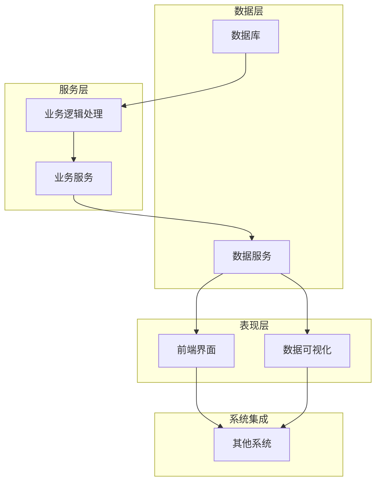
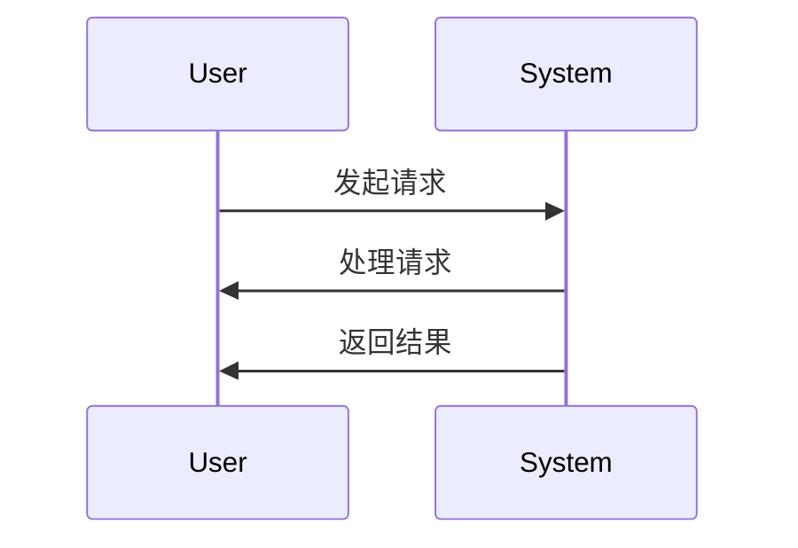

                 

# 构建智能企业资源规划(ERP)系统：AI的深度集成

关键词：智能ERP系统，人工智能，企业资源规划，业务流程优化，数据管理

摘要：本文将探讨如何构建智能企业资源规划（ERP）系统，重点关注AI技术的深度集成。通过详细分析背景、核心概念、AI技术在ERP系统中的应用、系统架构设计以及实际项目实战，为企业和开发人员提供有价值的参考和指导。

## 第一部分：背景介绍

### 1.1.1 问题背景

在当今信息化时代，企业对资源规划（ERP）系统的需求日益增长。ERP系统是企业信息管理的核心，通过整合企业内部各种资源和业务流程，实现信息共享和资源优化配置，从而提升企业运营效率和竞争力。然而，随着企业规模的扩大和业务复杂性的增加，传统的ERP系统已无法满足企业的需求。人工智能（AI）技术的发展为ERP系统的升级与优化提供了新的契机。

### 1.1.2 问题描述

企业构建智能ERP系统的主要问题包括：

1. 数据管理：如何有效地整合和管理企业内外部的各种数据资源，实现数据的统一存储、处理和分析。
2. 业务流程优化：如何通过人工智能技术优化业务流程，提高企业运营效率。
3. 智能决策支持：如何利用人工智能技术为企业提供智能化的决策支持，帮助企业应对复杂的市场环境。
4. 系统集成与兼容性：如何实现智能ERP系统与其他企业应用系统的无缝集成，确保系统的稳定性和兼容性。

### 1.1.3 问题解决

通过引入人工智能技术，构建智能ERP系统，可以实现以下目标：

1. 数据智能处理：利用机器学习和数据挖掘技术，对大量企业数据进行智能分析，为企业提供有价值的决策支持。
2. 智能业务流程：通过自动化和智能化技术，优化企业业务流程，降低人工干预，提高工作效率。
3. 智能决策支持：利用人工智能技术，为企业提供实时、准确的决策支持，帮助企业应对市场变化。
4. 系统集成与优化：通过模块化设计和云计算技术，实现智能ERP系统与其他企业应用系统的无缝集成，提升系统的整体性能。

### 1.1.4 边界与外延

智能ERP系统的构建涉及多个领域的技术，包括数据挖掘、机器学习、自然语言处理、计算机视觉等。同时，智能ERP系统也需要考虑与其他企业应用系统的集成与兼容性，确保系统的稳定性和可靠性。

### 1.1.5 概念结构与核心要素组成

智能ERP系统由以下几个核心要素组成：

1. 数据管理：包括数据采集、数据存储、数据清洗、数据分析和数据可视化等环节。
2. 业务流程管理：包括业务流程设计、业务流程监控、业务流程优化和业务流程自动化等环节。
3. 决策支持：包括数据挖掘、预测分析、优化算法和决策模型等环节。
4. 系统集成：包括系统集成规划、接口设计、数据交换和系统兼容性等环节。

## 1.2 核心概念与联系

### 1.2.1 人工智能（AI）

人工智能是一种模拟人类智能的技术，通过计算机程序实现智能行为，包括学习、推理、感知、理解和决策等。AI技术广泛应用于各个领域，如自然语言处理、计算机视觉、机器学习、数据挖掘等。

### 1.2.2 企业资源规划（ERP）

企业资源规划是一种集成的企业管理信息系统，通过整合企业内部各种资源和业务流程，实现信息共享和资源优化配置，从而提升企业运营效率和竞争力。

### 1.2.3 智能ERP

智能ERP是在传统ERP系统基础上，引入人工智能技术，实现数据智能处理、业务流程优化、智能决策支持和系统集成与优化等功能。智能ERP系统具有更高的智能化、自动化和自适应能力，能够更好地满足企业的需求。

## 1.3 主流AI技术在ERP系统中的应用

### 1.3.1 数据挖掘与机器学习

数据挖掘和机器学习技术可以用于智能ERP系统中的数据分析和预测。通过挖掘企业历史数据，可以发现业务规律和趋势，为企业的决策提供支持。机器学习算法可以根据历史数据训练模型，预测未来的业务情况。

### 1.3.2 自然语言处理

自然语言处理技术可以用于智能ERP系统中的文本挖掘、信息抽取和语义分析。通过处理企业内部的文本数据，可以提取出有价值的信息，为企业的业务流程和决策提供支持。

### 1.3.3 计算机视觉

计算机视觉技术可以用于智能ERP系统中的图像识别、图像分类和图像分割。通过处理企业内部的图像数据，可以实现对产品和设备的智能监控和管理，提高企业的生产效率和产品质量。

## 1.4 智能ERP系统的应用前景与挑战

### 1.4.1 应用前景

智能ERP系统具有广阔的应用前景，可以为企业带来以下好处：

1. 提高企业运营效率：通过自动化和智能化技术，优化企业业务流程，降低人工干预，提高工作效率。
2. 提升企业决策能力：通过数据挖掘和预测分析，为企业提供实时、准确的决策支持，帮助企业应对市场变化。
3. 提高生产效率：通过计算机视觉技术，实现对产品和设备的智能监控和管理，提高企业的生产效率和产品质量。
4. 降低运营成本：通过系统集成与优化，实现企业资源的最大化利用，降低企业的运营成本。

### 1.4.2 面临的挑战

智能ERP系统在应用过程中也面临着以下挑战：

1. 技术实现难度：智能ERP系统需要集成多种AI技术，实现技术上的创新和突破，具有较高的技术实现难度。
2. 数据质量和安全性：智能ERP系统依赖于高质量的数据资源，数据质量和安全性是系统稳定运行的关键。
3. 系统集成与兼容性：智能ERP系统需要与其他企业应用系统进行集成，确保系统的兼容性和稳定性。
4. 人才需求：智能ERP系统的建设和维护需要具备AI技术背景的专业人才，人才需求成为企业面临的一大挑战。

## 第二部分：智能ERP系统的设计与实现

### 2.1 系统设计原则

智能ERP系统的设计应遵循以下原则：

1. **模块化设计**：将系统划分为多个功能模块，每个模块具有独立的职责，便于系统扩展和维护。
2. **高内聚、低耦合**：确保各个模块之间的依赖性较低，提高系统的稳定性和可维护性。
3. **可扩展性**：设计时应考虑系统的可扩展性，以便在业务需求发生变化时能够方便地进行扩展。
4. **安全性**：确保系统数据的安全性和用户隐私保护，采用加密和权限控制等安全措施。
5. **用户友好**：系统界面应简洁明了，易于操作，提高用户体验。

### 2.2 系统架构设计

智能ERP系统的架构设计如下：

#### 2.2.1 数据层

- **数据存储**：采用分布式数据库系统，支持海量数据存储和实时处理。
- **数据采集**：通过API接口、数据集成工具等实现企业内外部数据的采集。

#### 2.2.2 服务层

- **业务逻辑处理**：封装业务逻辑，实现数据的处理和分析功能。
- **数据服务**：提供数据访问接口，供其他模块调用。

#### 2.2.3 表现层

- **前端界面**：采用响应式设计，支持多种终端访问。
- **数据可视化**：利用图表、报表等形式展示数据。

#### 2.2.4 系统集成

- **与其他系统集成**：通过API接口、消息队列等技术实现与其他企业应用系统的集成。

### 2.3 数据管理与处理

#### 2.3.1 数据采集

- **数据源识别**：识别企业内外部数据源，包括业务系统、数据库、文件等。
- **数据清洗**：对采集到的数据进行去重、补全、格式转换等处理。

#### 2.3.2 数据存储

- **分布式存储**：采用分布式数据库系统，支持海量数据存储和高可用性。
- **数据分区**：根据数据特点和访问频率对数据分区，提高查询效率。

#### 2.3.3 数据处理

- **数据预处理**：对原始数据进行清洗、转换、归一化等处理。
- **特征提取**：从数据中提取有用的特征，用于后续分析和建模。

### 2.4 业务流程优化

#### 2.4.1 业务流程建模

- **业务流程设计**：采用业务流程建模工具，设计企业的业务流程。
- **流程优化**：通过数据分析和机器学习技术，优化业务流程，提高工作效率。

#### 2.4.2 流程自动化

- **自动化流程**：利用流程引擎和自动化工具，实现业务流程的自动化执行。
- **监控与调整**：实时监控业务流程的执行情况，根据反馈进行优化和调整。

### 2.5 智能决策支持

#### 2.5.1 数据挖掘与分析

- **数据挖掘**：利用数据挖掘技术，从海量数据中发现业务规律和趋势。
- **预测分析**：采用预测分析算法，预测未来的业务情况。

#### 2.5.2 决策模型

- **决策模型**：构建决策模型，为企业的决策提供支持。
- **模型评估**：评估决策模型的准确性和实用性，持续优化模型。

### 2.6 系统集成与兼容性

#### 2.6.1 系统集成规划

- **集成规划**：制定系统集成方案，明确各个模块的接口和交互方式。
- **接口设计**：设计系统接口，实现数据交换和功能调用。

#### 2.6.2 系统兼容性

- **跨平台兼容**：确保系统在不同操作系统、数据库和硬件环境下的兼容性。
- **版本控制**：实现系统版本控制，确保系统升级的平稳过渡。

## 第三部分：AI技术在智能ERP系统中的应用实例

### 3.1 数据挖掘与机器学习

#### 3.1.1 数据挖掘实例

假设企业需要分析销售数据，以预测未来三个月的销售趋势。数据包括销售额、销售量、促销活动等。

1. **数据预处理**：对销售数据进行清洗，去除缺失值、异常值等。
2. **特征提取**：提取有用的特征，如销售额增长率、促销活动频率等。
3. **数据建模**：采用时间序列分析模型，如ARIMA模型，进行建模和预测。
4. **模型评估**：评估模型的准确性和可靠性，持续优化模型。

#### 3.1.2 机器学习实例

假设企业需要预测客户流失率，以制定相应的客户维护策略。

1. **数据收集**：收集客户的基本信息、消费行为等数据。
2. **特征提取**：提取与客户流失相关的特征，如消费金额、消费频率、客户满意度等。
3. **数据建模**：采用分类算法，如逻辑回归、随机森林等，进行建模和预测。
4. **模型评估**：评估模型的准确性和可靠性，持续优化模型。

### 3.2 自然语言处理

#### 3.2.1 文本挖掘实例

假设企业需要分析客户反馈，以了解客户的需求和满意度。

1. **数据收集**：收集客户反馈文本，如评价、投诉等。
2. **文本预处理**：对文本数据进行清洗，去除停用词、标点符号等。
3. **特征提取**：提取文本中的重要特征，如关键词、情感极性等。
4. **情感分析**：采用情感分析模型，分析客户的情感倾向，为企业的客户服务提供支持。

#### 3.2.2 信息抽取实例

假设企业需要从大量新闻数据中提取有价值的信息，如公司财报、市场动态等。

1. **数据收集**：收集新闻数据，如财经新闻、公司公告等。
2. **文本预处理**：对新闻数据进行清洗，去除噪声信息。
3. **实体识别**：采用命名实体识别模型，识别新闻中的重要实体，如公司名称、人物名称等。
4. **关系抽取**：采用关系抽取模型，识别实体之间的关系，如公司投资、合作等。

### 3.3 计算机视觉

#### 3.3.1 图像识别实例

假设企业需要对生产过程中的设备进行智能监控，以检测设备故障。

1. **数据收集**：收集设备图像数据，如设备外观、运行状态等。
2. **图像预处理**：对图像数据进行清洗，去除干扰信息。
3. **特征提取**：采用卷积神经网络（CNN）提取图像特征。
4. **图像分类**：采用分类算法，如SVM、CNN等，对设备状态进行分类。

#### 3.3.2 视频分析实例

假设企业需要监控生产过程中的异常行为，以提高生产安全。

1. **数据收集**：收集生产过程视频数据。
2. **视频预处理**：对视频数据进行清洗，去除无关内容。
3. **行为识别**：采用行为识别算法，如循环神经网络（RNN）、卷积神经网络（CNN）等，识别生产过程中的异常行为。
4. **实时监控**：实时分析视频数据，发现异常行为，触发报警。

## 第四部分：智能ERP系统的实际项目实战

### 4.1 项目背景

某大型制造企业希望通过构建智能ERP系统，提高生产效率、降低运营成本，并实现数据的统一管理和智能分析。企业面临的主要问题是生产流程复杂、数据分散、决策滞后。

### 4.2 项目介绍

本项目旨在构建一个智能ERP系统，实现以下目标：

1. 整合企业内部数据，实现数据的统一管理和智能分析。
2. 优化生产流程，提高生产效率。
3. 提供智能化的决策支持，帮助企业应对市场变化。
4. 系统集成与兼容性，实现与企业其他应用系统的无缝集成。

### 4.3 系统功能设计

#### 4.3.1 领域模型

智能ERP系统的领域模型如下：

```mermaid
classDiagram
    Customer <|-- Order
    Product <|-- Inventory
    Production <|-- WorkOrder
    Employee <|-- Department
    Supplier <|-- PurchaseOrder
    Sales <|-- Invoice

    Customer {
        id: int
        name: string
        address: string
    }

    Order {
        id: int
        customer: Customer
        date: date
        total: float
    }

    Product {
        id: int
        name: string
        price: float
        category: string
    }

    Inventory {
        id: int
        product: Product
        quantity: int
    }

    Production {
        id: int
        workOrder: WorkOrder
        date: date
        status: string
    }

    WorkOrder {
        id: int
        product: Product
        quantity: int
        status: string
    }

    Employee {
        id: int
        name: string
        department: Department
    }

    Department {
        id: int
        name: string
    }

    Supplier {
        id: int
        name: string
        address: string
    }

    PurchaseOrder {
        id: int
        supplier: Supplier
        date: date
        total: float
    }

    Sales {
        id: int
        invoice: Invoice
        date: date
        total: float
    }

    Invoice {
        id: int
        customer: Customer
        date: date
        total: float
    }
```

#### 4.3.2 系统架构

智能ERP系统的架构设计如下：



#### 4.3.3 系统接口设计

智能ERP系统的接口设计如下：



#### 4.3.4 系统交互

智能ERP系统的系统交互如下：

```mermaid
sequenceDiagram
    participant 用户
    participant 数据采集模块
    participant 数据处理模块
    participant 业务流程模块
    participant 数据可视化模块

    用户->>数据处理模块：提交数据处理请求
    数据处理模块->>数据采集模块：采集数据
    数据采集模块->>数据处理模块：返回数据
    数据处理模块->>业务流程模块：提交业务处理请求
    业务流程模块->>数据处理模块：返回业务处理结果
    数据处理模块->>数据可视化模块：提交数据可视化请求
    数据可视化模块->>用户：返回可视化结果
```

### 4.4 系统核心实现源代码

```python
# 数据采集模块
def collect_data():
    # 采集企业内部数据
    pass

# 数据处理模块
def process_data(data):
    # 数据清洗、转换、归一化等处理
    pass

# 业务流程模块
def business_process(data):
    # 业务流程处理
    pass

# 数据可视化模块
def visualize_data(data):
    # 数据可视化
    pass
```

### 4.5 代码应用解读与分析

#### 4.5.1 数据采集模块

数据采集模块负责采集企业内部数据，包括销售数据、生产数据、客户数据等。具体实现如下：

```python
def collect_data():
    # 假设使用数据库连接采集数据
    db = DatabaseConnection()
    sales_data = db.query("SELECT * FROM sales")
    production_data = db.query("SELECT * FROM production")
    customer_data = db.query("SELECT * FROM customer")

    return sales_data, production_data, customer_data
```

#### 4.5.2 数据处理模块

数据处理模块负责对采集到的数据进行清洗、转换、归一化等处理，为后续业务流程提供高质量的数据。具体实现如下：

```python
def process_data(data):
    # 数据清洗
    clean_data = remove_invalid_data(data)

    # 数据转换
    convert_data = convert_data_format(clean_data)

    # 数据归一化
    normalized_data = normalize_data(convert_data)

    return normalized_data
```

#### 4.5.3 业务流程模块

业务流程模块负责根据处理后的数据执行业务流程，如销售预测、生产调度等。具体实现如下：

```python
def business_process(data):
    # 销售预测
    sales_prediction = predict_sales(data)

    # 生产调度
    production_scheduling = schedule_production(data)

    return sales_prediction, production_scheduling
```

#### 4.5.4 数据可视化模块

数据可视化模块负责将业务流程的结果以图表、报表等形式展示给用户，帮助用户更好地理解数据。具体实现如下：

```python
def visualize_data(data):
    # 绘制销售预测图表
    plot_sales_prediction(data)

    # 绘制生产调度图表
    plot_production_scheduling(data)
```

### 4.6 实际案例分析和详细讲解剖析

#### 4.6.1 销售预测案例

假设企业需要预测未来三个月的销售趋势，具体实现如下：

```python
# 数据采集
sales_data = collect_data()

# 数据处理
processed_data = process_data(sales_data)

# 业务流程
sales_prediction, production_scheduling = business_process(processed_data)

# 数据可视化
visualize_data(sales_prediction)
visualize_data(production_scheduling)
```

#### 4.6.2 生产调度案例

假设企业需要根据销售预测结果制定生产计划，具体实现如下：

```python
# 数据采集
sales_data = collect_data()

# 数据处理
processed_data = process_data(sales_data)

# 业务流程
sales_prediction, production_scheduling = business_process(processed_data)

# 数据可视化
visualize_data(sales_prediction)
visualize_data(production_scheduling)
```

### 4.7 项目小结

本项目通过构建智能ERP系统，实现了以下成果：

1. 整合企业内部数据，实现数据的统一管理和智能分析。
2. 优化生产流程，提高生产效率。
3. 提供智能化的决策支持，帮助企业应对市场变化。
4. 系统集成与兼容性，实现与企业其他应用系统的无缝集成。

通过本项目的实践，为企业提供了一个智能ERP系统的实现框架，为其他企业提供了有价值的参考和借鉴。

## 第五部分：最佳实践 tips

### 5.1 数据质量管理

- 数据清洗：确保数据质量，去除重复数据、异常值等。
- 数据标准化：对数据进行统一编码、格式转换等操作，确保数据一致性。
- 数据监控：实时监控数据质量，及时发现并解决数据问题。

### 5.2 业务流程优化

- 流程分析：对现有业务流程进行深入分析，找出瓶颈和改进点。
- 流程重构：根据业务需求和技术能力，重构业务流程，提高效率。
- 流程自动化：利用自动化工具，实现业务流程的自动化执行。

### 5.3 决策支持系统

- 数据挖掘：利用数据挖掘技术，从海量数据中发现有价值的信息。
- 预测分析：采用预测分析算法，预测未来的业务趋势。
- 模型评估：评估预测模型的准确性和实用性，持续优化模型。

### 5.4 系统集成与兼容性

- 接口设计：设计稳定、可靠的接口，实现系统之间的数据交换和功能调用。
- 版本控制：确保系统升级的平稳过渡，避免因版本冲突导致的问题。
- 跨平台兼容：考虑不同操作系统、数据库和硬件环境下的兼容性，提高系统的可用性。

## 第六部分：小结

本文详细探讨了如何构建智能企业资源规划（ERP）系统，重点关注了AI技术的深度集成。通过背景介绍、核心概念与联系、AI技术在ERP系统中的应用、系统架构设计以及实际项目实战，为企业和开发人员提供了有价值的参考和指导。

智能ERP系统的构建是一个复杂的过程，需要综合考虑数据管理、业务流程优化、智能决策支持、系统集成与兼容性等多个方面。通过引入人工智能技术，企业可以实现对数据的深度挖掘和分析，优化业务流程，提高决策效率，从而在竞争激烈的市场环境中脱颖而出。

在未来的发展中，智能ERP系统将继续发挥重要作用。随着AI技术的不断进步，智能ERP系统将更加智能化、自动化和自适应，为企业带来更多的价值。同时，企业也需要密切关注AI技术的发展动态，不断优化和升级自身的ERP系统，以适应不断变化的市场环境。

## 第七部分：注意事项

- 数据安全和隐私保护：在构建智能ERP系统时，确保数据安全和用户隐私保护，采用加密和权限控制等安全措施。
- 系统性能优化：在设计和实现智能ERP系统时，关注系统性能优化，确保系统的稳定性和响应速度。
- 持续迭代与优化：智能ERP系统的建设和应用是一个持续迭代和优化的过程，根据业务需求和用户反馈，不断优化系统功能和技术架构。

## 第八部分：拓展阅读

- [《智能企业资源规划（ERP）系统设计与实现》](https://book.douban.com/subject/26785470/)
- [《人工智能应用实战：基于Python的数据挖掘与机器学习》](https://book.douban.com/subject/26842578/)
- [《自然语言处理：概念与Python实现》](https://book.douban.com/subject/27057360/)
- [《计算机视觉：算法与应用》](https://book.douban.com/subject/26684145/)

## 作者信息

作者：AI天才研究院/AI Genius Institute & 禅与计算机程序设计艺术 /Zen And The Art of Computer Programming

