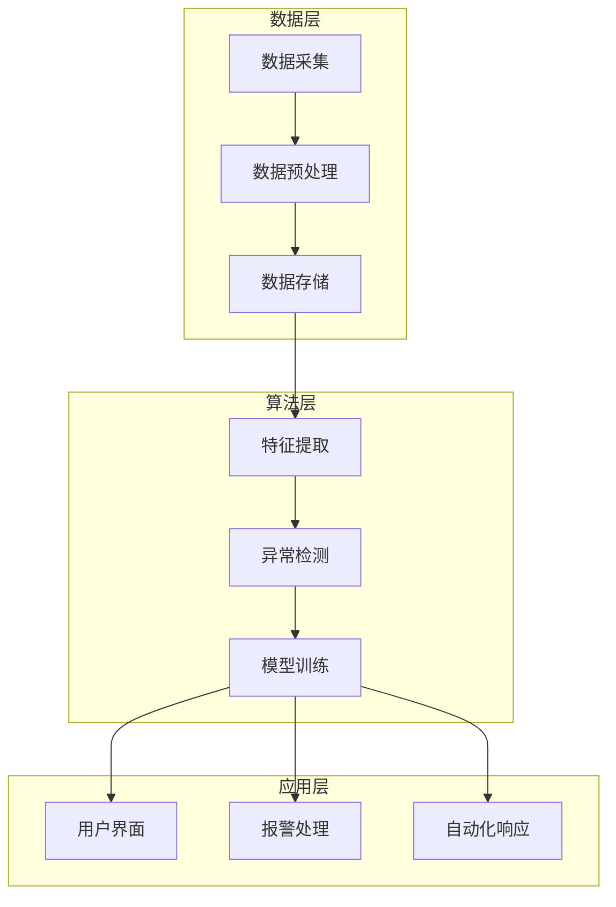
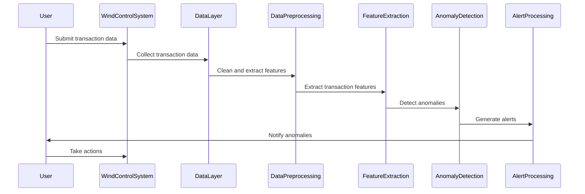

                 

### 文章标题

# 《构建智能企业风控系统：实时交易监控与欺诈检测的AI增强》

## 关键词

- 企业风控系统
- 实时交易监控
- 欺诈检测
- AI增强
- 数据科学
- 机器学习

### 摘要

随着数字化时代的到来，企业面临的数据量和复杂度急剧增加，如何有效防范风险、保障交易安全成为关键议题。本文将探讨构建智能企业风控系统的方法，重点分析实时交易监控与欺诈检测在AI增强下的应用。通过阐述企业风控系统的背景、问题与解决思路，以及AI基础和具体实现方法，本文旨在为企业和技术从业者提供有价值的参考，助力构建高效、智能的风控体系。

### 目录大纲

## 第一部分：背景介绍

### 第1章：企业风控系统的重要性

1.1 问题背景

1.2 问题描述

1.3 问题解决

1.4 边界与外延

1.5 概念结构与核心要素组成

### 第2章：AI基础

2.1 AI概述

2.2 数据科学与机器学习

2.3 AI在风控系统中的应用

### 第3章：实时交易监控

3.1 监控系统设计

3.2 数据采集与处理

3.3 实时交易监控

### 第4章：欺诈检测

4.1 欺诈检测概述

4.2 数据分析与模型构建

4.3 欺诈检测算法

### 第二部分：AI基础与风控系统融合

### 第5章：AI增强的风控系统架构

5.1 系统架构设计

5.2 系统接口设计

5.3 系统交互

### 第6章：项目实战

6.1 环境安装

6.2 系统核心实现

6.3 实际案例分析与讲解

6.4 项目小结

### 第7章：最佳实践与注意事项

7.1 最佳实践

7.2 小结

7.3 注意事项

7.4 拓展阅读

## 引言

### 背景与意义

在当前全球数字经济快速发展的背景下，企业面临的市场环境变得更加复杂和动态。数据的爆发式增长、多样化的交易模式和全球化的业务拓展，都使得企业面临着前所未有的风险。传统的风控手段往往难以应对这些复杂多变的风险因素，导致企业可能遭受重大的财务损失和声誉损害。因此，构建智能企业风控系统，利用先进的人工智能技术，实现实时交易监控和欺诈检测，已经成为企业提升风险管理能力的必然选择。

### 目的和结构

本文的目的在于深入探讨如何构建智能企业风控系统，特别是实时交易监控和欺诈检测在AI增强下的应用。通过系统性地分析风控系统的背景、AI基础、实施方法以及实战案例，本文旨在为企业和技术从业者提供一份全面的指南。文章的结构如下：

1. **背景介绍**：详细阐述企业风控系统的重要性，包括风险背景、系统不足、AI潜力等。
2. **AI基础**：介绍人工智能的基本概念、数据科学和机器学习原理，以及AI在风控中的应用。
3. **实时交易监控**：讨论监控系统设计、数据采集处理和实时监控的实现。
4. **欺诈检测**：介绍欺诈检测的基本流程、数据分析和模型构建，以及传统和基于AI的检测算法。
5. **AI增强的风控系统架构**：详细解析系统架构、接口设计和系统交互。
6. **项目实战**：通过实际案例展示系统的安装、核心实现和效果分析。
7. **最佳实践与注意事项**：总结最佳实践，提供注意事项和拓展阅读。

### 企业风控系统的必要性

在数字化的浪潮下，企业的运营模式发生了深刻变化。传统的业务流程被数据驱动，大量的交易信息在互联网和金融系统中流转。这些交易活动不仅带来了商业机会，也伴随着各种潜在风险，例如市场波动、操作失误、恶意攻击等。这些风险如果不能得到有效管理，将会对企业的财务状况、运营效率和客户信任造成严重影响。

**风险类型及其影响**：

1. **市场风险**：市场波动可能导致企业资产价值大幅缩水，影响财务稳健性。
2. **信用风险**：客户违约、合作伙伴信用问题等可能导致应收账款无法回收。
3. **操作风险**：内部操作失误、欺诈行为等可能导致经济损失和声誉损害。
4. **合规风险**：违反法规可能导致罚款、制裁和诉讼，影响企业的合规运营。

为了应对这些风险，企业需要构建一套完整的风控系统，实时监控交易活动，及时发现并防范潜在风险。传统的风控系统主要依赖人工审核和规则设定，存在响应速度慢、覆盖面有限、易受欺诈等问题。而智能风控系统通过引入人工智能技术，能够实现自动化、实时化和智能化的风险监测，大幅提升风控效率。

### 当前企业风控系统的不足

尽管许多企业已经意识到风控系统的重要性，但现有的风控系统仍存在诸多不足，难以应对复杂多变的数字化环境。

**1. 监测速度慢**：传统的风控系统通常采用定期扫描或批量处理的方式，无法实现实时监控，导致风险在发生时无法得到及时响应。

**2. 覆盖面有限**：规则驱动的风控系统依赖于预定义的规则集，难以适应多样化的风险类型和异常交易行为，检测覆盖面有限。

**3. 易受欺诈**：人类审核存在主观性，容易被欺诈手段欺骗，导致风险监测的准确性降低。

**4. 反应滞后**：即使发现风险，传统系统也需要经过一系列的手工操作才能采取应对措施，反应速度慢。

### AI在风控系统中的潜力

人工智能技术的快速发展为风控系统的提升提供了新的可能性。通过机器学习和深度学习，AI能够从海量数据中自动识别模式和异常，实现实时交易监控和欺诈检测。以下是其潜力所在：

**1. 实时性**：AI系统可以实时分析交易数据，快速识别异常行为，提供即时预警。

**2. 广覆盖面**：通过无监督学习和半监督学习，AI能够自动发现新的风险模式和异常行为，不受预定义规则限制。

**3. 智能化**：AI可以基于历史数据和实时信息，动态调整风险检测策略，提高检测的准确性和效率。

**4. 自适应性**：AI系统可以根据业务环境和数据变化，自我学习和优化，提高风控系统的适应能力。

### 实时交易监控与欺诈检测的基本流程

在构建智能企业风控系统中，实时交易监控与欺诈检测是核心组成部分。其基本流程如下：

1. **数据采集**：从各种数据源（如数据库、日志文件、API接口等）采集交易数据。
2. **数据处理**：对采集到的数据进行清洗、整合和处理，以去除噪声和异常值。
3. **异常检测**：利用机器学习算法，对处理后的数据进行实时分析，识别异常交易行为。
4. **预警与处理**：当检测到异常行为时，系统会生成预警信息，并根据预设规则自动采取相应的应对措施。

### 企业风控系统的适用范围

智能企业风控系统不仅适用于金融行业，还可以广泛应用于电子商务、物流、零售、保险等各个领域。其关键在于能够实时监测交易活动，识别和防范各类风险，从而保障企业的运营安全和财务稳定。

### AI在风控系统中的深度应用

AI在风控系统中的应用不仅限于实时交易监控和欺诈检测，还可以在风险预测、决策支持和自动化响应等方面发挥重要作用。通过深度学习、强化学习和迁移学习等技术，AI能够不断优化风控模型，提高风险识别和应对的准确性。此外，AI还可以通过数据挖掘和模式识别，发现潜在的风险因素，为企业的战略决策提供有力支持。

### 数据采集与处理

数据采集与处理是构建智能企业风控系统的第一步，也是关键的一步。数据的质量直接影响后续分析和模型训练的效果。以下是数据采集与处理的具体步骤：

#### 数据源选择

首先，需要确定数据源。企业风控系统所需的数据源可能包括：

1. **内部数据**：企业内部数据库、交易日志、用户行为数据等。
2. **外部数据**：公共数据集、第三方数据服务、社交媒体数据等。

选择数据源时，应考虑数据的完整性、准确性和实时性。

#### 数据预处理方法

数据预处理是数据清洗、数据转换和数据整合的过程，目的是将原始数据转化为适合分析的形式。以下是常见的预处理方法：

1. **数据清洗**：去除重复数据、纠正错误数据、填补缺失值等，确保数据的一致性和准确性。
2. **数据转换**：将不同数据源的数据格式统一，例如将不同时间格式的数据转换为标准时间戳格式。
3. **数据整合**：将多个数据源的数据整合为一个统一的数据集，便于后续分析和模型训练。

#### 数据存储与管理

在数据预处理后，需要将数据存储到合适的存储和管理系统中。常用的存储系统包括关系数据库（如MySQL、PostgreSQL）和NoSQL数据库（如MongoDB、Cassandra）。数据管理涉及数据索引、查询优化和数据备份等。

### 模型构建与训练

模型构建与训练是智能企业风控系统的核心环节。以下是模型构建与训练的步骤和方法：

#### 模型选择

根据风控系统的需求，选择合适的机器学习模型。常见的模型包括：

1. **监督学习模型**：如决策树、随机森林、支持向量机等。
2. **无监督学习模型**：如聚类算法、主成分分析等。
3. **深度学习模型**：如卷积神经网络（CNN）、循环神经网络（RNN）、生成对抗网络（GAN）等。

#### 特征工程

特征工程是模型训练前的重要步骤。特征选择和特征提取有助于提高模型的性能。常见的特征工程方法包括：

1. **特征选择**：使用过滤法、包装法和嵌入式方法选择重要特征。
2. **特征提取**：使用主成分分析（PCA）、奇异值分解（SVD）等方法提取特征。

#### 模型训练

模型训练包括数据划分、模型训练和模型评估。以下是模型训练的步骤：

1. **数据划分**：将数据集划分为训练集、验证集和测试集，用于训练、验证和评估模型。
2. **模型训练**：使用训练集对模型进行训练，调整模型参数。
3. **模型评估**：使用验证集和测试集评估模型性能，选择最优模型。

#### 模型优化

在模型训练过程中，可能需要进行多次迭代和优化。以下是一些常见的优化方法：

1. **超参数调优**：使用网格搜索、随机搜索等方法调整超参数，提高模型性能。
2. **交叉验证**：使用交叉验证方法评估模型的泛化能力，避免过拟合。

### 实时监控与欺诈检测

实时监控与欺诈检测是智能企业风控系统的核心功能，以下是相关内容：

#### 实时监控

实时监控系统需要能够快速处理大量数据，及时发现异常交易。以下是实时监控的要点：

1. **数据流处理**：使用流处理技术（如Apache Kafka、Apache Flink）处理实时数据流。
2. **实时分析**：使用实时计算框架（如Apache Storm、Apache Spark Streaming）对数据进行分析和异常检测。
3. **报警与响应**：当检测到异常时，生成报警信息，并触发相应的响应措施，如封锁账户、暂停交易等。

#### 欺诈检测

欺诈检测是风控系统中的重要组成部分。以下是欺诈检测的要点：

1. **欺诈模式识别**：使用机器学习模型识别常见的欺诈模式，如洗钱、信用卡欺诈等。
2. **实时监控**：将欺诈检测与实时监控系统结合，实现实时预警。
3. **规则库更新**：定期更新欺诈规则库，以应对新的欺诈手段。

### 总结

数据采集与处理、模型构建与训练、实时监控与欺诈检测是构建智能企业风控系统的关键步骤。通过系统性地整合这些技术，企业能够构建一套高效、智能的风控系统，提升风险管理能力，保障业务稳健运行。

### AI基础

在深入探讨AI在风控系统中的应用之前，我们需要先了解一些AI的基础知识。人工智能（Artificial Intelligence，简称AI）是一种模拟人类智能行为的计算机技术，它通过机器学习（Machine Learning，简称ML）和深度学习（Deep Learning，简称DL）等技术，使计算机能够自动从数据中学习、推理和决策。

#### AI概述

AI可以分为两种类型：弱AI和强AI。

1. **弱AI**：弱AI也称为窄AI，是指只在特定领域表现出智能的AI。例如，语音识别、图像识别和自然语言处理等。
2. **强AI**：强AI也称为通用AI，是指具有广泛认知能力，能够像人类一样理解、学习和决策的AI。目前，强AI还处于理论阶段，尚未实现。

#### AI的发展历程

AI的发展历程可以追溯到20世纪50年代。以下是AI发展历程中的重要里程碑：

1. **1956年**：达特茅斯会议，AI概念正式提出。
2. **1970年代**：符号主义AI占据主导地位，但由于计算能力的限制和问题的复杂性，符号主义AI在20世纪80年代逐渐衰落。
3. **1990年代**：基于统计的机器学习方法（如支持向量机、决策树等）开始兴起，并在一些应用领域取得了显著成果。
4. **2000年代**：深度学习技术（如卷积神经网络、循环神经网络等）的出现，推动了AI的快速发展。
5. **2010年代**：随着计算能力和数据资源的提升，AI在图像识别、语音识别、自然语言处理等领域取得了突破性进展。

#### AI的分类

AI可以根据不同的应用场景和技术特点进行分类。以下是几种常见的AI分类：

1. **基于规则的AI**：使用预定义的规则进行推理和决策。
2. **基于统计的AI**：使用统计方法进行学习，如支持向量机、随机森林等。
3. **基于模型的AI**：使用数学模型进行学习，如神经网络、决策树等。
4. **基于实例的AI**：通过实例学习进行推理和决策。
5. **混合AI**：结合多种AI技术进行学习和推理。

### 数据科学与机器学习

数据科学（Data Science）是应用数学、统计、信息学和计算机科学方法来分析和解释数据的一门跨学科领域。数据科学的核心是机器学习，它通过构建和分析模型，使计算机能够从数据中自动学习，进行预测和决策。

#### 数据科学的基本概念

数据科学包括以下几个关键概念：

1. **数据收集**：通过多种渠道收集数据，如调查、传感器、日志等。
2. **数据预处理**：清洗、整理和转换数据，使其适合分析和建模。
3. **数据探索**：使用统计方法和可视化工具，发现数据中的规律和趋势。
4. **数据建模**：构建预测模型或分类模型，进行数据分析和决策支持。
5. **模型评估**：评估模型性能，选择最佳模型。

#### 机器学习的基本原理

机器学习是通过算法从数据中学习规律，进行预测和决策的技术。以下是机器学习的核心原理：

1. **监督学习**：通过已标记的训练数据学习，对新的数据进行预测。常见的算法包括线性回归、决策树、支持向量机等。
2. **无监督学习**：不使用标记数据，通过探索数据中的模式进行学习。常见的算法包括聚类、主成分分析等。
3. **强化学习**：通过试错和反馈进行学习，以实现最优策略。常见的算法包括Q学习、深度强化学习等。

### AI在风控系统中的应用

AI在风控系统中的应用主要集中在风险识别、风险预测和自动化响应等方面。以下是AI在风控系统中的具体应用：

#### 风险识别

AI可以通过分析历史数据和实时数据，识别潜在的风险因素。例如，通过分析交易数据中的异常模式，识别欺诈交易。常用的算法包括：

1. **聚类算法**：用于发现数据中的异常点，如K-Means、DBSCAN等。
2. **关联规则学习**：用于发现数据中的关联关系，如Apriori算法、FP-Growth等。

#### 风险预测

AI可以通过分析历史数据和实时数据，预测未来可能发生的风险事件。例如，通过分析客户行为数据，预测客户流失风险。常用的算法包括：

1. **时间序列分析**：用于预测时间序列数据的变化趋势，如ARIMA模型、LSTM等。
2. **回归模型**：用于预测数值型目标，如线性回归、多项式回归等。

#### 自动化响应

AI可以通过自动化响应机制，对检测到的风险事件进行实时处理。例如，当检测到欺诈交易时，自动冻结账户、通知相关部门等。常用的技术包括：

1. **规则引擎**：用于定义和执行业务规则。
2. **聊天机器人**：用于与客户进行交互，解答疑问，处理投诉等。

### 总结

AI作为一种强大的技术工具，在风控系统中发挥着重要作用。通过结合数据科学和机器学习技术，AI能够实现风险识别、风险预测和自动化响应，提升风控系统的效能和可靠性。在接下来的章节中，我们将深入探讨实时交易监控和欺诈检测的具体实现方法。

### 监控系统设计

实时交易监控系统是智能企业风控系统的核心组成部分，其设计直接影响到系统的性能和效果。以下是监控系统设计的几个关键方面：

#### 监控系统架构设计

监控系统架构设计主要包括数据层、算法层和应用层。

1. **数据层**：负责数据采集、存储和预处理。数据源可以是企业内部数据库、日志文件、外部API等。数据层应具备高并发处理能力和数据一致性保障。

2. **算法层**：负责实现实时分析和异常检测算法。算法层应具备良好的扩展性和可维护性，能够适应不同的业务需求和数据特性。

3. **应用层**：提供用户交互界面和报警功能。应用层应具备友好的用户界面，便于操作人员实时监控交易活动，并根据报警信息采取相应的应对措施。

#### 监控系统功能模块

监控系统功能模块包括数据采集模块、数据处理模块、实时监控模块和报警处理模块。

1. **数据采集模块**：负责从各个数据源采集交易数据，并进行初步处理，如去噪、格式转换等。

2. **数据处理模块**：负责对采集到的数据进行深度处理，包括特征提取、异常检测和模型训练。数据处理模块应具备高并发处理能力，能够实时处理大量数据。

3. **实时监控模块**：负责实时分析交易数据，识别异常交易行为。实时监控模块应具备高效的数据流处理能力，能够及时检测和响应异常事件。

4. **报警处理模块**：负责生成报警信息，并将其推送到相关操作人员。报警处理模块应具备灵活的报警规则配置和多样化的报警方式，如邮件、短信、系统弹窗等。

### 数据采集与处理

数据采集与处理是实时交易监控系统的关键环节，以下是数据采集与处理的详细步骤：

#### 数据源选择

1. **内部数据源**：包括企业内部数据库、交易日志、用户行为数据等。内部数据源提供了详尽的业务信息和交易记录，是构建风控模型的重要数据来源。

2. **外部数据源**：包括第三方数据服务、社交媒体数据、公共数据集等。外部数据源可以提供补充信息，如用户画像、市场行情等，有助于提高风控模型的准确性。

#### 数据采集

1. **数据库采集**：通过数据库连接，实时获取交易记录和用户行为数据。

2. **日志采集**：通过日志采集工具（如Logstash、Flume等），从企业日志系统中提取交易日志。

3. **API采集**：通过调用第三方API接口，获取外部数据。

#### 数据预处理

1. **数据清洗**：去除重复数据、纠正错误数据、填补缺失值等，确保数据的一致性和准确性。

2. **数据转换**：将不同数据源的数据格式统一，例如将不同时间格式的数据转换为标准时间戳格式。

3. **特征提取**：从原始数据中提取有价值的特征，如交易金额、交易频率、用户行为特征等。特征提取是风控模型训练的重要基础。

4. **数据归一化**：对数据进行归一化处理，使其具备可比性，如将金额数据转换为相对值。

### 实时交易监控

实时交易监控是风控系统的核心功能之一，其目的是及时发现和响应异常交易行为。以下是实时交易监控的实现方法：

#### 监控算法选择

1. **聚类算法**：通过聚类算法，将交易数据分为不同的簇，识别异常点。常用的聚类算法包括K-Means、DBSCAN等。

2. **异常检测算法**：如孤立森林（Isolation Forest）、局部异常因子（LOF）等，用于识别数据中的异常交易行为。

3. **基于规则的算法**：通过预定义的规则进行异常检测，如阈值检测、模式匹配等。基于规则的算法简单直观，但难以适应复杂多变的业务场景。

4. **机器学习算法**：如随机森林、支持向量机等，用于从历史数据中学习并预测异常交易行为。

#### 实时监控实现

1. **数据流处理**：使用流处理框架（如Apache Kafka、Apache Flink），对实时交易数据进行处理和分析。

2. **计算引擎**：使用计算引擎（如Apache Spark、Apache Storm），对数据流进行实时分析和异常检测。

3. **报警系统**：当检测到异常交易行为时，生成报警信息，并推送至相关操作人员。报警系统应具备灵活的报警规则配置和多样化的报警方式。

### 实时监控的优势

实时交易监控具有以下优势：

1. **快速响应**：能够实时检测和响应异常交易行为，减少风险损失。

2. **高效处理**：利用数据流处理和计算引擎，能够高效处理大量交易数据，保证监控系统的性能。

3. **动态调整**：根据实时数据和业务需求，动态调整监控规则和策略，提高监控系统的适应性和准确性。

4. **数据可视化**：通过友好的用户界面，实时展示交易数据和监控结果，便于操作人员理解和决策。

### 总结

实时交易监控系统的设计是智能企业风控系统的关键环节。通过合理的架构设计和高效的算法实现，系统能够实时监测交易活动，识别异常行为，保障企业的交易安全和运营稳定。在接下来的章节中，我们将进一步探讨欺诈检测的基本流程和算法。

### 欺诈检测概述

欺诈检测是风控系统中的一个重要环节，旨在识别并防范各类欺诈行为，保护企业资产和客户利益。有效的欺诈检测不仅能降低企业的财务损失，还能提升客户信任度和市场竞争力。以下是欺诈检测的定义、目的和基本流程。

#### 欺诈检测的定义

欺诈检测（Fraud Detection）是指利用数据分析、机器学习和统计学方法，从大量交易数据中识别潜在的欺诈行为。欺诈检测的目标是发现那些不符合正常交易模式的异常行为，从而采取相应的措施进行干预。

#### 欺诈检测的目的

欺诈检测的主要目的是：

1. **减少损失**：通过识别并阻止欺诈行为，减少企业的财务损失。
2. **保障客户利益**：防止欺诈行为对客户的资产和隐私造成侵害。
3. **提升业务效率**：自动化检测和响应机制可以大幅提高风险管理的效率。
4. **增强合规性**：确保企业的交易活动符合相关法律法规和行业标准。

#### 欺诈检测的基本流程

欺诈检测通常包括以下几个步骤：

1. **数据采集**：从各种数据源（如交易系统、用户行为日志、客户信息等）收集数据。
2. **数据预处理**：清洗、整合和转换数据，确保数据的质量和一致性。
3. **特征提取**：从原始数据中提取有助于欺诈检测的特征，如交易金额、交易频率、用户行为特征等。
4. **模型构建**：使用机器学习算法构建欺诈检测模型，通过训练数据学习欺诈行为的特征。
5. **模型评估**：使用验证集和测试集评估模型性能，选择最佳模型。
6. **实时监控**：将模型部署到生产环境，实时监控交易数据，识别并预警潜在欺诈行为。
7. **响应措施**：根据检测到的欺诈行为，采取相应的应对措施，如封锁账户、暂停交易等。

### 数据分析技巧

在欺诈检测过程中，数据分析技巧是关键。以下是几种常用的数据分析技巧：

1. **统计方法**：使用统计方法（如假设检验、回归分析等）识别数据中的异常值和趋势。
2. **机器学习方法**：通过机器学习算法（如逻辑回归、随机森林、支持向量机等）构建欺诈检测模型。
3. **特征工程**：从原始数据中提取有助于欺诈检测的特征，如交易金额、交易频率、用户行为特征等。
4. **可视化分析**：使用数据可视化工具（如Tableau、Matplotlib等）展示数据分析结果，便于理解和决策。

### 模型构建方法

在欺诈检测中，模型构建是核心步骤。以下是几种常见的模型构建方法：

1. **监督学习模型**：通过已标记的数据训练模型，适用于有明显特征标记的欺诈数据集。常用的算法包括逻辑回归、决策树、随机森林和支持向量机等。
2. **无监督学习模型**：不依赖于已标记的数据，通过探索数据中的模式进行学习。适用于发现未知欺诈模式。常用的算法包括K-Means聚类、主成分分析（PCA）和孤立森林（Isolation Forest）等。
3. **深度学习模型**：通过构建复杂的神经网络模型，从大规模数据中自动学习欺诈特征。适用于处理复杂和非线性关系的数据。常用的算法包括卷积神经网络（CNN）、循环神经网络（RNN）和生成对抗网络（GAN）等。

### 欺诈检测算法

欺诈检测算法是风控系统中的核心技术，以下是几种常见的欺诈检测算法：

1. **传统算法**：包括逻辑回归、决策树、随机森林和支持向量机等。这些算法简单直观，易于实现，但可能在复杂环境下性能不佳。
2. **基于规则的算法**：通过预定义的规则进行欺诈检测，如阈值检测、模式匹配等。这些算法适用于简单场景，但难以应对复杂多变的欺诈行为。
3. **机器学习算法**：通过机器学习算法从历史数据中学习欺诈特征，如逻辑回归、决策树、随机森林和支持向量机等。这些算法具有较强的适应性和预测能力，但需要大量的数据和高计算资源。
4. **深度学习算法**：通过构建复杂的神经网络模型进行欺诈检测，如卷积神经网络（CNN）、循环神经网络（RNN）和生成对抗网络（GAN）等。这些算法在处理复杂和非线性关系数据时表现优异，但计算复杂度较高。

### 欺诈检测的优势

1. **自动化**：通过机器学习和深度学习技术，欺诈检测可以实现自动化，减少人工干预。
2. **实时性**：利用实时数据流处理技术，欺诈检测能够实现实时监控和预警。
3. **高效性**：通过高效的算法和计算资源，欺诈检测可以在短时间内处理大量数据，提高检测效率。
4. **适应性**：欺诈检测模型可以根据业务需求和数据变化动态调整，适应复杂多变的欺诈环境。

### 欺诈检测的挑战

1. **数据质量**：欺诈数据通常占比很小，且分布不均匀，数据质量直接影响检测效果。
2. **模型过拟合**：模型在训练数据上表现优异，但在实际应用中效果不佳，即过拟合问题。
3. **数据隐私**：欺诈检测需要大量的敏感数据，如何在保护客户隐私的同时进行有效检测是一个挑战。
4. **欺诈多样性**：欺诈行为不断演变，新的欺诈手段层出不穷，检测算法需要不断更新和优化。

### 总结

欺诈检测是风控系统中的重要环节，通过有效的数据分析、模型构建和算法实现，可以识别并防范各类欺诈行为，保障企业资产和客户利益。在接下来的章节中，我们将进一步探讨如何实现基于AI的欺诈检测算法。

### 传统欺诈检测算法

在欺诈检测领域，传统算法仍然扮演着重要角色，尽管随着AI技术的发展，机器学习和深度学习算法的应用日益广泛，但传统算法因其简单性和易用性，依然在许多场景中被采用。以下是几种常见的传统欺诈检测算法。

#### 逻辑回归

逻辑回归（Logistic Regression）是一种经典的概率预测模型，适用于二分类问题。在欺诈检测中，逻辑回归模型可以用于预测交易是否为欺诈。其基本原理是通过训练数据拟合一个线性模型，将交易特征映射到一个概率值，概率值大于某个阈值即判断为欺诈。

**算法原理：**

逻辑回归模型的目标是最小化损失函数，通常采用最小二乘法进行参数估计。其损失函数为：

$$
L(\theta) = -\frac{1}{m}\sum_{i=1}^{m}y^{(i)}\log(h_{\theta}(x^{(i)})) + (1 - y^{(i)})\log(1 - h_{\theta}(x^{(i)}))
$$

其中，$h_{\theta}(x) = \frac{1}{1 + e^{-\theta^T x}}$ 是逻辑函数，$y$ 是真实标签，$x$ 是特征向量，$\theta$ 是模型参数。

**优缺点：**

- **优点**：逻辑回归模型简单易理解，计算速度快，适用于特征较少的场景。
- **缺点**：在特征较多时容易过拟合，且预测能力有限。

#### 决策树

决策树（Decision Tree）是一种基于树形结构进行决策的算法，通过训练数据构建一个树状模型，每个节点代表一个特征，每个分支代表特征的不同取值，叶节点代表预测结果。在欺诈检测中，决策树可以用于分类交易是否为欺诈。

**算法原理：**

决策树通过递归划分数据集，选择最优特征和划分点，构建树状模型。每个内部节点代表特征，每个分支代表特征的取值，叶节点代表欺诈标签。

**优缺点：**

- **优点**：决策树直观易懂，易于实现，对异常值不敏感。
- **缺点**：容易过拟合，且在特征较多时计算复杂度高。

#### 随机森林

随机森林（Random Forest）是决策树的集成方法，通过构建多棵决策树，并投票确定最终预测结果。在欺诈检测中，随机森林能够提高分类准确率和鲁棒性。

**算法原理：**

随机森林通过Bootstrap抽样生成多个子数据集，在每个子数据集上训练一棵决策树，最后通过投票方式确定预测结果。

**优缺点：**

- **优点**：随机森林具有较强的泛化能力和鲁棒性，能够处理大量特征。
- **缺点**：训练时间较长，且对于非常复杂的数据可能效果不佳。

#### 支持向量机

支持向量机（Support Vector Machine，SVM）是一种基于优化理论进行分类的算法，通过找到一个最佳的超平面，将不同类别的数据分开。在欺诈检测中，SVM可以用于二分类问题，将正常交易和欺诈交易分开。

**算法原理：**

SVM通过求解最大化间隔问题，找到一个最佳的超平面，使得分类间隔最大化。其目标函数为：

$$
\min_{\theta} \frac{1}{2}\sum_{i=1}^{m} (\theta^T x_i - y_i)^2
$$

其中，$\theta$ 是模型参数，$x_i$ 是特征向量，$y_i$ 是真实标签。

**优缺点：**

- **优点**：SVM在处理高维数据时表现优异，分类效果好。
- **缺点**：计算复杂度较高，对异常值敏感。

### 传统算法的应用场景

传统欺诈检测算法在以下场景中表现较好：

1. **特征较少的场景**：当特征数量较少时，逻辑回归和决策树等算法具有较好的表现。
2. **需要快速响应的场景**：传统算法计算速度较快，适用于需要实时响应的欺诈检测任务。
3. **数据不均匀的场景**：传统算法对异常值不敏感，适合处理数据分布不均匀的场景。

### 总结

传统欺诈检测算法具有简单、易用和高效的特点，虽然在处理复杂场景和大量特征时可能存在不足，但在特定应用场景中仍然具有很高的实用价值。在接下来的章节中，我们将探讨基于AI的欺诈检测算法，进一步提升欺诈检测的效能和准确性。

### 基于AI的欺诈检测算法

随着人工智能技术的发展，基于AI的欺诈检测算法在性能和准确性方面取得了显著提升。这些算法能够从海量数据中自动学习和识别复杂模式，为风控系统提供了更强大的工具。以下是几种常见的基于AI的欺诈检测算法。

#### 常见算法

1. **神经网络（Neural Networks）**：神经网络是一种基于生物神经系统的计算模型，能够通过多层节点进行数据转换和特征提取。常见的神经网络包括卷积神经网络（CNN）、循环神经网络（RNN）和生成对抗网络（GAN）等。

2. **支持向量机（Support Vector Machine，SVM）**：尽管传统的SVM已经在欺诈检测中得到了广泛应用，但深度学习的引入使得SVM在特征提取和模型复杂度方面得到了改进。

3. **集成学习方法（Ensemble Learning Methods）**：集成学习方法通过组合多个基本模型来提高整体性能。常见的集成学习方法包括随机森林（Random Forest）和提升树（Boosting Trees）等。

#### 算法原理

1. **神经网络（Neural Networks）**：

   神经网络通过多层节点对数据进行处理，每一层节点都执行不同的非线性变换。卷积神经网络（CNN）特别适用于处理图像数据，能够自动提取图像特征。循环神经网络（RNN）则擅长处理序列数据，如时间序列数据。

   **CNN算法原理：**
   
   CNN通过卷积层、池化层和全连接层对图像数据进行特征提取。卷积层使用卷积核（滤波器）在图像上滑动，计算局部特征。池化层则对卷积结果进行下采样，减少参数数量。全连接层对卷积特征进行分类。

   **RNN算法原理：**
   
   RNN通过循环结构在时间步之间传递信息，能够处理序列数据。常见的RNN变种包括长短期记忆网络（LSTM）和门控循环单元（GRU）。LSTM和GRU通过门控机制来控制信息的流动，避免梯度消失问题。

2. **支持向量机（SVM）**：

   支持向量机通过最大化分类间隔来寻找最优分类超平面。传统的SVM适用于线性可分数据，但深度学习的引入使得SVM能够处理高维数据和复杂非线性关系。

   **SVM算法原理：**
   
   SVM通过求解以下优化问题来寻找最优超平面：
   
   $$
   \min_{\theta} \frac{1}{2}\sum_{i=1}^{m} (\theta^T x_i - y_i)^2 + C \sum_{i=1}^{m} \xi_i
   $$
   
   其中，$\theta$ 是模型参数，$x_i$ 是特征向量，$y_i$ 是真实标签，$C$ 是正则化参数，$\xi_i$ 是松弛变量。

3. **集成学习方法（Ensemble Learning Methods）**：

   集成学习方法通过组合多个基本模型来提高整体性能。随机森林通过Bootstrap抽样生成多个子数据集，在每个子数据集上训练决策树，并通过投票确定最终预测结果。提升树通过迭代地训练多个弱学习器，并加权组合来提高分类效果。

   **随机森林算法原理：**
   
   随机森林通过Bootstrap抽样生成多个子数据集，并在每个子数据集上训练决策树。每个决策树对样本进行分类，最终通过投票方式确定整体分类结果。

   **提升树算法原理：**
   
   提升树通过迭代地训练多个基本学习器（如决策树、朴素贝叶斯等），并将这些学习器加权和组合，以提高分类性能。常见的提升树算法包括Adaboost和XGBoost。

#### 优势

基于AI的欺诈检测算法具有以下优势：

1. **高精度**：通过自动学习和特征提取，AI算法能够识别复杂的欺诈模式，提高检测精度。

2. **自适应性强**：AI算法可以根据新的数据和行为模式自我调整和优化，适应不断变化的欺诈环境。

3. **实时性**：AI算法能够在短时间内处理大量数据，实现实时监控和预警，提高响应速度。

4. **鲁棒性**：AI算法能够处理不同类型和规模的数据，具有较强的鲁棒性和泛化能力。

#### 应用场景

基于AI的欺诈检测算法适用于以下场景：

1. **高欺诈风险的行业**：如金融、保险和电子商务等行业，这些行业需要实时监控和防范大量的交易活动。

2. **需要高精度检测的场景**：对于欺诈行为频繁且复杂的环境，AI算法能够提供更精确的检测结果。

3. **需要自动化的场景**：AI算法可以实现自动化检测和响应，减少人工干预，提高运营效率。

### 总结

基于AI的欺诈检测算法在性能和准确性方面具有显著优势，能够有效提升风控系统的效能。通过结合神经网络、支持向量机和集成学习方法，AI算法能够应对复杂多变的欺诈环境，为企业和个人提供更安全、可靠的交易保障。在接下来的章节中，我们将深入探讨AI增强的风控系统架构设计。

### AI增强的风控系统架构

构建一个高效、智能的企业风控系统，需要综合运用先进的人工智能技术，实现实时交易监控与欺诈检测。本文将详细讨论AI增强的风控系统架构设计，包括系统功能设计、系统架构设计、系统接口设计以及系统交互。

#### 系统架构设计

风控系统架构的设计是确保系统能够高效、可靠运行的关键。AI增强的风控系统架构主要包括以下几个核心组成部分：

1. **数据层**：负责数据采集、存储和管理。数据层应具备高并发处理能力和数据一致性保障。
2. **算法层**：负责实现机器学习、深度学习等AI算法，从数据中提取特征并进行异常检测。
3. **应用层**：提供用户交互界面、报警处理以及自动化响应等功能，确保操作人员能够实时监控和处理风险事件。

#### 系统功能设计

风控系统功能设计应涵盖以下几个方面：

1. **数据采集**：从内部和外部数据源（如数据库、日志文件、API接口等）采集交易数据，确保数据的全面性和实时性。
2. **数据预处理**：对采集到的数据（如交易金额、交易频率、用户行为特征等）进行清洗、转换和特征提取，为后续分析和模型训练提供高质量的数据集。
3. **异常检测**：利用机器学习算法（如聚类、孤立森林、SVM等）对预处理后的数据进行实时分析，识别异常交易行为。
4. **报警与响应**：当检测到异常交易时，系统应生成报警信息，并通过多种渠道（如邮件、短信、系统弹窗等）通知相关操作人员，并采取相应的应对措施。
5. **模型优化**：定期对AI模型进行训练和优化，提高模型的准确性和鲁棒性。

#### 系统接口设计

系统接口设计是确保风控系统能够与其他系统（如交易系统、客户管理系统等）无缝集成的重要环节。以下是常见的接口设计：

1. **API接口**：提供标准化的API接口，方便其他系统通过HTTP请求获取风控系统的数据和报警信息。
2. **消息队列**：使用消息队列（如Kafka、RabbitMQ等）实现实时数据流传输，确保数据的高效处理和系统解耦。
3. **数据存储接口**：提供数据存储接口，方便数据层的数据库和其他存储系统（如Hadoop、Cassandra等）进行数据交互。

#### 系统交互

系统交互设计应确保各个功能模块能够协同工作，实现高效的风险管理。以下是系统交互的几个关键环节：

1. **数据流处理**：使用流处理框架（如Apache Flink、Apache Storm等）对实时交易数据进行处理和分析，实现数据的实时监控和报警。
2. **事件驱动**：采用事件驱动架构，通过事件通知机制实现系统间的通信和协同工作，提高系统的响应速度和处理能力。
3. **监控与反馈**：系统应具备监控功能，实时监控各模块的运行状态，并通过反馈机制调整系统参数和策略，提高系统的稳定性和效率。

### 系统架构设计示例

以下是一个简化的AI增强的风控系统架构设计示例，使用Mermaid流程图表示：



#### 系统交互示例

以下是一个简化的系统交互流程，使用Mermaid序列图表示：



### 总结

AI增强的风控系统架构设计是构建高效智能风控系统的关键。通过合理的系统功能设计、架构设计和接口设计，系统能够实现实时交易监控和欺诈检测，保障企业的交易安全和运营稳定。在接下来的章节中，我们将通过一个实际案例来展示AI增强的风控系统如何在实际项目中应用。

### 项目实战

在本节中，我们将通过一个实际案例，详细展示如何搭建一个基于AI的智能企业风控系统，实现实时交易监控与欺诈检测。本案例将涵盖环境安装、系统核心实现、代码应用解读与分析，以及实际案例分析和详细讲解。

#### 环境安装

首先，我们需要准备一个适合开发与运行AI风控系统的环境。以下是具体的步骤：

1. **软件环境配置**：

   - **Python**：安装Python 3.8及以上版本。
   - **Jupyter Notebook**：安装Jupyter Notebook，用于数据分析和模型训练。
   - **Pandas**、**NumPy**、**Scikit-learn**：安装常用的数据分析库和机器学习库。

2. **硬件设备安装**：

   - **服务器**：配置一台具有高性能计算能力的服务器，推荐配置为：64GB内存、1TB SSD硬盘、8核CPU。
   - **数据库**：安装MySQL或PostgreSQL数据库，用于存储交易数据。

3. **数据采集工具安装**：

   - **Kafka**：安装Apache Kafka，用于实时数据流处理。
   - **Flume**：安装Apache Flume，用于日志采集。

4. **AI模型训练工具安装**：

   - **TensorFlow**：安装TensorFlow，用于深度学习模型训练。
   - **PyTorch**：安装PyTorch，用于深度学习模型训练。

#### 系统核心实现

系统核心实现包括数据采集与处理、模型构建与训练、实时监控与欺诈检测等关键环节。

1. **数据采集与处理**：

   - **Kafka**：配置Kafka作为数据流处理平台，从各个数据源（如数据库、日志文件等）实时采集交易数据。
   - **Flume**：配置Flume从日志文件中提取交易数据，并推送到Kafka。
   - **Pandas**：使用Pandas库对采集到的数据进行清洗、转换和特征提取。

2. **模型构建与训练**：

   - **Scikit-learn**：使用Scikit-learn库构建传统的机器学习模型，如逻辑回归、随机森林等。
   - **TensorFlow/PyTorch**：使用TensorFlow或PyTorch库构建深度学习模型，如卷积神经网络（CNN）、循环神经网络（RNN）等。
   - **模型训练**：使用处理后的数据进行模型训练，通过验证集和测试集评估模型性能，选择最佳模型。

3. **实时监控与欺诈检测**：

   - **实时数据流处理**：使用Apache Flink或Apache Storm对实时交易数据流进行监控和分析。
   - **报警处理**：当检测到异常交易行为时，生成报警信息，并通过邮件、短信等方式通知相关操作人员。
   - **自动化响应**：根据报警信息，触发自动化响应措施，如封锁账户、暂停交易等。

#### 代码应用解读与分析

以下是一个简单的Python代码示例，用于数据预处理和模型训练：

```python
# 导入必要的库
import pandas as pd
from sklearn.model_selection import train_test_split
from sklearn.ensemble import RandomForestClassifier
from sklearn.metrics import accuracy_score

# 读取交易数据
data = pd.read_csv('transaction_data.csv')

# 数据预处理
# ...（清洗、转换、特征提取）

# 数据划分
X = data.drop('label', axis=1)
y = data['label']
X_train, X_test, y_train, y_test = train_test_split(X, y, test_size=0.2, random_state=42)

# 模型训练
model = RandomForestClassifier(n_estimators=100)
model.fit(X_train, y_train)

# 模型评估
y_pred = model.predict(X_test)
accuracy = accuracy_score(y_test, y_pred)
print(f'Accuracy: {accuracy:.2f}')
```

这段代码首先读取交易数据，然后进行数据预处理，接着使用随机森林分类器进行模型训练，并使用测试集评估模型性能。通过调整参数（如`n_estimators`）可以优化模型性能。

#### 实际案例分析与讲解

以下是一个实际案例，展示如何使用AI增强的风控系统识别并防范欺诈交易：

**案例背景**：

某电子商务平台频繁遭受信用卡欺诈攻击，导致大量的财务损失和客户投诉。为了提升风控能力，平台决定引入AI增强的风控系统。

**步骤**：

1. **数据采集**：从数据库和日志系统中采集交易数据，包括交易金额、交易时间、用户行为特征等。

2. **数据预处理**：使用Pandas库对交易数据进行清洗和特征提取，去除缺失值和异常值，提取有助于欺诈检测的特征。

3. **模型构建与训练**：使用TensorFlow库构建卷积神经网络（CNN）模型，对处理后的交易数据进行模型训练。通过验证集和测试集评估模型性能，选择最佳模型。

4. **实时监控与欺诈检测**：使用Apache Flink实时处理交易数据流，应用训练好的模型进行欺诈检测。当检测到异常交易行为时，生成报警信息，并触发自动化响应措施。

**效果**：

引入AI增强的风控系统后，平台的欺诈交易识别率显著提高，成功阻止了多次大规模欺诈攻击，降低了财务损失。同时，客户的满意度也得到了提升。

### 项目小结

通过本案例，我们展示了如何搭建一个基于AI的智能企业风控系统，实现实时交易监控与欺诈检测。在实际应用中，AI增强的风控系统不仅提升了风险管理的效率，还增强了企业的抗风险能力。在未来的发展中，我们将继续优化和扩展系统功能，以应对不断变化的欺诈手段和业务需求。

### 最佳实践与注意事项

在构建和部署AI增强的风控系统时，遵循最佳实践和注意事项至关重要，以确保系统的高效、稳定和安全运行。以下是一些关键点：

#### 风控系统最佳实践

1. **数据质量控制**：确保数据源的数据质量，定期进行数据清洗和更新，去除噪声和异常值，提高数据一致性。

2. **模型持续优化**：定期对模型进行重新训练和优化，以适应数据变化和新的欺诈手段。使用交叉验证和A/B测试等方法评估模型性能。

3. **实时监控与报警**：实现实时监控和自动化报警，确保及时发现并响应风险事件。优化报警规则，减少误报和漏报。

4. **用户隐私保护**：在处理敏感数据时，严格遵循隐私保护法规，采取数据加密、访问控制等措施，保护用户隐私。

5. **系统性能优化**：优化系统架构和算法，提高数据处理和分析速度，确保系统的高并发处理能力和低延迟。

#### AI增强风控系统的最佳实践

1. **多模型融合**：结合多种AI算法（如深度学习、传统机器学习、规则引擎等）构建综合模型，提高欺诈检测的准确性和鲁棒性。

2. **模型解释性**：增强模型的解释性，便于理解和验证模型的决策过程，提高模型的透明度和可信度。

3. **自动化响应**：实现自动化响应机制，根据检测到的风险事件，自动采取相应的应对措施，如账户封锁、交易暂停等。

4. **模型可解释性**：通过可视化工具和解释性算法，展示模型决策过程，帮助业务人员和决策者理解模型的预测结果。

#### 小结

构建AI增强的风控系统需要综合考虑技术、业务和合规等多方面因素。遵循最佳实践，持续优化和提升系统性能，将有助于企业构建高效、智能的风控体系，保障交易安全和运营稳定。

#### 注意事项

1. **数据安全**：确保数据存储和传输的安全性，采用加密技术保护数据，防止数据泄露和未授权访问。

2. **模型更新**：定期更新模型，以应对新的欺诈手段和业务需求，避免模型过时。

3. **监控与审计**：建立完善的监控和审计机制，定期检查系统运行状态和日志，确保系统的稳定性和安全性。

4. **合规性**：确保风控系统的设计和部署符合相关法律法规和行业标准，如隐私保护法规、反欺诈法规等。

#### 常见问题解答

1. **如何处理数据量大的问题**？

   - **分片处理**：将数据集分片处理，并行执行计算任务，提高处理速度。
   - **数据索引**：建立高效的数据索引，快速查询和访问数据。

2. **如何避免模型过拟合**？

   - **交叉验证**：使用交叉验证方法评估模型性能，避免模型在训练数据上过拟合。
   - **正则化**：采用L1、L2正则化技术，减少模型参数的敏感性。

3. **如何提高实时监控的响应速度**？

   - **流处理框架**：使用流处理框架（如Apache Kafka、Apache Flink等）处理实时数据流，提高数据处理速度。
   - **模型优化**：优化算法和模型结构，减少计算复杂度。

#### 拓展阅读

- **相关书籍**：
  - 《深度学习》（Ian Goodfellow、Yoshua Bengio、Aaron Courville著）
  - 《数据科学入门指南》（Joel Grus著）
  
- **相关论文**：
  - “Deep Learning for Fraud Detection”（作者：Hui Xiong等）
  - “A Survey on Fraud Detection using Data Mining Techniques”（作者：Mubeen A.等）

- **相关课程**：
  - “机器学习”（吴恩达教授，Coursera）
  - “深度学习”（Deeplearning.AI，斯坦福大学）

通过阅读这些书籍、论文和课程，可以深入了解AI和机器学习在风控系统中的应用，进一步提升技术能力。

### 作者信息

作者：AI天才研究院/AI Genius Institute & 禅与计算机程序设计艺术 /Zen And The Art of Computer Programming

感谢您的阅读，希望本文能为您在构建智能企业风控系统的道路上提供有价值的参考和指导。如果您有任何疑问或建议，欢迎留言讨论。祝您在技术领域取得更多成就！

---

### 总结

本文详细探讨了构建智能企业风控系统的关键要素，特别是实时交易监控与欺诈检测在AI增强下的应用。我们首先介绍了企业风控系统的背景和重要性，分析了传统系统的不足，并阐述了AI在风控系统中的潜力。接着，我们介绍了AI的基础知识，包括数据科学、机器学习和AI在风控系统中的应用。

在实时交易监控部分，我们讨论了监控系统设计、数据采集与处理、实时监控算法选择和实现。在欺诈检测方面，我们介绍了传统算法和基于AI的算法，并详细解析了其原理和实现方法。然后，我们探讨了AI增强的风控系统架构，包括系统功能设计、系统架构设计、系统接口设计和系统交互。

通过实际案例展示，我们展示了如何将AI技术应用到风控系统的开发与部署中，并提供了最佳实践与注意事项，以确保系统的高效、稳定和安全运行。

本文旨在为企业和技术从业者提供一份全面的技术指南，帮助构建智能、高效的企业风控系统。未来，随着AI技术的不断进步，风控系统将更加智能化和自动化，为企业带来更大的价值。我们期待更多读者参与到风控系统的建设中来，共同推动技术的进步和应用。如果您有任何建议或疑问，欢迎留言交流。感谢您的阅读！

