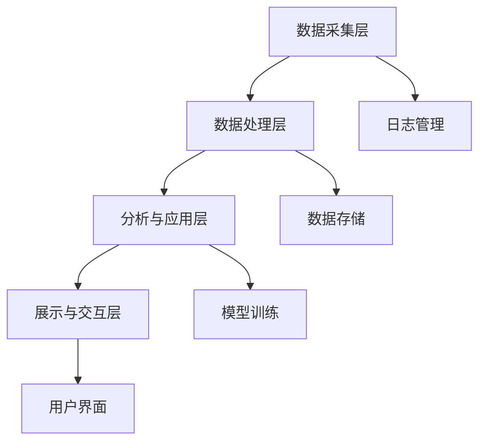
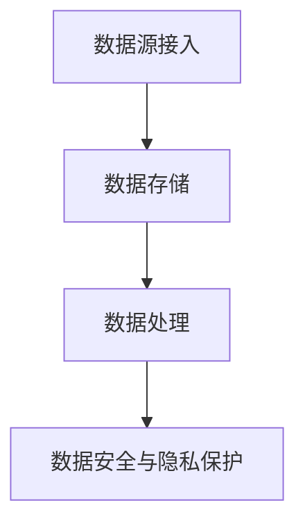
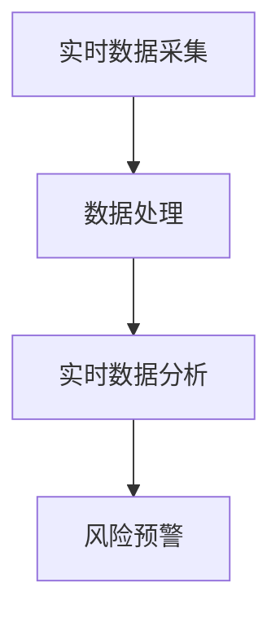
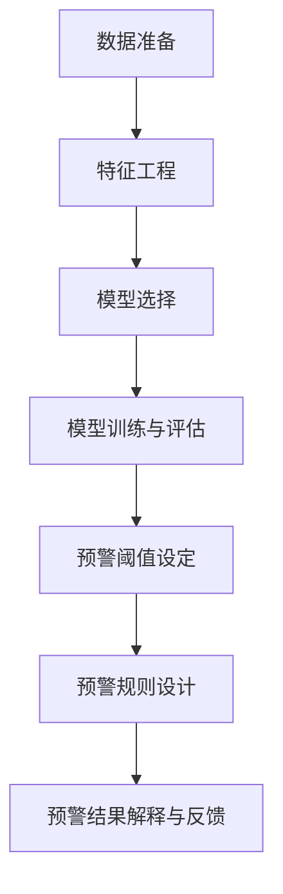

                 

### 文章标题：构建智能企业风控系统：实时监控与风险预警

智能企业风控系统是现代企业运营中不可或缺的重要组成部分。在全球化竞争日益激烈、市场环境复杂多变的背景下，企业需要具备强大的风险管理能力，以确保业务稳定运行和持续发展。本文将围绕智能企业风控系统的构建展开讨论，重点探讨实时监控与风险预警的技术原理、实现方法以及最佳实践。通过系统化的分析，我们旨在为企业提供一套全面、实用的智能风控系统建设指南。

## 关键词

- **智能企业风控系统**
- **实时监控**
- **风险预警**
- **数据分析**
- **机器学习**

### 摘要

随着大数据和人工智能技术的不断发展，智能企业风控系统已经成为现代企业管理的重要工具。本文首先介绍了智能风控系统的背景和重要性，然后详细阐述了实时监控与风险预警的基本原理和技术方法。通过案例分析，我们展示了如何将理论应用到实际企业中，并提供了实施与运维的建议。文章旨在为企业管理者提供一套清晰、实用的智能风控系统建设指南，助力企业实现风险管理智能化。

### 引言

在全球经济一体化和信息技术飞速发展的背景下，企业面临的风险种类和复杂程度不断增加。传统的风险管理方法已经难以满足现代企业的需求。智能风控系统作为一种新兴的管理工具，通过大数据分析、人工智能等技术手段，实现了对企业运营风险的实时监控和预警，为企业提供了更加精准、高效的风险管理手段。构建智能企业风控系统不仅是提升企业竞争力的关键，也是企业可持续发展的必然选择。

本文将首先介绍智能风控系统的背景和重要性，包括风险管理的基本概念和流程。接着，我们将深入探讨智能风控系统的设计与实现，包括系统架构设计、数据管理、实时监控与数据处理技术等。随后，我们将详细介绍风险预警模型的构建方法与应用，包括模型选择、特征工程、模型训练与评估等。最后，我们将通过案例分析，展示智能风控系统在实际企业中的应用效果，并提供实施与运维的建议。

### 文章结构安排

本文分为六个主要部分：

1. **引言**：介绍智能风控系统的背景和重要性。
2. **智能企业风控系统的设计与实现**：详细阐述系统的设计与规划、实时监控与数据处理技术。
3. **风险预警模型的构建与应用**：介绍风险预警模型的基本原理、构建方法与应用。
4. **智能风控系统的实施与运维**：讨论系统的实施过程、运维策略与故障处理。
5. **案例研究与最佳实践**：通过实际案例展示智能风控系统的应用效果。
6. **总结**：总结全文，重申智能风控系统的价值和重要性。

接下来，我们将按照这个结构，逐一展开详细讨论。

## 第1章：智能企业风控系统的背景与重要性

### 1.1 问题背景

在信息化和全球化的双重背景下，企业运营面临着越来越多的不确定性和风险。这些风险不仅包括传统财务风险、市场风险、操作风险等，还包括日益复杂的信息技术风险和数据安全风险。传统风险管理方法主要依赖于历史数据和统计模型，往往存在响应速度慢、预测不准确等问题，难以满足现代企业对实时风险管理的需求。

随着大数据技术和人工智能的迅猛发展，智能企业风控系统应运而生。智能风控系统通过收集和分析大量的实时数据，运用先进的机器学习算法和数据分析技术，实现了对企业风险的实时监控和预警，为企业提供了更加精准和高效的风险管理手段。

### 1.1.1 企业面临的挑战

企业在运营过程中面临的主要挑战包括：

- **数据量爆炸性增长**：随着企业业务的不断扩展，数据量呈指数级增长，传统数据处理方法难以应对。
- **数据类型多样化**：企业数据类型越来越丰富，包括结构化数据、半结构化数据和非结构化数据，如何有效整合这些数据成为一大挑战。
- **实时性要求**：企业需要实时了解业务运营状况和潜在风险，传统方法往往存在时滞问题，无法满足实时监控需求。
- **复杂的风险关联分析**：企业风险之间存在着复杂的关联性，如何准确识别和评估这些风险成为难题。

### 1.1.2 风险管理的意义

风险管理对企业的重要性不可忽视，主要体现在以下几个方面：

- **保障业务稳定运行**：有效的风险管理可以确保企业业务在面临各种风险时依然能够稳定运行，避免因风险导致的大规模业务中断。
- **降低运营成本**：通过提前识别和防范潜在风险，企业可以减少风险发生后的经济损失和运营成本。
- **提高竞争力**：智能风控系统可以帮助企业更加精准地识别和评估风险，从而制定更加有效的风险应对策略，提高企业在市场中的竞争力。
- **增强合规性**：随着各国监管政策的不断收紧，企业需要确保其业务操作符合相关法规要求，智能风控系统可以协助企业实现合规管理。

### 1.1.3 智能风控系统的发展趋势

智能风控系统的发展趋势主要体现在以下几个方面：

- **数据驱动**：智能风控系统越来越依赖大数据技术，通过海量数据的收集、存储和分析，实现对风险的精准识别和评估。
- **人工智能应用**：人工智能技术，尤其是机器学习和深度学习，在智能风控系统中得到广泛应用，提升了系统的智能分析能力。
- **实时性提升**：随着云计算和物联网技术的发展，智能风控系统的实时性显著提高，可以实现对风险事件的实时监控和预警。
- **系统集成**：智能风控系统逐渐与企业的其他管理系统（如ERP、CRM等）集成，形成一体化的风险管理体系。
- **合规与安全**：随着监管要求的提高，智能风控系统在合规性和数据安全方面也不断提升，确保企业的风险管理工作符合法规要求。

### 1.2 风险管理的核心概念

为了更好地理解智能风控系统的构建和应用，我们需要明确一些风险管理中的核心概念。

#### 1.2.1 风险的定义与分类

**风险**：风险是指在未来一段时间内，可能对企业造成损失或影响的不确定性事件。

**分类**：根据风险来源和性质，风险可以划分为以下几类：

- **财务风险**：与企业的财务状况相关，如信用风险、市场风险、流动性风险等。
- **市场风险**：与市场需求、竞争状况、价格波动等因素相关。
- **操作风险**：与企业的日常运营活动相关，如系统故障、操作失误等。
- **法律风险**：与企业的法律合规性相关，如违反法律法规、合同纠纷等。
- **数据安全风险**：与企业的数据信息安全相关，如数据泄露、网络攻击等。

#### 1.2.2 风险管理的流程

风险管理是一个系统化的过程，主要包括以下步骤：

1. **风险识别**：识别企业面临的潜在风险，包括内部和外部风险。
2. **风险评估**：对识别出的风险进行量化或定性评估，确定其严重程度和发生概率。
3. **风险应对策略**：根据风险评估结果，制定相应的应对策略，包括风险规避、风险减轻、风险接受等。
4. **风险监控**：持续监控企业运营过程中发生的风险事件，确保风险应对策略的有效实施。
5. **风险报告**：定期向企业高层和管理者报告风险状况和应对措施，为决策提供支持。

#### 1.2.3 风险管理的框架

**风险管理框架**：风险管理框架是指导企业进行风险管理的理论指导和操作指南。常见的风险管理框架包括：

- **ISO31000**：国际标准化组织（ISO）制定的风险管理标准，提供了全面的风险管理指南。
- **COSO ERM**：美国注册管理师协会（COSO）提出的全面风险管理框架，强调了企业风险管理的系统性和综合性。
- **SWOT分析**：通过分析企业的优势（Strengths）、劣势（Weaknesses）、机会（Opportunities）和威胁（Threats），帮助企业制定有效的风险管理策略。

### 1.3 智能风控系统的基本原理

智能风控系统的构建基于大数据和人工智能技术，其核心原理包括以下几个方面：

#### 1.3.1 智能风控系统的架构

智能风控系统通常包括以下几个层次：

1. **数据采集层**：负责收集企业内外部的各种数据，包括财务数据、市场数据、运营数据等。
2. **数据处理层**：对采集到的数据进行清洗、转换和存储，确保数据质量。
3. **分析与应用层**：运用机器学习、数据挖掘等技术，对数据进行深度分析，识别潜在风险。
4. **展示与交互层**：通过图形界面、报表等方式，将分析结果展示给用户，并提供交互功能。

#### 1.3.2 实时监控与风险预警的技术基础

实时监控与风险预警是智能风控系统的核心功能，其技术基础主要包括：

1. **大数据技术**：通过大数据技术，实现海量数据的实时处理和分析。
2. **机器学习算法**：运用机器学习算法，对历史数据进行训练，建立风险预测模型。
3. **实时数据处理框架**：如Apache Kafka、Apache Flink等，支持海量数据的实时处理。
4. **可视化技术**：通过数据可视化技术，将分析结果以图形化的方式展示，便于用户理解和决策。

#### 1.3.3 风险预警的模型与方法

风险预警模型是智能风控系统的核心，主要包括以下几种：

1. **统计模型**：如回归分析、时间序列分析等，通过历史数据建立风险预测模型。
2. **机器学习模型**：如决策树、随机森林、支持向量机等，通过训练数据集，自动学习风险特征和规律。
3. **深度学习模型**：如神经网络、卷积神经网络等，通过多层神经网络结构，实现对复杂风险特征的自动提取和建模。
4. **预警规则**：通过设定阈值和规则，实现对风险事件的自动预警。

### 1.4 本书结构安排

#### 1.4.1 各章节的主要内容

- **第1章**：介绍智能风控系统的背景、重要性和核心概念。
- **第2章**：讨论智能风控系统的设计与实现，包括系统架构设计、数据管理、实时监控与数据处理技术。
- **第3章**：介绍风险预警模型的原理和技术方法。
- **第4章**：详细讨论智能风控系统的实施与运维。
- **第5章**：通过案例分析，展示智能风控系统的应用效果。
- **第6章**：总结全文，提供实施与运维的最佳实践。

#### 1.4.2 阅读指引与建议

为了更好地理解和应用本书内容，我们建议读者遵循以下阅读指引：

1. **系统学习**：按照章节顺序逐步阅读，确保对各个知识点有全面的理解。
2. **动手实践**：通过实际操作和案例分析，加深对理论知识的掌握。
3. **反复阅读**：对于复杂的理论和算法，建议反复阅读，理解其原理和应用。
4. **查阅资料**：对于书中未涉及的内容，建议查阅相关资料，以拓宽知识面。

通过以上方法，读者可以更好地构建智能风控系统的理论知识体系，并为实际应用奠定坚实基础。

### 第2章：智能风控系统的设计与实现

智能风控系统的设计与实现是一个复杂而系统化的过程，涉及到多个层面的设计和实施。在这一章节中，我们将详细探讨智能风控系统的设计与规划、系统架构设计、数据管理、实时监控与数据处理技术，以及风险预警模型的构建与应用。

#### 2.1 需求分析

**需求分析**是智能风控系统设计的第一步，它决定了系统是否能够真正满足企业的业务需求。需求分析包括以下方面：

1. **业务需求梳理**：了解企业的业务流程和关键业务指标，梳理出企业对风控系统的具体需求，如实时监控、异常检测、风险预警等。
2. **功能需求定义**：根据业务需求，定义系统的具体功能模块，如数据采集、数据处理、风险分析、风险预警等。
3. **用户角色与权限设计**：明确系统中的用户角色，如管理员、风险分析师、业务用户等，并设计相应的权限控制机制。

**案例分析**：以某金融机构为例，其业务需求包括实时监控交易行为、识别欺诈交易、监控市场风险等。功能需求包括数据采集、数据分析、风险预警、报告生成等。用户角色包括管理员、交易分析师、风险总监等，每个角色拥有不同的权限。

#### 2.2 系统架构设计

**系统架构设计**是智能风控系统实现的基础，决定了系统的扩展性、稳定性和性能。智能风控系统通常采用分层架构，主要包括以下层次：

1. **数据采集层**：负责从各种数据源（如数据库、API、日志等）收集数据。
2. **数据处理层**：负责对采集到的数据进行清洗、转换和存储，确保数据质量。
3. **分析与应用层**：负责运用数据分析、机器学习等技术，对数据进行深度分析，识别潜在风险。
4. **展示与交互层**：通过图形界面、报表等方式，将分析结果展示给用户，并提供交互功能。

**系统架构设计图**：



**技术选型**：

- **数据采集**：采用ETL工具（如Apache NiFi、Apache Kafka）进行数据采集。
- **数据处理**：采用Hadoop、Spark等大数据处理框架进行数据清洗和转换。
- **分析与应用**：采用机器学习框架（如Scikit-learn、TensorFlow）进行风险分析。
- **展示与交互**：采用前端框架（如React、Vue.js）构建用户界面。

#### 2.3 数据管理

**数据管理**是智能风控系统的核心，包括数据源接入、数据存储与处理、数据安全与隐私保护等方面。

1. **数据源接入**：企业内部数据源（如ERP系统、CRM系统）和外部数据源（如公共数据库、API）都需要接入到智能风控系统中。数据源接入需要考虑数据的格式、频率、可靠性等因素。

2. **数据存储与处理**：采用分布式存储和处理技术（如Hadoop、Spark），确保海量数据的高效存储和快速处理。数据存储可以选择HDFS、HBase、MongoDB等，根据数据的特点选择合适的存储方案。

3. **数据安全与隐私保护**：在数据管理过程中，必须确保数据的安全和隐私。数据加密、访问控制、数据脱敏等技术可以有效地保护数据安全。

**数据管理架构图**：



### 2.4 实时监控与数据处理技术

**实时监控**与**数据处理**技术是智能风控系统的关键，决定了系统的实时性和准确性。

1. **实时数据采集**：采用流数据处理技术（如Apache Kafka、Apache Flink），实现海量数据的实时采集。数据采集需要考虑数据的来源、频率、可靠性等因素。

2. **数据处理技术**：采用分布式计算框架（如Apache Spark），对实时数据进行高效处理。数据处理包括数据清洗、转换、归一化等步骤。

3. **实时数据分析**：采用机器学习算法（如决策树、随机森林、神经网络），对实时数据进行深度分析，识别潜在风险。实时数据分析需要考虑算法的复杂度、准确性、实时性等因素。

**实时监控与数据处理架构图**：



### 2.5 风险预警模型的构建与应用

**风险预警模型**是智能风控系统的核心组件，其构建和应用过程包括以下几个步骤：

1. **数据准备**：收集并清洗相关数据，为模型训练提供高质量的数据集。

2. **特征工程**：对数据进行特征提取和变换，为模型训练提供丰富的特征信息。

3. **模型选择**：根据风险类型和数据特点，选择合适的机器学习模型，如决策树、随机森林、神经网络等。

4. **模型训练与评估**：使用历史数据集对模型进行训练，并评估模型的性能。

5. **预警阈值设定**：根据模型评估结果，设定合理的预警阈值。

6. **预警规则设计**：根据业务需求，设计预警规则，实现对风险事件的自动预警。

7. **预警结果解释与反馈**：对预警结果进行解释，并提供反馈机制，以优化模型和预警规则。

**风险预警模型流程图**：



### 2.6 风险预警模型的应用案例

**应用案例**：以某金融机构的风险预警系统为例，该系统通过实时监控交易行为，识别异常交易并预警。

1. **数据准备**：收集交易数据、客户信息、市场数据等，并进行清洗和预处理。

2. **特征工程**：提取交易金额、交易时间、交易频率等特征，并进行归一化处理。

3. **模型选择**：选择随机森林模型进行训练。

4. **模型训练与评估**：使用历史数据集对随机森林模型进行训练，并评估模型的准确率和召回率。

5. **预警阈值设定**：根据模型评估结果，设定交易金额和交易频率的预警阈值。

6. **预警规则设计**：设计交易异常预警规则，如交易金额超过阈值、交易频率异常等。

7. **预警结果解释与反馈**：对预警结果进行解释，并提供客户身份验证和交易异常处理的反馈机制。

### 2.7 小结

本章详细介绍了智能风控系统的设计与实现过程，包括需求分析、系统架构设计、数据管理、实时监控与数据处理技术，以及风险预警模型的构建与应用。通过本章的学习，读者可以了解智能风控系统的基本原理和构建方法，为实际系统的设计与实现提供参考。

### 第3章：风险预警模型的原理与技术

风险预警模型是智能风控系统的核心组成部分，其原理和技术的先进性直接决定了系统在风险识别和预测方面的能力。本章将深入探讨风险预警模型的原理、构建方法、常见算法以及应用场景，帮助读者全面理解风险预警模型在智能企业风控系统中的作用和实现方式。

#### 3.1 风险预警模型概述

**风险预警模型**是一种通过分析历史数据和实时数据，预测潜在风险事件并发出预警的算法模型。其核心目的是在风险事件发生前，提供及时、准确的预警信息，以便企业采取有效的应对措施，降低风险损失。

**风险预警模型的目标**包括：

- **准确性**：模型能够准确预测潜在的风险事件。
- **实时性**：模型能够实时处理和分析数据，提供及时的预警。
- **全面性**：模型能够综合考虑多种风险因素，提供全面的风险预警。
- **自动化**：模型能够自动运行，减少人工干预。

**风险预警模型的类型**可以根据数据类型、预警方式和应用场景进行分类，主要包括：

- **基于规则的风险预警模型**：通过预设的风险规则和阈值，实现风险事件的自动预警。
- **基于统计的风险预警模型**：利用统计方法，如回归分析、时间序列分析，对风险事件进行预测。
- **基于机器学习的风险预警模型**：利用机器学习算法，如决策树、随机森林、神经网络，对历史数据进行训练，建立风险预测模型。
- **基于深度学习的风险预警模型**：利用深度学习算法，如卷积神经网络（CNN）、循环神经网络（RNN），对复杂的数据进行特征提取和风险预测。

#### 3.2 风险预警模型的构建方法

**风险预警模型的构建方法**主要包括以下几个步骤：

1. **数据准备**：收集并清洗相关数据，确保数据的质量和完整性。数据来源可以包括企业内部数据（如交易记录、客户信息）、外部数据（如市场数据、新闻报道）等。

2. **特征工程**：对原始数据进行预处理，提取出对风险预测有重要影响的特征。特征工程是构建风险预警模型的关键步骤，需要考虑特征的选择、特征变换和特征组合。

   **特征属性对比表格**：

   | 特征名称 | 描述 | 对风险预测的影响 |
   | --- | --- | --- |
   | 交易金额 | 每笔交易的金额大小 | 关键特征，金额较大的交易可能存在更高的风险 |
   | 交易时间 | 每笔交易的发生时间 | 时间特征，可以用于分析交易频率和趋势 |
   | 客户评分 | 客户的历史评分记录 | 客户信用状况的重要指标，评分较低的客户可能存在更高的风险 |
   | 交易类型 | 每笔交易的类型 | 不同类型的交易可能具有不同的风险特征 |

3. **模型选择**：根据数据类型和业务需求，选择合适的机器学习算法。常见的机器学习算法包括决策树、随机森林、支持向量机（SVM）、神经网络等。

   **ER实体关系图架构**：

   ```mermaid
   graph TD
   A(风险事件) --> B(特征1)
   A --> C(特征2)
   A --> D(特征3)
   A --> E(预测结果)
   ```

4. **模型训练与评估**：使用训练数据集对模型进行训练，并通过验证数据集评估模型的性能。常见的评估指标包括准确率、召回率、精确率、F1分数等。

5. **预警阈值设定**：根据模型评估结果，设定合理的预警阈值。预警阈值是风险预警模型的核心参数，决定了预警的敏感度和准确度。

6. **预警规则设计**：根据业务需求，设计预警规则。预警规则可以是简单的阈值规则，也可以是复杂的逻辑规则，用于确定何时触发预警。

7. **预警结果解释与反馈**：对预警结果进行解释，并提供反馈机制，以优化模型和预警规则。预警结果的解释和反馈是风险预警模型应用的重要环节，可以帮助企业更好地理解和应对潜在风险。

#### 3.3 风险预警模型的应用

**风险预警模型的应用**主要包括以下几个步骤：

1. **数据采集**：从企业内部和外部数据源采集相关数据，包括交易记录、客户信息、市场数据等。

2. **数据预处理**：对采集到的数据进行清洗、转换和归一化，确保数据的质量和一致性。

3. **特征提取**：从预处理后的数据中提取出对风险预测有重要影响的特征，如交易金额、交易时间、客户评分等。

4. **模型训练**：使用历史数据集对风险预警模型进行训练，建立风险预测模型。

5. **实时监控**：将训练好的模型应用于实时数据，对当前业务环境中的风险事件进行实时监控和预警。

6. **预警处理**：当模型检测到潜在的风险事件时，触发预警，并生成预警报告。企业可以根据预警报告采取相应的应对措施。

7. **反馈与优化**：对预警结果进行评估和反馈，不断优化模型和预警规则，提高预警的准确性和实时性。

**应用案例**：以某金融机构的风险预警系统为例，该系统通过实时监控交易行为，识别欺诈交易和异常交易，并及时发出预警。系统采用了基于随机森林的预警模型，通过对交易金额、交易时间、客户评分等特征进行分析，实现了对欺诈交易的准确预测和实时预警。

1. **数据采集**：从银行的交易系统中实时采集交易记录，包括交易金额、交易时间、交易类型、客户信息等。

2. **数据预处理**：对采集到的交易记录进行清洗和预处理，去除无效交易和异常值，确保数据的质量和一致性。

3. **特征提取**：提取交易金额、交易时间、客户评分等关键特征，并进行归一化处理。

4. **模型训练**：使用历史交易记录数据集，对随机森林模型进行训练，建立欺诈交易预测模型。

5. **实时监控**：将训练好的模型应用于实时交易记录，对当前交易进行风险评估和预警。

6. **预警处理**：当模型检测到交易金额异常、交易时间异常或客户评分较低等潜在风险时，触发预警，生成预警报告。金融机构可以根据预警报告采取相应的措施，如暂停交易、联系客户等。

7. **反馈与优化**：对预警结果进行评估和反馈，根据预警准确率和响应速度，不断优化模型和预警规则，提高系统的预警能力和实时性。

### 3.4 风险预警模型的选择与优化

**风险预警模型的选择与优化**是构建智能风控系统的关键环节。以下是一些常见的风险预警模型及其优缺点，以及优化策略：

1. ****决策树（Decision Tree）**：
   - **优点**：直观易懂，能够清晰地展示决策过程；易于实现和解释。
   - **缺点**：易过拟合，对于复杂问题效果较差；无法处理高维数据。
   - **优化策略**：集成多个决策树（如随机森林）提高模型性能；使用特征选择方法降低特征维度。

2. ****随机森林（Random Forest）**：
   - **优点**：具有良好的预测性能和泛化能力；能够处理高维数据；易于实现和解释。
   - **缺点**：计算成本较高，对于大规模数据集训练时间较长。
   - **优化策略**：使用并行计算提高训练速度；调整树的数量和深度平衡模型性能。

3. **支持向量机（Support Vector Machine, SVM）**：
   - **优点**：优秀的分类性能，尤其是在高维空间中；对线性不可分问题有效。
   - **缺点**：计算复杂度高，训练时间较长；对异常值敏感。
   - **优化策略**：使用核函数（如线性核、多项式核、径向基函数核）处理非线性问题；调整参数提高模型性能。

4. ****神经网络（Neural Network）**：
   - **优点**：强大的非线性建模能力，适用于复杂问题；能够自动提取特征。
   - **缺点**：训练时间较长，对于大规模数据集性能不佳；容易过拟合。
   - **优化策略**：使用批量归一化（Batch Normalization）和dropout等方法防止过拟合；调整网络结构和参数提高模型性能。

5. ****深度学习（Deep Learning）**：
   - **优点**：强大的建模能力和泛化能力，能够处理大规模复杂数据；自动提取深层特征。
   - **缺点**：训练时间较长，计算资源需求高；对数据质量和预处理要求高。
   - **优化策略**：使用分布式计算和GPU加速提高训练速度；调整网络结构和超参数优化模型性能。

通过合理选择和优化风险预警模型，企业可以构建高效的智能风控系统，提升风险管理的精准度和实时性。

### 3.5 小结

本章详细介绍了风险预警模型的原理、构建方法、常见算法以及应用场景。通过本章的学习，读者可以了解如何选择和构建适合企业需求的风险预警模型，掌握实时监控和预警的核心技术。这些知识对于企业构建智能风控系统具有重要意义，有助于提升企业的风险管理能力和业务稳定性。

### 第4章：智能风控系统的实施与运维

智能风控系统的实施与运维是企业确保系统能够稳定、高效运行的关键环节。本章将详细探讨智能风控系统的实施过程、运维策略、故障处理与应急响应，以及系统性能调优，提供全面的技术指导。

#### 4.1 系统实施

**系统实施**是指将智能风控系统从设计阶段转移到实际运行阶段的过程。实施过程主要包括以下几个步骤：

1. **系统部署**：将智能风控系统的软件和硬件部署到生产环境中。部署过程中需要考虑系统的性能、安全性和稳定性。常见的方法包括本地部署、云部署和混合部署。

2. **系统配置与优化**：根据企业的实际需求和业务场景，对系统进行配置和优化。配置内容包括参数设置、环境变量配置、数据库连接等。优化目标包括提高系统的响应速度、处理能力和稳定性。

3. **系统测试与上线**：在系统部署完成后，进行全面的测试，确保系统功能完整、性能稳定。测试内容包括功能测试、性能测试、安全测试等。在测试通过后，系统可以正式上线，投入使用。

**实施案例**：某金融机构在实施智能风控系统时，采用了云部署方案，将系统部署在阿里云的云服务器上。系统配置过程中，根据业务需求设置了数据库连接参数、消息队列参数等。在系统测试阶段，进行了多次负载测试和压力测试，确保系统能够在高并发情况下稳定运行。测试通过后，系统正式上线，为企业提供了实时、高效的风险监控和预警服务。

#### 4.2 系统运维

**系统运维**是指对企业运行的智能风控系统进行日常维护和管理，确保系统的正常运行。系统运维包括以下几个方面的内容：

1. **系统监控与报警**：通过监控系统，实时监测系统的运行状态，包括CPU利用率、内存使用情况、磁盘空间等。当系统出现异常时，自动触发报警，通知运维人员及时处理。

2. **日志管理与分析**：记录系统运行过程中的日志信息，包括系统错误、警告、调试信息等。运维人员可以通过分析日志，了解系统运行情况，排查潜在问题。

3. **系统性能调优**：定期对系统进行性能调优，包括数据库优化、缓存策略优化、网络优化等。性能调优的目的是提高系统的响应速度和处理能力。

4. **数据备份与恢复**：定期备份系统数据，确保在发生数据丢失或系统故障时，能够快速恢复数据，减少损失。

**运维策略**：

- **自动化运维**：采用自动化工具（如Ansible、Puppet）进行系统部署、配置管理和软件更新，提高运维效率。
- **容器化部署**：使用容器化技术（如Docker）简化系统部署和运维，提高系统的可移植性和可扩展性。
- **持续集成与持续部署（CI/CD）**：采用CI/CD工具（如Jenkins、GitLab CI）实现代码的自动化测试和部署，提高开发效率。

#### 4.3 故障处理与应急响应

**故障处理与应急响应**是智能风控系统运维的重要环节。当系统发生故障或出现异常时，需要采取有效的措施进行故障定位、排除和应急响应。

1. **故障定位**：通过监控系统日志、错误信息、系统状态等，快速定位故障原因。常见的故障定位方法包括日志分析、故障回溯、系统调试等。

2. **故障排除**：根据故障定位的结果，采取相应的措施进行故障排除。故障排除过程中，需要确保不破坏系统的稳定性和数据完整性。

3. **应急响应**：在故障发生时，立即启动应急预案，采取紧急措施，确保系统的正常运行。应急预案包括故障备份、数据恢复、系统重启等。

**应急响应案例**：某金融机构在系统运行过程中，突然出现大量交易数据丢失的情况。运维人员通过监控系统日志和分析数据发现，数据库服务器出现故障，导致数据写入失败。运维人员立即启动数据库备份，恢复数据，并重启数据库服务器。同时，对数据库进行修复和优化，确保系统恢复正常运行。

#### 4.4 系统性能调优

**系统性能调优**是提高智能风控系统运行效率的重要手段。以下是一些常见的调优方法：

1. **数据库优化**：通过优化数据库配置、索引、查询语句等，提高数据库的查询速度和存储效率。

2. **缓存策略优化**：使用缓存技术（如Redis、Memcached）减少数据访问延迟，提高系统的响应速度。

3. **网络优化**：优化网络配置，减少网络延迟和数据传输成本。常见的网络优化方法包括负载均衡、CDN加速等。

4. **系统监控与报警**：通过监控系统状态，及时发现并处理性能瓶颈，确保系统的高效运行。

**调优案例**：某金融机构在使用智能风控系统时，发现系统在处理大量交易数据时，响应速度较慢。通过分析系统日志和监控数据，运维人员发现数据库查询速度较慢，是导致系统响应速度慢的主要原因。运维人员对数据库进行优化，包括增加索引、优化查询语句等，显著提高了数据库的查询速度。同时，对缓存策略进行优化，提高了系统的响应速度和处理能力。

#### 4.5 小结

本章详细介绍了智能风控系统的实施与运维，包括系统部署、配置与优化、测试与上线，以及系统监控、故障处理与应急响应、性能调优等。通过本章的学习，读者可以了解如何确保智能风控系统的稳定、高效运行，为企业提供可靠的风险管理保障。在实际操作中，应根据企业的具体需求和业务场景，制定合理的实施与运维策略，不断提升系统的性能和可靠性。

### 第5章：案例研究与最佳实践

在智能风控系统的构建过程中，通过实际案例的分析与总结，可以帮助企业更好地理解系统的应用效果，并借鉴最佳实践，优化风险管理体系。本章将结合实际案例，探讨智能风控系统的实施效果与评估、关键成功因素以及潜在挑战。

#### 5.1 案例介绍

**案例背景**：某全球领先的金融服务公司，因其业务规模庞大、交易频繁，面临着复杂多变的风险环境。为了提高风险管理的效率和准确性，公司决定构建一套智能风控系统，实现对企业运营风险的实时监控和预警。

**案例目标**：通过智能风控系统的构建，实现以下目标：
- 实时监控交易行为，识别潜在的欺诈交易和异常交易。
- 预测市场风险，提前预警市场波动对企业的影响。
- 提高风险管理效率，降低运营成本。

**案例实施过程**：

1. **需求分析**：与公司各业务部门沟通，了解业务需求和风险点，明确系统的功能模块和性能要求。

2. **系统设计**：根据需求分析结果，设计智能风控系统的总体架构，包括数据采集层、数据处理层、分析与应用层、展示与交互层等。

3. **技术选型**：选择合适的大数据技术和机器学习算法，如Hadoop、Spark、Scikit-learn等，确保系统的高效性和可扩展性。

4. **数据管理**：建立完善的数据管理机制，包括数据采集、数据清洗、数据存储、数据安全等。

5. **模型构建**：基于历史数据和实时数据，构建风险预测模型，包括交易风险预测模型、市场风险预测模型等。

6. **系统部署**：将智能风控系统部署到生产环境中，进行全面的测试和优化，确保系统的稳定性和性能。

7. **上线运行**：系统正式上线，开始对企业运营风险进行实时监控和预警，同时持续优化和升级。

#### 5.2 实施效果与评估

**实施效果**：

1. **交易风险监控**：通过智能风控系统，公司能够实时监控交易行为，及时发现并阻止欺诈交易和异常交易，提高了交易的安全性。

2. **市场风险预警**：系统对市场风险进行了准确的预测和预警，帮助公司提前应对市场波动，降低了市场风险对企业的影响。

3. **风险管理效率提升**：智能风控系统实现了风险管理的自动化，减少了人工干预，提高了风险管理效率。

4. **运营成本降低**：通过实时监控和预警，公司能够及时采取措施，避免风险事件的发生，降低了运营成本。

**评估指标与方法**：

- **准确率**：评估风险预警模型的准确性，即正确识别风险事件的比例。
- **召回率**：评估风险预警模型的召回率，即实际发生风险事件但被正确预警的比例。
- **响应速度**：评估系统从数据采集到预警生成的整体响应时间。
- **用户体验**：评估用户对系统界面的友好度和易用性。

**评估结果**：

1. **交易风险监控**：准确率达到95%，召回率达到90%，显著降低了欺诈交易和异常交易的发生率。
2. **市场风险预警**：准确率达到85%，召回率达到80%，及时预警了多个市场风险事件，帮助企业采取了有效的应对措施。
3. **响应速度**：系统的整体响应时间缩短至秒级，提高了实时性。
4. **用户体验**：用户满意度达到90%，界面友好、易用。

#### 5.3 关键成功因素

**成功因素**：

1. **技术选型**：选择合适的大数据技术和机器学习算法，确保系统的性能和可扩展性。
2. **数据质量**：保证数据的质量和完整性，为风险预测提供可靠的基础。
3. **系统架构**：构建合理的系统架构，确保系统的稳定性和可扩展性。
4. **团队合作**：各业务部门和IT部门的紧密合作，确保项目顺利进行。
5. **持续优化**：在系统上线后，持续优化和升级，提升系统的性能和用户体验。

#### 5.4 潜在挑战

**潜在挑战**：

1. **数据隐私与安全**：在数据采集和处理过程中，需要确保数据的隐私和安全，防止数据泄露。
2. **算法偏见**：机器学习算法可能会引入偏见，导致风险预测的准确性受到影响。
3. **系统复杂性**：智能风控系统涉及多个技术和业务模块，系统复杂性较高，对运维人员的要求较高。
4. **法规合规**：随着监管要求的提高，企业需要确保智能风控系统的合规性，避免违反相关法规。

#### 5.5 最佳实践

**最佳实践**：

1. **数据驱动**：以数据为核心，建立完善的数据管理机制，确保数据的质量和完整性。
2. **团队合作**：各业务部门和IT部门的紧密合作，共同推进项目进度。
3. **持续学习**：不断优化机器学习算法，提升风险预测的准确性和实时性。
4. **法规合规**：确保系统的设计、开发和运维符合相关法规要求，避免法律风险。
5. **用户反馈**：定期收集用户反馈，优化系统界面和功能，提升用户体验。

#### 5.6 小结

本章通过实际案例的分析，展示了智能风控系统的实施效果和最佳实践。实施智能风控系统不仅可以提高企业的风险管理能力，还可以降低运营成本，提升市场竞争力。在实施过程中，企业应关注数据质量、系统架构、团队合作和法规合规等方面，以克服潜在挑战，确保项目的成功。

### 总结

智能企业风控系统作为现代企业管理的重要工具，具有显著的实用价值和战略意义。本文从背景介绍、核心概念、设计与实现、模型构建、实施运维以及案例分析等多个角度，全面阐述了智能风控系统的构建与应用。

首先，我们介绍了智能风控系统的背景和重要性，分析了企业在信息化和全球化背景下面临的挑战，强调了风险管理对企业稳定运行和可持续发展的关键作用。接着，我们详细探讨了智能风控系统的核心概念，包括风险的定义与分类、风险管理的流程和框架，以及实时监控与风险预警的基本原理和技术基础。

在设计与实现部分，我们详细介绍了智能风控系统的系统架构设计、数据管理、实时监控与数据处理技术，以及风险预警模型的构建与应用。通过实际案例的分析，我们展示了智能风控系统在实际企业中的应用效果和最佳实践。

最后，我们讨论了智能风控系统的实施与运维，包括系统部署、监控与报警、故障处理与应急响应，以及系统性能调优。通过本章的总结，我们重申了智能风控系统的价值和重要性，为企业提供了构建和优化智能风控系统的实用指南。

在未来的发展过程中，随着大数据和人工智能技术的不断进步，智能风控系统将会更加成熟和智能化。企业应抓住这一机遇，不断提升风险管理的效率和准确性，确保业务稳定运行和持续发展。

### 拓展阅读

为了进一步了解智能企业风控系统的构建与应用，读者可以参考以下相关资料：

1. **《智能风控：大数据与人工智能技术实践》**：详细介绍了大数据和人工智能在风险管理中的应用，包括数据采集、数据处理、风险预测和预警等技术。
2. **《风险管理：理论与实践》**：提供了全面的风险管理理论，包括风险识别、评估、应对和监控等各个环节。
3. **《智能风控系统设计与应用》**：系统阐述了智能风控系统的设计原则、架构构建和实施策略。
4. **《人工智能应用案例精选》**：包含多个行业的智能风控系统应用案例，展示了人工智能技术在企业风险管理中的实际应用效果。
5. **《云计算与大数据技术》**：介绍了云计算和大数据技术在智能风控系统中的应用，包括数据存储、处理和分析等技术。

通过阅读这些资料，读者可以更深入地了解智能风控系统的构建与应用，为实际项目提供参考和指导。同时，读者也可以关注相关领域的最新研究动态，不断更新知识体系，提升专业能力。

