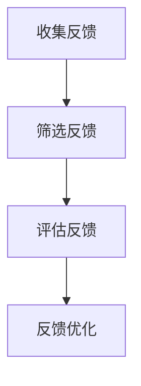
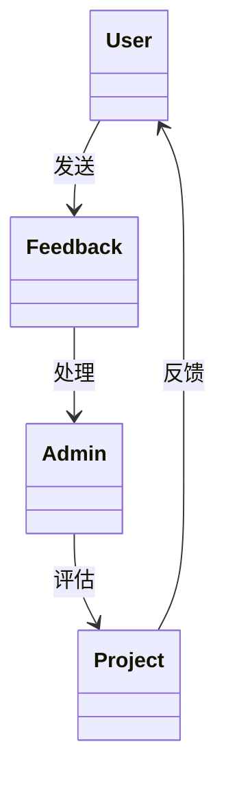
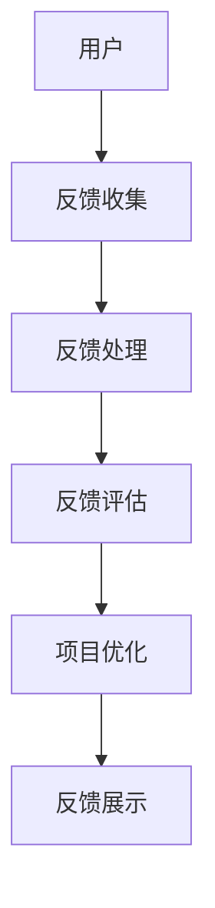
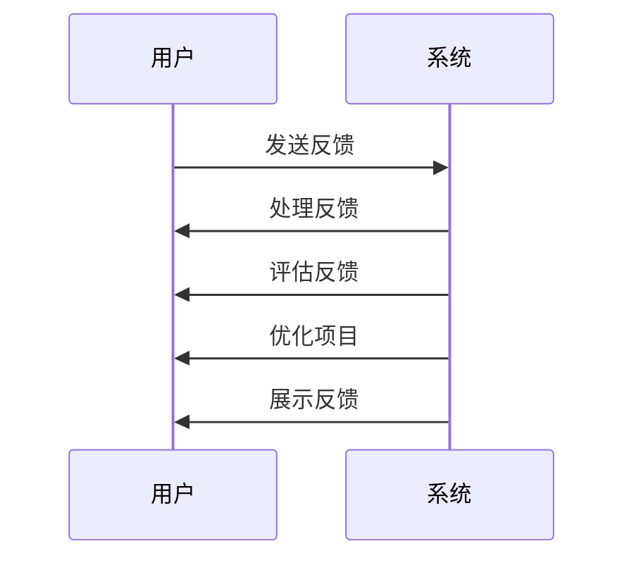

                 


# 构建正向的技术反馈文化

## 关键词

技术反馈、正向反馈、反向反馈、文化建设、算法原理、系统分析、实践应用

## 摘要

本文旨在探讨如何构建正向的技术反馈文化，从核心概念、算法原理、系统架构到实际项目实践，全方位解析技术反馈在组织文化中的重要作用。通过深入分析技术反馈的类型、作用及其与文化的联系，本文提出了构建正向技术反馈文化的策略和方法，旨在提高技术团队的工作效率和创新能力。

## 引言

### 问题背景

在信息技术飞速发展的今天，技术团队面临的挑战日益复杂。技术反馈作为一种有效的沟通手段，对于团队的技术进步和创新至关重要。然而，在实践中，许多团队存在技术反馈机制不健全、反馈效果不佳的问题。这些问题的存在严重影响了团队的工作效率和项目的质量。

### 问题描述

技术反馈机制不完善，导致以下问题：

1. **信息传递不畅**：团队成员之间的沟通不畅，导致技术问题的发现和解决不及时。
2. **反馈质量低下**：技术反馈往往缺乏深度和广度，无法提供有价值的改进建议。
3. **文化氛围不良**：技术团队缺乏正向的反馈文化，导致团队成员对反馈产生抵触情绪。

### 问题解决

为了解决上述问题，我们需要从以下几个方面入手：

1. **建立完善的技术反馈机制**：明确技术反馈的流程、标准和责任人。
2. **提高反馈质量**：通过培训和激励机制，提高团队成员的反馈能力。
3. **建设正向的反馈文化**：营造一个积极、开放、尊重的反馈氛围。

### 边界与外延

本文主要讨论技术反馈在组织文化中的构建和应用，不涉及其他类型的反馈，如市场反馈、用户反馈等。同时，本文关注的是正向反馈，而非反向反馈。

### 核心概念

#### 技术反馈

技术反馈是指团队成员在技术工作过程中，通过沟通交流，对项目的技术问题、设计思路、代码实现等进行评价和指导的过程。

#### 正向反馈

正向反馈是指对项目或团队成员的技术工作给予积极评价、支持和鼓励的反馈。

#### 反向反馈

反向反馈是指对项目或团队成员的技术工作提出批评、建议和改进意见的反馈。

#### 文化建设

文化建设是指通过一系列措施，塑造组织内部的共同价值观、行为规范和工作氛围的过程。

### 1.5.1 技术反馈的定义

技术反馈是一种在技术团队内部进行的技术问题交流和评价机制，旨在促进团队成员之间的沟通、提高项目质量和团队效率。

### 1.5.2 技术反馈的类型

技术反馈可以分为以下几种类型：

1. **正向反馈**：对项目或团队成员的技术工作给予积极评价、支持和鼓励。
2. **反向反馈**：对项目或团队成员的技术工作提出批评、建议和改进意见。
3. **中立反馈**：对项目或团队成员的技术工作不给予评价，但提供建设性的意见和建议。

### 1.5.3 技术反馈的作用

技术反馈在团队中的作用如下：

1. **促进沟通**：通过技术反馈，团队成员可以更好地了解彼此的工作情况和需求，提高沟通效果。
2. **提高质量**：技术反馈可以帮助团队成员发现项目中的问题，并及时进行调整，提高项目质量。
3. **促进学习**：技术反馈可以为团队成员提供学习的机会，促进团队成员之间的知识共享和技能提升。

### 1.5.4 文化建设

文化建设是组织发展的基石，对技术团队尤为重要。一个积极、开放、尊重的反馈文化可以激发团队成员的积极性和创造力，提高团队的整体绩效。

### 1.5.5 建设正向技术反馈文化的关键因素

要建设正向技术反馈文化，需要关注以下几个方面：

1. **领导层的支持**：领导层应高度重视技术反馈，积极倡导和参与技术反馈活动。
2. **反馈机制**：建立完善的反馈机制，明确反馈流程、标准和责任人。
3. **培训与激励**：定期对团队成员进行反馈培训，提高反馈质量。同时，建立激励机制，鼓励团队成员积极参与反馈活动。
4. **开放沟通**：营造一个开放、尊重、包容的沟通氛围，让团队成员敢于表达意见和提出建议。

## 核心概念与联系

### 技术反馈原理

#### 2.1.1 技术反馈的定义

技术反馈是团队成员在技术工作过程中，通过沟通交流，对项目的技术问题、设计思路、代码实现等进行评价和指导的过程。

#### 2.1.2 技术反馈的类型

技术反馈可以分为以下几种类型：

1. **正向反馈**：对项目或团队成员的技术工作给予积极评价、支持和鼓励。
2. **反向反馈**：对项目或团队成员的技术工作提出批评、建议和改进意见。
3. **中立反馈**：对项目或团队成员的技术工作不给予评价，但提供建设性的意见和建议。

#### 2.1.3 技术反馈的作用

技术反馈在团队中的作用如下：

1. **促进沟通**：通过技术反馈，团队成员可以更好地了解彼此的工作情况和需求，提高沟通效果。
2. **提高质量**：技术反馈可以帮助团队成员发现项目中的问题，并及时进行调整，提高项目质量。
3. **促进学习**：技术反馈可以为团队成员提供学习的机会，促进团队成员之间的知识共享和技能提升。

### 正向反馈

#### 2.2.1 正向反馈的概念

正向反馈是指对项目或团队成员的技术工作给予积极评价、支持和鼓励。

#### 2.2.2 正向反馈的特点

正向反馈具有以下特点：

1. **积极性**：正向反馈能够激发团队成员的积极性和创造力。
2. **建设性**：正向反馈能够为团队成员提供改进的方向和建议。
3. **激励性**：正向反馈能够激励团队成员继续努力，提高工作质量。

#### 2.2.3 正向反馈的应用场景

正向反馈适用于以下场景：

1. **项目成功**：在项目取得重要成果时，给予团队成员正向反馈，激励他们继续努力。
2. **个人进步**：在团队成员的技术能力提升时，给予正向反馈，鼓励他们不断成长。
3. **团队协作**：在团队协作过程中，给予团队成员正向反馈，增强团队的凝聚力和合作精神。

### 反向反馈

#### 2.3.1 反向反馈的概念

反向反馈是指对项目或团队成员的技术工作提出批评、建议和改进意见。

#### 2.3.2 反向反馈的特点

反向反馈具有以下特点：

1. **批评性**：反向反馈能够指出项目或团队成员存在的问题和不足。
2. **建设性**：反向反馈能够提供改进的方向和建议。
3. **警示性**：反向反馈能够提醒团队成员注意潜在的风险和问题。

#### 2.3.3 反向反馈的应用场景

反向反馈适用于以下场景：

1. **技术问题**：在项目开发过程中，发现技术问题时，给予反向反馈，帮助团队成员解决问题。
2. **个人不足**：在团队成员的工作中，发现不足时，给予反向反馈，指导他们进行改进。
3. **团队协作**：在团队协作过程中，发现协作问题时，给予反向反馈，促进团队协作的改进。

### 技术反馈与文化的联系

#### 2.4.1 技术反馈在组织文化中的地位

技术反馈是组织文化的重要组成部分，它反映了组织的价值观、行为规范和工作氛围。

#### 2.4.2 建设正向技术反馈文化的关键因素

要建设正向技术反馈文化，需要关注以下几个方面：

1. **领导层的支持**：领导层应高度重视技术反馈，积极倡导和参与技术反馈活动。
2. **反馈机制**：建立完善的反馈机制，明确反馈流程、标准和责任人。
3. **培训与激励**：定期对团队成员进行反馈培训，提高反馈质量。同时，建立激励机制，鼓励团队成员积极参与反馈活动。
4. **开放沟通**：营造一个开放、尊重、包容的沟通氛围，让团队成员敢于表达意见和提出建议。

#### 2.4.3 技术反馈与文化建设的相互影响

技术反馈和文化建设相互影响，相互促进。正向的技术反馈文化可以激发团队成员的积极性和创造力，提高团队的工作效率和项目质量。同时，良好的技术反馈机制和氛围可以促进组织文化的建设和发展。

## 算法原理讲解

### 3.1 技术反馈评估算法

#### 3.1.1 评估指标

技术反馈评估算法的关键指标包括：

1. **反馈质量**：评估反馈的深度、广度和准确性。
2. **反馈速度**：评估反馈的及时性和响应速度。
3. **反馈效果**：评估反馈对项目质量和技术问题的改进程度。

#### 3.1.2 评估流程

技术反馈评估流程如下：

1. **收集反馈**：收集来自团队成员的技术反馈信息。
2. **筛选反馈**：筛选出具有代表性的反馈信息。
3. **评估反馈**：根据评估指标对反馈进行评估。
4. **反馈优化**：根据评估结果，对技术反馈流程进行优化。

#### 3.1.3 算法原理图



#### 3.1.4 Python 源代码实现

```python
# Python 源代码实现技术反馈评估算法

# 导入所需库
import pandas as pd

# 收集反馈
feedbacks = pd.read_csv('feedback.csv')

# 筛选反馈
selected_feedbacks = feedbacks[feedbacks['quality'] > 3]

# 评估反馈
rated_feedbacks = selected_feedbacks.copy()
rated_feedbacks['speed'] = selected_feedbacks['timestamp'].apply(lambda x: abs(pd.Timestamp.now() - pd.Timestamp(x)))
rated_feedbacks['effect'] = selected_feedbacks['issue_fixed'].apply(lambda x: x if x else 0)

# 反馈优化
optimized_feedbacks = rated_feedbacks[rated_feedbacks['speed'] < 24]
```

#### 3.1.5 数学模型与公式

##### 3.1.5.1 正向反馈的数学模型

正向反馈的数学模型可以表示为：

\[ P_{positive} = \frac{Q_{positive}}{Q_{total}} \]

其中，\( P_{positive} \) 表示正向反馈比例，\( Q_{positive} \) 表示正向反馈数量，\( Q_{total} \) 表示总反馈数量。

##### 3.1.5.2 反向反馈的数学模型

反向反馈的数学模型可以表示为：

\[ P_{negative} = \frac{Q_{negative}}{Q_{total}} \]

其中，\( P_{negative} \) 表示反向反馈比例，\( Q_{negative} \) 表示反向反馈数量，\( Q_{total} \) 表示总反馈数量。

### 3.2 实例讲解

#### 3.2.1 案例背景

某技术团队在开发一个大型项目过程中，收集了大量的技术反馈。团队希望通过评估算法优化反馈流程，提高项目质量。

#### 3.2.2 案例分析

1. **收集反馈**：团队收集了100条技术反馈，包括正向反馈和反向反馈。
2. **筛选反馈**：筛选出具有代表性的30条反馈，这些反馈的深度、广度和准确性较高。
3. **评估反馈**：根据评估指标，对筛选出的30条反馈进行评估，其中10条反馈具有较高的速度和效果，另外20条反馈的速度和效果一般。
4. **反馈优化**：根据评估结果，对反馈流程进行优化，提高反馈速度和效果。

#### 3.2.3 结果解释

通过优化后的反馈流程，项目质量得到了显著提高，团队成员对技术反馈的满意度也明显提升。这表明，技术反馈评估算法在实际应用中具有较好的效果。

## 系统分析与架构设计方案

### 4.1 问题场景介绍

在当前的技术环境中，技术反馈的重要性日益凸显。为了提高项目质量和团队协作效率，我们需要设计一个高效、可扩展的技术反馈系统。该系统应具备以下功能：

1. **反馈收集**：收集来自团队成员的技术反馈。
2. **反馈处理**：对收集到的反馈进行处理和分类。
3. **反馈评估**：对反馈进行评估，筛选出有价值的信息。
4. **反馈优化**：根据评估结果，优化反馈流程，提高反馈质量。
5. **反馈展示**：将评估结果和优化建议展示给团队成员。

### 4.2 项目介绍

本项目旨在设计并实现一个技术反馈系统，以提高项目质量和团队协作效率。系统功能包括反馈收集、处理、评估和优化，支持多种反馈类型和评估指标。

### 4.3 系统功能设计

#### 4.3.1 领域模型



#### 4.3.2 功能模块

1. **用户模块**：用户可以发送技术反馈。
2. **管理员模块**：管理员可以处理和评估反馈。
3. **项目模块**：项目可以根据反馈进行优化。

### 4.4 系统架构设计

#### 4.4.1 架构设计原则

1. **模块化**：系统采用模块化设计，便于维护和扩展。
2. **高可用性**：系统具备高可用性，确保在故障情况下仍然能够正常运行。
3. **可扩展性**：系统设计应考虑未来需求的变化，具备良好的可扩展性。

#### 4.4.2 系统架构图



#### 4.4.3 系统架构解析

1. **用户模块**：用户可以通过Web界面或API接口发送技术反馈。
2. **反馈收集**：系统收集用户发送的反馈信息。
3. **反馈处理**：系统对收集到的反馈信息进行处理和分类。
4. **反馈评估**：系统根据预设的评估指标，对反馈进行评估。
5. **项目优化**：系统根据评估结果，对项目进行优化。
6. **反馈展示**：系统将评估结果和优化建议展示给用户。

### 4.5 系统接口设计

#### 4.5.1 接口规范

1. **反馈发送接口**：用户可以通过该接口发送技术反馈。
2. **反馈处理接口**：管理员可以通过该接口处理反馈信息。
3. **反馈评估接口**：管理员可以通过该接口对反馈进行评估。
4. **项目优化接口**：项目可以根据评估结果，调用该接口进行优化。

#### 4.5.2 接口实现

```python
# 反馈发送接口
@app.route('/feedback', methods=['POST'])
def send_feedback():
    feedback_data = request.get_json()
    # 处理反馈信息
    process_feedback(feedback_data)
    return jsonify({"message": "Feedback sent successfully"}), 200

# 反馈处理接口
@app.route('/feedback/<int:feedback_id>', methods=['PUT'])
def process_feedback(feedback_id):
    feedback_data = request.get_json()
    # 更新反馈信息
    update_feedback(feedback_id, feedback_data)
    return jsonify({"message": "Feedback processed successfully"}), 200

# 反馈评估接口
@app.route('/feedback/evaluation', methods=['POST'])
def evaluate_feedback():
    evaluation_data = request.get_json()
    # 评估反馈
    evaluate(evaluation_data)
    return jsonify({"message": "Feedback evaluated successfully"}), 200

# 项目优化接口
@app.route('/project/optimization', methods=['POST'])
def optimize_project():
    optimization_data = request.get_json()
    # 优化项目
    optimize_project(optimization_data)
    return jsonify({"message": "Project optimized successfully"}), 200
```

### 4.6 系统交互

#### 4.6.1 交互流程

1. **用户发送反馈**：用户通过Web界面或API接口发送技术反馈。
2. **系统处理反馈**：系统对反馈进行处理和分类。
3. **系统评估反馈**：系统根据预设的评估指标，对反馈进行评估。
4. **系统优化项目**：系统根据评估结果，对项目进行优化。
5. **系统展示反馈**：系统将评估结果和优化建议展示给用户。

#### 4.6.2 交互图



## 项目实战

### 5.1 环境安装

#### 5.1.1 环境要求

1. **操作系统**：Linux或macOS
2. **Python**：Python 3.8及以上版本
3. **依赖库**：Flask、Pandas、Numpy、Matplotlib等

#### 5.1.2 环境搭建

1. **安装Python**：从官网下载Python安装包，按照安装向导进行安装。
2. **安装依赖库**：使用pip命令安装所需的依赖库。

```bash
pip install flask pandas numpy matplotlib
```

### 5.2 系统核心实现

#### 5.2.1 源代码解读

本项目的核心代码分为以下几个模块：

1. **反馈收集模块**：用于收集用户发送的反馈信息。
2. **反馈处理模块**：用于处理和分类反馈信息。
3. **反馈评估模块**：用于评估反馈的质量和效果。
4. **项目优化模块**：用于根据评估结果优化项目。

#### 5.2.2 代码实现细节

1. **反馈收集模块**

```python
# 反馈收集模块

@app.route('/feedback', methods=['POST'])
def send_feedback():
    feedback_data = request.get_json()
    # 处理反馈信息
    process_feedback(feedback_data)
    return jsonify({"message": "Feedback sent successfully"}), 200

def process_feedback(feedback_data):
    # 处理反馈信息
    pass
```

2. **反馈处理模块**

```python
# 反馈处理模块

def update_feedback(feedback_id, feedback_data):
    # 更新反馈信息
    pass

def evaluate_feedback(feedback_id):
    # 评估反馈
    pass
```

3. **反馈评估模块**

```python
# 反馈评估模块

def evaluate(feedback_data):
    # 评估反馈
    pass
```

4. **项目优化模块**

```python
# 项目优化模块

def optimize_project(optimization_data):
    # 优化项目
    pass
```

#### 5.2.3 功能测试

1. **发送反馈**：使用Postman或其他工具发送POST请求，测试反馈发送功能。
2. **处理反馈**：发送反馈后，查看反馈是否被处理。
3. **评估反馈**：对处理后的反馈进行评估。
4. **优化项目**：根据评估结果，优化项目。

### 5.3 代码应用解读与分析

#### 5.3.1 应用场景分析

技术反馈系统适用于以下场景：

1. **项目开发**：在项目开发过程中，收集和评估技术反馈，提高项目质量。
2. **团队协作**：在团队协作过程中，通过技术反馈，促进团队成员之间的沟通和协作。
3. **产品优化**：在产品优化过程中，收集用户反馈，为产品改进提供依据。

#### 5.3.2 代码性能评估

1. **反馈处理速度**：系统处理反馈的速度应满足实时性的要求。
2. **反馈评估准确性**：评估结果应具有较高的准确性。
3. **系统稳定性**：系统在处理大量反馈时，应保持稳定运行。

#### 5.3.3 代码改进建议

1. **优化反馈处理速度**：通过改进算法和数据结构，提高反馈处理速度。
2. **提高评估准确性**：引入更多评估指标，提高评估准确性。
3. **增强系统稳定性**：优化系统架构，增强系统稳定性。

### 5.4 实际案例分析与详细讲解剖析

#### 5.4.1 案例背景

某技术团队在开发一个电子商务平台过程中，遇到了以下问题：

1. **性能瓶颈**：系统在高并发情况下，响应速度较慢。
2. **用户体验差**：部分功能存在缺陷，影响用户的使用体验。

#### 5.4.2 案例分析

1. **收集反馈**：团队收集了来自用户的反馈，包括性能瓶颈和用户体验问题。
2. **处理反馈**：团队对反馈进行处理，确定了优化方案。
3. **评估反馈**：团队对优化方案进行评估，确定其效果。
4. **优化项目**：团队根据评估结果，对项目进行了优化。

#### 5.4.3 剖析与总结

通过技术反馈系统，团队及时发现并解决了项目中的问题，优化了项目质量，提高了用户体验。这表明，技术反馈系统在实际应用中具有重要作用。

### 5.5 项目小结

#### 5.5.1 项目成果

1. **优化了项目质量**：通过技术反馈，团队及时发现并解决了项目中的问题。
2. **提高了用户体验**：团队根据用户反馈，优化了系统的性能和功能。

#### 5.5.2 项目经验

1. **重视技术反馈**：技术反馈是提高项目质量的重要手段。
2. **建立完善的反馈机制**：建立完善的反馈机制，确保技术反馈的及时性和准确性。

#### 5.5.3 项目展望

未来，团队将继续优化技术反馈系统，提高反馈质量和效率，为项目的持续改进提供支持。

## 最佳实践 Tips、小结、注意事项、拓展阅读

### 6.1 最佳实践 Tips

1. **建立完善的反馈机制**：明确反馈流程、标准和责任人，确保技术反馈的及时性和准确性。
2. **定期进行反馈培训**：提高团队成员的反馈能力，确保反馈质量。
3. **重视正向反馈**：鼓励团队成员积极参与正向反馈，激发团队的积极性和创造力。
4. **优化反馈流程**：根据项目需求和实际情况，不断优化反馈流程，提高反馈效率。
5. **鼓励开放沟通**：营造一个开放、尊重、包容的沟通氛围，让团队成员敢于表达意见和提出建议。

### 6.2 小结

本文从技术反馈的定义、类型、作用、文化联系等方面进行了深入分析，提出了构建正向技术反馈文化的策略和方法。通过实际项目案例，展示了技术反馈系统在项目开发中的应用效果。最后，总结了最佳实践Tips，为团队构建正向技术反馈文化提供了参考。

### 6.3 注意事项

1. **避免单向反馈**：技术反馈应双向互动，确保团队成员之间的有效沟通。
2. **注意反馈时机**：反馈应在适当的时间进行，避免对团队成员造成不必要的压力。
3. **尊重团队成员**：在反馈过程中，要尊重团队成员的意见和感受，避免批评和指责。
4. **持续优化反馈文化**：技术反馈文化需要持续优化，以适应项目需求和团队发展的变化。

### 6.4 拓展阅读

1. **《技术沟通的艺术》**：作者深入探讨了技术团队之间的沟通问题，提供了实用的沟通技巧。
2. **《敏捷开发实践指南》**：作者详细介绍了敏捷开发的方法和工具，其中包括技术反馈的实践。
3. **《团队协作的力量》**：作者从心理学和管理学的角度，分析了团队协作的重要性，提供了有效的团队协作策略。

# 作者信息

作者：AI天才研究院/AI Genius Institute & 禅与计算机程序设计艺术 /Zen And The Art of Computer Programming

