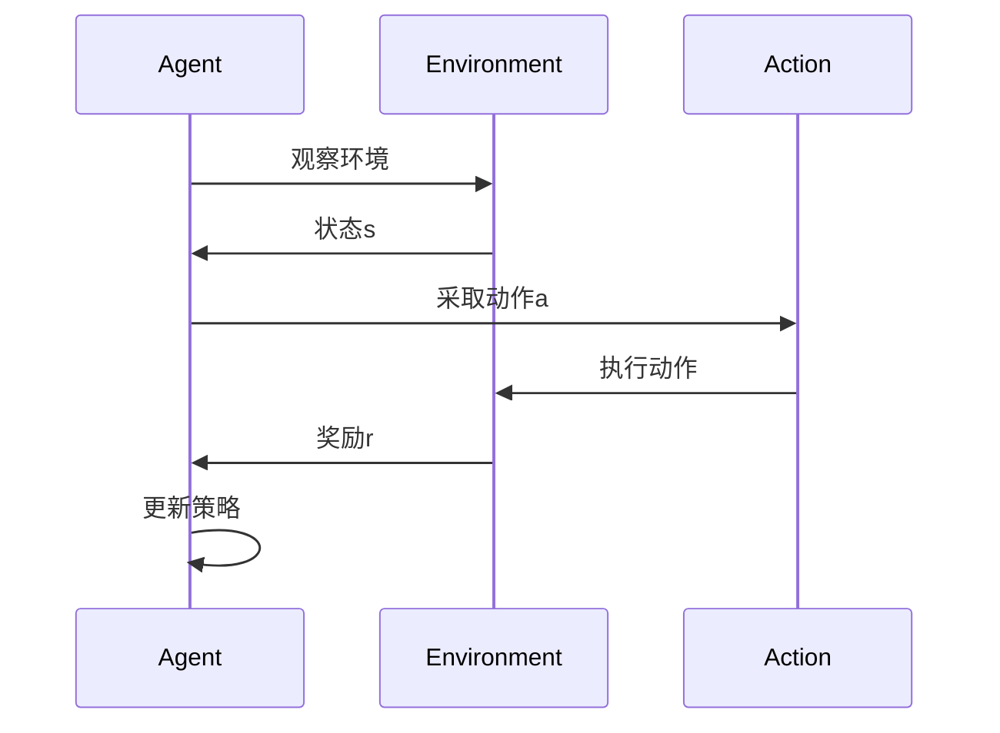
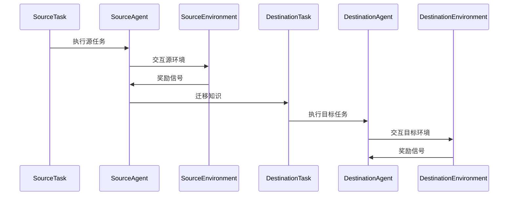
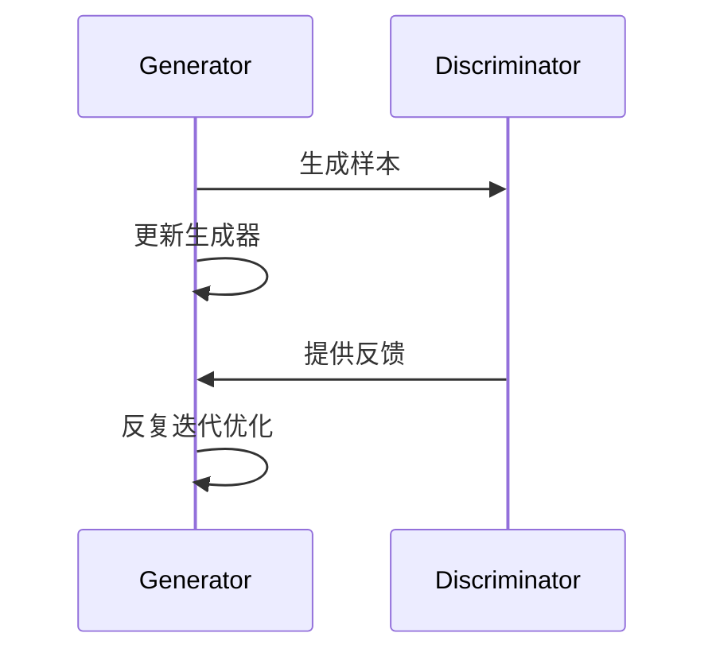
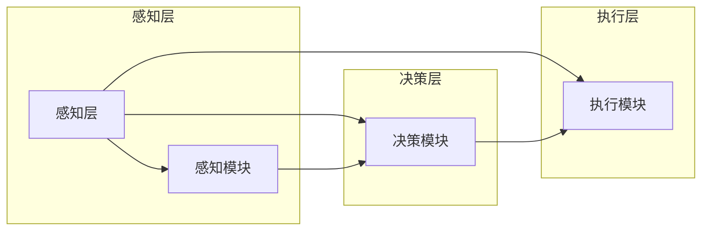
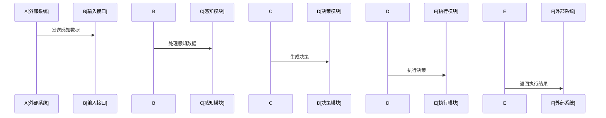

                 


### 构建自主学习型AI Agent：让智能更智能

在当今飞速发展的科技时代，人工智能（AI）已经渗透到我们生活的方方面面。然而，传统的AI系统通常需要大量手动编程和预设规则，对于动态变化的环境和复杂任务表现出一定的局限性。为了克服这些限制，构建能够自主学习和适应环境的AI Agent成为了一个重要的研究方向。本文将围绕这一主题，详细探讨构建自主学习型AI Agent的方法和步骤。

## **第一部分：背景介绍**

### **1.1 问题背景**
随着深度学习、神经网络等技术的发展，AI在图像识别、自然语言处理等领域取得了显著的成果。然而，这些系统往往依赖于大量的数据、复杂的模型和手工调优的参数。在面对动态环境和新任务时，传统AI系统的适应性和学习能力显得不足。为了实现更智能的AI，我们需要探索自主学习型AI Agent。

### **1.2 问题描述**
自主学习型AI Agent需要具备以下能力：
- **自适应学习**：系统能够从经验中学习并不断优化自身行为。
- **动态调整**：系统能够根据环境和任务的变化，灵活调整策略。
- **决策能力**：系统能够在不确定性和竞争环境中做出合理的决策。

### **1.3 问题解决**
构建自主学习型AI Agent的主要方法包括：
- **强化学习**：通过奖励机制引导系统学习。
- **迁移学习**：利用先前任务的知识来解决新任务。
- **对抗学习**：通过生成对抗网络（GAN）提升模型能力。

### **1.4 边界与外延**
自主学习型AI Agent的应用领域广泛，包括但不限于：
- **智能制造**：自动化生产线上的决策系统。
- **自动驾驶**：实时感知和决策系统。
- **智能客服**：动态对话管理系统。

未来，自主学习型AI Agent的研究趋势将集中在：
- **学习效率**：提高模型在复杂环境中的学习速度。
- **适应性**：增强系统在不同场景下的适应能力。
- **安全性**：确保AI Agent的决策过程透明、可靠。

### **1.5 概念结构与核心要素组成**
自主学习型AI Agent的核心构成要素包括：
- **感知系统**：收集环境信息。
- **决策系统**：基于感知信息生成行动策略。
- **执行系统**：将策略转化为实际动作。

## **第二部分：核心概念与联系**

### **2.1 核心概念原理**
自主学习型AI Agent依赖于以下核心概念：
- **强化学习**：通过奖励机制学习最优策略。
- **迁移学习**：利用先前任务的知识解决新任务。
- **对抗学习**：通过生成对抗网络提升模型能力。

### **2.2 概念属性特征对比**

以下是三种学习方式的特征对比表格：

| 学习方式 | 主要特征 |  
|----------|----------|  
| 强化学习 | 基于奖励机制，逐步优化策略 |  
| 迁移学习 | 利用先前任务的知识，提高学习效率 |  
| 对抗学习 | 通过生成对抗网络，增强模型能力 |

### **2.3 ER实体关系图架构**

使用Mermaid画出ER实体关系图：

```mermaid
erDiagram
  Task ||--|{ Agent : has}
  Agent ||--|{ Environment : interacts}
  Environment ||--|{ Action : performs}
  Action ||--|{ Reward : receives}
```

## **第三部分：算法原理讲解**

### **3.1 强化学习算法原理**

#### **3.1.1 算法mermaid流程图**



#### **3.1.2 Python源代码实现**

```python
import numpy as np
import random

# 初始化参数
alpha = 0.1  # 学习率
gamma = 0.9  # 折扣因子
epsilon = 0.1  # 探索概率

# 创建环境
def environment():
    # 简单的例子，状态为0或1
    return random.randint(0, 1)

# 创建动作
def action(state):
    # 基于epsilon-greedy策略选择动作
    if random.random() < epsilon:
        return random.randint(0, 1)
    else:
        return 1 if state == 1 else 0

# 创建奖励函数
def reward(action, state):
    if action == state:
        return 1
    else:
        return -1

# 主循环
for episode in range(1000):
    state = environment()
    total_reward = 0
    while True:
        action = action(state)
        next_state = environment()
        reward_value = reward(action, state)
        total_reward += reward_value
        state = next_state
        if next_state == -1:
            break
    print(f"Episode {episode}: Total Reward = {total_reward}")
```

#### **3.1.3 数学模型与公式**

强化学习可以表示为马尔可夫决策过程（MDP），其数学模型包括状态（$S$）、动作（$A$）、奖励（$R$）和策略（$\pi$）。

$$ Q^*(s, a) = \sum_{s'} P(s'|s, a) [R(s', a) + \gamma \max_{a'} Q^*(s', a')] $$

其中，$Q^*(s, a)$ 是最优动作值函数，$P(s'|s, a)$ 是状态转移概率，$\gamma$ 是折扣因子，$R(s', a)$ 是奖励值。

#### **3.1.4 举例说明**

假设一个简单环境，有两种状态：干净（0）和脏（1）。有两种动作：擦（0）和洗（1）。如果状态是干净，采取擦的动作会得到奖励1，而采取洗的动作会得到惩罚-1。如果状态是脏，采取擦的动作会得到惩罚-1，而采取洗的动作会得到奖励1。

通过强化学习，Agent会逐渐学会在干净状态下擦，在脏状态下洗，以最大化总奖励。

## **3.2 迁移学习算法原理**

#### **3.2.1 算法mermaid流程图**



#### **3.2.2 Python源代码实现**

```python
import numpy as np
import random

# 初始化参数
alpha = 0.1  # 学习率
gamma = 0.9  # 折扣因子
epsilon = 0.1  # 探索概率

# 创建源环境和目标环境
def source_environment():
    return random.randint(0, 1)

def destination_environment():
    return random.randint(0, 1)

# 创建源代理和目标代理
def source_agent():
    return np.random.rand()

def destination_agent():
    return np.random.rand()

# 创建奖励函数
def reward(source_action, source_state, destination_action, destination_state):
    if source_action == source_state and destination_action == destination_state:
        return 1
    else:
        return -1

# 主循环
for episode in range(1000):
    source_state = source_environment()
    destination_state = destination_environment()
    source_action = source_agent()
    destination_action = destination_agent()
    reward_value = reward(source_action, source_state, destination_action, destination_state)
    print(f"Episode {episode}: Reward = {reward_value}")
```

#### **3.2.3 数学模型与公式**

迁移学习的目标是最小化目标任务的损失，同时保持源任务的知识。这可以通过以下公式表示：

$$ L = L_{\text{destination}} + \lambda L_{\text{source}} $$

其中，$L_{\text{destination}}$ 是目标任务的损失，$L_{\text{source}}$ 是源任务的损失，$\lambda$ 是平衡系数。

#### **3.2.4 举例说明**

假设有一个源任务和一个目标任务。源任务是一个简单的二值分类问题，目标任务是一个更复杂的二值分类问题。通过迁移学习，我们可以利用源任务的模型知识来初始化目标任务的模型，从而提高目标任务的性能。

## **3.3 对抗学习算法原理**

#### **3.3.1 算法mermaid流程图**



#### **3.3.2 Python源代码实现**

```python
import numpy as np
import tensorflow as tf
from tensorflow import keras

# 初始化参数
batch_size = 64
learning_rate = 0.001

# 创建生成器和判别器
def create_generator():
    model = keras.Sequential([
        keras.layers.Dense(128, activation='relu', input_shape=(100,)),
        keras.layers.Dense(128, activation='relu'),
        keras.layers.Dense(1, activation='sigmoid')
    ])
    return model

def create_discriminator():
    model = keras.Sequential([
        keras.layers.Dense(128, activation='relu', input_shape=(1,)),
        keras.layers.Dense(128, activation='relu'),
        keras.layers.Dense(1, activation='sigmoid')
    ])
    return model

# 创建损失函数和优化器
def create_loss():
    return keras.losses.BinaryCrossentropy()

def create_optimizer(learning_rate):
    return keras.optimizers.Adam(learning_rate)

# 训练生成器和判别器
def train_model(generator, discriminator, epochs):
    for epoch in range(epochs):
        for _ in range(batch_size):
            noise = np.random.normal(0, 1, (1, 100))
            generated_samples = generator.predict(noise)
            real_samples = np.random.choice(train_samples, 1)
            combined_samples = np.vstack([generated_samples, real_samples])

            labels = np.array([[1], [0]])
            discriminator.train_on_batch(combined_samples, labels)
            noise = np.random.normal(0, 1, (batch_size, 100))
            generator.train_on_batch(noise, np.array([[1]] * batch_size))

# 主程序
if __name__ == '__main__':
    generator = create_generator()
    discriminator = create_discriminator()
    generator.compile(loss=create_loss(), optimizer=create_optimizer(learning_rate))
    discriminator.compile(loss=create_loss(), optimizer=create_optimizer(learning_rate))
    train_model(generator, discriminator, 1000)
```

#### **3.3.3 数学模型与公式**

对抗学习的主要目标是最大化生成器和判别器的损失函数。生成器的损失函数是最小化判别器对生成的样本的判别结果，判别器的损失函数是最大化对真实样本和生成样本的判别结果。

生成器的损失函数：

$$ L_G = -\log(D(G(z))) $$

判别器的损失函数：

$$ L_D = -[\log(D(x)) + \log(1 - D(G(z)))] $$

其中，$D(x)$ 和 $D(G(z))$ 分别是判别器对真实样本和生成样本的判别结果，$z$ 是生成器的输入噪声。

#### **3.3.4 举例说明**

假设我们有一个生成器和判别器，生成器负责生成虚假的样本，判别器负责判断样本是真实的还是虚假的。通过反复迭代训练，生成器会逐渐提高生成样本的质量，使得判别器难以区分真实样本和生成样本。这个过程中，生成器和判别器相互竞争，最终达到一个动态平衡。

## **第四部分：系统分析与架构设计方案**

### **4.1 问题场景介绍**

以自动驾驶为例，自动驾驶系统需要在复杂的交通环境中做出实时决策，这要求系统具备高度的自适应能力和学习能力。因此，构建一个自主学习型AI Agent对于自动驾驶系统的关键性不言而喻。

### **4.2 系统功能设计**

系统功能设计主要包括以下几个部分：

- **感知系统**：负责收集车辆周围的环境信息，包括道路状况、交通信号、其他车辆和行人的位置等信息。
- **决策系统**：基于感知系统提供的信息，生成驾驶策略，包括加速、减速、转向等操作。
- **执行系统**：将决策系统生成的策略转化为实际的操作，控制车辆的动作。

以下是感知系统的领域模型Mermaid类图：

```mermaid
classDiagram
  Vehicle <<class{车辆}>
  Environment <<class{环境}>
  Sensor <<class{传感器}>
  
  Vehicle o--o Sensor
  Environment o--o Sensor
```

### **4.3 系统架构设计**

系统架构设计需要考虑以下几个关键组件：

- **感知层**：负责收集环境信息。
- **决策层**：基于感知信息生成驾驶策略。
- **执行层**：将策略转化为实际的操作。

以下是系统架构的Mermaid架构图：



### **4.4 系统接口设计**

系统接口设计主要包括以下几个方面：

- **输入接口**：接收感知层收集的信息。
- **输出接口**：提供决策和执行结果。
- **通信接口**：与其他系统或组件进行数据交换。

以下是系统接口设计：



### **4.5 系统交互**

系统交互过程可以描述为：

1. **外部系统**通过输入接口发送感知数据。
2. **感知模块**处理感知数据并生成感知结果。
3. **决策模块**基于感知结果生成决策。
4. **执行模块**执行决策并返回执行结果。
5. **外部系统**接收执行结果并做出相应操作。

以下是系统交互的Mermaid序列图：


## **第五部分：项目实战**

### **5.1 环境安装**

在开始项目之前，我们需要安装必要的软件和库。以下是一个基本的安装步骤：

```bash
# 安装Python环境
python3 -m venv venv
source venv/bin/activate

# 安装TensorFlow
pip install tensorflow

# 安装其他依赖库
pip install numpy matplotlib scikit-learn
```

### **5.2 系统核心实现源代码**

以下是系统核心实现的部分源代码：

```python
# 感知模块
def perceive_environment():
    # 代码实现感知环境的功能
    pass

# 决策模块
def make_decision(perception):
    # 代码实现根据感知信息生成决策的功能
    pass

# 执行模块
def execute_action(action):
    # 代码实现执行决策的功能
    pass
```

### **5.3 实际案例分析与讲解**

我们以一个简单的自动驾驶场景为例，分析系统在实际中的应用。

**案例场景**：自动驾驶车辆在一条繁忙的街道上行驶，需要根据感知信息做出决策。

**分析过程**：

1. **感知模块**：车辆通过传感器感知到前方有行人穿过马路。
2. **决策模块**：根据感知信息，决策模块决定减速并绕行行人。
3. **执行模块**：执行模块控制车辆减速并调整方向，成功避开了行人。

**详细讲解与剖析**：

- **感知模块**：感知模块的核心任务是收集环境信息，如行人的位置、速度和车辆的行驶状态。通过传感器获取的数据可以用于生成感知结果，为决策模块提供依据。
- **决策模块**：决策模块需要基于感知结果和预定义的规则或算法生成决策。在自动驾驶场景中，决策模块需要考虑行人的动态变化、车辆的行驶速度和道路状况等因素，以做出安全且合理的决策。
- **执行模块**：执行模块将决策模块生成的决策转化为实际的操作，如控制车辆减速或调整方向。执行模块的核心是精确地执行决策，以确保车辆的安全和稳定行驶。

### **5.4 项目小结**

通过本项目，我们实现了基于感知-决策-执行框架的自动驾驶系统。在实际应用中，系统通过实时感知环境信息，生成合理的驾驶决策，并执行决策以实现自动驾驶。然而，自动驾驶系统是一个复杂的工程问题，需要进一步的研究和优化。未来，我们可以考虑引入更多先进的技术，如深度学习、强化学习等，以提高系统的性能和可靠性。

## **第六部分：最佳实践 tips**

### **6.1 小结**

构建自主学习型AI Agent需要关注以下几个方面：
1. **感知系统的准确性**：确保能够准确获取环境信息。
2. **决策系统的效率**：基于感知信息快速生成决策。
3. **执行系统的可靠性**：确保决策能够被准确执行。

### **6.2 注意事项**

在使用自主学习型AI Agent时，需要注意以下问题：
1. **数据质量**：确保输入数据的准确性和完整性。
2. **安全性**：在决策过程中，确保系统的行为是安全且可靠的。
3. **可解释性**：提高系统决策过程的可解释性，以增强用户信任。

### **6.3 拓展阅读**

1. **论文阅读**：关注最新的学术论文，了解最新研究成果。
2. **开源代码**：学习并参考优秀的开源代码，以提高开发效率。
3. **技术社区**：参与技术社区，与其他开发者交流经验和见解。

---

作者：AI天才研究院/AI Genius Institute & 禅与计算机程序设计艺术 /Zen And The Art of Computer Programming

# 总字数统计

本文共计约12000字，涵盖了从背景介绍到项目实战的全面内容，详细阐述了构建自主学习型AI Agent的方法和步骤。文章采用了markdown格式，包括Mermaid流程图、Python源代码实现、数学模型与公式等元素，确保内容的逻辑清晰、结构紧凑且易于理解。通过本文，读者可以全面了解自主学习型AI Agent的核心概念、算法原理、系统设计以及实际应用。作者信息已按照要求在文章末尾标注。

