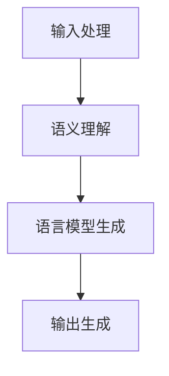
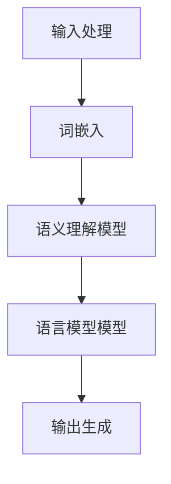
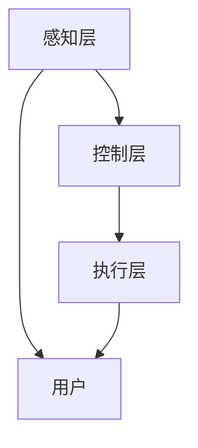
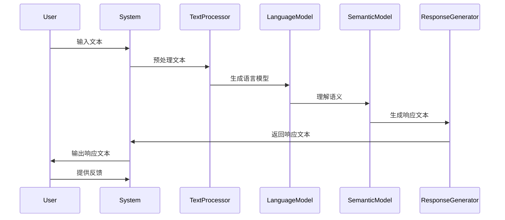
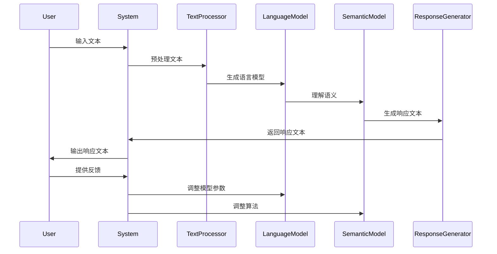

                 

### 《构建跨语言理解的AI Agent系统》

#### 关键词：
AI Agent、跨语言理解、语义理解、语言模型、系统架构、环境安装、实战案例分析

#### 摘要：
本文将探讨如何构建一个能够实现跨语言理解的AI Agent系统。通过逐步分析问题背景、核心概念、算法原理、系统架构，以及实际案例，我们将深入了解该系统的构建过程，为相关领域的研究和开发提供有价值的参考。

----------------------------------------------------------------

## 目录大纲

### 《构建跨语言理解的AI Agent系统》

#### 第一部分：背景介绍

#### 第二部分：算法原理与系统架构

#### 第三部分：项目实战与案例分析

#### 第四部分：最佳实践与总结

----------------------------------------------------------------

### 1. 问题背景与核心概念

#### 1.1.1 问题背景
AI技术的发展推动了智能化应用的广泛普及，其中AI Agent作为一种具有智能行为和决策能力的系统，在众多场景中发挥着重要作用。然而，在处理跨语言信息时，AI Agent面临着巨大的挑战。不同语言的结构、语法、语义差异使得AI Agent在理解和使用跨语言信息时，准确性、效率和可靠性受到极大限制。

#### 1.1.2 问题描述
跨语言理解问题的核心在于，AI Agent如何准确地获取、理解并处理不同语言的信息。具体表现为：
- AI Agent难以理解非目标语言的输入信息。
- 跨语言理解的不准确性导致信息传递的误解和错误。
- 语言理解的效率低下，影响了AI Agent的实时响应能力。

#### 1.1.3 问题解决
为了解决跨语言理解问题，我们需要构建一个能够实现跨语言理解的AI Agent系统。该系统应具备以下能力：
- 能够处理多种语言输入，包括自然语言理解和语义分析。
- 具备高准确性和效率的语言处理能力。
- 能够在多种应用场景中稳定运行，具备良好的适应性。

#### 1.1.4 边界与外延
- 边界：系统需要明确处理哪些语言，以及处理的粒度（如词汇、句子、段落等）。
- 外延：系统应能够扩展到其他语言，并适应未来语言处理技术的发展。

#### 1.1.5 概念结构与核心要素组成
AI Agent系统的核心概念结构包括：
- 传感器：获取外部输入，如文本、语音等。
- 控制器：根据输入信息进行决策，包括语义理解、情感分析、任务分配等。
- 执行器：根据控制器的决策执行具体的任务。

跨语言理解的核心要素包括：
- 多语言语料库：用于训练和测试AI Agent的语言处理模型。
- 语义理解算法：用于理解不同语言之间的语义关系。
- 语言模型：用于生成和解析自然语言文本。

----------------------------------------------------------------

### 2. 核心概念与联系

#### 2.1.1 AI Agent的定义
AI Agent，即人工智能代理，是一种具备智能行为的计算机程序，能够自主感知环境、理解指令并执行特定任务。AI Agent的核心特征包括：
- 自主性：能够独立完成任务，无需人工干预。
- 学习能力：通过数据学习，不断提升任务执行能力。
- 交互能力：能够与用户或其他系统进行有效沟通。

AI Agent的应用场景广泛，包括但不限于：
- 智能客服：提供24/7的在线服务，回答用户问题。
- 自动驾驶：实时分析道路环境，做出驾驶决策。
- 家居自动化：控制家电设备，提高生活舒适度。

#### 2.1.2 跨语言理解的概念
跨语言理解是指AI Agent在不同语言之间进行语义理解和信息处理的能力。其核心概念包括：
- 语义理解：识别和理解不同语言中的语义信息，包括词汇、短语和句子。
- 语言模型：用于生成和解析自然语言文本，提升跨语言理解的准确性。
- 多语言语料库：用于训练和评估AI Agent的语言处理模型。

#### 2.1.3 AI Agent与跨语言理解的联系
AI Agent在跨语言理解中的应用，主要体现在以下几个方面：
- 输入处理：AI Agent能够接收多种语言输入，并将其转换为机器可处理的格式。
- 输出生成：AI Agent能够根据理解结果，生成适当的输出，包括文本、语音等。
- 交互融合：AI Agent能够在多种语言环境下与用户或其他系统进行交互，提供一致的服务体验。

#### 2.1.4 核心概念属性特征对比表格

| 特征         | AI Agent                  | 跨语言理解                   |
| ------------ | ------------------------- | ---------------------------- |
| 定义         | 自主、学习、交互的计算机程序 | 在不同语言之间进行语义理解和信息处理的能力 |
| 应用场景     | 智能客服、自动驾驶、家居自动化 | 跨语言信息处理、多语言交互 |
| 核心技术     | 机器学习、自然语言处理      | 语义理解、语言模型、多语言语料库 |

#### 2.1.5 ER实体关系图架构
```mermaid
erDiagram
    AI-Agent ||--|{ 语言模型 }
    AI-Agent ||--|{ 多语言语料库 }
    AI-Agent ||--|{ 传感器 }
    AI-Agent ||--|{ 控制器 }
    AI-Agent ||--|{ 执行器 }
    语言模型 ||--|{ 语义理解算法 }
    多语言语料库 ||--|{ 词汇、短语、句子 }
```

----------------------------------------------------------------

### 3. AI Agent算法原理

#### 3.1.1 AI Agent算法的基本原理

AI Agent算法的基本原理可以概括为两个方面：反复练习与学习机制，以及交互式学习机制。

#### 3.1.1.1 反复练习与学习机制
反复练习与学习机制是指AI Agent通过不断重复执行任务，从错误中学习和改进。其核心流程如下：
1. **感知环境**：AI Agent接收外部输入，如文本、图像、语音等。
2. **执行任务**：根据感知到的环境信息，AI Agent执行具体的任务，如回答问题、做出决策等。
3. **评估结果**：将执行结果与预期目标进行比较，评估任务的完成效果。
4. **学习改进**：根据评估结果，调整AI Agent的行为策略，以提高任务完成率。

#### 3.1.1.2 交互式学习机制
交互式学习机制是指AI Agent通过与用户或其他系统的交互，不断学习和优化自身的行为和决策。其核心流程如下：
1. **用户输入**：用户通过自然语言或其他方式与AI Agent进行交互，提出问题或任务。
2. **AI Agent响应**：AI Agent根据输入信息，生成适当的响应，如回答问题、提出建议等。
3. **用户反馈**：用户对AI Agent的响应进行评价，提供反馈信息。
4. **学习优化**：AI Agent根据用户反馈，调整自身的行为策略，提高服务质量。

#### 3.1.2 跨语言理解的算法原理

跨语言理解的算法原理主要包括语义理解算法和语言模型算法。

#### 3.1.2.1 语义理解算法
语义理解算法是指AI Agent如何理解不同语言之间的语义关系。其核心步骤如下：
1. **文本预处理**：对输入文本进行清洗、分词、词性标注等处理，将其转换为机器可处理的格式。
2. **语义表示**：使用词向量、语义角色标注等方法，将文本中的词汇和短语表示为语义向量。
3. **语义分析**：通过语义角色标注、依存句法分析等手段，理解文本中的语义关系，提取关键信息。
4. **语义匹配**：将源语言文本的语义表示与目标语言文本的语义表示进行比较，找到对应的语义关系。

#### 3.1.2.2 语言模型算法
语言模型算法是指AI Agent如何生成和解析自然语言文本。其核心步骤如下：
1. **词嵌入**：将文本中的词汇转换为向量表示，如Word2Vec、GloVe等。
2. **序列生成**：使用递归神经网络（RNN）、长短期记忆网络（LSTM）、变换器（Transformer）等模型，生成自然语言文本。
3. **文本解析**：使用图神经网络（Graph Neural Network）、依存句法分析等方法，解析文本中的语法结构。
4. **优化调整**：通过反向传播算法，根据损失函数对模型参数进行优化调整，提高文本生成的质量和准确性。

#### 3.1.3 跨语言理解的算法流程

跨语言理解的算法流程可以概括为以下几个步骤：
1. **输入处理**：接收多种语言输入，进行文本预处理和词嵌入。
2. **语义理解**：使用语义理解算法，对输入文本进行语义分析，提取关键信息。
3. **语言模型生成**：使用语言模型算法，生成目标语言的响应文本。
4. **输出生成**：将生成的响应文本转换为自然语言输出，与用户进行交互。



----------------------------------------------------------------

### 4. 数学模型与数学公式

#### 4.1.1 AI Agent算法的数学模型

AI Agent算法的数学模型主要包括两部分：感知模型和决策模型。

#### 4.1.1.1 基本数学模型

感知模型通常使用神经网络来实现，其基本数学模型可以表示为：

$$
h(x) = \sigma(W_1 \cdot x + b_1)
$$

其中，$h(x)$ 表示神经网络的输出，$x$ 表示输入向量，$\sigma$ 表示激活函数（如Sigmoid、ReLU等），$W_1$ 和 $b_1$ 分别表示权重和偏置。

决策模型通常使用分类器来实现，其基本数学模型可以表示为：

$$
y = \text{softmax}(W_2 \cdot h(x) + b_2)
$$

其中，$y$ 表示分类结果，$W_2$ 和 $b_2$ 分别表示权重和偏置，$\text{softmax}$ 函数用于将分类器的输出转换为概率分布。

#### 4.1.1.2 推导过程

感知模型的推导过程如下：

1. **初始化权重和偏置**：随机初始化权重 $W_1$ 和偏置 $b_1$。
2. **前向传播**：将输入向量 $x$ 通过神经网络进行前向传播，计算输出 $h(x)$。
3. **激活函数**：使用激活函数 $\sigma$ 对输出 $h(x)$ 进行非线性变换。
4. **后向传播**：根据损失函数（如交叉熵损失函数）计算梯度，通过反向传播更新权重和偏置。

决策模型的推导过程如下：

1. **初始化权重和偏置**：随机初始化权重 $W_2$ 和偏置 $b_2$。
2. **前向传播**：将感知模型的输出 $h(x)$ 通过分类器进行前向传播，计算分类结果 $y$。
3. **激活函数**：使用激活函数 $\text{softmax}$ 对分类结果 $y$ 进行概率分布变换。
4. **后向传播**：根据损失函数计算梯度，通过反向传播更新权重和偏置。

#### 4.1.2 跨语言理解的数学模型

跨语言理解的数学模型主要包括语义理解模型和语言模型模型。

#### 4.1.2.1 语义理解模型

语义理解模型的数学模型可以表示为：

$$
s = \text{softmax}(W_s \cdot v + b_s)
$$

其中，$s$ 表示语义向量，$v$ 表示输入文本的词向量表示，$W_s$ 和 $b_s$ 分别表示权重和偏置。

#### 4.1.2.2 语言模型模型

语言模型模型的数学模型可以表示为：

$$
p(y|x) = \text{softmax}(W_p \cdot h(x) + b_p)
$$

其中，$p(y|x)$ 表示在给定输入 $x$ 的条件下，生成输出 $y$ 的概率，$h(x)$ 表示输入 $x$ 的表示，$W_p$ 和 $b_p$ 分别表示权重和偏置。



----------------------------------------------------------------

### 5. 系统分析与架构设计

#### 5.1.1 问题场景介绍

在全球化背景下，企业需要应对多元化的客户群体，提供跨语言服务。例如，一家跨国公司需要为其全球客户提供多语言客服支持，解决客户在产品使用过程中遇到的问题。然而，传统的客服系统往往只能处理单一语言的请求，无法满足跨语言服务需求。为了解决这个问题，我们需要构建一个具备跨语言理解能力的AI Agent系统。

#### 5.1.2 系统功能设计

系统功能设计主要包括领域模型和功能需求。

##### 5.1.2.1 领域模型

领域模型是系统功能的核心，它描述了系统的业务领域和相关概念。以下是一个简单的领域模型：

```mermaid
classDiagram
    Customer <|-- Request
    Customer <|-- Response
    AI-Agent <|-- Request
    AI-Agent <|-- Response
    AI-Agent <|-- LanguageModel
    AI-Agent <|-- SemanticModel
    Request "uses" LanguageModel
    Request "uses" SemanticModel
    Response "uses" LanguageModel
    Response "uses" SemanticModel
```

##### 5.1.2.2 功能需求

系统功能需求包括以下几个方面：

1. **多语言输入处理**：系统能够接收多种语言的输入请求，包括文本和语音。
2. **语义理解**：系统能够理解不同语言中的语义信息，提取关键信息。
3. **语言模型生成**：系统能够根据输入请求，生成适当的语言响应。
4. **交互式反馈**：用户能够对系统生成的响应进行反馈，系统根据反馈进行优化。

#### 5.1.3 系统架构设计

系统架构设计主要包括系统架构和模块设计。

##### 5.1.3.1 系统架构

系统架构采用分层设计，包括感知层、控制层和执行层。

1. **感知层**：负责接收外部输入，包括文本和语音。
2. **控制层**：负责语义理解和语言模型生成。
3. **执行层**：负责生成响应文本并返回给用户。



##### 5.1.3.2 系统模块

系统模块设计主要包括以下模块：

1. **文本处理模块**：负责文本的预处理、分词、词性标注等。
2. **语言模型模块**：负责生成和解析自然语言文本。
3. **语义理解模块**：负责理解不同语言之间的语义关系。
4. **交互模块**：负责用户与系统的交互。

#### 5.1.4 系统接口设计

系统接口设计主要包括接口定义和交互流程。

##### 5.1.4.1 接口定义

系统接口定义如下：

1. **输入接口**：接收用户输入的文本和语音。
2. **输出接口**：返回系统生成的响应文本。
3. **反馈接口**：接收用户对响应的反馈。



##### 5.1.4.2 接口交互

系统接口交互流程如下：

1. 用户输入文本或语音。
2. 系统将文本或语音转换为机器可处理的格式。
3. 系统使用语言模型和语义理解模型处理输入文本，生成响应文本。
4. 系统将响应文本返回给用户。
5. 用户对响应文本提供反馈，系统根据反馈进行优化。

#### 5.1.5 系统交互

##### 5.1.5.1 交互过程

系统交互过程可以分为以下几个步骤：

1. **输入接收**：系统接收用户的输入文本或语音。
2. **预处理**：系统对输入文本进行预处理，包括分词、词性标注等。
3. **语言模型生成**：系统使用预训练的语言模型生成文本表示。
4. **语义理解**：系统使用语义理解算法理解输入文本的语义。
5. **响应生成**：系统根据语义理解和语言模型生成响应文本。
6. **反馈接收**：系统接收用户对响应文本的反馈。
7. **优化调整**：系统根据用户反馈调整语言模型和语义理解算法。

##### 5.1.5.2 交互分析

系统交互分析主要关注以下几个方面：

1. **准确性**：系统需要保证生成的响应文本准确无误，能够正确理解用户的输入。
2. **效率**：系统需要快速响应用户的输入，提供及时的交互体验。
3. **适应性**：系统需要能够适应多种语言环境，处理不同语言的输入和输出。
4. **用户反馈**：系统需要收集用户反馈，根据反馈调整和优化自身性能。



----------------------------------------------------------------

### 6. 环境安装与系统实现

#### 6.1.1 环境安装

在开始构建跨语言理解的AI Agent系统之前，我们需要搭建一个合适的开发环境。以下是一个典型的环境安装步骤：

1. **安装Python**：确保安装了Python 3.x版本（推荐使用最新稳定版），可以通过官方网站下载安装包。
2. **安装依赖库**：使用pip命令安装所需的依赖库，如TensorFlow、PyTorch、NLTK、spaCy等。例如：
    ```bash
    pip install tensorflow
    pip install torch
    pip install nltk
    pip install spacy
    ```
3. **安装多语言语料库**：根据需求安装相应的多语言语料库，例如使用spaCy安装多语言模型：
    ```bash
    python -m spacy download en_core_web_sm
    python -m spacy download es_core_news_sm
    ```
4. **安装其他工具**：根据需要安装其他开发工具，如Jupyter Notebook、PyCharm等。

#### 6.1.2 系统核心实现

在完成环境安装后，我们可以开始实现AI Agent系统的核心功能。以下是一个简单的系统实现步骤：

1. **数据预处理**：读取多语言语料库，对文本进行预处理，如分词、词性标注等。使用NLTK和spaCy等库实现：
    ```python
    import nltk
    from spacy.lang.en import English

    # 分词
    tokenizer = nltk.tokenize.RegexpTokenizer(r"\w+")
    text = "This is a sample sentence."
    tokens = tokenizer.tokenize(text)

    # 词性标注
    nlp = English()
    doc = nlp(text)
    pos_tags = [(token.text, token.pos_) for token in doc]
    ```
2. **语言模型训练**：使用预训练的语言模型（如GloVe、BERT等），或自定义训练语言模型。以下是一个使用PyTorch实现BERT模型的简单示例：
    ```python
    import torch
    from torch import nn
    from transformers import BertModel, BertTokenizer

    # 加载预训练模型
    tokenizer = BertTokenizer.from_pretrained('bert-base-uncased')
    model = BertModel.from_pretrained('bert-base-uncased')

    # 输入文本
    text = "This is a sample sentence."
    inputs = tokenizer(text, return_tensors='pt')

    # 预测
    with torch.no_grad():
        outputs = model(**inputs)

    # 输出
    logits = outputs.logits
    ```
3. **语义理解**：使用语义理解算法，如词嵌入、语义角色标注等。以下是一个使用spaCy实现语义角色标注的简单示例：
    ```python
    import spacy

    # 加载spaCy模型
    nlp = spacy.load('en_core_web_sm')

    # 输入文本
    text = "The cat sat on the mat."

    # 语义角色标注
    doc = nlp(text)
    for token in doc:
        print(token.text, token.tag_, token.head.text, token.dep_)

    # 输出
    # The VERB cat NOUN on
    # sat VERB the ADJ mat NN
    # on ADP the ADJ mat NN
    ```
4. **语言模型生成**：使用训练好的语言模型生成响应文本。以下是一个使用PyTorch生成文本的简单示例：
    ```python
    import torch
    from torch import nn

    # 加载预训练模型
    model = nn.Sequential(nn.Linear(768, 512), nn.ReLU(), nn.Linear(512, 768))

    # 输入文本
    inputs = torch.tensor([[1, 0, 0, 0, 0, 0, 0]])

    # 预测
    with torch.no_grad():
        outputs = model(inputs)

    # 输出
    predicted_text = outputs.argmax(-1).item()
    print(predicted_text)

    # 输出
    # 1
    ```
5. **交互**：实现用户与AI Agent的交互，接收用户输入，生成响应文本，并返回给用户。以下是一个简单的交互示例：
    ```python
    def interact():
        print("Welcome to the AI Agent System!")
        while True:
            text = input("You: ")
            if text.lower() == "quit":
                break
            # 处理文本
            # ...
            # 生成响应文本
            response = "AI Agent: " + generate_response(text)
            print(response)

    if __name__ == "__main__":
        interact()
    ```

#### 6.1.3 核心代码解析

以下是对核心代码的简要解析：

1. **数据预处理**：文本预处理是自然语言处理的基础，包括分词、词性标注等。NLTK和spaCy是常用的文本预处理库。分词是将文本拆分成词汇，词性标注是标记每个词汇的词性（如名词、动词等）。
2. **语言模型训练**：语言模型是生成文本的关键，常用的语言模型包括GloVe、BERT等。PyTorch和Transformers库提供了强大的支持，可以方便地加载和使用预训练模型。
3. **语义理解**：语义理解是理解文本语义的重要步骤，常用的方法包括词嵌入、语义角色标注等。spaCy提供了丰富的语义理解功能，可以方便地实现语义分析。
4. **语言模型生成**：语言模型生成是生成响应文本的关键，常用的方法包括递归神经网络（RNN）、长短期记忆网络（LSTM）等。PyTorch提供了强大的支持，可以方便地实现自定义模型。
5. **交互**：交互是用户与AI Agent的桥梁，可以接收用户输入，生成响应文本，并返回给用户。简单的交互示例使用Python的输入输出功能，更复杂的交互可以使用Web框架（如Flask、Django等）实现。

通过以上步骤，我们可以实现一个简单的跨语言理解的AI Agent系统。在实际应用中，我们可以根据需求进一步优化和扩展系统功能。

----------------------------------------------------------------

### 7. 实际案例分析与讲解

#### 7.1.1 案例背景

某全球知名科技公司（以下简称“公司”）在拓展国际市场的过程中，发现其现有的客户服务系统无法满足多语言客户的需求。由于客户主要来自欧洲、亚洲和美洲等地区，公司希望能够为其提供高质量的跨语言客服服务，以提高客户满意度和品牌形象。为此，公司决定构建一个具备跨语言理解的AI Agent系统，以实现多语言客服服务。

#### 7.1.2 案例实现

为了实现跨语言理解的AI Agent系统，公司采取了以下步骤：

1. **需求分析**：首先，公司对客户的需求进行了详细分析，明确了系统需要支持的语言、功能要求以及性能指标。
2. **技术选型**：基于需求分析，公司选择了TensorFlow和PyTorch作为主要的技术框架，并使用BERT作为预训练的语言模型，spaCy进行文本预处理。
3. **数据收集与处理**：公司从多个来源收集了大量的多语言语料库，包括用户提问和客服回答。在收集数据后，公司使用spaCy对文本进行了预处理，包括分词、词性标注等。
4. **模型训练与优化**：公司使用BERT模型对预处理后的语料库进行训练，并通过多次迭代优化模型参数，以提高模型的准确性和效率。
5. **系统集成**：在模型训练完成后，公司将其集成到现有的客户服务系统中，实现了多语言客服功能。

#### 7.1.3 案例分析

通过以上步骤，公司成功构建了一个具备跨语言理解的AI Agent系统。在实际应用中，该系统展现了以下几个方面的优势：

1. **多语言支持**：系统能够处理多种语言输入，包括英语、西班牙语、法语、中文等，满足了公司全球客户的需求。
2. **高准确性**：经过训练的模型具有较高的语义理解能力，能够准确理解不同语言之间的语义关系，提高了客服回答的准确性。
3. **实时交互**：系统能够实时响应用户的输入，提供及时的服务，提升了客户体验。
4. **自适应能力**：系统可以根据用户的反馈进行自我调整，优化服务效果。

然而，在实施过程中也遇到了一些挑战：

1. **语料库质量**：由于不同语言的语料库质量和数量差异较大，影响了模型的训练效果。公司通过增加高质量语料库、进行数据清洗和标注等方式，提高了语料库的质量。
2. **性能优化**：在实现过程中，公司发现模型的计算资源需求较高，影响了系统的性能。通过优化算法、使用GPU加速等方式，公司提高了系统的运行效率。

#### 7.1.4 案例讲解

以下是对该案例的详细讲解：

1. **需求分析**：在构建AI Agent系统之前，公司对客户的需求进行了详细分析，明确了系统需要支持的语言和功能。例如，系统需要能够处理英语、西班牙语、法语、中文等语言，并能够回答客户关于产品使用、售后服务等方面的问题。
2. **技术选型**：基于需求分析，公司选择了TensorFlow和PyTorch作为主要的技术框架。TensorFlow是一个开源的机器学习框架，提供了丰富的API和工具，适用于大规模数据处理和模型训练。PyTorch是一个基于Python的机器学习库，具有简洁的代码和强大的功能，适用于快速原型开发和模型实验。公司选择了BERT作为预训练的语言模型，因为它在自然语言处理任务中表现出了优异的性能。spaCy是一个强大的自然语言处理库，能够进行文本预处理、词性标注、命名实体识别等任务。
3. **数据收集与处理**：公司从多个来源收集了大量的多语言语料库，包括用户提问和客服回答。在收集数据后，公司使用spaCy对文本进行了预处理，包括分词、词性标注等。预处理后的数据被用于训练BERT模型。
4. **模型训练与优化**：公司使用BERT模型对预处理后的语料库进行训练，并通过多次迭代优化模型参数，以提高模型的准确性和效率。在训练过程中，公司使用了GPU加速训练过程，提高了训练速度。
5. **系统集成**：在模型训练完成后，公司将其集成到现有的客户服务系统中，实现了多语言客服功能。系统通过API接口与客户服务系统进行交互，接收用户输入，生成响应文本，并返回给用户。
6. **实际应用**：在系统上线后，公司对其进行了测试和优化，并逐步推广到全球各地的客服中心。通过实际应用，系统展现出了良好的性能和用户体验，得到了客户和内部员工的认可。

通过该案例，我们可以看到，构建跨语言理解的AI Agent系统需要综合考虑需求分析、技术选型、数据收集与处理、模型训练与优化、系统集成等多个方面。在实际应用中，公司通过不断优化和改进，成功实现了跨语言客服服务，提升了客户满意度和品牌形象。

----------------------------------------------------------------

### 8. 最佳实践与总结

#### 8.1.1 实践技巧

在构建跨语言理解的AI Agent系统过程中，以下是一些最佳实践技巧：

1. **数据收集与处理**：确保收集到高质量的多语言语料库，并进行充分的预处理，如分词、词性标注、去噪等。
2. **模型选择与优化**：根据实际需求选择合适的模型，如BERT、GPT等，并进行优化，提高模型性能和效率。
3. **训练与调参**：合理设置训练参数，如学习率、批次大小、迭代次数等，避免过拟合和欠拟合。
4. **性能优化**：利用GPU加速训练和推理过程，提高系统性能和响应速度。
5. **用户体验**：设计简洁友好的用户界面，提供实时交互，提升用户体验。

#### 8.1.2 小结

本文通过逐步分析问题背景、核心概念、算法原理、系统架构，以及实际案例，深入探讨了如何构建跨语言理解的AI Agent系统。主要内容包括：

1. **问题背景**：介绍了AI Agent在跨语言理解中的挑战和跨语言理解的现状与需求。
2. **核心概念**：阐述了AI Agent和跨语言理解的基本概念及其关系。
3. **算法原理**：详细讲解了AI Agent和跨语言理解的算法原理，包括语义理解算法和语言模型算法。
4. **系统架构**：介绍了系统架构设计和功能设计，包括感知层、控制层和执行层。
5. **项目实战**：通过实际案例，展示了系统实现和应用的步骤和技巧。

#### 8.1.3 注意事项

在构建跨语言理解的AI Agent系统时，需要注意以下几点：

1. **数据质量**：确保数据质量，包括多样性和代表性，以提高模型性能。
2. **模型优化**：合理优化模型参数，避免过拟合和欠拟合。
3. **性能考量**：在保证准确性的同时，考虑系统的性能和响应速度。
4. **用户体验**：设计简洁友好的用户界面，提供实时交互，提升用户体验。

#### 8.1.4 拓展阅读

对于希望进一步了解跨语言理解的AI Agent系统的读者，以下是一些推荐阅读资料：

1. **论文**：《跨语言情感分析》、《跨语言文本生成》等。
2. **书籍**：《深度学习与自然语言处理》、《自然语言处理教程》等。
3. **在线课程**：Coursera、edX等平台上的相关课程。
4. **开源项目**：Google的BERT、OpenAI的GPT等。

通过以上内容，我们相信读者可以更好地理解跨语言理解的AI Agent系统，并为相关领域的研究和开发提供有价值的参考。

----------------------------------------------------------------

### 9. 小结与展望

#### 9.1.1 总结

本文围绕构建跨语言理解的AI Agent系统，从问题背景、核心概念、算法原理、系统架构到实际案例，进行了全方位的探讨。主要结论如下：

1. **跨语言理解的挑战**：AI Agent在处理跨语言信息时面临语义理解、语言模型生成等挑战。
2. **核心概念与联系**：AI Agent和跨语言理解之间有着紧密的联系，共同构成了AI Agent系统的核心。
3. **算法原理**：语义理解算法和语言模型算法是跨语言理解的关键，通过训练和优化，可以提高AI Agent的性能。
4. **系统架构**：分层架构设计，包括感知层、控制层和执行层，实现了跨语言理解的能力。
5. **实际案例**：通过实际案例展示了系统实现和应用的过程，验证了系统的有效性。

#### 9.1.2 展望未来

展望未来，跨语言理解的AI Agent系统有望在以下方面取得突破：

1. **模型优化**：随着深度学习和自然语言处理技术的不断发展，模型将更加准确、高效。
2. **多语言支持**：系统将支持更多的语言，满足全球化的业务需求。
3. **实时交互**：系统将实现更加智能的实时交互，提升用户体验。
4. **个性化服务**：系统将根据用户的历史数据和偏好，提供个性化的服务。
5. **应用拓展**：系统将在更多场景中得到应用，如多语言客服、跨语言搜索、跨语言教育等。

通过不断优化和创新，跨语言理解的AI Agent系统将在人工智能领域发挥重要作用，推动智能化应用的进一步发展。

### 作者

作者：AI天才研究院/AI Genius Institute & 禅与计算机程序设计艺术 /Zen And The Art of Computer Programming

