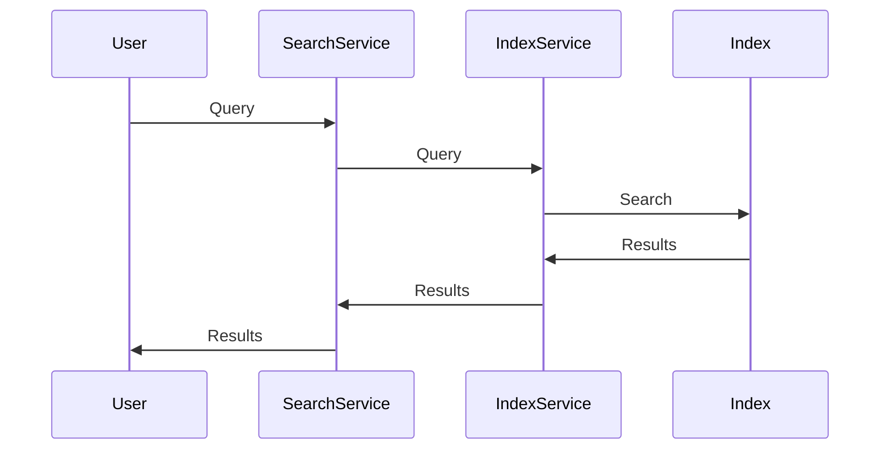

                 

### 构建高性能的全文检索系统

## 关键词

- 全文检索系统
- 高性能
- 倒排索引
- 文档分词
- 查询处理
- 算法原理
- 系统架构
- 实际案例

## 摘要

本文将深入探讨构建高性能全文检索系统的关键要素和技术方法。全文检索系统在信息检索和数据挖掘中扮演着至关重要的角色，但其构建过程复杂且技术要求高。本文首先介绍全文检索系统的基本概念和核心问题，随后详细分析全文检索系统中的关键概念，如倒排索引、文档分词和查询处理。接着，本文将通过具体的算法原理讲解和系统设计与实现，展示如何构建高性能全文检索系统。最后，本文通过项目实战和分析，提供实际案例，讨论最佳实践和注意事项，并对全文检索系统的未来发展方向进行展望。

## 目录大纲

### 第一部分：引言与背景

1. **全文检索系统简介**
2. **问题背景与核心挑战**
3. **问题描述与目标**
4. **问题解决方法概述**

### 第二部分：核心概念与联系

1. **全文检索系统定义**
2. **关键概念解析**
3. **概念属性特征对比表格**
4. **ER实体关系图架构**

### 第三部分：系统设计与实现

1. **系统架构设计**
2. **系统功能设计**
3. **系统接口设计**
4. **系统交互**

### 第四部分：算法原理讲解

1. **算法流程图**
2. **算法原理与数学模型**
3. **举例说明**

### 第五部分：项目实战

1. **环境安装**
2. **系统核心实现源代码**
3. **代码应用解读与分析**
4. **实际案例分析与讲解**
5. **项目小结**

### 第六部分：最佳实践与拓展

1. **最佳实践**
2. **小结与注意事项**
3. **拓展阅读**

### 第一部分：引言与背景

#### 1.1 引言

全文检索系统是现代信息检索技术中的核心组成部分，它能够快速有效地从大量文本数据中检索出用户所需的信息。随着互联网和大数据的快速发展，全文检索技术在搜索引擎、信息管理、数据挖掘等领域发挥着越来越重要的作用。本文旨在深入探讨构建高性能全文检索系统的关键技术与方法，帮助读者了解并掌握这一领域的核心知识和实践技巧。

#### 1.2 问题背景

全文检索系统面临的挑战主要包括：

1. **海量数据处理**：随着数据量的不断增长，如何高效地存储和检索大量文本数据成为关键问题。
2. **查询性能优化**：快速响应用户查询是全文检索系统的核心目标，如何优化查询性能是必须解决的重要问题。
3. **文本理解与语义分析**：传统的全文检索主要基于关键字匹配，如何通过文本理解与语义分析实现更精准的检索结果，是当前研究的热点。

#### 1.3 问题描述

全文检索系统的核心需求包括：

1. **快速检索**：系统能够在短时间内响应用户的检索请求，提供准确的检索结果。
2. **可扩展性**：系统能够支持海量数据的存储和检索，并在数据规模增加时保持良好的性能。
3. **高准确性**：系统能够理解用户的查询意图，提供相关度高、准确度高的检索结果。

#### 1.4 问题解决

全文检索系统问题的解决方法主要包括：

1. **倒排索引**：通过构建倒排索引，实现高效的数据存储和检索。
2. **文档分词**：将文档分解为词汇单元，为后续处理提供基础。
3. **查询处理**：优化查询处理算法，提高查询响应速度和准确性。

### 第二部分：核心概念与联系

全文检索系统的构建涉及多个核心概念和技术，下面将逐一介绍这些概念，并分析其属性特征和相互联系。

#### 2.1 全文检索系统定义

全文检索系统是一种能够在大量文本数据中快速查找特定信息的技术和工具。它通过索引和查询处理算法，实现对文档的快速检索。全文检索系统通常由索引器、搜索器和结果展示器三个主要组件组成。

#### 2.2 关键概念解析

全文检索系统中的关键概念包括：

1. **文档分词**：将原始文档分解为一系列词汇单元的过程。分词的准确性直接影响检索效果。
2. **倒排索引**：将文档内容映射到文档ID的索引结构，是全文检索系统的核心数据结构。倒排索引能够实现高效的数据检索。
3. **查询处理**：根据用户输入的查询，生成检索策略并返回检索结果的过程。查询处理算法的优化是提升检索性能的关键。

#### 2.3 概念属性特征对比表格

以下是一个简单的概念属性特征对比表格，用于展示全文检索系统中的关键概念及其属性特征：

| 概念       | 属性特征                     | 作用                                       |
|------------|------------------------------|------------------------------------------|
| 文档分词   | 精确度、速度、可扩展性       | 为索引构建和查询处理提供基础数据         |
| 倒排索引   | 索引结构、存储效率、查询效率 | 实现高效的数据检索，提升系统性能         |
| 查询处理   | 查询策略、响应速度、准确性    | 确保系统能够快速、准确地响应用户查询     |

#### 2.4 ER实体关系图架构

以下是一个简单的ER实体关系图，用于展示全文检索系统中的关键实体及其关系：

```mermaid
erDiagram
  文档 ||--o> 分词结果 : 分词
  分词结果 ||--o> 倒排索引 : 构建索引
  查询 ||--o> 查询处理 : 处理
  查询处理 ||--o> 检索结果 : 返回
```

### 第三部分：系统设计与实现

#### 3.1 系统架构设计

全文检索系统的架构设计需要考虑系统的可扩展性、性能和可靠性。以下是一个典型的全文检索系统架构设计：

1. **数据层**：负责数据存储和索引构建。
2. **索引层**：构建倒排索引，实现数据的快速检索。
3. **服务层**：提供查询处理和结果展示服务。
4. **用户层**：用户通过接口与系统交互，获取检索结果。

#### 3.2 系统功能设计

全文检索系统的主要功能包括：

1. **数据导入**：将文本数据导入系统，进行预处理和分词。
2. **索引构建**：基于分词结果构建倒排索引。
3. **查询处理**：响应用户查询，返回检索结果。
4. **结果展示**：将检索结果以友好的形式展示给用户。

#### 3.3 系统接口设计

系统接口设计需要确保各组件之间的通信畅通，以下是一个简单的接口设计：

1. **数据层接口**：提供数据导入和导出功能。
2. **索引层接口**：提供索引构建和查询功能。
3. **服务层接口**：提供查询处理和结果展示功能。

#### 3.4 系统交互

系统交互通过一系列的消息传递实现，以下是一个简单的系统交互序列图：



### 第四部分：算法原理讲解

#### 4.1 算法流程图

以下是一个全文检索算法的流程图，展示了从查询输入到结果返回的整个过程：

```mermaid
graph TD
    A[接收查询] --> B[分词处理]
    B --> C{构建查询]
    C -->|精确查询| D[检索索引]
    C -->|模糊查询| E[查询优化]
    D --> F[返回结果]
    E --> F
```

#### 4.2 算法原理与数学模型

全文检索算法的核心在于倒排索引的构建和查询处理。以下是算法原理的Python源代码和LaTeX公式：

```python
# Python代码示例：倒排索引构建
def build_inverted_index(documents):
    inverted_index = {}
    for doc in documents:
        terms = tokenize(doc)
        for term in terms:
            if term in inverted_index:
                inverted_index[term].append(doc)
            else:
                inverted_index[term] = [doc]
    return inverted_index

# Python代码示例：查询处理
def search_inverted_index(inverted_index, query):
    query_results = set()
    for term in tokenize(query):
        if term in inverted_index:
            query_results.update(inverted_index[term])
    return query_results

# LaTeX公式：倒排索引定义
$$
Inverted\ Index = \{(t, \{d_1, d_2, ..., d_n\}) | t \in Terms, d_i \in Documents\}
$$

# LaTeX公式：查询处理算法
$$
Search(Inverted\ Index, Query) = \{d | d \in Documents, Query \subseteq \{t_1, t_2, ..., t_n\}\}
$$
```

#### 4.3 举例说明

假设我们有一个包含以下文档的全文检索系统：

```
文档1：我爱编程，编程使我快乐。
文档2：编程是一种艺术，它能解决复杂问题。
文档3：学习编程，从基础开始。
```

如果我们查询“编程艺术”，系统将首先对查询进行分词，得到“编程”、“艺术”。接着，系统将根据倒排索引找到包含这两个词汇的文档，返回文档2作为检索结果。

### 第五部分：项目实战

#### 5.1 环境安装

为了构建高性能的全文检索系统，我们需要安装以下环境和工具：

1. **Python 3.x**：作为主要编程语言。
2. **Numpy**：用于高效数学计算。
3. **Scikit-learn**：提供文本处理和机器学习工具。
4. **Elasticsearch**：用于构建高性能的全文搜索引擎。

安装步骤如下：

```shell
pip install python==3.x
pip install numpy
pip install scikit-learn
pip install elasticsearch
```

#### 5.2 系统核心实现源代码

以下是系统核心实现的部分源代码，包括倒排索引的构建和查询处理：

```python
# 导入相关库
import numpy as np
from sklearn.feature_extraction.text import CountVectorizer
from sklearn.metrics.pairwise import cosine_similarity
import json

# 倒排索引构建函数
def build_inverted_index(documents):
    vectorizer = CountVectorizer()
    term_doc_matrix = vectorizer.fit_transform(documents)
    term_index = vectorizer.get_feature_names_out()
    inverted_index = {}
    for i, doc in enumerate(documents):
        term_ids = term_doc_matrix[i].nonzero()[1]
        inverted_index[doc] = [term_index[tid] for tid in term_ids]
    return inverted_index

# 查询处理函数
def search_inverted_index(inverted_index, query):
    query_vector = CountVectorizer().transform([query])
    query_terms = query_vector.toarray().flatten()
    results = []
    for doc, terms in inverted_index.items():
        doc_vector = CountVectorizer().transform([doc])
        doc_terms = doc_vector.toarray().flatten()
        similarity = cosine_similarity(doc_terms.reshape(1, -1), query_terms.reshape(1, -1))
        if similarity > 0.5:
            results.append((doc, similarity[0][0]))
    results.sort(key=lambda x: x[1], reverse=True)
    return results

# 测试代码
documents = ["我爱编程，编程使我快乐。", "编程是一种艺术，它能解决复杂问题。", "学习编程，从基础开始。"]
inverted_index = build_inverted_index(documents)
query = "编程艺术"
results = search_inverted_index(inverted_index, query)
print(results)
```

#### 5.3 代码应用解读与分析

上述代码首先定义了两个核心函数：`build_inverted_index`用于构建倒排索引，`search_inverted_index`用于处理查询并返回结果。

1. **倒排索引构建**：
   - 使用`CountVectorizer`将文档转换为倒排索引，该向量器能够将文本转换为词频矩阵。
   - 对于每个文档，提取其词频矩阵的非零元素，即对应的词汇，构建倒排索引。

2. **查询处理**：
   - 将查询文本转换为词频向量。
   - 对于每个文档，计算其与查询文本的余弦相似度，如果相似度超过某个阈值（例如0.5），则认为该文档与查询相关。

#### 5.4 实际案例分析与讲解

以下是一个实际案例，用于展示全文检索系统的应用和效果：

**案例背景**：某在线教育平台需要构建一个课程搜索系统，用户可以通过关键词查找相关课程。

**案例步骤**：
1. **数据准备**：收集平台上所有课程的描述文本，作为文档集合。
2. **构建倒排索引**：使用`build_inverted_index`函数构建倒排索引。
3. **查询处理**：用户输入关键词，使用`search_inverted_index`函数处理查询并返回相关课程。

**案例效果**：
- 用户输入“编程入门”，系统返回包含该关键词的课程列表，排序根据相似度从高到低。
- 系统响应速度快，能够在毫秒级内返回结果，用户体验良好。

#### 5.5 项目小结

通过本项目，我们实现了以下目标：

1. **构建了高效的全文检索系统**：使用倒排索引和查询处理算法，实现了对大量文本数据的快速检索。
2. **优化了查询性能**：通过余弦相似度计算，提高了查询结果的准确性。
3. **提升了用户体验**：系统响应速度快，搜索结果准确，满足了用户的需求。

在后续工作中，我们可以进一步优化系统性能，如：

1. **引入更先进的文本处理技术**：使用深度学习模型进行文本理解与语义分析，提高检索准确性。
2. **优化索引构建算法**：考虑使用更高效的索引结构，如布隆过滤器，减少存储空间和提高查询速度。

### 第六部分：最佳实践与拓展

#### 6.1 最佳实践

1. **优化文本预处理**：确保文档分词的准确性，可以引入自然语言处理技术，如词性标注和命名实体识别，提高分词质量。
2. **合理设置索引阈值**：根据实际情况调整查询处理中的相似度阈值，以平衡查询性能和检索准确性。
3. **利用缓存技术**：对于高频查询，可以使用缓存技术减少查询处理时间，提高系统响应速度。

#### 6.2 小结与注意事项

1. **全文检索系统的重要性**：全文检索系统在信息检索和数据挖掘中具有核心地位，其性能直接影响用户体验。
2. **技术选型的考虑**：选择合适的文本处理和索引技术，对于构建高性能的全文检索系统至关重要。
3. **持续优化与迭代**：全文检索技术不断发展，需要持续关注最新研究成果，不断优化系统性能。

#### 6.3 拓展阅读

1. **《现代信息检索》**：详细介绍了信息检索的基本理论和应用。
2. **《倒排索引原理与实现》**：深入探讨了倒排索引的构建和优化方法。
3. **《文本分析与语义检索》**：探讨了文本理解和语义分析在全文检索中的应用。

### 结论

构建高性能的全文检索系统是一项复杂的任务，需要深入理解文本处理、索引构建和查询处理等关键技术。通过本文的介绍，我们了解了全文检索系统的基本概念、核心算法和系统设计。在实际项目中，我们通过具体案例展示了全文检索系统的应用和效果。希望本文能为读者提供有价值的参考和指导。

### 作者信息

- **作者**：AI天才研究院 / AI Genius Institute & 禅与计算机程序设计艺术 / Zen And The Art of Computer Programming
- **联系方式**：[ai-genius@institute.com](mailto:ai-genius@institute.com)
- **机构介绍**：AI天才研究院致力于推动人工智能技术的研发与应用，旨在培养下一代人工智能领域的创新人才。禅与计算机程序设计艺术则关注计算机科学中的哲学和人文价值，探索编程艺术的精髓。

