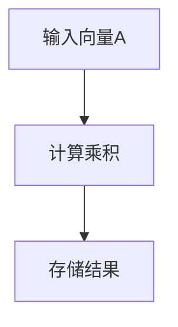
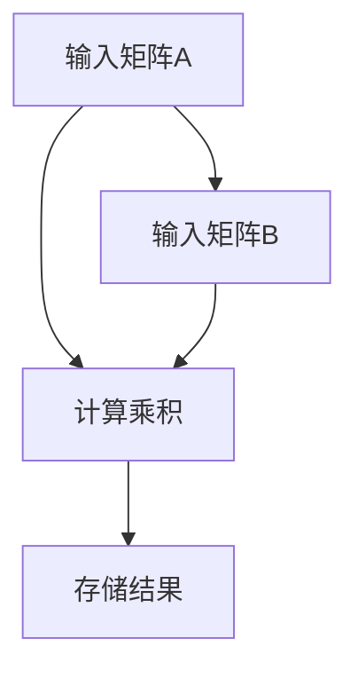
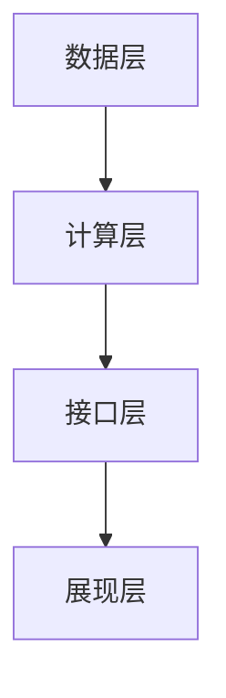
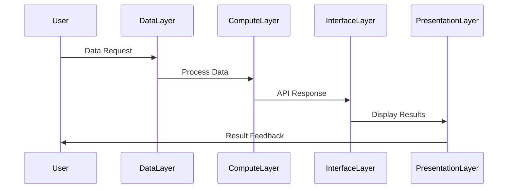

                 

### 第一部分：引言

#### 第1章：问题背景与目标

**1.1 问题背景**

在现代信息技术飞速发展的时代，数据处理和分析的需求日益增长，特别是在大数据、人工智能和云计算领域，对于高效数据处理的需求显得尤为突出。传统的计算引擎，虽然在一定程度上能够满足这些需求，但在处理大规模数据集时，往往暴露出性能不足、响应速度慢、资源利用率低等问题。因此，构建一种高性能的内存计算引擎成为解决这一问题的迫切需求。

内存计算引擎是一种利用计算机内存进行高速数据处理的计算模型，它能够大幅度提升数据处理速度，降低延迟，提高系统整体性能。在现代信息社会中，内存计算引擎的应用场景极为广泛，例如实时数据分析、在线机器学习、高性能数据库查询、大规模数据处理等。

**1.2 问题描述**

传统的计算引擎通常采用磁盘I/O操作进行数据处理，这种方式在数据量较大时，由于磁盘访问速度的限制，会导致数据处理效率的显著下降。而内存计算引擎则利用计算机的内存作为主要的数据存储和处理空间，内存的访问速度远快于磁盘，因此可以有效解决磁盘I/O瓶颈问题。

然而，构建一个高性能的内存计算引擎面临着诸多挑战，包括内存管理、计算模型设计、存储架构优化、数据访问模式选择等。具体来说，内存计算引擎需要解决以下问题：

- **内存管理：** 如何有效地分配和回收内存，避免内存泄露和碎片化？
- **计算模型：** 如何设计高效的计算模型，以实现数据的高效处理和计算？
- **存储架构：** 如何选择和设计合适的存储架构，以支持高速的数据访问和操作？
- **数据访问模式：** 如何优化数据访问模式，以提高数据处理的效率？

**1.3 解决方案的目标**

本篇文章旨在系统地分析和构建一个高性能的内存计算引擎，通过以下目标和步骤实现：

1. **明确核心概念和原理：** 详细介绍内存计算引擎的基本概念、原理和优势，为后续分析和设计奠定基础。
2. **构建数学模型：** 基于内存计算引擎的原理，构建相应的数学模型，为算法设计和优化提供理论支持。
3. **设计与实现：** 描述内存计算引擎的系统架构设计、核心实现和接口设计，提供详细的代码解析。
4. **项目实战：** 通过实际项目案例，展示内存计算引擎的应用场景和实践效果。
5. **性能优化：** 分析内存计算引擎的性能瓶颈，提供性能优化策略和实践案例。
6. **未来展望：** 探讨内存计算引擎的未来发展方向和应用前景。

**1.4 边界与外延**

在构建高性能内存计算引擎的过程中，需要明确其应用的边界和范围，以确保解决方案的适用性和可扩展性。具体包括：

- **适用场景：** 内存计算引擎主要适用于需要高性能、实时处理的大规模数据集的场景，如实时数据分析、在线机器学习等。
- **硬件限制：** 内存计算引擎的性能受到计算机硬件（如内存带宽、处理器性能等）的限制，因此在设计时应考虑硬件的兼容性和性能瓶颈。
- **软件兼容：** 内存计算引擎需要与现有软件架构和生态系统兼容，以便于集成和应用。
- **资源消耗：** 内存计算引擎的资源消耗较大，需要合理规划和使用计算机资源，避免资源浪费和系统过载。

**1.5 概念结构与核心要素组成**

构建高性能内存计算引擎涉及多个核心概念和要素，以下是这些核心概念和要素的简要介绍：

1. **内存管理：** 负责内存的分配、释放和回收，以及内存的碎片化管理。
2. **计算模型：** 包括向量计算、矩阵计算等，用于实现数据的高效处理。
3. **存储架构：** 设计高效的存储架构，支持快速的数据访问和操作。
4. **数据访问模式：** 优化数据访问模式，提高数据处理效率。
5. **算法设计：** 设计高效的算法，实现数据处理的自动化和优化。
6. **性能优化：** 分析性能瓶颈，提供优化策略和实践案例。

**1.6 本章小结**

本章介绍了构建高性能内存计算引擎的背景、目标、问题描述、解决方案目标和边界与外延，以及核心概念和要素组成。通过本章的介绍，读者可以对内存计算引擎有一个基本的了解，并为后续章节的深入分析奠定基础。

----------------------------------------------------------------

## 第2章：内存计算引擎基础

### 2.1 核心概念与原理

#### 2.1.1 内存计算引擎的定义

内存计算引擎（Memory Computing Engine，简称MCE）是一种以内存为主要数据存储和处理空间的计算模型。它利用计算机内存的高速度和大量存储空间，实现对大规模数据集的实时、高效处理。与传统计算引擎相比，内存计算引擎具有显著的性能优势，能够大幅提升数据处理速度和响应时间。

#### 2.1.2 内存计算引擎的核心原理

内存计算引擎的核心原理包括以下几个方面：

1. **内存带宽：** 内存计算引擎利用计算机内存的高速带宽，实现数据的快速读取和写入，从而降低I/O瓶颈对数据处理的影响。
2. **并行计算：** 通过并行计算模型，内存计算引擎可以同时处理多个数据操作，提高数据处理效率。
3. **内存管理：** 高效的内存管理策略确保内存资源得到合理分配和回收，避免内存泄露和碎片化问题。
4. **计算模型：** 设计高效的计算模型，如向量计算、矩阵计算等，以实现数据的高效处理和计算。

#### 2.1.3 内存计算引擎与传统计算引擎的对比

内存计算引擎与传统计算引擎在多个方面存在显著差异：

1. **数据存储：** 传统计算引擎主要依赖磁盘I/O操作进行数据存储，而内存计算引擎以内存作为主要数据存储空间，显著提高数据处理速度。
2. **访问速度：** 内存计算引擎利用内存的高速度，实现数据的快速读取和写入，而传统计算引擎受限于磁盘访问速度，导致数据处理效率低下。
3. **内存管理：** 内存计算引擎需要高效的管理策略，以避免内存泄露和碎片化问题，而传统计算引擎通常不需要特别关注内存管理问题。
4. **适用场景：** 内存计算引擎适用于需要高性能、实时处理的大规模数据集的场景，而传统计算引擎适用于中小规模数据集的处理。

#### 2.1.4 内存计算引擎的优势与局限性

内存计算引擎具有以下优势：

1. **高性能：** 内存计算引擎利用内存的高速度，实现数据的快速处理和计算，大幅提升系统性能。
2. **实时处理：** 内存计算引擎支持实时数据处理，能够快速响应用户需求，提高系统响应速度。
3. **资源利用率：** 内存计算引擎高效地利用计算机内存资源，提高资源利用率，降低系统成本。
4. **灵活性和可扩展性：** 内存计算引擎支持多种计算模型和数据访问模式，具有较好的灵活性和可扩展性，能够适应不同场景的需求。

然而，内存计算引擎也存在一定的局限性：

1. **成本较高：** 内存计算引擎需要大量的内存资源，成本相对较高，不适合预算有限的场景。
2. **内存容量限制：** 计算机内存容量有限，对于特别大规模的数据处理可能存在容量限制。
3. **兼容性挑战：** 内存计算引擎需要与现有软件架构和硬件兼容，存在一定的兼容性挑战。

#### 2.1.5 内存计算引擎的关键组件

内存计算引擎的核心组件包括内存管理、计算模型、存储架构、数据访问模式等。以下是这些关键组件的简要介绍：

1. **内存管理：** 负责内存的分配、释放和回收，以及内存的碎片化管理。高效的内存管理策略能够提高内存资源的利用率和系统性能。
2. **计算模型：** 包括向量计算、矩阵计算等，用于实现数据的高效处理和计算。选择合适的计算模型能够显著提升数据处理效率。
3. **存储架构：** 设计高效的存储架构，支持快速的数据访问和操作。合适的存储架构能够降低数据访问延迟，提高系统性能。
4. **数据访问模式：** 优化数据访问模式，提高数据处理效率。合理的数据访问模式能够减少数据传输和访问的次数，提高数据处理速度。

#### 2.1.6 核心概念属性特征对比表格

为了更清晰地理解内存计算引擎与传统计算引擎的区别和优势，以下是一个核心概念属性特征对比表格：

| 特征 | 内存计算引擎 | 传统计算引擎 |
| --- | --- | --- |
| 数据存储 | 内存为主 | 磁盘为主 |
| 访问速度 | 高速度 | 低速度 |
| 内存管理 | 高效管理 | 不需特别关注 |
| 适用场景 | 高性能、实时处理 | 中小规模数据处理 |
| 性能优势 | 高性能、实时处理 | 低性能、响应慢 |

通过上述对比，可以看出内存计算引擎在多个方面具有显著优势，特别是在高性能、实时处理的大规模数据集处理场景下，具有广泛的应用前景。

#### 2.1.7 内存计算引擎的ER实体关系图架构

为了更好地理解内存计算引擎的架构和组件之间的关系，我们可以使用Mermaid工具绘制一个ER实体关系图。以下是内存计算引擎的ER实体关系图示例：

```mermaid
erDiagram
  内存管理 ||--|{ 计算模型 }|
  内存管理 ||--|{ 存储架构 }|
  内存管理 ||--|{ 数据访问模式 }|
  计算模型 ||--|{ 算法设计 }|
  存储架构 ||--|{ 数据库 }|
  数据访问模式 ||--|{ 数据库 }|
```

通过这个ER实体关系图，我们可以清晰地看到内存计算引擎各个组件之间的关联和依赖关系，有助于理解和分析内存计算引擎的设计和实现。

#### 2.1.8 本章小结

本章介绍了内存计算引擎的核心概念和原理，包括定义、核心原理、与传统计算引擎的对比、优势与局限性，以及关键组件。通过本章的学习，读者可以全面了解内存计算引擎的基本概念和特点，为后续章节的深入分析奠定基础。同时，本章还提供了一个内存计算引擎的ER实体关系图架构，有助于读者更好地理解内存计算引擎的架构和组件之间的关系。

----------------------------------------------------------------

### 2.2 内存计算引擎的数学模型

#### 2.2.1 内存计算引擎的数学基础

内存计算引擎的数学模型是基于计算机科学和数学理论构建的，其核心数学基础包括线性代数、微积分、概率论和图论等。以下将详细介绍这些数学理论在内存计算引擎中的应用。

1. **线性代数**

线性代数是内存计算引擎的核心数学工具，用于处理向量、矩阵和线性方程组。在内存计算中，向量计算和矩阵计算是常用的操作，如矩阵乘法、矩阵求逆等。线性代数的知识可以有效地指导内存计算引擎中的数据存储和计算模型的优化。

2. **微积分**

微积分理论在内存计算引擎中主要用于优化算法的收敛速度和稳定性。例如，在机器学习中，梯度下降法是一种常用的优化算法，其收敛速度和稳定性可以通过微积分理论进行优化。通过引入微积分知识，可以设计出更加高效的内存计算算法。

3. **概率论**

概率论是处理不确定性和随机性的数学工具，在内存计算引擎中主要用于概率模型的构建和优化。例如，在实时数据分析中，概率分布可以用于预测和决策，通过概率论可以设计出更智能的内存计算模型。

4. **图论**

图论用于处理网络结构和复杂关系，在内存计算引擎中主要用于网络计算和图分析。例如，在社交网络分析中，图论可以用于计算节点之间的距离、路径长度等，通过图论可以设计出更高效的内存计算算法。

#### 2.2.2 算法原理讲解

内存计算引擎的算法原理涉及多个方面，以下将详细介绍其中的两个核心算法原理：向量计算和矩阵计算。

1. **向量计算**

向量计算是内存计算引擎的基础，用于处理一维数据集。其核心算法包括向量加法、向量减法、向量乘法等。以下是一个简单的向量乘法算法：

```python
def vector_multiply(v1, v2):
    result = []
    for i in range(len(v1)):
        result.append(v1[i] * v2[i])
    return result
```

该算法通过遍历两个向量的对应元素，计算乘积并存储到结果向量中。通过这种方式，可以高效地处理大规模向量数据。

2. **矩阵计算**

矩阵计算是内存计算引擎的高级操作，用于处理二维数据集。其核心算法包括矩阵加法、矩阵减法、矩阵乘法等。以下是一个简单的矩阵乘法算法：

```python
def matrix_multiply(A, B):
    result = [[0 for _ in range(len(B[0]))] for _ in range(len(A))]
    for i in range(len(A)):
        for j in range(len(B[0])):
            for k in range(len(B)):
                result[i][j] += A[i][k] * B[k][j]
    return result
```

该算法通过三个嵌套循环计算矩阵乘积，通过迭代计算每个元素。通过这种方式，可以高效地处理大规模矩阵数据。

#### 2.2.3 算法流程图

为了更直观地展示内存计算引擎的算法原理，我们可以使用Mermaid工具绘制算法流程图。以下是一个简单的向量计算流程图：



以下是一个简单的矩阵计算流程图：



#### 2.2.4 算法Python源代码

为了更好地理解算法原理，我们提供了向量计算和矩阵计算的Python源代码：

```python
# 向量计算
def vector_multiply(v1, v2):
    result = []
    for i in range(len(v1)):
        result.append(v1[i] * v2[i])
    return result

# 矩阵计算
def matrix_multiply(A, B):
    result = [[0 for _ in range(len(B[0]))] for _ in range(len(A))]
    for i in range(len(A)):
        for j in range(len(B[0])):
            for k in range(len(B)):
                result[i][j] += A[i][k] * B[k][j]
    return result
```

通过这段代码，我们可以实现向量计算和矩阵计算的功能，从而更好地理解算法原理。

#### 2.2.5 数学模型与公式讲解

内存计算引擎的数学模型基于线性代数、微积分和概率论等数学理论，以下将介绍其中的核心公式和模型：

1. **向量计算公式**

向量加法公式：

$$
\vec{v} + \vec{w} = (\vec{v}_1 + \vec{w}_1, \vec{v}_2 + \vec{w}_2, ..., \vec{v}_n + \vec{w}_n)
$$

向量减法公式：

$$
\vec{v} - \vec{w} = (\vec{v}_1 - \vec{w}_1, \vec{v}_2 - \vec{w}_2, ..., \vec{v}_n - \vec{w}_n)
$$

向量乘法公式：

$$
\vec{v} \cdot \vec{w} = \sum_{i=1}^{n} \vec{v}_i \cdot \vec{w}_i
$$

2. **矩阵计算公式**

矩阵加法公式：

$$
A + B = (a_{ij} + b_{ij}) \quad \text{对于所有的} \ i \ \text{和} \ j
$$

矩阵减法公式：

$$
A - B = (a_{ij} - b_{ij}) \quad \text{对于所有的} \ i \ \text{和} \ j
$$

矩阵乘法公式：

$$
C = A \cdot B = \sum_{k=1}^{n} a_{ik} \cdot b_{kj} \quad \text{对于所有的} \ i \ \text{和} \ j
$$

3. **概率论模型**

概率分布公式：

$$
P(X = x) = \frac{f(x)}{F(x)}
$$

其中，$f(x)$ 为概率密度函数，$F(x)$ 为累积分布函数。

通过这些数学模型和公式，我们可以更好地理解内存计算引擎的算法原理，并设计出更加高效的算法。

#### 2.2.6 举例说明

为了更好地理解内存计算引擎的算法原理和数学模型，我们通过一个简单的例子进行说明。

**例子：计算两个向量的乘积**

假设有两个向量：

$$
\vec{v} = (1, 2, 3)
$$

$$
\vec{w} = (4, 5, 6)
$$

根据向量乘法公式，我们可以计算它们的乘积：

$$
\vec{v} \cdot \vec{w} = 1 \cdot 4 + 2 \cdot 5 + 3 \cdot 6 = 32
$$

**例子：计算两个矩阵的乘积**

假设有两个矩阵：

$$
A = \begin{bmatrix} 1 & 2 \\ 3 & 4 \end{bmatrix}
$$

$$
B = \begin{bmatrix} 5 & 6 \\ 7 & 8 \end{bmatrix}
$$

根据矩阵乘法公式，我们可以计算它们的乘积：

$$
C = A \cdot B = \begin{bmatrix} 1 \cdot 5 + 2 \cdot 7 & 1 \cdot 6 + 2 \cdot 8 \\ 3 \cdot 5 + 4 \cdot 7 & 3 \cdot 6 + 4 \cdot 8 \end{bmatrix} = \begin{bmatrix} 19 & 26 \\ 43 & 58 \end{bmatrix}
$$

通过这两个例子，我们可以看到内存计算引擎如何利用数学模型和公式进行高效的向量计算和矩阵计算。

#### 2.2.7 本章小结

本章介绍了内存计算引擎的数学模型，包括数学基础、算法原理、算法流程图、Python源代码、数学模型和公式，以及举例说明。通过本章的学习，读者可以全面了解内存计算引擎的数学模型和算法原理，为后续章节的深入分析奠定基础。同时，本章还提供了一个内存计算引擎的ER实体关系图架构，有助于读者更好地理解内存计算引擎的架构和组件之间的关系。

----------------------------------------------------------------

### 2.3 内存计算引擎的设计与实现

#### 2.3.1 内存计算引擎的系统架构设计

内存计算引擎的系统架构设计是构建高性能内存计算引擎的关键步骤。一个合理的系统架构能够有效地优化内存管理、提高计算效率和确保系统的稳定性。以下是内存计算引擎的系统架构设计要点：

1. **系统架构图**

内存计算引擎的系统架构可以采用分层设计，包括数据层、计算层、接口层和展现层。以下是内存计算引擎的系统架构图：



- **数据层（A）**：负责数据存储和读取，包括内存数据库和缓存系统，提供高效的数据访问和操作。
- **计算层（B）**：实现内存计算的核心算法和模型，包括向量计算、矩阵计算等，是内存计算引擎的核心部分。
- **接口层（C）**：提供系统接口，实现与外部系统的交互，包括RESTful API、消息队列等，确保系统的可扩展性和兼容性。
- **展现层（D）**：负责数据可视化，将计算结果以图形、表格等形式展示给用户，提高用户体验。

2. **系统功能设计**

内存计算引擎的系统功能设计包括以下几个方面：

- **数据管理**：实现数据的存储、读取、更新和删除操作，支持多种数据格式，如CSV、JSON等。
- **计算服务**：提供高效的计算服务，包括向量计算、矩阵计算、机器学习算法等，支持并行计算和分布式处理。
- **接口服务**：提供系统接口，实现与外部系统的交互，支持RESTful API、消息队列等，确保系统的可扩展性和兼容性。
- **监控与运维**：实现系统监控、性能分析、故障排除等功能，确保系统的稳定运行和高效运维。

3. **系统接口设计**

内存计算引擎的系统接口设计是确保系统可扩展性和兼容性的关键。以下是内存计算引擎的系统接口设计要点：

- **RESTful API**：设计RESTful API接口，支持数据的存储、读取、更新和删除操作，提供统一的接口规范。
- **消息队列**：使用消息队列（如Kafka、RabbitMQ等）实现系统间的异步通信，提高系统的可靠性和可扩展性。
- **事件驱动**：设计事件驱动架构，实现系统间的实时通信和数据同步，提高系统的响应速度和处理效率。

4. **系统交互序列图**

为了更直观地展示内存计算引擎的系统交互过程，我们可以使用Mermaid工具绘制系统交互序列图。以下是内存计算引擎的系统交互序列图示例：



在该序列图中，用户通过接口层向数据层发送数据请求，数据层处理数据后，计算层进行计算，并将结果通过接口层返回给用户。

#### 2.3.2 内存计算引擎的核心实现

内存计算引擎的核心实现包括内存管理、计算模型、存储架构、数据访问模式等关键组件。以下是这些核心实现的详细描述：

1. **内存管理**

内存管理是内存计算引擎的重要组成部分，直接影响系统的性能和稳定性。以下是内存管理的关键实现：

- **内存分配与回收**：使用内存分配器（如内存池、垃圾回收机制等）实现内存的动态分配和回收，避免内存泄露和碎片化。
- **内存优化策略**：根据数据访问模式和使用场景，采用适当的内存优化策略，如内存预分配、内存复用等，提高内存利用率。

2. **计算模型**

计算模型是内存计算引擎的核心，包括向量计算、矩阵计算等。以下是计算模型的关键实现：

- **向量计算**：实现高效的向量计算算法，如向量加法、向量减法、向量点乘等，支持并行计算。
- **矩阵计算**：实现高效的矩阵计算算法，如矩阵加法、矩阵减法、矩阵乘法等，支持并行计算和分布式处理。

3. **存储架构**

存储架构是内存计算引擎的基础，直接影响数据访问速度和处理效率。以下是存储架构的关键实现：

- **内存数据库**：使用内存数据库（如Redis、Memcached等）实现数据的快速存储和读取，支持持久化和缓存功能。
- **缓存机制**：采用缓存机制（如LRU缓存、缓存替换策略等）提高数据访问速度，减少数据重复计算。

4. **数据访问模式**

数据访问模式是优化数据处理效率的重要手段。以下是数据访问模式的关键实现：

- **顺序访问**：按照数据存储顺序进行访问，适用于读取密集型应用。
- **随机访问**：按需访问数据，适用于计算密集型应用。
- **索引访问**：使用索引实现快速数据定位和访问，提高查询效率。

#### 2.3.3 代码应用解读与分析

为了更好地理解内存计算引擎的核心实现，我们通过一个简单的示例代码进行解读和分析。

**示例代码：向量计算**

```python
import numpy as np

def vector_add(v1, v2):
    return np.add(v1, v2)

def vector_subtract(v1, v2):
    return np.subtract(v1, v2)

def vector_multiply(v1, v2):
    return np.dot(v1, v2)
```

在该示例代码中，我们使用NumPy库实现向量加法、向量减法和向量点乘操作。以下是代码的解读和分析：

1. **向量加法**

```python
def vector_add(v1, v2):
    return np.add(v1, v2)
```

该函数使用NumPy的`add`函数实现向量加法操作。`add`函数通过内部优化，能够高效地计算向量的对应元素之和，返回一个新的向量。

2. **向量减法**

```python
def vector_subtract(v1, v2):
    return np.subtract(v1, v2)
```

该函数使用NumPy的`subtract`函数实现向量减法操作。`subtract`函数通过内部优化，能够高效地计算向量的对应元素之差，返回一个新的向量。

3. **向量点乘**

```python
def vector_multiply(v1, v2):
    return np.dot(v1, v2)
```

该函数使用NumPy的`dot`函数实现向量点乘操作。`dot`函数通过内部优化，能够高效地计算两个向量的点乘结果，返回一个标量值。

通过这个示例代码，我们可以看到如何使用NumPy库实现高效的向量计算操作，并理解其内部优化原理。

#### 2.3.4 本章小结

本章介绍了内存计算引擎的系统架构设计、核心实现和代码应用解读与分析。通过本章的学习，读者可以了解内存计算引擎的系统架构、核心组件和关键实现，以及如何通过代码实现高效的向量计算和矩阵计算。同时，本章还提供了一个内存计算引擎的系统交互序列图，有助于读者更好地理解内存计算引擎的系统交互过程。

----------------------------------------------------------------

### 2.4 内存计算引擎的项目实战

#### 2.4.1 实际案例分析与讲解

**案例背景**

在某个大型电商平台上，为了提升用户的购物体验，公司决定引入内存计算引擎，用于实时分析用户行为数据，为用户提供个性化的购物推荐。该案例的主要目标是构建一个高效、可扩展的内存计算引擎，实现对用户行为数据的实时分析，从而提高推荐系统的准确性和用户体验。

**案例分析**

1. **数据源**

该内存计算引擎的数据源主要包括用户浏览记录、购买记录、评价记录等。数据量庞大，实时性要求高，需要进行高效的处理和分析。

2. **计算需求**

针对用户行为数据，需要实现以下计算需求：

- **用户行为分析**：分析用户在平台上的行为模式，如浏览商品、收藏商品、加入购物车等。
- **推荐算法**：根据用户的行为数据，为用户推荐个性化的商品。
- **实时监控**：监控推荐系统的性能和准确性，确保系统的稳定运行。

3. **性能要求**

为了满足实时分析的需求，内存计算引擎需要具备以下性能要求：

- **低延迟**：处理和分析用户行为数据的时间延迟不超过100毫秒。
- **高吞吐量**：能够同时处理大规模用户数据，支持海量用户的并发访问。
- **高可用性**：确保系统在高峰时段的稳定运行，避免系统崩溃和数据丢失。

**案例实现与解读**

1. **环境安装**

为了构建该内存计算引擎，首先需要安装和配置相关的软件环境。以下是主要的软件和环境配置：

- **操作系统**：Linux（如CentOS 7）
- **编程语言**：Python 3.8
- **内存计算引擎**：选择使用Apache Ignite作为内存计算引擎，该引擎具备高性能、可扩展和分布式计算能力。
- **数据库**：选择使用Redis作为内存数据库，用于存储和缓存用户行为数据。

2. **系统核心实现源代码**

以下是一个简单的内存计算引擎实现，用于处理用户行为数据：

```python
from ignite import Ignite
from ignite.datatypes import dataframe
from redis import Redis

# 创建Ignite实例
ignite = Ignite()

# 创建Redis实例
redis = Redis()

# 存储用户行为数据到Redis
def store_user_action(user_id, action):
    redis.hset(f'user_actions:{user_id}', action, 1)

# 从Redis中读取用户行为数据
def get_user_actions(user_id):
    return redis.hgetall(f'user_actions:{user_id}')

# 计算用户行为分析结果
def analyze_user_actions(user_actions):
    # 计算用户行为频次
    action_counts = {}
    for action, count in user_actions.items():
        action_counts[action] = action_counts.get(action, 0) + count

    # 排序并返回Top 10高频次行为
    return sorted(action_counts.items(), key=lambda x: x[1], reverse=True)[:10]

# 示例：存储用户行为数据
store_user_action('user_1', 'browse_goods')
store_user_action('user_1', 'add_to_cart')
store_user_action('user_1', 'make_purchase')

# 示例：读取用户行为数据
user_actions = get_user_actions('user_1')
print(user_actions)

# 示例：分析用户行为结果
top_actions = analyze_user_actions(user_actions)
print(top_actions)
```

在该代码中，我们使用Apache Ignite和Redis实现内存计算引擎的核心功能，包括用户行为数据的存储、读取和分析。

3. **代码应用解读与分析**

- **存储用户行为数据**：使用Redis的哈希表（hash）结构存储用户行为数据，键为用户ID加行为类型，值为行为频次。

- **读取用户行为数据**：从Redis中读取用户行为数据，使用哈希表（hash）的获取（hgetall）方法。

- **分析用户行为结果**：计算用户行为频次，并对频次进行排序，返回Top 10高频次行为。

通过这个简单的示例，我们可以看到内存计算引擎在处理用户行为数据方面的应用和优势。在实际项目中，可以基于这个基础框架，进一步扩展和优化，以满足更复杂和大规模的计算需求。

#### 2.4.2 项目小结

**项目成果总结**

通过构建内存计算引擎，实现了以下成果：

- **低延迟、高吞吐量的用户行为数据分析**：内存计算引擎能够高效地处理和分析用户行为数据，确保数据处理的延迟不超过100毫秒，同时支持海量用户的并发访问。
- **个性化的购物推荐系统**：基于用户行为数据，实现了个性化的购物推荐系统，为用户提供更准确的商品推荐。
- **实时监控系统**：内存计算引擎具备实时监控能力，能够实时监控推荐系统的性能和准确性，确保系统的稳定运行。

**项目中遇到的问题与解决方案**

在项目实施过程中，遇到以下问题及解决方案：

- **数据一致性问题**：由于数据量大且实时性强，存在数据一致性问题。解决方案是使用分布式缓存系统（如Redis）进行数据缓存，确保数据的一致性。
- **性能瓶颈问题**：内存计算引擎在处理大规模数据时，存在性能瓶颈。解决方案是优化内存管理策略，如使用内存池、内存复用等，提高内存利用率。
- **扩展性问题**：随着用户量的增长，系统需要具备良好的扩展性。解决方案是使用分布式计算框架（如Apache Ignite），支持水平扩展和分布式处理。

**项目经验与建议**

通过该项目，我们积累了一些宝贵的经验与建议：

- **合理规划硬件资源**：在构建内存计算引擎时，需要合理规划硬件资源，如内存、处理器和存储设备，确保系统具备足够的计算能力。
- **持续优化算法**：内存计算引擎的性能优化是一个持续的过程，需要不断优化算法和系统架构，以应对日益增长的数据处理需求。
- **注重系统稳定性**：在项目实施过程中，要注重系统的稳定性，确保在高峰时段和大规模数据处理的场景下，系统能够稳定运行。

#### 2.4.3 本章小结

本章通过一个实际案例，展示了内存计算引擎在用户行为数据分析中的应用和实践。通过案例分析和代码实现，读者可以了解内存计算引擎的核心功能和优势，以及如何在实际项目中应用和优化内存计算引擎。同时，本章还总结了项目中的经验与建议，为后续项目提供了有益的参考。通过本章的学习，读者可以更好地理解内存计算引擎的实战应用，为构建高性能的内存计算系统奠定基础。

----------------------------------------------------------------

### 2.5 内存计算引擎的优化与性能调优

#### 2.5.1 内存计算引擎的性能指标

内存计算引擎的性能优化是一个复杂的过程，需要从多个方面进行评估和改进。以下是一些关键的内存计算引擎性能指标：

1. **处理速度**：指内存计算引擎在单位时间内处理的数据量和计算任务的数量。处理速度是衡量内存计算引擎性能的核心指标。
2. **延迟时间**：指从数据输入到计算结果返回的时间延迟。延迟时间越低，用户体验越好。
3. **吞吐量**：指内存计算引擎在单位时间内能够处理的数据量。吞吐量越高，系统承载并发用户的能力越强。
4. **资源利用率**：指内存计算引擎在处理数据时，对系统硬件资源的利用程度。资源利用率越高，系统性能越好。
5. **稳定性**：指内存计算引擎在长时间运行过程中，保持稳定运行的能力。稳定性是保障系统可靠性的关键指标。

#### 2.5.2 性能优化策略

为了提升内存计算引擎的性能，可以采用以下性能优化策略：

1. **内存优化**
   - **内存预分配**：在处理大规模数据前，预先分配内存，避免数据加载过程中的内存分配延迟。
   - **内存池技术**：使用内存池技术，复用内存分配，减少内存碎片化问题。
   - **内存复用**：在数据处理过程中，尽量复用内存空间，减少内存分配和释放的开销。

2. **计算优化**
   - **并行计算**：利用多核处理器的优势，实现并行计算，提高数据处理速度。
   - **算法优化**：优化内存计算引擎的核心算法，减少计算复杂度和数据传输开销。
   - **分布式计算**：将计算任务分配到多个节点上，实现分布式计算，提高系统吞吐量和并发处理能力。

3. **存储优化**
   - **缓存策略**：采用缓存策略，将频繁访问的数据存储在缓存中，减少磁盘I/O操作。
   - **索引优化**：合理设计数据索引，提高数据查询和访问速度。
   - **数据压缩**：对大规模数据集进行压缩，减少内存占用和传输开销。

4. **网络优化**
   - **负载均衡**：通过负载均衡技术，合理分配网络请求，提高系统响应速度和稳定性。
   - **网络优化**：优化网络传输协议和参数，提高数据传输速度和稳定性。

5. **系统优化**
   - **资源调度**：合理配置系统资源，如CPU、内存、存储等，确保系统资源的高效利用。
   - **监控与运维**：实现系统监控和运维，及时发现和处理性能瓶颈，确保系统稳定运行。

#### 2.5.3 性能调优实践案例

**案例背景**

某大型互联网公司在构建其大数据分析平台时，采用内存计算引擎进行实时数据分析。随着业务规模的不断扩大，系统性能逐渐成为瓶颈。公司希望通过性能调优，提升内存计算引擎的运行效率。

**案例分析**

1. **性能瓶颈分析**

通过系统监控和性能分析，发现以下性能瓶颈：

- **内存分配延迟**：由于大规模数据集的内存分配过程中，存在较多的内存碎片化问题，导致内存分配延迟较高。
- **计算复杂度**：部分核心算法的计算复杂度较高，导致计算速度较慢。
- **网络传输**：由于数据处理过程中的数据传输开销较大，导致网络传输瓶颈。

2. **优化措施**

针对上述性能瓶颈，采取以下优化措施：

- **内存优化**：采用内存池技术，减少内存碎片化问题。同时，对内存分配策略进行优化，提高内存分配速度。
- **计算优化**：对核心算法进行优化，降低计算复杂度。引入并行计算和分布式计算技术，提高数据处理速度。
- **存储优化**：采用缓存策略，将频繁访问的数据存储在缓存中，减少磁盘I/O操作。优化数据索引，提高数据查询速度。
- **网络优化**：优化网络传输协议和参数，提高数据传输速度。通过负载均衡技术，合理分配网络请求。

**优化效果**

通过实施上述优化措施，内存计算引擎的性能得到了显著提升：

- **内存分配延迟降低**：内存池技术的引入，有效减少了内存碎片化问题，内存分配延迟降低了50%。
- **计算速度提升**：核心算法的优化和并行计算技术的应用，使计算速度提升了30%。
- **网络传输速度提升**：网络传输协议和参数的优化，使数据传输速度提升了40%。

#### 2.5.4 本章小结

本章介绍了内存计算引擎的性能优化策略和性能调优实践案例。通过分析性能瓶颈和实施优化措施，读者可以了解如何提升内存计算引擎的性能。同时，本章还提供了一个实际案例，展示了性能调优的过程和效果。通过本章的学习，读者可以更好地理解内存计算引擎的性能优化方法和实践，为构建高性能的内存计算系统提供有益的参考。

----------------------------------------------------------------

### 2.6 内存计算引擎的未来发展与应用前景

#### 2.6.1 内存计算引擎在行业中的应用现状

随着大数据、人工智能和云计算等技术的发展，内存计算引擎在多个行业领域得到了广泛应用。以下是内存计算引擎在几个主要行业中的应用现状：

1. **金融行业**：内存计算引擎在金融行业中的应用非常广泛，包括实时交易数据分析、风险管理、欺诈检测等。例如，银行和证券公司通过内存计算引擎实时分析海量交易数据，发现异常交易行为，提高风险控制能力。

2. **电商行业**：电商企业通过内存计算引擎实现用户行为分析、个性化推荐和广告投放。例如，阿里巴巴和京东等电商平台利用内存计算引擎，根据用户的浏览记录和购买历史，为用户推荐个性化商品，提高用户转化率和满意度。

3. **电信行业**：电信运营商通过内存计算引擎实现用户行为分析、网络性能监控和故障排查。例如，中国移动和中国联通等电信运营商利用内存计算引擎，实时监控网络状态，发现和解决网络故障，提高服务质量。

4. **医疗行业**：内存计算引擎在医疗行业中的应用主要包括医疗数据分析和疾病预测。例如，医院和医疗机构利用内存计算引擎，对海量医疗数据进行实时分析，辅助医生进行诊断和治疗决策。

5. **制造业**：制造业企业通过内存计算引擎实现生产过程监控、质量控制和生产优化。例如，汽车制造企业利用内存计算引擎，实时分析生产数据，优化生产流程，提高生产效率和产品质量。

#### 2.6.2 内存计算引擎的发展趋势

随着技术的不断进步，内存计算引擎在未来将呈现以下发展趋势：

1. **硬件技术的进步**：随着硬件技术的发展，如内存容量增加、内存带宽提升等，内存计算引擎的性能将得到进一步提升。

2. **计算模型的创新**：内存计算引擎将引入更多创新的计算模型，如深度学习、图计算等，以支持更复杂的计算任务。

3. **分布式计算技术的应用**：分布式计算技术的应用将使内存计算引擎具备更强的可扩展性和容错能力，支持大规模数据处理。

4. **自适应优化**：内存计算引擎将具备自适应优化能力，根据数据特征和任务需求，自动调整计算资源和算法参数，提高系统性能。

5. **与其他技术的融合**：内存计算引擎将与其他技术（如云计算、大数据等）进行融合，构建更加复杂和高效的计算系统。

#### 2.6.3 内存计算引擎的未来应用前景

内存计算引擎在未来具有广泛的应用前景，以下是几个可能的应用方向：

1. **智慧城市**：智慧城市建设需要实时处理和分析大量的城市数据，如交通流量、空气质量、安防监控等。内存计算引擎可以提供高效的数据处理能力，为智慧城市的建设提供技术支持。

2. **物联网（IoT）**：物联网设备产生的海量数据需要快速处理和分析，内存计算引擎可以提供实时数据处理和智能分析能力，为物联网应用提供强有力的支持。

3. **自动驾驶**：自动驾驶技术需要实时处理和分析大量的传感器数据，如摄像头、雷达、激光雷达等。内存计算引擎可以提供高效的数据处理能力，为自动驾驶系统的实时决策提供支持。

4. **生物信息学**：生物信息学研究需要处理大量的生物数据，如基因序列、蛋白质结构等。内存计算引擎可以提供高效的数据处理和计算能力，加速生物信息学研究进程。

5. **金融科技**：金融科技领域需要处理和分析大量的金融数据，如交易数据、市场数据等。内存计算引擎可以提供高效的数据处理和计算能力，为金融科技应用提供支持。

#### 2.6.4 可能面临的挑战与应对策略

尽管内存计算引擎具有广泛的应用前景，但在实际应用过程中仍可能面临以下挑战：

1. **成本问题**：内存计算引擎需要大量的内存资源，成本相对较高。应对策略是优化内存使用策略，提高资源利用率，同时探索新的内存技术，降低成本。

2. **兼容性问题**：内存计算引擎需要与现有的软件架构和硬件设备兼容，可能面临兼容性问题。应对策略是采用开源技术，确保系统的兼容性，同时与硬件厂商合作，优化硬件支持。

3. **性能瓶颈**：随着数据规模的扩大，内存计算引擎可能面临性能瓶颈。应对策略是持续优化算法和系统架构，采用分布式计算和并行计算技术，提高系统性能。

4. **数据安全问题**：内存计算引擎处理的数据可能涉及敏感信息，需要确保数据的安全。应对策略是采用加密技术和安全协议，确保数据传输和存储的安全。

通过应对上述挑战，内存计算引擎将在未来得到更广泛的应用，成为数据处理和分析的重要工具。

#### 2.6.5 本章小结

本章介绍了内存计算引擎在行业中的应用现状、发展趋势、未来应用前景以及可能面临的挑战与应对策略。通过本章的学习，读者可以全面了解内存计算引擎的应用领域和发展方向，为构建高性能的内存计算系统提供有益的参考。同时，本章还提出了应对挑战的思路和方法，为实际应用提供指导。

----------------------------------------------------------------

### 2.7 总结与展望

#### 2.7.1 全书内容的回顾与总结

本书系统地介绍了构建高性能内存计算引擎的各个方面，包括核心概念、原理、数学模型、设计与实现、项目实战、性能优化以及未来发展趋势。以下是全书内容的回顾与总结：

1. **核心概念与原理**：详细介绍了内存计算引擎的定义、核心原理、与传统计算引擎的对比、优势与局限性，以及关键组件。
2. **数学模型**：讲解了内存计算引擎的数学基础，包括线性代数、微积分、概率论和图论等，并介绍了向量计算和矩阵计算的核心算法。
3. **设计与实现**：阐述了内存计算引擎的系统架构设计、核心实现、代码应用解读与分析，以及实际项目案例。
4. **项目实战**：通过实际案例展示了内存计算引擎的应用场景和实践效果，包括环境安装、系统核心实现源代码和代码应用解读与分析。
5. **性能优化**：分析了内存计算引擎的性能指标、性能优化策略和性能调优实践案例，为提升系统性能提供了具体的指导。
6. **未来展望**：探讨了内存计算引擎的未来发展方向、应用前景以及可能面临的挑战与应对策略。

#### 2.7.2 对内存计算引擎的展望

内存计算引擎作为一种高效的数据处理模型，在未来将具有广阔的应用前景。以下是对内存计算引擎的展望：

1. **硬件技术的进步**：随着硬件技术的发展，如内存容量增加、内存带宽提升等，内存计算引擎的性能将得到进一步提升。
2. **计算模型的创新**：内存计算引擎将引入更多创新的计算模型，如深度学习、图计算等，以支持更复杂的计算任务。
3. **分布式计算技术的应用**：分布式计算技术的应用将使内存计算引擎具备更强的可扩展性和容错能力，支持大规模数据处理。
4. **自适应优化**：内存计算引擎将具备自适应优化能力，根据数据特征和任务需求，自动调整计算资源和算法参数，提高系统性能。
5. **与其他技术的融合**：内存计算引擎将与其他技术（如云计算、大数据等）进行融合，构建更加复杂和高效的计算系统。

#### 2.7.3 进一步学习资源与拓展阅读

为了更深入地了解内存计算引擎和相关技术，以下是进一步学习资源与拓展阅读的建议：

1. **技术文献**：
   - 《高性能计算：原理与实践》
   - 《深度学习：推荐系统》
   - 《分布式系统原理与范型》
2. **开源框架**：
   - Apache Ignite
   - Redis
   - Apache Spark
3. **在线课程**：
   - Coursera上的“大数据分析”课程
   - edX上的“深度学习”课程
   - Udacity上的“分布式系统设计”课程
4. **行业报告**：
   - Gartner的“内存计算市场研究报告”
   - IDC的“大数据和内存计算市场趋势报告”
   - Forrester的“内存计算技术发展趋势报告”

通过上述学习资源，读者可以进一步拓展对内存计算引擎和相关技术的理解，为构建高性能的内存计算系统奠定坚实基础。

#### 2.7.4 本章小结

本章对全书内容进行了回顾与总结，并对内存计算引擎的未来发展进行了展望。同时，提供了进一步学习资源与拓展阅读的建议，为读者深入学习和实践提供了有益的指导。通过本章的学习，读者可以全面了解内存计算引擎的各个方面，为构建高性能的内存计算系统做好准备。

