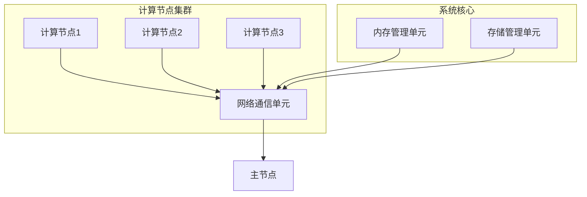

                 

### 建立高性能内存计算系统的意义

在现代计算机科学和信息技术领域，构建高性能内存计算系统已经成为提升数据处理效率和系统响应速度的关键。内存计算系统通过优化内存访问和处理速度，显著降低了数据访问延迟，提高了整体计算性能。这一需求在多个场景中尤为突出，比如大数据处理、实时数据处理、人工智能训练和金融计算等领域。

#### **背景介绍**：

首先，让我们回顾一下内存计算的基本概念。内存计算指的是在计算机内存中直接进行数据处理的一种技术，其核心在于数据存储与处理在内存层级完成，从而避免了频繁的数据在内存与存储设备之间的读写操作。传统的计算模型中，数据通常首先从硬盘读取到内存中，然后进行处理，这导致了大量的I/O操作，成为了系统性能的瓶颈。

随着数据量的爆炸式增长和计算需求的不断提升，传统计算模型在面对大数据集和复杂计算任务时，表现出了明显的性能瓶颈。内存计算的出现，使得数据处理可以在更短的时间内完成，从而极大地提升了系统的效率和响应速度。

#### **问题背景**：

现有内存计算系统在实际应用中存在以下几个问题：

1. **存储与计算分离**：传统系统依赖于存储设备，导致数据频繁在内存和存储设备之间迁移，增加了访问延迟。
2. **内存带宽限制**：随着数据量的增加，内存带宽成为瓶颈，限制了数据处理速度。
3. **缓存一致性**：多处理器系统中的缓存一致性协议复杂，增加了系统的复杂性。
4. **编程难度**：内存计算要求程序员深入理解内存层级结构和访问模式，增加了编程难度。

#### **问题解决**：

为了解决上述问题，高性能内存计算系统需要采取以下措施：

1. **优化内存层级结构**：通过引入更高级的内存架构，如多级缓存系统和高速内存技术，减少数据访问延迟。
2. **提升内存带宽**：采用高速内存接口和优化内存访问算法，提高内存带宽利用率。
3. **缓存一致性机制优化**：设计更高效的缓存一致性协议，降低多处理器系统中的复杂性。
4. **易用性提升**：提供更高级的编程模型和工具，降低编程难度。

#### **边界与外延**：

内存计算系统不仅包括硬件层面的优化，还涉及软件层面的设计和算法优化。它不仅限于计算密集型任务，还可以应用于各种需要高速数据处理的应用场景。随着技术的发展，内存计算系统将在更多领域得到应用，成为提升计算性能的重要手段。

#### **核心概念与联系**：

- **内存层级结构**：包括寄存器、高速缓存（L1、L2、L3）、主内存等层级。
- **内存带宽**：衡量内存数据传输速率的能力。
- **缓存一致性协议**：如MESI、MOESI等，确保多处理器系统中数据的一致性。
- **编程模型**：如SIMD、SIMT等，提供更高效的内存数据处理方式。

通过上述分析，我们可以看出，构建高性能内存计算系统具有重要意义，它不仅能够提升系统性能，还能为各个领域的计算需求提供更高效的解决方案。在接下来的章节中，我们将深入探讨内存计算系统的设计与实现细节，以及相关算法和优化技巧。

### 内存计算系统的核心概念与架构

#### **内存层级结构**

内存层级结构是内存计算系统的基石，它通过分层存储和数据缓存策略来优化数据访问速度。常见的内存层级结构包括寄存器、高速缓存（L1、L2、L3）和主内存。

1. **寄存器**：寄存器是CPU内部的最快存储单元，用于临时存储数据和指令。由于寄存器的容量有限，其访问速度极高，但成本也相对较高。

2. **高速缓存**：高速缓存位于寄存器和主内存之间，用于缓存经常访问的数据。高速缓存分为L1、L2、L3三级，L1缓存容量小但速度最快，L3缓存容量大但速度相对较慢。

   - **L1缓存**：集成在CPU核心中，访问速度极快，但容量有限。
   - **L2缓存**：通常位于CPU核心之外，容量较大，速度较快。
   - **L3缓存**：位于多处理器系统中，容量最大，速度较慢。

3. **主内存**：主内存是计算机系统的主存储器，用于存储程序和数据。主内存的访问速度相对较慢，但容量远大于缓存。

#### **内存带宽**

内存带宽是衡量内存数据传输速率的关键指标，通常以GB/s（千兆字节每秒）为单位。内存带宽越高，数据传输速度越快，系统能够处理的数据量也越大。影响内存带宽的主要因素包括：

- **内存接口速度**：内存接口速度决定了数据传输的带宽上限。
- **内存颗粒设计**：内存颗粒的并行带宽和传输速率决定了整体带宽。
- **内存访问模式**：连续访问和随机访问对带宽的影响不同。

#### **缓存一致性协议**

在多处理器系统中，缓存一致性协议（Cache Coherence Protocol）确保不同处理器中的缓存数据保持一致。常见的缓存一致性协议包括MESI（修改、独占、共享、无效）和MOESI（修改、共享、独占、失效）。

- **MESI协议**：通过四个状态（Modify、Exclusive、Shared、Invalid）来管理缓存行的一致性。
  - **Modify**：缓存行已被修改，且其他处理器中无副本。
  - **Exclusive**：缓存行未被修改，且其他处理器中无副本。
  - **Shared**：缓存行未被修改，但可能存在于其他处理器的缓存中。
  - **Invalid**：缓存行无效，无法访问。

- **MOESI协议**：在MESI协议的基础上增加了“共享”和“独占”两种状态，提高了缓存利用率和一致性。

#### **内存管理策略**

内存管理策略包括缓存策略、预取策略和内存分配策略等，用于优化内存访问和处理。

- **缓存策略**：通过选择合适的数据和算法，优化缓存命中率和访问速度。
- **预取策略**：在需要访问数据之前提前加载到缓存中，减少数据访问延迟。
- **内存分配策略**：根据数据访问模式和系统需求，动态分配和调整内存资源。

#### **内存计算的特点**

内存计算的特点包括：

- **低延迟**：通过优化内存层级结构和访问模式，显著降低数据访问延迟。
- **高性能**：内存计算可以在内存层级直接处理数据，避免频繁的I/O操作，提高整体计算性能。
- **实时性**：适用于需要实时处理大量数据的应用场景，如金融交易、自动驾驶和实时监控等。

#### **内存计算的应用场景**

内存计算适用于多种应用场景，包括但不限于：

- **大数据处理**：通过内存计算，快速处理和分析海量数据。
- **实时数据处理**：如物联网、实时监控和视频处理等，需要高速处理实时数据。
- **人工智能训练**：大规模神经网络训练需要大量内存计算资源。
- **金融计算**：高频交易、风险评估等场景，需要快速处理大量金融数据。

### **核心概念对比表格**

| **概念**       | **定义**                                                                 | **重要性** |
|----------------|-------------------------------------------------------------------------|------------|
| 内存层级结构   | 寄存器、高速缓存（L1、L2、L3）和主内存的层次结构。                       | 基础架构   |
| 内存带宽       | 内存数据传输速率的衡量指标。                                               | 性能指标   |
| 缓存一致性协议 | 确保多处理器系统中缓存数据一致性的协议。                                 | 系统稳定   |
| 内存管理策略   | 缓存策略、预取策略和内存分配策略等，用于优化内存访问和处理。               | 优化策略   |
| 内存计算特点   | 低延迟、高性能、实时性。                                                   | 应用场景   |

### **ER实体关系图架构**

```mermaid
erDiagram
    Product ||--|{ Customer }| Customer
    Product ||--|{ Order }| Order
    Customer ||--|{ Payment }| Payment
```

上述ER图展示了产品、客户、订单和支付之间的关系，体现了内存计算系统中数据管理和处理的核心实体及其关联。

通过以上分析，我们可以看到内存计算系统的核心概念和架构是如何优化内存访问和处理，从而提升整体计算性能的。在接下来的章节中，我们将深入探讨内存计算系统的设计与实现细节，包括系统架构、编程模型和优化技巧。

### 内存计算系统的设计与实现

#### **系统架构设计**

内存计算系统的架构设计是确保系统能够高效处理数据的基础。一个高性能的内存计算系统通常包含以下几个关键组件：内存层级架构、存储层次结构和数据处理单元。

1. **内存层级架构**：
   - **寄存器**：CPU内部的快速存储单元，用于临时存储数据和指令。
   - **L1缓存**：集成在CPU核心中，访问速度极快，但容量有限。
   - **L2缓存**：位于CPU核心之外，容量较大，速度较快。
   - **L3缓存**：位于多处理器系统中，容量最大，速度较慢。
   - **主内存**：计算机系统的主存储器，用于存储程序和数据。

2. **存储层次结构**：
   - **磁盘存储**：用于持久化存储数据和文件。
   - **SSD存储**：固态硬盘存储，提供高速随机访问能力。
   - **分布式存储**：如HDFS、Ceph等，用于处理大规模数据存储和分布式计算。

3. **数据处理单元**：
   - **计算节点**：负责执行计算任务的硬件设备。
   - **内存管理单元**：管理内存资源，包括内存分配、释放和缓存策略。
   - **网络通信单元**：负责处理数据在网络中的传输和通信。

#### **高级内存架构**

高级内存架构是提升内存计算性能的关键。以下是一些常用的高级内存架构技术：

1. **多级缓存系统**：
   - **L1缓存**：使用静态随机访问存储（SRAM）制造，速度最快，但容量有限。
   - **L2缓存**：使用动态随机访问存储（DRAM），容量较大，速度较快。
   - **L3缓存**：多处理器系统中的共享缓存，容量最大，速度较慢。

2. **缓存一致性协议**：
   - **MESI协议**：通过状态管理确保缓存行的一致性。
   - **MOESI协议**：在MESI协议的基础上，增加了共享和独占状态，提高缓存利用率。

3. **高速内存接口**：
   - **DDR（Double Data Rate）内存**：通过双倍数据传输速率提高带宽。
   - **HBM（High Bandwidth Memory）内存**：提供极高的带宽和延迟，适用于高性能计算。

#### **存储层次结构**

存储层次结构的设计目标是平衡存储容量、速度和成本。以下是一些常见的存储层次结构：

1. **多层存储系统**：
   - **SSD缓存层**：用于缓存频繁访问的数据，提高整体系统响应速度。
   - **磁盘存储层**：用于大规模数据存储，提供较低的存储成本。
   - **分布式存储层**：用于处理海量数据，提供高可用性和高扩展性。

2. **混合存储系统**：
   - **All-Flash存储**：完全使用固态硬盘存储，提供高速访问能力。
   - **分层存储**：根据数据访问模式和频率，动态调整数据在存储系统中的位置。

3. **分布式存储架构**：
   - **HDFS（Hadoop Distributed File System）**：适用于大数据存储和处理。
   - **Ceph**：提供高度可扩展的分布式存储解决方案。

#### **系统架构设计**

系统架构设计的目标是确保内存计算系统的高性能、高可用性和可扩展性。以下是一个典型的内存计算系统架构设计：

1. **计算节点集群**：
   - **计算节点**：由CPU、内存、存储和网络组成，负责执行计算任务。
   - **主节点**：负责集群管理和资源调度。

2. **内存管理单元**：
   - **内存分配器**：动态分配和释放内存资源。
   - **缓存管理器**：管理缓存策略和缓存一致性。

3. **存储管理单元**：
   - **存储分配器**：负责存储资源的分配和释放。
   - **存储管理器**：管理分布式存储系统。

4. **网络通信单元**：
   - **网络控制器**：负责数据在网络中的传输和通信。
   - **数据路由器**：优化数据传输路径和流量管理。

5. **监控与运维**：
   - **监控系统**：实时监控系统状态和性能。
   - **运维平台**：提供系统部署、维护和故障排查功能。

#### **系统架构设计mermaid架构图**



通过以上系统架构设计，我们可以确保内存计算系统的高效运行和数据处理能力。在接下来的章节中，我们将详细探讨内存管理策略、高性能编程模型以及优化技巧，进一步深入理解内存计算系统的设计与实现。

### 内存管理策略

内存管理是构建高性能内存计算系统的关键环节，其目标是通过优化内存分配、释放和缓存策略，提升系统的整体性能和响应速度。以下是一些重要的内存管理策略。

#### **缓存策略**

缓存策略旨在通过在内存中保存常用数据和指令，减少对存储设备的访问次数，从而提高数据访问速度。常见的缓存策略包括：

1. **缓存一致性协议**：
   - **MESI协议**：通过维护缓存行的四个状态（Modify、Exclusive、Shared、Invalid），确保多处理器系统中数据的一致性。
   - **MOESI协议**：在MESI协议的基础上，增加了“共享”和“独占”状态，提高缓存利用率和一致性。

2. **缓存替换算法**：
   - **最少使用（LRU）**：替换最久未使用的缓存行。
   - **最近最少使用（LRU）**：基于访问频率，替换访问频率最低的缓存行。

3. **缓存层次结构**：
   - **多级缓存系统**：包括L1、L2和L3缓存，每个层次的缓存具有不同的访问速度和容量。

#### **预取策略**

预取策略是通过在需要访问数据之前提前将其加载到缓存中，以减少数据访问延迟。预取策略可以分为以下几种：

1. **基于历史访问模式的预取**：
   - **线性预取**：基于历史访问模式，按照数据访问顺序预取后续数据。
   - **二维预取**：同时考虑行和列的访问模式，预取相关数据。

2. **基于访问概率的预取**：
   - **局部性预取**：利用程序执行时的局部性原理，预取未来可能访问的数据。
   - **全局预取**：根据全局数据访问模式，预取整个数据集。

3. **动态预取**：
   - **适应性预取**：根据实际访问情况动态调整预取策略。
   - **预测预取**：利用模型预测未来数据访问模式，进行预取。

#### **内存分配策略**

内存分配策略用于优化内存资源的利用，常见的内存分配策略包括：

1. **静态内存分配**：
   - **栈分配**：程序运行时自动分配内存，适用于固定大小的数据。
   - **静态分配**：程序编译时分配内存，适用于已知大小的数据。

2. **动态内存分配**：
   - **堆分配**：程序运行时动态分配内存，适用于大小不确定的数据。
   - **内存池**：预分配一块内存，用于频繁的内存分配和释放，减少内存碎片。

3. **内存复用**：
   - **对象池**：复用已经创建的对象，减少对象创建和销毁的开销。
   - **内存映射**：将磁盘文件映射到内存中，减少磁盘I/O操作。

#### **内存带宽优化**

内存带宽是影响系统性能的关键因素，以下是一些优化内存带宽的策略：

1. **并行访问**：
   - **数据并行**：将数据分成多个部分，同时访问，提高数据传输速率。
   - **任务并行**：将计算任务分布在多个处理器上，提高整体处理速度。

2. **内存复用**：
   - **内存复制**：通过复制数据到内存中的不同部分，减少内存访问冲突。
   - **内存聚合**：将多个内存访问操作合并成一个，减少内存访问次数。

3. **内存布局优化**：
   - **数据对齐**：按照内存对齐规则排列数据，提高数据访问效率。
   - **缓存行填充**：填充缓存行，减少缓存未命中的次数。

#### **内存访问模式优化**

内存访问模式对系统性能有重要影响，以下是一些优化内存访问模式的策略：

1. **顺序访问**：
   - **顺序读写**：按照数据访问顺序读写内存，提高缓存命中率。
   - **数据局部性**：利用数据局部性原理，优化数据访问模式。

2. **随机访问**：
   - **缓存局部性**：优化缓存策略，减少缓存未命中率。
   - **数据重排**：调整数据访问顺序，减少内存访问冲突。

3. **并行访问**：
   - **多线程并行**：利用多线程技术，并行处理多个数据块。
   - **并行处理单元**：集成并行处理单元，提高数据吞吐量。

通过以上内存管理策略，我们可以优化内存访问和处理速度，提高内存计算系统的性能和响应速度。在接下来的章节中，我们将进一步探讨高性能编程模型和优化技巧，为构建高效的内存计算系统提供更多实用方法。

### 高性能编程模型

在构建高性能内存计算系统时，选择合适的编程模型至关重要。以下将介绍几种常见的高性能编程模型，包括异步编程和并行计算，并探讨它们在内存计算系统中的应用和优势。

#### **异步编程**

异步编程是一种通过非阻塞式IO和回调机制来提高程序响应速度的编程范式。在异步编程中，程序不会等待I/O操作完成，而是立即返回控制权，继续执行后续操作。这种方法可以充分利用CPU资源，避免因为I/O操作而造成的线程阻塞。

1. **基本概念**：
   - **非阻塞IO**：程序在发起I/O请求后，立即返回控制权，不会等待I/O完成。
   - **回调函数**：在I/O操作完成后，通过回调函数来处理结果。

2. **应用场景**：
   - **网络应用**：如Web服务器、网络爬虫等，可以利用异步编程减少线程阻塞。
   - **文件操作**：如大文件读写，通过异步编程提高读写效率。

3. **优势**：
   - **提高吞吐量**：异步编程允许程序同时处理多个I/O请求，提高系统吞吐量。
   - **资源利用率**：避免了线程阻塞，提高了CPU的利用率。

4. **内存计算系统中的应用**：
   - **数据预处理**：在处理大量数据时，可以使用异步编程进行数据预处理，提高整体效率。
   - **网络通信**：在高频交易和实时数据处理中，异步编程可以减少网络延迟，提高系统响应速度。

#### **并行计算**

并行计算是一种通过将任务分解为多个子任务，同时执行，从而提高计算速度的方法。并行计算可以分为数据并行和任务并行两种模式。

1. **基本概念**：
   - **数据并行**：将数据集分割成多个部分，同时在不同的处理器上处理。
   - **任务并行**：将任务分解为多个子任务，同时在不同的处理器上执行。

2. **应用场景**：
   - **科学计算**：如气象预报、流体动力学模拟等，通过并行计算可以大幅缩短计算时间。
   - **大数据处理**：在处理大规模数据时，利用并行计算可以显著提高数据处理速度。

3. **优势**：
   - **提高计算速度**：通过并行处理，可以显著减少计算时间。
   - **扩展性**：易于扩展到更多处理器，提高系统计算能力。

4. **内存计算系统中的应用**：
   - **大数据处理**：在内存计算系统中，利用并行计算可以高效地处理大规模数据集。
   - **人工智能训练**：在深度学习训练中，利用并行计算可以加速模型训练过程。

#### **多线程编程**

多线程编程是一种通过在单个程序中同时执行多个线程来提高程序性能的编程模型。多线程编程在内存计算系统中有着广泛的应用。

1. **基本概念**：
   - **线程**：程序中的独立执行流。
   - **线程池**：预分配一定数量的线程，用于执行任务。

2. **应用场景**：
   - **高性能计算**：通过多线程编程，可以将计算任务分解为多个线程，提高计算速度。
   - **并发处理**：在处理并发请求时，利用多线程编程可以同时处理多个请求。

3. **优势**：
   - **提高响应速度**：通过多线程编程，可以同时处理多个任务，提高系统响应速度。
   - **资源共享**：多个线程可以共享程序资源，如内存、文件等。

4. **内存计算系统中的应用**：
   - **数据加工**：在处理大量数据时，可以使用多线程编程进行并行数据处理。
   - **实时监控**：在实时数据处理中，利用多线程编程可以同时处理多个数据流。

通过以上高性能编程模型，我们可以充分利用内存计算系统的硬件资源，提高数据处理速度和系统性能。在接下来的章节中，我们将进一步探讨内存计算系统的优化技巧，为构建高效的内存计算系统提供更多实用方法。

### 内存计算系统的优化技巧

内存计算系统的性能优化是提升数据处理效率和系统响应速度的关键。以下将介绍几种常见的优化技巧，包括内存布局优化、预取策略和编程模型优化。

#### **内存布局优化**

内存布局优化是提高内存计算系统性能的有效手段。合理的内存布局可以减少缓存未命中率，提高缓存利用率，从而提升系统性能。

1. **数据对齐**：

   数据对齐是指按照内存对齐规则排列数据，以减少缓存未命中率。常见的数据对齐方式包括：

   - **字对齐**：每个数据元素的长度都是字长的整数倍。
   - **块对齐**：数据块的大小是缓存行大小的整数倍。

   ```python
   def align_data(data, alignment):
       return ((data + alignment - 1) // alignment) * alignment
   ```

2. **缓存行填充**：

   缓存行填充是指填充缓存行，以减少缓存未命中率。常见的方法包括：

   - **零填充**：在数据元素之间填充零。
   - **复制填充**：使用相同的数据块填充缓存行。

   ```python
   def pad_cache_line(data, cache_line_size):
       return data + [0] * (cache_line_size - len(data))
   ```

3. **优化数据访问模式**：

   优化数据访问模式可以通过减少缓存未命中次数来提高系统性能。常见的方法包括：

   - **顺序访问**：按照数据访问顺序排列数据，提高缓存命中率。
   - **块访问**：同时访问多个连续数据块，提高缓存利用率。

#### **预取策略**

预取策略是通过在需要访问数据之前提前将其加载到缓存中，以减少数据访问延迟的一种优化方法。

1. **基于局部性的预取**：

   基于局部性的预取利用程序执行时的局部性原理，预取未来可能访问的数据。常见的方法包括：

   - **线性预取**：按照数据访问顺序预取后续数据。
   - **二维预取**：同时考虑行和列的访问模式，预取相关数据。

   ```python
   def prefetch_linear(data, prefetch_steps):
       for i in range(prefetch_steps):
           data[i] = data[i] + 1
   ```

2. **基于概率的预取**：

   基于概率的预取通过分析历史访问模式，预测未来数据访问模式，进行预取。常见的方法包括：

   - **局部性预取**：利用局部性原理，预取未来可能访问的数据。
   - **全局性预取**：根据全局数据访问模式，预取整个数据集。

   ```python
   def prefetch_probabilistic(data, access_history):
       for i in range(len(access_history)):
           if access_history[i] > threshold:
               data[i] = data[i] + 1
   ```

#### **编程模型优化**

优化编程模型可以通过提高代码执行效率和资源利用率来提升内存计算系统的性能。

1. **多线程编程**：

   多线程编程可以将计算任务分解为多个线程，同时执行，提高计算速度。常见的方法包括：

   - **线程池**：预分配一定数量的线程，用于执行任务。
   - **任务并行**：将任务分解为多个子任务，同时在不同的处理器上执行。

   ```python
   from concurrent.futures import ThreadPoolExecutor

   def parallel_computation(data):
       with ThreadPoolExecutor(max_workers=4) as executor:
           results = executor.map(compute, data)
       return results
   ```

2. **并行计算**：

   并行计算是将任务分解为多个子任务，同时在不同的处理器上执行，提高计算速度。常见的方法包括：

   - **数据并行**：将数据集分割成多个部分，同时在不同的处理器上处理。
   - **任务并行**：将任务分解为多个子任务，同时在不同的处理器上执行。

   ```python
   from joblib import Parallel, delayed

   def parallel_computation(data):
       results = Parallel(n_jobs=4)(delayed(compute)(d) for d in data)
       return results
   ```

通过以上优化技巧，我们可以显著提高内存计算系统的性能和响应速度。在接下来的章节中，我们将深入探讨内存计算系统中的核心算法，进一步优化数据处理和分析能力。

### 内存计算中的核心算法

在内存计算系统中，核心算法的设计和实现是提升系统性能和数据处理效率的关键。以下将介绍几种在内存计算系统中常用的核心算法，包括数据结构优化算法、内存管理算法和并行计算算法。

#### **数据结构优化算法**

数据结构优化算法通过改进数据存储和访问方式，提高内存计算效率。以下是一些常见的数据结构优化算法：

1. **缓存友好的数据结构**：

   缓存友好的数据结构旨在减少缓存未命中率，提高缓存利用率。常见的方法包括：

   - **块对齐**：将数据块的大小设置为缓存行大小的整数倍，以减少缓存未命中率。
   - **压缩存储**：通过压缩存储减少内存占用，提高缓存利用率。

2. **哈希表优化**：

   哈希表是一种常用的数据结构，通过哈希函数将关键字映射到数组中的位置。优化哈希表可以减少冲突，提高查询效率。常见的方法包括：

   - **拉链法**：将发生冲突的关键字链接成一个链表，减少冲突。
   - **线性探测法**：通过线性探测解决冲突，提高查询效率。

   ```python
   def hash_function(key, table_size):
       return key % table_size

   def insert_hash_table(table, key, value):
       index = hash_function(key, len(table))
       table[index] = (key, value)
   ```

3. **B树优化**：

   B树是一种自平衡的树结构，常用于实现数据库索引。优化B树可以减少树的高度，提高查询效率。常见的方法包括：

   - **红黑树优化**：通过红黑树实现自平衡，减少树的高度。
   - **B+树优化**：通过B+树实现索引结构，提高查询效率。

   ```python
   def insert_b_tree(tree, key, value):
       if tree is None:
           tree = Node(key, value)
       elif key < tree.key:
           tree.left = insert_b_tree(tree.left, key, value)
       elif key > tree.key:
           tree.right = insert_b_tree(tree.right, key, value)
       else:
           tree.value = value
   ```

#### **内存管理算法**

内存管理算法通过优化内存分配、释放和缓存策略，提高内存计算系统的性能。以下是一些常见的内存管理算法：

1. **缓存一致性协议**：

   缓存一致性协议确保多处理器系统中缓存数据的一致性，常见的协议包括MESI和MOESI。以下是一个简化的MESI协议实现：

   ```python
   class CacheLine:
       def __init__(self):
           self.state = 'Invalid'
           self.data = None
           self.owner = None

   class MESIProtocol:
       def __init__(self):
           self.cache_lines = [CacheLine() for _ in range(1024)]

       def read(self, address):
           index = address % len(self.cache_lines)
           cache_line = self.cache_lines[index]
           if cache_line.state == 'Invalid':
               cache_line.data = self.load_from_memory(address)
               cache_line.state = 'Shared'
               cache_line.owner = None
           return cache_line.data

       def write(self, address, data):
           index = address % len(self.cache_lines)
           cache_line = self.cache_lines[index]
           if cache_line.state == 'Shared':
               self.flush_to_memory(address, cache_line.data)
               cache_line.state = 'Invalid'
               cache_line.data = data
               cache_line.owner = None
           elif cache_line.state == 'Modify':
               cache_line.data = data
           else:
               self.load_from_memory(address)
               cache_line.state = 'Modify'
               cache_line.owner = None
   ```

2. **内存分配算法**：

   内存分配算法用于优化内存资源的利用，常见的算法包括堆分配和内存池。以下是一个简单的堆分配实现：

   ```python
   class MemoryAllocator:
       def __init__(self, total_memory):
           self.memory = bytearray(total_memory)
           self.free_memory = total_memory

       def allocate(self, size):
           if size > self.free_memory:
               return None
           address = self.free_memory - size
           self.free_memory -= size
           return address

       def deallocate(self, address, size):
           self.free_memory += size
   ```

3. **缓存管理算法**：

   缓存管理算法通过优化缓存策略，提高缓存利用率。常见的算法包括LRU和LFU。以下是一个简单的LRU缓存实现：

   ```python
   class LRUCache:
       def __init__(self, capacity):
           self.capacity = capacity
           self.cache = OrderedDict()
           self.size = 0

       def get(self, key):
           if key not in self.cache:
               return -1
           self.cache.move_to_end(key)
           return self.cache[key]

       def put(self, key, value):
           if key in self.cache:
               self.cache.move_to_end(key)
           elif self.size == self.capacity:
               self.cache.popitem(last=False)
           self.cache[key] = value
           self.size += 1
   ```

#### **并行计算算法**

并行计算算法通过将任务分解为多个子任务，同时在不同的处理器上执行，提高计算速度。以下是一些常见的并行计算算法：

1. **并行矩阵乘法**：

   并行矩阵乘法将矩阵乘法分解为多个子任务，提高计算速度。以下是一个简单的并行矩阵乘法实现：

   ```python
   import numpy as np

   def parallel_matrix_multiplication(A, B, num_processes):
       rows_A, cols_A = A.shape
       cols_B = B.shape[1]
       
       # 分割A矩阵
       chunk_size = rows_A // num_processes
       A_chunks = [A[i:i + chunk_size] for i in range(0, rows_A, chunk_size)]
       
       # 初始化结果矩阵
       C = np.zeros((rows_A, cols_B))
       
       # 并行计算
       for i, A_chunk in enumerate(A_chunks):
           C += np.matmul(A_chunk, B.T)
       
       return C
   ```

2. **并行快速傅里叶变换（FFT）**：

   并行快速傅里叶变换将FFT分解为多个子任务，提高计算速度。以下是一个简单的并行FFT实现：

   ```python
   import numpy as np
   from concurrent.futures import ThreadPoolExecutor

   def parallel_fft(signal, num_processes):
       def fft_chunk(chunk):
           return np.fft.fft(chunk)

       n = len(signal)
       chunk_size = n // num_processes
       chunks = [signal[i:i + chunk_size] for i in range(0, n, chunk_size)]

       with ThreadPoolExecutor(max_workers=num_processes) as executor:
           results = executor.map(fft_chunk, chunks)

       return np.concatenate(list(results))
   ```

通过以上核心算法的介绍，我们可以看到内存计算系统中的算法设计和实现对于系统性能的重要性。在接下来的章节中，我们将进一步探讨内存计算系统的最佳实践，提供具体的实施方法和技巧。

### 内存计算系统的最佳实践

在构建和优化高性能内存计算系统时，遵循最佳实践至关重要。以下将介绍一些实际操作中的经验和技巧，帮助开发者在实际项目中高效地实施和运行内存计算系统。

#### **环境安装与配置**

1. **硬件选择**：
   - **高速内存**：选择具有高带宽和低延迟的内存，如DDR4或DDR5。
   - **存储设备**：使用固态硬盘（SSD）或NVMe存储，以提高数据读写速度。
   - **多核处理器**：选择具有多核心的处理器，以支持并行计算。

2. **软件安装**：
   - **操作系统**：选择支持多线程和高性能计算操作系统的发行版，如Linux。
   - **编译器**：安装高效的编译器，如GCC或Clang，以优化代码执行效率。
   - **内存管理工具**：安装内存监控和管理工具，如HTOP或MEMRAT。

3. **网络配置**：
   - **多网卡绑定**：通过绑定多个网卡，提高网络带宽和容错性。
   - **优化网络协议**：配置高效的网络协议，如TCP/IP，减少数据传输延迟。

#### **系统核心实现**

1. **内存管理模块**：
   - **内存分配器**：实现内存分配器，以优化内存资源的分配和释放。
   - **缓存管理器**：设计缓存管理器，以优化缓存策略和缓存一致性。

2. **数据处理模块**：
   - **并行计算框架**：使用并行计算框架，如MPI或OpenMP，实现高效的并行计算。
   - **数据预处理模块**：设计数据预处理模块，以优化数据存储和访问模式。

3. **监控与日志模块**：
   - **性能监控**：使用性能监控工具，如Prometheus或Grafana，实时监控系统性能。
   - **日志管理**：设计日志管理模块，以记录和分析系统运行状态。

#### **代码应用解读与分析**

1. **代码优化**：
   - **数据结构优化**：选择合适的缓存友好的数据结构，减少缓存未命中率。
   - **算法优化**：优化核心算法的实现，提高数据处理效率。

2. **并发编程**：
   - **线程安全**：确保代码在多线程环境下的线程安全性，避免数据竞争和死锁。
   - **锁优化**：使用锁优化技术，减少锁争用，提高并发性能。

3. **性能分析**：
   - **基准测试**：使用基准测试工具，如Google Benchmark，评估系统性能。
   - **内存分析**：使用内存分析工具，如Valgrind或gdb，检测内存泄漏和性能瓶颈。

#### **实际案例分析与详细讲解剖析**

1. **大数据处理**：
   - **案例背景**：使用内存计算系统处理大规模数据集。
   - **实施方法**：通过并行计算和高效的数据存储策略，提高数据处理速度。

2. **实时数据处理**：
   - **案例背景**：构建实时数据处理系统，处理大量实时数据。
   - **实施方法**：采用异步编程和高效的网络协议，减少数据传输延迟。

3. **金融计算**：
   - **案例背景**：使用内存计算系统进行高频交易和风险评估。
   - **实施方法**：通过优化内存管理和算法实现，提高计算速度和精度。

通过以上最佳实践，开发者在实际项目中可以更好地构建和优化高性能内存计算系统，从而提高数据处理效率和系统响应速度。

### 内存计算系统的挑战与未来趋势

#### **现存挑战**

尽管内存计算系统在提高数据处理效率和系统响应速度方面具有显著优势，但在实际应用中仍面临以下挑战：

1. **硬件成本**：高性能内存计算系统通常需要昂贵的硬件支持，包括高速内存、固态硬盘和多核处理器。这对于中小企业和初创公司来说是一个较大的负担。

2. **编程难度**：内存计算系统要求开发者深入理解内存层级结构、缓存策略和并行计算模型，编写高效的内存计算代码。这对程序员的技能要求较高，增加了开发和维护的难度。

3. **性能瓶颈**：在高负载和大规模数据处理场景中，内存计算系统可能会遇到性能瓶颈。例如，内存带宽限制和数据访问冲突可能导致系统性能下降。

4. **数据一致性**：在多处理器系统中，确保缓存数据的一致性是一个复杂的问题。不同的缓存一致性协议和策略可能会增加系统的复杂性和延迟。

5. **容错性**：内存计算系统在处理大量数据时，一旦发生故障，可能会影响系统的整体性能和稳定性。如何确保系统的容错性是一个重要的挑战。

#### **发展趋势**

尽管存在上述挑战，内存计算系统仍处于快速发展阶段，未来趋势包括：

1. **硬件技术的进步**：随着硬件技术的发展，如更高带宽的内存接口（如DDR5）、更高效的存储设备（如Optane）和更强大的处理器（如ARM架构），内存计算系统的性能和效率将得到进一步提升。

2. **编程模型和工具的改进**：随着编程模型和工具的不断发展，如自动并行化工具、内存优化框架和开发工具链，开发内存计算系统将变得更加容易和高效。

3. **新算法的引入**：随着新算法的引入，如分布式内存计算算法、自适应缓存策略和基于AI的内存管理，内存计算系统的性能和适应性将得到显著提升。

4. **边缘计算与云计算的结合**：随着边缘计算和云计算的兴起，内存计算系统将在更多场景中得到应用。通过将内存计算系统与边缘计算和云计算平台结合，可以实现更加灵活和高效的数据处理解决方案。

#### **潜在应用领域**

内存计算系统在多个领域具有广泛的应用潜力，包括：

1. **大数据处理**：在金融、医疗、零售等行业，内存计算系统可以用于高效地处理和分析大规模数据集。

2. **人工智能**：在深度学习、图像识别和自然语言处理等领域，内存计算系统可以提高模型训练和推理的速度。

3. **实时数据处理**：在物联网、实时监控和金融交易等领域，内存计算系统可以提供实时数据分析和决策支持。

4. **科学计算**：在气象预报、流体动力学模拟和生物信息学等领域，内存计算系统可以加速科学研究和模拟。

通过不断克服挑战和把握发展趋势，内存计算系统将在未来的信息技术领域发挥更加重要的作用，推动各行业的数字化转型和智能化发展。

### 结论与展望

在本文中，我们详细探讨了构建高性能内存计算系统的意义、核心概念、系统架构、优化策略以及未来趋势。通过优化内存层级结构、提升内存带宽、改进缓存一致性协议和采用先进的编程模型，内存计算系统显著提高了数据处理效率和系统响应速度。

首先，构建高性能内存计算系统的重要性在于它能够满足现代信息技术领域中对高效数据处理和实时响应的迫切需求。内存计算系统通过减少数据访问延迟和优化内存管理，为大数据处理、实时数据处理、人工智能训练和科学计算等领域提供了强有力的支持。

在核心概念部分，我们介绍了内存层级结构、内存带宽、缓存一致性协议以及内存管理策略。这些核心概念是构建高性能内存计算系统的基石，通过深入理解这些概念，开发者可以更好地设计和优化系统。

系统架构设计部分，我们详细讨论了内存层级架构、存储层次结构和数据处理单元的设计。高级内存架构和多级缓存系统的引入，进一步提升了内存计算系统的性能。同时，通过优化存储层次结构和设计高效的系统架构，我们可以确保系统的高可用性和可扩展性。

在优化策略部分，我们介绍了内存布局优化、预取策略和编程模型优化。这些策略通过减少缓存未命中率、提高数据访问速度和资源利用率，进一步提升了系统的性能和响应速度。

展望未来，内存计算系统将继续发展，硬件技术的进步、编程模型和工具的改进以及新算法的引入将为内存计算系统带来更多的机会。在边缘计算、云计算和物联网等领域，内存计算系统将发挥更加重要的作用，推动各行业的数字化转型和智能化发展。

总之，构建高性能内存计算系统是信息技术领域的重要研究方向。通过不断探索和创新，我们可以构建更加高效、可靠和灵活的内存计算系统，为未来的计算需求提供强有力的支持。

### 拓展阅读

为了帮助读者更深入地了解高性能内存计算系统的设计和实现，以下推荐几本经典技术书籍：

1. 《高性能计算导论》（Introduction to High-Performance Computing）—— 作者：Geoffrey C. Fox等。这本书详细介绍了高性能计算的基础知识，包括并行计算、GPU编程和内存优化等。

2. 《深入理解计算机系统》（Understanding the Linux Kernel）—— 作者：Robert Love。这本书详细剖析了Linux内核的工作原理，包括内存管理、缓存机制和并发处理等。

3. 《高性能Web开发》（High Performance Web Sites）—— 作者：Steve Souders。这本书提供了大量关于Web性能优化的实用技巧，包括内存管理、负载均衡和缓存策略。

4. 《深度学习》（Deep Learning）—— 作者：Ian Goodfellow等。这本书是深度学习的经典教材，详细介绍了神经网络和GPU编程，以及如何利用高性能内存计算进行模型训练。

通过阅读这些书籍，读者可以更全面地了解高性能内存计算系统的设计原理和实践方法。希望这些资源能为您的学习和工作提供帮助。作者：AI天才研究院/AI Genius Institute & 禅与计算机程序设计艺术 /Zen And The Art of Computer Programming。

