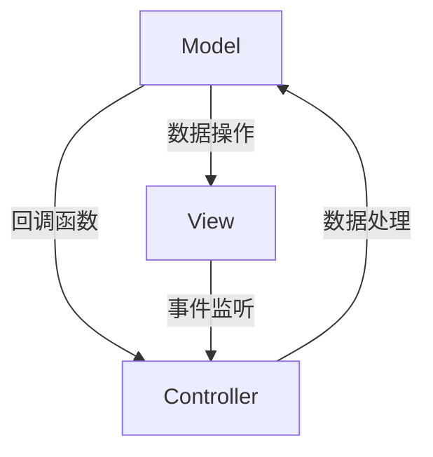

                 

### 文章标题与关键词

《构建高性能的前端架构》

关键词：前端架构、性能优化、资源加载、渲染性能、网络性能、硬件加速、模块化、组件化、前端框架、性能监控、案例分析、未来展望。

### 文章摘要

本文将深入探讨构建高性能前端架构的各个方面。首先，我们将回顾前端架构的发展历程，并阐述高性能前端架构的重要性及其设计原则。随后，文章将详细介绍前端性能优化技术，包括资源加载优化、渲染性能优化、网络性能优化和硬件加速。接下来，我们将分析前端架构设计与实现，探讨模块化与组件化的实现方法，以及前端框架的选择和使用技巧。通过案例研究，我们将展示如何在实际项目中构建高性能的前端架构。最后，文章将展望前端架构和性能优化的未来发展趋势，为读者提供前沿的思考方向和实践指导。

## 第一部分：前端架构概述

### 1.1 前端架构的发展历程

在前端开发的早期，页面主要由HTML、CSS和JavaScript组成。开发者通常使用内嵌脚本和外部样式表来控制页面的交互和样式。这种简单的架构在当时是足够的，但随着互联网的迅速发展，前端架构面临着越来越大的挑战。

#### 1.1.1 从早期到现代前端架构

早期的前端架构主要依赖于传统的页面式设计。开发者需要手动编写HTML代码来构建页面结构，使用CSS来控制样式，通过JavaScript实现交互效果。这种方法存在几个问题：

- **代码冗余**：页面结构、样式和交互代码混杂在一起，导致代码难以维护和复用。
- **开发效率低**：每次修改页面都需要手动更新HTML、CSS和JavaScript文件，增加了开发的工作量。
- **性能问题**：大量脚本和样式文件的加载和渲染可能导致页面加载缓慢，影响用户体验。

随着互联网的发展，前端架构逐渐演变成现代的模块化和组件化架构。这一转变源于以下几个关键因素：

- **浏览器兼容性问题**：现代浏览器对JavaScript的支持越来越好，开发者可以利用这些新特性来简化开发流程。
- **模块化编程**：JavaScript模块化的引入（如CommonJS、AMD、ES6 Modules等）使得代码组织更加清晰，模块间依赖关系更加明确。
- **前端框架的出现**：React、Vue、Angular等前端框架的流行，为开发者提供了丰富的组件库和工具链，大大提高了开发效率。
- **性能优化需求**：为了满足用户对更快的页面加载速度和更好的交互体验，前端开发者开始关注性能优化技术。

#### 1.1.2 核心概念与原理

现代前端架构的核心概念包括模块化、组件化、前端框架和性能优化。

- **模块化**：将代码划分为独立的模块，每个模块负责特定的功能。模块化可以降低代码的耦合度，提高可复用性，使代码更易于维护。
- **组件化**：组件是前端开发中最小的可复用单元。组件化架构将页面拆分成多个独立的组件，每个组件都有自己的生命周期和状态。
- **前端框架**：前端框架提供了组件库、生命周期管理、数据绑定、路由控制等功能，帮助开发者快速构建复杂的前端应用。
- **性能优化**：性能优化包括资源加载优化、渲染性能优化、网络性能优化和硬件加速。优化目标是提高页面加载速度，改善用户体验。

通过这些核心概念和原理，现代前端架构能够更好地应对复杂性和高性能需求。接下来，我们将进一步探讨高性能前端架构的重要性及其设计原则。

### 1.2 高性能前端架构的重要性

高性能前端架构对于现代Web应用至关重要。它不仅直接影响用户的体验，还关系到应用的长期成功和可维护性。

#### 1.2.1 高性能对用户体验的影响

首先，高性能直接影响用户的体验。以下是一些关键点：

- **页面加载速度**：快速的页面加载速度可以显著减少用户的等待时间，提高用户满意度。
- **响应时间**：优化的前端架构可以减少用户操作和页面响应之间的延迟，提高交互的流畅性。
- **加载时间**：在移动网络环境中，加载时间过长可能导致用户放弃访问。
- **性能稳定性**：在高峰期和复杂操作下，系统依然保持良好的性能，避免出现卡顿和崩溃。

用户体验是Web应用的基石，良好的用户体验可以增加用户的忠诚度和转化率。例如，电商平台如果加载速度过慢，用户可能会选择竞争对手。

#### 1.2.2 高性能的前端架构要素

要构建高性能的前端架构，需要关注以下几个关键要素：

- **资源加载优化**：通过压缩、打包、异步加载等技术减少资源加载时间。
- **渲染性能优化**：优化CSS和JavaScript代码，减少重绘和回流次数，利用硬件加速。
- **网络性能优化**：使用CDN、HTTP/2等协议优化网络传输，减少数据传输延迟。
- **硬件加速**：利用GPU加速渲染，提高页面渲染速度。
- **性能监控与调试**：使用性能监控工具实时监控性能指标，及时发现和解决性能问题。

通过这些要素的综合应用，可以显著提升前端应用的性能，为用户提供流畅的使用体验。接下来，我们将进一步讨论高性能前端架构的设计原则。

### 1.3 高性能前端架构的设计原则

构建高性能前端架构需要遵循一系列设计原则，以确保系统的整体性能和可维护性。以下是一些关键原则：

#### 1.3.1 最小化渲染阻塞

渲染阻塞是指页面在渲染过程中由于某些操作（如资源加载、计算密集型任务）导致的阻塞现象。最小化渲染阻塞可以通过以下方法实现：

- **异步加载资源**：将CSS和JavaScript文件异步加载，避免阻塞文档解析。
- **避免计算密集型任务**：将计算任务移到Web Workers中执行，避免阻塞主线程。
- **减少重绘与回流**：优化CSS选择器和布局，避免不必要的重绘和回流。

#### 1.3.2 优化资源加载

优化资源加载是提高页面性能的关键步骤。以下是一些优化策略：

- **资源压缩**：使用Gzip等压缩算法减小文件体积，减少网络传输时间。
- **资源打包**：使用Webpack、Rollup等打包工具将多个文件打包成几个大文件，减少HTTP请求次数。
- **缓存策略**：合理设置缓存策略，利用浏览器缓存减少重复请求。

#### 1.3.3 利用浏览器缓存

浏览器缓存可以显著减少资源加载时间。以下是一些使用浏览器缓存的方法：

- **设置缓存有效期**：为静态资源设置合理的缓存有效期，避免频繁请求。
- **使用ETag和Last-Modified**：通过ETag和Last-Modified头信息实现条件缓存，减少不必要的请求。
- **Cache-Control**：使用Cache-Control头信息控制资源的缓存策略。

#### 1.3.4 系统性能监控

性能监控是确保前端架构持续高效运行的关键。以下是一些性能监控方法：

- **实时监控**：使用性能监控工具（如Chrome DevTools、Lighthouse）实时监控性能指标。
- **日志分析**：通过日志分析工具（如ELK栈）分析性能瓶颈和异常。
- **性能测试**：定期进行性能测试，评估系统在高负载情况下的表现。

通过遵循这些设计原则，可以构建出高效、可维护的前端架构，为用户提供卓越的体验。

### 1.4 高性能前端架构的趋势与挑战

随着技术的发展，高性能前端架构也在不断演进。然而，这一过程并非一帆风顺，也面临着一系列趋势和挑战。

#### 1.4.1 技术发展趋势

一些关键技术趋势正在推动高性能前端架构的发展：

- **WebAssembly（WASM）**：WebAssembly是一种新型的网页代码格式，旨在提高网页的运行速度和性能。它可以将C++、Rust等语言编译成WebAssembly模块，然后在浏览器中高效执行。
- **渐进式Web应用（PWA）**：渐进式Web应用是一种结合了Web应用和原生应用优点的新型应用。通过使用Service Workers和Cache API，PWA可以在无网络连接或弱网络环境下提供良好的用户体验。
- **前端框架的迭代更新**：前端框架（如React、Vue、Angular）不断更新，引入新的特性和优化，为开发者提供更好的性能和开发体验。

#### 1.4.2 面临的挑战与解决策略

尽管高性能前端架构的发展势头良好，但开发者仍面临一些挑战：

- **兼容性问题**：不同浏览器之间的兼容性差异可能影响性能表现。开发者需要花费大量时间进行兼容性测试和调整。
- **性能监控与调试**：性能监控和调试是一项复杂的任务，需要使用多种工具和方法。开发者需要具备一定的技能和经验才能有效地进行性能优化。
- **复杂性和维护成本**：随着前端架构的复杂度增加，维护成本也随之上升。开发者需要不断学习和适应新的技术和工具，以保持系统的稳定性和性能。

为应对这些挑战，开发者可以采取以下策略：

- **遵循最佳实践**：遵循前端开发的最佳实践，如模块化、组件化、性能优化等，有助于减少兼容性和维护成本。
- **持续学习和实践**：不断学习和实践新的技术和工具，提高自己的技能水平，以应对不断变化的技术环境。
- **团队合作与沟通**：与团队成员紧密合作，确保性能优化策略的有效实施，并通过良好的沟通和协作解决潜在问题。

通过关注技术发展趋势和有效应对挑战，开发者可以构建出更加高效和可靠的高性能前端架构。

### 1.5 本章小结

本章节回顾了前端架构的发展历程，阐述了高性能前端架构的重要性及其设计原则。通过分析从早期到现代前端架构的演变，我们了解了模块化、组件化和前端框架对性能优化的重要性。接着，我们探讨了高性能前端架构的设计原则，包括最小化渲染阻塞、优化资源加载、利用浏览器缓存和系统性能监控。最后，我们讨论了高性能前端架构的发展趋势和面临的挑战。通过本章的学习，读者将能够更好地理解高性能前端架构的核心概念和实践方法。

## 第二部分：前端性能优化技术

### 2.1 资源加载优化

资源加载优化是提高前端性能的关键步骤之一。通过合理地压缩、打包、异步加载和延迟加载，可以显著减少页面加载时间，提高用户体验。

#### 2.1.1 资源压缩与打包

资源压缩是减少文件体积、提高加载速度的有效手段。常见的压缩方法包括Gzip压缩、图像压缩等。Gzip压缩可以将文本文件压缩至原来的30%左右，而图像压缩可以通过无损或有损的方式减少图像文件的大小。

打包工具（如Webpack、Rollup）可以将多个文件打包成一个或几个大文件，减少HTTP请求次数。例如，使用Webpack可以将JavaScript、CSS、图片等文件打包成一个或多个bundle，从而减少网络传输的时间和延迟。

#### 2.1.2 缓存策略

缓存策略是提高页面加载速度的重要手段。通过合理设置缓存，可以减少重复请求，加快页面加载速度。以下是一些常见的缓存策略：

- **浏览器缓存**：通过设置Cache-Control、ETag、Last-Modified等HTTP头信息，可以使浏览器缓存静态资源。例如，可以将图片、CSS和JavaScript文件设置较长的缓存时间，减少重复请求。
- **服务端缓存**：通过在服务器端缓存响应，可以减少对后端服务的请求次数，提高响应速度。常见的缓存策略包括HTML缓存、API缓存等。
- **内容分发网络（CDN）**：CDN通过在全球部署多个节点，缓存用户访问的热门内容，从而减少用户访问延迟。使用CDN可以显著提高页面加载速度。

#### 2.1.3 异步加载与延迟加载

异步加载和延迟加载是优化页面性能的重要技术，它们可以减少初始加载时间，提高用户体验。

- **异步加载**：异步加载可以将非必要的资源（如第三方库、样式表、脚本等）延迟加载。通过在需要时动态加载这些资源，可以减少页面初始加载时间。常见的异步加载方法包括动态脚本标签、异步CSS、异步HTTP请求等。
  
- **延迟加载**：延迟加载是在用户滚动页面时才加载图像、视频等资源，从而减少页面初始加载时间。延迟加载适用于大尺寸的图片或视频，可以通过监听滚动事件或可视区域来触发加载。常见的延迟加载方法包括Intersection Observer API、LazyLoad库等。

通过以上技术，前端开发者可以优化资源加载，提高页面性能和用户体验。

### 2.2 渲染性能优化

渲染性能优化是提高前端应用性能的关键环节。优化的目标是减少页面重绘和回流次数，提高页面渲染速度，提供流畅的用户体验。以下是一些常见的渲染性能优化方法：

#### 2.2.1 减少重绘与回流

重绘和回流是影响页面渲染性能的两个关键因素。以下是一些减少重绘和回流的方法：

- **避免频繁的操作**：避免频繁地修改DOM元素的样式和位置，减少不必要的重绘和回流。例如，避免在循环中频繁地修改元素大小和位置。
- **批量操作**：将多个DOM操作合并为一次，减少回流次数。例如，可以使用`DocumentFragment`将多个DOM操作批量插入文档中。
- **使用CSS3动画**：使用CSS3动画可以避免JavaScript动画带来的回流问题。CSS3动画在GPU上渲染，比JavaScript动画性能更好。
- **避免使用表格布局**：表格布局会导致频繁的回流，因为浏览器需要重新计算表格的布局。应避免使用表格布局，转而使用Flexbox或CSS Grid布局。

#### 2.2.2 利用Web Workers与Service Workers

Web Workers和Service Workers是优化前端性能的重要技术。以下是如何利用它们来提高渲染性能：

- **Web Workers**：Web Workers是一种在后台线程中运行的JavaScript脚本，它可以独立于主线程运行，从而减少主线程的负载。对于计算密集型的任务（如图像处理、数据计算等），可以将任务分配给Web Workers，从而减少主线程的阻塞，提高页面渲染速度。

  ```javascript
  const worker = new Worker('worker.js');
  worker.onmessage = function(event) {
    console.log('Received message from worker:', event.data);
  };
  worker.postMessage({ type: 'compute', data: 'example data' });
  ```

- **Service Workers**：Service Workers是一种运行在浏览器背后的独立线程，它可以拦截和处理网络请求，提供缓存功能，从而优化页面加载速度。通过使用Service Workers，可以离线缓存应用资源，提高页面性能。

  ```javascript
  self.addEventListener('install', function(event) {
    event.waitUntil(
      caches.open('my-cache').then(function(cache) {
        return cache.addAll([
          '/',
          '/styles/main.css',
          '/scripts/main.js'
        ]);
      })
    );
  });

  self.addEventListener('fetch', function(event) {
    event.respondWith(
      caches.match(event.request).then(function(response) {
        return response || fetch(event.request);
      })
    );
  });
  ```

通过使用Web Workers和Service Workers，可以有效地提高前端应用的渲染性能和用户体验。

#### 2.2.3 优化CSS与JavaScript代码

优化CSS和JavaScript代码是提高渲染性能的重要步骤。以下是一些优化方法：

- **压缩CSS和JavaScript文件**：使用压缩工具（如UglifyJS、CSSNano）减小文件体积，减少网络传输时间和加载时间。
- **代码分割**：通过代码分割，将应用程序分成多个小模块，按需加载。这样可以减少初始加载时间，提高加载速度。例如，可以使用Webpack的代码分割功能。
- **延迟加载脚本**：将非必要的脚本延迟加载，例如，将第三方库或插件在需要时才加载。这样可以减少初始加载时间。
- **异步加载脚本**：使用异步脚本加载，使脚本在后台加载，不会阻塞页面渲染。例如，可以使用`async`和`defer`属性加载脚本。

通过以上方法，可以显著提高CSS和JavaScript代码的渲染性能，优化页面加载速度。

通过以上几种方法，前端开发者可以有效地优化渲染性能，提供流畅的用户体验。接下来，我们将进一步探讨网络性能优化技术。

### 2.3 网络性能优化

网络性能优化是提高前端应用性能的关键环节。通过优化TCP/IP协议、使用HTTPS与HTTP/2以及配置CDN，可以显著提高网络传输速度，改善用户体验。

#### 2.3.1 TCP/IP协议优化

TCP/IP协议是互联网通信的基础，其性能直接影响网络传输速度。以下是一些优化TCP/IP协议的方法：

- **增加并发连接数**：通过修改服务器的`tcp_max_syn_backlog`、`tcp_max_tw_buckets`等参数，可以增加并发连接数，提高服务器处理能力。
- **使用Nagle算法**：Nagle算法是一种优化网络传输的算法，它可以减少TCP连接的延迟，提高传输效率。通过设置`tcp_nagle`参数为0，可以关闭Nagle算法。
- **调整TCP窗口大小**：通过调整`tcp_window_scale`参数，可以增加TCP窗口大小，提高数据传输速率。

#### 2.3.2 HTTPS与HTTP/2

HTTPS和HTTP/2是提高网络性能的重要技术。以下是如何使用它们来优化网络传输：

- **HTTPS**：HTTPS通过SSL/TLS协议加密网络通信，确保数据传输的安全性。与HTTP相比，HTTPS具有更好的性能和安全性。通过启用HTTPS，可以防止中间人攻击和数据篡改，提高用户信任度。
- **HTTP/2**：HTTP/2是一种新的HTTP协议，它支持多路复用、头部压缩和服务器推送等功能。相比HTTP/1.1，HTTP/2可以显著提高网络传输速度和性能。使用HTTP/2可以减少TCP连接数，降低延迟，提高并发性能。

#### 2.3.3 CDN与CDN加速

CDN（内容分发网络）是一种优化网络传输的技术，它通过在全球部署多个节点，缓存用户访问的热门内容，从而减少用户访问延迟。以下是如何使用CDN来优化网络性能：

- **选择合适的CDN服务提供商**：选择一个可靠的CDN服务提供商，根据业务需求选择合适的节点分布和带宽。
- **配置CDN缓存策略**：通过合理配置CDN缓存策略，可以减少重复请求，提高缓存命中率。例如，可以将静态资源（如图片、CSS和JavaScript文件）设置较长的缓存时间。
- **使用CDN加速**：通过使用CDN，可以将静态资源从源服务器加速到最近的CDN节点，从而减少用户访问延迟。例如，可以将网站的主机和CDN节点绑定，使用CDN加速网站内容。

通过以上方法，前端开发者可以优化网络性能，提高页面加载速度和用户体验。

### 2.4 硬件加速

硬件加速是一种通过利用GPU（图形处理器）来提高页面渲染速度的技术。以下是一些硬件加速的方法及其最佳实践：

#### 2.4.1 GPU加速

GPU加速可以将计算任务从CPU转移到GPU上，从而提高渲染速度。以下是如何使用GPU加速：

- **CSS3D变换**：使用CSS3D变换可以启用GPU加速，从而提高3D变换的性能。CSS3D变换允许使用GPU渲染2D和3D变换，而不是CPU渲染，从而显著提高渲染速度。
  ```css
  .element {
    transform: perspective(600px) rotateX(20deg) rotateY(20deg);
    -webkit-transform: perspective(600px) rotateX(20deg) rotateY(20deg);
  }
  ```

- **WebGL**：WebGL是一种用于在Web上创建3D图形的API。通过使用WebGL，可以充分利用GPU的强大计算能力，实现高效的图形渲染。

  ```javascript
  const canvas = document.getElementById('canvas');
  const gl = canvas.getContext('webgl');

  // WebGL渲染代码
  ```

#### 2.4.2 硬件加速的最佳实践

以下是一些硬件加速的最佳实践：

- **避免CPU渲染**：尽量使用GPU渲染，避免CPU渲染，这样可以充分利用GPU的并行计算能力，提高渲染性能。
- **减少重绘和回流**：优化CSS和JavaScript代码，减少重绘和回流次数，从而减少CPU渲染负担。
- **使用CSS3动画**：使用CSS3动画可以启用GPU渲染，从而提高动画性能。CSS3动画在GPU上渲染，比JavaScript动画性能更好。

通过以上方法，开发者可以充分利用GPU的强大计算能力，提高页面渲染速度，提供流畅的用户体验。

#### 2.4.3 Canvas与SVG的使用

Canvas和SVG是两种用于绘制图形的重要技术，它们各有优缺点。以下是如何选择和优化这两种技术：

- **Canvas**：Canvas是一种用于2D绘图的HTML5元素，它可以灵活地绘制各种图形和动画。Canvas的优点是性能较高，适合绘制复杂的图形和动画。缺点是绘图代码较难阅读和维护。

  ```javascript
  const canvas = document.getElementById('canvas');
  const ctx = canvas.getContext('2d');

  ctx.beginPath();
  ctx.arc(100, 100, 50, 0, 2 * Math.PI);
  ctx.fillStyle = 'red';
  ctx.fill();
  ```

- **SVG**：SVG（可扩展矢量图形）是一种基于XML的图形描述语言，它可以定义各种图形和动画。SVG的优点是代码可读性高，易于编辑和维护。缺点是性能相对较低，适用于绘制简单的图形和动画。

  ```xml
  <svg width="100" height="100">
    <circle cx="50" cy="50" r="40" stroke="green" stroke-width="4" fill="yellow" />
  </svg>
  ```

在绘制图形时，应根据实际需求选择Canvas或SVG。对于复杂且需要动画的图形，选择Canvas更为合适；对于简单且需要频繁编辑的图形，选择SVG更为便捷。

通过以上方法，开发者可以充分利用Canvas和SVG的优势，优化页面性能，提供丰富的图形交互体验。

### 2.5 本章小结

本章节详细介绍了前端性能优化技术，包括资源加载优化、渲染性能优化、网络性能优化和硬件加速。通过资源压缩与打包、缓存策略、异步加载与延迟加载，可以显著减少页面加载时间。通过减少重绘与回流、利用Web Workers与Service Workers、优化CSS与JavaScript代码，可以提高渲染性能。通过优化TCP/IP协议、使用HTTPS与HTTP/2、配置CDN，可以提升网络传输速度。通过GPU加速、最佳实践、Canvas与SVG的使用，可以充分利用硬件加速的优势。通过本章的学习，读者将能够更好地理解和应用前端性能优化技术，构建高效的前端架构。

## 第三部分：前端架构设计与实现

### 3.1 前端架构设计与决策

前端架构设计是构建高效、可维护和可扩展前端应用的关键步骤。在进行前端架构设计时，需要考虑多个因素，包括设计目标、约束条件、架构风格和设计模式。

#### 3.1.1 设计目标与约束

首先，明确设计目标是进行前端架构设计的基础。设计目标通常包括以下几点：

- **性能**：确保页面加载速度快，响应时间短，提供良好的用户体验。
- **可维护性**：使代码结构清晰，易于理解和修改，方便后续维护。
- **可扩展性**：能够方便地添加新功能和模块，以适应业务需求的变化。
- **兼容性**：确保在不同浏览器和设备上都能正常运行。

在确定设计目标后，需要考虑约束条件。常见的约束条件包括：

- **预算**：开发资源有限，需要在时间和成本上进行权衡。
- **技术栈**：现有的技术栈和工具链，如前端框架、开发工具和测试框架。
- **开发团队**：团队成员的技术水平、经验和技能。
- **业务需求**：业务需求的变化，可能对架构设计产生影响。

#### 3.1.2 架构风格与设计模式

前端架构的风格和设计模式是构建高效前端架构的关键。以下是一些常用的架构风格和设计模式：

- **MVC（模型-视图-控制器）**：MVC是一种经典的架构风格，将数据、视图和控制器分离，提高代码的可维护性和可扩展性。
- **MVVM（模型-视图-视图模型）**：MVVM是MVC的一种变种，通过数据绑定机制，实现数据与视图的自动同步。
- **模块化**：将代码划分为独立的模块，每个模块负责特定的功能。模块化可以提高代码的可复用性和可维护性。
- **组件化**：组件是前端开发中最小的可复用单元，组件化架构将页面拆分成多个独立的组件，每个组件都有自己的生命周期和状态。
- **函数式编程**：函数式编程是一种编程范式，通过使用纯函数和不可变数据，提高代码的可维护性和可测试性。

在架构设计过程中，需要根据实际需求和团队情况，选择合适的架构风格和设计模式。以下是一个简单的MVC架构示例：



#### 3.1.3 技术选型与工具链

技术选型是前端架构设计的重要组成部分。在选择技术时，需要考虑以下几个方面：

- **前端框架**：如React、Vue、Angular等。不同的前端框架具有不同的特点，适用于不同的场景。例如，React适合构建复杂的应用，Vue适合快速开发，Angular适合大型企业级应用。
- **构建工具**：如Webpack、Rollup等。构建工具可以优化项目结构，提高构建速度和性能。
- **测试框架**：如Jest、Mocha等。测试框架可以帮助开发者编写和执行单元测试、集成测试和端到端测试，确保代码质量。
- **代码风格规范**：如ESLint、StyleLint等。代码风格规范可以确保代码的规范性和一致性，提高团队协作效率。
- **部署工具**：如Docker、Kubernetes等。部署工具可以帮助开发者自动化部署和扩展应用程序。

以下是一个简单的技术选型示例：

```mermaid
graph TD
    React -->|构建工具| Webpack
    React -->|测试框架| Jest
    React -->|代码风格规范| ESLint
    Vue -->|构建工具| Rollup
    Vue -->|测试框架| Mocha
    Vue -->|代码风格规范| StyleLint
    Angular -->|构建工具| Webpack
    Angular -->|测试框架| Jasmine
    Angular -->|代码风格规范| Angular CL
```

通过以上方法，开发者可以构建出一个高效、可维护和可扩展的前端架构，为项目的长期发展打下坚实基础。接下来，我们将进一步探讨前端模块化与组件化的实现方法。

### 3.2 前端模块化与组件化

前端模块化与组件化是现代前端开发的核心概念，它们极大地提高了代码的可维护性和可复用性。以下是如何实现模块化和组件化的方法：

#### 3.2.1 模块化的概念与优势

模块化是指将代码划分为独立的模块，每个模块负责特定的功能。模块化具有以下几个优势：

- **代码复用**：模块化可以使代码更容易复用，减少重复编写代码的工作量。
- **代码隔离**：模块化可以隔离代码，降低模块之间的耦合度，提高代码的可维护性。
- **便于管理**：模块化可以使代码结构更加清晰，方便开发者管理和查找代码。

常见的模块化方法包括：

- **CommonJS**：CommonJS是一种适用于服务器端的模块化规范，它通过`require`和`module.exports`实现模块的导入和导出。适用于Node.js环境。
  ```javascript
  // 导入模块
  const math = require('math');

  // 导出模块
  module.exports = {
    add: (a, b) => a + b
  };
  ```

- **AMD（异步模块定义）**：AMD是一种异步加载模块的规范，它通过`define`和`require`实现模块的导入和导出。适用于浏览器环境。
  ```javascript
  define(['math'], function(math) {
    return {
      double: function(num) {
        return math.multiply(num, 2);
      }
    };
  });
  ```

- **ES6 Modules**：ES6 Modules是JavaScript的新标准，它通过`import`和`export`实现模块的导入和导出。适用于现代浏览器和Node.js环境。
  ```javascript
  // 导入模块
  import { add, subtract } from './math';

  // 导出模块
  export function multiply(a, b) {
    return a * b;
  }
  ```

#### 3.2.2 组件化的实现方法

组件化是指将页面拆分成多个独立的组件，每个组件都有自己的生命周期和状态。组件化具有以下几个优势：

- **提高复用性**：组件化可以使页面中的代码更容易复用，减少重复编写代码的工作量。
- **提高可维护性**：组件化可以隔离页面逻辑，降低页面之间的耦合度，提高代码的可维护性。
- **提高开发效率**：组件化可以使开发者专注于一个组件的开发，提高开发效率。

常见的组件化方法包括：

- **React**：React是一个流行的前端框架，它通过JSX语法和组件架构实现组件化。React组件是一个JavaScript类或函数，具有自己的状态和生命周期方法。
  ```javascript
  class Welcome extends React.Component {
    render() {
      return <h1>Hello, {this.props.name}!</h1>;
    }
  }
  ```

- **Vue**：Vue是一个轻量级的前端框架，它通过模板语法和组件系统实现组件化。Vue组件是一个自定义标签，具有自己的数据和方法。
  ```html
  <template>
    <h1>Hello, {{ name }}!</h1>
  </template>

  <script>
    export default {
      data() {
        return {
          name: 'Vue'
        };
      }
    };
  </script>
  ```

- **Angular**：Angular是一个强大的前端框架，它通过指令和组件实现组件化。Angular组件是一个自定义元素，具有自己的模板和逻辑。
  ```html
  <custom-component></custom-component>

  <script>
    @Component({
      selector: 'custom-component',
      template: '<h1>Hello, Angular!</h1>'
    })
    export class CustomComponent {}
  </script>
  ```

通过以上方法，开发者可以构建出模块化和组件化的前端架构，提高代码的可维护性和可复用性。接下来，我们将探讨常用模块化工具。

### 3.2.3 常用模块化工具

在前端开发中，常用模块化工具可以帮助开发者更高效地管理项目结构和模块依赖。以下是一些流行的模块化工具：

#### 1. Webpack

Webpack是一个模块打包工具，它可以将多个模块打包成一个或多个bundle，从而减少HTTP请求次数，提高页面加载速度。Webpack支持各种模块化规范，如CommonJS、AMD和ES6 Modules。

```javascript
// webpack.config.js
const path = require('path');

module.exports = {
  entry: './src/index.js',
  output: {
    filename: 'bundle.js',
    path: path.resolve(__dirname, 'dist')
  },
  module: {
    rules: [
      {
        test: /\.css$/,
        use: ['style-loader', 'css-loader']
      }
    ]
  }
};
```

#### 2. Rollup

Rollup是一个模块打包工具，它专注于创建易于共享、互动的库或应用程序。Rollup支持多种模块化规范，如ES6 Modules、CommonJS和AMD。

```javascript
// rollup.config.js
import resolve from 'rollup-plugin-node-resolve';
import commonjs from 'rollup-plugin-commonjs';

export default {
  input: 'src/index.js',
  output: {
    file: 'dist/bundle.js',
    format: 'cjs'
  },
  plugins: [resolve(), commonjs()]
};
```

#### 3. npm

npm是一个流行的包管理器，它可以帮助开发者管理项目依赖和版本。通过npm，开发者可以轻松安装、更新和卸载模块。

```bash
# 安装模块
npm install axios

# 更新模块
npm update axios

# 卸载模块
npm uninstall axios
```

通过以上工具，开发者可以更好地管理项目模块，提高开发效率。

通过模块化和组件化，开发者可以构建出高效、可维护和可扩展的前端架构。接下来，我们将探讨前端框架与库的选择和使用技巧。

### 3.3 前端框架与库

在前端开发中，选择合适的前端框架和库是构建高效、可维护和可扩展应用的关键。以下是如何选择前端框架与库、它们的优缺点以及使用技巧：

#### 3.3.1 常见前端框架与库

目前，市面上有许多流行的前端框架和库，如React、Vue、Angular、Ember等。以下是这些框架和库的简要介绍：

- **React**：React是由Facebook开发的一个用于构建用户界面的JavaScript库。它采用虚拟DOM、组件化和单向数据流的设计理念，提高了开发效率和性能。React具有强大的社区支持和丰富的生态系统。
  
  **优点**：组件化、虚拟DOM、单向数据流、强大的社区支持。
  
  **缺点**：学习曲线较陡、性能不如Vue。
  
- **Vue**：Vue是一个用于构建用户界面的渐进式JavaScript框架。它简单易学，适合快速开发小型和大型应用。Vue具有响应式数据绑定、组件化和指令系统。
  
  **优点**：简单易学、响应式数据绑定、组件化、性能良好。
  
  **缺点**：生态不如React丰富、社区支持相对较弱。
  
- **Angular**：Angular是由Google开发的一个用于构建大型Web应用的前端框架。它采用MVC架构、双向数据绑定、依赖注入等设计理念，提供了丰富的功能。
  
  **优点**：MVC架构、双向数据绑定、依赖注入、强大的社区支持。
  
  **缺点**：学习曲线较陡、性能不如Vue和React。

- **Ember**：Ember是一个用于构建高性能Web应用的框架。它提供了丰富的功能和工具，具有强大的社区支持。
  
  **优点**：MVC架构、命令式和声明式代码混合、强大的社区支持。
  
  **缺点**：学习曲线较陡、性能不如Vue和React。

#### 3.3.2 框架选型与使用技巧

选择前端框架与库时，需要考虑以下几个因素：

- **项目需求**：根据项目的需求，选择适合的框架和库。例如，对于小型项目，可以选择Vue或React；对于大型项目，可以选择Angular。
- **开发经验**：选择开发者熟悉的框架和库，可以降低开发难度和成本。
- **性能要求**：考虑应用的性能要求，选择具有良好性能的框架和库。例如，对于性能敏感的应用，可以选择Vue。
- **社区支持**：选择社区支持良好的框架和库，可以确保遇到问题时能够快速得到帮助。

以下是几个框架的使用技巧：

- **React**：使用React Hooks可以简化组件逻辑、提高开发效率。React Router可以处理页面路由，提供良好的导航体验。
  ```javascript
  import React, { useState } from 'react';
  import { BrowserRouter as Router, Route, Switch } from 'react-router-dom';

  function App() {
    const [count, setCount] = useState(0);

    return (
      <Router>
        <Switch>
          <Route path="/" exact component={() => <h1>Home</h1>} />
          <Route path="/about" component={() => <h1>About</h1>} />
        </Switch>
      </Router>
    );
  }
  ```

- **Vue**：Vue CLI可以快速创建项目、配置Webpack、集成Vue组件等。Vuex可以管理全局状态、实现单向数据流。
  ```javascript
  <template>
    <div>
      <h1>{{ count }}</h1>
      <button @click="increment">Increment</button>
    </div>
  </template>

  <script>
    import { mapState, mapActions } from 'vuex';

    export default {
      computed: mapState(['count']),
      methods: mapActions(['increment'])
    };
  </script>
  ```

- **Angular**：Angular CLI可以快速创建项目、配置工具链、集成Angular组件等。Angular Forms可以处理表单验证、数据处理等。
  ```typescript
  import { Component } from '@angular/core';
  import { FormBuilder, FormGroup, Validators } from '@angular/forms';

  @Component({
    selector: 'app-login',
    template: `
      <form [formGroup]="loginForm" (ngSubmit)="onSubmit()">
        <input type="text" formControlName="username" placeholder="Username">
        <input type="password" formControlName="password" placeholder="Password">
        <button type="submit" [disabled]="!loginForm.valid">Login</button>
      </form>
    `
  })
  export class Login.component {
    loginForm: FormGroup;

    constructor(private fb: FormBuilder) {
      this.loginForm = this.fb.group({
        username: ['', [Validators.required]],
        password: ['', [Validators.required]]
      });
    }

    onSubmit() {
      if (this.loginForm.valid) {
        console.log('Form submitted:', this.loginForm.value);
      }
    }
  }
  ```

通过选择合适的前端框架与库，并掌握其使用技巧，开发者可以构建出高效、可维护和可扩展的前端应用。

### 3.3.3 框架的优缺点对比

以下是React、Vue、Angular框架的优缺点对比：

| 框架 | 优点 | 缺点 |
| --- | --- | --- |
| React | 组件化、虚拟DOM、单向数据流、强大的社区支持 | 学习曲线较陡、性能不如Vue |
| Vue | 简单易学、响应式数据绑定、组件化、性能良好 | 生态不如React丰富、社区支持相对较弱 |
| Angular | MVC架构、双向数据绑定、依赖注入、强大的社区支持 | 学习曲线较陡、性能不如Vue和React |

通过以上对比，开发者可以根据项目需求和团队情况选择合适的前端框架。

通过前端框架与库的选择和使用，开发者可以构建出高效、可维护和可扩展的前端架构。接下来，我们将探讨前端性能监控与调试。

### 3.4 前端性能监控与调试

前端性能监控与调试是确保前端应用高效运行的关键环节。通过使用性能监控工具和调试技巧，开发者可以及时发现和解决性能问题，优化应用性能。

#### 3.4.1 性能监控的重要性

性能监控有助于：

- **评估性能**：通过实时监控性能指标，如加载时间、响应时间和错误率，评估应用的性能状况。
- **发现瓶颈**：定位性能瓶颈，识别影响性能的关键因素。
- **优化性能**：根据监控数据，针对性地进行性能优化，提高用户体验。
- **持续改进**：持续监控性能，跟踪优化效果，确保应用长期保持良好的性能。

#### 3.4.2 常用性能监控工具

以下是常用的前端性能监控工具：

- **Chrome DevTools**：Chrome DevTools是一个强大的调试工具，提供了丰富的性能监控功能。开发者可以使用它监控页面加载时间、网络请求、JavaScript性能等。
  ```javascript
  const performance = window.performance;
  console.log('Navigation Timing:', performance.navigation);
  console.log('Performance Timeline:', performance.timeline);
  ```

- **Lighthouse**：Lighthouse是一个自动化性能分析工具，提供了详细的性能评估报告。开发者可以使用它评估页面在速度、可访问性、最佳实践等方面的表现。
  ```bash
  npx lighthouse https://example.com --output json > report.json
  ```

- **New Relic**：New Relic是一个专业的性能监控平台，提供了丰富的监控指标和报告。开发者可以使用它实时监控前端性能，并设置告警通知。
  
- **Sentry**：Sentry是一个实时错误监控系统，可以帮助开发者及时发现和修复前端错误。它提供了详细的错误报告和分析功能。

#### 3.4.3 调试技巧与最佳实践

以下是一些常用的调试技巧与最佳实践：

- **使用断点调试**：在开发过程中，使用断点调试可以实时跟踪代码执行流程，定位和解决bug。在Chrome DevTools中，可以使用`console.log`或`debugger`语句设置断点。
  ```javascript
  function add(a, b) {
    debugger; // 设置断点
    return a + b;
  }
  ```

- **网络请求调试**：使用网络请求调试可以分析HTTP请求和响应，检查数据传输过程。在Chrome DevTools中，可以使用“网络”标签页查看HTTP请求的详细信息。
  ```javascript
  fetch('https://example.com/data').then(response => {
    console.log('Response:', response);
  });
  ```

- **性能分析调试**：使用性能分析工具可以深入了解页面性能，如加载时间、渲染时间等。在Chrome DevTools中，可以使用“性能”标签页进行性能分析。
  ```javascript
  const performance = window.performance;
  console.log('Performance Timing:', performance.timing);
  ```

- **代码审查与测试**：定期进行代码审查和测试，确保代码质量和性能。使用单元测试、集成测试和端到端测试，验证功能实现和性能表现。

通过以上性能监控工具和调试技巧，开发者可以及时发现和解决前端性能问题，优化应用性能，为用户提供卓越的体验。

### 3.5 本章小结

本章节详细探讨了前端架构设计与实现的方法。首先，介绍了前端架构设计与决策的关键要素，包括设计目标、约束条件、架构风格和设计模式。接着，讲述了前端模块化与组件化的实现方法，以及常用模块化工具。随后，讨论了前端框架与库的选择和使用技巧，并对比了React、Vue、Angular等常见框架的优缺点。最后，介绍了前端性能监控与调试的重要性，以及常用的性能监控工具和调试技巧。通过本章的学习，读者将能够更好地理解和应用前端架构设计与实现的方法，构建高效、可维护和可扩展的前端应用。

## 第四部分：案例研究

### 4.1 案例一：构建大型电商网站

#### 4.1.1 项目背景与目标

一个大型电商平台通常需要处理海量的商品数据、用户信息和交易操作。为了提供良好的用户体验，电商平台需要具备快速响应、高并发处理能力和稳定的服务质量。本案例研究的目标是构建一个高性能、可扩展的大型电商网站，通过优化前端架构和性能，提升用户体验。

#### 4.1.2 架构设计

为了实现高性能和可扩展性，电商平台的架构设计遵循以下原则：

- **前后端分离**：前后端分离，前端主要负责展示和交互，后端主要负责数据存储和处理。
- **微服务架构**：将整个系统拆分为多个微服务，每个微服务负责特定的功能，如商品管理、用户管理、订单处理等。
- **缓存层**：使用Redis等缓存技术，缓存常用数据，减少数据库访问压力。
- **负载均衡**：使用Nginx等负载均衡器，分发用户请求到不同的服务器，提高系统处理能力。

以下是电商平台的架构设计：

```
用户请求 --> Nginx负载均衡 --> API网关 --> 微服务（商品管理、用户管理、订单处理等） --> 数据库（MySQL、MongoDB等） --> 缓存层（Redis等）
```

#### 4.1.3 实现细节

1. **前后端分离**

   - **前端**：使用Vue.js构建前端，实现商品展示、购物车、订单结算等功能。
   - **后端**：使用Spring Boot构建后端，提供RESTful API，处理用户请求。

2. **微服务架构**

   - **商品管理服务**：负责商品信息的管理和展示。
   - **用户管理服务**：负责用户信息的管理和认证。
   - **订单处理服务**：负责订单的创建、支付和发货。

3. **缓存层**

   - 使用Redis缓存常用数据，如商品列表、用户信息和购物车数据，减少数据库访问压力。

4. **负载均衡**

   - 使用Nginx进行负载均衡，将用户请求分发到不同的服务器。

#### 4.1.4 性能优化策略

1. **资源加载优化**

   - 使用Webpack对静态资源进行压缩和打包，减少文件体积。
   - 使用CDN加速静态资源加载，提高访问速度。

2. **渲染性能优化**

   - 使用虚拟DOM和异步加载，提高页面渲染速度。
   - 使用Web Workers处理计算密集型任务，减轻主线程负担。

3. **网络性能优化**

   - 使用HTTP/2和HTTPS协议，提高网络传输速度和安全性。
   - 使用Nginx缓存HTML和CSS文件，减少重复请求。

4. **数据库优化**

   - 使用MySQL和MongoDB组合存储数据，提高查询效率。
   - 使用读写分离和分库分表策略，提高数据库处理能力。

#### 4.1.5 项目小结

通过以上设计和优化策略，电商平台在性能方面取得了显著提升。以下是一些项目小结：

- **高性能**：前后端分离、微服务架构和缓存层设计，提高了系统响应速度和处理能力。
- **可扩展性**：通过负载均衡和分布式架构，系统能够轻松应对高并发和海量数据。
- **安全性**：使用HTTPS和Redis缓存，确保数据传输安全和数据一致性。
- **用户体验**：优化了资源加载、渲染和网络性能，为用户提供了流畅的使用体验。

通过本案例研究，读者可以了解到构建大型电商网站时前端架构的设计原则和性能优化策略。

### 4.2 案例二：移动端应用性能优化

#### 4.2.1 项目背景与目标

随着移动设备的普及，越来越多的应用转向移动端开发。然而，移动设备资源有限，性能优化尤为重要。本案例研究的目标是优化一个移动端应用，提升用户体验，确保应用在移动设备上流畅运行。

#### 4.2.2 架构设计

移动端应用的架构设计需考虑以下几点：

- **渐进式Web应用（PWA）**：利用Service Workers和Cache API，实现应用缓存和离线功能，提高性能和用户体验。
- **响应式设计**：使用CSS Media Queries实现响应式布局，适应不同屏幕尺寸和设备。
- **模块化开发**：将应用拆分为多个模块，提高代码复用性和可维护性。
- **性能监控**：使用性能监控工具，实时监控应用性能，定位和解决性能问题。

以下是移动端应用的架构设计：

```
用户请求 --> Service Workers --> API服务器 --> 数据库 --> 缓存层（Service Workers Cache）
```

#### 4.2.3 实现细节

1. **渐进式Web应用（PWA）**

   - 使用Service Workers实现缓存功能，将静态资源缓存到本地，减少网络请求。
   - 使用Cache API缓存动态数据，提高数据访问速度。

2. **响应式设计**

   - 使用Bootstrap等前端框架，实现响应式布局，适配不同屏幕尺寸和设备。
   - 使用CSS Media Queries动态调整样式，优化页面显示。

3. **模块化开发**

   - 使用Vue.js或React等前端框架，将应用拆分为多个组件，提高代码复用性和可维护性。
   - 使用Webpack打包工具，对静态资源进行压缩和打包，提高加载速度。

#### 4.2.4 性能优化策略

1. **资源加载优化**

   - 使用懒加载技术，按需加载图片和视频等资源，减少初始加载时间。
   - 使用图片压缩工具，减小图片文件大小，提高加载速度。

2. **渲染性能优化**

   - 使用Web Workers处理计算密集型任务，减轻主线程负担。
   - 使用GPU加速渲染，提高页面渲染速度。

3. **网络性能优化**

   - 使用CDN加速静态资源加载，提高访问速度。
   - 使用HTTP/2和HTTPS协议，提高网络传输速度和安全性。

4. **内存管理**

   - 使用内存监控工具，实时监控应用内存使用情况，及时释放不再使用的资源。
   - 使用事件委托，减少内存消耗。

#### 4.2.5 项目小结

通过以上设计和优化策略，移动端应用在性能方面取得了显著提升。以下是一些项目小结：

- **高性能**：渐进式Web应用和响应式设计提高了应用性能和用户体验。
- **可维护性**：模块化开发和性能监控工具，提高了代码质量和可维护性。
- **用户体验**：优化了资源加载、渲染和网络性能，为用户提供了流畅的使用体验。

通过本案例研究，读者可以了解到移动端应用性能优化的关键技术和方法。

### 4.3 案例三：实时数据可视化平台

#### 4.3.1 项目背景与目标

实时数据可视化平台用于展示和分析实时数据，对数据更新速度和可视化效果有较高要求。本案例研究的目标是构建一个高性能、实时数据可视化平台，为用户提供实时、准确的数据展示。

#### 4.3.2 架构设计

实时数据可视化平台的架构设计需考虑以下几点：

- **数据流处理**：使用消息队列（如Kafka）处理实时数据流，提高数据处理效率。
- **前端渲染**：使用WebGL和SVG实现高效的数据可视化，提高渲染性能。
- **服务器端渲染**：使用服务器端渲染（SSR）技术，提高页面加载速度和搜索引擎优化。
- **性能监控**：使用性能监控工具，实时监控平台性能，及时发现和解决性能问题。

以下是实时数据可视化平台的架构设计：

```
实时数据 --> 消息队列（Kafka） --> 数据处理服务器 --> 数据可视化服务器 --> 前端浏览器
```

#### 4.3.3 实现细节

1. **数据流处理**

   - 使用Kafka处理实时数据流，确保数据及时处理和分发。
   - 使用Redis缓存数据，减少数据库访问压力。

2. **前端渲染**

   - 使用Three.js和D3.js等库，实现高效的数据可视化。
   - 使用WebGL和SVG渲染技术，提高可视化效果和性能。

3. **服务器端渲染**

   - 使用Nuxt.js等服务器端渲染框架，提高页面加载速度和搜索引擎优化。
   - 使用Vue.js或React等前端框架，实现前端交互和渲染。

#### 4.3.4 性能优化策略

1. **数据流处理优化**

   - 使用批量处理技术，减少消息队列中的消息数量，提高数据处理效率。
   - 使用多线程处理数据，提高数据处理速度。

2. **前端渲染优化**

   - 使用虚拟DOM和批量更新技术，减少重绘和回流次数，提高渲染性能。
   - 使用懒加载技术，按需加载可视化组件，减少初始加载时间。

3. **服务器端渲染优化**

   - 使用异步数据加载，提高页面加载速度。
   - 使用缓存策略，减少服务器请求和渲染时间。

4. **性能监控**

   - 使用性能监控工具，实时监控平台性能，及时发现和解决性能问题。
   - 使用日志分析工具，分析性能瓶颈和异常。

#### 4.3.5 项目小结

通过以上设计和优化策略，实时数据可视化平台在性能方面取得了显著提升。以下是一些项目小结：

- **高性能**：数据流处理、前端渲染和服务器端渲染优化，提高了平台数据处理和展示速度。
- **实时性**：使用实时数据处理技术和高效的渲染技术，确保数据实时更新和准确展示。
- **用户体验**：优化了页面加载速度和交互性能，为用户提供了良好的使用体验。

通过本案例研究，读者可以了解到实时数据可视化平台的设计和性能优化方法。

## 第五部分：未来展望

### 5.1 前端架构的未来趋势

随着技术的不断演进，前端架构也在发生深刻变化。以下是一些未来前端架构的发展趋势：

#### 5.1.1 新技术的应用

- **WebAssembly（WASM）**：WebAssembly是一种新型的网页代码格式，旨在提高网页的运行速度和性能。它可以将C++、Rust等语言编译成WebAssembly模块，然后在浏览器中高效执行。未来，WebAssembly将在前端架构中扮演越来越重要的角色，提高应用的运行效率和性能。

- **服务端渲染（SSR）**：服务端渲染技术已经在Vue、React等前端框架中得到广泛应用。未来，SSR将进一步优化，实现更快的页面加载速度和更好的搜索引擎优化（SEO）。服务端渲染将更好地平衡性能与可维护性。

- **渐进式Web应用（PWA）**：PWA将Web应用和原生应用的优点相结合，提供更好的用户体验。未来，PWA将在更多应用场景中得到应用，特别是在移动端，通过Service Workers和Cache API实现离线功能，提高应用的可用性和性能。

#### 5.1.2 架构演进的挑战

尽管前端架构在不断演进，但开发者仍面临一系列挑战：

- **性能瓶颈**：随着应用复杂度的增加，性能优化将变得更加困难。未来，开发者需要更深入地了解浏览器的工作原理，运用先进的性能优化技术，解决性能瓶颈。

- **兼容性问题**：不同浏览器和设备的兼容性差异仍然存在。未来，开发者需要投入更多精力进行兼容性测试和调整，确保应用在多种平台上正常运行。

- **开发者技能需求**：前端架构的复杂度增加，对开发者的技能要求也不断提高。未来，开发者需要不断学习和掌握新技术，以应对不断变化的技术环境。

#### 5.1.3 未来可能的发展方向

基于当前的技术趋势和挑战，未来前端架构可能的发展方向包括：

- **全栈一体化**：未来，前端和后端的界限将进一步模糊，全栈一体化开发将成为主流。通过使用GraphQL、Microservices等新技术，开发者可以更高效地构建复杂的应用。

- **人工智能与机器学习**：随着人工智能和机器学习技术的发展，前端应用将能够更好地利用这些技术，提供个性化推荐、智能交互等功能。

- **虚拟现实（VR）与增强现实（AR）**：随着VR和AR设备的普及，前端应用将拓展到更多沉浸式场景，为用户提供全新的交互体验。

通过关注新技术、解决挑战和探索发展方向，前端开发者将能够构建出更加高效、可维护和可扩展的前端架构。

### 5.2 高性能前端的发展方向

随着互联网的快速发展，高性能前端的重要性日益凸显。以下是一些高性能前端的发展方向：

#### 5.2.1 技术创新与突破

- **WebAssembly**：WebAssembly作为一种新兴的技术，有望在未来成为高性能前端架构的核心。它可以将C++、Rust等语言编译成网页代码，提高执行效率。未来，WebAssembly将在前端架构中发挥更大的作用。

- **硬件加速**：硬件加速技术，如GPU渲染和WebAssembly，将进一步提高前端应用的性能。通过充分利用硬件资源，开发者可以实现更快的渲染速度和更好的用户体验。

- **数据流与函数式编程**：数据流和函数式编程技术在提高代码可维护性和性能方面具有显著优势。未来，这些技术将在前端开发中得到更广泛的应用。

#### 5.2.2 性能瓶颈的解决方案

- **优化资源加载**：通过压缩、打包和缓存技术，减少资源加载时间。使用代码分割和懒加载，按需加载资源，提高页面初始加载速度。

- **渲染性能优化**：减少重绘和回流，优化CSS和JavaScript代码。利用Web Workers和Service Workers，将计算任务转移到后台线程，提高主线程的性能。

- **网络性能优化**：使用HTTP/2、HTTPS和CDN等技术，提高网络传输速度。优化TCP/IP协议，减少数据传输延迟。

- **硬件加速**：利用GPU加速渲染，提高页面渲染速度。通过CSS3D变换和WebGL等技术，实现高效的图形渲染。

#### 5.2.3 预见未来的性能优化策略

- **自动化性能优化**：未来的性能优化将更加自动化。通过集成开发环境（IDE）和性能监控工具，开发者可以实时监控性能指标，自动化识别和解决性能问题。

- **云计算与容器化**：云计算和容器化技术将进一步提高前端性能。通过使用云服务和容器化平台，开发者可以实现更灵活的资源管理和部署，提高系统性能和可靠性。

- **个性化性能优化**：未来的前端性能优化将更加个性化。通过收集用户行为数据和性能数据，开发者可以针对不同用户群体和应用场景，定制化优化策略。

通过关注技术创新、解决性能瓶颈和预见未来发展，开发者可以构建出高性能、可维护和可扩展的前端架构，为用户提供卓越的体验。

### 5.3 本章小结

在本章中，我们探讨了前端架构的未来趋势和性能优化的方向。未来，前端架构将朝着全栈一体化、硬件加速、数据流与函数式编程等方向发展。高性能前端将依赖于技术创新、自动化性能优化和云计算等手段。通过关注这些趋势和策略，开发者可以构建出高效、可维护和可扩展的前端架构，为用户提供卓越的体验。

## 作者信息

**作者：AI天才研究院/AI Genius Institute & 禅与计算机程序设计艺术 /Zen And The Art of Computer Programming**

**AI天才研究院（AI Genius Institute）**致力于推动人工智能和计算机科学领域的创新研究，通过融合最新的AI技术和哲学思维，为行业提供前瞻性的见解和解决方案。我们的团队汇聚了全球顶尖的AI研究人员和开发者，共同探索人工智能的无限可能。

**禅与计算机程序设计艺术（Zen And The Art of Computer Programming）**则是一本经典的计算机科学著作，由著名的计算机科学家Donald E. Knuth撰写。本书融合了哲学、心理学和计算机科学，为程序员提供了一种全新的编程思维模式，深受广大开发者喜爱。

在这个快速变化的时代，我们坚信，只有不断创新和深入思考，才能引领技术的发展，为人类创造更美好的未来。希望通过我们的努力，能够为前端开发领域带来更多的创新和进步。如果您对我们的研究感兴趣，欢迎访问我们的官方网站和社交媒体，获取更多相关信息。让我们一起探索计算机科学的无限可能！## 细节补充与最佳实践

在构建高性能前端架构的过程中，细节决定成败。以下是一些最佳实践和注意事项，以帮助开发者进一步提升前端应用的性能和用户体验。

### 1. 使用CDN

CDN（内容分发网络）是一种优化静态资源加载速度的有效方法。通过将静态资源（如JavaScript文件、CSS文件、图片等）托管在CDN节点上，可以减少用户访问延迟，提高页面加载速度。以下是一些最佳实践：

- **选择合适的CDN服务提供商**：根据业务需求和数据传输量选择合适的CDN服务提供商。例如，Amazon CloudFront、Cloudflare等。
- **合理配置CDN缓存策略**：为静态资源设置较长的缓存时间，利用CDN缓存减少重复请求。同时，监控缓存命中率，确保缓存策略的有效性。
- **CDN与自定义域名分离**：为CDN资源设置自定义域名，避免CDN故障影响主域名。

### 2. 优化CSS和JavaScript代码

优化CSS和JavaScript代码是提高前端性能的关键步骤。以下是一些最佳实践：

- **压缩CSS和JavaScript文件**：使用Gzip等压缩算法减小文件体积，提高加载速度。
- **避免内联样式和脚本**：尽量将CSS和JavaScript代码提取到外部文件中，避免内联样式和脚本。
- **按需加载**：通过动态加载和按需加载，减少页面初始加载时间。例如，使用async或defer属性加载JavaScript文件，使用LazyLoad加载图片。
- **代码分割**：使用Webpack等工具进行代码分割，将代码拆分为多个小块，按需加载。

### 3. 减少HTTP请求

减少HTTP请求是提高页面加载速度的有效方法。以下是一些最佳实践：

- **资源打包与压缩**：使用Webpack等工具对静态资源进行打包和压缩，减少HTTP请求次数。
- **懒加载**：使用懒加载技术，按需加载图片、视频等资源，减少初始加载时间。
- **合并文件**：合并多个CSS和JavaScript文件，减少HTTP请求次数。

### 4. 优化图片

图片是网页中最常见的资源之一，优化图片可以显著提高页面加载速度。以下是一些最佳实践：

- **压缩图片**：使用图片压缩工具（如TinyPNG、ImageOptim等）减小图片文件大小，提高加载速度。
- **选择合适的图片格式**：根据图片类型和场景选择合适的图片格式。例如，使用WebP格式代替JPEG或PNG格式，提高图片加载速度。
- **懒加载图片**：使用懒加载技术，按需加载图片，减少初始加载时间。

### 5. 利用浏览器缓存

合理利用浏览器缓存可以显著提高页面加载速度。以下是一些最佳实践：

- **设置缓存有效期**：为静态资源设置合理的缓存有效期，避免频繁请求。例如，CSS和JavaScript文件可以设置较长的缓存时间，而图片可以设置较短的缓存时间。
- **使用ETag和Last-Modified**：使用ETag和Last-Modified头信息实现条件缓存，减少不必要的请求。例如，当资源未发生变化时，浏览器可以返回304状态码，避免重新请求资源。
- **Cache-Control**：使用Cache-Control头信息控制资源的缓存策略，确保静态资源能够有效缓存。

### 6. 性能监控与调试

性能监控与调试是确保前端应用性能的关键步骤。以下是一些最佳实践：

- **实时监控**：使用性能监控工具（如Chrome DevTools、Lighthouse）实时监控性能指标，及时发现和解决性能问题。
- **日志分析**：通过日志分析工具（如ELK栈）分析性能瓶颈和异常，优化系统性能。
- **定期性能测试**：定期进行性能测试，评估系统在高负载情况下的表现，确保性能稳定。

### 7. 最佳实践总结

在构建高性能前端架构时，遵循以下最佳实践：

- **使用CDN优化静态资源加载**。
- **优化CSS和JavaScript代码，压缩文件并按需加载**。
- **减少HTTP请求，合并和懒加载资源**。
- **优化图片格式和大小，使用WebP格式**。
- **合理设置缓存策略，利用浏览器缓存**。
- **进行性能监控与调试，确保系统稳定运行**。

通过遵循这些最佳实践，开发者可以构建出高效、可维护和可扩展的前端架构，为用户提供卓越的体验。

## 小结

在本文中，我们深入探讨了构建高性能前端架构的各个方面，从前端架构概述、性能优化技术、架构设计与实现到案例研究和未来展望。通过回顾前端架构的发展历程，我们了解到模块化、组件化和前端框架对性能优化的重要性。随后，我们详细介绍了资源加载优化、渲染性能优化、网络性能优化和硬件加速等技术。在架构设计与实现部分，我们探讨了模块化与组件化的实现方法，以及前端框架的选择和使用技巧。通过案例研究，我们展示了如何在实际项目中构建高性能的前端架构。最后，我们展望了前端架构和性能优化的未来趋势。

高性能前端架构不仅对用户体验至关重要，还直接影响应用的长期成功和可维护性。通过合理的设计和优化，开发者可以构建出高效、可维护和可扩展的前端架构，为用户提供卓越的体验。

我们鼓励读者结合本文的内容，结合自己的实际项目，不断探索和实践高性能前端架构的方法。同时，保持对新技术和优化策略的关注，以应对不断变化的技术环境。

## 拓展阅读

为了帮助读者深入了解高性能前端架构和性能优化技术，以下是一些建议的拓展阅读材料：

1. **《高性能Web应用》**：作者Ilya Grigorik，详细介绍了Web性能优化的各个方面，包括资源加载、渲染性能和网络性能。

2. **《Web性能权威指南》**：作者Steve Souders，提供了大量的实用技巧和最佳实践，帮助开发者优化Web应用的性能。

3. **《React性能优化实战》**：作者刘欣，针对React应用，详细讲解了性能优化策略和实践。

4. **《Vue.js性能优化实战》**：作者刘峰，针对Vue.js应用，提供了全面的性能优化方法和技巧。

5. **《Web性能监控与优化实战》**：作者宋宝库，介绍了如何使用性能监控工具和日志分析工具，实现Web性能监控和优化。

6. **《Web性能进阶指南》**：作者张云杰，深入探讨了Web性能优化的高级主题，包括浏览器缓存策略、网络协议优化等。

通过阅读这些书籍，读者可以进一步了解高性能前端架构和性能优化技术的最新进展和实践经验，为自己的项目提供更强大的支持和指导。

