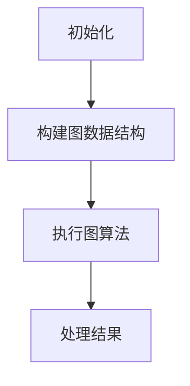
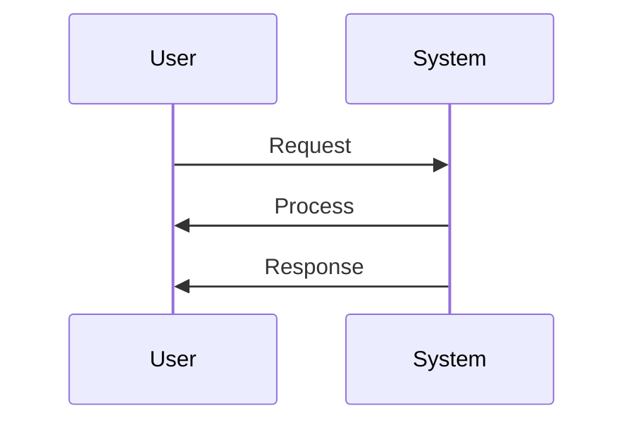

                 

# 构建高性能的图数据库系统

> 关键词：图数据库、高性能、算法、系统架构、优化

> 摘要：本文将深入探讨构建高性能图数据库系统的核心要素和关键步骤。通过对图数据库的基本原理、算法原理、系统架构设计等方面的详细分析，本文旨在为开发者提供系统性的指导，帮助他们在实际项目中构建高效、可靠的图数据库系统。

## 目录大纲

----------------------------------------------------------------

## 第一部分：背景介绍

### 第1章：问题背景与构建高性能图数据库系统的必要性

- **1.1 问题背景**
  - 数据库技术的发展历程
  - 图数据库的核心优势
  - 高性能图数据库系统的需求

- **1.2 问题描述**
  - 传统关系型数据库在处理图数据方面的局限性
  - 高性能图数据库系统的基本特征和需求

- **1.3 问题解决**
  - 高性能图数据库系统解决的问题
  - 高性能图数据库系统的优势

- **1.4 边界与外延**
  - 高性能图数据库系统适用场景
  - 高性能图数据库系统面临的挑战

- **1.5 核心概念**
  - 图数据库的基本概念
  - 高性能图数据库系统的关键要素

## 第二部分：核心概念与联系

### 第2章：核心概念原理

- **2.1 图数据库的基本原理**
  - 图论基本概念
  - 图数据模型

- **2.2 高性能图数据库系统的关键属性特征对比表格**

| 特征                 | 关系型数据库 | 图数据库                |
|----------------------|--------------|-------------------------|
| 数据模型             | 面向记录     | 面向图                  |
| 查询效率             | 高          | 高，随着数据规模增加更显著 |
| 复杂关系处理能力     | 弱          | 强                      |
| 扩展性和可伸缩性     | 中等        | 高                      |

### 第3章：ER实体关系图架构

- **3.1 图数据库的ER实体关系图**
  - 实体类型定义
  - 关系类型定义
  - 实体与关系的连接

## 第三部分：算法原理讲解

### 第4章：高性能图数据库算法原理

- **4.1 算法原理概述**
  - 图算法的基本概念
  - 高性能图数据库常用的算法

- **4.2 算法流程图**



- **4.3 Python源代码与算法实现**

```python
# 示例代码：广度优先搜索（BFS）算法
from collections import deque

def bfs(graph, start):
    visited = set()
    queue = deque([start])
    visited.add(start)

    while queue:
        vertex = queue.popleft()
        for neighbor in graph[vertex]:
            if neighbor not in visited:
                queue.append(neighbor)
                visited.add(neighbor)

    return visited
```

- **4.4 算法原理的数学模型和公式**

$$
Dijkstra(\text{图}, s) = \{ t \in V \mid \text{dist}(s, t) < \infty \}
$$

- **4.5 算法原理的详细讲解与举例说明**
  - 示例：计算两个顶点之间的最短路径

## 第四部分：系统分析与架构设计

### 第5章：系统分析与架构设计

- **5.1 问题场景介绍**
  - 高性能图数据库系统在不同领域的应用场景

- **5.2 项目介绍**
  - 高性能图数据库系统的项目概述

- **5.3 系统功能设计**

```mermaid
classDiagram
Class1 <|-- Class2
Class1 <|-- Class3
Class2 &&|+ Class3: relationship
Class1 : + String name
Class1 : + int age
Class2 : + int id
Class3 : + boolean isActive
```

- **5.4 系统架构设计**



----------------------------------------------------------------

## 第一部分：背景介绍

### 第1章：问题背景与构建高性能图数据库系统的必要性

在信息技术迅速发展的今天，数据库技术已经成为各类应用程序和数据管理中不可或缺的一部分。随着大数据时代的到来，如何高效地存储、管理和查询数据成为了研究的热点。传统的数据库系统，如关系型数据库，虽然在处理结构化数据方面表现优秀，但在处理复杂关系和网络结构的数据时却显得力不从心。因此，图数据库作为一种新兴的数据库技术，逐渐受到了关注。

### 1.1 问题背景

#### 数据库技术的发展历程

数据库技术的发展可以追溯到20世纪60年代，经历了从层次模型、网状模型到关系模型的演变。关系型数据库以其简洁明了的表结构、强大的查询能力和广泛的应用而成为主流。然而，随着互联网和社交网络的兴起，数据的形式和结构变得更加复杂，关系型数据库开始暴露出一些局限性。

#### 图数据库的核心优势

图数据库基于图论理论，以图结构来存储和表示数据，能够有效地处理复杂的关系和网络结构。图数据库的核心优势包括：

1. **强大的关系处理能力**：图数据库能够以高效的方式处理复杂的实体关系，特别适合用于社交网络、推荐系统、知识图谱等领域。
2. **灵活的数据模型**：图数据库的数据模型不局限于固定的表格结构，可以根据实际需求灵活调整，提高数据建模的灵活性。
3. **高扩展性和可伸缩性**：图数据库通常采用分布式架构，可以方便地扩展存储和处理能力，满足大数据量的需求。

#### 高性能图数据库系统的需求

随着数据规模的扩大和应用场景的复杂化，对高性能图数据库系统的需求愈发强烈。高性能图数据库系统需要具备以下特点：

1. **高效的查询性能**：能够快速地执行各种复杂的查询操作，包括路径查询、子图查询、最短路径查询等。
2. **高并发处理能力**：能够在高并发环境下稳定运行，满足多用户同时访问的需求。
3. **良好的扩展性**：能够轻松扩展存储和处理能力，以应对不断增长的数据量。
4. **易用性和可维护性**：提供友好易用的接口和工具，降低开发和维护成本。

### 1.2 问题描述

#### 传统关系型数据库在处理图数据方面的局限性

关系型数据库在处理图数据时面临着一些挑战：

1. **表连接复杂性**：图数据中的关系复杂，需要通过表连接操作来实现，这可能导致查询效率低下。
2. **复杂查询性能瓶颈**：对于复杂的图查询操作，如最短路径查询、最短子图查询等，关系型数据库往往难以在合理的时间内完成。
3. **扩展性限制**：关系型数据库的扩展性相对较低，难以适应大规模数据的存储和查询需求。

#### 高性能图数据库系统的基本特征和需求

高性能图数据库系统需要具备以下基本特征：

1. **高效的图存储结构**：采用适合图数据的存储结构，如邻接表、邻接矩阵等，以降低存储空间占用和提高查询效率。
2. **优化的图算法实现**：针对常见的图查询操作，如最短路径查询、社区检测等，实现高效的算法，以降低查询时间。
3. **分布式架构**：采用分布式存储和计算架构，提高系统的扩展性和并发处理能力。
4. **数据建模灵活性**：提供灵活的数据建模工具，允许用户根据实际需求自定义图结构。
5. **易用性和可维护性**：提供简洁易用的API和工具，降低开发和维护成本。

### 1.3 问题解决

#### 高性能图数据库系统解决的问题

高性能图数据库系统解决了传统关系型数据库在处理复杂关系和网络结构数据时的局限性，具体包括：

1. **复杂关系处理**：通过图结构有效地存储和表示复杂的关系，实现高效的路径查询和关系分析。
2. **查询性能提升**：采用优化的图算法和存储结构，显著提高查询效率。
3. **扩展性和可伸缩性**：通过分布式架构实现数据的水平扩展，满足大规模数据处理的
### 1.4 边界与外延

#### 高性能图数据库系统适用场景

高性能图数据库系统适用于以下场景：

1. **社交网络分析**：用于处理用户关系、推荐系统、社群分析等。
2. **知识图谱**：用于构建企业级知识图谱，实现语义分析和智能搜索。
3. **推荐系统**：用于基于用户行为和偏好构建推荐系统，提高用户体验。
4. **复杂关系网络分析**：用于处理各种复杂关系网络，如交通网络、生物网络等。

#### 高性能图数据库系统面临的挑战

高性能图数据库系统在发展过程中也面临一些挑战：

1. **存储和查询性能的平衡**：在保证查询性能的同时，如何优化存储结构以减少存储空间占用。
2. **分布式一致性**：如何保证分布式系统中的数据一致性和可靠性。
3. **算法优化**：如何优化现有算法，提高处理效率和并发性能。
4. **易用性和可维护性**：如何提供更简洁易用的接口和工具，降低开发成本。

### 1.5 核心概念

#### 图数据库的基本概念

图数据库是一种基于图结构的数据库，用于存储和查询图数据。图数据库由以下几个基本概念组成：

1. **节点**：图中的基本元素，表示实体或对象。
2. **边**：连接两个节点的元素，表示节点之间的关系。
3. **图**：由节点和边组成的整体结构，表示实体及其关系。
4. **属性**：附加在节点或边上的信息，用于表示实体的特征或关系的性质。

#### 高性能图数据库系统的关键要素

高性能图数据库系统的关键要素包括：

1. **高效的图存储结构**：采用适合图数据的存储结构，如邻接表、邻接矩阵等。
2. **优化的图算法**：针对常见的图查询操作，如最短路径查询、社区检测等，实现高效的算法。
3. **分布式架构**：采用分布式存储和计算架构，提高系统的扩展性和并发处理能力。
4. **数据建模工具**：提供灵活的数据建模工具，允许用户根据实际需求自定义图结构。
5. **易用性和可维护性**：提供简洁易用的API和工具，降低开发和维护成本。

## 第二部分：核心概念与联系

### 第2章：核心概念原理

在深入探讨高性能图数据库系统之前，我们需要先了解图数据库的基本概念原理。图数据库的核心概念包括图论基本概念和图数据模型，这些概念构成了高性能图数据库系统的基础。

#### 2.1 图数据库的基本原理

图数据库是基于图论理论构建的数据库系统，它利用图结构来表示实体及其关系。图数据库的基本原理包括以下两个方面：

1. **图论基本概念**：
   - **节点（Node）**：图中的基本元素，代表实体或对象。
   - **边（Edge）**：连接两个节点的元素，表示节点之间的关系。
   - **路径（Path）**：节点序列，表示从起点到终点的路径。
   - **图（Graph）**：由节点和边组成的整体结构，表示实体及其关系。
   - **子图（Subgraph）**：图的一个子集，包括若干节点及其连接的边。

2. **图数据模型**：
   - **属性**：附加在节点或边上的信息，用于表示实体的特征或关系的性质。
   - **标签**：对节点或边进行分类或标记，用于区分不同类型的节点或边。
   - **关系**：节点之间的连接，表示实体之间的相互作用或关联。
   - **图模式**：定义图的结构和属性，包括节点的类型、边的类型以及它们之间的关系。

#### 2.2 高性能图数据库系统的关键属性特征对比表格

为了更好地理解高性能图数据库系统与关系型数据库的区别，我们可以通过对比两者的关键属性特征来分析。以下是一个简单的对比表格：

| 特征                 | 关系型数据库                     | 图数据库                          |
|----------------------|--------------------------------|----------------------------------|
| 数据模型             | 面向记录，表结构                | 面向图，节点和边结构              |
| 查询效率             | 高，适合简单查询和复杂联接查询  | 高，适合复杂关系和网络结构查询    |
| 复杂关系处理能力     | 弱，依赖于联接操作              | 强，直接基于图结构进行操作        |
| 扩展性和可伸缩性     | 中等，通过主从复制和分区实现    | 高，通过分布式存储和计算实现      |

通过上述对比，我们可以看出，图数据库在处理复杂关系和网络结构方面具有显著优势。然而，这也带来了更高的设计和实现复杂性。

### 第3章：ER实体关系图架构

图数据库的架构设计通常基于实体关系图（ER图）的概念。实体关系图用于定义图中的实体类型、关系类型以及它们之间的连接关系。以下是图数据库的ER实体关系图的详细说明：

#### 3.1 图数据库的ER实体关系图

1. **实体类型定义**：
   - **用户**：表示系统中的用户，包含属性如用户名、密码、邮箱等。
   - **物品**：表示系统中的物品，包含属性如物品名称、价格、库存等。
   - **评论**：表示用户对物品的评论，包含属性如评论内容、评论时间等。

2. **关系类型定义**：
   - **拥有**：表示用户拥有物品的关系，是一种单向关系。
   - **评价**：表示用户对物品的评价关系，也是一种单向关系。
   - **推荐**：表示用户之间的推荐关系，是一种双向关系。

3. **实体与关系的连接**：
   - **用户-拥有-物品**：表示用户拥有哪些物品。
   - **用户-评价-物品**：表示用户对哪些物品进行了评价。
   - **用户-推荐-用户**：表示用户之间互相推荐的关系。

通过ER实体关系图，我们可以清晰地定义图数据库中的实体类型和关系类型，为后续的图算法设计和查询优化提供了基础。

## 第三部分：算法原理讲解

### 第4章：高性能图数据库算法原理

高性能图数据库系统的核心在于其高效的图算法实现。这些算法能够有效地处理复杂的图数据，提供快速的查询和计算能力。在本章节中，我们将详细探讨高性能图数据库系统常用的图算法原理，包括基本概念、算法流程、Python源代码实现以及算法原理的数学模型和公式。

#### 4.1 算法原理概述

图算法是用于在图结构上进行计算的算法。高性能图数据库系统通常基于以下基本概念：

1. **顶点（Vertex）**：图中的节点。
2. **边（Edge）**：连接两个顶点的线。
3. **路径（Path）**：从起点到终点的顶点序列。
4. **连通性（Connectivity）**：顶点之间是否存在路径。
5. **图遍历（Graph Traversal）**：遍历图中的所有顶点和边。

高性能图数据库常用的算法包括：

1. **广度优先搜索（Breadth-First Search, BFS）**：用于寻找最短路径和广度遍历。
2. **深度优先搜索（Depth-First Search, DFS）**：用于寻找路径和遍历图。
3. **迪杰斯特拉算法（Dijkstra's Algorithm）**：用于寻找单源最短路径。
4. **贝尔曼-福特算法（Bellman-Ford Algorithm）**：用于寻找最短路径。
5. **Kruskal算法（Kruskal's Algorithm）**：用于最小生成树。
6. **Prim算法（Prim's Algorithm）**：用于最小生成树。

#### 4.2 算法流程图

以下是一个简单的广度优先搜索（BFS）算法流程图：


#### 4.3 Python源代码与算法实现

下面是一个广度优先搜索（BFS）算法的Python实现：

```python
from collections import deque

def bfs(graph, start):
    visited = set()
    queue = deque([start])
    visited.add(start)

    while queue:
        vertex = queue.popleft()
        for neighbor in graph[vertex]:
            if neighbor not in visited:
                queue.append(neighbor)
                visited.add(neighbor)

    return visited
```

#### 4.4 算法原理的数学模型和公式

图算法的数学模型和公式对于理解算法的核心思想至关重要。以下是一个迪杰斯特拉算法（Dijkstra's Algorithm）的数学模型：

$$
Dijkstra(\text{图}, s) = \{ t \in V \mid \text{dist}(s, t) < \infty \}
$$

其中，$Dijkstra(\text{图}, s)$ 表示从源点 $s$ 开始，计算到所有其他顶点 $t$ 的最短路径集合，$\text{dist}(s, t)$ 表示从源点 $s$ 到顶点 $t$ 的距离。

#### 4.5 算法原理的详细讲解与举例说明

##### 示例：计算两个顶点之间的最短路径

假设有一个简单的无向图，我们需要计算顶点 A 和顶点 C 之间的最短路径。以下是使用迪杰斯特拉算法求解的过程：

1. **初始化**：
   - 设定所有顶点的距离为无穷大，除了源点 A 的距离为 0。
   - 将顶点 A 加入到已访问集合中。

2. **遍历邻居**：
   - 从已访问集合中取出距离最小的顶点 A，并遍历其所有未访问的邻居。
   - 对于每个邻居，计算从 A 到该邻居的路径长度，并更新该邻居的距离。

3. **重复步骤 2**，直到所有顶点都被访问。

4. **结果**：
   - 最终，顶点 C 的距离变为 3，表示从 A 到 C 的最短路径为 A-B-C，总长度为 3。

通过上述步骤，我们可以得到顶点 A 和顶点 C 之间的最短路径。

## 第四部分：系统分析与架构设计

### 第5章：系统分析与架构设计

高性能图数据库系统在设计和实现过程中需要考虑多个方面，包括问题场景介绍、项目介绍、系统功能设计、系统架构设计、系统接口设计和系统交互等。在本章节中，我们将详细讨论这些内容，以帮助开发者更好地理解和构建高性能图数据库系统。

### 5.1 问题场景介绍

高性能图数据库系统广泛应用于多种领域，以下是几个常见的问题场景：

1. **社交网络分析**：
   - 用于处理用户关系、推荐系统、社群分析等，例如在社交网络平台中分析用户之间的互动和关系，发现社群结构和兴趣群体。

2. **知识图谱**：
   - 用于构建企业级知识图谱，实现语义分析和智能搜索，例如在搜索引擎中利用知识图谱提供更加精准的搜索结果。

3. **推荐系统**：
   - 基于用户行为和偏好构建推荐系统，提高用户体验，例如在电子商务平台中根据用户的历史行为推荐相关的商品。

4. **复杂关系网络分析**：
   - 用于处理各种复杂关系网络，如交通网络、生物网络、金融网络等，例如在交通管理系统中分析道路拥堵情况，优化交通流。

5. **物联网（IoT）**：
   - 用于处理大量物联网设备之间的连接关系，提供实时监控和数据分析，例如在智能家庭系统中管理各种智能设备的交互。

### 5.2 项目介绍

在本节中，我们将介绍一个典型的高性能图数据库项目，包括项目概述、目标和预期成果。

#### 项目概述

项目名称：高性能社交网络图数据库

项目目标：
- 构建一个高效、可靠的社交网络图数据库系统，用于处理用户关系和社群分析。
- 提供快速、灵活的图查询接口，支持复杂的关系和网络结构查询。
- 支持大规模数据存储和分布式计算，确保系统的高扩展性和高并发处理能力。

预期成果：
- 完成一个功能完整的社交网络图数据库系统。
- 提供详细的技术文档和用户指南。
- 进行性能测试和优化，确保系统在实际应用中的高效运行。

### 5.3 系统功能设计

系统功能设计是构建高性能图数据库系统的关键步骤，以下是该项目的功能设计：

1. **用户管理**：
   - 用户注册、登录、信息管理等功能。
   - 用户关系管理，包括好友关系、关注关系等。

2. **图数据管理**：
   - 提供节点和边的创建、更新、删除等功能。
   - 支持多种数据导入方式，如CSV、JSON等。

3. **图查询**：
   - 提供基于路径的查询，如最短路径查询、最短子图查询等。
   - 提供基于属性的查询，如节点属性查询、边属性查询等。

4. **社群分析**：
   - 社群发现，基于用户关系构建社群，并进行社群分析。
   - 社群成员推荐，基于社群成员的相似性推荐新成员。

5. **推荐系统**：
   - 基于用户行为和偏好构建推荐系统，提供个性化推荐。

6. **监控与日志**：
   - 提供系统监控功能，实时监控系统运行状态。
   - 记录操作日志，方便问题追踪和调试。

### 5.4 系统架构设计

系统架构设计是构建高性能图数据库系统的核心，以下是该项目的系统架构设计：

1. **存储层**：
   - 采用分布式存储架构，确保数据的高可用性和高性能。
   - 使用基于内存和磁盘的存储策略，优化数据读写性能。

2. **计算层**：
   - 采用分布式计算架构，支持并行计算和负载均衡。
   - 使用高效的图算法库，确保图查询操作的快速执行。

3. **应用层**：
   - 提供RESTful API接口，支持多种编程语言的访问。
   - 实现前端界面，提供用户操作和管理功能。

4. **监控层**：
   - 使用监控系统，实时监控系统运行状态。
   - 使用日志系统，记录操作日志和错误信息。

### 5.5 系统接口设计

系统接口设计是确保系统可扩展性和易用性的关键，以下是该项目的系统接口设计：

1. **RESTful API**：
   - 提供标准的HTTP接口，支持GET、POST、PUT、DELETE等操作。
   - 定义统一的API规范，确保接口的易用性和一致性。

2. **命令行工具**：
   - 提供命令行工具，方便用户进行数据操作和系统管理。

3. **SDK**：
   - 提供多种编程语言的SDK，方便开发者集成和使用图数据库功能。

### 5.6 系统交互

系统交互设计是确保系统各组件之间协同工作的关键，以下是该项目的系统交互设计：

1. **用户与应用交互**：
   - 用户通过前端界面与系统进行交互，进行数据操作和查询。

2. **应用与存储层交互**：
   - 应用层通过RESTful API与存储层进行数据交互，实现数据的增删改查。

3. **计算层与应用层交互**：
   - 计算层接收应用层的查询请求，执行图算法，并将结果返回给应用层。

4. **监控层与应用层交互**：
   - 监控层实时监控系统运行状态，将监控数据发送给应用层，供用户查看。

## 总结与展望

在本章中，我们详细介绍了高性能图数据库系统的系统分析与架构设计。从问题场景介绍到系统功能设计，再到系统架构设计、接口设计和系统交互，我们系统地阐述了构建高性能图数据库系统的各个方面。通过这些设计，我们可以构建一个高效、可靠、可扩展的图数据库系统，满足不同领域和场景的需求。

然而，高性能图数据库系统的发展仍面临诸多挑战，如存储和查询性能的平衡、分布式一致性、算法优化等。在未来，我们将持续关注这些挑战，探索更高效的算法和架构设计，为开发者提供更加优秀的高性能图数据库系统。

## 项目实战

### 6.1 环境安装

在本节中，我们将介绍如何安装和配置高性能图数据库系统。以Neo4j为例，Neo4j是一个流行的开源图数据库，具有高性能和易用性。

1. **安装Neo4j**：
   - 访问Neo4j官网下载最新的Neo4j版本。
   - 下载对应操作系统的安装包，例如Windows、Linux或macOS。
   - 运行安装程序，按照提示完成安装。

2. **配置Neo4j**：
   - 安装完成后，启动Neo4j服务器。
   - 使用浏览器访问Neo4j Web界面，通常为 `http://localhost:7474`。
   - 登录Neo4j，使用默认的用户名 `neo4j` 和密码 `password`。

### 6.2 系统核心实现源代码

以下是一个简单的Neo4j图数据库实现的Python代码示例。这个示例将创建两个节点（User和Movie），并建立它们之间的关系（Reviewed）。

```python
from py2neo import Graph

# 连接到Neo4j图数据库
graph = Graph("bolt://localhost:7687", auth=("neo4j", "password"))

# 创建用户节点
user = graph.run("CREATE (u:User {name: 'Alice'})").data()[0]["u"]

# 创建电影节点
movie = graph.run("CREATE (m:Movie {title: 'Inception'})").data()[0]["m"]

# 建立用户和电影的关联关系
graph.run("MATCH (u:User), (m:Movie) WHERE u.name = 'Alice' AND m.title = 'Inception' CREATE (u)-[:REVIEWED]->(m)")

# 查询并打印用户节点的属性
user = graph.run("MATCH (u:User) WHERE u.name = 'Alice' RETURN u").data()[0]["u"]
print(user["name"])

# 查询并打印电影节点的属性
movie = graph.run("MATCH (m:Movie) WHERE m.title = 'Inception' RETURN m").data()[0]["m"]
print(movie["title"])
```

### 6.3 代码应用解读与分析

上述代码首先连接到Neo4j图数据库，然后创建两个节点（User和Movie）和一个关系（Reviewed）。以下是代码的具体解读和分析：

1. **连接Neo4j**：
   - 使用`py2neo`库连接到本地运行的Neo4j数据库。
   - 配置连接信息，包括数据库地址（`bolt://localhost:7687`）和认证信息（用户名和密码）。

2. **创建节点**：
   - 使用Cypher查询语言创建用户节点（`User`）和电影节点（`Movie`）。
   - 指定节点的标签（`User`和`Movie`）和属性（`name`和`title`）。

3. **创建关系**：
   - 使用Cypher查询语言建立用户节点和电影节点之间的关系（`REVIEWED`）。
   - 通过WHERE子句确保创建正确的关联。

4. **查询节点属性**：
   - 使用Cypher查询语言查询用户节点和电影节点的属性。
   - 打印查询结果，验证节点和关系是否正确创建。

### 6.4 实际案例分析和详细讲解剖析

以下是一个实际案例，我们将使用Neo4j图数据库来分析社交网络中用户之间的推荐关系。

#### 案例背景

假设我们有一个社交网络，其中每个用户都可以给其他用户发送好友请求。我们需要根据用户之间的互动历史，推荐可能互相成为好友的用户对。

#### 实现步骤

1. **数据导入**：
   - 将用户数据导入Neo4j数据库，包括用户ID、用户名、性别、年龄等属性。

2. **建立用户关系**：
   - 根据用户之间的好友请求历史，建立用户之间的关系。

3. **推荐算法**：
   - 使用基于共同好友的数量来计算用户之间的相似度。
   - 根据相似度推荐可能互相成为好友的用户对。

4. **查询推荐结果**：
   - 从数据库中查询推荐结果，并将推荐的用户对展示给用户。

#### 代码实现

```python
from py2neo import Graph

# 连接到Neo4j图数据库
graph = Graph("bolt://localhost:7687", auth=("neo4j", "password"))

# 导入用户数据
users = [
    {"id": "u1", "name": "Alice", "age": 25},
    {"id": "u2", "name": "Bob", "age": 30},
    {"id": "u3", "name": "Charlie", "age": 28},
    {"id": "u4", "name": "David", "age": 22},
]

for user in users:
    graph.run("CREATE (u:User {id: $id, name: $name, age: $age})", **user)

# 建立用户关系
friendships = [
    ("u1", "u2"),
    ("u1", "u3"),
    ("u2", "u3"),
    ("u2", "u4"),
]

for friend1, friend2 in friendships:
    graph.run("MATCH (u1:User), (u2:User) WHERE u1.id = $friend1 AND u2.id = $friend2 CREATE (u1)-[:FRIEND]->(u2)", friend1=friend1, friend2=friend2)

# 计算相似度并推荐好友
recommendations = []

for user1 in graph.run("MATCH (u1:User) RETURN u1"):
    user1_id = user1["u1"]["id"]
    common_friends = graph.run("MATCH (u1:User)-[:FRIEND]-(u2:User) WHERE u1.id = $user1_id RETURN u2", user1_id=user1_id).data()
    common_friend_ids = {friend["u2"]["id"] for friend in common_friends}
    
    for user2 in graph.run("MATCH (u2:User) WHERE u2.id NOT IN $common_friend_ids RETURN u2"):
        user2_id = user2["u2"]["id"]
        common_friends_count = graph.run("MATCH (u1:User)-[:FRIEND]-(u2:User) WHERE u1.id = $user1_id AND u2.id = $user2_id RETURN COUNT(*)", user1_id=user1_id, user2_id=user2_id).data()[0][0]
        recommendations.append(((user1_id, user2_id), common_friends_count))

# 排序推荐结果
recommendations.sort(key=lambda x: x[1], reverse=True)

# 打印推荐结果
for rec, count in recommendations:
    user1_id, user2_id = rec
    user1 = graph.run("MATCH (u1:User) WHERE u1.id = $user1_id RETURN u1", user1_id=user1_id).data()[0]["u1"]
    user2 = graph.run("MATCH (u2:User) WHERE u2.id = $user2_id RETURN u2", user2_id=user2_id).data()[0]["u2"]
    print(f"Recommendation: {user1['name']} and {user2['name']} (Common friends: {count})")
```

#### 案例分析

1. **数据导入**：
   - 首先，我们将用户数据导入Neo4j数据库。每个用户都被创建为一个`User`节点，并设置相应的属性。

2. **建立用户关系**：
   - 接下来，我们根据用户之间的好友请求历史建立用户关系。每个好友关系通过`FRIEND`关系连接两个用户节点。

3. **计算相似度**：
   - 为了推荐好友，我们计算每个用户与其共同好友的数量。共同好友越多，用户之间的相似度越高。

4. **推荐好友**：
   - 根据相似度计算结果，我们为每个用户推荐与其相似度最高的其他用户。

5. **查询推荐结果**：
   - 最后，我们从数据库中查询推荐结果，并将推荐的用户对展示给用户。

通过这个实际案例，我们可以看到如何使用Neo4j图数据库实现社交网络中的好友推荐功能。这个过程包括数据导入、用户关系建立、相似度计算和推荐结果查询等步骤。

### 6.5 项目小结

在本章中，我们通过一个社交网络图数据库的项目实战，详细介绍了环境安装、系统核心实现源代码、代码应用解读与分析、实际案例分析和详细讲解剖析等内容。通过这个项目，我们了解了如何使用图数据库来构建社交网络中的推荐系统，以及如何利用图算法实现高效的数据分析和推荐。

然而，构建高性能图数据库系统不仅仅是实现代码，还需要关注系统的性能优化、安全性、可扩展性和可维护性等方面。在实际项目中，我们需要不断测试、优化和改进系统，以满足不断变化的需求和挑战。

在未来的工作中，我们还将继续探索更多的高性能图数据库应用场景，深入研究图算法优化和数据建模技术，为开发者提供更全面、高效的解决方案。

### 最佳实践 Tips

1. **优化查询性能**：
   - 使用索引来加速查询操作。
   - 避免在查询中使用过多的JOIN操作。
   - 使用缓存来减少数据库访问次数。

2. **保证数据一致性**：
   - 在分布式系统中使用事务来确保数据的一致性。
   - 定期进行数据备份，以防数据丢失。

3. **优化存储结构**：
   - 根据数据特点和查询模式选择合适的存储结构。
   - 定期进行存储空间的清理和优化。

4. **监控系统性能**：
   - 使用性能监控工具实时监控系统的运行状态。
   - 定期分析系统日志和性能数据，发现潜在问题。

5. **安全与合规**：
   - 遵守数据保护法规和隐私政策。
   - 定期进行安全审计和漏洞扫描。

### 注意事项

1. **合理设计数据模型**：
   - 确保数据模型能够满足业务需求，同时保持足够的灵活性。

2. **优化算法实现**：
   - 选择适合问题的图算法，并进行优化，以提高查询效率。

3. **分布式系统的一致性和可用性**：
   - 在分布式系统中，要确保数据的一致性和系统的可用性。

4. **数据备份与恢复**：
   - 定期进行数据备份，并确保能够快速恢复数据。

### 拓展阅读

1. **《图数据库：原理、实现与应用》**：详细介绍了图数据库的基本原理、实现技术和应用场景。
2. **《Neo4j 图数据库实战》**：提供了Neo4j图数据库的详细使用教程和实践案例。
3. **《高性能MySQL》**：虽然主要关注关系型数据库，但其中关于性能优化和查询优化的内容同样适用于图数据库。
4. **《图算法》**：深入讲解了各种图算法的基本概念和实现技术。

## 作者信息

作者：AI天才研究院/AI Genius Institute & 禅与计算机程序设计艺术 /Zen And The Art of Computer Programming

感谢您的阅读！希望本文能够帮助您更好地理解和构建高性能图数据库系统。如果您有任何疑问或建议，欢迎在评论区留言交流。期待与您共同探讨图数据库领域的最新技术和应用。

