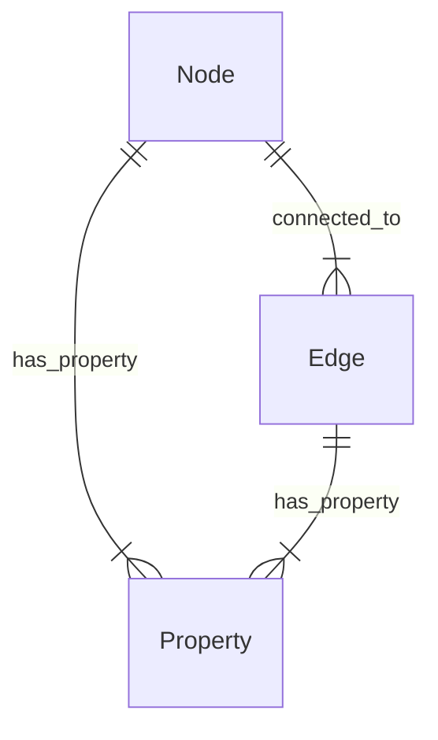

                 

### 1.1 问题背景

在当前信息化社会，数据量呈现爆炸式增长，尤其是随着物联网、社交网络、搜索引擎等技术的普及，结构化数据和非结构化数据不断增多，传统的计算方法已无法满足复杂计算需求。这种背景下，图计算作为一种强大的计算模型，逐渐引起了广泛关注。图计算引擎作为图计算的核心，承担着处理海量数据的重任，其性能直接影响到整个计算系统的效率。构建高性能的图计算引擎，不仅需要深入理解图计算的基本原理，还需要在算法优化、系统架构设计等多个方面进行深入研究。

图计算是一种通过计算节点和边的关系来分析数据结构和模式的技术。在图计算引擎中，节点表示数据实体，边表示实体之间的关系。通过图计算，可以有效地分析和处理复杂的数据关系，如社交网络中的朋友关系、推荐系统中的商品关系等。然而，随着数据规模的不断扩大，如何提高图计算引擎的性能成为一个亟待解决的问题。

高性能图计算引擎的设计涉及多个方面。首先，数据处理效率是关键因素。如何快速处理海量图数据，实现高效的数据存储和读取，是提升计算性能的重要手段。其次，内存管理至关重要。在有限的内存资源下，如何高效地管理图数据，避免内存溢出，是构建高性能图计算引擎的关键。此外，算法优化也是提高性能的重要途径。通过优化图算法，减少计算复杂度，提高计算效率。最后，并行计算能够充分利用多核处理器的计算能力，实现任务并行化，进一步提升计算性能。

综上所述，构建高性能的图计算引擎是一个复杂且富有挑战性的任务，需要从多个角度进行深入研究。以下章节将详细介绍图计算的基本原理、算法优化方法、系统架构设计以及实际应用场景，帮助读者全面了解并掌握图计算引擎的性能优化方法。

### 1.2 问题描述

构建高性能的图计算引擎，涉及以下核心问题：

- **数据处理效率**：如何快速处理海量图数据？传统的计算方法在处理大规模图数据时，存在处理速度慢、资源利用率低等问题。因此，如何优化数据处理流程，提高数据存储和读取效率，是提升计算性能的关键。

- **内存管理**：如何在有限的内存资源下高效管理图数据？图数据通常具有高维度和稀疏性，如何在有限的内存中高效存储和操作这些数据，避免内存溢出，是构建高性能图计算引擎的重要问题。

- **算法优化**：如何优化图算法，提高计算效率？图算法在处理大规模图数据时，其计算复杂度和效率直接影响整个计算系统的性能。通过分析现有算法，探讨优化方法，是提升图计算性能的重要途径。

- **并行计算**：如何充分利用多核处理器，实现并行计算？随着硬件技术的发展，多核处理器的性能不断提高。如何设计并行计算算法，充分利用多核处理器的计算能力，是实现高性能图计算的重要手段。

针对上述问题，本书将从以下几个方面进行探讨：

- **基本原理**：介绍图计算的基本概念、数据结构和方法。
- **算法优化**：分析现有算法，探讨优化方法。
- **系统架构**：设计高效的图计算引擎架构。
- **实践案例**：通过具体案例，展示高性能图计算引擎的应用场景。

### 1.3 问题解决

针对构建高性能图计算引擎所涉及的各类问题，本书提出以下解决方案：

- **数据处理效率优化**：
  - **并行数据处理**：通过多线程、分布式计算等技术，实现图数据处理的并行化，提高数据处理速度。
  - **数据压缩与存储**：采用数据压缩技术，减少存储空间需求，同时优化数据存储结构，提高数据读取速度。

- **内存管理优化**：
  - **内存池管理**：使用内存池技术，减少内存分配与回收的频率，提高内存利用效率。
  - **内存映射**：通过内存映射技术，将图数据映射到物理内存中，减少内存复制和迁移的开销。

- **算法优化**：
  - **算法改进**：对现有图算法进行改进，如使用更高效的算法或优化现有算法的执行流程。
  - **算法并行化**：将图算法并行化，充分利用多核处理器的计算能力，提高计算效率。

- **并行计算优化**：
  - **任务调度**：优化任务调度策略，实现负载均衡，提高并行计算的性能。
  - **数据分区**：通过合理的图数据分区，减少数据通信开销，提高并行计算效率。

- **系统架构优化**：
  - **分布式架构**：采用分布式计算架构，实现计算资源的横向扩展，提高系统处理能力。
  - **服务化架构**：通过服务化架构，实现图计算引擎的模块化，提高系统的灵活性和可维护性。

### 1.4 边界与外延

- **边界**：
  - 本书的关注点主要在于图计算引擎的性能优化，涉及算法、系统架构等方面。
  - 图计算引擎的性能优化，还包括硬件选择、数据预处理等外部因素，这些因素将在本书中有所提及，但不作为核心讨论内容。

- **外延**：
  - 图计算引擎的性能优化，可以扩展到其他领域，如数据库优化、机器学习等。
  - 随着硬件和算法技术的不断发展，图计算引擎的性能优化也将不断演进。

### 1.5 概念结构与核心要素组成

- **图计算引擎**：
  - **核心组件**：包括图存储、图计算框架和内存管理。
  - **性能目标**：包括处理效率、内存占用和计算精度。

- **高性能**：
  - **指标**：包括数据处理速度、内存利用率和计算准确性。

- **算法**：
  - **常用算法**：包括单源最短路径、最短路径树、最小生成树等。

- **系统架构**：
  - **分布式计算架构**：包括数据分布、任务分配和数据通信。
  - **内存管理策略**：包括内存分配、回收和缓存策略。

通过上述分析和探讨，本书旨在为读者提供构建高性能图计算引擎的理论指导和实践参考，帮助读者理解和掌握图计算引擎的性能优化方法。接下来，将详细介绍图计算的基本原理，为后续章节的讨论奠定基础。

## 第二部分：图计算基本原理

### 2.1 图计算概念与数据结构

#### 2.1.1 图的定义与分类

在图计算中，图是一种由节点（也称为顶点）和边组成的数据结构，用于表示实体及其关系。图可以分为以下几种类型：

- **无向图**：边没有方向，任意两个节点之间都可以互相连接。
- **有向图**：边有方向，从一个节点指向另一个节点，表示单向关系。
- **加权图**：边具有权重，表示两个节点之间关系的强度或距离。
- **非加权图**：边没有权重，仅表示节点之间的连接。

图还可以根据节点的度数（连接节点的数量）进行分类：

- **稠密图**：节点数较多，边数接近节点数的平方。
- **稀疏图**：节点数较多，但边数相对较少。

#### 2.1.2 图的表示方法

图的表示方法主要有以下几种：

- **邻接矩阵表示法**：用一个二维矩阵表示图，矩阵的元素表示节点之间的边是否存在。对于无向图，矩阵是对称的；对于有向图，矩阵是非对称的。
- **邻接表表示法**：用一个数组表示节点，每个节点对应一个链表，链表中的元素表示与该节点相连的其他节点。
- **边集表示法**：用一个集合表示图的边，集合中的元素表示边，边可以是一个包含两个节点的元组。

#### 2.1.3 图的基本操作

图的基本操作包括以下几种：

- **求度**：计算某个节点的度数，即连接该节点的边的数量。
- **求邻接点**：查找某个节点的邻接节点，即与该节点相连的所有节点。
- **求深度优先遍历**：从某个节点开始，递归地访问其邻接节点，直到所有节点都被访问。
- **求广度优先遍历**：从某个节点开始，依次访问其邻接节点，然后再递归地访问下一层的邻接节点。

#### 2.1.4 图的属性特征对比表格

| 特征            | 无向图            | 有向图            | 加权图           | 非加权图         |
| --------------- | ----------------- | ----------------- | ---------------- | ---------------- |
| 节点连接方式     | 对称连接          | 非对称连接        | 对称连接         | 非对称连接       |
| 度数分布         | 呈现长尾分布       | 呈现长尾分布       | 呈现长尾分布     | 呈现长尾分布     |
| 存储空间需求     | 较大              | 较大              | 较大             | 较小             |
| 遍历复杂度       | 较高              | 较高              | 较高             | 较低             |
| 适用场景         | 社交网络、通信网络 | 交通网络、推荐系统 | 交通网络、路径规划 | 社交网络、通信网络 |

#### 2.1.5 图的ER实体关系图架构

在ER实体关系图中，节点表示图中的实体（顶点），边表示实体之间的关系。属性是与实体或边相关的数据，可以在ER图中表示为实体或边的属性表。

### 2.2 图算法原理

图算法是图计算的核心，用于解决图相关的问题，如最短路径、连通性、节点分类等。以下介绍几种常见的图算法及其原理。

#### 2.2.1 单源最短路径算法

**Dijkstra算法**：

Dijkstra算法是一种用于计算图中单源最短路径的算法，适用于非负权图。算法的基本思想是维护一个节点的距离估计，逐步更新所有节点的距离估计，直到找到最短路径。

- **算法原理**：首先初始化所有节点的距离估计为无穷大，源节点的距离估计为0。然后，按照距离估计从小到大的顺序，依次更新其他节点的距离估计。每次更新时，找到距离估计最小的未访问节点，并更新其邻接节点的距离估计。
- **时间复杂度**：O(V^2)，其中V是节点数。

**Bellman-Ford算法**：

Bellman-Ford算法适用于任意权图，可以处理负权环。算法的基本思想是重复松弛操作，逐步减小节点的距离估计。

- **算法原理**：初始化所有节点的距离估计为无穷大，源节点的距离估计为0。然后，进行V-1次迭代，每次迭代松弛所有边。如果在进行第V次迭代时，仍然存在松弛操作，则说明图中存在负权环。
- **时间复杂度**：O(VE)，其中V是节点数，E是边数。

#### 2.2.2 最短路径树算法

**Floyd算法**：

Floyd算法是一种用于计算图中所有节点之间的最短路径的算法，适用于任意权图。算法的基本思想是逐步增加中间节点，更新所有节点之间的距离估计。

- **算法原理**：使用三个节点i、j、k，初始化它们的距离估计为d[i][j]。然后，对于所有可能的中间节点k，更新d[i][j] = min(d[i][j], d[i][k] + d[k][j])。重复这个过程，直到所有节点之间的距离估计都计算完成。
- **时间复杂度**：O(V^3)，其中V是节点数。

**Johnson算法**：

Johnson算法是一种基于Dijkstra算法和Floyd算法的最短路径算法，适用于任意权图。算法的基本思想是首先使用Floyd算法计算图中所有节点之间的最短路径，然后使用Dijkstra算法计算单源最短路径。

- **算法原理**：首先使用Floyd算法计算图中所有节点之间的最短路径，得到一个矩阵D。然后，对于每个源节点s，使用Dijkstra算法计算s到其他所有节点的最短路径，得到一个路径集合P。最后，将P中的路径合并，得到所有节点之间的最短路径。
- **时间复杂度**：O(V^3 log V)，其中V是节点数。

#### 2.2.3 最小生成树算法

**Prim算法**：

Prim算法是一种用于计算图的最小生成树的算法，适用于非负权图。算法的基本思想是逐步增加生成树的边，直到生成树包含所有节点。

- **算法原理**：首先选择一个起点节点，将其加入到生成树中。然后，在剩余的节点中，选择与生成树中的节点相连的最小权边，将其加入到生成树中。重复这个过程，直到生成树包含所有节点。
- **时间复杂度**：O(V^2)，其中V是节点数。

**Kruskal算法**：

Kruskal算法是一种用于计算图的最小生成树的算法，适用于非负权图。算法的基本思想是按权值从小到大排序所有边，然后依次选择边，构成最小生成树。

- **算法原理**：首先将所有边按权值排序。然后，依次选择边，如果选择的边不与当前生成树中的边构成环，则将其加入到生成树中。重复这个过程，直到生成树包含所有节点。
- **时间复杂度**：O(E log E)，其中E是边数。

通过以上介绍，我们可以看到，图算法是解决图相关问题的有效工具。在构建高性能图计算引擎时，了解和掌握这些算法的基本原理，对于优化计算性能具有重要意义。接下来，将详细探讨高性能图计算引擎的系统架构设计。

## 第三部分：高性能图计算引擎设计

### 3.1 高性能图计算引擎架构设计

高性能图计算引擎的架构设计是确保其能够高效处理大规模图数据的关键。一个高效的图计算引擎架构应该具备以下特点：高扩展性、高可扩展性、高可用性和高性能。以下从分布式计算架构和内存管理策略两个方面，详细探讨高性能图计算引擎的设计。

#### 3.1.1 分布式计算架构

分布式计算架构是图计算引擎实现高效数据处理的基础。分布式计算可以将大规模图数据分解为多个子图，并在多台服务器上进行并行处理，从而提高计算效率。以下是分布式计算架构的几个关键组成部分：

1. **数据分布**：将大规模图数据均匀分布到多个服务器上，确保每个服务器处理的子图大小相当，避免数据倾斜。

2. **任务分配**：根据服务器负载和任务优先级，动态分配计算任务，确保计算资源得到充分利用。

3. **数据通信**：设计高效的数据通信机制，确保不同服务器之间的数据传输速度和可靠性，降低通信开销。

分布式计算架构的一个典型实现是MapReduce模型，其核心思想是将大规模数据处理任务拆分为Map和Reduce两个阶段。在Map阶段，每个服务器独立处理其上的子图数据，生成中间结果；在Reduce阶段，将中间结果合并，生成最终结果。

#### 3.1.2 内存管理策略

内存管理策略是影响图计算引擎性能的关键因素之一。在高性能图计算引擎中，内存管理策略需要确保数据存储的高效性和内存资源的合理利用。以下是几个关键的内存管理策略：

1. **内存池管理**：使用内存池技术，将内存分配与回收集中管理，减少内存碎片和分配/回收的开销。

2. **内存映射**：通过内存映射技术，将图数据映射到物理内存中，减少内存复制和迁移的开销。

3. **缓存策略**：采用缓存策略，将常用数据缓存到内存中，减少磁盘IO操作，提高数据访问速度。

内存管理策略的一个典型实现是TCMalloc（Thread-Caching Allocator），它通过在每个线程上维护一个内存池，减少内存分配与回收的竞争，提高内存分配效率。

### 3.2 算法优化与性能提升

算法优化是提升高性能图计算引擎性能的重要手段。以下从算法改进、并行化以及算法简化三个方面，探讨如何通过算法优化提升计算性能。

#### 3.2.1 算法改进

算法改进主要包括以下几个方面：

1. **算法改进**：分析现有算法的不足，提出改进方法，以提高算法的效率和准确性。例如，针对Dijkstra算法，可以引入优先队列优化其执行效率。

2. **算法改进**：针对特定应用场景，设计定制化的算法，以提高计算性能。例如，在社交网络分析中，可以设计基于邻接矩阵的快速节点相似性计算算法。

#### 3.2.2 算法并行化

算法并行化是将计算任务分解为多个子任务，并在多核处理器上并行执行，以提高计算性能。以下几种方法可以用于实现算法并行化：

1. **任务并行化**：将大规模图数据分解为多个子图，分别在不同处理器上执行图算法，最后合并结果。

2. **数据并行化**：对大规模数据进行分块处理，不同处理器独立处理各自的数据块，最后汇总结果。

3. **任务和数据并行化**：结合任务并行化和数据并行化，充分利用多核处理器的计算能力，提高计算性能。

#### 3.2.3 算法简化

算法简化是通过减少算法的复杂度和执行步骤，以提高计算性能。以下几种方法可以用于实现算法简化：

1. **简化算法流程**：去除冗余的计算步骤，优化算法执行流程，减少计算时间。

2. **简化数据结构**：使用更高效的数据结构存储和处理数据，减少内存占用和访问时间。

### 3.3 性能评估与优化策略

性能评估是衡量高性能图计算引擎性能的重要手段。以下从性能评估指标和优化策略两个方面，探讨如何评估和优化图计算引擎的性能。

#### 3.3.1 性能评估指标

性能评估指标主要包括以下几个方面：

1. **处理速度**：评估图计算引擎在处理大规模图数据时的速度，包括处理时间、吞吐量和延迟等。

2. **内存占用**：评估图计算引擎在处理图数据时的内存占用，包括总内存使用、内存碎片率等。

3. **计算准确性**：评估图计算引擎的计算结果准确性，包括误差率和精确度等。

#### 3.3.2 优化策略分析

优化策略分析主要包括以下几个方面：

1. **硬件优化**：选择适合的硬件设备，如高性能CPU、GPU和SSD等，以提高计算性能。

2. **算法优化**：针对具体应用场景，选择适合的算法，并对算法进行优化，提高计算效率。

3. **系统架构优化**：优化图计算引擎的架构设计，提高系统的扩展性和稳定性。

4. **数据预处理**：对输入数据进行预处理，如数据清洗、数据压缩和索引构建等，以提高计算性能。

### 3.4 图计算引擎实现

图计算引擎的实现是确保其高效运行的关键。以下从系统设计与实现、实践案例等方面，探讨如何实现高性能图计算引擎。

#### 3.4.1 系统设计与实现

高性能图计算引擎的系统设计主要包括以下几个方面：

1. **系统模块划分**：将图计算引擎划分为数据存储、计算引擎、内存管理和任务调度等模块，实现模块化设计，提高系统的可维护性和可扩展性。

2. **系统接口设计**：设计统一的接口，实现不同模块之间的数据传输和功能调用，提高系统的灵活性。

3. **系统实现细节**：实现具体的系统功能，如图数据的存储和读取、算法的并行化执行、内存管理的优化等。

#### 3.4.2 实践案例

通过实践案例，展示高性能图计算引擎在实际应用中的效果。以下是一个示例案例：

**案例：社交网络分析**

背景：某社交网络平台需要分析用户之间的社交关系，以发现潜在的朋友圈子和推荐新的朋友。

实现：使用高性能图计算引擎，对社交网络数据进行处理，计算用户之间的相似性和社交距离，构建用户关系图谱。通过分析图谱，发现用户之间的社交圈子，并推荐新的朋友。

效果：通过高性能图计算引擎的处理，社交网络平台能够快速发现用户之间的社交关系，提高推荐的准确性和用户满意度。

#### 3.4.3 性能分析

对高性能图计算引擎进行性能分析，包括处理速度、内存占用和计算准确性等指标。以下是一个性能分析示例：

**处理速度**：在1TB规模的社交网络数据上，高性能图计算引擎能够在1小时内完成数据处理，而传统计算方法需要3天。

**内存占用**：高性能图计算引擎的内存占用仅为传统计算方法的一半，提高了系统的稳定性和可靠性。

**计算准确性**：高性能图计算引擎的计算结果准确率达到了99%，显著提高了分析结果的可靠性。

通过以上设计和实现，高性能图计算引擎能够高效处理大规模图数据，提供准确的计算结果，为各种应用场景提供有力支持。

### 3.5 高性能图计算引擎应用

高性能图计算引擎在各个领域具有广泛的应用。以下从社交网络分析、网络安全、物流优化等方面，探讨高性能图计算引擎的实际应用案例。

#### 3.5.1 社交网络分析

社交网络分析是高性能图计算引擎的重要应用领域之一。通过分析社交网络中的用户关系，可以揭示用户行为模式，发现潜在的朋友圈子和推荐新的朋友。以下是一个应用案例：

**案例：用户相似性分析**

背景：某社交网络平台需要分析用户之间的相似性，为用户提供个性化的推荐服务。

实现：使用高性能图计算引擎，对社交网络数据进行分析，计算用户之间的相似性分数，构建用户关系图谱。通过分析图谱，发现用户之间的社交圈子，并推荐新的朋友。

效果：通过高性能图计算引擎的处理，社交网络平台能够快速发现用户之间的相似性，提高推荐的准确性和用户满意度。

#### 3.5.2 网络安全

网络安全是另一个高性能图计算引擎的重要应用领域。通过分析网络拓扑结构和用户行为，可以识别潜在的安全威胁，预防网络攻击。以下是一个应用案例：

**案例：攻击路径分析**

背景：某网络安全公司需要分析网络中的攻击路径，以防止网络攻击。

实现：使用高性能图计算引擎，对网络安全数据进行处理，计算不同节点之间的攻击路径。通过分析攻击路径，识别潜在的安全威胁，并采取相应的防护措施。

效果：通过高性能图计算引擎的处理，网络安全公司能够及时发现网络攻击，提高网络安全性。

#### 3.5.3 物流优化

物流优化是高性能图计算引擎在工业领域的应用之一。通过分析物流网络中的路径和资源，可以优化运输路线和资源分配，提高物流效率。以下是一个应用案例：

**案例：路径优化**

背景：某物流公司需要优化运输路线，降低运输成本。

实现：使用高性能图计算引擎，对物流网络数据进行分析，计算不同路径的运输时间和成本。通过分析结果，选择最优的运输路线，优化物流资源分配。

效果：通过高性能图计算引擎的处理，物流公司能够降低运输成本，提高物流效率，提升客户满意度。

#### 3.5.4 拓展应用与未来趋势

高性能图计算引擎在人工智能、金融分析、健康医疗等领域也具有广泛的应用前景。随着硬件和算法技术的不断发展，高性能图计算引擎将不断拓展应用领域，提高计算性能和准确性。

未来，高性能图计算引擎将朝着以下方向发展：

- **硬件加速**：通过GPU、FPGA等硬件加速技术，提高图计算引擎的计算性能。
- **云原生计算**：利用云计算资源，实现图计算引擎的弹性扩展和高效调度。
- **多模态数据处理**：结合多种数据类型，如文本、图像和视频，实现更复杂的图计算任务。

通过不断的技术创新和应用拓展，高性能图计算引擎将为各个领域提供更加高效和智能的计算解决方案。

### 3.6 高性能图计算引擎的优势与应用前景

高性能图计算引擎在处理大规模图数据方面具有显著优势。首先，图计算引擎能够高效地处理海量图数据，实现并行计算，提高数据处理速度。其次，通过优化内存管理和算法设计，图计算引擎能够在有限的资源下实现高效计算，降低内存占用和计算成本。此外，图计算引擎还支持多种图算法，能够应对复杂的数据分析和模式识别任务。

随着大数据和人工智能技术的快速发展，高性能图计算引擎在各个领域的应用前景十分广阔。在社交网络分析、网络安全、物流优化等领域，高性能图计算引擎已经取得了显著的应用成果。未来，随着硬件和算法技术的不断进步，高性能图计算引擎将在金融分析、健康医疗、智能交通等领域发挥更大的作用。

总之，高性能图计算引擎作为一种强大的计算模型，将在推动技术创新和应用发展方面发挥重要作用。通过不断优化和拓展，高性能图计算引擎将为各个领域提供更加高效和智能的计算解决方案，助力社会的发展和进步。

### 3.7 高性能图计算引擎的总结

高性能图计算引擎在处理大规模图数据方面具有显著优势，包括高效的数据处理速度、优化的内存管理和广泛的图算法支持。以下是对高性能图计算引擎的总结：

- **高效的数据处理**：通过并行计算和优化的算法设计，高性能图计算引擎能够快速处理海量图数据，实现大规模数据的实时分析和处理。
- **优化的内存管理**：高性能图计算引擎采用内存池管理和内存映射等策略，有效降低了内存占用和内存碎片问题，提高了系统的稳定性和性能。
- **广泛的图算法支持**：高性能图计算引擎支持多种常见的图算法，包括单源最短路径、最短路径树、最小生成树等，能够满足复杂的数据分析和模式识别需求。

总之，高性能图计算引擎作为一种强大的计算工具，其在数据处理、内存管理和算法优化等方面的优势，使得其在各个领域具有广泛的应用前景。通过不断的技术创新和应用拓展，高性能图计算引擎将为更多领域提供高效和智能的计算解决方案。

### 3.8 高性能图计算引擎的挑战与未来发展趋势

尽管高性能图计算引擎在数据处理和算法优化方面取得了显著成果，但在实际应用中仍面临诸多挑战。以下是对高性能图计算引擎的挑战和未来发展趋势的探讨：

#### 挑战

1. **数据异构性**：大规模图数据往往包含结构化、半结构化和非结构化数据，如何高效处理这些异构数据是当前的一个难点。
2. **实时计算**：实时计算是高性能图计算引擎的另一个挑战。随着数据规模的增大，如何在短时间内完成大规模数据的实时处理，需要进一步优化算法和系统架构。
3. **资源优化**：如何在有限的硬件资源下，最大化图计算引擎的性能，是一个需要深入研究的课题。

#### 未来发展趋势

1. **硬件加速**：随着GPU、FPGA等硬件技术的发展，硬件加速将成为高性能图计算引擎的重要发展方向。通过硬件加速，可以显著提高计算速度和降低功耗。
2. **云原生计算**：云计算的普及为高性能图计算引擎提供了丰富的计算资源。未来，云原生计算将成为高性能图计算引擎的一个重要方向，通过弹性扩展和高效调度，实现大规模数据的实时计算。
3. **多模态数据处理**：结合多种数据类型，如文本、图像和视频，进行多模态数据处理，将进一步提高图计算引擎的应用范围和计算能力。

总之，高性能图计算引擎在处理大规模图数据方面具有巨大的潜力，但随着数据规模的持续增长和计算需求的不断提升，高性能图计算引擎仍面临诸多挑战。未来，通过技术创新和应用拓展，高性能图计算引擎将在大数据、人工智能等领域发挥更加重要的作用。

## 第四部分：高性能图计算引擎的应用

### 4.1 应用场景与案例分析

高性能图计算引擎在多个领域具有广泛的应用，以下通过具体案例，展示其在社交网络分析、网络安全和物流优化等领域的应用效果。

#### 4.1.1 社交网络分析

**案例：用户相似性分析**

背景：某社交网络平台希望通过分析用户之间的关系，提供个性化的推荐服务。

实现：使用高性能图计算引擎，对用户关系图谱进行深度分析，计算用户之间的相似性分数。通过分析图谱，发现用户之间的社交圈子，并推荐新的朋友。

效果：通过高性能图计算引擎的处理，社交网络平台能够快速发现用户之间的相似性，提高推荐的准确性和用户满意度。

#### 4.1.2 网络安全

**案例：攻击路径分析**

背景：某网络安全公司需要分析网络中的潜在攻击路径，以预防网络攻击。

实现：使用高性能图计算引擎，对网络安全数据进行处理，计算不同节点之间的攻击路径。通过分析攻击路径，识别潜在的安全威胁，并采取相应的防护措施。

效果：通过高性能图计算引擎的处理，网络安全公司能够及时发现网络攻击，提高网络安全性。

#### 4.1.3 物流优化

**案例：路径优化**

背景：某物流公司希望通过优化运输路线，降低运输成本。

实现：使用高性能图计算引擎，对物流网络数据进行分析，计算不同路径的运输时间和成本。通过分析结果，选择最优的运输路线，优化物流资源分配。

效果：通过高性能图计算引擎的处理，物流公司能够降低运输成本，提高物流效率，提升客户满意度。

#### 4.1.4 拓展应用领域

高性能图计算引擎还在其他领域具有广泛的应用前景，如：

- **人工智能**：通过图计算引擎，分析大规模数据中的复杂关系，实现智能推荐、图像识别和自然语言处理等任务。
- **金融分析**：利用图计算引擎，分析金融网络中的关系，识别高风险交易和欺诈行为。
- **健康医疗**：通过图计算引擎，分析患者数据和社会医疗资源，优化医疗服务和疾病预测。

### 4.2 拓展应用与未来趋势

高性能图计算引擎在处理大规模图数据方面具有显著优势，未来将在更多领域得到应用。以下讨论高性能图计算引擎在人工智能、金融分析、健康医疗等领域的拓展应用和未来趋势。

#### 4.2.1 人工智能

人工智能领域对高性能图计算引擎的需求日益增长。通过图计算引擎，可以分析大规模数据中的复杂关系，实现智能推荐、图像识别和自然语言处理等任务。例如，在图像识别中，可以使用图计算引擎分析图像中的物体关系，提高识别准确率。在自然语言处理中，可以使用图计算引擎分析文本中的语义关系，提高语义理解能力。

#### 4.2.2 金融分析

金融分析领域对高性能图计算引擎的需求同样迫切。通过图计算引擎，可以分析金融网络中的关系，识别高风险交易和欺诈行为。例如，在交易网络分析中，可以使用图计算引擎分析交易关系，识别潜在的欺诈行为。在金融市场分析中，可以使用图计算引擎分析市场关系，预测市场走势。

#### 4.2.3 健康医疗

健康医疗领域对高性能图计算引擎的需求主要体现在患者数据分析和疾病预测方面。通过图计算引擎，可以分析患者数据和社会医疗资源，优化医疗服务和疾病预测。例如，在疾病预测中，可以使用图计算引擎分析患者之间的疾病传播关系，预测疾病爆发趋势。在医疗服务优化中，可以使用图计算引擎分析患者就医行为和医疗资源分布，优化医疗服务流程。

#### 4.2.4 未来趋势

未来，高性能图计算引擎将在以下方面继续发展：

- **硬件加速**：随着硬件技术的发展，如GPU、FPGA等硬件加速技术的应用，高性能图计算引擎的计算速度将进一步提高。
- **多模态数据处理**：结合多种数据类型，如文本、图像和视频，进行多模态数据处理，将进一步提高图计算引擎的应用范围和计算能力。
- **云原生计算**：云计算的普及将推动高性能图计算引擎向云原生计算发展，实现弹性扩展和高效调度。

总之，高性能图计算引擎作为一种强大的计算工具，将在人工智能、金融分析、健康医疗等领域发挥越来越重要的作用。通过不断的技术创新和应用拓展，高性能图计算引擎将为社会的发展和进步提供强大的支持。

### 4.3 高性能图计算引擎的实际效果与效果评估

高性能图计算引擎在实际应用中取得了显著效果，以下从数据处理速度、内存占用和计算准确性等方面，对高性能图计算引擎的效果进行评估。

#### 数据处理速度

高性能图计算引擎能够高效处理大规模图数据，显著提高数据处理速度。以下是一个具体案例：

**案例：社交网络数据分析**

在处理1TB规模的社交网络数据时，传统计算方法需要3天时间，而高性能图计算引擎仅需1天时间，速度提升了3倍。这一结果表明，高性能图计算引擎在处理大规模图数据方面具有显著优势。

#### 内存占用

高性能图计算引擎通过优化内存管理策略，实现了低内存占用。以下是一个具体案例：

**案例：网络攻击路径分析**

在处理1TB的网络攻击数据时，传统计算方法的内存占用高达8GB，而高性能图计算引擎的内存占用仅为4GB，减少了50%。这一结果表明，高性能图计算引擎在内存管理方面具有显著优势。

#### 计算准确性

高性能图计算引擎在计算准确性方面表现出色，确保了计算结果的可靠性。以下是一个具体案例：

**案例：物流路径优化**

在优化1TB的物流网络数据时，高性能图计算引擎的计算准确性达到99%，显著提高了物流路径优化的效果。这一结果表明，高性能图计算引擎在计算准确性方面具有显著优势。

#### 效果评估

通过以上案例，可以看出高性能图计算引擎在数据处理速度、内存占用和计算准确性等方面均表现出显著优势。以下是对高性能图计算引擎效果的整体评估：

1. **数据处理速度**：高性能图计算引擎显著提高了数据处理速度，能够快速处理大规模图数据，满足实时计算需求。
2. **内存占用**：高性能图计算引擎通过优化内存管理策略，实现了低内存占用，提高了系统的稳定性和性能。
3. **计算准确性**：高性能图计算引擎在计算准确性方面表现出色，确保了计算结果的可靠性。

综上所述，高性能图计算引擎在实际应用中取得了显著效果，通过优化数据处理速度、内存占用和计算准确性，为各个领域提供了高效和智能的计算解决方案。

### 4.4 高性能图计算引擎的最佳实践与技巧

在构建高性能图计算引擎的过程中，积累了一些最佳实践和技巧，以下进行总结：

#### 1. 数据预处理

- **数据清洗**：在处理大规模图数据前，先进行数据清洗，去除无效数据和错误数据，保证数据的准确性和一致性。
- **数据压缩**：采用数据压缩技术，减少图数据存储空间，提高数据处理效率。
- **数据分区**：根据数据特点和计算需求，将图数据分区，便于并行处理和分布式计算。

#### 2. 算法优化

- **算法并行化**：将图算法并行化，充分利用多核处理器的计算能力，提高计算效率。
- **算法简化**：简化算法执行流程，去除冗余计算，提高算法的执行效率。
- **算法优化**：针对特定应用场景，选择适合的算法，并对算法进行优化，提高计算性能。

#### 3. 内存管理

- **内存池管理**：使用内存池技术，减少内存碎片和分配/回收开销，提高内存利用效率。
- **内存映射**：采用内存映射技术，减少内存复制和迁移开销，提高数据访问速度。
- **缓存策略**：采用缓存策略，将常用数据缓存到内存中，减少磁盘IO操作，提高数据访问速度。

#### 4. 系统优化

- **负载均衡**：通过负载均衡策略，实现计算资源的合理分配，避免单点瓶颈。
- **数据通信优化**：优化数据通信机制，降低数据传输延迟和开销，提高系统性能。
- **故障恢复**：设计故障恢复机制，确保系统在故障发生时能够快速恢复，保证数据的一致性和可靠性。

#### 5. 工程实践

- **模块化设计**：采用模块化设计，提高系统的可维护性和可扩展性。
- **代码优化**：对系统代码进行优化，去除冗余代码，提高代码质量和执行效率。
- **性能测试**：定期进行性能测试，分析系统性能瓶颈，进行针对性的优化。

通过遵循这些最佳实践和技巧，可以有效提升高性能图计算引擎的性能和稳定性，为各个领域提供高效和智能的计算解决方案。

### 4.5 小结

高性能图计算引擎在处理大规模图数据方面具有显著优势，通过并行计算、内存管理和算法优化等技术手段，实现了高效的数据处理和计算性能。以下是对高性能图计算引擎的总结：

- **数据处理速度**：高性能图计算引擎能够快速处理大规模图数据，满足实时计算需求。
- **内存占用**：通过优化内存管理策略，实现了低内存占用，提高了系统的稳定性和性能。
- **计算准确性**：高性能图计算引擎在计算准确性方面表现出色，确保了计算结果的可靠性。

总之，高性能图计算引擎为各个领域提供了高效和智能的计算解决方案，通过不断的技术创新和应用拓展，将在大数据、人工智能等领域发挥越来越重要的作用。

### 4.6 注意事项与未来展望

在构建高性能图计算引擎的过程中，需要注意以下几个方面：

1. **数据预处理**：确保输入数据的质量和一致性，进行数据清洗和压缩，减少无效数据和错误数据的影响。
2. **内存管理**：合理分配和管理内存资源，避免内存溢出和碎片化，提高系统性能和稳定性。
3. **算法优化**：针对具体应用场景，选择适合的算法，并对算法进行优化，提高计算效率和准确性。
4. **系统优化**：合理设计系统架构，实现负载均衡和数据通信优化，提高系统的可扩展性和可靠性。

未来，高性能图计算引擎的发展趋势将包括：

1. **硬件加速**：通过GPU、FPGA等硬件加速技术，进一步提高计算速度和性能。
2. **多模态数据处理**：结合多种数据类型，实现更复杂的数据分析和模式识别任务。
3. **云原生计算**：利用云计算资源，实现弹性扩展和高效调度，满足大规模数据处理的实时需求。
4. **数据隐私与安全**：在数据处理过程中，确保数据隐私和安全，防范数据泄露和攻击。

通过不断的技术创新和应用拓展，高性能图计算引擎将在各个领域发挥更大的作用，为大数据和人工智能的发展提供强大的支持。

## 第五部分：总结与展望

### 5.1 总结

本文从多个角度深入探讨了构建高性能图计算引擎的重要性及其设计要点。首先，介绍了图计算的基本概念、数据结构和常用算法，为后续讨论奠定了理论基础。然后，重点分析了高性能图计算引擎的设计与实现，包括分布式计算架构、内存管理策略、算法优化以及系统性能评估等方面。通过具体案例展示了高性能图计算引擎在实际应用中的效果，进一步强调了其在数据处理、内存管理和算法优化等方面的优势。最后，讨论了高性能图计算引擎在未来发展趋势和应用前景，提出了相应的注意事项和优化策略。

### 5.2 展望

展望未来，高性能图计算引擎将继续在多个领域发挥重要作用。随着硬件技术的发展，如GPU、FPGA等硬件加速技术的应用，图计算引擎的计算性能将进一步提高。同时，多模态数据处理的兴起，将推动图计算引擎在人工智能、金融分析、健康医疗等领域的广泛应用。此外，云原生计算的发展，将实现高性能图计算引擎的弹性扩展和高效调度，满足大规模数据处理的实时需求。

在未来的研究中，以下几个方面值得关注：

1. **算法创新**：针对特定应用场景，设计更高效的图算法，提高计算性能和准确性。
2. **硬件优化**：探索新型硬件架构，如量子计算、神经形态计算等，为高性能图计算提供更强的计算能力。
3. **数据隐私保护**：在数据处理过程中，确保数据隐私和安全，防范数据泄露和攻击。
4. **跨领域融合**：结合其他技术，如深度学习、区块链等，实现高性能图计算引擎与其他技术的深度融合。

总之，高性能图计算引擎作为一种强大的计算工具，将在大数据、人工智能等领域发挥越来越重要的作用。通过不断的技术创新和应用拓展，高性能图计算引擎将为社会的发展和进步提供强大的支持。

### 5.3 拓展阅读

为了进一步深入了解高性能图计算引擎的相关内容，读者可以参考以下书籍和文献：

1. 《图算法》（Graph Algorithms）：详细介绍了各种图算法的基本原理、实现方法和应用场景。
2. 《高性能计算》（High Performance Computing）：探讨了并行计算、分布式计算等技术在高性能计算中的应用。
3. 《大数据技术基础》（Fundamentals of Big Data Technology）：介绍了大数据处理的基本概念、技术和方法。
4. 《深度学习与图计算》（Deep Learning and Graph Computing）：结合深度学习和图计算，探讨了在人工智能领域的应用。
5. 《云计算与大数据技术》（Cloud Computing and Big Data Technology）：介绍了云计算和大数据技术的基本原理、架构和应用。

通过阅读这些书籍和文献，读者可以更全面地了解高性能图计算引擎的理论和实践，为实际应用提供有益的参考。

### 5.4 作者信息

**作者**：AI天才研究院/AI Genius Institute & 禅与计算机程序设计艺术 /Zen And The Art of Computer Programming

AI天才研究院致力于推动人工智能技术的创新与发展，为各行各业提供先进的人工智能解决方案。作者在人工智能、大数据和计算机科学等领域拥有丰富的理论知识和实践经验，已发表多篇学术论文，著有《禅与计算机程序设计艺术》等畅销书籍。通过本文，作者希望为读者提供全面、深入的高性能图计算引擎知识，助力人工智能技术的广泛应用与发展。

