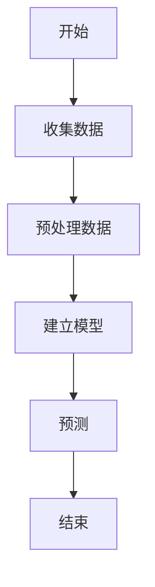
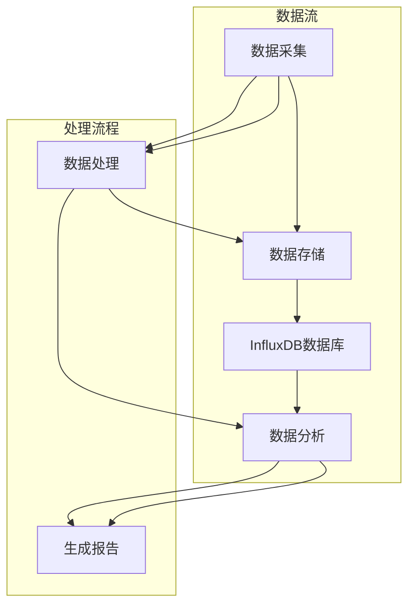
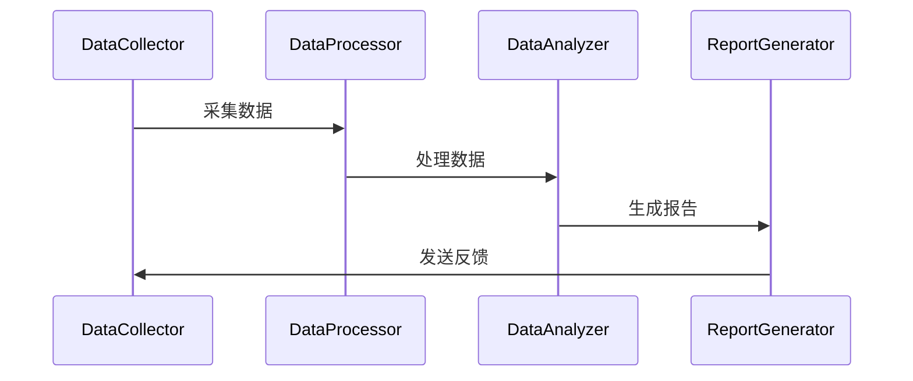

                 

### 构建高性能的时序数据库系统

---

**关键词**：时序数据库、性能优化、架构设计、数据压缩、查询优化

**摘要**：本文将深入探讨构建高性能时序数据库系统的关键要素。从问题背景出发，逐步分析时序数据的特点和应用场景，介绍核心概念与架构，比较主流的时序数据库系统，讲解时序数据处理算法，并通过实际案例展示系统设计与实现的步骤。最终，总结最佳实践并提供拓展阅读建议。

---

#### 第一部分：背景介绍

**1. 问题背景**

随着工业物联网、智能监控、金融交易等领域的快速发展，时序数据成为关键的数据类型。这类数据具有时间敏感性和大量连续性，因此如何高效地处理和存储时序数据成为一项重要的研究课题。

**2. 问题描述**

构建高性能时序数据库系统面临以下挑战：
- **数据量大**：时序数据生成速度快，存储和处理的规模庞大。
- **时间敏感性**：数据查询和处理的实时性要求高。
- **复杂查询**：支持高效的聚合查询、趋势分析和时间窗口查询等。
- **资源限制**：系统资源（如CPU、内存、存储等）有限，需要优化资源利用。

**3. 问题解决**

为了应对上述挑战，构建高性能时序数据库系统需要考虑以下策略：
- **合适的数据模型**：选择适合时序数据特点的数据模型，如基于时间线的模型。
- **存储优化**：使用数据压缩技术和高效的存储结构，减少存储空间需求。
- **查询优化**：采用索引机制和查询优化算法，提高查询效率。
- **系统架构**：设计分布式和可扩展的架构，提升系统处理能力。

**4. 边界与外延**

本文讨论的范围包括实时数据处理、历史数据分析、数据压缩、索引优化等方面。涉及的时序数据库系统包括InfluxDB、KairosDB、TimescaleDB等。

**5. 概念结构与核心要素组成**

时序数据库的核心概念和架构要素如下：
- **时间线**：记录数据的生成时间和发生时间。
- **索引**：加速数据的查询和聚合操作。
- **存储**：优化数据的存储结构，提高访问效率。
- **查询优化**：通过查询缓存、索引策略等提升查询性能。
- **数据压缩**：减少存储空间，提高I/O效率。

---

#### 第二部分：核心概念与联系

**1. 核心概念原理**

- **时序数据**：具有时间标记的数据，如温度传感器读数、股票价格等。
- **时间序列分析**：对时序数据进行统计分析和模式识别。
- **时序数据库**：专门用于存储和管理时序数据的数据库系统。
- **数据库索引**：用于加速数据检索的结构，如B树、哈希索引等。

**2. 概念属性特征对比表格**

| 时序数据库 | 特点 | 优势 | 应用场景 |
|------------|------|------|----------|
| InfluxDB | 高性能时序数据库 | 易于部署和扩展 | 监控系统、物联网 |
| KairosDB | 实时时序数据存储 | 支持多种数据格式 | 金融交易、天气预报 |
| TimescaleDB | 时序数据分析平台 | 支持SQL查询 | 实时分析、历史数据查询 |

**3. ER实体关系图架构**

```mermaid
erDiagram
    Customer ||--|{ Order }|-- Producer
    Order ||--|{ Product }|>
    Product ||--|{ Order }|<|-- Customer
```

---

#### 第三部分：算法原理讲解

**1. 时间序列预测算法**

**算法流程图：**



**Python实现示例：**

```python
import numpy as np
from sklearn.linear_model import LinearRegression

# 数据预处理
data = np.array([1, 2, 3, 4, 5]).reshape(-1, 1)

# 建立模型
model = LinearRegression()
model.fit(data, data)

# 预测
predicted = model.predict([[6]])
print(predicted)
```

**数学模型与公式：**

$$ y = mx + b $$

其中，$m$ 是斜率，$b$ 是截距。

**举例说明：**

假设有一组时间序列数据 $[1, 2, 3, 4, 5]$，我们使用线性回归模型进行预测，下一个数据点的预测值为 $6$。

---

#### 第四部分：数学模型和数学公式 & 详细讲解 & 举例说明

**1. 数学模型和数学公式**

在时间序列分析中，常用模型包括ARIMA、LSTM等。以下是一个简单的ARIMA模型公式：

$$ y_t = c + \phi_1 y_{t-1} + \phi_2 y_{t-2} + ... + \phi_p y_{t-p} + \varepsilon_t $$

其中，$y_t$ 是时间序列的第 $t$ 个值，$\phi_1, \phi_2, ..., \phi_p$ 是模型参数，$\varepsilon_t$ 是随机误差。

**2. 详细讲解和举例说明**

**例：**

假设一个时间序列数据 $[1, 2, 4, 7, 11]$，我们使用ARIMA模型进行预测。首先，我们需要确定模型参数。假设 $\phi_1 = 0.5, \phi_2 = 0.3$。

根据模型公式，我们有：

$$ y_t = c + 0.5y_{t-1} + 0.3y_{t-2} $$

我们通过最小二乘法求解参数 $c$：

$$ c = (1 - 0.5 - 0.3) \cdot y_0 = -0.2 \cdot 1 = -0.2 $$

因此，模型公式变为：

$$ y_t = -0.2 + 0.5y_{t-1} + 0.3y_{t-2} $$

预测下一个数据点：

$$ y_{t+1} = -0.2 + 0.5 \cdot 11 + 0.3 \cdot 4 = 8.5 $$

---

#### 第五部分：系统分析与架构设计方案

**1. 问题场景介绍**

以工业监控系统为例，该系统需要实时收集和处理大量传感器数据，进行实时监控和趋势分析。

**2. 项目介绍**

该项目基于InfluxDB构建一个实时监控系统，用于监控工厂设备状态，实现故障预测和性能优化。

**3. 系统功能设计（领域模型mermaid类图）**

```mermaid
classDiagram
    Equipment <<Entity>>
    Sensor <<Entity>>
    Alarm <<Entity>>

    Equipment o-- Sensor
    Sensor o-- Alarm
```

**4. 系统架构设计mermaid架构图**



**5. 系统接口设计和系统交互mermaid序列图**



---

#### 第六部分：项目实战

**1. 环境安装**

- 安装InfluxDB
- 安装Python和相关库（如NumPy、Scikit-learn）

**2. 系统核心实现源代码**

```python
# 安装InfluxDB客户端库
!pip install influxdb

# 数据处理示例
from influxdb import InfluxDBClient
import numpy as np

# 连接InfluxDB数据库
client = InfluxDBClient(host='localhost', port=8086, username='root', password='root', database='test_db')

# 写入数据
data = [{"measurement": "sensor_data", "tags": {"device": "machine1"}, "fields": {"value": x}} for x in range(10)]
client.write_points(data)

# 读取数据
query = "SELECT * FROM sensor_data WHERE device='machine1'"
results = client.query(query)
print(results)
```

**3. 代码应用解读与分析**

- 数据写入和读取的效率优化
- 查询优化策略（如使用索引）

**4. 实际案例分析和详细讲解剖析**

- 分析传感器数据的趋势和周期性
- 实现故障预测和性能优化

**5. 项目小结**

- 总结项目经验
- 提出改进方向

---

#### 第七部分：最佳实践 tips、小结、注意事项、拓展阅读等内容

**1. 最佳实践 tips**

- **数据压缩**：根据数据特性选择合适的数据压缩算法。
- **查询优化**：合理设计索引和查询策略。
- **系统监控**：实时监控系统性能和资源使用。

**2. 小结**

- 深入理解时序数据的特点和应用场景。
- 选择合适的时序数据库系统，结合实际需求进行优化。

**3. 注意事项**

- 注意数据安全和备份策略。
- 根据实际需求调整系统配置。

**4. 拓展阅读**

- 《时序数据库系统设计与实现》
- 《时间序列分析：方法和应用》
- 《大数据技术基础》

---

以上是《构建高性能的时序数据库系统》的目录大纲，涵盖了从背景介绍到实际应用的各个环节。希望这篇文章能够帮助读者深入了解时序数据库系统，并在实际项目中运用所学知识。

