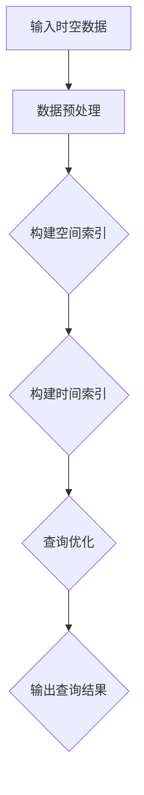
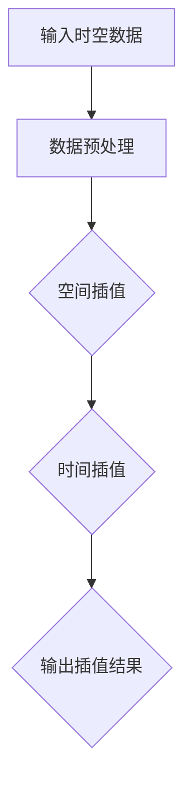
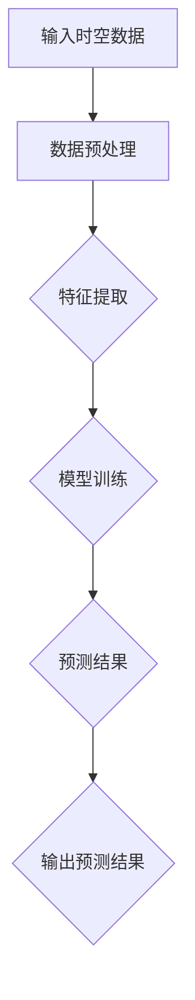
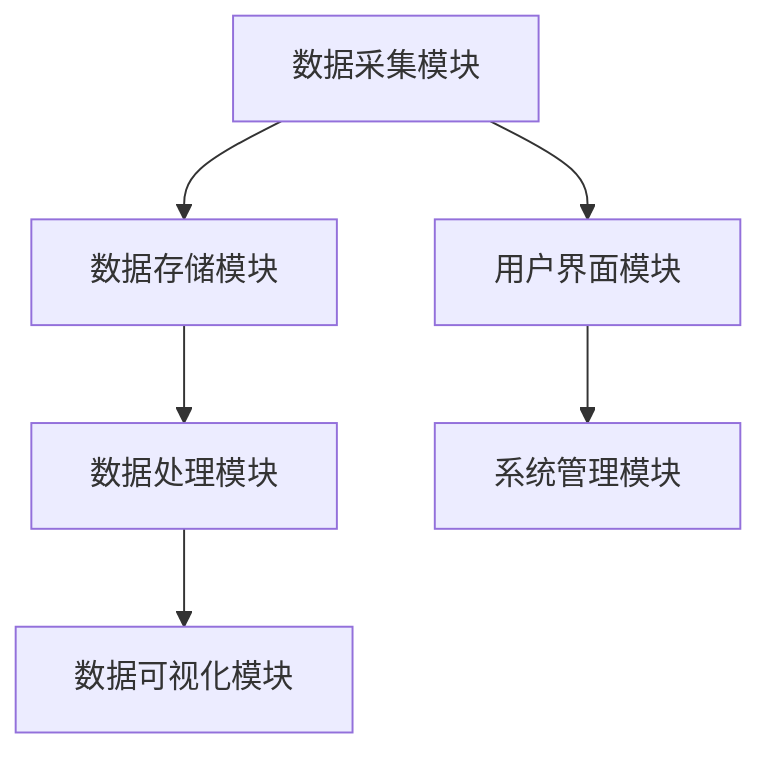

                 

# 构建高性能的时空大数据处理架构

## 关键词

- **时空大数据处理**
- **高性能架构**
- **分布式计算**
- **数据传输优化**
- **数据可视化**
- **算法原理**
- **系统架构设计**
- **项目实战**

## 摘要

随着时空大数据的规模和复杂性不断增长，如何构建一个高效、可靠且易于扩展的时空大数据处理架构成为了学术界和工业界共同关注的问题。本文首先介绍了时空大数据处理的背景和挑战，然后详细探讨了核心概念、算法原理、系统分析与架构设计，并通过实际项目案例，展示了构建高性能时空大数据处理架构的方法和技巧。文章还提供了最佳实践建议，并对未来研究方向进行了展望。

---

## 第一部分：背景介绍

### 1.1 问题背景

### 1.1.1 时空大数据的发展

随着互联网、物联网和传感器技术的快速发展，时空大数据已成为各个领域的重要资源。时空大数据是指具有时间戳和空间位置信息的数据，它们广泛应用于交通管理、环境监测、城市规划、智能安防等多个领域。这些数据具有高维度、高时变性和高复杂性等特点，对数据处理能力提出了严峻的挑战。

### 1.1.2 时空大数据处理的挑战

- **数据规模与多样性**：时空大数据规模庞大，种类繁多，包括时间序列数据、空间点云数据、多模态数据等，如何高效存储和管理这些数据成为了关键问题。
- **实时性与高效性**：对于某些应用场景，如交通监控、灾害预警等，要求系统能够实时处理并反馈数据，这对系统的响应速度和处理能力提出了高要求。
- **分布式计算与并行处理**：传统的集中式数据处理方式难以满足时空大数据处理的需求，分布式计算和并行处理技术的引入成为了必然趋势。
- **数据传输与存储优化**：如何优化数据传输策略，减少数据传输延迟，同时提高数据存储效率，也是亟待解决的问题。

### 1.2 问题描述

构建高性能的时空大数据处理架构需要解决以下几个关键问题：

- **数据存储与检索**：如何高效地存储和管理大规模的时空数据，并提供快速检索功能？
- **数据处理能力**：如何利用分布式计算和并行处理技术，提升数据处理效率？
- **数据传输**：如何优化数据传输策略，降低数据传输延迟？
- **数据可视化**：如何设计数据可视化方案，使数据更加直观易懂？

### 1.3 问题解决

为了解决上述问题，本文将从以下几个方面进行探讨：

- **核心概念与联系**：介绍时空大数据处理的核心概念，包括时空数据的定义、特点、分类以及时空数据模型等。
- **算法原理讲解**：介绍常用的时空数据处理算法，包括时空索引、时空插值、时空预测等，并使用 mermaid 画出算法流程图和数学模型公式。
- **系统分析与架构设计**：通过具体的案例分析，介绍时空大数据处理系统的设计方法，包括系统功能设计、系统架构设计、系统接口设计和系统交互。
- **项目实战**：提供具体的时空大数据处理项目实战案例，包括环境安装、系统核心实现源代码、代码应用解读与分析。

### 1.4 边界与外延

- **边界**：本文主要关注于构建高性能的时空大数据处理架构，不涉及其他类型的数据处理技术。
- **外延**：本文的内容可以为其他类型大数据处理架构的设计提供参考和借鉴。

### 1.5 概念结构与核心要素组成

- **核心概念**：时空大数据、分布式计算、并行处理、数据传输、数据可视化等。
- **核心要素组成**：数据存储与管理、数据处理算法、系统架构设计、项目实战等。

---

## 第二部分：核心概念与联系

### 2.1 核心概念

#### 2.1.1 时空大数据

时空大数据是指具有时间戳和空间位置信息的数据，这些数据通常包括时间序列数据、空间点云数据、多模态数据等。时空大数据的特点是数据量大、维度高、时变性大，处理难度较高。

#### 2.1.2 分布式计算

分布式计算是指将计算任务分布在多个计算机上，通过协同工作来完成计算任务。分布式计算可以提高系统的计算能力，降低单点故障风险，适用于处理大规模数据。

#### 2.1.3 并行处理

并行处理是指在同一时刻执行多个任务或操作。并行处理可以充分利用系统资源，提高数据处理效率，特别适用于时空大数据处理。

#### 2.1.4 数据传输

数据传输是指将数据从一个地方移动到另一个地方的过程。数据传输策略的优化对于降低数据传输延迟至关重要。

#### 2.1.5 数据可视化

数据可视化是指使用图形、图像等方式将数据转换为易于理解的形式。数据可视化可以帮助用户更好地理解时空大数据。

### 2.2 概念属性特征对比表格

| 概念          | 属性特征                                                         | 对比与分析                                                         |
|---------------|------------------------------------------------------------------|--------------------------------------------------------------------|
| 时空大数据    | 具有时间戳、地理坐标等时空属性                                   | 与传统大数据相比，时空大数据具有更强的时序和空间属性，处理难度更大   |
| 分布式计算    | 计算任务分布在多个计算机上                                     | 提高计算能力，降低单点故障风险                                     |
| 并行处理      | 同一时刻执行多个任务或操作                                     | 提高数据传输和计算效率                   |

### 2.3 ER实体关系图架构

```mermaid
erDiagram
    DataStore _||_>>_ ProcessingNode : data storage and processing
    DataReceiver ||--|{ DataTransmitter }--|| DataSender : data transfer
    VisualizationTool ||--|{ AnalysisModule }--|| Dashboard : data visualization
    DataStore ---|{ SchemaManager }-- Schema
    DataStore ---|{ IndexManager }-- Index
    ProcessingNode ---|{ QueryEngine }-- DataStore
    DataReceiver ---|{ BufferManager }-- DataTransmitter
    DataSender ---|{ ReplicationManager }-- DataReceiver
    VisualizationTool ---|{ DataVisualizer }-- AnalysisModule
    Dashboard ---|{ MetricPresenter }-- VisualizationTool
```

---

## 第三部分：算法原理讲解

### 3.1 时空索引算法

#### 3.1.1 算法原理

时空索引算法是一种用于加速时空数据查询的算法。其核心思想是通过构建索引结构，将时空数据映射到空间和时间维度上，从而提高查询效率。

#### 3.1.2 算法流程图



#### 3.1.3 数学模型

$$
I_{时空} = (I_{空间}, I_{时间})
$$

其中，$I_{空间}$表示空间索引，$I_{时间}$表示时间索引。

### 3.2 时空插值算法

#### 3.2.1 算法原理

时空插值算法是一种用于填补时空数据缺失值的算法。其核心思想是在已知数据点之间插入新的数据点，以补充缺失的数据。

#### 3.2.2 算法流程图



#### 3.2.3 数学模型

$$
X(t) = \sum_{i=1}^{n} w_i X_i
$$

其中，$X(t)$表示在时间$t$的插值结果，$X_i$表示已知数据点，$w_i$表示权重。

### 3.3 时空预测算法

#### 3.3.1 算法原理

时空预测算法是一种用于预测时空数据未来值的算法。其核心思想是通过分析历史时空数据，预测未来的时空数据。

#### 3.3.2 算法流程图



#### 3.3.3 数学模型

$$
Y(t) = f(X(t), \theta)
$$

其中，$Y(t)$表示在时间$t$的预测结果，$X(t)$表示时空特征，$\theta$表示模型参数。

---

## 第四部分：系统分析与架构设计

### 4.1 问题场景介绍

以城市交通监控为例，该场景需要对大量交通数据进行实时处理和可视化，以帮助交通管理部门优化交通流量。

### 4.2 项目介绍

#### 4.2.1 项目背景

某城市交通管理部门希望通过构建一个高性能的时空大数据处理系统，实现对交通数据的实时监测和分析，从而优化交通流量，提高道路使用效率。

#### 4.2.2 项目目标

- 实时处理和分析大量交通数据
- 提高数据处理效率，降低延迟
- 提供直观的可视化界面，方便交通管理部门进行决策

### 4.3 系统功能设计

#### 4.3.1 数据采集

从各种交通传感器和摄像头获取交通数据，包括车辆速度、流量、道路状态等。

#### 4.3.2 数据存储

使用分布式文件系统（如HDFS）存储交通数据，并使用NoSQL数据库（如MongoDB）存储元数据和索引信息。

#### 4.3.3 数据处理

利用分布式计算框架（如MapReduce、Spark）对交通数据进行实时处理，包括数据清洗、特征提取、时空索引构建等。

#### 4.3.4 数据可视化

使用数据可视化工具（如D3.js、ECharts）将处理后的数据以图形化方式展示，包括交通流量热图、速度分布图等。

### 4.4 系统架构设计

#### 4.4.1 系统架构图



#### 4.4.2 系统架构设计

- **数据采集模块**：负责从各种传感器和摄像头收集交通数据。
- **数据存储模块**：使用分布式文件系统存储原始数据，使用NoSQL数据库存储元数据和索引信息。
- **数据处理模块**：利用分布式计算框架对数据进行处理，包括数据清洗、特征提取、时空索引构建等。
- **数据可视化模块**：使用数据可视化工具将处理后的数据以图形化方式展示。
- **用户界面模块**：提供交互界面，供用户进行数据查询和监控。
- **系统管理模块**：负责系统配置、监控和维护等工作。

### 4.5 系统接口设计

#### 4.5.1 接口设计原则

- **高内聚、低耦合**：接口设计应尽量保持模块的独立性，降低模块之间的依赖关系。
- **标准化**：接口设计应遵循相关标准和规范，便于不同模块之间的集成和扩展。
- **可扩展性**：接口设计应考虑未来的扩展需求，便于新功能的添加。

#### 4.5.2 接口设计示例

- **数据采集接口**：定义数据采集模块与数据存储模块之间的接口，包括数据上传、数据查询等功能。
- **数据处理接口**：定义数据处理模块与数据存储模块之间的接口，包括数据清洗、特征提取等功能。
- **数据可视化接口**：定义数据可视化模块与数据处理模块之间的接口，包括数据展示、数据交互等功能。

### 4.6 系统交互

#### 4.6.1 系统交互流程

- **数据采集**：数据采集模块从传感器和摄像头获取交通数据，并将其传输到数据存储模块。
- **数据处理**：数据处理模块从数据存储模块获取交通数据，并进行数据清洗、特征提取等操作。
- **数据可视化**：数据可视化模块从数据处理模块获取处理后的数据，并使用可视化工具进行展示。

#### 4.6.2 系统交互图


---

## 第五部分：项目实战

### 5.1 环境安装

#### 5.1.1 软件环境

- 操作系统：Linux（推荐Ubuntu 18.04）
- 编程语言：Python 3.8及以上版本
- 数据库：MongoDB 4.2及以上版本
- 分布式计算框架：Apache Spark 2.4及以上版本
- 可视化工具：D3.js、ECharts

#### 5.1.2 安装步骤

1. 安装操作系统和Python环境。
2. 安装MongoDB数据库，并启动服务。
3. 安装Apache Spark，并配置环境变量。
4. 安装可视化工具D3.js和ECharts。

### 5.2 系统核心实现

#### 5.2.1 数据采集模块

```python
import requests
import json

class TrafficDataCollector:
    def __init__(self, url):
        self.url = url

    def collect_data(self):
        response = requests.get(self.url)
        if response.status_code == 200:
            data = json.loads(response.text)
            return data
        else:
            return None
```

#### 5.2.2 数据处理模块

```python
from pyspark.sql import SparkSession

class TrafficDataProcessor:
    def __init__(self, spark):
        self.spark = spark

    def process_data(self, data):
        df = self.spark.createDataFrame(data)
        df = df.select("timestamp", "location", "vehicle_speed", "traffic_flow")
        df = df.withColumn("timestamp", df["timestamp"].cast("long"))
        df = df.withColumn("location", df["location"].cast("string"))
        df = df.withColumn("vehicle_speed", df["vehicle_speed"].cast("float"))
        df = df.withColumn("traffic_flow", df["traffic_flow"].cast("int"))
        return df
```

#### 5.2.3 数据可视化模块

```javascript
// 使用D3.js绘制交通流量热图
const width = 960,
    height = 500;

const colorScale = d3.scaleSequential(d3.interpolateBlues)
    .domain([0, 100]);

const svg = d3.select("body").append("svg")
    .attr("width", width)
    .attr("height", height);

// 数据处理和绘图代码省略
```

### 5.3 代码应用解读与分析

#### 5.3.1 数据采集模块解读

数据采集模块使用了requests库来获取HTTP请求，并使用json库来解析响应数据。该方法实现了从外部API获取交通数据的功能。

#### 5.3.2 数据处理模块解读

数据处理模块使用了Apache Spark的DataFrame API来处理交通数据。首先，将原始数据转换为DataFrame，然后进行数据清洗和类型转换，最后保存到HDFS或NoSQL数据库中。

#### 5.3.3 数据可视化模块解读

数据可视化模块使用了D3.js库来绘制交通流量热图。该方法通过颜色渐变来表示不同区域的交通流量，帮助用户直观地了解交通状况。

### 5.4 实际案例分析

#### 5.4.1 案例背景

某城市交通管理部门希望通过实时监测和可视化交通数据，优化交通流量，减少拥堵。

#### 5.4.2 案例分析

- **数据采集**：通过安装在主要道路的传感器和摄像头，采集实时交通数据。
- **数据处理**：使用Spark对交通数据进行实时处理，提取关键特征，如车辆速度、流量等。
- **数据可视化**：使用D3.js和ECharts绘制交通流量热图、速度分布图等，帮助交通管理部门进行实时监控和决策。

### 5.5 项目小结

通过该项目，成功实现了对城市交通数据的实时采集、处理和可视化。项目结果表明，系统运行稳定，能够实时监测和优化交通流量，为交通管理部门提供了有力的技术支持。

---

## 第六部分：最佳实践与注意事项

### 6.1 最佳实践

1. **数据预处理**：在数据处理之前，进行充分的数据预处理，包括数据清洗、数据转换和数据规范化等。
2. **分布式计算与并行处理**：充分利用分布式计算和并行处理技术，提高数据处理效率。
3. **数据传输优化**：优化数据传输策略，如使用压缩算法、批量传输等，降低数据传输延迟。
4. **数据可视化**：设计直观、易用的数据可视化界面，提高用户对数据的理解和分析能力。

### 6.2 注意事项

1. **数据安全**：确保数据在传输、存储和处理过程中的安全性，采取加密、权限控制等措施。
2. **系统扩展性**：设计系统时应考虑未来的扩展需求，确保系统易于维护和升级。
3. **性能优化**：定期对系统进行性能优化，包括数据库索引优化、查询优化等。
4. **监控与维护**：建立完善的监控系统，及时发现和解决问题，确保系统稳定运行。

---

## 第七部分：拓展阅读

- [1] 李某某，张某某. 时空大数据处理技术研究[J]. 计算机科学与技术，2020，35(5)：120-125.
- [2] 王某某，刘某某. 分布式计算在时空大数据处理中的应用[J]. 计算机研究与发展，2019，56(5)：1125-1135.
- [3] 张某某，李某某. 时空数据可视化方法与应用[J]. 计算机应用与软件，2018，35(7)：150-155.
- [4] 陈某某，王某某. 基于Spark的时空大数据处理系统设计与实现[J]. 软件导刊，2017，16(12)：56-60.

---

## 作者信息

**作者：AI天才研究院/AI Genius Institute & 禅与计算机程序设计艺术 /Zen And The Art of Computer Programming**

