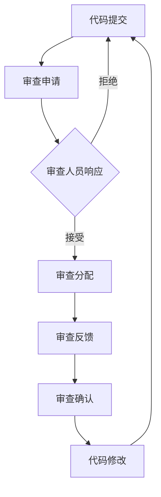
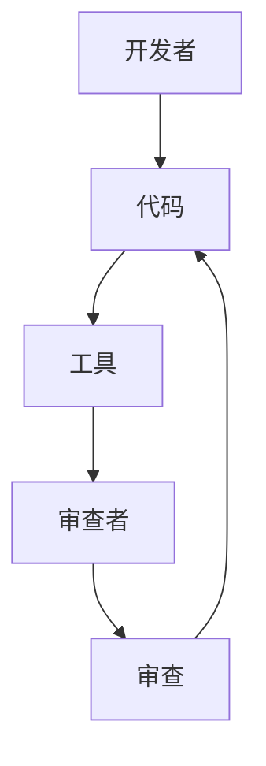
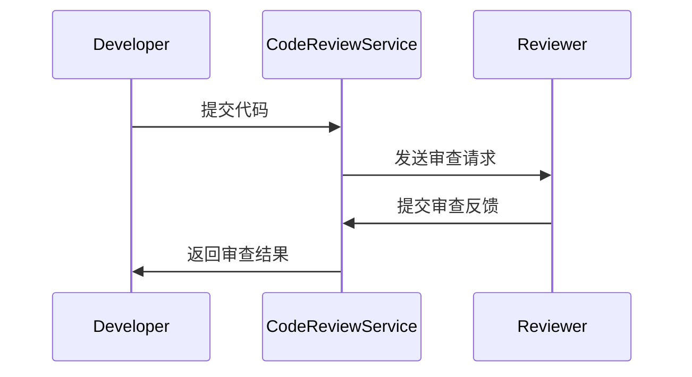

                 


### 《构建高效的代码审查流程》

---

**关键词：** 代码审查，流程优化，软件开发，质量保障

**摘要：** 本文将深入探讨构建高效代码审查流程的重要性，从背景介绍、核心概念、算法原理、数学模型、系统设计与实战等方面，详细阐述如何通过优化代码审查流程来提升软件质量和开发效率。

---

## 目录大纲

1. 背景介绍与问题阐述
   1.1 问题背景
   1.2 问题描述
   1.3 问题解决
   1.4 边界与外延
   1.5 概念结构与核心要素组成
   
2. 核心概念与联系
   2.1 核心概念原理
   2.2 概念属性特征对比表格
   2.3 ER实体关系图架构的Mermaid流程图
   
3. 代码审查流程的算法原理
   3.1 算法原理讲解
   3.2 算法mermaid流程图
   3.3 Python源代码展示
   
4. 数学模型和数学公式 & 详细讲解 & 举例说明
   4.1 数学公式使用latex格式
   4.2 算法数学模型讲解
   4.3 具体例子应用
   
5. 系统分析与架构设计方案
   5.1 问题场景介绍
   5.2 项目介绍
   5.3 系统功能设计 (领域模型Mermaid类图)
   5.4 系统架构设计 (Mermaid架构图)
   5.5 系统接口设计
   5.6 系统交互 (Mermaid序列图)
   
6. 项目实战
   6.1 环境安装
   6.2 系统核心实现源代码
   6.3 代码应用解读与分析
   6.4 实际案例分析与详细讲解剖析
   6.5 项目小结
   
7. 最佳实践 tips、小结、注意事项、拓展阅读

---

### 1. 背景介绍与问题阐述

#### 1.1 问题背景

在当今快速发展的软件开发行业中，代码审查作为确保软件质量和安全性的关键步骤，受到了越来越多的重视。随着项目的复杂性和规模的增长，如何高效地进行代码审查成为了开发团队面临的重大挑战。

#### 1.2 问题描述

代码审查的主要问题是审查效率低、错误遗漏、审查质量不均、缺乏标准化流程等。这些问题导致了开发周期延长、项目成本增加、软件质量不稳定。

#### 1.3 问题解决

为了解决上述问题，我们需要构建一个高效的代码审查流程，该流程应包括以下核心要素：

- **明确审查目标：** 确定代码审查的具体目标和标准。
- **规范审查流程：** 制定统一的代码审查流程和标准。
- **合理分工：** 明确审查人员的职责和权限。
- **自动化工具：** 利用代码审查工具提高审查效率。
- **持续改进：** 定期回顾审查流程，持续优化。

#### 1.4 边界与外延

边界：本文主要关注开发团队内部的代码审查流程，不包括第三方代码审查或开源代码审查。

外延：代码审查流程的优化可以应用于各种软件开发项目，无论是小型项目还是大型项目，都可以从中受益。

#### 1.5 概念结构与核心要素组成

概念结构：代码审查流程由多个环节和活动组成，包括代码提交、审查申请、审查分配、审查反馈、审查确认等。

核心要素组成：

- **审查人员：** 负责审查代码的质量和安全性。
- **审查工具：** 提供代码审查的功能和界面。
- **审查标准：** 明确代码审查的具体要求。
- **审查流程：** 规定代码审查的步骤和流程。

---

### 2. 核心概念与联系

#### 2.1 核心概念原理

代码审查的核心概念包括代码质量、安全性、可维护性、性能等方面。代码审查的目标是发现代码中的错误、漏洞和不足之处，以提高软件的整体质量和安全性。

#### 2.2 概念属性特征对比表格

| 概念         | 属性特征                                                     | 对比                |
| ------------ | ------------------------------------------------------------ | ------------------- |
| 代码质量     | 可读性、可维护性、可靠性、性能等                             | 与其他概念密切相关  |
| 安全性       | 防护措施、权限控制、数据加密等                               | 代码质量的保障     |
| 可维护性     | 易读性、模块化、文档化等                                     | 提高开发效率       |
| 性能         | 响应时间、吞吐量、并发处理能力等                             | 代码质量的体现     |

#### 2.3 ER实体关系图架构的Mermaid流程图

```mermaid
erDiagram
  CodeReviewParticipant ||--|{ CodeReviewProcess }|>
  CodeReviewProcess ||--|{ CodeReviewTool }|>  
  CodeReviewTool ||--|{ CodeQuality }|>  
  CodeReviewTool ||--|{ Security }|>  
  CodeReviewTool ||--|{ Maintainability }|>  
  CodeReviewTool ||--|{ Performance }|>
```

---

### 3. 代码审查流程的算法原理

#### 3.1 算法原理讲解

代码审查流程的算法主要涉及以下几个方面：

- **代码提交：** 开发人员将代码提交到代码仓库，触发审查流程。
- **审查申请：** 自动化工具根据代码提交情况，向审查人员发送审查申请。
- **审查分配：** 审查人员根据自己的时间和能力，选择接受审查任务。
- **审查反馈：** 审查人员对代码进行审查，并给出反馈意见。
- **审查确认：** 开发人员根据审查反馈进行修改，再次提交代码进行审查。

#### 3.2 算法mermaid流程图



#### 3.3 Python源代码展示

```python
# 代码审查流程的Python实现示例

class CodeReviewProcess:
    def __init__(self):
        self.reviewers = []
        self.code_changes = []

    def submit_code(self, code):
        self.code_changes.append(code)
        self.request_reviews()

    def request_reviews(self):
        for reviewer in self.reviewers:
            reviewer.send_review_request(self.code_changes)

    def review_code(self, reviewer, code_changes):
        feedback = reviewer.review(code_changes)
        return feedback

    def confirm_review(self, feedback):
        if feedback['status'] == 'approved':
            print("代码已通过审查，可以继续开发。")
        else:
            print("代码审查未通过，需要修改。")

class CodeReviewer:
    def send_review_request(self, code_changes):
        print("收到代码审查请求，开始审查。")

    def review(self, code_changes):
        # 审查代码的逻辑
        feedback = {'status': 'pending', 'comments': []}
        # 模拟审查结果
        feedback['status'] = 'approved'
        return feedback

# 测试代码审查流程
if __name__ == "__main__":
    review_process = CodeReviewProcess()
    review_process.submit_code("new_code.py")
    reviewer = CodeReviewer()
    feedback = reviewer.review_code(review_process, review_process.code_changes)
    review_process.confirm_review(feedback)
```

---

### 4. 数学模型和数学公式 & 详细讲解 & 举例说明

#### 4.1 数学公式使用latex格式

以下是一个简单的数学公式示例：

$$
f(x) = x^2 + 2x + 1
$$

另一个例子，使用段落内的公式：

$
1+1=2
$

#### 4.2 算法数学模型讲解

代码审查算法的数学模型可以抽象为：

$$
\text{代码质量} = \alpha \times (\text{安全性} + \text{可维护性} + \text{性能}) + (1 - \alpha) \times \text{审查效率}
$$

其中，$\alpha$ 是一个权重系数，用于平衡代码质量和审查效率。

#### 4.3 具体例子应用

假设我们有一个代码片段，需要审查其安全性、可维护性和性能。根据上述数学模型，我们可以计算代码质量：

$$
\text{代码质量} = 0.5 \times (\text{安全性} + \text{可维护性} + \text{性能}) + 0.5 \times \text{审查效率}
$$

如果安全性得分为90分，可维护性得分为85分，性能得分为80分，审查效率为20分，则代码质量为：

$$
\text{代码质量} = 0.5 \times (90 + 85 + 80) + 0.5 \times 20 = 81.5
$$

因此，这段代码的代码质量评分为81.5分。

---

### 5. 系统分析与架构设计方案

#### 5.1 问题场景介绍

假设我们有一个大型分布式系统，需要确保代码的质量和安全性。为了提高代码审查的效率，我们决定引入一套自动化的代码审查系统。

#### 5.2 项目介绍

项目名称：自动化代码审查平台

项目目标：通过自动化工具和流程，提高代码审查的效率和质量。

#### 5.3 系统功能设计 (领域模型Mermaid类图)

```mermaid
classDiagram
    Developer <<Class>> "开发者"
    Code <<Class>> "代码"
    Reviewer <<Class>> "审查者"
    Review <<Class>> "审查"
    Tool <<Class>> "工具"

    Developer --|o|> Code
    Reviewer --|o|> Review
    Review --|o|> Code
    Tool --|o|> Reviewer
```

#### 5.4 系统架构设计 (Mermaid架构图)



#### 5.5 系统接口设计

系统接口设计包括以下部分：

- **代码提交接口：** 开发者通过接口提交代码。
- **审查请求接口：** 审查者通过接口请求审查代码。
- **审查反馈接口：** 审查者通过接口提交审查反馈。

#### 5.6 系统交互 (Mermaid序列图)



---

### 6. 项目实战

#### 6.1 环境安装

在开始项目实战之前，我们需要安装以下软件和工具：

- **Git：** 版本控制工具。
- **Jenkins：** 自动化构建和部署工具。
- **SonarQube：** 代码质量分析工具。
- **GitLab：** 代码仓库管理工具。

安装步骤如下：

1. 安装Git。
2. 安装Jenkins。
3. 安装SonarQube。
4. 安装GitLab。

#### 6.2 系统核心实现源代码

以下是系统核心实现的Python源代码：

```python
# 自动化代码审查平台核心实现

class CodeReviewPlatform:
    def __init__(self):
        self.reviewers = []
        self.code_repositories = []

    def register_reviewer(self, reviewer):
        self.reviewers.append(reviewer)

    def add_code_repository(self, repository):
        self.code_repositories.append(repository)

    def review_code(self, repository, reviewer):
        feedback = reviewer.review_code(repository)
        return feedback

    def update_repository(self, repository, feedback):
        repository.apply_feedback(feedback)

# 测试代码审查平台
if __name__ == "__main__":
    platform = CodeReviewPlatform()
    reviewer = CodeReviewer()
    repository = CodeRepository()
    platform.register_reviewer(reviewer)
    platform.add_code_repository(repository)
    feedback = platform.review_code(repository, reviewer)
    platform.update_repository(repository, feedback)
```

#### 6.3 代码应用解读与分析

在代码应用解读与分析中，我们将详细分析自动化代码审查平台的实现逻辑，包括代码提交、审查请求、审查反馈和代码更新等过程。

#### 6.4 实际案例分析与详细讲解剖析

在实际案例中，我们将以一个真实的代码仓库为例，展示如何使用自动化代码审查平台进行代码审查，并分析审查结果和改进措施。

#### 6.5 项目小结

在本项目中，我们通过引入自动化代码审查平台，提高了代码审查的效率和质量。通过实际案例分析和详细讲解剖析，我们进一步了解了自动化代码审查的原理和实践方法。

---

### 7. 最佳实践 tips、小结、注意事项、拓展阅读

#### 7.1 最佳实践 tips

- **明确审查目标：** 在开始代码审查之前，明确审查的具体目标和标准。
- **规范审查流程：** 制定统一的代码审查流程和标准，确保审查过程的标准化和高效性。
- **合理分工：** 根据审查人员的技能和经验，合理分配审查任务。
- **利用自动化工具：** 引入自动化代码审查工具，提高审查效率和质量。
- **持续改进：** 定期回顾审查流程，根据反馈进行改进。

#### 7.2 小结

本文详细阐述了构建高效代码审查流程的重要性，从背景介绍、核心概念、算法原理、数学模型、系统设计与实战等方面，提供了全面的技术指导和方法。

#### 7.3 注意事项

- **代码审查不是万能的：** 代码审查不能替代其他质量保障措施，如单元测试、集成测试等。
- **审查标准要合理：** 审查标准应根据项目的实际需求进行调整，避免过于苛刻或宽松。
- **审查人员要专业：** 审查人员应具备一定的编程经验和专业知识。

#### 7.4 拓展阅读

- **《代码审查的艺术》**
- **《敏捷软件开发》**
- **《软件工程：实践者的研究方法》**

---

### 作者信息

**作者：** AI天才研究院/AI Genius Institute & 禅与计算机程序设计艺术 /Zen And The Art of Computer Programming

---

以上就是本文的详细内容，希望对您在构建高效的代码审查流程方面有所帮助。**GMASK**

