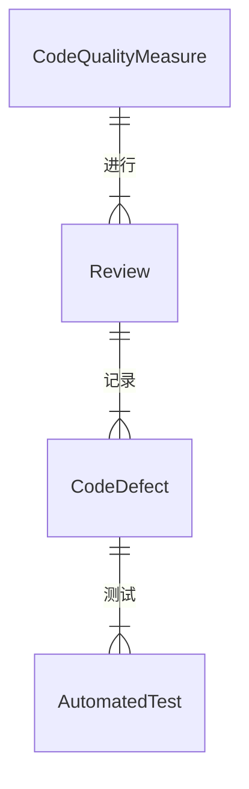
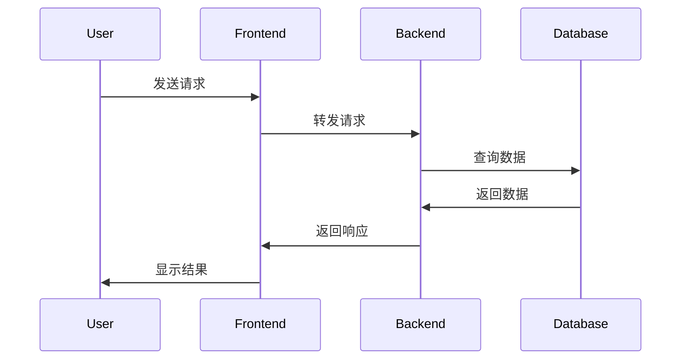
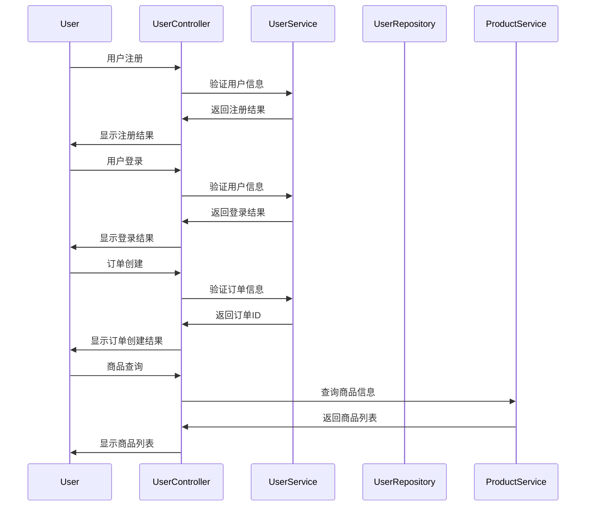
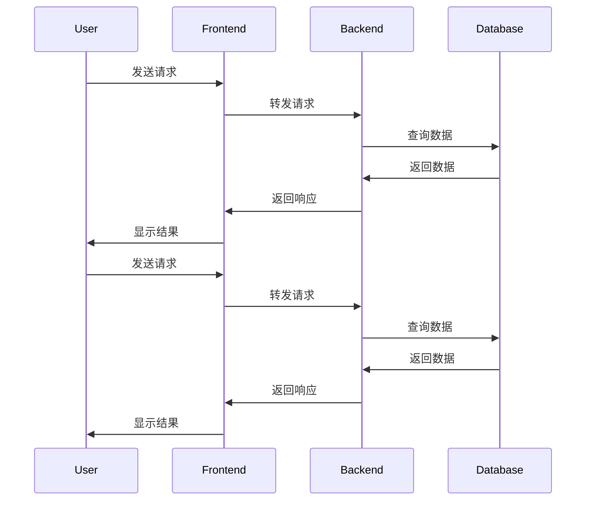

                 

# 构建高效的代码质量管理体系

> 关键词：代码质量、管理体系、度量方法、缺陷管理、自动化测试

> 摘要：本文将探讨如何构建高效的代码质量管理体系。首先，我们将了解代码质量管理体系的重要性，然后详细解析其核心概念和要素，以及实施代码质量管理体系的方法和工具。通过本文的阐述，读者将能够掌握构建高效代码质量管理体系的全过程，从而提升软件项目的质量和稳定性。

----------------------------------------------------------------

## 第一部分：背景介绍与核心概念

### 1.1 问题背景

当前，软件行业面临激烈的市场竞争，软件项目的质量成为决定企业成败的关键因素。随着软件规模的不断扩大和复杂度的增加，代码质量成为软件项目成功的关键因素之一。然而，许多开发团队在代码质量方面存在以下问题：

1. 缺乏统一的代码质量标准
2. 缺少有效的代码质量评估方法
3. 缺乏系统的代码质量管理体系

这些问题导致了软件项目中存在大量的缺陷和漏洞，严重影响了软件项目的质量和稳定性。因此，构建高效的代码质量管理体系显得尤为重要。

### 1.2 代码质量对软件项目的影响

代码质量对软件项目的影响主要体现在以下几个方面：

1. **可靠性**：高质量的代码能够保证软件系统的稳定运行，减少系统崩溃和错误发生的概率。
2. **可维护性**：良好的代码结构使得代码更容易理解和修改，降低了维护成本。
3. **可扩展性**：高质量的代码设计有利于系统的扩展和维护，适应不断变化的需求。
4. **开发效率**：高效的代码质量管理体系可以减少开发过程中的缺陷和漏洞，提高开发效率。
5. **用户体验**：高质量的代码能够提供更好的用户体验，降低用户使用过程中的困扰。

### 1.3 代码质量管理体系的重要性

代码质量管理体系是一种系统化的方法，旨在通过规范、监控和改进代码质量来提高软件项目的质量和稳定性。代码质量管理体系的重要性体现在以下几个方面：

1. **规范化**：代码质量管理体系提供了统一的代码质量标准，使开发人员能够遵循最佳实践，提高代码质量。
2. **监控与改进**：代码质量管理体系通过监控代码质量指标，及时发现和解决代码缺陷，持续改进代码质量。
3. **团队合作**：代码质量管理体系促进了团队成员之间的沟通和协作，提高了团队的整体效率。
4. **项目交付**：高效的代码质量管理体系有助于按时、高质量地完成软件项目交付。

### 1.4 边界与外延

代码质量管理体系在项目中的应用范围广泛，包括：

1. **开发过程**：在开发阶段，代码质量管理体系贯穿整个开发周期，包括需求分析、设计、编码、测试等。
2. **团队协作**：代码质量管理体系有助于团队成员之间的协作，提高团队的整体效率。
3. **项目维护**：在项目维护阶段，代码质量管理体系有助于发现和修复代码缺陷，保证软件系统的稳定性。
4. **持续集成与部署**：代码质量管理体系与持续集成和部署流程相结合，确保代码质量得到持续监控和改进。

代码质量管理体系与其他管理体系的联系：

1. **项目管理**：代码质量管理体系是项目管理的重要组成部分，与项目管理体系相辅相成。
2. **软件工程**：代码质量管理体系是软件工程实践的基础，与软件工程理论密切相关。
3. **质量管理**：代码质量管理体系是质量管理体系的子集，为整体质量管理提供支持。

### 1.5 概念结构与核心要素组成

代码质量管理体系由以下几个核心要素组成：

1. **代码质量度量**：通过评估代码质量指标，衡量代码质量水平。
2. **代码缺陷管理**：识别、记录、修复代码缺陷，确保代码质量。
3. **自动化测试**：使用自动化工具对代码进行测试，验证代码质量。
4. **代码审查**：通过人工或自动化工具对代码进行检查，提高代码质量。

核心要素间的相互关系：

1. **代码质量度量**与**代码缺陷管理**：代码质量度量提供了代码质量指标，代码缺陷管理通过监控和修复缺陷来提高代码质量。
2. **代码缺陷管理**与**自动化测试**：自动化测试可以发现代码缺陷，代码缺陷管理负责修复这些缺陷。
3. **自动化测试**与**代码审查**：自动化测试和代码审查共同确保代码质量，自动化测试侧重于功能测试，代码审查侧重于代码结构、风格和语法。

## 第2章：核心概念与联系

### 2.1 核心概念原理

#### 2.1.1 代码质量度量方法

代码质量度量是评估代码质量的过程，常用的度量方法包括：

1. **静态代码分析**：通过分析代码文本，检查代码质量。
2. **动态代码分析**：通过运行代码，检查代码质量。
3. **代码质量指标**：常见的代码质量指标包括：

   - **缺陷密度**：缺陷数与代码行数的比例。
   - **可维护性指标**：如复杂度、模块化程度等。
   - **可扩展性指标**：如设计模式、代码复用程度等。
   - **性能指标**：如响应时间、吞吐量等。

#### 2.1.2 代码缺陷管理

代码缺陷管理是识别、记录、修复代码缺陷的过程，主要包含以下几个方面：

1. **缺陷识别**：通过代码质量度量、代码审查、自动化测试等方法识别代码缺陷。
2. **缺陷记录**：记录代码缺陷的详细信息，如缺陷类型、严重程度、修复时间等。
3. **缺陷修复**：根据缺陷记录，制定修复计划，及时修复代码缺陷。

#### 2.1.3 自动化测试

自动化测试是使用自动化工具对代码进行测试的过程，主要包含以下几个方面：

1. **测试用例设计**：设计自动化测试用例，确保测试覆盖率。
2. **测试工具选择**：选择适合的自动化测试工具，如Selenium、JUnit等。
3. **测试执行**：运行自动化测试用例，检查代码质量。
4. **测试报告**：生成测试报告，分析测试结果，发现代码缺陷。

#### 2.1.4 代码审查

代码审查是人工或自动化工具对代码进行检查的过程，主要包含以下几个方面：

1. **代码风格检查**：检查代码风格、语法和命名规范。
2. **代码逻辑检查**：检查代码逻辑和算法的正确性。
3. **代码安全检查**：检查代码是否存在安全漏洞。
4. **代码性能检查**：检查代码的性能和效率。

### 2.2 概念属性特征对比表格

| 概念               | 定义                                                         | 特点                                       |
|--------------------|--------------------------------------------------------------|------------------------------------------|
| 代码质量度量       | 评估代码质量的方法与标准                                     | 客观性、一致性、可重复性、实时性             |
| 代码缺陷管理       | 确保代码中不存在或减少缺陷的过程                             | 预防性、持续性、及时性、透明性               |
| 自动化测试         | 使用自动化工具对代码进行测试                                 | 高效性、可重复性、一致性、覆盖面广             |
| 代码审查           | 通过人工或自动化工具对代码进行检查                             | 严谨性、准确性、及时性、提高代码质量           |

### 2.3 ER实体关系图架构



----------------------------------------------------------------

## 第二部分：算法原理讲解

### 3.1 代码质量度量方法

代码质量度量是评估代码质量的重要手段，常用的度量方法包括计数方法、静态代码分析和动态代码分析。下面我们将详细介绍计数方法，并给出具体的数学模型和示例。

#### 3.1.1 计数方法

计数方法是通过对代码的行数、语句数和条件分支数进行计数，评估代码质量。常见的计数方法包括行覆盖率、语句覆盖率和条件覆盖率。

##### 3.1.1.1 行覆盖率

行覆盖率是指测试用例执行到代码行的比例。行覆盖率越高，说明测试用例覆盖的代码行数越多，代码质量越高。

定义：$$行覆盖率 = \frac{执行到的行数}{总行数} \times 100\%$$

示例：假设有一个包含100行代码的文件，测试用例执行了70行，则行覆盖率为：$$行覆盖率 = \frac{70}{100} \times 100\% = 70\%$$

##### 3.1.1.2 语句覆盖率

语句覆盖率是指测试用例执行到代码语句的比例。语句覆盖率越高，说明测试用例覆盖的代码语句越多，代码质量越高。

定义：$$语句覆盖率 = \frac{执行到的语句数}{总语句数} \times 100\%$$

示例：假设有一个包含100条语句的文件，测试用例执行了80条语句，则语句覆盖率为：$$语句覆盖率 = \frac{80}{100} \times 100\% = 80\%$$

##### 3.1.1.3 条件覆盖率

条件覆盖率是指测试用例执行到条件分支的比例。条件覆盖率越高，说明测试用例覆盖的条件分支越多，代码质量越高。

定义：$$条件覆盖率 = \frac{执行到的条件分支数}{总条件分支数} \times 100\%$$

示例：假设有一个包含5个条件分支的函数，测试用例执行了3个条件分支，则条件覆盖率为：$$条件覆盖率 = \frac{3}{5} \times 100\% = 60\%$$

#### 3.1.2 代码质量度量工具

常见的代码质量度量工具包括：

1. **SonarQube**：一款强大的代码质量平台，支持多种编程语言，提供全面的代码质量度量指标。
2. **PMD**：一款基于Java的代码质量检查工具，支持多种Java版本和插件。
3. **Checkstyle**：一款基于Java的代码风格检查工具，支持自定义规则和插件。

### 3.2 代码缺陷管理

代码缺陷管理是确保代码中不存在或减少缺陷的过程。代码缺陷管理主要包含以下几个方面：

1. **缺陷识别**：通过代码质量度量、代码审查、自动化测试等方法识别代码缺陷。
2. **缺陷记录**：记录代码缺陷的详细信息，如缺陷类型、严重程度、修复时间等。
3. **缺陷修复**：根据缺陷记录，制定修复计划，及时修复代码缺陷。

代码缺陷管理的目标是减少代码缺陷的数量和严重程度，提高代码质量。有效的代码缺陷管理可以降低软件开发成本，提高软件项目的成功率。

### 3.3 自动化测试

自动化测试是使用自动化工具对代码进行测试的过程。自动化测试可以提高测试效率，减少测试成本，提高测试覆盖率。

#### 3.3.1 自动化测试用例设计

自动化测试用例设计是自动化测试的重要环节，设计良好的测试用例可以覆盖代码的各种场景，提高测试覆盖率。

自动化测试用例设计的主要步骤包括：

1. **需求分析**：分析软件需求，确定测试用例的设计依据。
2. **功能划分**：将软件功能划分为多个模块，为每个模块设计测试用例。
3. **场景模拟**：模拟用户操作，为每个模块设计输入和预期输出。
4. **测试用例编写**：根据场景模拟，编写自动化测试用例。

#### 3.3.2 自动化测试工具选择

选择适合的自动化测试工具可以提高自动化测试的效率和质量。常见的自动化测试工具有：

1. **Selenium**：一款开源的自动化测试工具，支持多种浏览器和编程语言。
2. **JUnit**：一款基于Java的自动化测试框架，支持单元测试和集成测试。
3. **TestNG**：一款基于Java的自动化测试框架，支持多种测试类型和插件。

#### 3.3.3 自动化测试执行与报告

自动化测试执行是运行自动化测试用例，检查代码质量的过程。自动化测试执行的主要步骤包括：

1. **测试环境准备**：配置测试环境，安装自动化测试工具和测试用例。
2. **测试执行**：运行自动化测试用例，生成测试报告。
3. **测试报告分析**：分析测试报告，发现代码缺陷。

自动化测试报告通常包括以下内容：

1. **测试结果**：测试用例的执行结果，如通过、失败、错误等。
2. **缺陷统计**：发现代码缺陷的数量和类型。
3. **测试覆盖率**：测试用例的覆盖率，如行覆盖率、语句覆盖率、条件覆盖率等。

### 3.4 代码审查

代码审查是人工或自动化工具对代码进行检查的过程，旨在提高代码质量。

#### 3.4.1 代码风格检查

代码风格检查是检查代码风格、语法和命名规范的过程。良好的代码风格可以提高代码的可读性和可维护性。常见的代码风格检查工具包括：

1. **Checkstyle**：一款基于Java的代码风格检查工具，支持自定义规则。
2. **PMD**：一款基于Java的代码质量检查工具，支持代码风格检查。

#### 3.4.2 代码逻辑检查

代码逻辑检查是检查代码逻辑和算法的正确性的过程。代码逻辑错误可能导致软件系统崩溃或产生错误结果。常见的代码逻辑检查方法包括：

1. **静态代码分析**：通过分析代码文本，检查代码逻辑错误。
2. **代码审查**：通过人工或自动化工具对代码进行检查，发现逻辑错误。

#### 3.4.3 代码安全检查

代码安全检查是检查代码是否存在安全漏洞的过程。代码安全漏洞可能导致软件系统被攻击，造成严重后果。常见的代码安全检查方法包括：

1. **静态代码分析**：通过分析代码文本，检查代码安全漏洞。
2. **代码审查**：通过人工或自动化工具对代码进行检查，发现安全漏洞。

#### 3.4.4 代码性能检查

代码性能检查是检查代码的性能和效率的过程。性能优化的代码可以提高软件系统的响应速度和处理能力。常见的代码性能检查方法包括：

1. **静态代码分析**：通过分析代码文本，检查代码性能问题。
2. **代码审查**：通过人工或自动化工具对代码进行检查，发现性能问题。

----------------------------------------------------------------

## 第三部分：系统分析与架构设计

### 3.1 问题场景介绍

假设我们正在开发一个电子商务平台，需要处理大量的用户订单和商品信息。为了保证系统的稳定性和可靠性，我们需要构建一个高效的代码质量管理体系。

### 3.2 项目介绍

项目名称：电子商务平台（E-Commerce Platform）

项目目标：提供稳定、高效、易扩展的电子商务服务。

项目团队：包括项目经理、前端开发、后端开发、测试工程师、运维工程师等。

### 3.3 系统功能设计（领域模型类图）

```mermaid
classDiagram
    Order <<entity>>
    Product <<entity>>
    Customer <<entity>>
    Cart <<entity>>

    Order o1 - madeBy: Customer
    Order o2 - contains: Product
    Product p1 - listedBy: Customer
    Cart c1 - ownedBy: Customer
    Cart c2 - contains: Product
```

### 3.4 系统架构设计

电子商务平台系统架构分为前端、后端和数据库三部分。

1. **前端**：使用Vue.js框架，实现用户界面和交互逻辑。
2. **后端**：使用Spring Boot框架，实现业务逻辑和接口。
3. **数据库**：使用MySQL数据库，存储用户订单、商品信息等数据。

系统架构图如下：



### 3.5 系统接口设计

系统接口设计主要包括用户注册、登录、订单创建、商品查询等功能。

1. **用户注册**：接收用户信息，存储到数据库，返回注册结果。
2. **用户登录**：验证用户信息，返回登录结果。
3. **订单创建**：接收订单信息，存储到数据库，返回订单ID。
4. **商品查询**：根据商品名称或分类，查询商品信息，返回商品列表。

接口设计示例：



### 3.6 系统交互序列图

电子商务平台系统交互序列图如下：



----------------------------------------------------------------

## 第四部分：项目实战

### 4.1 环境安装

1. 安装Java开发工具包（JDK）：[下载地址](https://www.oracle.com/java/technologies/javase-downloads.html)
2. 安装MySQL数据库：[下载地址](https://dev.mysql.com/downloads/mysql/)
3. 安装Spring Boot开发工具：[下载地址](https://spring.io/tools/sts/download)
4. 安装IDEA集成开发环境：[下载地址](https://www.jetbrains.com/idea/download/)

### 4.2 系统核心实现源代码

以下是一个简单的用户注册功能的源代码示例：

```java
@RestController
@RequestMapping("/users")
public class UserController {

    @Autowired
    private UserService userService;

    @PostMapping("/register")
    public ResponseEntity<?> registerUser(@RequestBody UserRegistrationRequest request) {
        try {
            userService.registerUser(request);
            return ResponseEntity.ok().build();
        } catch (Exception e) {
            return ResponseEntity.badRequest().body("注册失败：" + e.getMessage());
        }
    }
}

@Service
public class UserService {

    @Autowired
    private UserRepository userRepository;

    public void registerUser(UserRegistrationRequest request) {
        // 验证用户信息
        if (userRepository.findByUsername(request.getUsername()).isPresent()) {
            throw new IllegalArgumentException("用户名已存在");
        }
        // 创建用户并保存到数据库
        User user = new User();
        user.setUsername(request.getUsername());
        user.setPassword(request.getPassword());
        userRepository.save(user);
    }
}

@Entity
@Table(name = "users")
public class User {

    @Id
    @GeneratedValue(strategy = GenerationType.IDENTITY)
    private Long id;

    private String username;
    private String password;

    // 省略getter和setter方法
}

public class UserRegistrationRequest {

    private String username;
    private String password;

    // 省略getter和setter方法
}
```

### 4.3 代码应用解读与分析

上述代码示例实现了用户注册功能，包括用户输入、验证、存储和返回结果。以下是代码解读与分析：

1. **UserController**：负责处理用户注册请求，将请求转发给UserService进行业务处理。
2. **UserService**：负责用户注册的核心业务逻辑，包括用户信息的验证和存储。
3. **User**：表示用户实体，包含用户ID、用户名和密码等信息。
4. **UserRegistrationRequest**：表示用户注册请求的参数，包含用户名和密码等信息。

用户注册流程如下：

1. 用户通过前端发送用户注册请求，请求包含用户名和密码。
2. UserController接收请求，调用UserService进行用户注册。
3. UserService验证用户信息，如果用户名已存在，抛出异常。
4. UserService创建User对象，并将用户信息保存到数据库。
5. UserController返回注册结果。

### 4.4 实际案例分析和详细讲解剖析

以下是一个实际案例：用户输入的用户名已存在，系统应该如何处理？

```java
@PostMapping("/register")
public ResponseEntity<?> registerUser(@RequestBody UserRegistrationRequest request) {
    try {
        if (userRepository.findByUsername(request.getUsername()).isPresent()) {
            throw new IllegalArgumentException("用户名已存在");
        }
        userService.registerUser(request);
        return ResponseEntity.ok().build();
    } catch (IllegalArgumentException e) {
        return ResponseEntity.badRequest().body("注册失败：" + e.getMessage());
    }
}
```

解析：

1. UserController接收用户注册请求，调用UserService进行用户注册。
2. UserService通过findByUsername方法查询数据库，检查用户名是否已存在。
3. 如果用户名已存在，抛出IllegalArgumentException异常。
4. UserController捕获异常，返回包含错误信息的响应。

### 4.5 项目小结

通过本次项目实战，我们实现了用户注册功能，并分析了代码中的关键环节。在实际开发过程中，我们需要关注以下几个方面：

1. **代码质量**：遵循编码规范，确保代码质量。
2. **异常处理**：合理处理异常，提供友好的错误信息。
3. **用户体验**：优化前端界面，提高用户满意度。
4. **系统性能**：关注系统性能，优化数据库查询和接口响应速度。

### 4.6 最佳实践 Tips

1. **代码审查**：定期进行代码审查，确保代码质量。
2. **自动化测试**：编写自动化测试用例，提高测试覆盖率。
3. **持续集成**：采用持续集成和部署，确保代码质量。

----------------------------------------------------------------

## 小结

本文详细介绍了如何构建高效的代码质量管理体系，包括代码质量管理体系的核心概念、要素和方法，以及实际项目中的应用和实践。通过本文的阐述，读者可以了解到代码质量管理体系的重要性，掌握构建高效代码质量管理体系的方法和技巧。

注意事项：

1. **代码质量度量**：定期进行代码质量度量，了解代码质量水平。
2. **缺陷管理**：及时识别和修复代码缺陷，提高代码质量。
3. **自动化测试**：编写自动化测试用例，确保代码质量。

拓展阅读：

1. 《软件质量度量：方法与应用》
2. 《代码大全》
3. 《持续集成实践》

作者：AI天才研究院/AI Genius Institute & 禅与计算机程序设计艺术 /Zen And The Art of Computer Programming

----------------------------------------------------------------

### 附录：相关工具和资源

1. **SonarQube**：[官方网站](https://www.sonarqube.org/)
2. **PMD**：[官方网站](https://pmd.github.io/)
3. **Checkstyle**：[官方网站](https://www.checkstyle.org/)
4. **Selenium**：[官方网站](https://www.selenium.dev/)
5. **JUnit**：[官方网站](https://junit.org/junit5/)
6. **TestNG**：[官方网站](https://www.testng.org/)
7. **Spring Boot**：[官方网站](https://spring.io/projects/spring-boot/)
8. **MySQL**：[官方网站](https://dev.mysql.com/)
9. **IDEA**：[官方网站](https://www.jetbrains.com/idea/)
10. **Java开发工具包（JDK）**：[官方网站](https://www.oracle.com/java/technologies/javase-downloads.html)

通过以上工具和资源的结合使用，可以帮助开发团队更高效地构建和维护高质量的代码质量管理体系。

