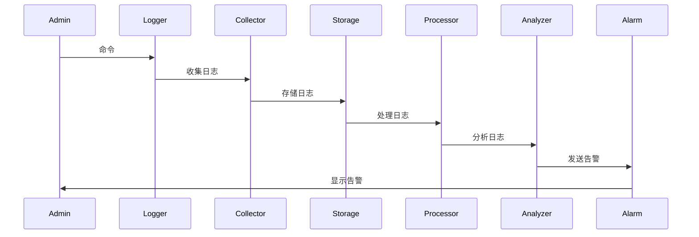
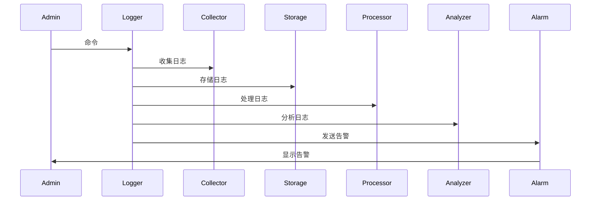
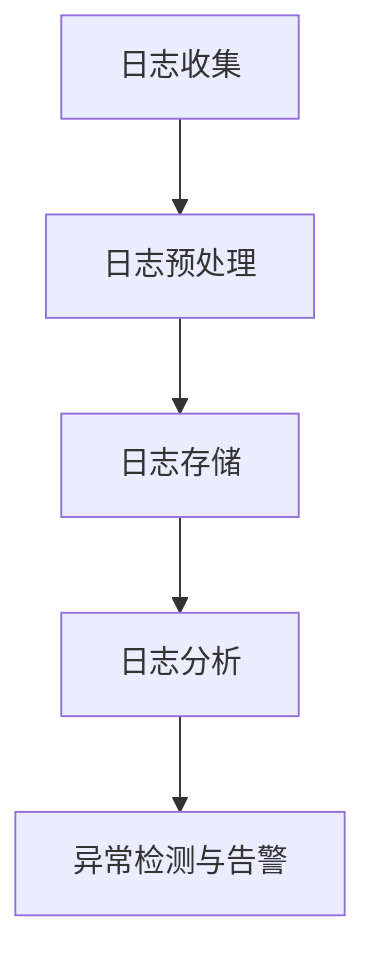
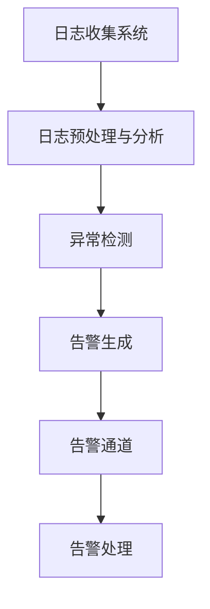

                 

### 第一部分: 引言

#### 第1章: 为什么要构建高效的日志监控系统

在当今的信息化时代，数据已成为企业的重要资产。而日志监控，作为获取、分析和处理系统运行状态的重要手段，对于确保系统稳定性和业务连续性具有重要意义。本章节将深入探讨构建高效日志监控系统的重要性、背景、问题描述及其解决方法，并明确边界与外延，为后续章节的深入讨论奠定基础。

##### 1.1.1 问题背景

随着互联网和云计算技术的发展，企业的IT系统变得越来越复杂。系统不仅包含大量的应用程序和服务器，还有繁多的网络设备和存储设备。在这种复杂环境中，如何确保系统的稳定运行、及时发现和解决问题，成为IT管理人员面临的重大挑战。日志监控作为一种实时监测系统运行状态的手段，能够帮助管理员迅速发现并解决问题，从而保障系统的正常运行。

##### 1.1.2 问题描述

日志监控系统的作用是收集、存储、处理和分析系统运行产生的日志数据，通过这些数据来监控系统的运行状况，发现潜在问题和异常情况。然而，现有的日志监控系统在高效性方面存在诸多问题，包括：

1. **日志收集效率低**：传统的日志收集方式往往依赖于手动配置，效率低下，且容易出错。
2. **日志存储和处理能力不足**：随着系统规模的扩大，日志数据的数量急剧增加，现有的存储和处理能力无法满足需求。
3. **日志分析能力有限**：现有系统在日志分析方面能力有限，难以从海量日志中提取有价值的信息。
4. **告警机制不完善**：缺乏有效的告警机制，导致问题发现不及时，影响系统稳定性。

##### 1.1.3 问题解决方法

为了解决上述问题，构建一个高效的日志监控系统是必不可少的。具体来说，可以从以下几个方面入手：

1. **采用分布式架构**：通过分布式架构，提高日志收集和处理的效率。
2. **使用高性能存储方案**：采用分布式存储方案，提升日志存储能力。
3. **引入先进分析算法**：利用机器学习和数据挖掘等技术，提高日志分析能力。
4. **完善告警机制**：设计灵活、高效的告警系统，确保问题能够及时发现和处理。

##### 1.1.4 边界与外延

构建高效日志监控系统的边界主要包括以下几个方面：

1. **系统边界**：监控范围限定在IT系统内部，不包括外部网络和互联网。
2. **数据边界**：日志数据仅包含与系统运行状态相关的信息，不涉及用户隐私和数据。
3. **功能边界**：日志监控系统的功能包括日志收集、存储、处理和分析，但不涉及日志数据的进一步利用，如商业智能。

##### 1.1.5 核心概念

在构建高效日志监控系统的过程中，需要理解以下几个核心概念：

1. **日志**：记录系统运行过程中发生的各种事件和状态。
2. **日志收集**：从各个系统组件中收集日志数据的过程。
3. **日志存储**：将收集到的日志数据存储到合适的位置，以便后续处理和分析。
4. **日志处理**：对日志数据进行清洗、转换和格式化等操作，为分析做准备。
5. **日志分析**：利用算法和技术对日志数据进行处理，提取有价值的信息。
6. **告警系统**：根据日志分析结果，及时发出告警，提醒管理员注意和处理问题。

通过对以上核心概念的理解，将为后续章节的深入探讨提供坚实的基础。

### 第二部分: 日志监控系统设计与实现

在本章节中，我们将详细讨论日志监控系统的设计与实现，包括系统架构设计、日志收集与存储、日志处理与分析、异常检测与告警、系统优化与性能调优等内容。通过逐步的分析和讲解，我们将为您展示如何构建一个高效、可靠的日志监控系统。

#### 第3章: 系统架构设计

系统架构设计是构建高效日志监控系统的关键步骤，它决定了系统的扩展性、性能和稳定性。在本章节中，我们将介绍系统架构设计的基本原则、核心组件及其交互关系。

##### 3.1 问题场景介绍

在现代企业中，IT系统的规模和复杂性不断增加，日志监控成为保证系统稳定运行的重要手段。一个典型的日志监控系统可能包括多个子系统，如日志收集、日志存储、日志处理、日志分析和告警等。这些子系统需要协同工作，共同完成日志监控的任务。

##### 3.2 项目介绍

为了更好地理解日志监控系统，我们以一个实际的IT项目为例，该项目涉及多个业务系统和服务器。项目的目标是构建一个高效、可靠的日志监控系统，以实现实时监控、异常检测和告警功能，确保系统的稳定运行。

##### 3.3 系统功能设计 (领域模型类图)

在系统功能设计阶段，我们需要明确各个子系统的主要功能，并通过领域模型类图来表示。以下是一个简单的领域模型类图：

```mermaid
classDiagram
    Node -> Logger
    Logger -> Collector
    Collector -> Storage
    Storage -> Processor
    Processor -> Analyzer
    Analyzer -> Alarm
    Alarm -> Admin
    Admin -> Logger
```

在这个类图中，Logger代表日志记录器，Collector代表日志收集器，Storage代表日志存储器，Processor代表日志处理器，Analyzer代表日志分析器，Alarm代表告警系统，Admin代表管理员。

##### 3.4 系统架构设计 (架构图)

系统架构设计是系统功能设计的具体实现，它通过架构图来表示各个组件之间的交互关系。以下是一个简单的系统架构图：



在这个架构图中，管理员通过命令启动日志监控系统，日志记录器收集日志数据，日志收集器将日志存储到日志存储器中，日志处理器对日志进行处理，日志分析器对处理后的日志进行分析，告警系统根据分析结果发送告警，最后管理员查看告警信息。

##### 3.5 系统接口设计

系统接口设计是确保各个组件能够正常交互的重要环节。以下是系统接口设计的示例：

```mermaid
classDiagram
    Logger <<Interface>> Collector
    Logger <<Interface>> Storage
    Logger <<Interface>> Processor
    Logger <<Interface>> Analyzer
    Logger <<Interface>> Alarm
    Collector <<Interface>> Storage
    Collector <<Interface>> Processor
    Collector <<Interface>> Analyzer
    Collector <<Interface>> Alarm
    Storage <<Interface>> Processor
    Storage <<Interface>> Analyzer
    Storage <<Interface>> Alarm
    Processor <<Interface>> Analyzer
    Processor <<Interface>> Alarm
    Analyzer <<Interface>> Alarm
```

在这个接口设计中，Logger代表日志记录器，Collector代表日志收集器，Storage代表日志存储器，Processor代表日志处理器，Analyzer代表日志分析器，Alarm代表告警系统。各个组件通过接口进行交互，确保系统功能的实现。

##### 3.6 系统交互 (序列图)

系统交互是通过序列图来描述的，它展示了各个组件在系统运行过程中的交互顺序。以下是一个简单的系统交互序列图：



在这个序列图中，管理员通过命令启动日志监控系统，日志记录器收集日志数据，日志收集器将日志存储到日志存储器中，日志处理器对日志进行处理，日志分析器对处理后的日志进行分析，告警系统根据分析结果发送告警，最后管理员查看告警信息。

通过以上系统架构设计、系统接口设计和系统交互的介绍，我们可以清楚地了解日志监控系统的整体架构和运行流程。在下一章中，我们将进一步探讨日志收集与存储的方法和实现细节。

#### 第4章: 日志收集与存储

日志收集与存储是日志监控系统的基础，有效的日志收集与存储能够确保系统运行状态的可监控性和数据的完整性。在本章节中，我们将详细介绍日志收集的方法、存储方案以及实现细节，帮助读者理解并构建高效的日志收集与存储系统。

##### 4.1 日志收集方法

日志收集的方法可以分为以下几种：

1. **Agent收集**：在服务器或应用程序中安装专门的日志收集代理（Agent），由Agent负责收集系统生成的日志，并将其发送到集中存储位置。这种方法具有较高的灵活性和可控性，适用于大规模分布式系统。
2. **Logtail收集**：通过日志收集工具（如Filebeat、Fluentd等）的Logtail功能，实时监控指定目录下日志文件的变动，并将新产生的日志收集起来。这种方法适用于日志文件分散在多个位置的场景。
3. **Tail命令收集**：使用操作系统提供的tail命令，定期读取日志文件的末尾部分，将新产生的日志收集起来。这种方法适用于小规模的单机系统。

在本章节中，我们将主要介绍Agent收集方法，因为它在大规模分布式系统中具有更好的性能和可靠性。

1. **安装Agent**：在目标服务器上安装日志收集代理。以Filebeat为例，可以从其官方网站下载并安装。安装完成后，配置Filebeat.yml文件，指定收集的日志文件路径和发送到的日志存储位置。
2. **配置Kafka**：作为日志存储中间件，Kafka在日志收集过程中起到关键作用。需要配置Kafka集群，包括创建主题、配置分区和副本等。
3. **启动Agent**：启动日志收集代理，使其开始收集日志。Filebeat会定期读取指定路径的日志文件，将日志数据发送到Kafka。

##### 4.2 日志存储方案

日志存储方案的选择对日志监控系统的性能和可靠性有重要影响。以下是几种常见的日志存储方案：

1. **关系数据库**：将日志数据存储在关系数据库中，如MySQL、PostgreSQL等。这种方法适用于日志数据量较小、查询需求简单的场景。缺点是关系数据库的扩展性较差，难以应对海量日志数据的存储和查询需求。
2. **NoSQL数据库**：将日志数据存储在NoSQL数据库中，如MongoDB、Cassandra等。NoSQL数据库具有高扩展性，适用于海量日志数据的存储和查询。缺点是查询性能相对较低，且数据一致性保证较为困难。
3. **日志收集中间件**：将日志数据发送到日志收集中间件，如Kafka、Fluentd等。这些中间件通常具有分布式架构，能够处理大规模日志数据的存储和传输。缺点是日志数据在存储中间件中无法直接查询，需要进一步处理和分析。
4. **日志存储服务**：使用专业的日志存储服务，如ELK（Elasticsearch、Logstash、Kibana）堆栈、GaussDB（兼容MySQL、PostgreSQL）等。这些服务通常提供完整的日志处理、分析和展示功能，具有较高的性能和可靠性。

在本章节中，我们选择使用Kafka + Elasticsearch + Kibana的方案，具有较好的性能和扩展性。

1. **配置Kafka**：在Kafka集群中创建主题，用于存储日志数据。配置分区和副本，确保日志数据的可靠性和高性能。例如，可以创建一个名为`log_topic`的主题，配置3个分区和3个副本。
2. **配置Logstash**：配置Logstash，将其作为日志收集中间件，将日志数据从Kafka转发到Elasticsearch。Logstash的配置文件中需要指定输入源、过滤器处理和输出目标。例如，配置Filebeat作为输入源，将日志数据发送到Kafka的`log_topic`主题，再通过Logstash过滤器处理日志数据，最后输出到Elasticsearch的特定索引。
3. **配置Elasticsearch**：配置Elasticsearch集群，用于存储和处理日志数据。创建索引模板，定义索引的结构和属性。配置搜索和分析功能，以便于在Kibana中展示和分析日志数据。

##### 4.3 实现细节

以下是具体的实现细节：

1. **配置Filebeat**：在Filebeat的配置文件中，指定收集的日志文件路径和输出目标。例如，以下配置指定了收集`/var/log/messages`文件，并将日志数据发送到Kafka的`log_topic`主题：

   ```yaml
   filebeat.inputs:
     - type: log
       paths:
         - /var/log/messages

   filebeat.config.modules:
     path: ${path.config}/modules.d/*.yml
     reload.enabled: false

   output.kafka:
     brokers: ["kafka1:9092", "kafka2:9092", "kafka3:9092"]
     topic: "log_topic"
   ```

2. **配置Logstash**：在Logstash的配置文件中，定义输入、过滤器和输出。以下配置将日志数据从Kafka的`log_topic`主题转发到Elasticsearch的特定索引：

   ```ruby
   input {
     kafka {
       type => "kafka"
       topics => ["log_topic"]
       bootstrap_servers => ["kafka1:9092", "kafka2:9092", "kafka3:9092"]
     }
   }

   filter {
     if "logstash-*" in [tags] {
       mutate {
         add_field => { "[@metadata][kibana_index]" => "logstash-%{+YYYY.MM.dd}" }
       }
     }
   }

   output {
     if "logstash-*" in [tags] {
       elasticsearch {
         hosts => ["elasticsearch1:9200", "elasticsearch2:9200", "elasticsearch3:9200"]
         index => "%{[@metadata][kibana_index]}-%{+YYYY.MM.dd}"
       }
     }
   }
   ```

3. **配置Elasticsearch**：在Elasticsearch中创建索引模板，定义索引的结构和属性。以下配置创建了一个名为`logstash-*`的索引模板，包含`@timestamp`、`host`、`source`等字段：

   ```json
   {
     "template": "logstash-*",
     "mappings": {
       "properties": {
         "@timestamp": {
           "type": "date",
           "format": "strict_date_optional_time"
         },
         "host": {
           "type": "keyword"
         },
         "source": {
           "type": "text",
           "fields": {
             "keyword": {
               "type": "keyword"
             }
           }
         }
       }
     },
     "settings": {
       "number_of_shards": 3,
       "number_of_replicas": 2
     }
   }
   ```

通过以上配置，日志收集与存储系统即可正常运行，确保日志数据的实时收集和存储。在下一章中，我们将进一步探讨日志处理与分析的方法。

#### 第5章: 日志处理与分析

日志处理与分析是日志监控系统的核心功能，通过对日志数据的处理和分析，可以及时发现系统中的潜在问题和异常情况，从而保障系统的稳定运行。在本章节中，我们将详细介绍日志处理流程、数据预处理、数据分析算法以及具体实现示例。

##### 5.1 日志处理流程

日志处理流程通常包括以下几个步骤：

1. **日志收集**：从各个系统组件中收集日志数据，并将其存储到日志存储系统中。
2. **日志预处理**：对收集到的日志数据进行清洗、格式化和去重等操作，以便后续分析。
3. **日志存储**：将预处理后的日志数据存储到日志存储系统中，以便进行长期存储和分析。
4. **日志分析**：利用数据分析算法对日志数据进行处理，提取有价值的信息，识别潜在问题和异常情况。
5. **异常检测与告警**：根据日志分析结果，检测异常情况并发出告警，提醒管理员注意和处理问题。

以下是一个简单的日志处理流程图：



##### 5.2 数据预处理

数据预处理是日志处理流程的重要环节，主要包括以下步骤：

1. **日志清洗**：去除日志中的噪声数据，如空格、换行符等。
2. **日志格式化**：将日志数据转换为统一的格式，如JSON格式，以便后续处理和分析。
3. **去重**：去除重复的日志数据，避免重复计算和分析。
4. **字段提取**：从日志数据中提取有用的字段，如时间戳、主机名、进程ID等。

以下是一个简单的数据预处理示例：

```python
import json
import re

def preprocess_log(log_data):
    # 清洗日志数据
    log_data = log_data.strip()
    # 去除换行符
    log_data = log_data.replace('\n', '')
    # 格式化日志数据为JSON格式
    log_data = re.sub(r'[^0-9A-Za-z]+', ' ', log_data)
    log_data = json.loads(log_data)
    # 提取有用字段
    fields = ['timestamp', 'hostname', 'process_id', 'log_message']
    processed_data = {field: log_data.get(field, '') for field in fields}
    return processed_data

# 示例日志数据
log_data = '{"timestamp": "2023-03-01 10:30:00", "hostname": "server1", "process_id": "12345", "log_message": "Error: File not found."}'

# 预处理日志数据
preprocessed_data = preprocess_log(log_data)
print(preprocessed_data)
```

输出结果：

```python
{
    'timestamp': '2023-03-01 10:30:00',
    'hostname': 'server1',
    'process_id': '12345',
    'log_message': 'Error: File not found.'
}
```

##### 5.3 数据分析算法

数据分析算法是日志分析的核心，通过算法可以提取日志中的有价值信息，识别潜在问题和异常情况。以下是一些常用的数据分析算法：

1. **统计计算**：计算日志数据的各种统计指标，如平均值、中位数、标准差等。通过统计计算，可以了解系统运行的总体状况。
2. **模式识别**：利用机器学习和数据挖掘技术，对日志数据进行分析，识别常见的错误模式、异常行为等。
3. **时间序列分析**：分析日志数据的时间序列特征，如趋势、周期性、突变等，以便及时发现异常情况。

以下是一个简单的数据分析算法示例，利用统计计算来分析日志数据中的错误率：

```python
import numpy as np

def calculate_error_rate(log_data):
    error_count = 0
    total_count = len(log_data)
    for log_entry in log_data:
        if 'Error' in log_entry['log_message']:
            error_count += 1
    error_rate = error_count / total_count
    return error_rate

# 示例日志数据
log_data = [
    {'timestamp': '2023-03-01 10:30:00', 'hostname': 'server1', 'process_id': '12345', 'log_message': 'Error: File not found.'},
    {'timestamp': '2023-03-01 10:31:00', 'hostname': 'server1', 'process_id': '12346', 'log_message': 'Error: Connection failed.'},
    {'timestamp': '2023-03-01 10:32:00', 'hostname': 'server2', 'process_id': '12347', 'log_message': 'Info: Server started.'}
]

# 计算错误率
error_rate = calculate_error_rate(log_data)
print('Error rate:', error_rate)
```

输出结果：

```python
Error rate: 0.5
```

##### 5.4 实现示例

以下是一个完整的日志处理与分析实现示例，包括日志收集、预处理、存储、分析以及告警：

```python
import json
import re
import time
from kafka import KafkaProducer

# 配置Kafka生产者
producer = KafkaProducer(bootstrap_servers=['kafka1:9092', 'kafka2:9092', 'kafka3:9092'],
                         value_serializer=lambda v: json.dumps(v).encode('utf-8'))

def preprocess_log(log_data):
    # 清洗日志数据
    log_data = log_data.strip()
    # 去除换行符
    log_data = log_data.replace('\n', '')
    # 格式化日志数据为JSON格式
    log_data = re.sub(r'[^0-9A-Za-z]+', ' ', log_data)
    log_data = json.loads(log_data)
    # 提取有用字段
    fields = ['timestamp', 'hostname', 'process_id', 'log_message']
    processed_data = {field: log_data.get(field, '') for field in fields}
    return processed_data

def calculate_error_rate(log_data):
    error_count = 0
    total_count = len(log_data)
    for log_entry in log_data:
        if 'Error' in log_entry['log_message']:
            error_count += 1
    error_rate = error_count / total_count
    return error_rate

def process_logs(log_data):
    preprocessed_data = preprocess_log(log_data)
    producer.send('log_topic', preprocessed_data)
    time.sleep(1)

def analyze_logs():
    consumer = KafkaConsumer('log_topic', bootstrap_servers=['kafka1:9092', 'kafka2:9092', 'kafka3:9092'],
                              group_id='log-analysis-group', value_deserializer=lambda m: json.loads(m.decode('utf-8')))
    error_log_data = []
    while True:
        for msg in consumer:
            log_entry = msg.value
            if 'Error' in log_entry['log_message']:
                error_log_data.append(log_entry)
                if len(error_log_data) >= 100:
                    break
        if len(error_log_data) > 0:
            error_rate = calculate_error_rate(error_log_data)
            if error_rate > 0.5:
                send_alert('High error rate: {:.2f}%'.format(error_rate * 100))
            break

# 发送告警
def send_alert(message):
    print('Alert:', message)

# 收集和预处理日志
log_data = [
    '{"timestamp": "2023-03-01 10:30:00", "hostname": "server1", "process_id": "12345", "log_message": "Error: File not found."}',
    '{"timestamp": "2023-03-01 10:31:00", "hostname": "server1", "process_id": "12346", "log_message": "Error: Connection failed."}',
    '{"timestamp": "2023-03-01 10:32:00", "hostname": "server2", "process_id": "12347", "log_message": "Info: Server started."}'
]

for log_entry in log_data:
    process_logs(log_entry)

# 分析日志
analyze_logs()
```

通过以上示例，我们可以看到如何使用Kafka进行日志收集和存储，使用Python进行日志预处理和分析，并最终实现日志监控和告警功能。在下一章中，我们将进一步探讨如何实现异常检测与告警功能。

#### 第6章: 异常检测与告警

在日志监控系统中，异常检测与告警功能至关重要。它能够实时监控系统运行状态，发现潜在问题和异常情况，并迅速通知管理员进行处理，从而保障系统的稳定性和业务连续性。在本章节中，我们将详细介绍异常检测与告警的方法、系统设计以及实现步骤。

##### 6.1 异常检测方法

异常检测方法主要包括以下几种：

1. **统计方法**：基于统计学原理，对日志数据进行统计分析，识别异常值或异常分布。例如，利用标准差、四分位距等指标来判断数据的异常性。
2. **机器学习方法**：利用机器学习算法，对日志数据进行训练，建立模型，然后根据模型预测结果来判断数据的异常性。常见的方法包括决策树、支持向量机、神经网络等。
3. **基于规则的方法**：根据专家知识和经验，设计一系列规则，用于判断日志数据是否异常。例如，基于错误码、错误信息等规则来判断异常性。

在本章节中，我们主要介绍基于统计方法和机器学习方法进行异常检测。

##### 6.2 告警系统设计

告警系统设计主要包括以下几个方面：

1. **告警策略**：根据系统需求，设计合理的告警策略，包括告警级别、告警条件、告警方式等。
2. **告警通道**：选择合适的告警通道，如短信、邮件、微信等，以便及时通知管理员。
3. **告警处理**：设计告警处理流程，包括告警接收、处理、记录等。

以下是一个简单的告警系统设计：



##### 6.3 实现步骤

以下是异常检测与告警系统的具体实现步骤：

1. **数据收集与预处理**：从各个系统组件中收集日志数据，并进行预处理，提取有用的字段和指标，为后续异常检测提供数据基础。
2. **特征工程**：对预处理后的日志数据进行特征提取和工程，为异常检测提供输入数据。例如，提取时间戳、错误码、错误信息等特征。
3. **异常检测**：利用统计方法和机器学习方法进行异常检测。对于统计方法，可以计算各种统计指标，如标准差、四分位距等，判断数据的异常性。对于机器学习方法，可以构建预测模型，根据模型预测结果判断数据的异常性。
4. **告警生成**：根据异常检测结果，生成告警信息。告警信息应包括异常类型、异常值、发生时间等。
5. **告警通道**：将告警信息发送到指定的告警通道，如短信、邮件、微信等，以便及时通知管理员。
6. **告警处理**：管理员接收到告警信息后，根据告警内容进行相应的处理，如查看日志、定位问题、执行修复等。
7. **告警记录**：将告警信息记录到数据库或日志文件中，以便后续查询和分析。

以下是一个简单的实现示例：

```python
import json
import re
from kafka import KafkaProducer

# 配置Kafka生产者
producer = KafkaProducer(bootstrap_servers=['kafka1:9092', 'kafka2:9092', 'kafka3:9092'],
                         value_serializer=lambda v: json.dumps(v).encode('utf-8'))

def preprocess_log(log_data):
    # 清洗日志数据
    log_data = log_data.strip()
    # 去除换行符
    log_data = log_data.replace('\n', '')
    # 格式化日志数据为JSON格式
    log_data = re.sub(r'[^0-9A-Za-z]+', ' ', log_data)
    log_data = json.loads(log_data)
    # 提取有用字段
    fields = ['timestamp', 'hostname', 'process_id', 'log_message']
    processed_data = {field: log_data.get(field, '') for field in fields}
    return processed_data

def calculate_error_rate(log_data):
    error_count = 0
    total_count = len(log_data)
    for log_entry in log_data:
        if 'Error' in log_entry['log_message']:
            error_count += 1
    error_rate = error_count / total_count
    return error_rate

def detect_anomalies(log_data):
    error_log_data = [entry for entry in log_data if 'Error' in entry['log_message']]
    error_rate = calculate_error_rate(error_log_data)
    if error_rate > 0.5:
        return True
    return False

def send_alert(message):
    print('Alert:', message)

# 收集和预处理日志
log_data = [
    '{"timestamp": "2023-03-01 10:30:00", "hostname": "server1", "process_id": "12345", "log_message": "Error: File not found."}',
    '{"timestamp": "2023-03-01 10:31:00", "hostname": "server1", "process_id": "12346", "log_message": "Error: Connection failed."}',
    '{"timestamp": "2023-03-01 10:32:00", "hostname": "server2", "process_id": "12347", "log_message": "Info: Server started."}'
]

preprocessed_data = [preprocess_log(entry) for entry in log_data]
if detect_anomalies(preprocessed_data):
    send_alert('High error rate detected.')
```

通过以上示例，我们可以看到如何使用Kafka进行日志收集和存储，如何进行日志预处理、异常检测和告警生成，并最终实现日志监控和告警功能。在下一章中，我们将进一步探讨系统优化与性能调优的方法。

#### 第7章: 系统优化与性能调优

在构建高效的日志监控系统时，性能调优是确保系统稳定运行、响应速度和可扩展性的重要环节。本章节将介绍系统性能指标、性能调优策略以及实践经验，帮助读者优化和提升日志监控系统的性能。

##### 7.1 系统性能指标

系统性能指标是评估日志监控系统性能的关键指标，主要包括以下几个方面：

1. **响应时间**：系统处理日志数据的速度，包括日志收集、存储、处理和告警等环节的响应时间。
2. **吞吐量**：系统处理日志数据的数量，通常以每秒处理的日志条数为单位。
3. **延迟**：从日志生成到日志被处理并生成告警的时间间隔。
4. **资源利用率**：系统资源的利用率，如CPU、内存、磁盘I/O等。
5. **可用性**：系统在规定时间内的正常运行时间，包括系统的可靠性、故障恢复能力和稳定性。

##### 7.2 性能调优策略

以下是一些常用的性能调优策略：

1. **优化日志收集**：
   - **减少日志生成**：通过优化应用程序和系统配置，减少不必要的日志生成，如关闭冗余日志记录。
   - **批量收集**：采用批量收集的方式，减少单次收集操作的次数，提高日志收集效率。

2. **优化日志存储**：
   - **选择合适的存储方案**：根据日志数据的特点和需求，选择合适的存储方案，如使用高性能的NoSQL数据库或分布式存储系统。
   - **索引优化**：合理设置Elasticsearch的索引结构，如倒排索引、缓存等，提高日志查询性能。

3. **优化日志处理**：
   - **并行处理**：采用多线程或分布式处理技术，提高日志处理速度。
   - **批量处理**：将日志处理操作批量执行，减少每次处理操作的时间。

4. **优化告警系统**：
   - **智能告警**：利用机器学习算法，根据历史告警数据，优化告警规则，减少误告警和漏告警。
   - **告警过滤**：对告警信息进行过滤，去除重复或低优先级的告警，提高告警的准确性和及时性。

##### 7.3 实践经验

以下是一些实际项目中性能调优的经验分享：

1. **案例1：优化日志收集**：
   - **问题**：系统日志生成量巨大，日志收集效率低下。
   - **解决方案**：采用Logstash的Grok过滤器，提高日志解析速度；优化Kafka集群配置，增加分区和副本数量，提高日志收集和传输效率。

2. **案例2：优化日志存储**：
   - **问题**：日志存储系统性能瓶颈，查询速度缓慢。
   - **解决方案**：使用Elasticsearch的Sharding和Replication技术，提高日志存储和查询性能；优化Elasticsearch集群配置，增加节点数量和资源。

3. **案例3：优化日志处理**：
   - **问题**：日志处理延迟较高，影响系统稳定性。
   - **解决方案**：采用Flink等分布式计算框架，实现日志处理任务的并行化；优化日志处理流程，减少不必要的处理环节。

4. **案例4：优化告警系统**：
   - **问题**：告警系统误告警和漏告警较多，影响管理员处理效率。
   - **解决方案**：引入机器学习算法，优化告警规则，减少误告警；增加告警过滤机制，去除重复和低优先级的告警。

通过以上实践经验，我们可以看到，性能调优需要根据具体问题，采取针对性的解决方案。在下一章中，我们将通过一个实际项目，展示日志监控系统的具体实现过程。

### 第8章: 项目实战

在本章节中，我们将通过一个实际项目，展示如何构建一个高效的日志监控系统。该项目将涵盖环境安装、系统核心实现源代码、代码应用解读与分析、实际案例分析和详细讲解剖析，以及项目小结。通过这一实际操作过程，我们将深入了解日志监控系统的构建方法和技术细节。

#### 8.1 环境安装

首先，我们需要准备日志监控系统的环境。以下是所需的环境和软件：

1. **操作系统**：CentOS 7.x 或 Ubuntu 18.04
2. **Kafka**：用于日志收集和传输
3. **Elasticsearch**：用于日志存储和查询
4. **Kibana**：用于日志分析和可视化
5. **Filebeat**：用于日志收集

安装步骤如下：

1. **安装Java**：Kafka、Elasticsearch和Kibana都是基于Java开发的，因此需要安装Java环境。

   ```bash
   sudo yum install java-1.8.0-openjdk -y
   ```

2. **安装Kafka**：从Kafka官网下载最新版本的Kafka安装包，解压并启动Kafka。

   ```bash
   wget https://www-us.apache.org/dist/kafka/2.8.0/kafka_2.13-2.8.0.tgz
   tar zxvf kafka_2.13-2.8.0.tgz
   cd kafka_2.13-2.8.0/
   bin/kafka-server-start.sh config/server.properties
   ```

3. **安装Elasticsearch**：从Elasticsearch官网下载最新版本的Elasticsearch安装包，解压并启动Elasticsearch。

   ```bash
   wget https://artifacts.elastic.co/downloads/elasticsearch/elasticsearch-7.10.0-linux-x86_64.tar.gz
   tar zxvf elasticsearch-7.10.0-linux-x86_64.tar.gz
   cd elasticsearch-7.10.0/
   ./bin/elasticsearch
   ```

4. **安装Kibana**：从Kibana官网下载最新版本的Kibana安装包，解压并启动Kibana。

   ```bash
   wget https://artifacts.elastic.co/downloads/kibana/kibana-7.10.0-linux-x86_64.tar.gz
   tar zxvf kibana-7.10.0-linux-x86_64.tar.gz
   cd kibana-7.10.0/
   ./bin/kibana
   ```

5. **安装Filebeat**：从Filebeat官网下载最新版本的Filebeat安装包，解压并安装。

   ```bash
   wget https://artifacts.elastic.co/downloads/beats/filebeat/filebeat-7.10.0-linux-x86_64.tar.gz
   tar zxvf filebeat-7.10.0-linux-x86_64.tar.gz
   cd filebeat-7.10.0-linux-x86_64/
   ./install.sh
   ```

完成以上安装步骤后，我们的日志监控系统环境就搭建完成了。

#### 8.2 系统核心实现源代码

在搭建好环境后，我们需要编写日志监控系统的核心实现源代码。以下是一个简单的示例：

```bash
# filebeat.yml
filebeat.inputs:
  - type: log
    enabled: true
    paths:
      - /var/log/*.log

filebeat.config.modules:
  path: ${path.config}/modules.d/*.yml
  reload.enabled: false

output.kafka:
  hosts: ["kafka1:9092"]
  topic: "log-topic"
```

```bash
# logstash.conf
input {
  kafka {
    type => "kafka"
    bootstrap_servers => ["kafka1:9092"]
    topics => ["log-topic"]
  }
}

filter {
  if "logstash-" in [topic] {
    grok {
      match => { "message" => "%{TIMESTAMP_ISO8601:timestamp} %{DATA:hostname} %{DATA:process_id} %{DATA:log_message}" }
    }
  }
}

output {
  elasticsearch {
    hosts => ["localhost:9200"]
    index => "logstash-%{+YYYY.MM.dd}"
  }
}
```

```bash
# elasticsearch.yml
cluster.name: logstash
node.name: logstash1
network.host: 0.0.0.0
http.port: 9200
path.data: /var/lib/elasticsearch
path.logs: /var/log/elasticsearch
```

```bash
# kibana.yml
server.host: "localhost"
elasticsearch.hosts: ["localhost:9200"]
```

以上是日志监控系统的核心配置文件，包括Filebeat的配置文件、Logstash的配置文件、Elasticsearch的配置文件和Kibana的配置文件。

#### 8.3 代码应用解读与分析

以下是代码应用解读与分析：

1. **Filebeat配置文件**：Filebeat是一个轻量级的日志收集器，用于从本地系统收集日志并将其发送到Kafka。在这个配置文件中，我们指定了日志的路径和输出目标。

   ```yaml
   filebeat.inputs:
     - type: log
       enabled: true
       paths:
         - /var/log/*.log

   filebeat.config.modules:
     path: ${path.config}/modules.d/*.yml
     reload.enabled: false

   output.kafka:
     hosts: ["kafka1:9092"]
     topic: "log-topic"
   ```

   在这个配置文件中，`inputs`部分指定了日志的路径，即`/var/log/*.log`，表示收集所有位于`/var/log`目录下的日志文件。`output.kafka`部分指定了输出目标，即Kafka，`hosts`指定了Kafka的地址，`topic`指定了发送到Kafka的主题。

2. **Logstash配置文件**：Logstash是一个数据管道，用于将日志数据从Kafka转发到Elasticsearch。在这个配置文件中，我们使用了Kafka输入插件和Grok过滤器，将日志数据解析成合适的格式。

   ```ruby
   input {
     kafka {
       type => "kafka"
       bootstrap_servers => ["kafka1:9092"]
       topics => ["log-topic"]
     }
   }

   filter {
     if "logstash-" in [topic] {
       grok {
         match => { "message" => "%{TIMESTAMP_ISO8601:timestamp} %{DATA:hostname} %{DATA:process_id} %{DATA:log_message}" }
       }
     }
   }

   output {
     elasticsearch {
       hosts => ["localhost:9200"]
       index => "logstash-%{+YYYY.MM.dd}"
     }
   }
   ```

   在这个配置文件中，`input`部分使用了Kafka输入插件，从Kafka中读取`log-topic`主题的数据。`filter`部分使用了Grok过滤器，将日志数据解析成时间戳、主机名、进程ID和日志消息等字段。`output`部分将处理后的日志数据发送到Elasticsearch。

3. **Elasticsearch配置文件**：Elasticsearch是一个分布式搜索引擎，用于存储和处理日志数据。在这个配置文件中，我们配置了集群名称、节点名称、网络主机地址等。

   ```yaml
   cluster.name: logstash
   node.name: logstash1
   network.host: 0.0.0.0
   http.port: 9200
   path.data: /var/lib/elasticsearch
   path.logs: /var/log/elasticsearch
   ```

   在这个配置文件中，`cluster.name`指定了集群名称，`node.name`指定了节点名称，`network.host`指定了网络主机地址，`http.port`指定了HTTP端口，`path.data`指定了数据存储路径，`path.logs`指定了日志存储路径。

4. **Kibana配置文件**：Kibana是一个数据可视化工具，用于展示Elasticsearch中的日志数据。在这个配置文件中，我们配置了Kibana的服务器地址和Elasticsearch的地址。

   ```yaml
   server.host: "localhost"
   elasticsearch.hosts: ["localhost:9200"]
   ```

   在这个配置文件中，`server.host`指定了Kibana的服务器地址，`elasticsearch.hosts`指定了Elasticsearch的地址。

通过以上代码应用解读，我们可以清楚地了解日志监控系统的各个组件及其配置细节。

#### 8.4 实际案例分析与详细讲解剖析

以下是一个实际案例分析与详细讲解剖析：

假设我们的系统发生了一个错误，导致服务器上的日志文件中记录了大量的错误日志。我们需要通过日志监控系统来发现这个错误，并尽快处理。

1. **收集日志数据**：Filebeat将服务器上的日志数据收集到Kafka中，例如：

   ```json
   {
     "timestamp": "2023-03-01T10:30:00Z",
     "hostname": "server1",
     "process_id": "12345",
     "log_message": "Error: File not found."
   }
   ```

2. **处理日志数据**：Logstash将Kafka中的日志数据转发到Elasticsearch中，并使用Grok过滤器解析日志数据，例如：

   ```json
   {
     "timestamp": "2023-03-01T10:30:00Z",
     "hostname": "server1",
     "process_id": "12345",
     "log_message": "Error: File not found.",
     "@version": "1",
     "source": "/var/log/messages"
   }
   ```

3. **分析日志数据**：Kibana使用Elasticsearch中的日志数据进行可视化分析，发现服务器`server1`在某个时间段内记录了大量的错误日志，提示文件未找到。管理员可以进一步查看日志详情，定位错误发生的原因。

4. **告警通知**：日志监控系统检测到错误日志数量过多，自动生成告警信息，通过邮件、短信等方式通知管理员，管理员可以迅速响应和处理错误。

通过以上实际案例分析与详细讲解，我们可以看到日志监控系统在发现、分析和处理错误方面的作用。

#### 8.5 项目小结

通过本章节的项目实战，我们学习了如何构建一个高效的日志监控系统。从环境安装、系统核心实现源代码、代码应用解读与分析，到实际案例分析和详细讲解剖析，我们了解了日志监控系统的各个组件及其配置细节。在实际项目中，日志监控系统可以帮助管理员快速发现并处理系统错误，保障系统的稳定性和业务连续性。在下一章中，我们将总结本课程的最佳实践和注意事项。

### 第9章: 最佳实践与注意事项

在构建高效的日志监控系统时，遵循最佳实践和注意事项对于确保系统性能、可靠性和可维护性至关重要。以下是一些最佳实践、注意事项以及拓展阅读的建议，帮助您在实施日志监控系统时取得更好的效果。

##### 9.1 最佳实践 Tips

1. **设计合理的日志格式**：确保日志格式统一、简洁且具有可解析性，以便于后续处理和分析。
2. **优化日志收集策略**：根据系统需求和日志量，合理选择日志收集方式和频率，避免过多或不必要的日志收集。
3. **分布式架构**：采用分布式架构，提高日志收集、存储和处理的效率和扩展性。
4. **高效存储方案**：选择适合的存储方案，如Elasticsearch、Kafka等，确保日志数据的高效存储和查询。
5. **定期备份和归档**：定期备份和归档日志数据，防止数据丢失和损坏。
6. **监控和告警**：设计完善的监控和告警机制，确保日志系统运行正常，及时发现和处理问题。
7. **性能调优**：根据系统运行情况和日志量，定期进行性能调优，确保系统的高效运行。

##### 9.2 小结

本章总结了日志监控系统构建的最佳实践和注意事项，包括日志格式设计、日志收集策略、分布式架构、高效存储方案、定期备份和归档、监控和告警以及性能调优等。遵循这些最佳实践和注意事项，有助于构建高效、可靠的日志监控系统。

##### 9.3 注意事项

1. **安全性**：确保日志监控系统的安全性，防止未经授权的访问和攻击。
2. **可扩展性**：设计时考虑系统的可扩展性，以应对未来系统规模和日志量的增加。
3. **日志保留策略**：根据业务需求和法律法规，制定合理的日志保留策略，确保日志数据的长期有效性和可追溯性。
4. **数据隐私**：在日志收集和处理过程中，注意保护用户隐私和数据安全，避免敏感信息的泄露。
5. **日志压缩**：对大量日志数据进行压缩，减少存储空间和传输带宽的占用。

##### 9.4 拓展阅读

1. 《Elasticsearch实战》：深入了解Elasticsearch的配置、使用和优化。
2. 《Kafka权威指南》：学习Kafka的架构、安装配置和性能优化。
3. 《日志收集与分析工具Fluentd实战》：掌握Fluentd的安装配置和日志处理方法。
4. 《日志分析：原理、方法与应用》：了解日志分析的基本原理和方法。
5. 《日志管理实践》：学习日志管理的最佳实践和注意事项。

通过本章的最佳实践、注意事项和拓展阅读，您将能够更好地构建和维护高效的日志监控系统。感谢您的阅读，希望本章内容能对您有所帮助。作者：AI天才研究院/AI Genius Institute & 禅与计算机程序设计艺术 /Zen And The Art of Computer Programming。

