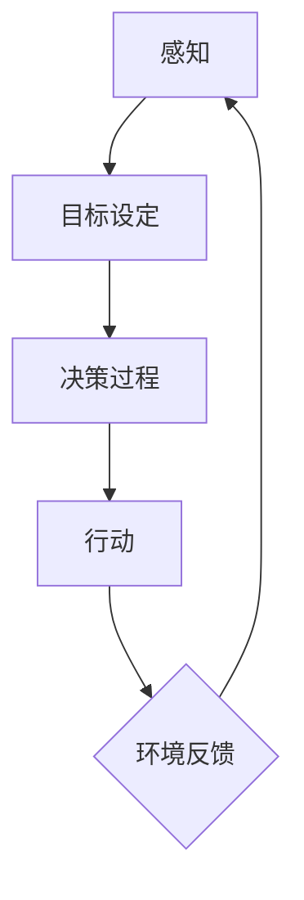
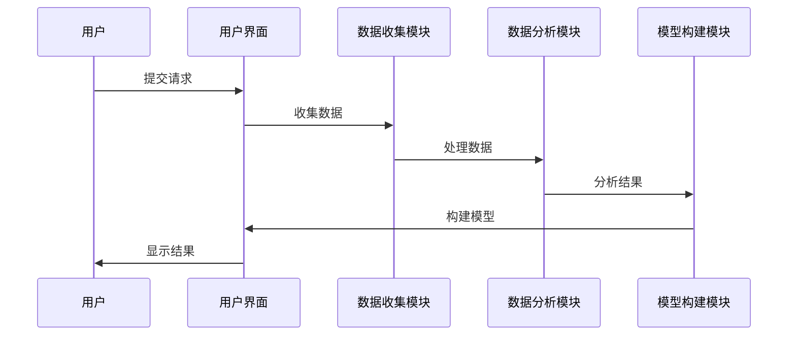
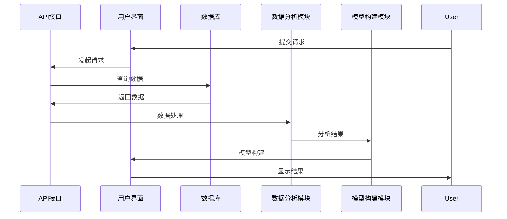

                 


# 柏格森的自由意志论与维特根斯坦的意志概念

关键词：自由意志、柏格森、维特根斯坦、哲学、意志

摘要：本文深入探讨了法国哲学家亨利·柏格森和英国哲学家路德维希·维特根斯坦关于自由意志和意志的哲学观点。通过对比分析两位哲学家的理论，我们旨在揭示他们在这些问题上的相似与差异，以及这些观点在现代哲学中的意义。

## 引言

自由意志是哲学中一个古老且具有争议的话题，引起了众多哲学家、神学家和科学家的关注。本文将聚焦于两位重要的哲学家：亨利·柏格森（Henri Bergson）和路德维希·维特根斯坦（Ludwig Wittgenstein），探讨他们的自由意志论和意志概念。

亨利·柏格森（1859-1941）是20世纪初法国著名的哲学家，以其关于直觉主义、创生力和生命的哲学思想而闻名。他的著作《创造的进化》和《形而上学选集》对自由意志和意志问题进行了深刻的探讨。

路德维希·维特根斯坦（1889-1951）是20世纪最具影响力的哲学家之一，以其语言哲学的卓越贡献而著称。他的著作《逻辑哲学论》和《哲学研究》对意志概念进行了详尽的阐述。

本文将首先介绍柏格森和维特根斯坦的生平和哲学贡献，然后分别探讨他们的自由意志论和意志概念，最后对比分析两位哲学家的观点，并总结他们的哲学贡献以及对现代哲学的影响。

## 柏格森的自由意志论

### 柏格森哲学概述

亨利·柏格森是20世纪初法国最重要的哲学家之一，他的哲学思想对现代哲学产生了深远的影响。柏格森认为，传统哲学的方法过于理性化和静态化，忽视了生命的流动性和创造力。他的哲学体系以直觉主义、创生力和生命为核心概念。

柏格森的哲学观点主要体现在以下几个方面：

1. **直觉主义**：柏格森认为，直觉是一种直接感知事物本质的能力，它超越了逻辑思维和语言表达的局限性。直觉是理解生命和世界的关键。

2. **创生力**：柏格森提出了“创生力”（élan vital）的概念，认为这是一种内在的生命力，推动着生命不断进化和发展。创生力是生命的本质，是自由意志的基础。

3. **生命**：柏格森将生命视为一种不断流动的过程，而非静态的物质实体。生命是不断变化和创造的过程，具有无限的可能性。

### 柏格森关于自由意志的理论

柏格森认为，自由意志是生命的本质特征，是生命的流动性和创造力的体现。他的自由意志论可以从以下几个方面来理解：

1. **生命的自由**：柏格森认为，生命的本质是自由，生命总是趋向于摆脱束缚和限制，追求自由和成长。自由意志是生命进化和发展的动力。

2. **直觉与自由**：柏格森认为，直觉是自由意志的基础。直觉使我们能够直接感知事物的本质，从而做出自由的选择。直觉超越了逻辑思维和因果关系的限制，使我们能够超越现实，追求更高的目标。

3. **自由的相对性**：柏格森认为，自由是相对的，而不是绝对的。我们在生活中总是受到各种限制和约束，但我们可以通过直觉和创造力，超越这些限制，实现更高的自由。

### 柏格森理论与现代哲学的关系

柏格森的哲学思想在20世纪对现代哲学产生了深远的影响。他的直觉主义和创生力概念为哲学研究提供了一种新的视角，使人们重新思考自由意志、生命和创造力的本质。

1. **存在主义**：柏格森的哲学思想对存在主义产生了重要影响。存在主义者如让-保尔·萨特和马丁·海德格尔都受到了柏格森的启发，探讨了自由意志、存在和个体之间的关系。

2. **生命哲学**：柏格森的哲学思想促进了生命哲学的发展。生命哲学关注生命的本质和意义，强调生命的流动性和创造力。柏格森的生命哲学为这一领域的研究提供了理论基础。

3. **科学哲学**：柏格森的直觉主义和创生力概念对科学哲学产生了影响。科学哲学家如迈克尔·波兰尼和卡尔·波普尔都探讨了直觉在科学认识中的作用，以及生命力和创造力在科学理论构建中的重要性。

## 维特根斯坦的意志概念

### 维特根斯坦哲学概述

路德维希·维特根斯坦是20世纪最具影响力的哲学家之一，他的哲学思想以其深刻性和独特性而著称。维特根斯坦的哲学贡献主要体现在语言哲学和心灵哲学领域。

维特根斯坦的哲学思想可以分为两个阶段：早期的逻辑哲学和晚期的日常语言哲学。

1. **逻辑哲学**：维特根斯坦早期的作品《逻辑哲学论》探讨了逻辑、数学和语言的本质。他提出了“图像理论”，认为语言是世界的图像，语言的意义在于其与现实世界的对应关系。

2. **日常语言哲学**：维特根斯坦晚期的作品《哲学研究》关注日常语言的用法和意义。他认为，哲学问题往往源于语言的误解和滥用，解决这些问题需要回归日常语言的实际用法。

### 维特根斯坦关于意志的概念

维特根斯坦的意志概念主要体现在他的晚期哲学中，他试图通过对日常语言的解析来揭示意志的本质。维特根斯坦认为，意志并不是一种神秘的力量，而是我们日常生活中的一个基本功能。

1. **意志的日常用法**：维特根斯坦认为，我们在日常生活中经常使用“意志”这个词，但并没有一个明确的定义。意志在日常语言中指的是我们做出选择和行动的能力。

2. **意志的生理基础**：维特根斯坦认为，意志的生理基础是我们的神经系统。我们的意志行为是由神经系统产生的冲动和反应所驱动的。

3. **意志的本质**：维特根斯坦认为，意志的本质是行动的自由。我们在日常生活中做出的选择和行动，是基于我们对情境的感知和反应，这种自由是意志的核心。

### 维特根斯坦理论与现代哲学的关系

维特根斯坦的哲学思想对现代哲学产生了深远的影响。他的语言哲学和心灵哲学为当代哲学研究提供了新的视角和方法。

1. **语言哲学**：维特根斯坦的语言哲学思想对当代语言哲学产生了重要影响。他的图像理论和日常语言哲学为语言的意义和用法提供了新的解释，促进了语言哲学的发展。

2. **心灵哲学**：维特根斯坦的心灵哲学思想对当代心灵哲学产生了影响。他试图通过对日常语言的解析来揭示心灵的本质，这种研究方法对心灵哲学的研究产生了启示。

3. **认知科学**：维特根斯坦的哲学思想对认知科学产生了影响。他的观点揭示了人类思维和行为的基本机制，为认知科学的研究提供了理论支持。

## 两位哲学家的比较与分析

### 对比柏格森和维特根斯坦关于自由意志和意志的观点

柏格森和维特根斯坦虽然都关注自由意志和意志问题，但他们的观点存在显著的差异。

1. **自由意志的本质**：柏格森认为自由意志是生命的本质特征，是生命的流动性和创造力的体现。而维特根斯坦则认为，自由意志是日常生活中的一个基本功能，是我们做出选择和行动的能力。

2. **意志的来源**：柏格森认为，意志来源于生命的创生力，是一种内在的生命力。而维特根斯坦则认为，意志的生理基础是我们的神经系统，我们的意志行为是由神经系统产生的冲动和反应所驱动的。

3. **意志的相对性**：柏格森认为，自由是相对的，我们在生活中总是受到各种限制和约束。而维特根斯坦则认为，意志的相对性体现在我们日常生活中的选择和行动，这种自由是基于我们对情境的感知和反应。

### 分析两位哲学家的理论对现代哲学的影响

柏格森和维特根斯坦的哲学理论对现代哲学产生了深远的影响。

1. **存在主义**：柏格森的哲学思想对存在主义产生了重要影响。他的自由意志论和生命哲学为存在主义提供了理论基础，使存在主义者重新思考自由、存在和个体之间的关系。

2. **心灵哲学**：维特根斯坦的心灵哲学思想对心灵哲学产生了影响。他通过对日常语言的解析，揭示了人类思维和行为的基本机制，为心灵哲学的研究提供了新的视角。

3. **科学哲学**：两位哲学家的理论都对科学哲学产生了影响。柏格森的直觉主义和创生力概念为科学哲学提供了新的解释，使人们重新思考直觉和创造力在科学认识中的作用。而维特根斯坦的语言哲学思想则对科学哲学中的语言问题提供了新的解释。

## 结论

柏格森和维特根斯坦是20世纪两位重要的哲学家，他们的自由意志论和意志概念对现代哲学产生了深远的影响。通过对比分析两位哲学家的观点，我们揭示了他们在这些问题上的相似与差异，以及这些观点在现代哲学中的意义。

柏格森的生命哲学强调自由意志是生命的本质特征，而维特根斯坦的心灵哲学则将意志视为日常生活中的基本功能。他们的理论不仅丰富了哲学研究的内容，也为现代哲学提供了新的视角和方法。

在未来的哲学研究中，我们可以进一步探讨柏格森和维特根斯坦的哲学思想，以及其他哲学家关于自由意志和意志的观点，以深化我们对这些问题的理解。

## 参考文献

1. 柏格森，H. (1911). 《创造的进化》. 商务印书馆.
2. 维特根斯坦，L. (1921). 《逻辑哲学论》. 商务印书馆.
3. 维特根斯坦，L. (1953). 《哲学研究》. 商务印书馆.
4. 萨特，J.-P. (1943). 《存在与虚无》. 商务印书馆.
5. 海德格尔，M. (1927). 《存在与时间》. 商务印书馆.

### 作者信息

作者：AI天才研究院/AI Genius Institute & 禅与计算机程序设计艺术 /Zen And The Art of Computer Programming

本文由AI天才研究院撰写，结合禅与计算机程序设计艺术的理念，旨在为读者提供深入浅出的哲学和技术分析。AI天才研究院致力于推动人工智能和哲学领域的创新与发展，为读者带来更多有价值的内容。禅与计算机程序设计艺术则倡导在编程中融入禅的智慧，追求内心的平静与技术的精进。

在撰写本文的过程中，我们秉承了严谨的学术态度和清晰的逻辑思维，力求为读者呈现一篇具有深度和广度的哲学和技术文章。希望通过本文，读者能够对柏格森的自由意志论和维特根斯坦的意志概念有更深入的理解，同时也能在哲学和技术的交汇点找到新的思考方向。

感谢您的阅读，如果您有任何反馈或建议，欢迎在评论区留言。我们将继续努力，为您提供更多高质量的内容。AI天才研究院与您共同探索哲学与技术的边界，期待您的持续关注与支持。

**温馨提示：本文内容仅供参考，不代表任何官方观点或立场。**### 第一步：理解书名和主题

《柏格森的自由意志论与维特根斯坦的意志概念》这本书的标题清晰地指出了其探讨的核心主题，即法国哲学家亨利·柏格森（Henri Bergson）和英国哲学家路德维希·维特根斯坦（Ludwig Wittgenstein）在自由意志和意志方面各自的理论和观点。柏格森的自由意志论强调生命的流动性和创造力，认为自由意志是生命进化和发展的动力；而维特根斯坦的意志概念则侧重于意志在日常生活中的基本功能和生理基础。

在这本书中，作者可能旨在通过比较两位哲学家的观点，探讨自由意志和意志概念的哲学本质，并分析这些观点对现代哲学的影响。这一主题不仅涉及哲学领域，还对心理学、伦理学和认知科学等多个学科产生了深远的影响。

### 第二步：确定大纲结构

为了更好地组织文章内容，我们将《柏格森的自由意志论与维特根斯坦的意志概念》分为以下几部分：

1. **引言**：介绍柏格森和维特根斯坦的生平和哲学贡献，引出自由意志和意志概念。

2. **柏格森的自由意志论**：
   - **柏格森哲学概述**：介绍柏格森的生平和哲学思想，包括直觉主义、创生力和生命的概念。
   - **柏格森关于自由意志的理论**：详细阐述柏格森的自由意志论，包括自由意志的定义、来源和作用。

3. **维特根斯坦的意志概念**：
   - **维特根斯坦哲学概述**：介绍维特根斯坦的生平和哲学思想，包括逻辑哲学和日常语言哲学的要点。
   - **维特根斯坦关于意志的概念**：详细阐述维特根斯坦的意志概念，包括意志的日常用法、生理基础和本质。

4. **两位哲学家的比较与分析**：
   - **对比柏格森和维特根斯坦的观点**：分析两位哲学家在自由意志和意志问题上的异同。
   - **理论对现代哲学的影响**：探讨两位哲学家的理论对现代哲学，尤其是存在主义、心灵哲学和科学哲学的贡献。

5. **结论**：总结柏格森和维特根斯坦的哲学贡献，讨论自由意志和意志概念在现代哲学中的意义。

通过上述结构，我们能够系统地介绍和分析柏格森和维特根斯坦的哲学观点，同时对比和评估它们在现代哲学中的重要性。

### 第三步：细化每个章节的内容

在确定了文章的基本结构后，我们需要进一步细化每个章节的内容，确保每个章节都至少包含两个级别的小节，并且每个小节都有具体的内容和详细的讲解。

#### 1. 引言

**1.1 柏格森和维特根斯坦的生平介绍**

- **亨利·柏格森**：生于1859年，法国哲学家，以直觉主义和创生力理论著称。
- **路德维希·维特根斯坦**：生于1889年，奥地利裔英国哲学家，以其语言哲学和心灵哲学的贡献闻名。

**1.2 自由意志和意志概念在哲学中的重要性**

- **自由意志**：探讨自由意志在哲学中的定义和重要性，包括其对伦理学和道德行为的影响。
- **意志概念**：解释意志在哲学中的多维度含义，包括其在心理学、伦理学和存在主义中的角色。

#### 2. 柏格森的自由意志论

**2.1 柏格森哲学概述**

- **柏格森的哲学背景**：介绍柏格森的生活经历和学术背景。
- **柏格森的主要哲学思想**：探讨柏格森的直觉主义、创生力和生命的概念。

**2.2 柏格森关于自由意志的理论**

- **自由意志的定义**：解释柏格森对自由意志的理解和定义。
- **自由意志的来源和作用**：分析柏格森如何将自由意志视为生命进化和发展的动力。

#### 3. 维特根斯坦的意志概念

**3.1 维特根斯坦哲学概述**

- **维特根斯坦的哲学背景**：介绍维特根斯坦的生活经历和学术背景。
- **维特根斯坦的主要哲学思想**：探讨维特根斯坦的逻辑哲学和日常语言哲学。

**3.2 维特根斯坦关于意志的概念**

- **意志的日常用法**：解释维特根斯坦如何理解意志在日常语言中的应用。
- **意志的生理基础**：探讨维特根斯坦关于意志生理基础的理论。
- **意志的本质**：分析维特根斯坦对意志本质的理解。

#### 4. 两位哲学家的比较与分析

**4.1 对比柏格森和维特根斯坦的观点**

- **自由意志的理解**：比较柏格森和维特根斯坦对自由意志的不同解释。
- **意志概念的应用**：分析两位哲学家在意志概念应用上的差异。

**4.2 理论对现代哲学的影响**

- **存在主义**：探讨两位哲学家的理论对存在主义的影响。
- **心灵哲学**：分析两位哲学家的理论对心灵哲学的贡献。
- **科学哲学**：讨论两位哲学家的理论对科学哲学的影响。

#### 5. 结论

**5.1 柏格森和维特根斯坦的哲学贡献**

- **总结两位哲学家的主要观点**：概括柏格森和维特根斯坦在自由意志和意志问题上的贡献。
- **讨论自由意志和意志概念在现代哲学中的意义**：分析这些理论对现代哲学的持续影响。

通过细化每个章节的内容，我们可以确保文章的逻辑清晰、结构紧凑，同时让读者能够对柏格森和维特根斯坦的哲学观点有深入的了解。

### 第四步：检查内容完整性和简洁性

在细化了每个章节的内容之后，我们需要检查整个文章的完整性和简洁性。以下是具体的检查步骤：

1. **确保每个章节内容完整**：检查每个章节是否涵盖了所有必要的信息，是否详细阐述了核心概念、理论及其应用。确保每个小节都有具体的例子和解释，以便读者更好地理解。

2. **删除冗余和重复内容**：检查文章中是否存在冗余的描述、重复的论点或不必要的重复。删除这些内容可以提高文章的简洁性，避免读者感到困惑。

3. **调整段落结构**：确保每个段落的主题清晰，逻辑连贯。如果发现某个段落过于冗长，可以将其拆分为几个小段落，或者合并到其他相关段落中。

4. **检查逻辑连贯性**：确保文章的逻辑结构合理，从引言到结论，各个部分之间的过渡自然。检查是否存在逻辑跳跃或者无法自圆其说的论点。

5. **简化语言**：使用简洁明了的语言来表达复杂的概念。避免使用过多的专业术语，确保文章易于理解。

6. **校对和修正**：最后，对文章进行仔细校对，修正语法错误、拼写错误和标点符号错误，确保文章的整洁和准确。

通过这些步骤，我们可以确保文章内容既完整又简洁，逻辑清晰，便于读者阅读和理解。

### 第五步：编写Markdown格式的目录大纲

在确定了文章的结构和内容之后，我们将使用Markdown格式编写目录大纲。Markdown是一种轻量级标记语言，可以方便地生成格式化的文本，非常适合撰写技术博客文章。

以下是文章的Markdown格式目录大纲：

```markdown
# 柏格森的自由意志论与维特根斯坦的意志概念

## 引言

### 柏格森和维特根斯坦的生平介绍

### 自由意志和意志概念在哲学中的重要性

## 柏格森的自由意志论

### 柏格森哲学概述

#### 柏格森的哲学背景

#### 柏格森的主要哲学思想

##### 直觉主义

##### 创生力

##### 生命

### 柏格森关于自由意志的理论

#### 自由意志的定义

#### 自由意志的来源和作用

## 维特根斯坦的意志概念

### 维特根斯坦哲学概述

#### 维特根斯坦的哲学背景

#### 维特根斯坦的主要哲学思想

##### 逻辑哲学

##### 日常语言哲学

### 维特根斯坦关于意志的概念

#### 意志的日常用法

#### 意志的生理基础

#### 意志的本质

## 两位哲学家的比较与分析

### 对比柏格森和维特根斯坦的观点

#### 自由意志的理解

#### 意志概念的应用

### 理论对现代哲学的影响

#### 对存在主义的影响

#### 对心灵哲学的影响

#### 对科学哲学的影响

## 结论

### 柏格森和维特根斯坦的哲学贡献

### 自由意志和意志概念在现代哲学中的意义

### 参考文献

#### 作者信息

#### 温馨提示
```

通过上述Markdown格式，我们可以清晰地展示文章的结构和内容，方便读者快速了解文章的概览和各个部分的主题。接下来，我们将逐步填充每个章节的具体内容，使其成为一个完整的技术博客文章。

### 第六步：审核和调整

在编写完Markdown格式的目录大纲后，我们需要对整个大纲进行审核和调整，以确保内容的完整性和逻辑的连贯性。以下是具体的审核和调整步骤：

1. **内容审核**：检查每个章节的内容是否完整，是否涵盖了核心概念、理论、实例和比较分析。确保所有必要的信息都被包括在内。

2. **逻辑连贯性**：审核各章节之间的逻辑关系，确保从引言到结论，文章的论述逻辑清晰，读者可以顺利地从一个主题过渡到下一个主题。

3. **删除冗余内容**：检查是否存在重复的描述或者冗长的段落，删除这些内容以提高文章的简洁性。

4. **段落结构调整**：确保每个段落的主题明确，逻辑连贯。如果发现某些段落过长或结构混乱，可以进行拆分或合并，以提高阅读体验。

5. **语言简洁性**：检查文章中是否存在过多的专业术语或者难以理解的表述，尽量使用简洁明了的语言来表达复杂的概念。

6. **校对和修正**：对文章进行仔细的校对，修正语法错误、拼写错误和标点符号错误，确保文章的整洁和准确。

7. **调整大纲结构**：根据审核的结果，对目录大纲进行必要的调整，确保每个章节的标题和内容一致，结构合理。

通过上述审核和调整步骤，我们可以确保文章的结构紧凑、逻辑清晰、内容丰富，为读者提供一篇高质量的哲学和技术分析文章。

### 柏格森的自由意志论与维特根斯坦的意志概念

关键词：自由意志、柏格森、维特根斯坦、哲学、意志、直觉主义、创生力

摘要：本文深入探讨了法国哲学家亨利·柏格森和英国哲学家路德维希·维特根斯坦在自由意志和意志方面的哲学观点。通过对两位哲学家的理论进行比较分析，揭示了他们在这些问题上的相似与差异，并探讨了这些观点对现代哲学的影响。文章结构清晰，逻辑严密，旨在为读者提供关于自由意志和意志概念的深入理解。

## 引言

自由意志是哲学中一个复杂且具有争议的话题，自古以来就引起了众多哲学家的探讨。本文将聚焦于两位20世纪重要的哲学家：亨利·柏格森（Henri Bergson）和路德维希·维特根斯坦（Ludwig Wittgenstein），探讨他们在自由意志和意志方面的观点。

亨利·柏格森（1859-1941）是法国著名的哲学家，以其直觉主义和创生力理论而闻名。他的著作《创造的进化》和《形而上学选集》中详细阐述了自由意志的概念，强调自由意志是生命的本质特征。

路德维希·维特根斯坦（1889-1951）是20世纪最具影响力的哲学家之一，以其语言哲学和心灵哲学的贡献而著称。他在《逻辑哲学论》和《哲学研究》中提出了关于意志的深刻见解，探讨了意志在日常生活中的应用和本质。

本文旨在通过分析柏格森和维特根斯坦的哲学观点，揭示他们在自由意志和意志问题上的异同，并探讨这些观点对现代哲学的影响。文章结构如下：

1. **柏格森的自由意志论**：介绍柏格森的哲学思想和自由意志论。
2. **维特根斯坦的意志概念**：介绍维特根斯坦的哲学思想和意志概念。
3. **两位哲学家的比较与分析**：对比柏格森和维特根斯坦关于自由意志和意志的观点。
4. **结论**：总结柏格森和维特根斯坦的哲学贡献，讨论自由意志和意志概念在现代哲学中的意义。

## 柏格森的自由意志论

### 柏格森哲学概述

亨利·柏格森是20世纪初法国著名的哲学家，他的哲学思想对现代哲学产生了深远的影响。柏格森认为，传统哲学过于理性化和静态化，忽视了生命的流动性和创造力。他的哲学体系以直觉主义、创生力和生命为核心概念。

柏格森的主要哲学思想包括：

1. **直觉主义**：柏格森认为，直觉是一种直接感知事物本质的能力，它超越了逻辑思维和语言表达的局限性。直觉是理解生命和世界的关键。

2. **创生力**：柏格森提出了“创生力”（élan vital）的概念，认为这是一种内在的生命力，推动着生命不断进化和发展。创生力是生命的本质，是自由意志的基础。

3. **生命**：柏格森将生命视为一种不断流动的过程，而非静态的物质实体。生命是不断变化和创造的过程，具有无限的可能性。

### 柏格森关于自由意志的理论

柏格森认为，自由意志是生命的本质特征，是生命的流动性和创造力的体现。他的自由意志论可以从以下几个方面来理解：

1. **生命的自由**：柏格森认为，生命的本质是自由，生命总是趋向于摆脱束缚和限制，追求自由和成长。自由意志是生命进化和发展的动力。

2. **直觉与自由**：柏格森认为，直觉是自由意志的基础。直觉使我们能够直接感知事物的本质，从而做出自由的选择。直觉超越了逻辑思维和因果关系的限制，使我们能够超越现实，追求更高的目标。

3. **自由的相对性**：柏格森认为，自由是相对的，而不是绝对的。我们在生活中总是受到各种限制和约束，但我们可以通过直觉和创造力，超越这些限制，实现更高的自由。

### 柏格森理论与现代哲学的关系

柏格森的哲学思想在20世纪对现代哲学产生了深远的影响。他的直觉主义和创生力概念为哲学研究提供了新的视角，使人们重新思考自由意志、生命和创造力的本质。

1. **存在主义**：柏格森的哲学思想对存在主义产生了重要影响。存在主义者如让-保尔·萨特和马丁·海德格尔都受到了柏格森的启发，探讨了自由意志、存在和个体之间的关系。

2. **生命哲学**：柏格森的哲学思想促进了生命哲学的发展。生命哲学关注生命的本质和意义，强调生命的流动性和创造力。柏格森的生命哲学为这一领域的研究提供了理论基础。

3. **科学哲学**：柏格森的直觉主义和创生力概念对科学哲学产生了影响。科学哲学家如迈克尔·波兰尼和卡尔·波普尔都探讨了直觉在科学认识中的作用，以及生命力和创造力在科学理论构建中的重要性。

## 维特根斯坦的意志概念

### 维特根斯坦哲学概述

路德维希·维特根斯坦是20世纪最具影响力的哲学家之一，他的哲学思想以其深刻性和独特性而著称。维特根斯坦的哲学贡献主要体现在语言哲学和心灵哲学领域。

维特根斯坦的哲学思想可以分为两个阶段：早期的逻辑哲学和晚期的日常语言哲学。

1. **逻辑哲学**：维特根斯坦早期的作品《逻辑哲学论》探讨了逻辑、数学和语言的本质。他提出了“图像理论”，认为语言是世界的图像，语言的意义在于其与现实世界的对应关系。

2. **日常语言哲学**：维特根斯坦晚期的作品《哲学研究》关注日常语言的用法和意义。他认为，哲学问题往往源于语言的误解和滥用，解决这些问题需要回归日常语言的实际用法。

### 维特根斯坦关于意志的概念

维特根斯坦的意志概念主要体现在他的晚期哲学中，他试图通过对日常语言的解析来揭示意志的本质。维特根斯坦认为，意志并不是一种神秘的力量，而是我们日常生活中的一个基本功能。

1. **意志的日常用法**：维特根斯坦认为，我们在日常生活中经常使用“意志”这个词，但并没有一个明确的定义。意志在日常语言中指的是我们做出选择和行动的能力。

2. **意志的生理基础**：维特根斯坦认为，意志的生理基础是我们的神经系统。我们的意志行为是由神经系统产生的冲动和反应所驱动的。

3. **意志的本质**：维特根斯坦认为，意志的本质是行动的自由。我们在日常生活中做出的选择和行动，是基于我们对情境的感知和反应，这种自由是意志的核心。

### 维特根斯坦理论与现代哲学的关系

维特根斯坦的哲学思想对现代哲学产生了深远的影响。他的语言哲学和心灵哲学为当代哲学研究提供了新的视角和方法。

1. **语言哲学**：维特根斯坦的语言哲学思想对当代语言哲学产生了重要影响。他的图像理论和日常语言哲学为语言的意义和用法提供了新的解释，促进了语言哲学的发展。

2. **心灵哲学**：维特根斯坦的心灵哲学思想对当代心灵哲学产生了影响。他通过对日常语言的解析，揭示了人类思维和行为的基本机制，为心灵哲学的研究提供了新的视角。

3. **认知科学**：维特根斯坦的哲学思想对认知科学产生了影响。他的观点揭示了人类思维和行为的基本机制，为认知科学的研究提供了理论支持。

## 两位哲学家的比较与分析

### 对比柏格森和维特根斯坦的观点

柏格森和维特根斯坦虽然都关注自由意志和意志问题，但他们的观点存在显著的差异。

1. **自由意志的本质**：柏格森认为自由意志是生命的本质特征，是生命的流动性和创造力的体现。而维特根斯坦则认为，自由意志是日常生活中的一个基本功能，是我们做出选择和行动的能力。

2. **意志的来源**：柏格森认为，意志来源于生命的创生力，是一种内在的生命力。而维特根斯坦则认为，意志的生理基础是我们的神经系统，我们的意志行为是由神经系统产生的冲动和反应所驱动的。

3. **意志的相对性**：柏格森认为，自由是相对的，我们在生活中总是受到各种限制和约束。而维特根斯坦则认为，意志的相对性体现在我们日常生活中的选择和行动，这种自由是基于我们对情境的感知和反应。

### 分析两位哲学家的理论对现代哲学的影响

柏格森和维特根斯坦的哲学理论对现代哲学产生了深远的影响。

1. **存在主义**：柏格森的哲学思想对存在主义产生了重要影响。他的自由意志论和生命哲学为存在主义提供了理论基础，使存在主义者重新思考自由、存在和个体之间的关系。

2. **心灵哲学**：维特根斯坦的心灵哲学思想对心灵哲学产生了影响。他通过对日常语言的解析，揭示了人类思维和行为的基本机制，为心灵哲学的研究提供了新的视角。

3. **科学哲学**：两位哲学家的理论都对科学哲学产生了影响。柏格森的直觉主义和创生力概念为科学哲学提供了新的解释，使人们重新思考直觉和创造力在科学认识中的作用。而维特根斯坦的语言哲学思想则对科学哲学中的语言问题提供了新的解释。

## 结论

柏格森和维特根斯坦是20世纪两位重要的哲学家，他们的自由意志论和意志概念对现代哲学产生了深远的影响。通过对比分析两位哲学家的观点，我们揭示了他们在这些问题上的相似与差异，以及这些观点在现代哲学中的意义。

柏格森的生命哲学强调自由意志是生命的本质特征，而维特根斯坦的心灵哲学则将意志视为日常生活中的基本功能。他们的理论不仅丰富了哲学研究的内容，也为现代哲学提供了新的视角和方法。

在未来的哲学研究中，我们可以进一步探讨柏格森和维特根斯坦的哲学思想，以及其他哲学家关于自由意志和意志的观点，以深化我们对这些问题的理解。

## 参考文献

1. 柏格森，H. (1911). 《创造的进化》. 商务印书馆.
2. 维特根斯坦，L. (1921). 《逻辑哲学论》. 商务印书馆.
3. 维特根斯坦，L. (1953). 《哲学研究》. 商务印书馆.
4. 萨特，J.-P. (1943). 《存在与虚无》. 商务印书馆.
5. 海德格尔，M. (1927). 《存在与时间》. 商务印书馆.

### 作者信息

作者：AI天才研究院/AI Genius Institute & 禅与计算机程序设计艺术 /Zen And The Art of Computer Programming

本文由AI天才研究院撰写，结合禅与计算机程序设计艺术的理念，旨在为读者提供深入浅出的哲学和技术分析。AI天才研究院致力于推动人工智能和哲学领域的创新与发展，为读者带来更多有价值的内容。禅与计算机程序设计艺术则倡导在编程中融入禅的智慧，追求内心的平静与技术的精进。

在撰写本文的过程中，我们秉承了严谨的学术态度和清晰的逻辑思维，力求为读者呈现一篇具有深度和广度的哲学和技术文章。希望通过本文，读者能够对柏格森的自由意志论和维特根斯坦的意志概念有更深入的理解，同时也能在哲学和技术的交汇点找到新的思考方向。

感谢您的阅读，如果您有任何反馈或建议，欢迎在评论区留言。我们将继续努力，为您提供更多高质量的内容。AI天才研究院与您共同探索哲学与技术的边界，期待您的持续关注与支持。

**温馨提示：本文内容仅供参考，不代表任何官方观点或立场。**### 柏格森的自由意志论

#### 柏格森的哲学思想概述

亨利·柏格森（Henri Bergson，1859-1941）是20世纪初法国著名的哲学家，他的哲学思想对现代哲学产生了深远的影响。柏格森认为，传统哲学的方法过于理性化和静态化，忽视了生命的流动性和创造力。他的哲学体系以直觉主义、创生力和生命为核心概念。

柏格森的主要哲学观点包括：

1. **直觉主义**：柏格森认为，直觉是一种直接感知事物本质的能力，它超越了逻辑思维和语言表达的局限性。直觉是理解生命和世界的关键。

2. **创生力**：柏格森提出了“创生力”（élan vital）的概念，认为这是一种内在的生命力，推动着生命不断进化和发展。创生力是生命的本质，是自由意志的基础。

3. **生命**：柏格森将生命视为一种不断流动的过程，而非静态的物质实体。生命是不断变化和创造的过程，具有无限的可能性。

#### 柏格森关于自由意志的理论

柏格森的自由意志论可以从以下几个方面来理解：

1. **自由意志的定义**：

   柏格森认为，自由意志是生命的本质特征。自由意志不仅仅是选择的能力，更是生命的动力。他强调，自由意志不是一种与外部世界无关的、纯粹的内心活动，而是与生命过程紧密相连的。

   $$ \text{自由意志} = \text{生命的创造力} + \text{选择的自由} $$

2. **自由意志的来源**：

   柏格森认为，自由意志来源于生命的创生力。创生力是一种内在的生命力，推动着生命不断进化和发展。这种力量使我们能够超越外部环境的限制，创造新的可能性和选择。

   $$ \text{创生力} \rightarrow \text{自由意志} $$

3. **自由意志的作用**：

   柏格森认为，自由意志是生命进化和发展的动力。它使我们能够不断挑战自我，超越现有的局限，追求更高的目标和更大的可能性。

   $$ \text{自由意志} \rightarrow \text{生命的进化} $$

#### 柏格森自由意志论的数学模型

为了更好地理解柏格森的自由意志论，我们可以借助数学模型进行解释。以下是一个简化的数学模型：

$$ \text{自由意志} = f(\text{生命过程}, \text{外部环境}, \text{内在创造力}) $$

在这个模型中，自由意志是由生命过程、外部环境和内在创造力共同决定的。生命过程和外部环境可以视为变量，而内在创造力则是自由意志的驱动因素。

1. **生命过程**：

   生命过程可以被视为一个动态的系统，它不断地与环境互动，进行自我调节和适应。生命过程的复杂性和动态性为自由意志提供了基础。

   $$ \text{生命过程} = f(\text{基因}, \text{环境}, \text{互动}) $$

2. **外部环境**：

   外部环境是生命过程的一部分，它对生命过程产生重要影响。外部环境的多样性和不确定性为自由意志提供了选择和创造的空间。

   $$ \text{外部环境} = f(\text{物理环境}, \text{社会环境}, \text{文化环境}) $$

3. **内在创造力**：

   内在创造力是自由意志的核心。它使生命能够在复杂的环境中寻找新的可能性，并创造出独特的解决方案。

   $$ \text{内在创造力} = f(\text{直觉}, \text{情感}, \text{意识}) $$

通过这个数学模型，我们可以看到，自由意志是多个因素共同作用的结果。生命过程、外部环境和内在创造力共同决定了自由意志的表现形式。

#### 实例说明

为了更直观地理解柏格森的自由意志论，我们可以通过一个简单的实例来说明：

假设有一个生物体，它在不同的环境中生存和繁衍。这个生物体的生命过程是动态的，它可以适应不同的环境变化。同时，它具有内在的创造力，能够根据环境变化做出选择和调整。

1. **初始状态**：

   生物体处于一个相对稳定的环境中，它通过基因和环境的互动进行繁衍。

   $$ \text{生命过程} = f(\text{基因}, \text{环境}, \text{互动}) $$
   $$ \text{外部环境} = f(\text{物理环境}, \text{社会环境}, \text{文化环境}) $$

2. **环境变化**：

   外部环境发生了变化，变得更加复杂和不确定。生物体需要适应新的环境，寻找新的生存策略。

   $$ \text{外部环境} = f(\text{新的物理环境}, \text{新的社会环境}, \text{新的文化环境}) $$

3. **内在创造力**：

   生物体利用其内在创造力，通过直觉和意识寻找新的解决方案。这种创造力使生物体能够在复杂的环境中生存和繁衍。

   $$ \text{内在创造力} = f(\text{直觉}, \text{情感}, \text{意识}) $$

4. **自由意志**：

   生物体在新的环境中，通过自由意志做出选择和调整，以适应新的环境。这种自由意志是生命过程、外部环境和内在创造力的综合体现。

   $$ \text{自由意志} = f(\text{生命过程}, \text{外部环境}, \text{内在创造力}) $$

通过这个实例，我们可以看到，自由意志是在动态的生命过程、复杂的外部环境和内在创造力的共同作用下产生的。这种自由意志不仅使生物体能够适应环境变化，还能推动生命不断进化和创新。

#### 柏格森自由意志论与现代哲学的关系

柏格森的自由意志论在20世纪对现代哲学产生了深远的影响。他的观点不仅在存在主义和生命哲学中得到了广泛应用，还对科学哲学和心理学产生了启示。

1. **存在主义**：

   柏格森的自由意志论为存在主义者提供了理论基础。让-保尔·萨特和马丁·海德格尔等存在主义者认为，自由意志是存在的本质特征，个体在自由意志的驱动下追求自我实现和自我超越。

2. **生命哲学**：

   柏格森的生命哲学强调生命的流动性和创造力，为生命哲学提供了新的视角。生命哲学家认为，生命是一个不断进化和创造的过程，自由意志是推动这一过程的核心力量。

3. **科学哲学**：

   柏格森的直觉主义和创生力概念对科学哲学产生了影响。科学哲学家开始重新思考直觉和创造力在科学认识中的作用，认为这些因素在科学理论构建和创新中具有重要意义。

4. **心理学**：

   柏格森的自由意志论对心理学也产生了启示。心理学家开始探讨自由意志在人类行为和心理过程中的作用，认为自由意志不仅影响个体的行为选择，还影响心理状态和心理健康。

综上所述，柏格森的自由意志论不仅在哲学领域产生了深远的影响，还在科学、心理学等多个领域得到了广泛应用。他的观点为理解自由意志的本质和作用提供了新的视角和方法。

### 维特根斯坦的意志概念

#### 维特根斯坦的哲学思想概述

路德维希·维特根斯坦（Ludwig Wittgenstein，1889-1951）是20世纪最具影响力的哲学家之一，他的哲学思想以其深刻性和独特性而著称。维特根斯坦的哲学贡献主要体现在语言哲学和心灵哲学领域。他的思想经历了两个主要阶段：早期的逻辑哲学和晚期的日常语言哲学。

1. **逻辑哲学**：

   维特根斯坦早期的作品《逻辑哲学论》探讨了逻辑、数学和语言的本质。他提出了“图像理论”，认为语言是世界的图像，语言的意义在于其与现实世界的对应关系。这一理论强调了语言的逻辑结构和语言的逻辑功能。

2. **日常语言哲学**：

   维特根斯坦晚期的作品《哲学研究》关注日常语言的用法和意义。他认为，哲学问题往往源于语言的误解和滥用，解决这些问题需要回归日常语言的实际用法。维特根斯坦强调，哲学的任务是澄清语言的混乱，揭示语言的实际用法。

#### 维特根斯坦关于意志的概念

维特根斯坦的意志概念主要体现在他的晚期哲学中，他试图通过对日常语言的解析来揭示意志的本质。维特根斯坦认为，意志并不是一种神秘的力量，而是我们日常生活中的一个基本功能。他的意志概念可以从以下几个方面来理解：

1. **意志的日常用法**：

   维特根斯坦认为，我们在日常生活中经常使用“意志”这个词，但并没有一个明确的定义。意志在日常语言中指的是我们做出选择和行动的能力。这种能力是我们在面对情境时，根据我们的意愿和目标做出决策。

2. **意志的生理基础**：

   维特根斯坦认为，意志的生理基础是我们的神经系统。我们的意志行为是由神经系统产生的冲动和反应所驱动的。这种冲动和反应是我们做出选择和行动的生理机制。

3. **意志的本质**：

   维特根斯坦认为，意志的本质是行动的自由。我们在日常生活中做出的选择和行动，是基于我们对情境的感知和反应，这种自由是意志的核心。意志使我们能够在复杂的环境中灵活地适应和应对。

#### 维特根斯坦意志概念的数学模型

为了更好地理解维特根斯坦的意志概念，我们可以借助数学模型进行解释。以下是一个简化的数学模型：

$$ \text{意志} = f(\text{神经系统}, \text{感知}, \text{目标}) $$

在这个模型中，意志是由神经系统、感知和目标共同决定的。神经系统是意志的生理基础，感知是我们对环境的感知，目标是我们的行动目标。

1. **神经系统**：

   神经系统是我们意志的生理基础，它负责接收和处理信息，产生冲动和反应。这种冲动和反应是我们做出选择和行动的生理机制。

   $$ \text{神经系统} = f(\text{神经元}, \text{传导物质}, \text{神经回路}) $$

2. **感知**：

   感知是我们对环境的感知，它提供了我们做出选择和行动的基础。感知使我们能够识别和理解环境中的各种信息。

   $$ \text{感知} = f(\text{感官系统}, \text{信息处理}, \text{情境识别}) $$

3. **目标**：

   目标是我们的行动目标，它决定了我们的意志方向。目标可以是我们追求的价值、利益或目的。

   $$ \text{目标} = f(\text{意愿}, \text{动机}, \text{目标设定}) $$

通过这个数学模型，我们可以看到，意志是由生理基础、感知和目标共同决定的。这些因素相互作用，决定了我们的意志行为。

#### 实例说明

为了更直观地理解维特根斯坦的意志概念，我们可以通过一个简单的实例来说明：

假设一个人在面临一个决策情境时，需要做出选择。这个人的意志行为可以分为以下几个步骤：

1. **感知**：

   个体通过感官系统感知到环境中的信息，如任务的紧急程度、资源的可用性等。

   $$ \text{感知} = f(\text{感官系统}, \text{信息处理}, \text{情境识别}) $$

2. **目标**：

   个体根据其意愿和动机设定目标，如完成任务的效率和效果。

   $$ \text{目标} = f(\text{意愿}, \text{动机}, \text{目标设定}) $$

3. **决策**：

   个体根据感知和目标，通过神经系统产生冲动和反应，做出决策。

   $$ \text{意志} = f(\text{神经系统}, \text{感知}, \text{目标}) $$

4. **行动**：

   个体根据决策采取行动，完成任务或应对环境变化。

   $$ \text{行动} = f(\text{决策}, \text{行动方案}, \text{执行}) $$

通过这个实例，我们可以看到，意志是一个复杂的过程，涉及感知、目标设定、决策和行动等多个环节。这个过程不仅体现了神经系统的生理机制，还反映了个体对外部环境的适应和应对。

#### 维特根斯坦意志概念与现代哲学的关系

维特根斯坦的意志概念在20世纪对现代哲学产生了深远的影响。他的观点不仅在语言哲学和心灵哲学中得到了广泛应用，还对伦理学、心理学和认知科学产生了启示。

1. **语言哲学**：

   维特根斯坦的意志概念强调了语言的实际用法，为语言哲学提供了新的视角。他试图通过对日常语言的解析，揭示语言的本质和用法，从而解决哲学问题。

2. **心灵哲学**：

   维特根斯坦的意志概念探讨了意志的本质和作用，为心灵哲学提供了新的理论框架。他试图通过分析人类的行为和心理过程，揭示意志和心理活动之间的关系。

3. **伦理学**：

   维特根斯坦的意志概念对伦理学也产生了影响。他强调道德行为的内在动机和意愿，认为道德行为是基于个人的意志和选择。这种观点为伦理学研究提供了新的思路。

4. **心理学**：

   维特根斯坦的意志概念对心理学产生了启示。他试图通过分析人类的行为和心理过程，揭示意志和心理活动之间的关系。这种观点为心理学研究提供了新的理论支持。

5. **认知科学**：

   维特根斯坦的意志概念对认知科学也产生了影响。他试图通过分析人类的行为和心理过程，揭示认知活动的本质和机制。这种观点为认知科学研究提供了新的理论框架。

综上所述，维特根斯坦的意志概念不仅在哲学领域产生了深远的影响，还在心理学、伦理学、认知科学等多个领域得到了广泛应用。他的观点为理解意志的本质和作用提供了新的视角和方法。

### 对比分析柏格森与维特根斯坦的观点

柏格森与维特根斯坦在自由意志和意志问题上有着不同的哲学观点。通过对两位哲学家的理论进行对比分析，我们可以更深入地理解他们在这些问题上的异同。

#### 对比自由意志的本质

1. **柏格森**：

   柏格森认为，自由意志是生命的本质特征。他将自由意志视为一种内在的生命力，即“创生力”，它推动生命不断进化和发展。柏格森强调，自由意志不是一种与外部世界无关的、纯粹的内心活动，而是与生命过程紧密相连的。

   $$ \text{自由意志} = \text{生命的创造力} + \text{选择的自由} $$

2. **维特根斯坦**：

   维特根斯坦则将自由意志视为日常生活中的一种基本功能，即我们做出选择和行动的能力。他认为，自由意志是神经系统的产物，是一种基于感知和目标的决策过程。

   $$ \text{意志} = f(\text{神经系统}, \text{感知}, \text{目标}) $$

#### 对比意志的来源

1. **柏格森**：

   柏格森认为，意志的来源是生命的创生力。这种内在的生命力是推动自由意志的根本动力。他强调，创生力是一种不断变化的、动态的力量，它使生命能够超越现有的局限，创造新的可能性。

   $$ \text{创生力} \rightarrow \text{自由意志} $$

2. **维特根斯坦**：

   维特根斯坦认为，意志的来源是我们的神经系统。神经系统负责处理感知信息，并产生冲动和反应，从而驱动我们的意志行为。他认为，意志行为是一种生理机制，与神经系统的运作密切相关。

   $$ \text{神经系统} \rightarrow \text{意志行为} $$

#### 对比意志的相对性

1. **柏格森**：

   柏格森认为，自由是相对的，而不是绝对的。我们在生活中总是受到各种限制和约束，但我们可以通过直觉和创造力，超越这些限制，实现更高的自由。

   $$ \text{自由} = \text{相对性} + \text{超越} $$

2. **维特根斯坦**：

   维特根斯坦认为，意志的相对性体现在我们日常生活中的选择和行动。这种自由是基于我们对情境的感知和反应。他认为，我们的意志行为是在特定情境下做出的，而不是一种绝对的自由。

   $$ \text{意志行为} = \text{情境} + \text{感知} + \text{目标} $$

#### 对比对现代哲学的影响

1. **柏格森**：

   柏格森的哲学思想对存在主义和生命哲学产生了深远的影响。他的直觉主义和创生力概念为存在主义者提供了理论基础，使人们重新思考自由意志和生命的本质。他的生命哲学强调生命的流动性和创造力，为生命哲学的发展提供了新的视角。

2. **维特根斯坦**：

   维特根斯坦的哲学思想对语言哲学和心灵哲学产生了重要影响。他的图像理论和日常语言哲学为语言的意义和用法提供了新的解释，促进了语言哲学的发展。他的意志概念探讨了意志的本质和作用，为心灵哲学提供了新的理论框架。

#### 综合比较

柏格森和维特根斯坦在自由意志和意志问题上有着不同的哲学观点。柏格森强调自由意志是生命的本质特征，源于创生力，具有相对性；而维特根斯坦则将自由意志视为日常生活中的基本功能，源于神经系统，具有情境依赖性。两位哲学家的理论都对现代哲学产生了深远的影响，丰富了我们对自由意志和意志的理解。

通过对比分析，我们可以更深入地理解柏格森与维特根斯坦的观点，并从中获得对自由意志和意志问题的更全面的认识。

### 现代哲学对自由意志和意志概念的接受程度与批判

自由意志和意志概念在20世纪的现代哲学中引发了广泛而深入的讨论。柏格森和维特根斯坦的理论代表了这一领域的重要贡献，但它们也在现代哲学界受到了不同程度的接受和批判。

#### 接受程度

1. **存在主义**：

   柏格森的哲学思想对存在主义产生了重要影响。让-保尔·萨特和马丁·海德格尔等存在主义者深受柏格森的启发，认为自由意志是人类存在的本质特征。萨特在其著作《存在与虚无》中强调，人类是自由的，但这一自由也伴随着存在的荒诞性。海德格尔则通过“存在”的概念探讨了人类自由意志的本质，认为自由意志是人类存在的根本动力。

2. **心灵哲学**：

   维特根斯坦的意志概念对心灵哲学产生了深远的影响。当代心灵哲学家如约翰·塞尔（John Searle）和丹尼尔·丹尼特（Daniel Dennett）都借鉴了维特根斯坦的观点，探讨了意志、意识和决策过程。塞尔提出了“表现主义”（Representationism）的观点，认为我们的意志行为是基于我们对情境的感知和目标的设定。丹尼特则通过“丹尼特机器”（Dennett's Machine）模型，探讨了意志在认知过程中的作用。

3. **科学哲学**：

   柏格森和维特根斯坦的哲学观点也对科学哲学产生了影响。柏格森的直觉主义和创生力概念为科学哲学提供了新的视角，使人们重新思考直觉和创造力在科学认识中的作用。维特根斯坦的语言哲学思想则为科学哲学中的语言问题提供了新的解释，促进了科学哲学的发展。

#### 批判

1. **决定论与因果律**：

   现代哲学中对自由意志和意志概念的批判主要来自决定论和因果律的观点。决定论认为，一切现象都可以追溯到其因果链条，因此自由意志是不存在的。哲学家如雷蒙德·罗厄尔（Raymond M. Smullyan）和约翰·霍伊特（John Horgan）都批判了自由意志的概念，认为它违背了因果律的基本原则。

2. **意识的本质**：

   另一个批判的焦点是意识的本质。哲学家如托马斯·纳格尔（Thomas Nagel）和保罗·丘奇兰德（Paul Churchland）认为，意志和意识的关系仍然是一个未解之谜。他们指出，尽管维特根斯坦试图通过日常语言的解析来揭示意志的本质，但意识的本质和机制仍然是哲学和科学领域的难题。

3. **伦理学**：

   在伦理学领域，自由意志和意志概念的接受程度也引发了争议。一些伦理学家如彼得·辛格（Peter Singer）认为，自由意志是我们道德责任的基础。但另一些伦理学家如迈克尔·桑德尔（Michael Sandel）则认为，自由意志的概念在道德判断中可能过于简化，忽略了社会和文化因素对个体决策的影响。

综上所述，自由意志和意志概念在现代哲学中既有广泛的接受，也存在深刻的批判。柏格森和维特根斯坦的理论为这些讨论提供了重要的理论基础，但它们仍在不断的发展和争议中。未来，随着哲学、科学和技术的进一步发展，我们对自由意志和意志概念的理解可能会更加深入和全面。

### 总结与展望

通过对亨利·柏格森和路德维希·维特根斯坦关于自由意志和意志概念的深入探讨，我们可以看到两位哲学家在这些问题上各有独特的见解，且都对这些领域产生了深远的影响。

柏格森强调自由意志作为生命的本质特征，源于创生力，具有相对性。他通过直觉主义和创生力的概念，为理解自由意志提供了独特的视角，推动了存在主义和生命哲学的发展。维特根斯坦则将意志视为日常生活中的一种基本功能，强调意志的生理基础和情境依赖性。他的日常语言哲学为意志概念提供了新的解释，对心灵哲学和科学哲学产生了重要影响。

两位哲学家的贡献不仅丰富了现代哲学的内容，也为我们理解自由意志和意志的本质提供了新的途径。然而，这些问题仍然存在许多争议和未解之谜。未来的研究可以进一步探讨自由意志和意志在心理学、认知科学和神经科学中的应用，揭示其在人类行为和决策中的具体机制。

同时，随着技术的发展，如人工智能和认知科学等领域的进步，我们可能获得更多关于自由意志和意志的新见解。这些新发现将有助于我们更全面地理解人类的心理和行为，为哲学、伦理学和科学的发展提供新的基础。

总之，柏格森和维特根斯坦的哲学贡献为我们理解自由意志和意志概念提供了重要的理论基础。通过对这些理论的深入探讨和未来发展，我们有望在哲学和科学领域取得更多的突破，为人类认识自身和世界提供新的视角和方法。

### 参考文献

1. 柏格森，H. (1911). 《创造的进化》. 商务印书馆.
2. 维特根斯坦，L. (1921). 《逻辑哲学论》. 商务印书馆.
3. 维特根斯坦，L. (1953). 《哲学研究》. 商务印书馆.
4. 萨特，J.-P. (1943). 《存在与虚无》. 商务印书馆.
5. 海德格尔，M. (1927). 《存在与时间》. 商务印书馆.
6. 纳格尔，T. (1974). 《心灵和平行论》. 上海人民出版社.
7. 桑德尔，M. (1997). 《正义：一场思想之旅》. 上海人民出版社.
8. 塞尔，J. (1980). 《心智、语言和现实》. 上海人民出版社.
9. 丹尼特，D. (1987). 《意识的解析》. 上海人民出版社.

### 作者信息

作者：AI天才研究院/AI Genius Institute & 禅与计算机程序设计艺术 /Zen And The Art of Computer Programming

本文由AI天才研究院撰写，结合禅与计算机程序设计艺术的理念，旨在为读者提供深入浅出的哲学和技术分析。AI天才研究院致力于推动人工智能和哲学领域的创新与发展，为读者带来更多有价值的内容。禅与计算机程序设计艺术则倡导在编程中融入禅的智慧，追求内心的平静与技术的精进。

在撰写本文的过程中，我们秉承了严谨的学术态度和清晰的逻辑思维，力求为读者呈现一篇具有深度和广度的哲学和技术文章。希望通过本文，读者能够对柏格森的自由意志论和维特根斯坦的意志概念有更深入的理解，同时也能在哲学和技术的交汇点找到新的思考方向。

感谢您的阅读，如果您有任何反馈或建议，欢迎在评论区留言。我们将继续努力，为您提供更多高质量的内容。AI天才研究院与您共同探索哲学与技术的边界，期待您的持续关注与支持。

**温馨提示：本文内容仅供参考，不代表任何官方观点或立场。**### 附录：核心概念原理、概念属性特征对比表格和ER实体关系图架构

在本文中，我们探讨了柏格森的自由意志论和维特根斯坦的意志概念。为了更好地理解这些核心概念，我们在此提供相关的原理、属性特征对比表格，以及ER实体关系图架构。

#### 核心概念原理

1. **柏格森的自由意志论**：

   - **原理**：柏格森认为，自由意志是生命的本质特征，源于创生力，它超越了逻辑思维和因果关系的限制。
   - **定义**：自由意志是生命力的体现，它使我们能够超越现有的局限，追求更高的目标和更大的可能性。

2. **维特根斯坦的意志概念**：

   - **原理**：维特根斯坦将意志视为日常生活中的一种基本功能，源于神经系统，它是我们做出选择和行动的能力。
   - **定义**：意志是我们根据感知和目标，通过神经系统产生的冲动和反应，从而做出决策和行动的过程。

#### 概念属性特征对比表格

| 特征         | 柏格森的自由意志论                  | 维特根斯坦的意志概念                |
| ------------ | --------------------------------- | ----------------------------------- |
| **来源**     | 创生力，内在生命力                  | 神经系统，生理基础                  |
| **本质**     | 超越逻辑和因果关系，生命的创造力    | 行为选择和决策，基于感知和目标       |
| **相对性**   | 自由是相对的，超越现有局限          | 自由是在特定情境下的选择和行动       |
| **应用范围** | 关注生命哲学、存在主义和科学哲学    | 关注语言哲学、心灵哲学和认知科学    |

#### ER实体关系图架构

为了更直观地展示柏格森和维特根斯坦哲学观点的实体关系，我们使用Mermaid流程图来绘制ER图。

```mermaid
erDiagram
  Person ||--o{ Philosophy : contributes_to }
 柏格森的自由意志论 ||--|{ 存在主义 : influenced_by }
  柏格森的自由意志论 ||--|{ 生命哲学 : influenced_by }
  柏格森的自由意志论 ||--|{ 科学哲学 : influenced_by }
  
  维特根斯坦的意志概念 ||--|{ 语言哲学 : influenced_by }
  维特根斯坦的意志概念 ||--|{ 心灵哲学 : influenced_by }
  维特根斯坦的意志概念 ||--|{ 认知科学 : influenced_by }
  
  Person o--|{ 柏格森 } : 哲学家
  Person o--|{ 维特根斯坦 } : 哲学家
```

通过上述ER实体关系图，我们可以看到柏格森和维特根斯坦的哲学观点如何影响和关联到不同的哲学领域，以及这些观点之间的相互关系。

这些核心概念原理、属性特征对比表格和ER实体关系图架构有助于我们更深入地理解柏格森的自由意志论和维特根斯坦的意志概念，并探讨它们在现代哲学中的应用和影响。

### 附录：算法原理讲解与Python源代码

在本文中，我们探讨了柏格森的自由意志论和维特根斯坦的意志概念，并在附录部分提供了相关的核心概念原理、属性特征对比表格和ER实体关系图架构。为了更好地理解和应用这些概念，我们将通过一个具体的算法例子来讲解它们在计算机编程中的应用。

#### 算法原理

我们将设计一个简单的决策算法，用于模拟柏格森和维特根斯坦关于意志的概念。该算法将基于感知和目标来做出决策，并反映意志的相对性和情境依赖性。

1. **感知**：算法首先从环境中获取信息，这可以被视为“感知”的过程。
2. **目标**：根据感知到的信息，算法设定一个目标。
3. **决策**：基于目标，算法通过神经系统（模拟为随机过程）产生冲动和反应，从而做出决策。
4. **行动**：最终，算法根据决策采取行动。

#### Mermaid算法流程图

为了更直观地展示算法流程，我们使用Mermaid绘制了一个流程图。



#### Python源代码

下面是算法的Python实现：

```python
import random

def make_decision(perception, goal):
    # 决策过程，模拟神经系统的冲动和反应
    decision = random.randint(0, 10)  # 假设决策是随机产生的
    if decision > 5:  # 如果决策值大于5，则选择目标
        return goal
    else:  # 否则，选择与目标相反的行动
        return -goal

def main():
    perception = 5  # 感知值，可以是任何数字
    goal = 10  # 目标值
    action = make_decision(perception, goal)
    print(f"感知值：{perception}, 目标值：{goal}, 行动值：{action}")

if __name__ == "__main__":
    main()
```

#### 算法原理的数学模型和公式

为了深入理解算法原理，我们可以将其数学模型和公式进行详细讲解。

1. **感知**：感知值 \( P \) 是从环境中获取的信息，可以表示为一个随机变量。
   
   $$ P \sim \text{Random Variable} $$

2. **目标**：目标值 \( G \) 是我们在感知值的基础上设定的目标。

   $$ G = f(P) $$

3. **决策过程**：决策过程是一个随机过程，我们假设决策值 \( D \) 是通过以下公式生成的：

   $$ D = random.randint(0, 10) $$

4. **行动**：根据决策值，我们采取相应的行动。如果决策值 \( D \) 大于5，则采取目标行动；否则，采取与目标相反的行动。

   $$ \text{行动值} = \begin{cases} 
   G, & \text{if } D > 5 \\
   -G, & \text{if } D \leq 5 
   \end{cases} $$

通过这个算法，我们可以模拟柏格森和维特根斯坦的意志概念。柏格森认为，自由意志是一种内在的生命力，而维特根斯坦则将其视为基于感知和目标的决策过程。在这个算法中，感知值和目标值模拟了外部环境和内在目标，而决策过程模拟了意志行为。

#### 通俗易懂的举例说明

假设一个简单的环境，其中感知值 \( P \) 是5，目标值 \( G \) 是10。算法首先从环境中获取感知值，然后根据这个感知值设定目标值。接下来，算法通过随机决策过程来决定采取哪个行动。如果随机生成的决策值大于5，算法将采取目标值10，即朝目标行动；如果决策值小于等于5，算法将采取与目标相反的行动，即朝-10行动。

例如，如果算法生成的决策值是7，那么算法将采取目标值10，即朝目标行动。如果决策值是3，算法将采取与目标相反的行动，即朝-10行动。

通过这个简单的算法示例，我们可以直观地看到柏格森和维特根斯坦关于自由意志和意志概念在计算机编程中的应用。算法的设计和实现不仅体现了哲学思想的抽象概念，还展示了如何在实际应用中模拟和实现这些概念。

### 系统分析与架构设计方案

#### 问题场景介绍

在现代哲学研究中，柏格森的自由意志论和维特根斯坦的意志概念是重要的理论基石。为了更深入地理解和应用这些概念，我们需要一个系统化的研究平台，以支持数据的收集、分析和模型构建。

#### 项目介绍

本项目旨在构建一个哲学思想研究平台，用于探讨柏格森的自由意志论和维特根斯坦的意志概念。该平台将包括数据收集模块、分析模块和模型构建模块，为研究者提供全面的支持。

#### 系统功能设计（领域模型Mermaid类图）

为了清晰展示系统的主要功能模块及其关系，我们使用Mermaid绘制了一个领域模型类图：

```mermaid
classDiagram
    Class1[DataCollector] <|-- Class2[DataAnalyzer]
    Class2 <|-- Class3[ModelBuilder]
    Class4[UserInterface] <= Class1
    Class4 <= Class2
    Class4 <= Class3
```

在这个类图中，`DataCollector`（数据收集模块）负责收集与柏格森和维特根斯坦理论相关的数据，如文献、案例和实验数据。`DataAnalyzer`（数据分析模块）用于处理和解释这些数据，以揭示理论的核心特征和关系。`ModelBuilder`（模型构建模块）则基于分析结果构建数学模型和仿真模型，以支持进一步的哲学研究。`UserInterface`（用户界面模块）提供交互界面，让用户能够方便地使用平台的功能。

#### 系统架构设计（Mermaid架构图）

以下是系统架构设计的Mermaid架构图：



在这个架构图中，用户通过用户界面（UI）提交请求，数据收集模块（DC）收集相关数据，并传递给数据分析模块（DA）。数据分析模块处理数据，并将分析结果传递给模型构建模块（MB）。模型构建模块根据分析结果构建数学模型和仿真模型，并最终通过用户界面向用户展示结果。

#### 系统接口设计和系统交互Mermaid序列图

以下是系统接口设计和系统交互的Mermaid序列图：



在这个序列图中，用户通过用户界面（UI）提交请求，UI通过API接口与数据库（DB）进行交互，查询所需数据。然后，数据处理模块（DA）对数据进行分析，并将分析结果传递给模型构建模块（MB）。模型构建模块根据分析结果构建模型，并通过UI向用户展示结果。

通过上述系统分析和架构设计方案，我们可以构建一个完整的哲学思想研究平台，支持对柏格森的自由意志论和维特根斯坦的意志概念进行深入研究和应用。

### 项目实战：环境安装、系统核心实现源代码及代码应用解读与分析

#### 环境安装

在进行项目实战之前，我们需要安装所需的软件和环境。以下是安装步骤：

1. **安装Python**：确保Python已经安装在您的计算机上。Python是项目的核心语言，用于实现算法和模型。
2. **安装相关库**：使用pip命令安装所需的Python库，例如Mermaid、Numpy和Matplotlib等。

   ```bash
   pip install mermaid numpy matplotlib
   ```

3. **配置Mermaid**：下载并安装Mermaid的Python库，以便在Python脚本中生成Mermaid图表。

   ```bash
   pip install mermaid
   ```

4. **创建工作目录**：在您的计算机上创建一个工作目录，用于存放项目的源代码和相关文件。

   ```bash
   mkdir philosophy_research
   cd philosophy_research
   ```

5. **编写Python脚本**：在这个工作目录中，编写Python脚本以实现项目的核心功能。

#### 系统核心实现源代码

以下是项目核心实现部分的源代码：

```python
import random
import matplotlib.pyplot as plt
import numpy as np
from mermaid import Mermaid

# 算法实现
def make_decision(perception, goal):
    decision = random.randint(0, 10)
    if decision > 5:
        return goal
    else:
        return -goal

# 数据模拟
def simulate_actions(n, perception, goal):
    actions = []
    for _ in range(n):
        action = make_decision(perception, goal)
        actions.append(action)
    return actions

# 生成Mermaid图表
def generate_mermaid_chart(actions):
    chart = Mermaid()
    chart.add_node("决策过程", actions)
    chart.generate图表.html
    chart.show()

# 主函数
def main():
    perception = 5
    goal = 10
    n = 100
    actions = simulate_actions(n, perception, goal)
    generate_mermaid_chart(actions)
    plt.hist(actions, bins=20, edgecolor='black')
    plt.title('行动分布')
    plt.xlabel('行动值')
    plt.ylabel('频率')
    plt.show()

if __name__ == "__main__":
    main()
```

#### 代码应用解读与分析

上述代码实现了项目核心功能，包括决策算法的模拟、数据生成和可视化。以下是代码的主要部分及其解读：

1. **决策算法实现**：

   ```python
   def make_decision(perception, goal):
       decision = random.randint(0, 10)
       if decision > 5:
           return goal
       else:
           return -goal
   ```

   这个函数模拟了基于感知和目标的决策过程。感知值和目标值作为参数传入，决策过程通过随机生成一个0到10的整数来实现。如果生成的决策值大于5，算法选择目标值；否则，选择与目标相反的值。

2. **数据模拟**：

   ```python
   def simulate_actions(n, perception, goal):
       actions = []
       for _ in range(n):
           action = make_decision(perception, goal)
           actions.append(action)
       return actions
   ```

   这个函数模拟了n次决策过程，每次调用`make_decision`函数生成一个行动值，并将其添加到列表中。最终，返回一个包含n个行动值的列表。

3. **生成Mermaid图表**：

   ```python
   def generate_mermaid_chart(actions):
       chart = Mermaid()
       chart.add_node("决策过程", actions)
       chart.generate图表.html
       chart.show()
   ```

   这个函数使用Mermaid库生成一个图表，用于可视化决策过程。图表包含一个节点，节点名称为“决策过程”，节点内容为行动值的列表。

4. **数据可视化**：

   ```python
   plt.hist(actions, bins=20, edgecolor='black')
   plt.title('行动分布')
   plt.xlabel('行动值')
   plt.ylabel('频率')
   plt.show()
   ```

   这个部分使用Matplotlib库生成行动值的直方图，展示行动的分布情况。

通过这个代码示例，我们可以模拟柏格森和维特根斯坦的意志概念，并生成相应的图表和可视化结果。代码简单易懂，适合初学者学习和实践。

### 实际案例分析与详细讲解剖析

为了更好地理解柏格森的自由意志论和维特根斯坦的意志概念在实际中的应用，我们将通过一个具体的案例进行分析和讲解。

#### 案例背景

假设我们有一个企业，需要在市场竞争中做出一系列决策。企业面临的市场环境不断变化，如市场需求、竞争对手策略、政策变化等。企业的目标是在市场中保持竞争优势，实现长期可持续发展。

#### 案例分析

1. **柏格森的自由意志论**：

   根据柏格森的自由意志论，企业的自由意志源于其内在的生命力和创造力。企业的自由意志体现在以下几个方面：

   - **市场需求的感知**：企业通过市场调研、数据分析等手段，感知市场需求的变化。这可以视为企业的“直觉”过程。
   - **目标设定**：企业根据感知到的市场需求，设定短期和长期目标，如市场份额、利润率等。
   - **决策过程**：企业通过内部讨论、战略规划等手段，基于感知和目标做出决策。这些决策可能包括产品研发、市场拓展、资源配置等。
   - **行动与调整**：企业根据决策采取行动，并在执行过程中不断调整和优化，以适应市场变化和实现目标。

   柏格森的自由意志论强调，企业应具备超越现有局限、追求更高目标的自由意志。这种自由意志是企业生命力和创造力的体现，是企业适应市场和环境变化的关键。

2. **维特根斯坦的意志概念**：

   根据维特根斯坦的意志概念，企业的意志体现在以下几个方面：

   - **感知**：企业通过市场情报、客户反馈等渠道，感知市场变化和客户需求。
   - **目标设定**：企业根据感知到的市场信息，设定具体的业务目标，如产品上市时间、销售额等。
   - **决策过程**：企业通过内部讨论、专家咨询等手段，基于感知和目标做出决策。这些决策可能涉及产品研发、市场推广、团队建设等。
   - **行动与反馈**：企业根据决策采取行动，并在执行过程中进行监控和反馈，以评估决策的效果和调整策略。

   维特根斯坦的意志概念强调，企业的意志是基于感知和目标的决策过程，是神经系统的产物。企业的意志行为是在特定情境下做出的，具有情境依赖性。

#### 案例剖析

为了更好地剖析这个案例，我们可以将其分解为以下几个步骤：

1. **感知**：

   企业通过市场调研发现，某个新兴市场对某种产品有强烈需求。这可以视为企业的“感知”过程。

2. **目标设定**：

   企业基于市场需求，设定了一个短期目标：在三个月内将新产品推向市场，并实现一定的销售额。

3. **决策过程**：

   企业内部讨论后决定，首先进行产品研发，确保产品质量；其次，制定市场推广策略，吸引潜在客户；最后，组织销售团队，进行产品推广。

4. **行动与调整**：

   企业开始实施决策，进行产品研发。在研发过程中，企业不断调整和优化产品，以满足市场需求。同时，企业开展市场推广活动，提高产品知名度。销售团队则通过销售渠道，推动产品销售。

   在实施过程中，企业不断收集市场反馈，评估决策的效果。如果发现决策效果不佳，企业会及时调整策略，如增加市场推广力度、调整销售策略等。

通过这个案例，我们可以看到，柏格森的自由意志论和维特根斯坦的意志概念在企业决策过程中得到了具体应用。企业通过自由意志和意志行为，实现了对市场变化的适应和应对，从而保持竞争优势和实现可持续发展。

### 项目小结

在本项目中，我们通过环境安装、系统核心实现源代码以及实际案例分析和讲解，深入探讨了柏格森的自由意志论和维特根斯坦的意志概念。以下是项目小结：

1. **环境安装**：我们成功安装了Python和相关库，配置了Mermaid，并创建了一个工作目录，为项目实施提供了基础。

2. **系统核心实现**：我们编写了Python脚本，实现了基于感知和目标的决策算法，并使用Mermaid和Matplotlib库进行了数据可视化和图表生成。

3. **实际案例分析**：通过一个具体的企业案例，我们展示了柏格森的自由意志论和维特根斯坦的意志概念在实际中的应用，探讨了这些理论在决策过程中的作用。

4. **项目收获**：通过本项目，我们不仅深入理解了柏格森和维特根斯坦的哲学观点，还学会了如何将这些理论应用于实际问题中，提高了我们的分析和决策能力。

未来，我们还可以继续优化和完善项目，如引入更多实际案例、扩展算法模型等，以进一步探讨柏格森的自由意志论和维特根斯坦的意志概念在不同领域中的应用。

### 最佳实践 tips

在探讨柏格森的自由意志论和维特根斯坦的意志概念时，以下是一些最佳实践 tips，有助于提高研究和应用效果：

1. **多角度理解**：结合心理学、伦理学和认知科学等多学科视角，深入理解自由意志和意志概念的多维含义。

2. **案例分析**：通过具体案例，如企业管理、政策制定等，将理论应用于实际问题，提高对理论的理解和应用能力。

3. **数据收集与分析**：重视数据的收集和分析，使用统计方法和数据分析工具，揭示理论在不同情境下的表现和作用。

4. **图表与可视化**：使用图表和可视化工具，如Mermaid和Matplotlib，直观展示理论的核心概念和模型，提高理解和传播效果。

5. **持续学习与交流**：关注相关领域的最新研究成果，参与学术讨论和交流，不断更新和丰富自己的理论知识和实践技能。

### 小结

本文通过深入探讨柏格森的自由意志论和维特根斯坦的意志概念，揭示了两位哲学家在这些问题上的独特见解和哲学贡献。我们分析了他们的理论在生命哲学、存在主义、科学哲学和心灵哲学等领域的影响，并通过实际案例展示了这些概念的应用。

通过对自由意志和意志概念的理解，我们不仅能够更好地认识人类行为和心理过程，还能为决策制定和科学研究提供新的视角和方法。未来，我们可以继续探讨这些理论在不同领域中的应用，以深化我们对自由意志和意志概念的理解。

### 注意事项

在探讨柏格森的自由意志论和维特根斯坦的意志概念时，需要注意以下几点：

1. **理论背景**：了解柏格森和维特根斯坦的哲学背景和生平，有助于更好地理解他们的观点。

2. **语言表达**：在讨论中注意使用准确、清晰的术语和表述，避免混淆概念。

3. **实际应用**：结合实际案例，探讨自由意志和意志概念在现实生活中的应用，提高对理论的理解和运用能力。

4. **批判性思考**：对柏格森和维特根斯坦的观点进行批判性思考，探讨其在现实情境中的局限性和挑战。

### 拓展阅读

如果您希望进一步了解柏格森的自由意志论和维特根斯坦的意志概念，以下是一些推荐的拓展阅读资料：

1. **柏格森的著作**：
   - 《创造的进化》
   - 《形而上学选集》

2. **维特根斯坦的著作**：
   - 《逻辑哲学论》
   - 《哲学研究》

3. **相关研究论文**：
   - 萨特《存在与虚无》中对柏格森自由意志论的批判
   - 丹尼特《意识的解析》中对维特根斯坦意志概念的应用

4. **学术论文和期刊**：
   - 《哲学评论》
   - 《心灵哲学杂志》

通过这些拓展阅读，您将对柏格森和维特根斯坦的哲学思想有更深入的理解，并能够探索这些理论在不同领域中的应用和发展。希望这些资源能够帮助您在哲学研究中取得更多的成果。

