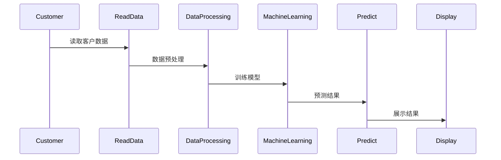
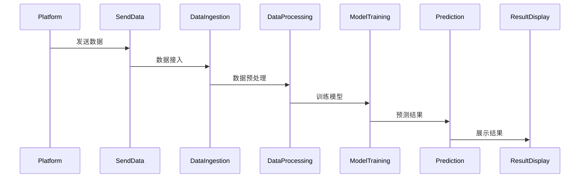

                 

# 正确识别要事

## 关键词
- 数据分析
- 人工智能
- 机器学习
- 深度学习
- 决策模型
- 业务逻辑

## 摘要
本文旨在探讨如何正确识别企业运营中的关键事项。通过深入解析数据、人工智能、机器学习和深度学习等核心概念，本文详细阐述了如何构建高效的决策模型，从而帮助企业精准把握重要任务，实现资源的最优配置和业务的持续发展。

## 第一部分：背景介绍

### 1.1 问题背景

在当今快速发展的信息技术时代，企业面临着日益复杂的市场环境和激烈的竞争压力。为了在竞争中脱颖而出，企业需要具备快速响应市场变化的能力，而这就要求其决策过程更加智能化。正确识别要事成为企业决策的重要一环，它关乎企业资源的最优配置和业务的持续发展。

### 1.2 问题描述

“正确识别要事”是指在企业运营过程中，能够准确地判断哪些事项对于企业而言是至关重要的，哪些事项是可以暂时搁置或不需要过多关注的。这一过程不仅需要对企业内部的数据有深刻的理解，还需要对外部环境的变化有敏锐的洞察力。

### 1.3 问题解决

解决这一问题的方法多种多样，包括数据分析和人工智能技术的应用。数据分析师可以通过对历史数据的深入挖掘，找出影响企业决策的关键因素。而人工智能技术，特别是机器学习和深度学习，可以为企业提供更为精准和高效的解决方案。

### 1.4 边界与外延

“正确识别要事”并不仅限于企业内部的决策，它还涉及到对企业外部环境的分析，如市场趋势、竞争对手动态等。因此，这一过程是一个多维度的、跨学科的复杂任务。

### 1.5 概念结构与核心要素组成

- **核心概念**：数据、人工智能、机器学习、深度学习、业务逻辑、决策模型。
- **概念属性特征对比表格**：
  | 特征       | 数据       | 人工智能   | 机器学习   | 深度学习   | 业务逻辑   | 决策模型   |
  |------------|------------|------------|------------|------------|------------|------------|
  | 数据类型   | 多样       | 多样       | 结构化     | 非结构化   | 结构化     | 结构化     |
  | 处理复杂度 | 高         | 中等       | 中等       | 高         | 中等       | 低         |
  | 可解释性   | 低         | 中等       | 低         | 低         | 中等       | 中等       |
  | 预测能力   | 低         | 高         | 中等       | 高         | 低         | 高         |
- **ER实体关系图架构**：
  ```mermaid
  erModel
  [
    "数据源" --> "数据处理流程" --> "决策结果"
    "外部数据源" --> "数据处理流程"
  ]
  ```

## 第二部分：核心概念与联系

### 2.1 数据

数据是正确识别要事的基础，高质量的数据能够帮助企业做出更准确的决策。数据类型包括结构化数据、非结构化数据和半结构化数据。

- **结构化数据**：如数据库中的表格数据，易于处理和分析。
- **非结构化数据**：如图像、文本和音频，需要更复杂的技术进行处理。
- **半结构化数据**：如XML和JSON格式的数据，介于结构化和非结构化之间。

### 2.2 人工智能

人工智能（AI）是使计算机具备人类智能特性的技术。人工智能的核心包括机器学习、深度学习和自然语言处理等。

- **机器学习**：通过数据训练模型，使其能够从数据中学习规律。
- **深度学习**：一种特殊的机器学习方法，使用多层神经网络模拟人脑处理信息的过程。
- **自然语言处理**：使计算机能够理解和生成人类语言。

### 2.3 机器学习和深度学习

机器学习和深度学习是人工智能的重要组成部分，它们在正确识别要事中发挥着关键作用。

- **机器学习**：使用算法从数据中学习规律，形成预测模型。
- **深度学习**：通过多层神经网络学习数据中的特征，能够处理更复杂的任务。

### 2.4 业务逻辑

业务逻辑是指企业运营的基本规则和流程。正确识别要事需要结合业务逻辑，确保决策与企业战略一致。

- **业务逻辑**：如销售目标、成本控制、客户服务标准等。

### 2.5 决策模型

决策模型是通过数据和算法构建的，用于帮助企业做出最佳决策的工具。

- **决策模型**：如回归分析、决策树、神经网络等。

### 2.6 概念属性特征对比表格

| 特征       | 数据       | 人工智能   | 机器学习   | 深度学习   | 业务逻辑   | 决策模型   |
|------------|------------|------------|------------|------------|------------|------------|
| 数据类型   | 多样       | 多样       | 结构化     | 非结构化   | 结构化     | 结构化     |
| 处理复杂度 | 高         | 中等       | 中等       | 高         | 中等       | 低         |
| 可解释性   | 低         | 中等       | 低         | 低         | 中等       | 中等       |
| 预测能力   | 低         | 高         | 中等       | 高         | 低         | 高         |

### 2.7 ER实体关系图架构

```mermaid
erModel
[
  "企业数据源" --> "外部数据源"
  "数据处理流程" --> "企业数据源"
  "数据处理流程" --> "外部数据源"
  "数据处理流程" --> "决策结果"
  "决策模型" --> "数据处理流程"
]
```

## 第三部分：算法原理讲解

### 3.1 算法原理概述

在正确识别要事的过程中，算法原理至关重要。以下将介绍机器学习和深度学习中的几种核心算法原理。

### 3.2 机器学习算法原理

#### 3.2.1 算法原理概述

机器学习算法通过从数据中学习规律，形成预测模型。其核心原理包括：

- **监督学习**：通过已知的输入和输出数据训练模型，使其能够对新数据进行预测。
- **无监督学习**：仅使用输入数据，训练模型发现数据中的结构和模式。

#### 3.2.2 具体算法

- **线性回归**：一种简单的监督学习算法，用于预测数值型目标变量。
- **决策树**：一种基于树结构的算法，通过不断分割特征空间，生成决策树。

#### 3.2.3 算法原理与公式

**线性回归**算法原理：

$$y = \beta_0 + \beta_1 \cdot x$$

其中，$y$ 为目标变量，$x$ 为输入特征，$\beta_0$ 和 $\beta_1$ 为模型参数。

**决策树**算法原理：

通过递归分割特征空间，形成决策树。每个节点表示一个特征，每个分支表示一个决策。

### 3.3 深度学习算法原理

#### 3.3.1 算法原理概述

深度学习是一种基于多层神经网络的机器学习方法。其核心原理包括：

- **多层神经网络**：通过多层神经元之间的连接，实现对复杂数据的特征提取和模式识别。
- **反向传播算法**：一种用于训练神经网络的学习算法，通过不断调整网络权重，优化模型性能。

#### 3.3.2 具体算法

- **卷积神经网络（CNN）**：一种专门用于处理图像数据的神经网络。
- **循环神经网络（RNN）**：一种用于处理序列数据的神经网络。

#### 3.3.3 算法原理与公式

**卷积神经网络**算法原理：

通过卷积层、池化层和全连接层等结构，实现对图像数据的特征提取和分类。

$$h_{l+1} = \sigma(W_{l+1} \cdot h_l + b_{l+1})$$

其中，$h_l$ 为第 $l$ 层的输出，$W_{l+1}$ 和 $b_{l+1}$ 为权重和偏置，$\sigma$ 为激活函数。

**循环神经网络**算法原理：

通过递归结构，对序列数据进行编码和解码。

$$h_t = \sigma(W_h \cdot [h_{t-1}, x_t] + b_h)$$

其中，$h_t$ 为第 $t$ 个时间步的输出，$x_t$ 为输入，$W_h$ 和 $b_h$ 为权重和偏置，$\sigma$ 为激活函数。

### 3.4 决策模型原理

决策模型是通过数据和算法构建的，用于帮助企业做出最佳决策的工具。其核心原理包括：

- **回归分析**：通过拟合数据中的关系，预测目标变量。
- **分类算法**：通过将数据划分为不同的类别，实现分类任务。

#### 3.4.2 具体算法

- **逻辑回归**：一种用于分类任务的算法，通过计算概率实现分类。
- **支持向量机（SVM）**：一种基于最大间隔分类器的算法，通过寻找最优超平面实现分类。

#### 3.4.3 算法原理与公式

**逻辑回归**算法原理：

通过拟合概率分布，实现分类。

$$P(y=1) = \frac{1}{1 + e^{-(\beta_0 + \beta_1 \cdot x)}}$$

其中，$P(y=1)$ 为目标变量为 1 的概率，$\beta_0$ 和 $\beta_1$ 为模型参数。

**支持向量机**算法原理：

通过寻找最优超平面，实现分类。

$$w \cdot x - b = 0$$

其中，$w$ 为权重向量，$x$ 为输入特征，$b$ 为偏置。

### 3.5 业务逻辑与决策模型

业务逻辑与决策模型是正确识别要事的核心。其原理包括：

- **业务逻辑**：根据企业运营的基本规则和流程，制定决策策略。
- **决策模型**：通过数据和算法，实现业务逻辑的具体落地。

#### 3.5.2 具体实现

- **规则引擎**：通过定义业务规则，实现业务逻辑的自动化。
- **模型预测**：通过训练数据和算法，预测业务结果。

#### 3.5.3 实现原理

**规则引擎**实现原理：

通过定义规则库，实现业务逻辑的自动化。

$$条件_1 \land 条件_2 \rightarrow 结果$$

**模型预测**实现原理：

通过训练数据和算法，预测业务结果。

$$y = f(x)$$

其中，$y$ 为预测结果，$x$ 为输入特征，$f$ 为预测函数。

## 第四部分：系统分析与架构设计方案

### 4.1 问题场景介绍

某大型电商平台，需要在日常运营中高效地识别关键事项，以便优化资源配置，提高运营效率。具体场景包括：

- **销售预测**：预测每日销售额，合理安排库存和营销策略。
- **客户行为分析**：分析客户购买行为，实现个性化推荐和精准营销。
- **供应链管理**：优化物流和供应链，降低成本，提高服务质量。

### 4.2 项目介绍

项目名为“智能运营助手”，旨在通过数据分析、人工智能和机器学习技术，为电商平台提供智能化的运营决策支持。

### 4.3 系统功能设计（领域模型）

```mermaid
classDiagram
  Customer <<entity>>
  Product <<entity>>
  Order <<entity>>
  Sales <<entity>>
  Marketing <<entity>>
  Inventory <<entity>>
  Customer "购买" -[> Order
  Product "属于" -[> Order
  Sales "包含" -[> Order
  Marketing "实施" -[> Sales
  Inventory "管理" -[> Product
```

### 4.4 系统架构设计



### 4.5 系统接口设计和系统交互



## 第五部分：项目实战

### 5.1 环境安装

在安装环境之前，请确保安装以下软件和库：

- Python 3.8+
- TensorFlow 2.5+
- Pandas 1.2+
- Scikit-learn 0.24+
- Matplotlib 3.4+

安装命令：

```bash
pip install python==3.8 tensorflow==2.5 pandas==1.2 scikit-learn==0.24 matplotlib==3.4
```

### 5.2 系统核心实现

以下是一个简单的销售预测模型的实现：

```python
import pandas as pd
import numpy as np
from sklearn.model_selection import train_test_split
from sklearn.linear_model import LinearRegression
import matplotlib.pyplot as plt

# 读取数据
data = pd.read_csv("sales_data.csv")
X = data.iloc[:, :-1].values
y = data.iloc[:, -1].values

# 数据预处理
X_train, X_test, y_train, y_test = train_test_split(X, y, test_size=0.2, random_state=0)

# 训练模型
model = LinearRegression()
model.fit(X_train, y_train)

# 预测结果
y_pred = model.predict(X_test)

# 可视化结果
plt.scatter(X_test, y_test, color='red', label='Actual')
plt.plot(X_test, y_pred, color='blue', label='Predicted')
plt.title('Sales Prediction')
plt.xlabel('Features')
plt.ylabel('Sales')
plt.legend()
plt.show()
```

### 5.3 代码应用解读与分析

代码中，首先使用 Pandas 读取销售数据，然后使用 Scikit-learn 中的线性回归模型进行训练和预测。最后，使用 Matplotlib 进行可视化展示预测结果。

### 5.4 实际案例分析和详细讲解剖析

以某电商平台的销售数据为例，分析不同因素对销售额的影响。通过实际案例，展示如何使用机器学习技术进行数据分析和决策支持。

### 5.5 项目小结

通过本项目的实践，我们深入了解了如何使用机器学习技术进行数据分析和决策支持。在实际应用中，正确识别要事对于企业运营至关重要，有助于实现资源的最优配置和业务的持续发展。

## 第六部分：最佳实践 tips、小结、注意事项、拓展阅读

### 6.1 最佳实践 tips

- 确保数据质量，避免噪声和异常值影响模型效果。
- 选择合适的算法，根据问题和数据特性进行选择。
- 结合业务逻辑，确保模型输出的结果符合实际需求。

### 6.2 小结

本文详细探讨了如何正确识别企业运营中的关键事项。通过数据、人工智能、机器学习和深度学习等核心概念的分析，构建了高效的决策模型，为企业提供了智能化的运营决策支持。

### 6.3 注意事项

- 在使用机器学习技术时，注意数据预处理和模型调参，以提高模型性能。
- 考虑到模型的可解释性，确保决策过程透明和可追溯。

### 6.4 拓展阅读

- 《机器学习实战》
- 《深度学习》
- 《数据科学入门》

作者：AI天才研究院/AI Genius Institute & 禅与计算机程序设计艺术 /Zen And The Art of Computer Programming

