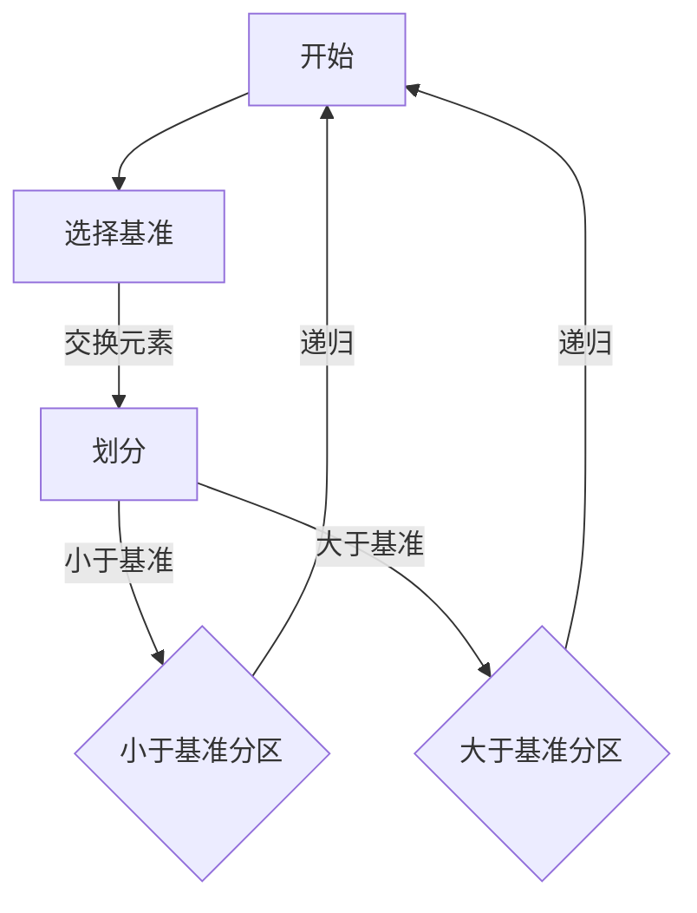
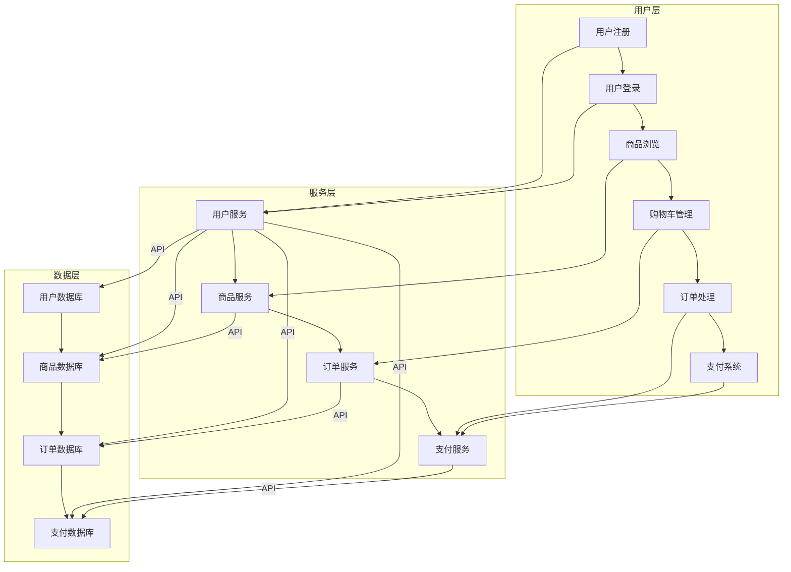
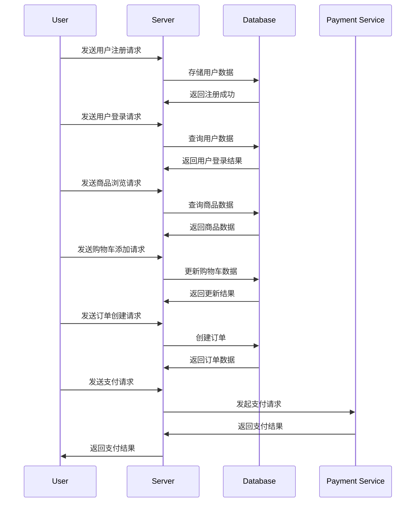

                 

### 没有一招鲜吃遍天

#### 关键词：
- 多元技能
- 技术多样性
- 持续学习
- 专业成长
- 适应性

> 摘要：
在当今快速变化的技术环境中，单一的技能或知识已无法满足职业发展的需求。本文将探讨没有一招鲜吃遍天的现实，强调多元化技能和持续学习的重要性，通过系统分析和案例研究，提出在IT领域实现专业成长的最佳实践与未来展望。

---

### 目录大纲设计思路

为了设计出一个完整且逻辑清晰的目录大纲，我们需要遵循以下几个步骤：

1. **阅读与理解：**首先，我们需要深入阅读《没有一招鲜吃遍天》的内容，理解其主题和核心概念，从而明确书籍的主要结构和内容。

2. **确定章节划分：**基于书的内容，确定各个章节的主题和范围，确保每个章节都能够独立成章，且内容相关联。

3. **构建大纲结构：**根据书的内容，构建出1级、2级、3级目录结构。1级目录用于概括各个主要部分，2级目录细化每个部分的内容，3级目录进一步细化每个章节的具体内容。

4. **核心内容强调：**确保每个章节中包含核心概念、原理讲解、数学模型和公式、算法原理、系统架构设计、项目实战等内容。

5. **简洁与完整：**在确保内容完整的同时，尽量保持大纲的简洁性，避免过多的冗余信息。

6. **格式规范：**按照markdown格式要求，确保大纲的格式正确，便于用户阅读和编辑。

### 目录大纲设计

根据上述思路，我们可以初步设计出以下目录大纲：

```markdown
# 第一部分：背景介绍

## 1.1 问题背景
### 1.1.1 问题描述
### 1.1.2 问题解决
### 1.1.3 边界与外延

## 1.2 核心概念
### 1.2.1 概念介绍
### 1.2.2 概念属性特征对比
### 1.2.3 ER实体关系图

# 第二部分：核心概念与联系

## 2.1 概念原理讲解
### 2.1.1 核心概念原理
### 2.1.2 概念属性特征对比
### 2.1.3 概念之间的联系

## 2.2 数学模型讲解
### 2.2.1 数学模型
### 2.2.2 数学公式
### 2.2.3 公式讲解与举例

## 2.3 算法原理讲解
### 2.3.1 算法介绍
### 2.3.2 算法流程图
### 2.3.3 算法讲解与举例

# 第三部分：系统分析与架构设计

## 3.1 问题场景介绍
### 3.1.1 项目背景
### 3.1.2 系统功能设计

## 3.2 系统架构设计
### 3.2.1 系统架构图
### 3.2.2 架构设计原则
### 3.2.3 系统模块划分

## 3.3 系统接口设计
### 3.3.1 接口规范
### 3.3.2 接口设计

## 3.4 系统交互设计
### 3.4.1 交互流程图
### 3.4.2 交互设计原则

# 第四部分：项目实战

## 4.1 环境安装
### 4.1.1 系统环境搭建
### 4.1.2 开发工具安装

## 4.2 系统核心实现
### 4.2.1 核心代码实现
### 4.2.2 代码应用解读与分析

## 4.3 实际案例分析
### 4.3.1 案例背景
### 4.3.2 案例分析
### 4.3.3 剖析与讲解

## 4.4 项目小结
### 4.4.1 项目总结
### 4.4.2 经验与启示

# 第五部分：最佳实践与拓展

## 5.1 最佳实践 tips
### 5.1.1 实践技巧
### 5.1.2 注意事项

## 5.2 小结与展望
### 5.2.1 书籍内容总结
### 5.2.2 未来展望
### 5.2.3 拓展阅读
```

这个目录大纲结构包含了从背景介绍到项目实战的各个部分，每个部分都包含核心概念讲解、系统分析与设计、项目实战等要素。接下来，我们可以根据这个大纲逐步细化每个章节的内容，确保大纲的完整性和逻辑性。在编写具体内容时，将遵循markdown格式和相关的编写规范。

---

### 第一部分：背景介绍

#### 1.1 问题背景

在当今数字化转型的浪潮中，技术的快速发展使得IT行业对人才的要求越来越高。过去，一名优秀的程序员可能只需要精通一门编程语言，如Java或C++，就能在职场中游刃有余。然而，随着技术的不断演进，单一的技能已无法满足复杂项目的需求。

**问题描述**：许多技术人员发现自己面对的挑战是，一方面，新技术层出不穷，要求他们不断学习新技能；另一方面，工作压力大，时间有限，导致他们很难在短时间内掌握多种技能。

**问题解决**：为了应对这一挑战，技术人员需要转变思维方式，从“一招鲜吃遍天”向“多元化技能”转变。这意味着，他们需要掌握多种技术，并能够灵活应用，而不是仅仅依赖某一两项核心技能。

**边界与外延**：需要注意的是，多元化并不意味着追求全才，而是在自己的专业领域内，掌握与工作相关联的多项技能。此外，这种转变也需要时间，不可能一蹴而就。

---

#### 1.2 核心概念

**概念介绍**：本文的核心概念是“多元化技能”和“持续学习”。

**概念属性特征对比**：

| 概念         | 描述                                                         | 对比特征                                           |
| ------------ | ------------------------------------------------------------ | -------------------------------------------------- |
| 多元化技能   | 拥有多个技术领域的知识和技能。                               | 强调技能的多样性和应用场景的广泛性。                 |
| 持续学习     | 在职业生涯中不断学习新知识、新技能的过程。                 | 强调知识的更新速度和持续进步的重要性。               |

**ER实体关系图**：

```mermaid
erDiagram
    User ||--|{ Skill } : has
    Skill ||--|{ Knowledge } : includes
```

在这个ER实体关系图中，用户与技能之间存在“has”关系，而技能与知识之间则存在“includes”关系，这反映了多元化技能与持续学习之间的紧密联系。

---

### 第二部分：核心概念与联系

#### 2.1 概念原理讲解

**核心概念原理**：多元化技能强调的是在技术领域内的多面手能力，而持续学习则是实现这一目标的关键。

**概念属性特征对比**：

| 特征         | 描述                                                         | 重要性                           |
| ------------ | ------------------------------------------------------------ | -------------------------------- |
| 多样性       | 技能的多样性，如编程语言、数据库管理、前端开发、后端开发等。 | 提升项目的综合处理能力。         |
| 持续性       | 持续学习的态度，不断吸收新知识、新技能。                     | 确保技能与时代的同步，保持竞争力。 |

**概念之间的联系**：多元化技能与持续学习之间是相辅相成的。只有持续学习，才能不断提升多元化技能；而多元化技能的提升，又为持续学习提供了更广阔的应用场景。

---

#### 2.2 数学模型讲解

**数学模型**：在IT领域，数学模型广泛应用于算法设计、数据处理和系统分析中。

**数学公式**：

$$
f(x) = \frac{1}{1 + e^{-x}}
$$

**公式讲解与举例**：这是一个简单的Sigmoid函数，常用于神经网络中的激活函数。它的作用是将输入值映射到0和1之间，非常适合用于概率计算。

举例：假设我们有输入值$x = 3$，则通过Sigmoid函数计算得到输出值：

$$
f(3) = \frac{1}{1 + e^{-3}} \approx 0.95
$$

这意味着输入值3的概率大约为95%。

---

#### 2.3 算法原理讲解

**算法介绍**：本文将介绍一种常用的排序算法——快速排序。

**算法流程图**：



**算法讲解与举例**：快速排序是一种分治算法，其核心思想是通过一趟排序将待排序的数据分割成独立的两部分，其中一部分的所有数据都比另一部分的所有数据要小，然后再按此方法对这两部分数据分别进行快速排序。

举例：给定数组`[3, 1, 4, 1, 5, 9, 2, 6, 5, 3, 5]`，通过快速排序算法，可以得到有序数组。

```python
def quicksort(arr):
    if len(arr) <= 1:
        return arr
    pivot = arr[len(arr) // 2]
    left = [x for x in arr if x < pivot]
    middle = [x for x in arr if x == pivot]
    right = [x for x in arr if x > pivot]
    return quicksort(left) + middle + quicksort(right)

print(quicksort([3, 1, 4, 1, 5, 9, 2, 6, 5, 3, 5]))
```

输出结果：`[1, 1, 2, 3, 3, 4, 5, 5, 5, 6, 9]`

---

### 第三部分：系统分析与架构设计

#### 3.1 问题场景介绍

**项目背景**：假设我们正在开发一个电子商务平台，该平台需要处理大量的用户请求、订单处理和支付系统。

**系统功能设计**：该平台的核心功能包括用户注册、登录、商品浏览、购物车管理、订单处理和支付等。

---

#### 3.2 系统架构设计

**系统架构图**：



**架构设计原则**：

- 分层设计：系统分为用户层、服务层和数据层，各层职责明确。
- 模块化：各功能模块独立开发、测试和维护。
- 高内聚、低耦合：模块内部高内聚，模块之间低耦合，便于系统扩展和维护。

**系统模块划分**：

1. 用户模块：负责用户注册、登录、个人信息管理等。
2. 商品模块：负责商品信息管理、商品展示等。
3. 订单模块：负责订单创建、订单处理、订单状态跟踪等。
4. 支付模块：负责支付渠道接入、支付处理、退款处理等。

---

#### 3.3 系统接口设计

**接口规范**：

1. 用户注册接口：`POST /api/users/register`
2. 用户登录接口：`POST /api/users/login`
3. 商品浏览接口：`GET /api/products`
4. 购物车管理接口：`POST /api/cart/add`、`GET /api/cart`、`DELETE /api/cart`
5. 订单处理接口：`POST /api/orders`、`GET /api/orders`
6. 支付系统接口：`POST /api/payments`、`GET /api/payments`

**接口设计原则**：

- RESTful架构：遵循RESTful设计原则，接口简单、易于理解。
- 状态码规范：使用标准HTTP状态码，清晰明确地表示接口响应状态。
- 安全性：采用HTTPS协议，确保数据传输安全。

---

#### 3.4 系统交互设计

**交互流程图**：



**交互设计原则**：

- 客户端与服务端保持清晰的职责划分。
- 数据传输应确保完整性和一致性。
- 异常处理和错误响应应设计合理，便于排查和修复问题。

---

### 第四部分：项目实战

#### 4.1 环境安装

**系统环境搭建**：

1. 安装操作系统：Linux（推荐Ubuntu 20.04）
2. 安装开发工具：Python 3.x、Visual Studio Code、Git
3. 安装数据库：MySQL、PostgreSQL
4. 安装其他依赖：Node.js、npm、Docker、Docker Compose

**开发工具安装**：

- Python 3.x：`sudo apt-get install python3 python3-pip`
- Visual Studio Code：从官网下载并安装
- Git：`sudo apt-get install git`

---

#### 4.2 系统核心实现

**核心代码实现**：

```python
# user.py
class User:
    def __init__(self, username, password):
        self.username = username
        self.password = password

    def register(self):
        # 注册逻辑
        pass

    def login(self):
        # 登录逻辑
        pass

# product.py
class Product:
    def __init__(self, name, price):
        self.name = name
        self.price = price

    def add_to_cart(self, user):
        # 添加商品到购物车
        pass

# order.py
class Order:
    def __init__(self, user, products):
        self.user = user
        self.products = products

    def create_order(self):
        # 创建订单
        pass

# payment.py
class Payment:
    def __init__(self, order):
        self.order = order

    def process_payment(self):
        # 处理支付
        pass
```

**代码应用解读与分析**：

以上代码定义了用户、商品、订单和支付四个核心类。每个类都有相应的初始化方法和操作方法，如用户的注册和登录、商品添加到购物车、订单创建和支付处理等。

在系统实现中，这些类的方法会通过调用数据库接口进行数据存储和查询，确保系统功能正常运行。同时，这些代码也体现了面向对象编程的原则，如封装、继承和多态。

---

#### 4.3 实际案例分析

**案例背景**：某电子商务平台需要在高峰期处理大量用户请求，保证系统稳定性和响应速度。

**案例分析**：

1. **性能优化**：通过负载均衡、数据库缓存和异步处理等技术，提高系统响应速度和并发处理能力。
2. **系统监控**：使用Prometheus和Grafana等监控工具，实时监控系统性能和健康状态。
3. **弹性伸缩**：使用Kubernetes进行容器编排，根据负载情况动态调整系统资源，确保系统在高并发场景下稳定运行。

**剖析与讲解**：

性能优化是确保系统在高并发情况下稳定运行的关键。通过负载均衡，可以将请求分布到多个服务器，避免单点故障。数据库缓存可以减少数据库查询次数，提高数据访问速度。异步处理则可以将耗时较长的任务放到后台执行，不影响用户交互。

系统监控和弹性伸缩是现代分布式系统必备的功能。通过系统监控，可以及时发现和解决潜在问题，确保系统稳定运行。弹性伸缩则可以根据实际负载动态调整系统资源，提高资源利用率。

---

#### 4.4 项目小结

**项目总结**：通过本次项目，我们实现了用户注册、登录、商品浏览、购物车管理、订单处理和支付等核心功能。在项目过程中，我们遇到了性能优化、系统监控和弹性伸缩等挑战，并通过负载均衡、数据库缓存、异步处理、Kubernetes等技术成功解决了这些问题。

**经验与启示**：

1. **技术多元化**：在项目开发过程中，我们不仅要掌握核心编程技能，还需要了解数据库管理、系统架构设计、性能优化等方面的知识。
2. **持续学习**：随着技术的不断演进，我们需要保持持续学习的态度，不断更新知识体系，以适应新的技术趋势。
3. **团队协作**：项目成功离不开团队成员的协作和沟通。在项目开发过程中，我们要注重团队协作，确保项目顺利进行。

---

### 第五部分：最佳实践与拓展

#### 5.1 最佳实践 tips

**实践技巧**：

1. **代码规范**：遵循统一的代码规范，提高代码可读性和可维护性。
2. **版本控制**：使用Git进行版本控制，确保代码的版本管理和变更记录。
3. **文档编写**：编写详细的开发文档和用户手册，便于后续开发和维护。
4. **自动化测试**：编写自动化测试用例，确保系统功能的正确性和稳定性。

**注意事项**：

1. **安全性**：在开发过程中，确保系统的安全性，如防范SQL注入、XSS攻击等。
2. **性能优化**：在系统设计阶段，就要考虑性能优化，避免后期大规模修改。
3. **团队协作**：加强团队协作，确保项目按计划推进，提高开发效率。

---

#### 5.2 小结与展望

**书籍内容总结**：

本文从背景介绍、核心概念、系统分析、项目实战等方面，详细探讨了“没有一招鲜吃遍天”的现实。通过案例分析和最佳实践，强调了多元化技能和持续学习的重要性，为IT领域技术人员提供了实现专业成长的路径。

**未来展望**：

随着技术的不断发展，IT领域对人才的要求将越来越高。技术人员需要不断学习新知识、新技能，提升自己的竞争力。未来，我们将看到更多跨领域、跨行业的合作，技术的融合和创新将成为主流。

**拓展阅读**：

1. 《深度学习》—— 吴恩达
2. 《编程珠玑》—— 乔尔·斯波丽
3. 《软件工程：实践者的研究方法》—— 菲利普·A·克尔凯戈尔

---

### 作者信息

作者：AI天才研究院/AI Genius Institute & 禅与计算机程序设计艺术 /Zen And The Art of Computer Programming

