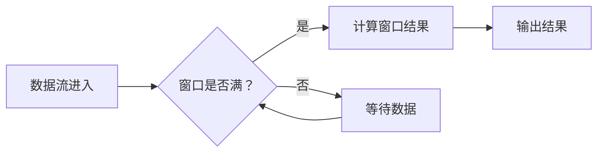
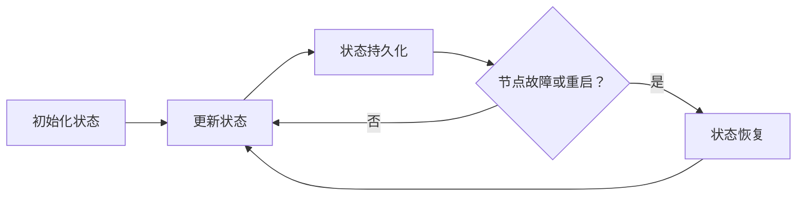
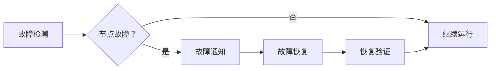
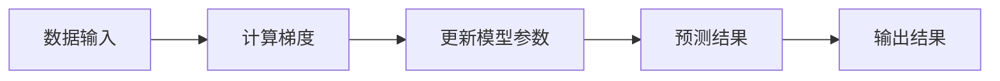
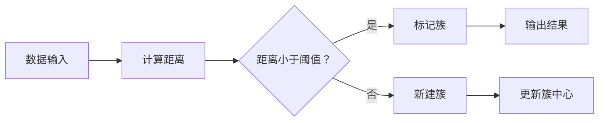

                 

# 流计算框架选型与应用实践

> 关键词：流计算框架、Apache Flink、Apache Storm、Apache Kafka、实时数据处理、事件驱动架构

> 摘要：本文将深入探讨流计算框架的选型与应用实践。首先，我们将了解流计算框架的背景和重要性，然后详细介绍几个主流的流计算框架，分析它们的特点和适用场景。接下来，我们将深入探讨流计算框架的原理，包括算法原理和数学模型。随后，我们将通过实际案例展示流计算的应用实践，并总结最佳实践策略。

## 第1章 流计算框架概述

### 1.1 问题背景

流计算是一种处理实时数据流的技术，它与传统的批处理技术有很大的不同。批处理技术通常是在一定时间周期内处理一批数据，而流计算则是对实时到达的数据进行处理。

#### 流计算的概念与重要性

流计算（Stream Computing）是一种数据处理技术，它对连续的数据流进行实时处理和分析。流计算的特点包括：

- **实时性**：流计算能够对实时到达的数据进行处理，实现秒级甚至毫秒级的响应时间。
- **高吞吐量**：流计算能够处理大规模的数据流，具有很高的吞吐量。
- **动态性**：流计算能够动态地适应数据流的变化，自动调整计算任务。

在当今数据驱动时代，流计算的重要性日益凸显。许多企业和组织需要实时处理和分析大量的数据，以便做出快速、准确的决策。例如，在金融领域，实时股票交易分析可以帮助投资者快速识别市场趋势；在物联网领域，实时数据分析可以帮助企业实时监控设备和系统的运行状态。

#### 流计算与传统批处理的对比

流计算与批处理在处理方式、响应时间、吞吐量等方面有很大的不同：

| 对比项 | 流计算 | 批处理 |
| --- | --- | --- |
| 数据处理方式 | 实时处理数据流 | 定期处理批量数据 |
| 响应时间 | 秒级甚至毫秒级 | 小时级或天级 |
| 吞吐量 | 高吞吐量 | 吞吐量有限 |
| 动态性 | 动态适应数据流变化 | 静态处理数据 |
| 实时性 | 强调实时性 | 静态数据处理 |

#### 流计算的应用场景

流计算广泛应用于各个领域，以下是几个典型的应用场景：

- **实时数据处理**：如实时股票交易分析、实时社交媒体分析等。
- **实时分析**：如实时流量监控、实时用户行为分析等。
- **物联网（IoT）**：如实时设备监控、实时环境监测等。

### 1.2 核心概念

#### 流数据与批数据的区别

流数据与批数据在数据形式、处理方式、数据处理周期等方面有很大的不同：

| 对比项 | 流数据 | 批数据 |
| --- | --- | --- |
| 数据形式 | 实时数据流 | 批量数据集合 |
| 处理方式 | 实时处理 | 定期处理 |
| 处理周期 | 秒级或毫秒级 | 小时级或天级 |
| 数据量 | 大规模数据流 | 批量数据 |

#### 事件驱动架构（EDA）

事件驱动架构（Event-Driven Architecture，EDA）是一种软件架构模式，它通过事件来触发和响应系统的行为。在流计算中，事件驱动架构是非常重要的，因为流数据以事件的形式到达，需要通过事件驱动来处理这些数据。

事件驱动架构的基本概念包括：

- **事件**：事件是流计算中的基本单元，表示数据流中的一个数据点或操作。
- **事件源**：事件源是产生事件的实体，可以是传感器、用户操作、系统日志等。
- **事件处理器**：事件处理器是处理事件的实体，根据事件类型执行相应的处理操作。
- **事件总线**：事件总线是一种通信机制，用于在不同事件处理器之间传递事件。

#### 实时处理与实时分析

实时处理和实时分析是流计算中的两个重要概念，它们既有区别又有联系：

- **实时处理**：实时处理是对实时到达的数据进行计算、转换和处理，确保数据处理的速度和准确性。
- **实时分析**：实时分析是基于实时处理的结果，对数据进行进一步的统计、分析和挖掘，以获取有价值的信息。

实时处理和实时分析的关系如下：

- **实时处理是实时分析的基础**：实时处理确保了数据的实时性和准确性，为实时分析提供了可靠的数据源。
- **实时分析是实时处理的延伸**：实时分析对实时处理的结果进行深入挖掘，帮助用户获取更详细的洞察和决策支持。

### 1.3 流计算框架简介

#### 主流流计算框架

目前市场上主流的流计算框架包括Apache Flink、Apache Storm和Apache Kafka等。这些框架各有特点，适用于不同的应用场景。

- **Apache Flink**：Apache Flink是一个开源的流处理框架，具有高性能、易用性和灵活性的特点。Flink支持批处理和流处理，可以通过窗口计算实现实时数据处理。
- **Apache Storm**：Apache Storm是一个分布式、可靠的实时数据流处理框架，具有低延迟、高吞吐量和良好的容错性的特点。Storm适用于处理大规模实时数据流。
- **Apache Kafka**：Apache Kafka是一个分布式消息队列系统，具有高性能、可扩展性和持久化的特点。Kafka主要用于构建实时数据流管道，支持大规模数据的实时传输。

#### 框架比较与选择

不同流计算框架具有不同的特点，适用于不同的应用场景。以下是对几种主流流计算框架的比较：

| 框架 | 特点 | 适用场景 |
| --- | --- | --- |
| Apache Flink | 高性能、易用性、支持批处理和流处理 | 实时数据分析、实时处理、批处理和流处理的混合场景 |
| Apache Storm | 低延迟、高吞吐量、良好的容错性 | 实时数据处理、大规模实时数据流处理 |
| Apache Kafka | 高性能、可扩展性、持久化 | 实时数据流传输、大规模数据管道、数据集成 |

#### 流计算框架的工作原理

流计算框架的工作原理主要包括以下几个方面：

- **数据流处理**：流计算框架通过数据流的方式对实时数据进行处理，数据流可以是点对点的传输，也可以是分布式的方式。
- **任务调度**：流计算框架负责将计算任务分配到不同的节点上执行，确保任务的并行处理。
- **状态管理**：流计算框架能够持久化和管理计算过程中的状态信息，确保数据的准确性和一致性。
- **容错机制**：流计算框架具有容错机制，能够检测和处理节点故障，确保系统的可靠性和稳定性。

## 第2章 流计算框架原理

### 2.1 算法原理

流计算框架中的算法原理是核心内容，下面将详细介绍几个关键算法原理，包括窗口计算、状态管理和容错机制。

#### 窗口计算

窗口计算是流计算中一个重要的概念，它用于将连续的数据流划分为多个时间窗口或滑动窗口，以便进行批量计算。

**窗口计算的基本概念**：

- **时间窗口**：时间窗口是指一段时间范围内的数据集合，例如，5分钟窗口表示从当前时间开始向前推5分钟的数据。
- **滑动窗口**：滑动窗口是指随着时间推移，窗口逐渐向前滑动，每次滑动固定时间间隔的数据。例如，5分钟滑动窗口表示每次滑动5分钟，处理当前窗口内的数据。

**窗口计算的基本算法原理**：

窗口计算的基本算法原理是将连续的数据流划分为多个窗口，对每个窗口内的数据进行批量计算。具体步骤如下：

1. 初始化窗口：根据设定的窗口大小和滑动间隔，初始化窗口。
2. 数据进入窗口：实时数据进入窗口，如果窗口未满，等待数据继续进入。
3. 窗口满时计算：当窗口内的数据达到设定的阈值时，触发计算操作，计算结果可以是一个统计值或具体的计算结果。
4. 窗口滑动：计算完成后，窗口向前滑动，进入新的数据窗口。

**使用mermaid流程图表示窗口计算**：



#### 状态管理

状态管理是流计算中一个关键的概念，它用于持久化和管理计算过程中的状态信息，确保数据的准确性和一致性。

**状态管理的基本概念**：

- **状态**：状态是计算过程中的关键信息，可以是简单的数据值，也可以是复杂的对象。
- **状态持久化**：状态持久化是将状态信息存储在持久化存储中，确保在节点故障或重启时能够恢复状态。
- **状态恢复**：状态恢复是在节点重启或故障后，从持久化存储中恢复状态信息，确保计算过程的连续性。

**状态管理的基本算法原理**：

状态管理的基本算法原理是将状态信息与计算任务绑定，并将状态信息持久化存储。具体步骤如下：

1. 初始化状态：在计算任务启动时，初始化状态。
2. 更新状态：在计算过程中，根据数据更新状态信息。
3. 状态持久化：将状态信息存储在持久化存储中，确保状态信息的持久性。
4. 状态恢复：在节点重启或故障后，从持久化存储中恢复状态信息。

**使用mermaid流程图表示状态管理**：



#### 容错机制

容错机制是流计算中一个关键的概念，它用于检测和处理节点故障，确保系统的可靠性和稳定性。

**容错机制的基本概念**：

- **节点故障**：节点故障是指计算节点在运行过程中出现故障，无法正常工作。
- **故障检测**：故障检测是检测节点是否出现故障的机制。
- **故障恢复**：故障恢复是在节点故障后，重新启动节点并恢复计算过程的机制。

**容错机制的基本算法原理**：

容错机制的基本算法原理是检测和处理节点故障，确保计算过程的连续性。具体步骤如下：

1. 故障检测：定期检测节点的运行状态，判断是否出现故障。
2. 故障通知：在检测到节点故障时，向系统管理员发送通知。
3. 故障恢复：在检测到节点故障后，重新启动节点并恢复计算过程。
4. 故障恢复验证：在节点恢复后，验证计算结果的正确性，确保系统的可靠性。

**使用mermaid流程图表示容错机制**：



### 2.2 数学模型

流计算中的数学模型是算法实现的基础，下面将详细介绍两个常用的数学模型：实时线性回归和实时聚类。

#### 实时线性回归

实时线性回归是一种用于预测连续数据的方法，它通过实时计算数据点的线性关系来预测未来的数据。

**实时线性回归的基本概念**：

- **线性关系**：线性关系是指数据点之间可以用一条直线来表示的关系。
- **回归模型**：回归模型是用于预测数据的方法，它通过计算数据点的线性关系来预测未来的数据。

**实时线性回归的基本算法原理**：

实时线性回归的基本算法原理是计算数据点的线性关系，并根据这个关系预测未来的数据。具体步骤如下：

1. 数据输入：实时输入数据点。
2. 计算梯度：根据当前数据和预测模型，计算数据点的梯度。
3. 更新模型参数：根据梯度更新预测模型的参数。
4. 预测结果：使用更新后的模型参数预测未来的数据。

**使用mermaid流程图和Python代码示例表示实时线性回归**：



```python
import numpy as np

def linear_regression(data, alpha=0.01, iterations=1000):
    n = len(data)
    x = np.array([i for i in range(n)])
    y = np.array(data)
    theta = np.zeros((2, 1))
    
    for _ in range(iterations):
        predictions = x.dot(theta)
        errors = y - predictions
        gradient = 2 * x.T.dot(errors)
        theta -= alpha * gradient
    
    return theta

data = [1, 2, 3, 4, 5]
theta = linear_regression(data)
print("Predicted values:", [x.dot(theta) for x in range(len(data) + 1)])
```

#### 实时聚类

实时聚类是一种用于数据分类的方法，它通过实时计算数据点的聚类关系来划分数据。

**实时聚类的基本概念**：

- **聚类**：聚类是指将数据点划分为多个类别的过程。
- **聚类算法**：聚类算法是用于划分数据点的方法。

**实时聚类的基本算法原理**：

实时聚类的基本算法原理是计算数据点的距离，并根据距离关系划分数据点。具体步骤如下：

1. 数据输入：实时输入数据点。
2. 计算距离：计算数据点之间的距离。
3. 划分类别：根据距离关系划分数据点，将距离较小的数据点划分为同一类别。
4. 更新聚类中心：根据新划分的类别，更新聚类中心。

**使用mermaid流程图和Python代码示例表示实时聚类**：



```python
import numpy as np

def k_means(data, k=2, max_iterations=100):
    n = len(data)
    centroids = data[np.random.choice(n, k, replace=False)]
    
    for _ in range(max_iterations):
        distances = np.linalg.norm(data - centroids, axis=1)
        labels = np.argmin(distances, axis=1)
        
        new_centroids = np.array([data[labels == i].mean(axis=0) for i in range(k)])
        
        if np.all(centroids == new_centroids):
            break
        
        centroids = new_centroids
    
    return centroids, labels

data = np.array([[1, 1], [1, 2], [2, 2], [2, 3]])
centroids, labels = k_means(data, k=2)
print("Centroids:", centroids)
print("Labels:", labels)
```

## 第3章 流计算应用实践

### 3.1 实践案例一：实时股票交易分析

#### 案例背景

实时股票交易分析是一个典型的流计算应用场景，它需要实时处理大量的股票交易数据，以快速识别市场趋势和交易机会。

**数据源**：股票交易数据可以从交易所或金融数据提供商获取，通常以时间序列的形式提供。

**分析目标**：实时股票交易分析的目标是快速识别市场趋势和交易机会，包括：

- 实时跟踪股票价格变化
- 识别交易信号，如突破、支撑位和阻力位
- 监控交易量，识别交易活跃时段

**需求**：实时股票交易分析需要满足以下需求：

- 实时性：能够实时处理和响应交易数据
- 高性能：能够处理大规模的交易数据
- 可扩展性：能够适应数据规模的增长
- 易用性：提供友好的用户界面和易于使用的API

#### 环境搭建

搭建实时股票交易分析的环境需要以下组件：

- **数据采集**：使用API从交易所或金融数据提供商获取实时交易数据。
- **数据存储**：使用数据库或时间序列数据库存储交易数据，如InfluxDB或Kafka。
- **流计算框架**：选择合适的流计算框架，如Apache Flink或Apache Storm。
- **可视化工具**：选择合适的可视化工具，如Kibana或Grafana。

#### 核心实现

实时股票交易分析的核心实现包括以下几个步骤：

1. **数据采集**：使用API获取实时交易数据，例如使用Python的requests库发送HTTP请求。

```python
import requests

def get_stock_data(symbol):
    url = f"https://api.exchangeratesapi.io/latest?base=USD&symbols=USD"
    response = requests.get(url)
    data = response.json()
    return data["rates"][symbol]
```

2. **数据存储**：将交易数据存储到数据库或时间序列数据库中，例如使用InfluxDB。

```python
import influxdb

client = influxdb.InfluxDBClient(host='localhost', port=8086, username='root', password='root', database='stock_db')

def store_stock_data(symbol, price):
    point = {
        "measurement": "stock_data",
        "tags": {
            "symbol": symbol
        },
        "fields": {
            "price": price
        }
    }
    client.write_points([point])
```

3. **数据处理**：使用流计算框架处理交易数据，例如使用Apache Flink。

```python
from pyflink.datastream import StreamExecutionEnvironment
from pyflink.table import StreamTableEnvironment

env = StreamExecutionEnvironment.get_execution_environment()
t_env = StreamTableEnvironment.create(env)

def process_stock_data(stock_data):
    # 处理交易数据，例如计算价格变化、交易量等
    pass

t_env.from_source(
    source=lambda: get_stock_data("AAPL"),
    schema=("symbol STRING, price FLOAT"),
    watermarks=("timestamp TIMESTAMP(3)", "1000")) \
    .execute_transform().process(process_stock_data)
```

4. **结果输出**：将处理后的数据可视化，例如使用Kibana或Grafana。

```python
import matplotlib.pyplot as plt

def plot_stock_data(stock_data):
    plt.plot(stock_data["timestamp"], stock_data["price"])
    plt.xlabel("Time")
    plt.ylabel("Price")
    plt.title("Stock Price")
    plt.show()
```

#### 代码解读与分析

上述代码展示了实时股票交易分析的核心实现步骤：

1. **数据采集**：使用API获取实时交易数据，将数据存储到InfluxDB中。
2. **数据存储**：将交易数据存储到数据库中，以便后续处理。
3. **数据处理**：使用流计算框架处理交易数据，计算价格变化、交易量等指标。
4. **结果输出**：将处理后的数据可视化，展示股票价格走势。

通过上述步骤，可以实现对实时股票交易数据的分析，快速识别市场趋势和交易机会。

### 3.2 实践案例二：实时物联网数据分析

#### 案例背景

实时物联网数据分析是一个典型的流计算应用场景，它需要实时处理大量的物联网设备数据，以监控设备和系统的运行状态。

**数据源**：物联网设备数据可以从传感器、边缘设备或云端获取，通常包括温度、湿度、功耗、位置等指标。

**分析目标**：实时物联网数据分析的目标是实时监控设备和系统的运行状态，包括：

- 实时跟踪设备运行状态
- 监控设备性能指标，如温度、湿度、功耗等
- 识别设备故障或异常情况

**需求**：实时物联网数据分析需要满足以下需求：

- 实时性：能够实时处理和响应设备数据
- 高性能：能够处理大规模的设备数据
- 可扩展性：能够适应设备数量的增长
- 易用性：提供友好的用户界面和易于使用的API

#### 环境搭建

搭建实时物联网数据分析的环境需要以下组件：

- **数据采集**：使用传感器或边缘设备采集物联网设备数据，并通过API或MQTT等协议传输数据。
- **数据存储**：使用数据库或时间序列数据库存储物联网设备数据，如InfluxDB或Kafka。
- **流计算框架**：选择合适的流计算框架，如Apache Flink或Apache Storm。
- **可视化工具**：选择合适的可视化工具，如Kibana或Grafana。

#### 核心实现

实时物联网数据分析的核心实现包括以下几个步骤：

1. **数据采集**：使用传感器或边缘设备采集物联网设备数据，并通过API或MQTT等协议传输数据。

```python
import requests

def get_device_data(device_id):
    url = f"https://api.device_data.com/device/{device_id}"
    response = requests.get(url)
    data = response.json()
    return data["data"]
```

2. **数据存储**：将物联网设备数据存储到数据库或时间序列数据库中，例如使用InfluxDB。

```python
import influxdb

client = influxdb.InfluxDBClient(host='localhost', port=8086, username='root', password='root', database='iot_db')

def store_device_data(device_id, data):
    point = {
        "measurement": "device_data",
        "tags": {
            "device_id": device_id
        },
        "fields": data
    }
    client.write_points([point])
```

3. **数据处理**：使用流计算框架处理物联网设备数据，分析设备运行状态和性能指标。

```python
from pyflink.datastream import StreamExecutionEnvironment
from pyflink.table import StreamTableEnvironment

env = StreamExecutionEnvironment.get_execution_environment()
t_env = StreamTableEnvironment.create(env)

def process_device_data(device_data):
    # 处理物联网设备数据，例如计算温度变化、功耗等
    pass

t_env.from_source(
    source=lambda: get_device_data("device_001"),
    schema=("device_id STRING, temperature FLOAT, humidity FLOAT, power FLOAT"),
    watermarks=("timestamp TIMESTAMP(3)", "1000")) \
    .execute_transform().process(process_device_data)
```

4. **结果输出**：将处理后的物联网设备数据可视化，例如使用Kibana或Grafana。

```python
import matplotlib.pyplot as plt

def plot_device_data(device_data):
    plt.plot(device_data["timestamp"], device_data["temperature"], label="Temperature")
    plt.plot(device_data["timestamp"], device_data["humidity"], label="Humidity")
    plt.plot(device_data["timestamp"], device_data["power"], label="Power")
    plt.xlabel("Time")
    plt.ylabel("Value")
    plt.title("Device Data")
    plt.legend()
    plt.show()
```

#### 代码解读与分析

上述代码展示了实时物联网数据分析的核心实现步骤：

1. **数据采集**：使用API或MQTT等协议获取物联网设备数据，将数据存储到数据库中。
2. **数据存储**：将物联网设备数据存储到数据库中，以便后续处理。
3. **数据处理**：使用流计算框架处理物联网设备数据，计算温度变化、功耗等指标。
4. **结果输出**：将处理后的物联网设备数据可视化，展示设备运行状态和性能指标。

通过上述步骤，可以实现对实时物联网设备数据的分析，实时监控设备和系统的运行状态。

## 第4章 流计算框架选型策略

### 4.1 选型考虑因素

流计算框架选型需要考虑多个因素，包括计算能力、可扩展性、易用性和生态支持等。下面将详细介绍这些选型考虑因素。

#### 计算能力

计算能力是流计算框架选型的重要考虑因素，它包括处理速度、吞吐量和资源利用率等方面。

- **处理速度**：处理速度是指流计算框架处理数据的速度，通常以秒级或毫秒级来衡量。选择计算能力较强的流计算框架可以提高数据处理效率。
- **吞吐量**：吞吐量是指流计算框架能够处理的数据量，通常以每秒处理的记录数（TPS）来衡量。选择具有高吞吐量的流计算框架可以处理大规模的数据流。
- **资源利用率**：资源利用率是指流计算框架对计算资源的利用程度，包括CPU、内存和网络资源等。选择资源利用率较高的流计算框架可以提高资源利用效率，降低成本。

#### 可扩展性

可扩展性是流计算框架选型的关键因素，它包括水平扩展和垂直扩展的能力。

- **水平扩展**：水平扩展是指通过增加节点数量来扩展系统的处理能力。选择具有良好水平扩展性的流计算框架可以在数据规模增长时提高系统的处理能力。
- **垂直扩展**：垂直扩展是指通过增加节点硬件配置（如CPU、内存等）来扩展系统的处理能力。选择具有良好垂直扩展性的流计算框架可以在计算资源不足时提高系统的处理能力。

#### 易用性

易用性是流计算框架选型的重要考虑因素，它包括部署、配置和监控的便捷性。

- **部署**：部署是指流计算框架的安装和部署过程。选择易于部署的流计算框架可以降低部署难度，提高部署效率。
- **配置**：配置是指流计算框架的参数配置和优化过程。选择易于配置的流计算框架可以降低配置难度，提高系统性能。
- **监控**：监控是指对流计算框架的运行状态进行监控和管理。选择具有良好监控功能的流计算框架可以实时了解系统的运行状况，快速诊断和解决故障。

#### 生态支持

生态支持是流计算框架选型的重要考虑因素，它包括社区活跃度、文档完整性和第三方库的可用性等方面。

- **社区活跃度**：社区活跃度是指流计算框架的社区活跃程度，包括论坛、博客、GitHub仓库等。选择社区活跃的流计算框架可以获取更多的技术支持和资源。
- **文档完整性**：文档完整性是指流计算框架的文档完整程度，包括安装指南、使用手册、API文档等。选择文档完整的流计算框架可以方便用户学习和使用。
- **第三方库的可用性**：第三方库的可用性是指流计算框架支持的外部库和工具的丰富程度。选择支持第三方库丰富的流计算框架可以方便用户进行定制开发和集成。

### 4.2 选型案例分析

#### 案例一：Apache Flink

Apache Flink 是一个开源的流处理框架，具有高性能、易用性和灵活性的特点。以下是对Apache Flink的详细分析：

- **特点**：

  - **高性能**：Flink 具有强大的计算能力和低延迟，能够高效处理大规模数据流。
  - **易用性**：Flink 提供了丰富的API和工具，支持多种编程语言，包括Java、Scala和Python等。
  - **灵活性**：Flink 支持批处理和流处理，可以同时处理批数据和流数据，适用于多种应用场景。

- **优势**：

  - **实时处理**：Flink 具有强大的实时处理能力，可以实时处理和分析流数据。
  - **高性能**：Flink 具有高吞吐量和低延迟，能够处理大规模数据流。
  - **灵活性**：Flink 支持批处理和流处理的混合场景，可以同时处理批数据和流数据。

- **适用场景**：

  - 实时数据处理和分析：如实时股票交易分析、实时社交媒体分析等。
  - 大规模数据处理：如日志分析、实时数据监控等。
  - 批处理和流处理混合场景：如数据处理管道、数据仓库等。

#### 案例二：Apache Storm

Apache Storm 是一个开源的分布式实时计算框架，具有低延迟、高吞吐量和良好容错性的特点。以下是对Apache Storm的详细分析：

- **特点**：

  - **低延迟**：Storm 具有低延迟，能够实时处理和分析流数据。
  - **高吞吐量**：Storm 具有高吞吐量，能够处理大规模数据流。
  - **良好容错性**：Storm 具有良好的容错性，能够检测和处理节点故障，确保系统的可靠性。

- **优势**：

  - **低延迟**：Storm 能够在毫秒级内处理数据，适用于需要实时响应的应用场景。
  - **高吞吐量**：Storm 能够高效处理大规模数据流，适用于需要处理大量数据的场景。
  - **良好容错性**：Storm 能够检测和处理节点故障，确保系统的可靠性。

- **适用场景**：

  - 实时数据处理和分析：如实时日志分析、实时物联网数据分析等。
  - 大规模数据处理：如日志分析、实时数据监控等。
  - 需要高可靠性的实时数据处理场景。

#### 案例三：Apache Kafka

Apache Kafka 是一个开源的分布式消息队列系统，具有高性能、可扩展性和持久化的特点。以下是对Apache Kafka的详细分析：

- **特点**：

  - **高性能**：Kafka 具有高性能，能够处理大规模数据流。
  - **可扩展性**：Kafka 具有良好的可扩展性，可以通过增加节点数量来扩展系统的处理能力。
  - **持久化**：Kafka 具有持久化能力，能够确保数据不丢失。

- **优势**：

  - **高性能**：Kafka 能够高效处理大规模数据流，适用于需要处理大量数据的场景。
  - **可扩展性**：Kafka 可以通过增加节点数量来扩展系统的处理能力，适用于需要高并发处理的场景。
  - **持久化**：Kafka 能够确保数据不丢失，适用于需要数据持久化的场景。

- **适用场景**：

  - 实时数据流传输：如实时数据处理管道、实时数据同步等。
  - 大规模数据处理：如日志分析、实时数据监控等。
  - 需要数据持久化的实时数据处理场景。

通过以上对几个主流流计算框架的分析，可以根据具体的应用需求和场景选择合适的框架，以达到最佳的性能和效果。

## 总结与展望

本文深入探讨了流计算框架的选型与应用实践。首先，我们介绍了流计算框架的背景和重要性，分析了流计算与传统批处理的区别和应用场景。接着，我们详细介绍了流计算框架的核心概念和原理，包括流数据与批数据的区别、事件驱动架构（EDA）、实时处理与实时分析等。随后，我们通过两个实践案例展示了流计算在实际中的应用，并分析了选型策略。

流计算框架的选型需要综合考虑计算能力、可扩展性、易用性和生态支持等多个因素。Apache Flink、Apache Storm和Apache Kafka等主流框架各有特点和适用场景，可以根据具体需求进行选择。

未来，随着大数据和物联网技术的不断发展，流计算框架的应用将越来越广泛。我们需要不断探索和实践，优化流计算框架的性能和稳定性，提高数据处理的效率和质量。同时，随着人工智能技术的融入，流计算框架将实现更加智能化和自动化，为各个行业提供更加丰富的应用场景和解决方案。

## 注意事项与拓展阅读

在流计算框架的选型和应用过程中，需要注意以下几点：

1. **性能优化**：根据实际需求对框架进行性能调优，包括任务调度、内存管理和数据压缩等。
2. **容错机制**：确保流计算框架具有可靠的容错机制，避免数据丢失和处理中断。
3. **监控与运维**：建立完善的监控与运维体系，实时监控系统的运行状态，快速发现和解决故障。
4. **安全性**：确保数据的安全传输和存储，采取加密、认证和访问控制等措施。

拓展阅读：

1. 《流式数据处理的实践指南》
2. 《Apache Flink 实战》
3. 《实时数据分析：方法与实践》
4. 《Apache Storm 实战》
5. 《Kafka：从入门到实战》

作者：AI天才研究院/AI Genius Institute & 禅与计算机程序设计艺术 /Zen And The Art of Computer Programming

