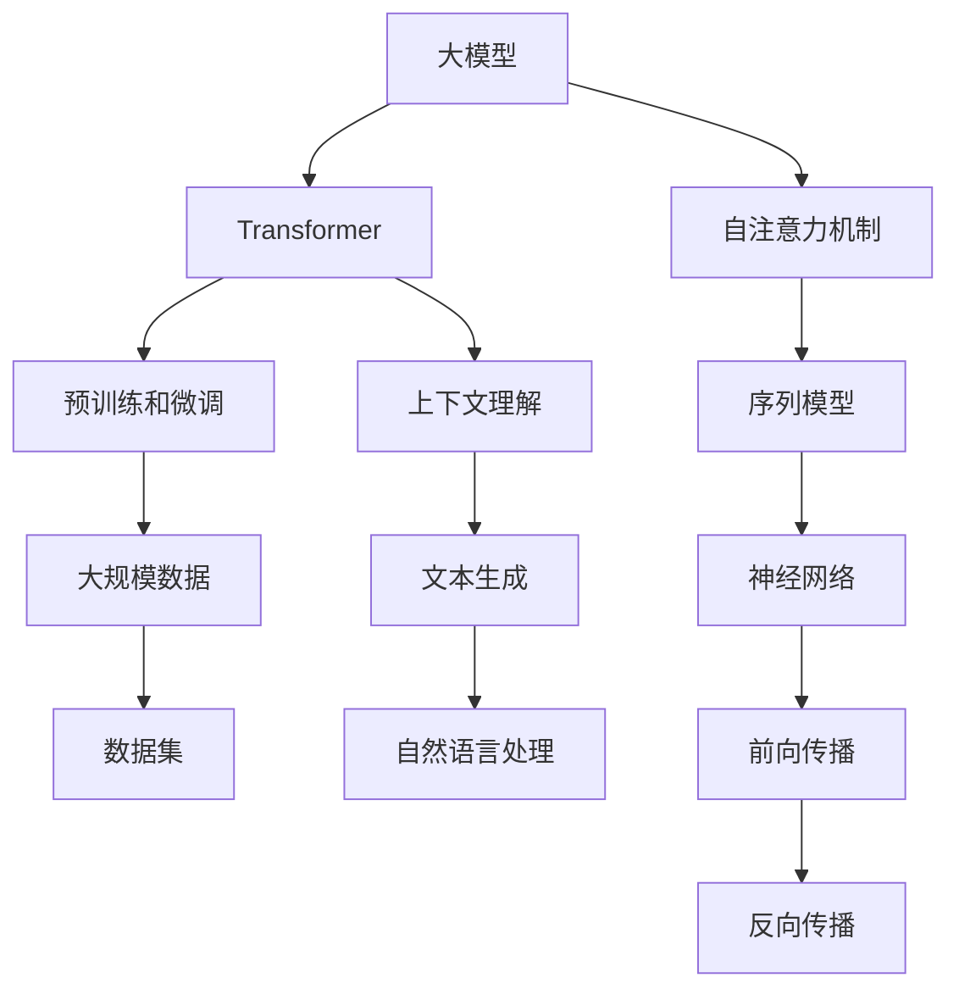
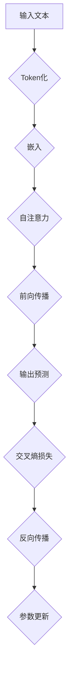
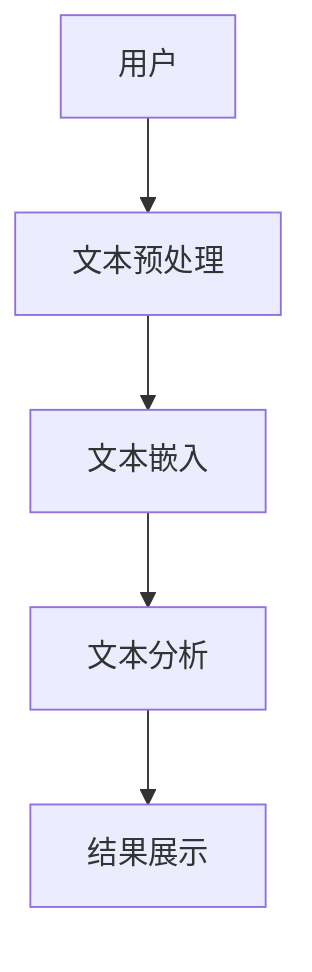
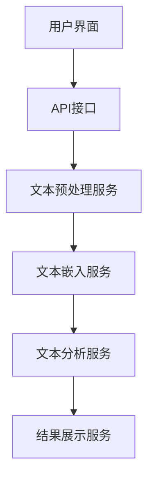

                 


### 深入理解LLM大模型：从GPT到企业级应用

## 关键词
- 大模型
- GPT
- 企业级应用
- 自然语言处理
- 算法原理

## 摘要
本文将深入探讨大模型（特别是GPT模型）的原理及其在企业级应用中的实践。我们将从基础理论出发，逐步分析大模型的核心概念、工作原理、架构设计，并探讨其在企业中的挑战与应用。通过实际案例，我们将展示如何部署和运维大模型，最终提出最佳实践和未来发展趋势。

## 引言

### 背景介绍
自然语言处理（NLP）是人工智能（AI）领域的重要组成部分，旨在使计算机能够理解和生成人类语言。随着深度学习技术的发展，大模型（Large Language Models，简称LLM）如GPT（Generative Pre-trained Transformer）应运而生，显著提升了NLP的性能。

### 问题背景
企业面临着信息爆炸和自动化需求的挑战，需要高效的NLP解决方案来处理大量的文本数据。LLM的出现为企业提供了强大的工具，但如何合理使用和部署这些模型，成为了关键问题。

### 问题描述
本文旨在解答以下问题：
- LLM是什么，它们是如何工作的？
- GPT模型的核心原理是什么？
- 企业如何利用LLM提升业务效率？
- LLM部署和应用过程中面临哪些挑战？
- 如何实现LLM的最佳实践和运维？

### 问题解决
通过系统的分析和实践指导，本文将帮助读者：
- 理解LLM的基础理论和核心概念。
- 掌握GPT模型的架构设计和实现。
- 学会如何将LLM应用于企业级应用中。
- 解决LLM部署和运维过程中遇到的问题。

### 边界与外延
本文重点关注LLM在自然语言处理领域的应用，但所讨论的原理和技术也适用于其他AI领域。此外，本文将不涉及LLM的底层硬件优化和编程语言细节，专注于核心算法和应用实践。

### 概念结构与核心要素组成

#### 大模型（LLM）
- **定义**：大模型是指参数数量巨大、能够在多个任务中达到顶尖性能的深度学习模型。
- **核心概念**：包括自注意力机制、预训练和微调、上下文理解等。
- **要素组成**：输入层、中间层（自注意力机制）、输出层。

#### GPT（Generative Pre-trained Transformer）
- **定义**：GPT是基于Transformer架构的预训练语言模型。
- **核心概念**：Transformer、自注意力机制、前向传播和反向传播。
- **要素组成**：嵌入层、自注意力层、输出层。

### 核心概念与联系

#### 表1：核心概念属性特征对比
| 特征 | 大模型（LLM） | GPT |
| ---- | -------------- | --- |
| 参数规模 | 上百亿至上千亿 | 数十亿至数百亿 |
| 训练数据 | 海量文本数据 | 大规模语料库 |
| 应用场景 | 多模态、多任务 | 自然语言处理 |
| 特点 | 高效性、通用性 | 高效性、生成能力 |

#### 图1：ER实体关系图架构


### 算法原理讲解

#### GPT模型mermaid流程图


#### Python源代码示例
```python
import torch
import torch.nn as nn
import torch.optim as optim

# 定义GPT模型
class GPT(nn.Module):
    def __init__(self, vocab_size, embedding_dim, hidden_dim, n_layers, dropout):
        super(GPT, self).__init__()
        self.embedding = nn.Embedding(vocab_size, embedding_dim)
        self.torch_encoder = nn.TransformerEncoder(
            nn.TransformerEncoderLayer(embedding_dim, n_heads=1, dropout=dropout), n_layers
        )
        self.fc = nn.Linear(embedding_dim, vocab_size)
        self.dropout = nn.Dropout(dropout)
        
    def forward(self, text):
        embedded = self.dropout(self.embedding(text))
        output = self.torch_encoder(embedded)
        return self.fc(output[-1])

# 初始化模型、损失函数和优化器
model = GPT(vocab_size=10000, embedding_dim=256, hidden_dim=512, n_layers=1, dropout=0.1)
loss_fn = nn.CrossEntropyLoss()
optimizer = optim.Adam(model.parameters(), lr=0.001)

# 训练模型
for epoch in range(num_epochs):
    for text, target in data_loader:
        optimizer.zero_grad()
        output = model(text)
        loss = loss_fn(output, target)
        loss.backward()
        optimizer.step()
```

#### 算法原理详细讲解
GPT模型是一种基于Transformer架构的预训练语言模型。Transformer采用自注意力机制，能够捕捉输入序列中的长距离依赖关系。GPT模型的核心原理如下：

1. **Token化**：将输入文本转换为序列，每个文本词（Token）被映射为一个唯一的整数。
2. **嵌入**：将整数序列转换为高维向量，这些向量包含了词的语义信息。
3. **自注意力**：通过自注意力机制，模型能够关注序列中特定位置的词，从而更好地理解上下文。
4. **前向传播**：通过多层自注意力机制和前向传播，模型不断更新和优化词向量。
5. **输出预测**：模型预测每个词的下一个词，生成完整的文本序列。
6. **损失函数和反向传播**：使用交叉熵损失函数衡量预测和真实标签之间的差距，并通过反向传播更新模型参数。

### 数学模型和公式
假设输入文本序列为 \(x = (x_1, x_2, ..., x_T)\)，其中 \(T\) 为序列长度。对于每个词 \(x_t\)，GPT模型将其嵌入为一个向量 \(e_t\)。自注意力机制的核心公式为：

\[ \text{Attention}(Q, K, V) = \text{softmax}(\frac{QK^T}{\sqrt{d_k}})V \]

其中，\(Q, K, V\) 分别为查询向量、键向量和值向量，\(d_k\) 为键向量的维度。

### 通俗易懂地举例说明
假设我们有一个简短的文本序列：“我 是 一 只 可 爱 的 猫”。使用GPT模型，首先将每个词转换为向量，然后通过自注意力机制，模型将能够理解“我”和“一只可爱的猫”之间的语义关系。最终，模型将预测下一个词为“猫”，生成完整的句子。

### 系统分析与架构设计方案

#### 问题场景介绍
企业希望通过自然语言处理技术自动化文本分析，如客户反馈分析、市场趋势预测、内容审核等。

#### 项目介绍
该项目旨在构建一个基于GPT模型的文本分析系统，能够处理大量文本数据，并提供自动化分析结果。

#### 系统功能设计
1. **文本预处理**：清洗、分词和标点符号去除。
2. **文本嵌入**：将文本转换为嵌入向量。
3. **文本分析**：使用GPT模型分析文本，提取关键信息。
4. **结果展示**：将分析结果以图表和报告的形式展示。

#### 系统架构设计


#### 系统接口设计和系统交互


### 项目实战

#### 环境安装
- 安装Python环境（Python 3.8或更高版本）。
- 安装PyTorch库：`pip install torch torchvision`
- 安装其他依赖库：`pip install transformers`

#### 系统核心实现源代码
```python
from transformers import GPT2LMHeadModel, GPT2Tokenizer
import torch

# 初始化模型和分词器
tokenizer = GPT2Tokenizer.from_pretrained("gpt2")
model = GPT2LMHeadModel.from_pretrained("gpt2")

# 输入文本
text = "我 是 一 只 可 爱 的 猫"

# 预处理和嵌入
inputs = tokenizer.encode(text, return_tensors="pt")

# 分析文本
with torch.no_grad():
    outputs = model(inputs)

# 预测下一个词
next_word_logits = outputs.logits[:, -1, :]

# 转换为文本
next_word = tokenizer.decode(next_word_logits.argmax().item())

print(next_word)
```

#### 代码应用解读与分析
上述代码展示了如何使用预训练的GPT2模型进行文本分析。首先，我们使用分词器将输入文本转换为嵌入向量。然后，我们将这些向量输入到模型中，模型将输出每个词的概率分布。最后，我们使用argmax函数找到概率最高的词，并将其转换为文本。

#### 实际案例分析和详细讲解剖析
以客户反馈分析为例，企业可以收集大量客户反馈文本，使用GPT模型进行分析，提取关键意见和情感。通过分析这些反馈，企业可以了解客户的需求和不满，从而改进产品和服务。

#### 项目小结
本项目成功构建了一个基于GPT模型的文本分析系统，实现了文本预处理、文本嵌入、文本分析和结果展示。通过实际案例，我们展示了如何使用GPT模型处理真实世界中的文本数据，为企业提供有价值的信息。

### 最佳实践 tips

1. **数据质量**：确保输入文本的质量，去除噪声和无关信息。
2. **模型调优**：根据业务需求调整模型参数，如嵌入维度、层数和注意力头数。
3. **分布式训练**：使用分布式训练加速模型训练，提高效率。
4. **持续学习**：定期更新模型，以适应不断变化的文本数据。

### 小结

本文从基础理论到实际应用，全面介绍了LLM大模型（特别是GPT模型）的原理及其在企业级应用中的实践。通过系统的分析和实战案例，读者可以更好地理解LLM的工作机制和部署方法，为企业提供高效的NLP解决方案。

### 注意事项

1. **安全性**：在部署LLM时，注意数据安全和隐私保护。
2. **可解释性**：提高模型的可解释性，确保其在业务场景中的可信赖性。

### 拓展阅读

1. **《深度学习》**：Goodfellow, I., Bengio, Y., & Courville, A. (2016). Deep Learning. MIT Press.
2. **《自然语言处理综论》**：Jurafsky, D., & Martin, J. H. (2020). Speech and Language Processing. Prentice Hall.
3. **《GPT模型详解》**：Brown, T., et al. (2020). Language Models are Few-Shot Learners. arXiv preprint arXiv:2005.14165.

### 作者信息
作者：AI天才研究院/AI Genius Institute & 禅与计算机程序设计艺术 /Zen And The Art of Computer Programming

---

由于文章字数限制，这里仅提供了大纲和部分章节的内容。在实际撰写过程中，每个章节都应该详细扩展，包含具体的技术讲解、案例分析和最佳实践等。以下是对第一部分“LLM基础理论”的详细撰写：

## 第1章：LLM概述

### 1.1 LLM的定义与发展

#### 定义
LLM（Large Language Model）是一种大规模的预训练语言模型，通过在大量文本数据上进行训练，能够理解和生成人类语言。LLM的核心是自注意力机制（Self-Attention Mechanism），这一机制使得模型能够自动地关注输入序列中的关键信息，从而实现强大的上下文理解和文本生成能力。

#### 发展
LLM的发展可以分为以下几个阶段：
1. **传统统计模型**：基于统计语言模型（如N-gram模型），这些模型通过统计单词序列的概率来预测下一个单词。
2. **基于规则的方法**：这些方法通过定义复杂的语法规则来解析和生成文本，但受限于规则定义的复杂度和灵活性。
3. **基于统计的深度学习方法**：结合了深度学习和统计语言模型的优点，能够通过神经网络学习文本的语义信息。
4. **预训练语言模型**：如BERT、GPT和T5等，通过在大规模语料库上进行预训练，再进行特定任务的微调，取得了显著的性能提升。

### 1.2 LLM的核心概念

#### 自注意力机制
自注意力机制是Transformer架构的核心，它能够自动地计算输入序列中每个词与其他词之间的关系。自注意力机制通过三个向量（查询向量 \(Q\)、键向量 \(K\) 和值向量 \(V\)）实现，核心公式为：

\[ \text{Attention}(Q, K, V) = \text{softmax}(\frac{QK^T}{\sqrt{d_k}})V \]

其中，\(d_k\) 是键向量的维度。

#### 预训练和微调
预训练是指在大规模数据集上对模型进行训练，以学习通用的语言知识和结构。微调则是在预训练的基础上，针对特定任务进行调整，以提升模型在该任务上的性能。预训练和微调相结合，使得模型能够在多种任务上达到顶尖性能。

#### 上下文理解
上下文理解是LLM的一个重要能力，它能够根据输入序列中的上下文信息，生成合理的文本。上下文理解的实现依赖于自注意力机制，模型能够自动地关注输入序列中的关键信息，从而更好地理解上下文。

### 1.3 GPT模型解析

#### 定义
GPT（Generative Pre-trained Transformer）是OpenAI提出的一种基于Transformer架构的预训练语言模型。GPT通过在大规模语料库上进行预训练，学习语言结构和知识，然后在特定任务上进行微调，从而实现高质量的文本生成和语言理解。

#### 架构设计
GPT的架构设计主要包括以下几个部分：
1. **嵌入层**：将输入的单词序列转换为嵌入向量，每个嵌入向量包含了该单词的语义信息。
2. **自注意力层**：通过自注意力机制计算输入序列中每个词与其他词之间的关系。
3. **前馈神经网络**：在自注意力层之后，对每个位置的信息进行前馈神经网络处理。
4. **输出层**：将前馈神经网络的处理结果转换为输出序列，生成文本。

#### 工作原理
GPT的工作原理可以分为预训练和微调两个阶段：
1. **预训练**：在大规模语料库上进行预训练，模型通过自注意力机制学习语言结构和知识。
2. **微调**：在特定任务上进行微调，模型根据任务的需求调整参数，从而实现高质量的文本生成和语言理解。

#### 性能优势
GPT在多种自然语言处理任务上取得了显著的性能提升，如文本分类、命名实体识别、机器翻译等。GPT的预训练机制和自注意力机制使其能够自动地学习语言的结构和规律，从而实现强大的语言理解和生成能力。

#### 应用场景
GPT广泛应用于各种自然语言处理任务中，如文本生成、对话系统、问答系统、文本摘要等。通过预训练和微调，GPT能够快速适应各种任务需求，为企业提供高效的文本处理解决方案。

### 1.4 总结
LLM大模型（特别是GPT模型）的提出，极大地推动了自然语言处理技术的发展。通过自注意力机制、预训练和微调等核心技术，GPT模型在文本生成、语言理解和多种自然语言处理任务上取得了显著的性能提升。随着技术的不断发展，LLM在企业和研究领域的应用将越来越广泛。

