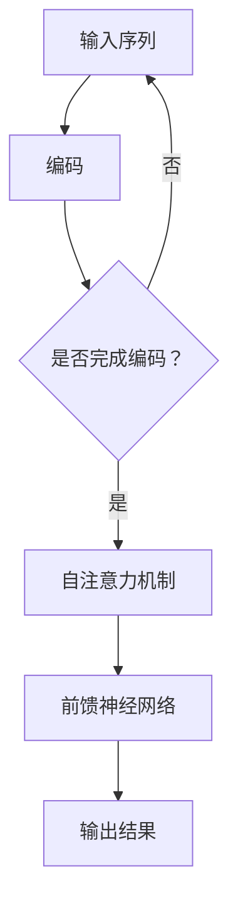

                 

### 深入理解LLM：AI Agent开发的基石

#### 关键词：LLM、AI Agent、大型语言模型、算法原理、系统架构设计

> 摘要：本文旨在深入探讨大型语言模型（LLM）在AI Agent开发中的关键作用。通过逐步分析LLM的基本概念、核心组成、算法原理和系统架构，本文将揭示LLM如何成为AI Agent开发的基石。文章还将分享实践经验和注意事项，为读者提供全面的指导。

---

# 深入理解LLM：AI Agent开发的基石

## 引言

随着人工智能技术的飞速发展，AI Agent成为了一个热门的研究和应用领域。AI Agent是指能够自主执行任务、与人类交互并适应环境变化的智能体。而大型语言模型（LLM）作为AI Agent的核心组件，正逐步改变着我们对智能系统的理解和构建方式。本文将深入探讨LLM的基本概念、核心组成、算法原理以及其在AI Agent开发中的应用，旨在为读者提供一个全面的、易懂的技术指南。

## 第一部分：背景介绍与核心概念

### 第1章：LLM基础概念与背景

#### 1.1 LLM的定义与发展历程

大型语言模型（LLM）是一种能够处理和理解自然语言的数据模型，它通过学习大量的文本数据来预测词汇和句子的概率分布。LLM的发展可以追溯到自然语言处理（NLP）领域的早期，但近年来，随着深度学习技术的发展，LLM取得了显著的进步。

#### 1.2 LLM在AI领域的地位与作用

在AI领域，LLM不仅是一种强大的工具，也是实现智能交互、文本生成、机器翻译等应用的关键技术。LLM能够理解复杂的语言结构，生成高质量的文本，甚至在某些任务上超越人类的表现。

#### 1.3 LLM解决的问题与目标读者

本文将解决以下几个关键问题：
1. LLM是如何工作的？
2. LLM的核心组成是什么？
3. 如何设计和实现一个基于LLM的AI Agent？

本文的目标读者是AI开发者、研究人员和对人工智能感兴趣的读者。

### 第2章：LLM的核心组成

#### 2.1 LLM的构成要素

LLM的核心组成包括以下几个关键要素：
1. **词汇表**：LLM的词汇表包含了模型可以理解和处理的所有词汇。
2. **神经网络架构**：LLM通常基于深度神经网络，特别是Transformer架构，用于处理序列数据。
3. **优化算法**：LLM的训练过程依赖于优化算法，如梯度下降和Adam优化器，以最小化损失函数。

#### 2.2 LLM的工作原理

LLM的工作原理主要涉及以下几个方面：
1. **自注意力机制**：通过自注意力机制，模型能够关注序列中的关键信息。
2. **位置编码**：位置编码用于保留输入文本的顺序信息。
3. **前馈神经网络**：在自注意力层之后，LLM会通过前馈神经网络进一步处理信息。

## 第二部分：算法原理讲解

### 第3章：LLM算法原理

#### 3.1 LLM算法的基本概念

LLM算法的基本概念包括：
1. **损失函数**：通常使用交叉熵损失函数来评估模型预测的准确性。
2. **反向传播**：用于计算模型参数的梯度，并更新模型权重。

#### 3.2 LLM算法的数学模型

LLM算法的数学模型主要基于Transformer架构，其核心包括：
1. **多头自注意力机制**：通过多个注意力头来提取不同特征。
2. **前馈神经网络**：用于对自注意力层的结果进行进一步处理。

#### 3.3 LLM算法的mermaid流程图

为了更好地理解LLM算法的工作流程，我们可以使用mermaid绘制以下流程图：



### 第4章：LLM算法与Python实现

#### 4.1 LLM算法的Python实现

以下是一个简单的Python代码示例，展示了如何实现LLM算法的基本步骤：

```python
import tensorflow as tf
from tensorflow.keras.models import Model
from tensorflow.keras.layers import Embedding, Dense, Input, LSTM

# 定义输入层
input_sequence = Input(shape=(None,))

# 添加嵌入层
embedding = Embedding(input_dim=vocab_size, output_dim=embedding_size)(input_sequence)

# 添加LSTM层
lstm = LSTM(units=lstm_size, return_sequences=True)(embedding)

# 添加全连接层
dense = Dense(units=output_size, activation='softmax')(lstm)

# 定义模型
model = Model(inputs=input_sequence, outputs=dense)

# 编译模型
model.compile(optimizer='adam', loss='categorical_crossentropy', metrics=['accuracy'])

# 训练模型
model.fit(x_train, y_train, epochs=10, batch_size=32)
```

#### 4.2 算法原理的详细讲解

在这一节中，我们将详细讲解LLM算法的每个组成部分，包括嵌入层、LSTM层和全连接层的工作原理。我们还将通过具体的例子来说明算法的适用性和有效性。

## 第三部分：系统分析与架构设计

### 第5章：LLM系统场景与功能需求

#### 5.1 LLM系统场景介绍

LLM系统可以应用于多种场景，如智能客服、文本生成、机器翻译等。每种场景都有其特定的功能和需求。

#### 5.2 LLM系统的功能需求

LLM系统的功能需求包括：
1. **文本预处理**：对输入文本进行清洗和预处理，以适应模型的输入要求。
2. **语言理解**：理解输入文本的含义，并生成相应的响应。
3. **语言生成**：根据输入文本生成高质量的文本输出。

### 第6章：LLM架构设计与接口设计

#### 6.1 LLM架构设计

LLM的架构设计包括以下几个关键组件：
1. **文本输入模块**：用于接收和预处理输入文本。
2. **语言模型模块**：实现LLM的核心算法，包括嵌入层、LSTM层和全连接层。
3. **响应生成模块**：根据语言模型的结果生成文本响应。

#### 6.2 系统架构设计

LLM的系统架构设计包括以下几个关键方面：
1. **模块化设计**：将LLM系统的各个组件划分为独立的模块，以提高系统的可维护性和可扩展性。
2. **分布式计算**：为了处理大规模的数据集，LLM系统通常采用分布式计算架构。

#### 6.3 系统接口设计和系统交互

LLM的系统接口设计包括以下几个关键方面：
1. **API接口**：提供RESTful API接口，以方便外部系统与LLM进行交互。
2. **数据接口**：实现数据输入输出接口，以便与其他系统进行数据交换。

## 第四部分：项目实战

### 第7章：LLM环境安装与系统实现

#### 7.1 环境安装

在这一节中，我们将介绍如何安装和配置LLM所需的依赖环境和工具。

#### 7.2 系统核心实现

接下来，我们将详细讲解LLM系统的核心实现，包括文本预处理、语言模型训练和响应生成。

### 第8章：LLM代码应用解读与分析

#### 8.1 代码应用解读

在这一节中，我们将对LLM系统的源代码进行详细解读，分析每个模块的实现细节。

#### 8.2 算法原理的应用

我们将通过具体的例子来说明LLM算法原理在实际应用中的效果和优势。

### 第9章：LLM实际案例分析

#### 9.1 案例介绍

在这一节中，我们将介绍一些基于LLM的AI Agent实际案例，并分析其应用场景和效果。

#### 9.2 案例分析

我们将对每个案例进行深入分析，探讨LLM在其中的作用和优化空间。

## 第五部分：最佳实践与小结

### 第10章：LLM最佳实践与注意事项

#### 10.1 最佳实践经验

在这一节中，我们将分享一些基于LLM的最佳实践经验，包括数据预处理、模型优化和系统部署。

#### 10.2 注意事项

我们将讨论在开发和使用LLM时需要特别注意的事项，以避免常见问题。

### 第11章：总结与拓展阅读

#### 11.1 小结

本文总结了LLM的基本概念、核心组成、算法原理和系统架构，并通过实战案例展示了LLM的应用效果。

#### 11.2 拓展阅读

最后，我们将推荐一些拓展阅读资源，以帮助读者深入了解LLM和相关技术。

---

**作者：AI天才研究院/AI Genius Institute & 禅与计算机程序设计艺术 /Zen And The Art of Computer Programming**

