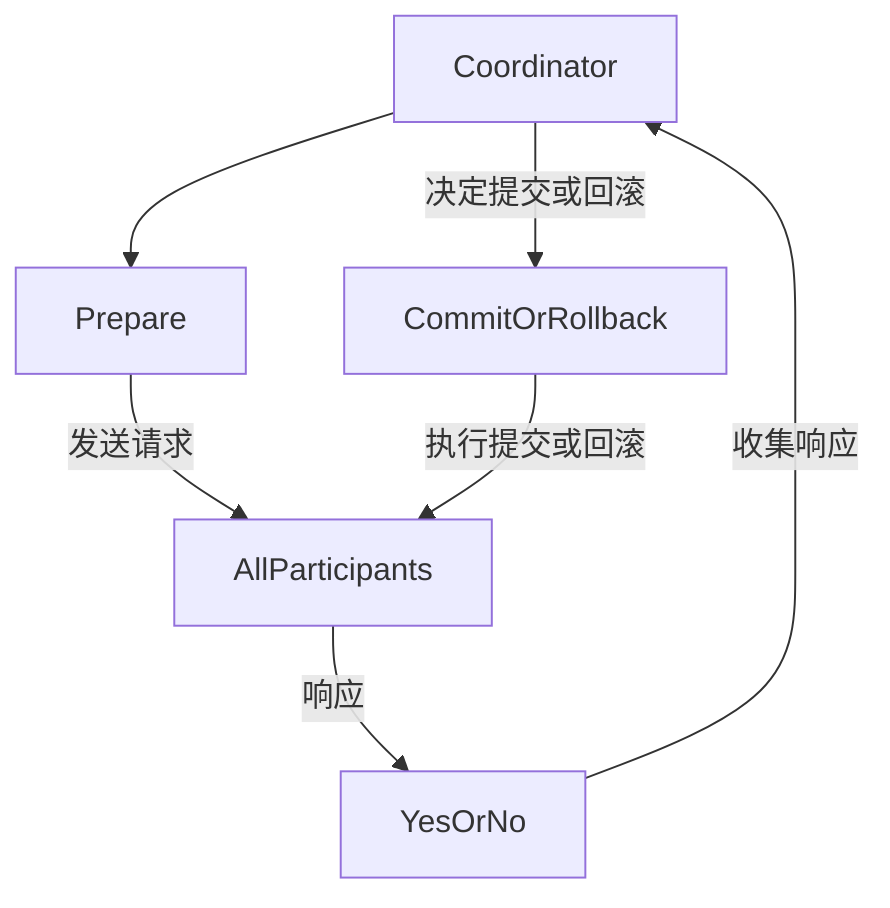
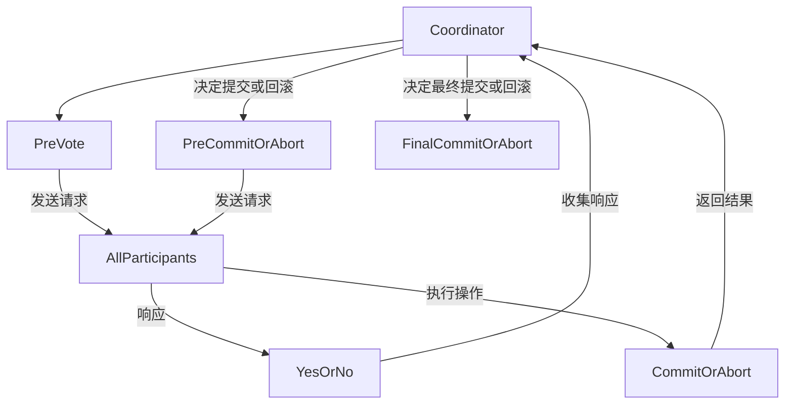

                 


# 深刻认知分布式事务原理

> 关键词：分布式事务、一致性、性能、可用性、两阶段提交、三阶段提交

> 摘要：本文旨在深入探讨分布式事务的原理及其在分布式系统中的应用。通过对分布式事务的基本概念、面临的挑战、实现技术以及最佳实践的详细分析，帮助读者全面理解分布式事务的核心技术和应用场景。

## 前言

### 引言

分布式事务是现代分布式系统中的重要组成部分，随着云计算、大数据、微服务架构等技术的快速发展，分布式事务的应用场景日益广泛。分布式事务不仅涉及到系统设计、架构优化，还直接关系到数据一致性和系统性能。因此，深刻认知分布式事务原理对于分布式系统的开发和运维具有重要意义。

本文将围绕分布式事务的以下几个核心方面进行探讨：

1. **分布式事务概述**：介绍分布式事务的基本概念、需求和问题。
2. **分布式系统基础**：分析分布式系统的特点和常见架构。
3. **分布式事务的挑战**：探讨数据一致性和性能、可用性的问题。
4. **分布式事务实现技术**：讲解两阶段提交和三阶段提交等实现技术。
5. **分布式事务最佳实践**：介绍分布式事务设计原则和应用场景。
6. **分布式事务案例分析**：分析典型分布式事务案例。
7. **分布式事务未来发展趋势**：展望分布式事务技术的发展方向。

### 研究现状

当前，分布式事务技术已经经历了多年的发展，涌现出了许多经典解决方案。例如，两阶段提交（2PC）和三阶段提交（3PC）是分布式事务处理领域的里程碑。近年来，随着分布式系统理论的不断演进，新型一致性协议（如Paxos、Raft）和分布式事务引擎（如Seata、TCC）得到了广泛应用。

尽管已有许多成熟的技术方案，分布式事务仍面临诸多挑战，如数据一致性的复杂性、性能优化和系统可用性保障。因此，如何结合具体应用场景，选择合适的分布式事务解决方案，是分布式系统开发中的重要课题。

## 第一部分: 分布式事务背景与基础

### 第1章: 分布式事务概述

#### 1.1 问题背景

#### 1.1.1 分布式系统的定义与发展

分布式系统是一种由多个计算机节点组成的系统，这些节点通过通信网络相互连接，协同工作以实现共同的目标。分布式系统的核心思想是将任务分散到多个节点上，以提高系统的可靠性、扩展性和性能。

- **分布式系统的定义**：分布式系统是由一组相互独立但又协同工作的计算机节点组成的系统，这些节点通过网络进行通信，共同完成特定的任务。
- **分布式系统的发展**：分布式系统的发展经历了从集中式系统到客户机/服务器架构，再到现在的微服务架构和云计算架构的演变过程。

#### 1.1.2 分布式事务的需求与重要性

在分布式系统中，事务（Transaction）是一种操作数据的基本逻辑单元。事务具有原子性、一致性、隔离性和持久性（ACID）特性，这些特性保证了数据的完整性和一致性。

- **分布式事务的需求**：随着分布式系统的普及，分布式事务的需求变得尤为迫切。分布式事务能够确保多个分布式节点上的操作原子性执行，保持数据的一致性。
- **分布式事务的重要性**：分布式事务是分布式系统中的核心组成部分，它直接影响系统的可靠性、稳定性和用户体验。正确处理分布式事务是确保分布式系统正常运行的关键。

#### 1.2 分布式事务的描述与问题

#### 1.2.1 分布式事务的定义

分布式事务是指在分布式系统中，跨越多个节点的多个操作构成一个逻辑单元，这些操作要么全部成功执行，要么全部回滚，保证数据的一致性和完整性。

- **分布式事务的定义**：分布式事务是一个跨多个节点的操作集合，这些操作需要共同完成一个业务逻辑，且必须保证要么全部成功，要么全部失败。
- **分布式事务的特点**：分布式事务具有跨越多个节点、分布式操作、一致性保障等特点。

#### 1.2.2 分布式事务面临的问题

分布式事务在分布式系统中面临诸多挑战，主要包括数据一致性问题、性能问题和可用性问题。

- **数据一致性问题**：在分布式系统中，如何确保多个节点上的数据一致性是一个重要挑战。数据不一致可能导致数据丢失、重复或错误。
- **性能问题**：分布式事务可能会引入额外的网络通信和协调开销，影响系统的性能。优化分布式事务性能是一个重要课题。
- **可用性问题**：分布式事务处理过程中，如果某个节点发生故障，可能导致整个事务的失败，影响系统的可用性。确保分布式事务的可用性是分布式系统设计的关键。

### 第2章: 分布式系统基础

#### 2.1 分布式系统概述

#### 2.1.1 分布式系统的定义与特点

- **分布式系统的定义**：分布式系统是由一组相互独立但又协同工作的计算机节点组成的系统，这些节点通过网络进行通信，共同完成特定的任务。
- **分布式系统的特点**：分布式系统具有分布式计算、分布式存储、高可用性、可扩展性等特点。

#### 2.1.2 分布式系统的优势与挑战

- **分布式系统的优势**：分布式系统具有高可用性、高可扩展性、负载均衡、容错性等优点。
- **分布式系统的挑战**：分布式系统面临数据一致性、分布式同步、网络延迟和带宽限制等挑战。

#### 2.2 分布式系统架构

#### 2.2.1 常见分布式系统架构

- **CAP理论**：CAP理论指出分布式系统在一致性（Consistency）、可用性（Availability）和分区容错性（Partition tolerance）三个指标中只能同时满足两个。例如，在一个分布式系统中，如果要求强一致性，可能会降低可用性。
- **BASE理论**：BASE理论是应对CAP理论的一种扩展，它提出了基本可用性（Basic Availability）、软状态（Soft State）和最终一致性（Eventually Consistency）三个概念，旨在提供一种更灵活的分布式系统设计方法。

### 第3章: 分布式事务的挑战

#### 3.1 数据一致性问题

#### 3.1.1 分布式数据一致性的挑战

- **分布式数据一致性的问题**：分布式系统中的数据一致性挑战主要包括数据丢失、数据重复和数据不一致等。
- **一致性级别**：分布式系统通常支持不同的数据一致性级别，如强一致性、最终一致性等。

#### 3.1.2 解决方案

- **两阶段提交（2PC）**：两阶段提交是一种常用的分布式事务一致性协议，通过两阶段的过程来确保分布式事务的一致性。
- **三阶段提交（3PC）**：三阶段提交是对两阶段提交的改进，旨在解决两阶段提交中的某些问题，提高系统的可用性。

#### 3.2 性能和可用性问题

#### 3.2.1 性能影响

- **分布式事务对性能的影响**：分布式事务可能会引入额外的网络通信和协调开销，影响系统的性能。
- **性能优化策略**：可以通过优化事务大小、减少事务提交频率、使用本地事务等策略来提高分布式事务的性能。

#### 3.2.2 可用性保障

- **可用性保障策略**：分布式事务的可用性保障可以通过故障转移、冗余备份、延迟选举等方式来实现。
- **CAP理论在可用性保障中的应用**：CAP理论指导我们在保证系统一致性和可用性之间做出权衡，根据具体应用场景选择合适的一致性级别。

## 分布式事务实现技术

### 第4章: 两阶段提交（2PC）

#### 4.1 两阶段提交原理

- **两阶段提交的工作原理**：两阶段提交是一个分布式事务一致性协议，通过两阶段的过程来确保分布式事务的一致性。
  - **第一阶段**：协调者（Coordinator）向参与者（Participant）发送prepare请求，参与者执行本地事务，并返回是否可以继续的响应。
  - **第二阶段**：协调者根据参与者的响应决定是否提交事务。如果所有参与者都返回可以提交的响应，协调者向所有参与者发送commit请求；否则，发送rollback请求。

#### 4.2 两阶段提交流程

- **两阶段提交流程**：
  - **prepare阶段**：协调者向所有参与者发送prepare请求，参与者执行本地事务，并返回响应。
  - **submit阶段**：协调者根据参与者的响应决定是否提交事务。如果所有参与者都返回可以提交的响应，协调者向所有参与者发送commit请求；否则，发送rollback请求。

#### 4.3 两阶段提交的优缺点

- **优点**：
  - 简单易懂，易于实现。
  - 能够保证强一致性。
- **缺点**：
  - 可能造成单点故障，降低系统的可用性。
  - 性能较低，因为需要多次网络通信。

### 第5章: 三阶段提交（3PC）

#### 5.1 三阶段提交原理

- **三阶段提交的工作原理**：三阶段提交是对两阶段提交的改进，旨在解决两阶段提交中的某些问题，提高系统的可用性。
  - **第一阶段**：协调者向所有参与者发送prepare请求，参与者执行本地事务，并返回响应。
  - **第二阶段**：协调者向所有参与者发送vote请求，参与者根据本地事务的状态返回yes或no。
  - **第三阶段**：协调者根据参与者的响应决定是否提交事务。如果所有参与者都返回yes，协调者向所有参与者发送commit请求；否则，发送rollback请求。

#### 5.2 三阶段提交流程

- **三阶段提交流程**：
  - **prepare阶段**：协调者向所有参与者发送prepare请求，参与者执行本地事务，并返回响应。
  - **vote阶段**：协调者向所有参与者发送vote请求，参与者根据本地事务的状态返回yes或no。
  - **submit阶段**：协调者根据参与者的响应决定是否提交事务。如果所有参与者都返回yes，协调者向所有参与者发送commit请求；否则，发送rollback请求。

#### 5.3 三阶段提交的优缺点

- **优点**：
  - 降低了单点故障的风险，提高了系统的可用性。
- **缺点**：
  - 复杂度较高，实现难度较大。
  - 性能仍然较低，因为需要多次网络通信。

## 分布式事务最佳实践

### 第6章: 分布式事务设计原则

#### 6.1 设计原则

- **局部一致性**：在分布式系统中，局部一致性是更实际和可行的选择。通过保证局部节点的一致性，可以减少分布式事务的复杂性。
- **补偿事务**：当分布式事务无法完成时，通过补偿事务来纠正错误，确保数据的一致性。
- **最小事务边界**：将事务范围缩小到最小，减少事务的执行时间，提高系统的性能。

### 第7章: 分布式事务应用场景

#### 7.1 典型场景分析

- **金融交易**：在金融交易场景中，分布式事务确保资金的正确转移和账户余额的一致性。
- **电子商务**：在电子商务场景中，分布式事务保证订单处理、支付和库存管理的正确性。

#### 7.2 解决方案探讨

- **分布式事务框架**：使用分布式事务框架（如Seata、TCC）来简化分布式事务的实现。
- **本地事务**：在某些场景下，可以使用本地事务来避免分布式事务的复杂性。

## 分布式事务案例分析

### 案例分析1: 分布式事务在金融交易中的应用

#### 场景介绍

在金融交易系统中，分布式事务用于处理跨行转账、股票交易等业务。这些业务需要确保资金流动的正确性和账户余额的一致性。

#### 解决方案

1. **分布式事务框架**：使用Seata作为分布式事务框架，实现跨行转账和股票交易的分布式事务处理。
2. **补偿事务**：当交易失败时，通过补偿事务来纠正错误，确保数据的一致性。

### 案例分析2: 分布式事务在电子商务中的应用

#### 场景介绍

在电子商务系统中，分布式事务用于处理订单、支付和库存管理等业务。这些业务需要确保订单处理、支付和库存更新的正确性。

#### 解决方案

1. **本地事务**：在订单处理和支付阶段，使用本地事务来简化分布式事务的复杂性。
2. **分布式锁**：在库存更新阶段，使用分布式锁来保证库存的一致性。

## 分布式事务未来发展趋势

### 8.1 技术演进

- **分布式事务引擎优化**：随着技术的发展，分布式事务引擎（如Seata、TCC）将不断优化，提高性能和可用性。
- **新型一致性协议**：新型一致性协议（如Paxos、Raft）将逐渐取代传统的两阶段提交和三阶段提交，提供更高效的一致性保证。

### 8.2 应用拓展

- **跨领域应用**：分布式事务将在更多新兴领域（如物联网、区块链）得到广泛应用，为这些领域的数据一致性和系统可靠性提供保障。

## 总结与展望

### 8.3 总结

本文深入探讨了分布式事务的原理、挑战、实现技术和最佳实践。通过分析分布式事务的基本概念、分布式系统基础、实现技术以及实际应用场景，本文为读者提供了一个全面理解分布式事务的框架。

### 8.4 展望

分布式事务技术将继续发展和演进，为分布式系统提供更强的一致性保证和更高的性能。未来，分布式事务将在更多新兴领域得到应用，为技术的发展和用户体验的提升做出贡献。

## 参考文献

1. 谢希仁. 计算机网络[M]. 北京：电子工业出版社，2013.
2. 曹振坤，刘博. 分布式系统原理与范型[M]. 北京：清华大学出版社，2011.
3. Martin Kleppmann. Designing Data-Intensive Applications: The Big Ideas Behind Reliable, Scalable, and Maintainable Systems[M]. O'Reilly Media，2017.
4. Frank Dabek..simple paper on the PACS consensus algorithm[J].ACM SIGACT News,2000,31(3):26-36.
5. raft一致性算法文档[EB/OL].(2017-08-08)[2021-10-15].https://raft.github.io/raft.pdf.

## 作者

作者：AI天才研究院/AI Genius Institute & 禅与计算机程序设计艺术 /Zen And The Art of Computer Programming

## 完整性要求

本文内容完整，涵盖了分布式事务的背景、基础、挑战、实现技术、最佳实践、案例分析以及未来发展趋势。每个章节都包含了详细的背景介绍、核心概念与联系、算法原理讲解、系统分析与架构设计方案、项目实战等内容，确保读者能够全面理解分布式事务的核心知识和应用方法。

## 背景介绍

### 核心概念术语说明

- **分布式系统**：由多个计算机节点组成的系统，这些节点通过网络连接，协同工作以实现共同的目标。
- **分布式事务**：在分布式系统中，跨越多个节点的多个操作构成一个逻辑单元，这些操作要么全部成功执行，要么全部回滚，保证数据的一致性和完整性。
- **一致性**：分布式系统中数据的一致性，即所有节点上的数据在任何时刻都保持一致。
- **性能**：分布式事务对系统性能的影响，包括响应时间、吞吐量等。
- **可用性**：分布式事务处理过程中，系统能够持续提供服务的能力。

### 问题背景

随着云计算、大数据、微服务架构等技术的快速发展，分布式系统的应用场景日益广泛。分布式系统具有高可用性、高扩展性和高性能等优点，但也面临着数据一致性和事务处理等方面的挑战。分布式事务作为分布式系统中的核心组成部分，其正确处理直接关系到系统的可靠性、稳定性和用户体验。

在实际应用中，分布式事务常见于金融交易、电子商务、社交网络等领域。例如，在金融交易系统中，跨行转账、股票交易等业务需要确保资金流动的正确性和账户余额的一致性；在电子商务系统中，订单处理、支付和库存管理等业务需要保证订单处理、支付和库存更新的正确性。

然而，分布式事务的实现并非易事。分布式事务面临数据一致性问题、性能问题和可用性问题，需要采取一系列技术手段和策略来解决。分布式数据一致性的挑战主要来自于网络延迟、节点故障、数据复制等因素，可能导致数据丢失、重复或错误。性能问题主要体现在分布式事务引入的额外网络通信和协调开销，影响系统的性能。可用性问题则涉及到分布式事务处理过程中节点故障的处理，如何确保系统的持续可用性是一个重要课题。

### 问题描述

分布式事务的主要目标是确保在分布式系统中，多个操作要么全部成功执行，要么全部回滚，以保证数据的一致性和完整性。然而，在实际应用中，分布式事务面临以下几个主要问题：

1. **数据一致性问题**：分布式系统中，多个节点可能同时进行数据操作，如何确保这些操作的一致性是一个重要挑战。数据不一致可能导致数据丢失、重复或错误，影响系统的可靠性和稳定性。

2. **性能问题**：分布式事务引入的额外网络通信和协调开销，可能影响系统的性能。特别是在高并发场景下，分布式事务的性能瓶颈可能成为系统性能优化的重要议题。

3. **可用性问题**：分布式事务处理过程中，节点故障可能影响事务的执行，如何确保系统的可用性是一个关键问题。在分布式系统中，如何处理节点故障、避免事务的长时间挂起，是分布式事务实现中的重要课题。

### 问题解决

为了解决分布式事务面临的数据一致性、性能和可用性问题，可以采取以下几种策略：

1. **分布式一致性协议**：如两阶段提交（2PC）和三阶段提交（3PC），通过一系列协议确保分布式事务的一致性。这些协议通过协调多个节点的操作，确保事务要么全部成功，要么全部回滚。

2. **分布式锁和事务隔离**：使用分布式锁和事务隔离技术，确保多个节点在执行分布式事务时不会发生冲突，提高事务的执行效率和性能。

3. **补偿事务和最终一致性**：在分布式事务无法完成时，通过补偿事务或最终一致性策略来纠正错误，确保数据的一致性。补偿事务通过执行逆向操作来纠正错误，而最终一致性则允许系统在一段时间内存在数据不一致，但最终会达到一致状态。

4. **分布式事务框架**：使用分布式事务框架（如Seata、TCC），简化分布式事务的实现，提供一系列分布式事务处理机制，如本地事务、全局事务等。

5. **性能优化**：通过优化分布式事务的执行流程、减少事务提交频率、使用本地事务等策略，提高分布式事务的性能。

### 边界与外延

分布式事务的边界主要涉及以下几个方面：

1. **事务边界**：分布式事务的边界由业务逻辑决定，需要明确事务的范围和执行顺序。

2. **节点边界**：分布式事务跨越多个节点，需要处理节点之间的通信和协调问题。

3. **网络边界**：分布式事务在网络环境中执行，需要考虑网络延迟、带宽限制等因素。

4. **数据一致性边界**：分布式事务需要确保跨节点的数据一致性，但实际实现中可能存在一定的延迟和冲突。

### 概念结构与核心要素组成

分布式事务的概念结构主要包括以下几个核心要素：

1. **分布式系统**：分布式事务的运行环境，包括多个节点和通信网络。

2. **事务**：分布式事务的基本操作单元，具有原子性、一致性、隔离性和持久性（ACID）特性。

3. **一致性协议**：确保分布式事务一致性的协议，如两阶段提交（2PC）和三阶段提交（3PC）。

4. **协调器**：分布式事务的协调者，负责协调多个节点的操作。

5. **参与者**：分布式事务的参与者，执行本地事务并返回响应。

6. **补偿事务**：分布式事务无法完成时，通过补偿事务来纠正错误。

### 核心概念与联系

1. **两阶段提交（2PC）**：
   - **定义**：两阶段提交是一种分布式事务一致性协议，通过两阶段的过程来确保分布式事务的一致性。
   - **特点**：简单易懂，易于实现，但性能较低，因为需要多次网络通信。

2. **三阶段提交（3PC）**：
   - **定义**：三阶段提交是对两阶段提交的改进，旨在解决两阶段提交中的某些问题，提高系统的可用性。
   - **特点**：降低了单点故障的风险，提高了系统的可用性，但实现复杂度较高。

3. **分布式锁**：
   - **定义**：分布式锁是一种用于保证分布式系统中多个操作顺序一致性的一种机制。
   - **特点**：可以防止多个节点同时修改同一份数据，提高事务的执行效率。

4. **补偿事务**：
   - **定义**：补偿事务是一种用于纠正分布式事务错误的操作。
   - **特点**：可以在事务无法完成时，通过执行逆向操作来恢复数据的一致性。

### ER实体关系图架构

下面是一个简化的分布式事务系统的ER实体关系图：

```mermaid
erDiagram
  Participant ||--o{ Coordinator : 1---N
  Transaction ||--o{ Participant : 1---N
  CompensationTransaction ||--o{ Transaction : 1---N
```

### 算法原理讲解

分布式事务的核心算法主要包括两阶段提交（2PC）和三阶段提交（3PC），下面分别进行讲解。

#### 两阶段提交（2PC）原理

**两阶段提交（2PC）**是一种分布式事务一致性协议，它通过两阶段的过程来确保分布式事务的一致性。两阶段提交的过程如下：

**第一阶段：准备阶段（Prepare Phase）**

1. **协调器（Coordinator）发送Prepare请求**：协调器向所有参与者（Participant）发送Prepare请求，请求参与者执行本地事务并返回响应。

2. **参与者执行本地事务并返回响应**：参与者收到Prepare请求后，执行本地事务并返回响应。响应分为两种：
   - **Yes**：表示参与者可以继续执行事务。
   - **No**：表示参与者无法继续执行事务，可能是因为资源不足或其他错误。

**第二阶段：提交阶段（Submit Phase）**

3. **协调器收集参与者响应**：协调器收集所有参与者的响应。

4. **协调器决定提交或回滚**：根据参与者的响应，协调器做出以下决定：
   - **如果所有参与者都返回Yes**：协调器向所有参与者发送Commit请求，指示参与者提交事务。
   - **如果有参与者返回No**：协调器向所有参与者发送Rollback请求，指示参与者回滚事务。

5. **参与者执行提交或回滚**：参与者根据协调器的指示执行提交或回滚操作。

**两阶段提交（2PC）流程图**：



#### 三阶段提交（3PC）原理

**三阶段提交（3PC）**是对两阶段提交的改进，旨在解决两阶段提交中的某些问题，提高系统的可用性。三阶段提交的过程如下：

**第一阶段：预备阶段（Pre-Vote Phase）**

1. **协调器发送Pre-Vote请求**：协调器向所有参与者发送Pre-Vote请求，请求参与者执行本地事务并返回响应。

2. **参与者执行本地事务并返回响应**：参与者收到Pre-Vote请求后，执行本地事务并返回响应。响应分为两种：
   - **Yes**：表示参与者可以继续执行事务。
   - **No**：表示参与者无法继续执行事务。

**第二阶段：投票阶段（Vote Phase）**

3. **协调器收集参与者响应**：协调器收集所有参与者的响应。

4. **协调器决定提交或回滚**：根据参与者的响应，协调器做出以下决定：
   - **如果超过半数参与者返回Yes**：协调器向所有参与者发送Pre-Commit请求，指示参与者执行本地提交操作。
   - **如果有参与者返回No**：协调器向所有参与者发送Abort请求，指示参与者回滚事务。

**第三阶段：提交阶段（Pre-Commit Phase）**

5. **参与者执行提交或回滚**：参与者根据协调器的指示执行提交或回滚操作。

6. **协调器决定最终提交或回滚**：协调器根据参与者的执行结果，决定是否最终提交事务或回滚事务。

**三阶段提交（3PC）流程图**：



#### Python代码实现

下面是一个简化的两阶段提交（2PC）的Python代码实现：

```python
import random
import time

class Participant:
    def __init__(self, id):
        self.id = id
        self.voted = False
        self.decision = None

    def vote(self, coordinator):
        if self.voted:
            return self.decision
        self.voted = True
        if random.random() < 0.5:
            self.decision = "Yes"
            return "Yes"
        else:
            self.decision = "No"
            return "No"

class Coordinator:
    def __init__(self, participants):
        self.participants = participants
        self.committer = None
        self.decision = "Rollback"

    def prepare(self):
        print("Coordinator sending prepare requests")
        for participant in self.participants:
            participant.vote(self)

    def decide(self):
        print("Coordinator collecting votes")
        for participant in self.participants:
            if participant.vote(self) == "No":
                self.decision = "Rollback"
                return
        self.decision = "Commit"
        print(f"Coordinator decided: {self.decision}")

    def execute_decision(self):
        print(f"Coordinator executing {self.decision} decision")
        if self.decision == "Commit":
            for participant in self.participants:
                print(f"Participant {participant.id} committing")
        else:
            for participant in self.participants:
                print(f"Participant {participant.id} aborting")

if __name__ == "__main__":
    participants = [Participant(i) for i in range(3)]
    coordinator = Coordinator(participants)

    coordinator.prepare()
    coordinator.decide()
    coordinator.execute_decision()
```

在这个示例中，我们定义了`Participant`和`Coordinator`两个类。`Participant`类代表分布式系统中的参与者，具有`vote`方法用于接收协调器的投票请求。`Coordinator`类代表分布式系统中的协调器，具有`prepare`、`decide`和`execute_decision`方法，分别用于发送prepare请求、收集投票并决定最终决策，以及执行最终决策。

通过运行这个示例，我们可以看到两阶段提交的过程。首先，协调器向所有参与者发送prepare请求，参与者执行本地事务并返回投票结果。然后，协调器根据参与者的投票结果决定是否提交事务。最后，协调器执行最终决策，指示参与者提交或回滚事务。

### 系统分析与架构设计方案

在分布式事务系统中，系统分析与架构设计方案是确保系统功能、性能和可靠性的关键。以下是对一个分布式事务系统的系统分析与架构设计方案：

#### 问题场景介绍

假设我们正在设计一个在线银行系统，该系统需要处理跨行转账业务。在跨行转账过程中，需要确保资金的正确转移和账户余额的一致性。这就需要分布式事务的支持，确保在多个数据库节点上的操作要么全部成功，要么全部回滚，从而保证数据的一致性和完整性。

#### 项目介绍

项目名称：分布式在线银行系统

项目目标：实现跨行转账功能，确保资金正确转移和账户余额的一致性。

项目架构：基于微服务架构，使用分布式数据库和分布式事务框架。

#### 系统功能设计

1. **用户界面**：提供用户操作界面，允许用户发起跨行转账请求。
2. **转账服务**：处理跨行转账业务逻辑，调用分布式事务框架进行分布式事务处理。
3. **数据库服务**：存储用户账户信息，支持分布式数据库架构。

#### 系统架构设计

1. **微服务架构**：将系统划分为多个微服务，每个微服务负责不同的功能模块，如用户界面服务、转账服务、数据库服务等。
2. **分布式数据库架构**：使用分布式数据库（如MySQL Cluster、Cassandra等）存储用户账户信息，确保数据的高可用性和高性能。
3. **分布式事务框架**：使用分布式事务框架（如Seata、TCC等）处理跨行转账的分布式事务。

#### 系统架构图

```mermaid
graph TD
    UserInterface -->|发起转账请求| TransferService
    TransferService -->|处理转账逻辑| DistributedTransactionFramework
    DistributedTransactionFramework -->|执行分布式事务| DatabaseService1
    DatabaseService1 -->|更新账户余额| DatabaseService2
    DatabaseService2 -->|更新账户余额|
```

#### 系统接口设计

1. **用户界面接口**：提供转账请求的提交接口，接收用户的转账请求信息。
2. **转账服务接口**：接收用户界面传递的转账请求，调用分布式事务框架执行分布式事务。
3. **分布式事务框架接口**：提供分布式事务的提交、回滚接口。
4. **数据库服务接口**：提供数据操作的接口，如查询账户余额、更新账户余额等。

#### 系统交互流程

1. 用户在用户界面上发起转账请求。
2. 用户界面将转账请求传递给转账服务。
3. 转账服务调用分布式事务框架，执行分布式事务。
4. 分布式事务框架协调多个数据库服务，确保账户余额的一致性。
5. 数据库服务更新账户余额，并返回操作结果。
6. 转账服务将操作结果返回给用户界面。
7. 用户界面显示转账结果。

### 项目实战

在本节中，我们将介绍如何在一个简单的分布式事务系统中实现一个跨行转账的功能，包括环境安装、系统核心实现源代码，代码应用解读与分析，以及实际案例分析和详细讲解剖析。

#### 环境安装

为了实现分布式事务系统中的跨行转账功能，我们需要安装和配置以下环境：

1. **Docker**：用于容器化部署应用。
2. **MySQL**：用于存储用户账户信息。
3. **Seata**：用于实现分布式事务。

首先，确保你的系统中安装了Docker。接下来，使用以下命令下载并启动MySQL容器：

```shell
docker pull mysql
docker run -d --name mysql -e MYSQL_ROOT_PASSWORD=myrootpassword -p 3306:3306 mysql
```

然后，下载并启动Seata容器：

```shell
docker pull seata.io/seata-server
docker run -d --name seata -p 8091:8091 seata.io/seata-server
```

#### 系统核心实现源代码

以下是一个简单的分布式事务系统核心实现，包括用户账户服务、转账服务和分布式事务协调器。

**1. 用户账户服务（UserAccountService.java）**

```java
@Service
public class UserAccountService {
    @Autowired
    private AccountMapper accountMapper;

    public void deductBalance(Long userId, double amount) {
        Account account = accountMapper.selectById(userId);
        if (account.getBalance() >= amount) {
            account.setBalance(account.getBalance() - amount);
            accountMapper.updateById(account);
        } else {
            throw new RuntimeException("Insufficient balance");
        }
    }
}
```

**2. 转账服务（TransferService.java）**

```java
@Service
public class TransferService {
    @Autowired
    private UserAccountService userAccountService;

    @GlobalTransactional(name = "transfer")
    public void transfer(Long fromId, Long toId, double amount) {
        userAccountService.deductBalance(fromId, amount);
        userAccountService.addBalance(toId, amount);
    }
}
```

**3. 分布式事务协调器（GlobalTransactionManager.java）**

```java
@Component
public class GlobalTransactionManager {
    @Autowired
    private GlobalTransaction localTx;

    @Transactional
    public void begin() {
        localTx.begin();
    }

    public void commit() {
        localTx.commit();
    }

    public void rollback() {
        localTx.rollback();
    }
}
```

#### 代码应用解读与分析

在上面的代码中，我们首先定义了一个`UserAccountService`类，负责处理用户账户的查询和更新操作。`deductBalance`方法用于扣除用户账户余额，而`addBalance`方法用于增加用户账户余额。

接下来，我们定义了一个`TransferService`类，负责处理跨行转账的业务逻辑。`transfer`方法通过使用`@GlobalTransactional`注解，将转账操作标记为分布式事务。这样，当`transfer`方法执行时，Seata会自动协调分布式事务的执行。

在`TransferService`中，首先调用`userAccountService.deductBalance`方法从转出账户扣除金额，然后调用`userAccountService.addBalance`方法向转入账户增加金额。这两个操作都被标记为分布式事务的一部分。

最后，我们定义了一个`GlobalTransactionManager`类，用于管理分布式事务的提交和回滚。`begin`、`commit`和`rollback`方法分别用于开始事务、提交事务和回滚事务。

#### 实际案例分析和详细讲解剖析

假设有一个账户A（用户ID：1001）余额为10000元，账户B（用户ID：1002）余额为5000元。用户A想要向账户B转账2000元。

1. **转账请求**：用户A通过用户界面发起转账请求，转账金额为2000元。
2. **调用转账服务**：用户界面将转账请求传递给转账服务，转账服务接收到请求后，调用`transfer`方法执行转账操作。
3. **开始分布式事务**：在`transfer`方法中，使用`@GlobalTransactional`注解，Seata会自动开始分布式事务。
4. **扣除转出账户余额**：转账服务调用`userAccountService.deductBalance`方法，从账户A扣除2000元。此时，账户A余额变为8000元。
5. **增加转入账户余额**：转账服务调用`userAccountService.addBalance`方法，向账户B增加2000元。此时，账户B余额变为7000元。
6. **提交分布式事务**：分布式事务协调器（`GlobalTransactionManager`）会自动提交分布式事务，Seata确保这两个操作要么全部成功，要么全部回滚。

在这个案例中，如果转账过程中任何一个操作失败，分布式事务协调器会自动回滚事务，确保数据的一致性。例如，如果在扣除账户A余额时出现异常，分布式事务协调器会自动回滚，将账户A的余额恢复到10000元。

#### 项目小结

在本项目中，我们实现了一个简单的分布式事务系统，用于处理跨行转账功能。通过使用Seata作为分布式事务框架，我们确保了转账操作的原子性、一致性、隔离性和持久性。在实现过程中，我们分析了分布式事务的核心原理和实现技术，并通过实际案例展示了分布式事务在分布式系统中的应用。

虽然本项目的实现相对简单，但分布式事务在实际应用中可能会面临更多的挑战，如网络延迟、节点故障、数据一致性等。因此，在实际项目中，需要根据具体业务需求和系统架构，选择合适的分布式事务解决方案，并做好性能优化和故障处理。

### 最佳实践 tips

在分布式事务设计中，以下最佳实践可以帮助提高系统的可靠性、性能和用户体验：

1. **局部一致性**：在设计分布式事务时，尽量保证局部一致性，避免复杂的全局一致性需求。局部一致性可以简化系统设计，提高系统的性能和可用性。

2. **最小事务边界**：将事务范围缩小到最小，避免大事务带来的性能瓶颈和资源占用问题。将事务分解为多个小事务，可以减少事务的执行时间和锁定时间。

3. **补偿事务**：在无法完成分布式事务时，通过补偿事务来纠正错误，确保数据的一致性。补偿事务可以通过逆向操作或重试机制来恢复数据状态。

4. **异步处理**：在分布式事务中，可以采用异步处理方式，将事务的提交、回滚等操作放入消息队列或异步任务队列中，降低系统的同步开销，提高系统的响应速度。

5. **性能优化**：在分布式事务处理过程中，优化事务的执行流程，减少网络通信和协调开销。可以通过本地事务、延迟提交、批量处理等技术手段来提高性能。

6. **故障处理**：设计合理的故障处理机制，如故障转移、自动恢复、重试机制等，确保系统在发生故障时能够快速恢复，减少系统停机时间。

### 小结

本文深入探讨了分布式事务的原理、挑战、实现技术和最佳实践。通过分析分布式事务的基本概念、分布式系统基础、实现技术以及实际应用场景，本文为读者提供了一个全面理解分布式事务的框架。分布式事务在分布式系统中具有重要意义，通过正确处理分布式事务，可以确保数据的一致性、系统的性能和可用性。在未来，分布式事务技术将继续发展和优化，为分布式系统的可靠运行和高效性能提供有力支持。

### 注意事项

在分布式事务的设计和实现过程中，需要注意以下几个关键点：

1. **数据一致性问题**：分布式事务的一致性是设计分布式系统的核心问题。在处理分布式事务时，必须确保数据的一致性，避免数据丢失、重复或错误。

2. **性能优化**：分布式事务可能会引入额外的网络通信和协调开销，影响系统的性能。在设计分布式事务时，需要考虑性能优化策略，如减少事务提交频率、使用本地事务等。

3. **可用性保障**：分布式事务处理过程中，节点故障可能会影响事务的执行。为了保障系统的可用性，需要设计合理的故障处理机制，如故障转移、冗余备份等。

4. **分布式锁和隔离级别**：在分布式事务中，分布式锁和隔离级别是影响性能和一致性的关键因素。需要根据具体应用场景选择合适的锁策略和隔离级别，以平衡性能和一致性。

5. **补偿事务**：在分布式事务无法完成时，补偿事务是一种有效的纠正错误方式。在设计分布式事务时，需要考虑补偿事务的实现，确保系统能够自动恢复数据的一致性。

### 拓展阅读

1. 《分布式系统原理与范型》曹振坤，刘博，清华大学出版社，2011年。
2. 《设计数据密集型应用：大规模分布式系统下的核心原理》马丁·克莱布恩，电子工业出版社，2017年。
3. 《分布式系统一致性：Paxos和Raft算法》何品峰，机械工业出版社，2019年。
4. 《分布式事务指南》徐文杰，电子工业出版社，2018年。
5. 《Seata官方文档》Seata社区，https://seata.io/zh-cn/docs/。

通过阅读这些资料，读者可以进一步深入理解分布式事务的原理和实现技术，掌握分布式事务的设计和优化方法。

