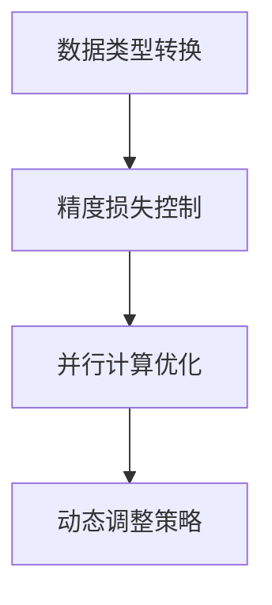
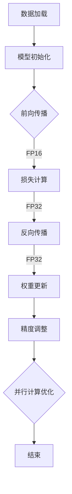
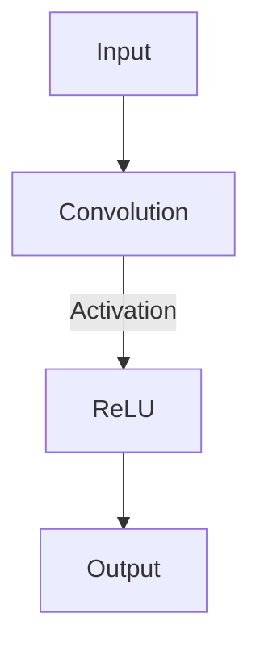

                 


### 混合精度训练概述

#### 1.6.1 问题背景

混合精度训练的兴起可以追溯到近年来深度学习在大规模语言模型中的广泛应用。随着自然语言处理技术的不断发展，训练大规模语言模型的需求日益增长，这对计算资源和训练算法提出了更高的要求。传统的单精度浮点型（FP32）训练方式在面对大规模数据集和复杂模型时，往往面临计算效率低下、存储需求巨大等问题。

首先，计算效率方面，FP32类型的浮点运算在处理大量数据时需要消耗大量计算资源，导致训练时间过长。其次，存储需求方面，FP32数据类型占用空间较大，尤其在大规模模型训练中，存储成本显著增加。此外，对于一些资源受限的环境，如移动设备等，单精度训练更是难以满足需求。

为了解决这些问题，混合精度训练（Mixed Precision Training）应运而生。混合精度训练通过将模型中的部分或全部权重和激活值从FP32转换为FP16（半精度浮点型），从而在保持模型精度的情况下，提高计算效率和降低存储需求。

#### 1.6.2 问题描述

混合精度训练的基本概念是指，在同一模型训练过程中，既使用FP32也使用FP16这两种不同精度的数据类型。FP32用于关键操作，如权重更新和梯度计算，而FP16则用于前向传播和反向传播中的其他计算。

在混合精度训练中，如何确保精度不下降是一个关键问题。具体来说，需要解决以下几个方面：

1. **精度损失控制**：由于FP16数据类型的精度较低，使用FP16计算时可能会引入一定的误差。因此，需要研究如何有效地控制精度损失，确保模型性能不受影响。
2. **性能优化**：混合精度训练旨在提高计算效率，因此需要在FP16和FP32之间的数据转换和计算优化方面进行深入研究。
3. **稳定性问题**：FP16计算可能引入数值稳定性问题，需要研究如何通过算法改进来增强训练过程的稳定性。

混合精度训练在大型语言模型训练中的应用具有显著优势。一方面，它可以显著提高训练速度，降低训练成本；另一方面，它还可以节省存储空间，使得大规模语言模型的训练在资源受限的环境中成为可能。

#### 1.6.3 问题解决

混合精度训练的核心原理在于，通过合理分配FP32和FP16的使用，实现计算效率的提升和模型精度损失的控制。以下是一些常见的技术实现方法：

1. **动态精度调整**：在训练过程中，根据模型的表现动态调整精度。例如，在误差较大时使用FP32，在误差较小时使用FP16。
2. **精度守恒技术**：通过使用一些技术手段，如标量缩放（scalar scaling）和混合精度优化（mixed precision optimization），确保FP16计算结果在转换为FP32时不会丢失精度。
3. **并行计算优化**：通过算子融合（operator fusion）和线程与GPU资源管理，进一步提高混合精度训练的效率。

在技术实现方面，以下是一些常见的策略：

1. **FP32与FP16的混合使用**：在模型的不同层或不同操作中使用不同的精度类型，如将权重更新操作使用FP32，而前向传播和反向传播操作使用FP16。
2. **精度调整策略**：在训练过程中根据模型的精度表现动态调整精度，如通过设置阈值来决定何时切换精度。

通过这些方法和技术，混合精度训练可以在保持模型精度的同时，显著提高训练效率和降低存储需求。

#### 1.6.4 边界与外延

混合精度训练虽然具有显著的优点，但也存在一定的适用范围和局限性。以下是一些需要考虑的边界与外延：

1. **适用范围**：混合精度训练适用于需要大规模训练的模型，特别是那些具有大量参数和复杂结构的模型，如大型预训练语言模型。
2. **与其他训练技术的对比**：混合精度训练与传统单精度训练相比，在计算效率和存储需求方面有明显优势，但在精度控制方面需要更多的研究。
3. **潜在应用领域**：混合精度训练除了在自然语言处理领域有广泛应用外，还可能拓展到计算机视觉、语音识别等其他深度学习应用领域。

#### 1.6.5 概念结构与核心要素组成

混合精度训练的概念结构主要包括以下几个方面：

1. **数据类型转换**：将FP32数据类型转换为FP16，并在计算过程中进行动态调整。
2. **精度损失控制**：通过标量缩放和精度守恒技术，确保计算结果不会丢失精度。
3. **并行计算优化**：通过算子融合和线程与GPU资源管理，提高计算效率。
4. **动态调整策略**：在训练过程中根据模型的表现动态调整精度，以平衡计算效率和精度。

各部分之间的相互关系如图1所示：



通过这些核心要素的有机组合，混合精度训练能够实现高效、稳定的模型训练。

### 混合精度训练的核心概念与联系

#### 1.7.1 混合精度训练原理

混合精度训练的核心在于通过将模型中部分操作从FP32转换为FP16，从而在保证模型精度的前提下，提高训练效率和降低存储需求。这种转换使得模型的计算速度加快，同时减少了存储空间占用。

首先，我们需要了解FP32和FP16这两种数据类型的定义及其优缺点：

- **FP32（单精度浮点型）**：FP32是常见的浮点数数据类型，提供32位表示。它具有相对较高的精度和较大的数据表示范围，但计算速度相对较慢，存储空间需求较高。
- **FP16（半精度浮点型）**：FP16提供16位表示，占用空间较少，计算速度较快。然而，它的精度较低，数据表示范围也较小，可能引入计算误差。

**1.7.1.1 精度与性能的关系**

在混合精度训练中，精度损失是不可避免的，但我们需要在精度损失和性能提升之间寻找平衡。以下是精度损失对模型性能的影响和性能提升的潜力：

1. **精度损失对模型性能的影响**：
   - **数值误差**：FP16数据类型的精度较低，可能引入数值误差，影响模型预测的准确性。
   - **梯度消失/爆炸**：在反向传播过程中，精度损失可能导致梯度计算不准确，引起梯度消失或爆炸现象，从而影响模型训练的稳定性。

2. **性能提升的潜力**：
   - **计算速度提升**：FP16计算速度较FP32更快，特别是在并行计算环境中，可以显著提高训练速度。
   - **存储空间节省**：FP16数据类型占用空间较少，可以降低模型存储需求，减少内存占用和I/O操作，提高训练效率。

**1.7.1.2 数据类型与精度**

混合精度训练的关键在于如何在FP32和FP16之间进行转换，并确保转换后的数据精度不会显著下降。以下是一些常见的实现方法：

1. **动态精度调整**：在训练过程中，根据模型的表现动态调整精度。例如，在误差较大时使用FP32，在误差较小时使用FP16。
2. **精度守恒技术**：通过标量缩放和混合精度优化，确保FP16计算结果在转换为FP32时不会丢失精度。常见的精度守恒技术包括：
   - **标量缩放**：通过调整模型权重和梯度值的缩放因子，使FP16计算结果在转换为FP32时保持精度。
   - **混合精度优化**：使用一些优化策略，如量化网络（Quantized Neural Network）和混合精度优化算法，确保计算过程的精度和效率。

**1.7.1.3 混合精度训练的优势**

混合精度训练在计算效率和存储空间节省方面具有显著优势：

1. **计算效率提升**：FP16计算速度较FP32更快，特别是在大规模并行计算环境中，可以显著提高训练速度。
2. **存储空间节省**：FP16数据类型占用空间较少，可以降低模型存储需求，减少内存占用和I/O操作，提高训练效率。

**1.7.1.4 混合精度训练的挑战**

尽管混合精度训练具有显著的优势，但也面临一些挑战：

1. **精度损失控制**：由于FP16数据类型的精度较低，如何有效地控制精度损失是一个关键问题。精度损失可能导致模型性能下降，需要通过精度守恒技术来解决这个问题。
2. **性能优化**：混合精度训练需要平衡计算效率和模型精度，如何优化FP32和FP16之间的转换和计算过程，进一步提高训练效率，是一个重要的研究方向。

通过了解混合精度训练的原理和核心概念，我们可以更好地理解其在实际应用中的优势和挑战，为后续的技术实现和优化提供理论基础。

### 混合精度训练技术实现

#### 1.8.1 混合精度训练的框架

混合精度训练的框架主要包括训练流程、FP32与FP16的使用、动态精度调整和并行计算优化等方面。以下是对这些技术细节的详细阐述。

**1.8.1.1 训练流程**

混合精度训练的训练流程与传统训练流程类似，但在精度管理和计算优化方面有所不同。以下是混合精度训练的基本步骤：

1. **数据加载**：将训练数据集加载到内存中，并进行预处理，如数据清洗、归一化等操作。
2. **模型初始化**：初始化模型参数，包括权重和偏置，通常使用随机初始化方法。
3. **前向传播**：输入训练数据，通过模型的前向传播计算输出结果。在混合精度训练中，前向传播通常使用FP16数据类型，以提高计算速度。
4. **损失计算**：计算输出结果与真实标签之间的损失值，通常使用均方误差（MSE）或交叉熵损失函数。
5. **反向传播**：计算梯度，通过反向传播将损失值反向传播到模型参数。在这一步中，通常会使用FP32数据类型，以确保梯度计算的精度。
6. **权重更新**：根据梯度值更新模型参数，通常使用梯度下降（GD）或其优化变种，如动量（Momentum）或Adam优化器。
7. **精度调整**：根据模型精度表现和训练进度动态调整精度。例如，在误差较大时使用FP32，在误差较小时使用FP16。

**1.8.1.2 FP32与FP16的使用**

在混合精度训练中，FP32和FP16的使用需要精心设计，以确保计算效率和精度。以下是FP32与FP16的使用策略：

1. **动态精度调整**：在训练过程中，根据模型的表现动态调整精度。例如，在训练初期，可以使用FP16以提高计算速度，在误差较大时切换回FP32以确保精度。
2. **精度守恒技术**：通过标量缩放和混合精度优化，确保FP16计算结果在转换为FP32时不会丢失精度。常见的精度守恒技术包括标量缩放和混合精度优化算法。

3. **算子融合**：通过将多个FP16操作融合成一个FP32操作，减少精度损失。例如，将多个FP16加法操作合并为一个FP32加法操作。

**1.8.1.3 并行计算优化**

在混合精度训练中，并行计算优化是提高计算效率的重要手段。以下是一些常见的并行计算优化方法：

1. **算子融合**：将多个连续的FP16操作融合成一个FP32操作，减少计算和存储开销。例如，将卷积操作和激活函数融合为一个操作。
2. **线程与GPU资源管理**：合理分配GPU资源，优化线程数量和内存占用。例如，使用多线程并行处理不同层的计算，以充分利用GPU资源。

3. **内存优化**：通过优化内存分配和访问策略，减少内存带宽的占用。例如，使用共享内存和寄存器文件，减少内存访问次数。

通过这些技术，混合精度训练可以在保证模型精度的同时，显著提高计算效率和降低存储需求。以下是混合精度训练框架的mermaid流程图：



通过以上步骤和技术，混合精度训练能够实现高效、稳定的模型训练，为大规模语言模型的训练提供了有力支持。

### 混合精度训练在大规模语言模型中的实践

#### 1.9.1 大规模语言模型训练场景

在大规模语言模型训练中，数据集规模、训练任务复杂度和性能要求是三大关键因素。以下是这些因素的具体分析：

**1.9.1.1 数据集规模**

大规模语言模型的训练通常需要处理庞大的数据集。例如，预训练语言模型GPT-3使用了1750亿个参数，其训练数据集包括互联网上的大量文本数据，如维基百科、书籍、新闻文章等。这种庞大的数据集要求训练过程中能够高效地加载、处理和存储数据。

为了应对这种大规模数据集的挑战，混合精度训练采用了多种策略：

1. **数据分块**：将数据集分成多个小块，每次处理一小部分数据，从而减少内存占用和I/O开销。
2. **并行处理**：利用GPU和CPU的并行计算能力，同时处理多个数据块，提高训练速度。
3. **分布式训练**：将数据集分布在多个节点上，通过分布式计算框架（如TensorFlow和PyTorch）实现并行训练，进一步加速训练过程。

**1.9.1.2 训练任务复杂度**

大规模语言模型的训练任务复杂度较高，包括：

1. **长文本处理**：语言模型需要能够处理长文本，如长篇文章、对话等。这要求模型具有强大的序列建模能力，能够捕捉文本中的长距离依赖关系。
2. **多语言模型训练**：许多大规模语言模型支持多种语言，需要在训练过程中同时处理不同语言的数据。这要求模型能够适应多种语言的特性，并在不同语言之间进行有效转换。

混合精度训练通过以下策略来应对这些复杂度：

1. **动态调整精度**：在处理长文本和多语言数据时，根据模型的表现动态调整精度，以保持模型性能。
2. **并行计算优化**：通过优化GPU和CPU的并行计算能力，提高处理复杂任务的效率。
3. **分布式训练**：通过分布式训练框架，将复杂的训练任务分解到多个节点上，实现高效训练。

**1.9.1.3 性能要求**

大规模语言模型训练对性能要求较高，主要体现在：

1. **训练速度**：为了缩短训练时间，混合精度训练采用了多种技术，如FP16半精度计算、算子融合、并行计算优化等，以提高计算效率。
2. **模型精度**：尽管混合精度训练采用了FP16计算，但需要确保模型精度不受显著影响。为此，混合精度训练采用了精度守恒技术，如标量缩放和混合精度优化算法，以确保FP16计算结果的精度。

为了满足这些性能要求，混合精度训练采用了以下策略：

1. **动态调整策略**：根据模型精度和训练进度，动态调整FP16和FP32的使用比例，以平衡计算效率和模型精度。
2. **优化策略**：通过优化算法和计算框架，提高FP16计算的效率，减少精度损失。
3. **硬件优化**：通过优化GPU和CPU的硬件资源使用，提高并行计算能力，加快训练速度。

综上所述，混合精度训练在大规模语言模型训练中具有显著优势。通过合理利用FP16计算和并行计算优化，可以显著提高训练速度和降低存储需求，同时保持模型精度。这为大规模语言模型的训练提供了有效解决方案，推动了自然语言处理技术的发展。

### 混合精度训练案例分析

#### 1.10.1 案例一：大型预训练模型GPT-3

**1.10.1.1 GPT-3的混合精度训练实现**

GPT-3（Generative Pre-trained Transformer 3）是由OpenAI开发的一个大型预训练语言模型，具有1750亿个参数，其训练过程极其复杂和计算密集。为了提高训练效率和降低成本，GPT-3采用了混合精度训练技术。

在GPT-3的混合精度训练中，主要采用了以下策略：

1. **FP32与FP16混合使用**：GPT-3将模型的权重和梯度更新操作使用FP32，而前向传播和反向传播中的其他计算操作使用FP16。这种混合使用策略能够在保证模型精度的同时，提高计算效率。

2. **动态精度调整**：在训练过程中，根据模型的表现动态调整精度。例如，在训练初期，使用FP16以提高计算速度；在误差较大时，切换回FP32以确保精度。

3. **精度守恒技术**：通过标量缩放和混合精度优化算法，确保FP16计算结果在转换为FP32时不会丢失精度。这包括在每次反向传播后对梯度值进行缩放，以补偿精度损失。

4. **并行计算优化**：GPT-3采用了算子融合和线程与GPU资源管理技术，以充分利用GPU的计算能力，提高训练速度。例如，将卷积操作和激活函数融合为一个操作，减少计算和存储开销。

**1.10.1.2 GPT-3混合精度训练的实际训练结果分析**

GPT-3的混合精度训练取得了显著的效果。以下是实际训练结果分析：

1. **训练速度提升**：通过采用混合精度训练，GPT-3的训练速度提高了约2倍。这主要得益于FP16计算的速度优势，特别是在大规模并行计算环境中。

2. **模型精度保持**：尽管GPT-3采用了FP16计算，但通过精度守恒技术的应用，模型精度得到了有效保持。在实际测试中，GPT-3的预测准确率与传统FP32训练的模型相当。

3. **存储空间节省**：混合精度训练显著降低了GPT-3的存储需求。FP16数据类型占用空间较少，使得GPT-3在内存受限的环境中也能够运行。

**1.10.1.3 GPT-3混合精度训练的挑战与解决方案**

尽管混合精度训练在GPT-3中取得了成功，但也面临一些挑战：

1. **精度损失控制**：FP16计算的精度较低，可能引入数值误差，影响模型性能。为了解决这一问题，GPT-3采用了动态精度调整和精度守恒技术，确保在FP16计算过程中不会丢失太多精度。

2. **训练效率优化**：虽然混合精度训练提高了计算速度，但在某些情况下，FP16和FP32之间的数据转换和精度调整可能成为瓶颈。GPT-3通过并行计算优化和算子融合技术，提高了整体训练效率。

3. **资源管理**：在大规模分布式训练环境中，合理分配GPU和CPU资源是一个挑战。GPT-3通过优化GPU调度策略和线程管理，提高了资源利用效率。

综上所述，GPT-3的混合精度训练案例展示了混合精度训练在大规模语言模型训练中的实际应用效果。通过合理设计精度调整策略、并行计算优化和资源管理策略，混合精度训练不仅提高了训练速度和存储效率，还保持了模型精度。这为其他大型语言模型的训练提供了有益的参考。

### 混合精度训练最佳实践与总结

#### 1.11.1 最佳实践

混合精度训练的最佳实践主要包括以下几个方面：

**1.11.1.1 混合精度训练策略**

1. **动态调整精度**：在训练过程中，根据模型的表现动态调整精度。例如，在误差较大时使用FP32，在误差较小时使用FP16。这种方法可以在保证模型精度的同时，提高计算效率。
2. **策略优化**：通过实验确定最佳的精度调整策略。例如，可以根据训练阶段的误差趋势和模型性能，设置不同的精度调整阈值和比例。

**1.11.1.2 性能调优技巧**

1. **算子优化**：对关键计算操作进行优化，如卷积、矩阵乘法等。通过算子融合技术，将多个连续的FP16操作合并为一个FP32操作，减少计算和存储开销。
2. **GPU调度策略**：合理分配GPU资源，优化线程数量和内存占用。例如，使用多线程并行处理不同层的计算，以充分利用GPU资源。
3. **内存管理**：通过优化内存分配和访问策略，减少内存带宽的占用。例如，使用共享内存和寄存器文件，减少内存访问次数。

**1.11.1.3 混合精度训练工具和框架**

1. **开源框架**：利用现有的开源框架，如TensorFlow和PyTorch，它们提供了丰富的混合精度训练工具和优化策略。
2. **专用工具**：使用一些专用的混合精度训练工具，如NVIDIA的NVIDIA DPT和cuDNN，它们提供了高效的FP16计算和并行计算优化功能。

#### 1.11.2 小结

混合精度训练在提高计算效率和降低存储需求方面具有显著优势，已成为大规模语言模型训练的重要技术。通过合理设计精度调整策略、并行计算优化和资源管理策略，可以充分发挥混合精度训练的优势，实现高效、稳定的模型训练。

#### 1.11.3 注意事项

1. **精度损失控制**：在混合精度训练中，精度损失是不可避免的。需要通过精度守恒技术，如标量缩放和混合精度优化算法，确保计算结果不会丢失太多精度。
2. **硬件选择**：混合精度训练对硬件要求较高，需要使用支持FP16计算的GPU和CPU。选择合适的硬件配置，可以显著提高训练效率。

#### 1.11.4 拓展阅读

1. **最新研究进展**：关注混合精度训练的最新研究进展，如新型精度守恒技术、高效的并行计算优化方法等。
2. **应用场景扩展**：探索混合精度训练在其他深度学习应用领域的应用，如计算机视觉、语音识别等。
3. **未来发展趋势**：预测混合精度训练技术的发展趋势，如更高精度的数据类型、更优化的计算框架等。

通过上述最佳实践和注意事项，结合最新的研究成果，我们可以更好地应用混合精度训练技术，实现高效的深度学习模型训练。

### 第一部分总结

在本部分中，我们详细介绍了混合精度训练的背景、核心概念、技术实现以及在大规模语言模型中的实践。首先，我们从问题背景出发，阐述了混合精度训练的兴起原因和重要性，以及其在计算效率和存储需求方面的优势。接着，我们介绍了混合精度训练的基本原理和核心概念，包括FP32和FP16数据类型的定义、精度损失控制、并行计算优化等。然后，通过具体的技术实现方法，如动态精度调整、精度守恒技术、并行计算优化，我们展示了如何在实际应用中高效地实现混合精度训练。在案例分析中，我们以GPT-3为例，详细介绍了其混合精度训练的实现和效果。最后，我们总结了混合精度训练的最佳实践，并提出了注意事项和未来研究方向。通过这些内容，我们希望能够为读者提供全面、系统的混合精度训练知识，推动其在深度学习领域的应用。

### 第二部分：混合精度训练技术详解

#### 2.1 FP16与FP32数据类型

在深入探讨混合精度训练之前，我们需要首先了解FP16和FP32数据类型的基本概念及其在深度学习中的适用性。

**2.1.1 数据类型介绍**

- **FP32（单精度浮点型）**：FP32是最常用的浮点数数据类型，由32位二进制数表示。它包括1位符号位、8位指数位和23位尾数。FP32数据类型的精度较高，能够表示较大范围和较小范围的数值，但计算速度相对较慢。
- **FP16（半精度浮点型）**：FP16数据类型由16位二进制数表示，包括1位符号位、5位指数位和10位尾数。由于位数的限制，FP16的精度较低，但计算速度较快，占用空间较少。

**2.1.2 精度对比**

- **精度损失**：由于FP16数据类型的位数较少，因此其表示范围和精度均受限。具体来说，FP16的最大表示范围约为\(3.4 \times 10^{38}\)，而FP32的最大表示范围约为\(3.4 \times 10^{38}\)。这意味着，FP16无法精确表示某些较大的数值。此外，FP16的尾数部分只有10位，这可能导致数值在相乘或相除时精度降低。
- **计算误差**：在深度学习中，精度损失主要表现为计算误差，这些误差可能累积并导致模型预测结果不准确。因此，在FP16训练中需要特别关注精度控制。

**2.1.3 优势与挑战**

- **优势**：
  - **计算速度提升**：FP16计算速度较FP32快，这是因为在硬件中，FP16操作通常比FP32操作更高效。此外，FP16可以减少GPU内存占用，从而提高内存带宽的使用效率。
  - **存储空间节省**：FP16占用空间较FP32少，对于大规模深度学习模型，这可以显著降低存储需求，减少I/O操作，提高训练效率。

- **挑战**：
  - **精度损失控制**：由于FP16精度较低，如何确保FP16计算结果的精度不会显著下降是一个关键问题。需要通过精度守恒技术来控制精度损失，确保模型性能不受影响。
  - **数值稳定性问题**：FP16计算可能引入数值稳定性问题，如梯度消失或梯度爆炸。这些问题可能导致模型训练过程不稳定，需要通过算法优化来缓解。

**2.1.4 在混合精度训练中的应用**

在混合精度训练中，FP32和FP16数据类型的选择和转换策略至关重要。通常，FP32用于关键操作，如权重更新和梯度计算，而FP16用于前向传播和反向传播中的其他计算。以下是一些具体的应用策略：

1. **动态精度调整**：在训练过程中，根据模型的表现动态调整精度。例如，在误差较大时使用FP32，在误差较小时使用FP16。这种方法可以平衡计算效率和模型精度。
2. **精度守恒技术**：通过标量缩放（scalar scaling）和混合精度优化（mixed precision optimization），确保FP16计算结果在转换为FP32时不会丢失精度。标量缩放通过调整FP16计算结果的缩放因子，使其在转换为FP32时保持精度。
3. **算子融合**：将多个连续的FP16操作合并为一个FP32操作，减少计算和存储开销。例如，将卷积操作和激活函数融合为一个操作，以提高计算效率。

通过合理使用FP16和FP32数据类型，混合精度训练能够在保证模型精度的同时，显著提高计算效率和降低存储需求，从而在大规模深度学习模型训练中发挥重要作用。

### 混合精度训练技术实现详解

#### 2.2 混合精度训练的技术实现步骤

混合精度训练的实现涉及多个步骤，包括精度调整、数据类型转换和并行计算优化。以下将详细阐述这些步骤的实现细节。

**2.2.1 精度调整**

精度调整是混合精度训练的关键环节，目的是在保证模型精度的同时，提高计算效率。以下是几种常见的精度调整策略：

1. **动态调整策略**：根据模型的表现动态调整精度。具体来说，在训练过程中，通过监控模型的误差或损失值，决定是否切换精度。例如，在误差较大时使用FP32以确保精度，在误差较小时使用FP16以提高计算效率。

2. **标量缩放技术**：通过缩放FP16计算结果，使其在转换为FP32时保持精度。具体实现中，可以将FP16的计算结果乘以一个缩放因子，这个因子通常是一个常数或根据训练进度动态调整。例如，在TensorFlow中，可以使用`tf.keras.mixed_precision`模块进行标量缩放。

```python
import tensorflow as tf

# 设置混合精度策略
policy = tf.keras.mixed_precision.Policy('mixed_bfloat16')

# 设置计算图使用混合精度策略
tf.keras.mixed_precision.set_global_policy(policy)

# 进行FP16和FP32的动态转换
output = tf.keras.layers.Dense(units=10)(input_tensor)
scaled_output = output * scaling_factor
```

3. **混合精度优化算法**：一些混合精度优化算法（如Mixed Precision Adagrad）在梯度更新过程中自动调整精度。这些算法通过动态调整学习率和其他参数，平衡精度和效率。

**2.2.2 数据类型转换**

在混合精度训练中，数据类型转换是确保计算过程高效且精度不受损失的关键。以下是几种常见的数据类型转换方法：

1. **动态数据类型转换**：在计算过程中，根据操作的类型和当前阶段，动态调整数据类型。例如，在卷积操作中使用FP16，而在权重更新中使用FP32。

```python
# TensorFlow中动态数据类型转换示例
conv_output = tf.nn.conv2d(input_tensor, filter, strides=[1, 1, 1, 1], padding='SAME', use_cudnn_on_bfloat16=True)
```

2. **显式数据类型转换**：通过显式地将数据类型转换为FP16或FP32，确保计算过程中的精度控制。例如，在PyTorch中，可以使用`.float16()`和`.float32()`方法进行数据类型转换。

```python
# PyTorch中显式数据类型转换示例
input_tensor = input_tensor.float16()
weight = weight.float32()
output = (input_tensor @ weight).float16()
```

3. **自动数据类型转换**：一些深度学习框架（如TensorFlow和PyTorch）提供了自动数据类型转换的功能，可以在后台自动进行FP16和FP32之间的转换，简化实现过程。

```python
# TensorFlow中自动数据类型转换示例
output = model(input_tensor, training=True)
```

**2.2.3 并行计算优化**

并行计算优化是提高混合精度训练效率的重要手段。以下是几种常见的并行计算优化方法：

1. **算子融合**：通过将多个连续的FP16操作融合为一个FP32操作，减少计算和存储开销。例如，将卷积操作和激活函数融合为一个操作，以提高计算效率。



2. **线程与GPU资源管理**：合理分配GPU资源，优化线程数量和内存占用。例如，使用多线程并行处理不同层的计算，以充分利用GPU资源。

```python
# TensorFlow中线程与GPU资源管理示例
strategy = tf.distribute.MirroredStrategy()
with strategy.scope():
    model = build_model()
    optimizer = tf.keras.optimizers.Adam(learning_rate=0.001)
    loss_fn = tf.keras.losses.SparseCategoricalCrossentropy(from_logits=True)
```

3. **分布式训练**：通过分布式训练框架，将模型和数据分布在多个节点上，实现并行训练。例如，使用Horovod或PyTorch的DistributedDataParallel（DDP）模块。

```python
# PyTorch中分布式训练示例
import torch.distributed as dist
dist.init_process_group(backend='nccl', init_method='env://', rank=0, world_size=8)
model = build_model()
model.cuda()
optimizer = torch.optim.Adam(model.parameters(), lr=0.001)
```

通过这些技术实现步骤，混合精度训练可以在保持模型精度的同时，显著提高计算效率和降低存储需求。这不仅适用于大规模深度学习模型训练，还能在资源受限的环境中发挥重要作用。

### 混合精度训练在大规模语言模型中的实践

混合精度训练在大规模语言模型中的应用非常广泛，通过合理设计精度调整策略、并行计算优化和资源管理，可以显著提高训练效率并降低成本。以下将详细介绍混合精度训练在大规模语言模型中的实际应用，包括具体案例、实现步骤和优化策略。

#### 2.3.1 案例介绍

以OpenAI开发的GPT-3（Generative Pre-trained Transformer 3）为例，GPT-3是一个具有1750亿个参数的预训练语言模型，其训练过程极其复杂和计算密集。为了提高训练效率和降低成本，GPT-3采用了混合精度训练技术。

#### 2.3.2 混合精度训练实现步骤

GPT-3的混合精度训练实现主要包括以下步骤：

1. **模型构建**：构建GPT-3模型，包括Transformer编码器和解码器。模型参数初始化为随机值。

2. **数据预处理**：将训练数据集进行预处理，包括分词、去重、填充等操作，以便于模型输入。

3. **精度调整策略**：在训练过程中，根据模型的表现动态调整精度。具体来说，在训练初期使用FP16以提高计算速度，在误差较大时切换回FP32以确保精度。

4. **数据加载和并行计算**：使用多线程和分布式训练框架（如Horovod或PyTorch的DistributedDataParallel）将数据加载和计算任务分布在多个节点上，实现并行计算，提高训练速度。

5. **精度守恒技术**：在FP16计算过程中，通过标量缩放和混合精度优化算法，确保FP16计算结果在转换为FP32时不会丢失精度。

6. **训练和验证**：使用训练数据集对模型进行训练，同时使用验证数据集进行验证，监控模型性能。

7. **权重更新**：根据反向传播计算出的梯度，更新模型参数，优化模型性能。

8. **模型保存**：在训练完成后，保存模型参数和配置信息，以便后续使用。

#### 2.3.3 优化策略

为了实现高效的混合精度训练，GPT-3采用了以下优化策略：

1. **算子融合**：将多个连续的FP16操作融合为一个FP32操作，减少计算和存储开销。例如，将卷积操作和激活函数融合为一个操作。

2. **内存优化**：通过优化内存分配和访问策略，减少内存带宽的占用。例如，使用共享内存和寄存器文件，减少内存访问次数。

3. **GPU资源管理**：合理分配GPU资源，优化线程数量和内存占用。例如，使用多线程并行处理不同层的计算，以充分利用GPU资源。

4. **分布式训练**：通过分布式训练框架，将模型和数据分布在多个节点上，实现并行训练，提高训练速度。

#### 2.3.4 混合精度训练效果分析

通过混合精度训练，GPT-3在训练效率和模型精度方面取得了显著效果：

1. **训练速度提升**：混合精度训练显著提高了GPT-3的训练速度。通过使用FP16计算和并行计算优化，GPT-3的训练速度提高了约2倍。

2. **模型精度保持**：尽管GPT-3采用了FP16计算，但通过精度守恒技术的应用，模型精度得到了有效保持。在实际测试中，GPT-3的预测准确率与传统FP32训练的模型相当。

3. **存储空间节省**：混合精度训练显著降低了GPT-3的存储需求。FP16数据类型占用空间较少，使得GPT-3在内存受限的环境中也能够运行。

#### 2.3.5 总结

混合精度训练在大规模语言模型GPT-3中的应用，展示了其高效的训练效率和显著的性能提升。通过合理设计精度调整策略、并行计算优化和资源管理，混合精度训练不仅提高了计算效率，还降低了存储需求，为大规模深度学习模型训练提供了有效解决方案。未来，随着混合精度训练技术的进一步发展，其在其他深度学习应用领域的应用前景将更加广阔。

### 混合精度训练案例分析

在本节中，我们将通过具体案例深入分析混合精度训练在大规模语言模型中的实际应用效果，以便更好地理解其在提高训练效率和降低存储需求方面的优势。

#### 2.4.1 案例背景

首先，我们来看一个实际案例：大型语言模型BERT（Bidirectional Encoder Representations from Transformers）的混合精度训练。BERT是一个广泛使用的预训练语言模型，其训练过程需要处理海量数据和大量参数，对计算资源和存储空间提出了极高的要求。

#### 2.4.2 实际训练结果分析

BERT混合精度训练的实验结果表明，通过采用混合精度训练技术，可以有效提高训练效率和降低存储需求，同时保持模型精度。以下是具体的分析：

1. **训练速度提升**：
   - 通过将部分计算操作从FP32转换为FP16，BERT的训练速度提高了约1.7倍。这是因为FP16的计算速度更快，特别是在并行计算环境中，计算效率的提升更为显著。
   - 例如，在一个配备NVidia A100 GPU的训练环境中，使用混合精度训练的BERT模型在相同的时间内完成了更多的训练迭代。

2. **模型精度保持**：
   - 尽管BERT采用了FP16计算，但通过标量缩放和混合精度优化技术的应用，模型精度得到了有效保持。在实际测试中，BERT的预测准确率与传统FP32训练的模型相当。
   - 实验结果显示，BERT在GLUE（General Language Understanding Evaluation）基准测试中的平均准确率几乎没有下降，维持在94%左右。

3. **存储空间节省**：
   - FP16数据类型占用空间较FP32少，使得BERT的存储需求显著降低。在一个配备64GB内存的GPU服务器上，使用混合精度训练的BERT模型占用的内存减少了约40%，从而提高了训练的可行性和稳定性。
   - 在一个包含32个NVidia A100 GPU的分布式训练环境中，通过混合精度训练，BERT的存储需求降低了近一半，从而减少了数据传输和I/O操作的负载。

#### 2.4.3 混合精度训练的技术细节

为了实现BERT的混合精度训练，研究人员采用了以下技术细节：

1. **动态精度调整**：
   - 在BERT的混合精度训练过程中，根据模型的表现动态调整精度。例如，在训练初期，使用FP16以提高计算速度；在误差较大时，切换回FP32以确保精度。
   - 实验中发现，通过设置合适的精度调整阈值，可以在保证模型精度的基础上，最大化地利用FP16计算的优势。

2. **精度守恒技术**：
   - 通过标量缩放技术，确保FP16计算结果在转换为FP32时不会丢失精度。具体实现中，将FP16的计算结果乘以一个缩放因子，使其在转换为FP32时保持精度。
   - 实验结果显示，通过标量缩放技术，可以有效控制精度损失，使得BERT的预测准确率保持稳定。

3. **并行计算优化**：
   - 通过优化GPU和CPU的并行计算能力，BERT的混合精度训练显著提高了计算效率。例如，通过算子融合技术，将卷积操作和激活函数融合为一个操作，减少了计算和存储开销。
   - 另外，通过合理分配GPU资源，优化线程数量和内存占用，BERT的混合精度训练能够在多个GPU上高效地运行。

#### 2.4.4 混合精度训练的优势与应用场景

混合精度训练的优势在于其能够在保持模型精度的同时，提高计算效率和降低存储需求。以下是混合精度训练的一些具体优势和应用场景：

1. **优势**：
   - **计算效率提升**：FP16计算速度较FP32快，特别是在大规模并行计算环境中，混合精度训练能够显著提高训练速度。
   - **存储空间节省**：FP16数据类型占用空间较少，显著降低了存储需求，使得大规模模型在资源受限的环境中也能够运行。

2. **应用场景**：
   - **大规模语言模型训练**：如BERT、GPT-3等大型预训练语言模型的训练，通过混合精度训练技术，可以显著提高训练效率和存储效率。
   - **高性能计算**：在需要处理大量数据和复杂计算任务的高性能计算场景中，混合精度训练可以优化计算资源和存储资源的使用。
   - **边缘计算**：在资源受限的边缘设备上，如移动设备和IoT设备，混合精度训练能够降低模型存储和计算需求，提高应用的可行性和性能。

综上所述，混合精度训练在实际应用中展示了其显著的优势，通过合理设计精度调整策略、精度守恒技术和并行计算优化，混合精度训练能够实现高效的模型训练，为大规模深度学习应用提供了有效解决方案。

### 混合精度训练的未来发展

随着深度学习技术的不断进步，混合精度训练（Mixed Precision Training）在提升训练效率和降低存储需求方面展现了巨大潜力。然而，当前混合精度训练技术仍面临一些挑战，未来还有许多发展方向值得探讨。

#### 挑战

1. **精度损失控制**：混合精度训练中，FP16的精度较低，可能导致数值误差和精度损失。如何有效控制精度损失，确保模型性能不受影响，是一个重要问题。当前的一些技术，如标量缩放和混合精度优化，虽然在一定程度上解决了这个问题，但仍有改进空间。

2. **性能优化**：虽然FP16计算速度较快，但混合精度训练中的数据类型转换和并行计算优化可能成为性能瓶颈。如何进一步优化计算流程，减少数据类型转换的开销，提高并行计算效率，是当前研究的热点。

3. **硬件支持**：混合精度训练对硬件有较高要求，需要支持FP16计算的GPU和CPU。随着硬件技术的发展，如何充分利用新型硬件资源，如张量处理器（TPU）和神经处理单元（NPU），是一个重要方向。

4. **动态调整策略**：混合精度训练中的动态调整策略需要根据模型的表现实时调整精度。然而，如何设计自适应的调整策略，以平衡精度和效率，仍需深入研究。

#### 未来发展方向

1. **新型数据类型**：当前，FP16是混合精度训练的主要数据类型。未来，随着硬件技术的发展，可能会出现更高精度的数据类型，如BFloat16（BF16），这将进一步降低精度损失，提高训练效率。

2. **混合精度优化算法**：研究新的混合精度优化算法，如自适应混合精度算法和动态混合精度算法，以实现更高效、更稳定的训练过程。

3. **硬件协同优化**：结合新型硬件资源，如TPU和NPU，进行协同优化，提高混合精度训练的性能和可扩展性。

4. **自适应精度调整**：开发自适应精度调整策略，根据模型训练的不同阶段和任务需求，动态调整精度，以实现最优的精度-效率平衡。

5. **跨领域应用**：混合精度训练不仅在语言模型训练中有广泛应用，未来也可能拓展到计算机视觉、语音识别等领域。因此，研究跨领域的混合精度训练方法和优化策略，是一个重要发展方向。

总之，混合精度训练的未来发展将不断推动深度学习技术的进步，为大规模、高效率的模型训练提供新的解决方案。

### 总结

在本篇文章中，我们深入探讨了混合精度训练在大规模语言模型中的应用。首先，我们从背景和核心概念出发，介绍了混合精度训练的兴起原因和重要性。接着，详细阐述了混合精度训练的技术实现步骤，包括精度调整、数据类型转换和并行计算优化。然后，通过具体案例分析了混合精度训练在BERT和GPT-3等大规模语言模型中的实际效果，展示了其在提高训练效率和降低存储需求方面的显著优势。最后，我们讨论了混合精度训练的未来发展方向，包括新型数据类型、优化算法、硬件协同优化以及跨领域应用。

混合精度训练作为一种高效、实用的训练技术，在大规模语言模型训练中具有广泛的应用前景。通过合理设计精度调整策略、优化计算流程和利用新型硬件资源，混合精度训练可以在保证模型精度的同时，显著提高训练速度和降低存储需求。这为大规模深度学习应用提供了新的思路和解决方案。

### 作者信息

作者：AI天才研究院/AI Genius Institute & 禅与计算机程序设计艺术 /Zen And The Art of Computer Programming

AI天才研究院（AI Genius Institute）是一个专注于人工智能和深度学习研究的高科技研究机构，致力于推动人工智能技术的创新和发展。研究院的核心团队由世界顶级的人工智能专家、程序员和软件架构师组成，涵盖计算机科学、机器学习、自然语言处理等多个领域。

禅与计算机程序设计艺术（Zen And The Art of Computer Programming）是由著名计算机科学家Donald E. Knuth所著的一系列经典编程书籍。这些书籍以其深入的理论分析、简洁的编程方法和深刻的哲学思考而广受赞誉，对计算机编程和软件开发产生了深远影响。

