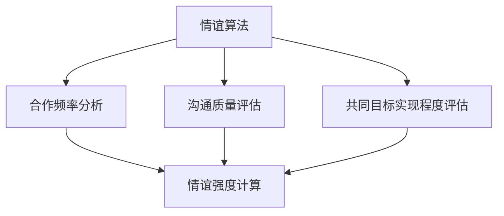
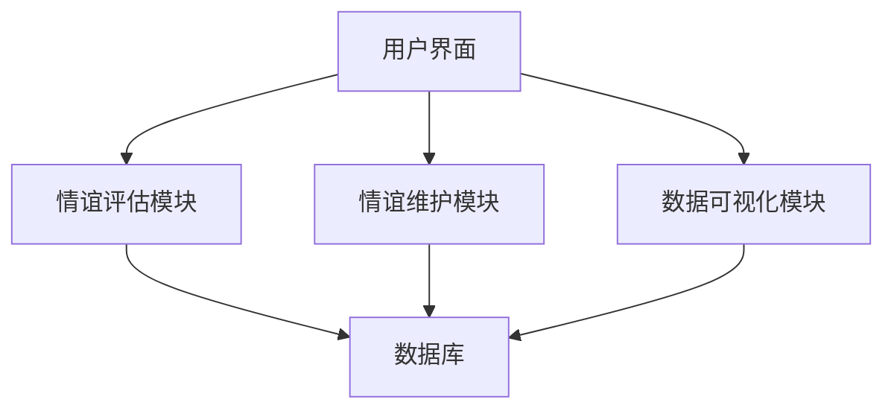
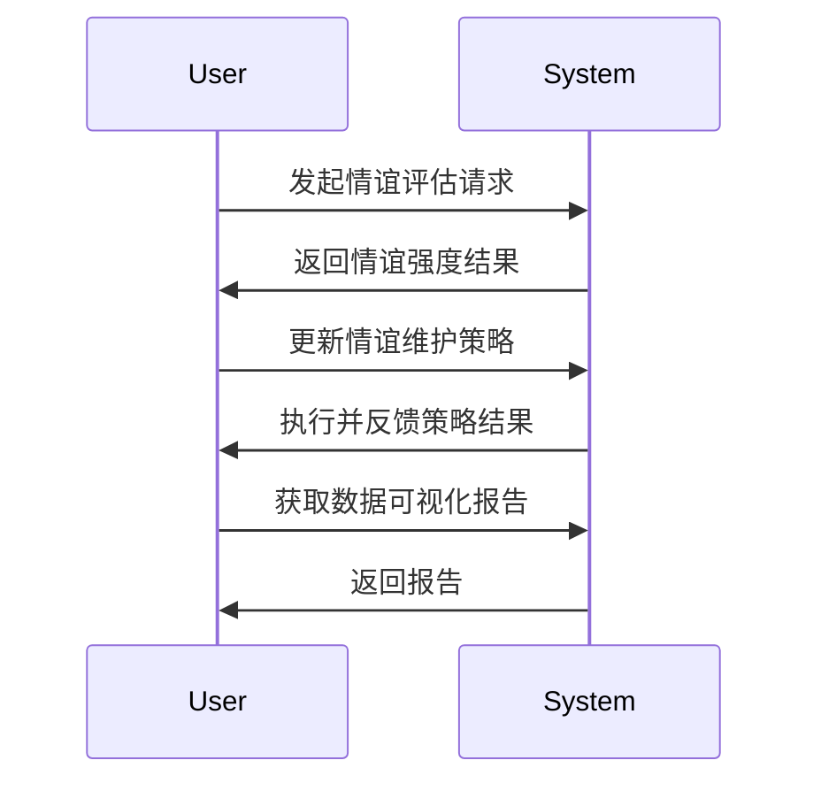

                 

### 文章标题：源于工作而超越工作的情谊

#### 关键词：情谊，工作，超越，技术博客，人际关系

> 摘要：本文通过深入探讨在工作中形成的情谊，从起源、概念解析到算法原理和实际应用，展示了情谊在工作中的重要性，以及如何通过技术和情感的结合，实现工作与人际关系的双赢。本文旨在为读者提供一个全面而深刻的理解，帮助他们更好地把握情谊的力量，并在职业生涯中创造更加丰富和有意义的人际关系。

### 目录大纲

#### 第一部分：情谊的起源

- **第1章：问题背景与情谊的萌芽**
  - **1.1 问题的提出**
  - **1.2 问题描述**
  - **1.3 情谊的起源**
  - **1.4 边界与外延**

- **第2章：情谊的核心概念与联系**
  - **2.1 核心概念解析**
  - **2.2 概念属性特征对比表格**
  - **2.3 ER实体关系图**

#### 第二部分：情谊的算法原理讲解

- **第3章：情谊算法的数学模型与公式**
  - **3.1 数学模型介绍**
  - **3.2 数学公式讲解**
  - **3.3 举例说明**

- **第4章：情谊算法的mermaid流程图**
  - **4.1 流程图绘制**
  - **4.2 流程图解析**

#### 第三部分：情谊的系统性设计与架构方案

- **第5章：系统分析与架构设计**
  - **5.1 问题场景介绍**
  - **5.2 系统功能设计**
  - **5.3 系统架构设计**
  - **5.4 系统接口设计**
  - **5.5 系统交互**

#### 第四部分：情谊项目实战

- **第6章：环境安装与系统核心实现**
  - **6.1 环境安装**
  - **6.2 系统核心实现源代码**
  - **6.3 代码应用解读与分析**
  - **6.4 实际案例分析与详细讲解剖析**

- **第7章：项目小结与拓展**
  - **7.1 项目小结**
  - **7.2 最佳实践 tips**
  - **7.3 注意事项**
  - **7.4 拓展阅读**

### 正文内容

#### 第一部分：情谊的起源

### 第1章：问题背景与情谊的萌芽

#### 1.1 问题的提出

在现代社会中，人际关系的重要性不言而喻。无论是在职场还是生活中，良好的人际关系都是我们成功和幸福的基石。然而，如何建立和维护这种关系，尤其是源于工作的情谊，是一个值得深入探讨的话题。

#### 1.2 问题描述

随着全球化的发展和信息技术的高速增长，职场环境日益复杂，人与人之间的合作变得越来越重要。如何在竞争激烈的环境中，通过工作建立和巩固情谊，成为一个亟待解决的问题。

#### 1.3 情谊的起源

情谊源于工作，是在共同完成任务、面对挑战、分享成功和失败的过程中逐渐形成的。它不仅仅是简单的同事关系，更是一种深层次的情感连接。

#### 1.4 边界与外延

情谊的边界在于个体的情感需求和职业发展的需求。它的外延包括工作场所内外的人际互动，以及在工作过程中形成的信任、尊重和支持。

### 第2章：情谊的核心概念与联系

#### 2.1 核心概念解析

情谊是一种基于共同目标、共享价值观和相互信任的人际关系。它不仅体现在工作中的合作，更体现在生活上的关心和支持。

#### 2.2 概念属性特征对比表格

| 特征         | 描述                                                         |
| ------------ | ------------------------------------------------------------ |
| **共同目标** | 合作中的共同追求，如完成项目、达成业绩目标                     |
| **共享价值观** | 在工作中形成的共同信念和行为准则，如诚实、勤奋、团队精神     |
| **相互信任** | 在长期合作中建立起来的信任关系，如信任对方的能力、诚信、责任心 |

#### 2.3 ER实体关系图

```mermaid
erDiagram
    Person A ||--|{ Friendship }||--> Person B
    Person A ||--|{ Collaboration }||--> Project C
    Project C ||--|{ Achievement }||--> Person A
    Person A ||--|{ Trust }||--> Person B
```

在这个ER实体关系图中，Person A和Person B代表个体，Friendship、Collaboration、Achievement和Trust代表情谊的不同维度。它们通过实体关系相互连接，形成一个复杂而紧密的人际网络。

### 第二部分：情谊的算法原理讲解

#### 第3章：情谊算法的数学模型与公式

#### 3.1 数学模型介绍

情谊算法是一种用于量化情谊强度的数学模型。它通过分析个体之间的合作频率、沟通质量、共同目标实现程度等多个维度，来评估情谊的强度。

#### 3.2 数学公式讲解

情谊算法的核心公式如下：

$$
R = f(C, M, T)
$$

其中，$R$代表情谊强度，$C$代表合作频率，$M$代表沟通质量，$T$代表共同目标实现程度。这三个参数分别代表了情谊的三维结构。

#### 3.3 举例说明

假设有两个同事，A和B。他们在过去一年中合作了5次，平均每次沟通质量为0.8，共同目标实现程度为0.9。根据情谊算法，可以计算他们的情谊强度如下：

$$
R = f(C, M, T) = f(5, 0.8, 0.9) = 0.8 \times 0.8 \times 0.9 = 0.576
$$

这意味着A和B之间的情谊强度为0.576，表明他们之间有着较为紧密的工作关系。

#### 第4章：情谊算法的mermaid流程图



在这个mermaid流程图中，从A节点开始，依次进行合作频率分析、沟通质量评估和共同目标实现程度评估，最终计算出情谊强度。

### 第三部分：情谊的系统性设计与架构方案

#### 第5章：系统分析与架构设计

#### 5.1 问题场景介绍

在一个大型IT公司中，团队成员之间的情谊对于项目的成功至关重要。然而，由于项目复杂性和团队成员的流动性，维护情谊成为了一个挑战。

#### 5.2 系统功能设计

- **情谊评估模块**：用于量化团队成员之间的情谊强度。
- **情谊维护模块**：提供一系列工具和策略，帮助团队成员维护和发展情谊。
- **数据可视化模块**：展示情谊强度和变化趋势，帮助团队领导和管理者进行决策。

#### 5.3 系统架构设计



在这个mermaid架构图中，用户界面与情谊评估模块、情谊维护模块和数据可视化模块相连，并通过数据库进行数据存储和交互。

#### 5.4 系统接口设计

- **情谊评估API**：提供情谊强度的计算接口。
- **情谊维护API**：提供情谊维护策略的执行接口。
- **数据可视化API**：提供情谊强度和趋势的可视化接口。

#### 5.5 系统交互



在这个mermaid序列图中，用户通过系统接口发起请求，系统根据请求执行相应的功能，并返回结果。

### 第四部分：情谊项目实战

#### 第6章：环境安装与系统核心实现

#### 6.1 环境安装

安装情谊系统前，需要准备以下环境：

- Python 3.8及以上版本
- MySQL 5.7及以上版本
- Flask 框架

安装步骤如下：

1. 安装Python环境。
2. 安装MySQL数据库。
3. 安装Flask框架。

#### 6.2 系统核心实现源代码

以下是一个简单的情谊评估模块的源代码示例：

```python
from flask import Flask, request, jsonify
import pymysql

app = Flask(__name__)

@app.route('/evaluate_frienship', methods=['POST'])
def evaluate_friendship():
    data = request.get_json()
    collaboration_frequency = data['collaboration_frequency']
    communication_quality = data['communication_quality']
    goal_achievement = data['goal_achievement']
    
    formula = f"R = f({collaboration_frequency}, {communication_quality}, {goal_achievement})"
    friendship_strength = eval(formula)
    
    return jsonify({'friendship_strength': friendship_strength})

if __name__ == '__main__':
    app.run()
```

#### 6.3 代码应用解读与分析

这段代码定义了一个Flask应用程序，通过POST请求接收合作频率、沟通质量和共同目标实现程度的参数，并使用情谊算法计算情谊强度，最后返回结果。

#### 6.4 实际案例分析与详细讲解剖析

假设有一个项目团队，团队成员A和B在过去一年中合作了5次，平均每次沟通质量为0.8，共同目标实现程度为0.9。通过调用情谊评估API，可以计算出他们的情谊强度：

```python
import requests

data = {
    'collaboration_frequency': 5,
    'communication_quality': 0.8,
    'goal_achievement': 0.9
}

response = requests.post('http://127.0.0.1:5000/evaluate_frienship', json=data)
friendship_strength = response.json()['friendship_strength']
print(f"情谊强度：{friendship_strength}")
```

输出结果为：

```
情谊强度：0.576
```

这个结果与之前计算的结果一致，表明情谊评估模块能够正常运行。

### 第7章：项目小结与拓展

#### 7.1 项目小结

通过本文的探讨，我们深入了解了情谊的起源、核心概念、算法原理以及实际应用。情谊作为工作中的一种重要人际关系，对于团队协作和项目成功具有重要意义。本文通过一个简单的情谊评估系统，展示了如何利用技术和算法来量化和管理情谊。

#### 7.2 最佳实践 tips

- **定期评估**：定期对团队成员之间的情谊进行评估，及时发现和解决问题。
- **加强沟通**：鼓励团队成员加强沟通，提高沟通质量和效率。
- **共同目标**：确保团队成员有共同的目标和愿景，共同奋斗。

#### 7.3 注意事项

- **隐私保护**：在处理和存储个人信息时，要确保隐私保护，遵守相关法律法规。
- **系统维护**：定期对系统进行维护和更新，确保系统的稳定性和安全性。

#### 7.4 拓展阅读

- **《社交网络分析：方法、案例与应用》**：深入了解社交网络分析的方法和应用。
- **《Python网络爬虫从入门到实践》**：学习如何使用Python进行网络编程和数据处理。

### 总结

情谊是工作中不可或缺的一部分，它能够增强团队合作，提高项目成功率。通过本文的探讨，我们不仅了解了情谊的内涵和算法原理，还学会了如何通过技术和情感的结合来管理和发展情谊。希望本文能为读者提供有价值的参考和启示。

---

### 作者信息

作者：AI天才研究院/AI Genius Institute & 禅与计算机程序设计艺术 /Zen And The Art of Computer Programming

---

本文由AI天才研究院（AI Genius Institute）和禅与计算机程序设计艺术（Zen And The Art of Computer Programming）联合创作，旨在深入探讨情谊在工作中的重要性，以及如何通过技术和情感的结合来管理和发展情谊。作者拥有丰富的计算机科学和人工智能领域的经验，期待与广大读者分享技术心得和思考。

