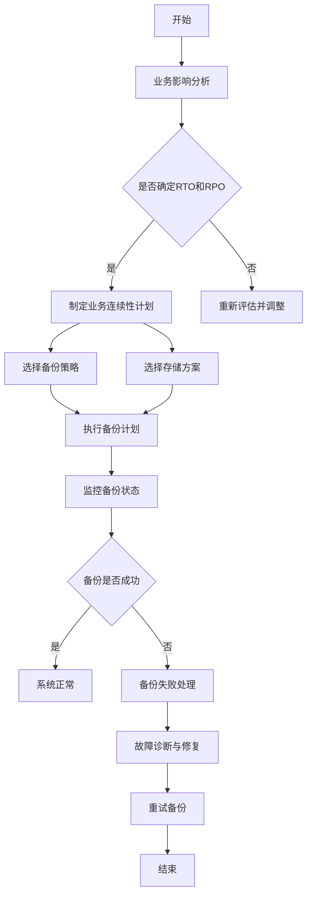

                 

### 1.1 问题背景

在当今快速发展的信息技术时代，企业对数据和信息系统的依赖程度日益加深。无论是大型跨国公司还是中小型创业企业，业务运营的数字化程度不断提高，信息系统已成为企业核心竞争力的关键组成部分。然而，随着信息化程度的提高，企业面临的灾难风险也随之增加。这些灾难可能包括自然灾害（如地震、洪水、飓风等），人为事故（如火灾、网络攻击、硬件故障等），以及系统自身的软件问题等。

灾难一旦发生，将对企业的业务运营造成严重影响，可能导致以下问题：

1. **数据丢失**：企业关键数据可能因灾难而永久丢失，影响业务的连续性。
2. **业务中断**：企业业务流程可能因系统故障或数据丢失而中断，影响客户满意度和企业收入。
3. **品牌形象受损**：企业可能因无法及时恢复业务而失去客户信任，损害品牌形象。
4. **法律责任和罚款**：某些行业需要遵守严格的数据保护法规，灾难可能导致企业因违规而面临法律责任和罚款。

因此，灾难恢复（Disaster Recovery，简称DR）成为企业IT规划中的一个关键环节。灾难恢复旨在通过一系列技术和策略，确保在灾难发生时，企业能够迅速恢复业务，减少损失，保障业务的连续性。

### 1.2 问题描述

灾难恢复的目标是在灾难发生后，尽可能地快速恢复业务运作，确保关键业务流程的连续性。具体来说，灾难恢复面临以下几个主要问题：

1. **业务连续性规划**：企业需要制定详细的业务连续性计划，明确在灾难发生时各业务单元的恢复优先级和恢复时间目标（Recovery Time Objective，简称RTO）。
2. **数据备份与恢复**：企业需要定期备份数据，并确保备份数据的安全性、完整性和可恢复性。
3. **系统恢复与重建**：在灾难发生后，企业需要快速恢复系统，包括硬件的更换、软件的重新安装和配置，以及数据的恢复。
4. **应急响应**：企业需要建立应急响应团队，制定应急响应计划，确保在灾难发生时能够迅速采取行动，减少损失。
5. **演练与测试**：企业需要定期进行灾难恢复演练，测试灾难恢复计划的可行性和有效性，发现潜在问题并加以改进。

### 1.3 问题解决

解决灾难恢复问题需要综合考虑多个方面，采取一系列技术和策略。以下是几种常见的问题解决方法：

1. **数据备份与恢复**：
   - **全量备份**：定期对整个系统进行备份，确保在灾难发生后能够完全恢复系统。
   - **增量备份**：只备份自上次全量备份以来发生变化的数据，减少备份的时间和存储空间。
   - **差异备份**：备份自上次全量备份以来变化的数据，以及自上次增量备份以来变化的数据，提高恢复速度。
   - **备份存储**：将备份数据存储在远程服务器或云存储中，确保备份数据的安全性。

2. **系统恢复与重建**：
   - **硬件冗余**：通过增加硬件冗余，提高系统的容错能力。
   - **虚拟化技术**：使用虚拟化技术，实现系统的快速部署和恢复。
   - **容器化技术**：利用容器化技术，实现应用的快速部署和迁移，提高系统的灵活性。

3. **应急响应**：
   - **应急响应计划**：制定详细的应急响应计划，明确在灾难发生时各业务单元的恢复优先级和恢复时间目标。
   - **应急响应团队**：建立专业的应急响应团队，确保在灾难发生时能够迅速采取行动。
   - **演练与测试**：定期进行灾难恢复演练，测试灾难恢复计划的可行性和有效性。

4. **业务连续性规划**：
   - **业务影响分析**：评估业务流程中断对企业的影响，确定业务恢复的优先级。
   - **恢复时间目标（RTO）**：确定各业务单元的恢复时间目标，确保在灾难发生时能够尽快恢复业务。
   - **业务连续性计划**：制定详细的业务连续性计划，明确在灾难发生时各业务单元的恢复步骤和流程。

### 1.4 边界与外延

灾难恢复不仅涉及技术层面，还包括管理和组织层面。以下是灾难恢复的边界与外延：

1. **技术边界**：
   - **备份技术**：包括全量备份、增量备份、差异备份等。
   - **存储技术**：包括本地存储、远程存储、云存储等。
   - **恢复技术**：包括硬件冗余、虚拟化技术、容器化技术等。

2. **管理边界**：
   - **业务连续性管理**：涉及业务影响分析、恢复时间目标（RTO）、业务连续性计划等。
   - **应急响应管理**：涉及应急响应计划、应急响应团队、演练与测试等。

3. **外延领域**：
   - **法律法规**：企业需要遵守相关数据保护法律法规，确保灾难恢复工作的合规性。
   - **行业规范**：不同行业可能有其特定的灾难恢复要求和规范，企业需要遵循相关规范。
   - **合作伙伴**：企业可能需要与第三方服务提供商合作，共同保障业务的连续性。

### 1.5 概念结构与核心要素组成

灾难恢复系统的概念结构由以下几个核心要素组成：

1. **备份与存储**：备份是灾难恢复的核心，存储是备份的数据存放地点。企业需要选择合适的备份策略和存储方案。
2. **恢复与重建**：系统恢复与重建是灾难恢复的关键步骤，包括硬件更换、软件重装和数据恢复等。
3. **应急响应**：应急响应团队和应急响应计划确保在灾难发生时能够迅速采取行动，减少损失。
4. **业务连续性**：业务连续性规划和业务影响分析确保在灾难发生时能够优先恢复关键业务。
5. **管理与监控**：通过监控和管理工具，实时监控系统状态，及时发现和解决潜在问题。

这些要素相互关联，共同构成一个完整的灾难恢复系统。在设计和实施灾难恢复计划时，需要充分考虑这些要素，确保灾难恢复系统能够有效应对各种灾难情况，保障业务的连续性。

### 2.1 核心概念原理

#### 灾难恢复的定义

灾难恢复（Disaster Recovery，简称DR）是指在企业面临自然灾害、人为事故、系统故障等突发事件时，通过预先制定的计划和措施，尽快恢复关键业务系统的正常运行，以减少对企业运营的影响。灾难恢复的目标是确保企业的业务连续性，使企业能够在灾难发生后迅速恢复正常运营。

#### 业务连续性的定义

业务连续性（Business Continuity，简称BC）是指企业通过一系列策略、计划和实践，确保在突发事件（如灾难、火灾、网络攻击等）发生时，企业的关键业务流程能够不受影响或最小程度地受到影响，从而保障企业的持续运营。业务连续性不仅仅关注技术层面，还包括管理、人员、流程等多方面的准备。

#### 灾难恢复与业务连续性的关系

灾难恢复和业务连续性是相互关联的两个概念。业务连续性是实现灾难恢复的基础，而灾难恢复是实现业务连续性的手段。具体来说：

1. **业务连续性规划**：业务连续性规划是确保企业能够在灾难发生后继续运营的关键步骤。在业务连续性规划中，企业会评估业务流程的优先级，制定恢复时间目标和恢复点目标（Recovery Point Objective，简称RPO），以及制定详细的业务连续性计划。
   
2. **灾难恢复技术**：灾难恢复技术是实现业务连续性的具体手段。企业会通过数据备份、存储、系统冗余、虚拟化等技术，确保在灾难发生时能够快速恢复关键业务系统。

3. **应急响应和演练**：应急响应和演练是确保灾难恢复计划有效性的关键。通过定期的演练和测试，企业可以验证灾难恢复计划的可行性，发现潜在问题并加以改进。

#### 核心概念对比表格

| 概念     | 定义                                                         | 关键特性                                                         | 作用                           |
|----------|--------------------------------------------------------------|----------------------------------------------------------------|------------------------------|
| 灾难恢复 | 在灾难发生后，通过预先制定的计划和措施，尽快恢复关键业务系统的正常运行 | 预防和减少灾难对业务的影响，提高业务连续性           | 灾难发生后的应急措施           |
| 业务连续性 | 通过一系列策略、计划和实践，确保在突发事件发生时，企业的关键业务流程能够不受影响或最小程度受到影响 | 确保企业能够持续运营，减少业务中断的时间和经济损失 | 灾难前的预防和灾难后的恢复     |

#### ER实体关系图架构

为了更好地理解灾难恢复系统的核心概念和组成部分，可以使用ER（实体关系）图来描述系统中的主要实体及其关系。

```mermaid
erDiagram
  BusinessContinuityPlan ||--|{ DisasterRecoveryPlan }|-- DataBackupAndRecovery
  BusinessContinuityPlan ||--|{ EmergencyResponsePlan }|-- ITSystemsAndInfrastructure
  DisasterRecoveryPlan ||--|{ BackupStrategy }|-- StorageSolution
  DisasterRecoveryPlan ||--|{ RecoveryProcedure }|-- SystemRedundancy
  EmergencyResponsePlan ||--|{ IncidentManagement }|-- CommunicationAndNotification
  EmergencyResponsePlan ||--|{ TrainingAndDrills }|-- BusinessImpactAnalysis
  ITSystemsAndInfrastructure ||--|{ Hardware }|-- Network
  ITSystemsAndInfrastructure ||--|{ Software }|-- Applications
```

这个ER图展示了业务连续性计划、灾难恢复计划和应急响应计划等核心实体及其关系。通过这个图，我们可以清晰地看到各个实体如何相互关联，共同构成一个完整的灾难恢复系统。

### 2.2 概念属性特征对比表格

为了更好地理解灾难恢复和业务连续性这两个核心概念，下面我们将它们的主要属性和特征进行对比。

| 属性/特征 | 灾难恢复（DR）                         | 业务连续性（BC）                         |
|-----------|----------------------------------------|----------------------------------------|
| 定义      | 在灾难发生后，通过预先制定的计划和措施，尽快恢复关键业务系统的正常运行 | 通过一系列策略、计划和实践，确保在突发事件发生时，企业的关键业务流程能够不受影响或最小程度受到影响 |
| 目标      | 预防和减少灾难对业务的影响，提高业务连续性                     | 确保企业能够持续运营，减少业务中断的时间和经济损失                     |
| 角色和责任 | 负责技术层面的恢复工作，如数据备份、系统恢复、应急响应等         | 负责整体业务流程的连续性，包括风险评估、策略制定、人员培训、测试和演练等 |
| 时间目标  | 恢复时间目标（RTO），即在多长时间内恢复业务运行                 | 恢复点目标（RPO），即数据丢失的最大容忍量                           |
| 资源需求  | 需要技术资源，如备份设备、恢复软件、硬件冗余等                   | 需要人力、时间、资金等资源，进行业务流程分析、风险评估、演练等         |
| 测试频率  | 定期进行灾难恢复演练和测试，验证恢复计划的可行性和有效性         | 定期进行业务连续性演练和测试，评估业务流程的脆弱性和改进空间         |
| 相关法规  | 需要遵守与数据保护和信息安全相关的法规                           | 需要遵守与业务连续性和灾难恢复相关的法规                           |

通过这个对比表格，我们可以更清晰地了解灾难恢复和业务连续性的不同点和相同点，以及它们在实际应用中的重要性。

### 2.3 ER实体关系图架构

为了更好地展示灾难恢复系统中的实体及其关系，我们可以使用ER图来描述系统的架构。

```mermaid
erDiagram
  BusinessContinuityPlan ||--|{ DisasterRecoveryPlan }|-- DataBackupAndRecovery
  BusinessContinuityPlan ||--|{ EmergencyResponsePlan }|-- ITSystemsAndInfrastructure
  DisasterRecoveryPlan ||--|{ BackupStrategy }|-- StorageSolution
  DisasterRecoveryPlan ||--|{ RecoveryProcedure }|-- SystemRedundancy
  EmergencyResponsePlan ||--|{ IncidentManagement }|-- CommunicationAndNotification
  EmergencyResponsePlan ||--|{ TrainingAndDrills }|-- BusinessImpactAnalysis
  ITSystemsAndInfrastructure ||--|{ Hardware }|-- Network
  ITSystemsAndInfrastructure ||--|{ Software }|-- Applications
```

在这个ER图中，我们定义了以下几个主要实体：

1. **BusinessContinuityPlan**（业务连续性计划）：这是灾难恢复和业务连续性的核心，它涵盖了整个恢复过程，确保关键业务能够在灾难发生后迅速恢复。
2. **DisasterRecoveryPlan**（灾难恢复计划）：这是业务连续性计划的一部分，详细描述了如何在灾难发生时恢复系统。
3. **DataBackupAndRecovery**（数据备份与恢复）：这是灾难恢复的重要组成部分，包括备份数据的策略、备份存储方案以及恢复数据的方法。
4. **EmergencyResponsePlan**（应急响应计划）：它包括应急响应团队、应急响应流程和演练等，确保在灾难发生时能够迅速响应。
5. **ITSys

```markdown
### 3.1 算法mermaid流程图

为了更好地理解和阐述灾难恢复算法的流程，我们可以使用mermaid语言绘制一个流程图。以下是一个示例：



这个流程图详细描述了从开始到结束的灾难恢复算法步骤，包括业务影响分析、确定RTO和RPO、制定业务连续性计划、选择备份策略和存储方案、执行备份计划、监控备份状态、备份失败的故障处理，以及最终的系统恢复过程。

### 3.2 算法原理详细讲解

灾难恢复算法的核心目标是确保在灾难发生时，企业能够迅速恢复业务运作，最大限度地减少对业务连续性的影响。算法的原理可以分为以下几个关键步骤：

1. **业务影响分析**：这是灾难恢复的第一步，企业需要评估各个业务流程的重要性，确定在灾难发生时哪些业务需要优先恢复。这一步骤的结果将直接影响灾难恢复计划和策略的制定。

2. **确定RTO和RPO**：恢复时间目标（RTO）是指从灾难发生到业务恢复的时间，而恢复点目标（RPO）是指从灾难发生到数据恢复的时间。这两个目标将用于指导灾难恢复计划的制定和实施。

3. **制定业务连续性计划**：根据业务影响分析和RTO/RPO的确定，企业需要制定详细的业务连续性计划。这个计划将详细描述在灾难发生时，各业务单元的恢复步骤和流程。

4. **选择备份策略和存储方案**：备份策略的选择将直接影响数据的恢复速度和备份的完整性。常见的备份策略包括全量备份、增量备份和差异备份。存储方案则包括本地存储、远程存储和云存储。

5. **执行备份计划**：根据制定的备份策略，定期执行数据备份，并将备份数据存储在安全的位置。这一步骤需要监控备份状态，确保备份成功。

6. **监控备份状态**：通过监控工具，实时监控备份过程，及时发现和解决备份过程中出现的问题。

7. **备份失败的故障处理**：如果备份失败，需要立即进行故障诊断和修复，并重新执行备份计划。这一步骤确保数据的一致性和完整性。

8. **系统恢复**：在灾难发生后，根据业务连续性计划，快速恢复系统，包括硬件的更换、软件的重新安装和配置，以及数据的恢复。

### 3.3 数学模型和公式

灾难恢复算法中涉及一些关键数学模型和公式，用于计算RTO和RPO等关键指标。以下是几个常见的数学模型和公式：

1. **RTO（恢复时间目标）计算公式**：

   $$ RTO = T_1 + T_2 + T_3 + ... + T_n $$

   其中，\( T_1, T_2, T_3, ..., T_n \) 分别代表每个业务单元的恢复时间。

2. **RPO（恢复点目标）计算公式**：

   $$ RPO = D_1 + D_2 + D_3 + ... + D_n $$

   其中，\( D_1, D_2, D_3, ..., D_n \) 分别代表每个业务单元的数据恢复时间。

3. **备份频率计算公式**：

   $$ 备份频率 = \frac{数据变化率}{备份存储容量} $$

   其中，数据变化率是指单位时间内数据的变化量，备份存储容量是指备份数据的存储空间。

通过这些数学模型和公式，企业可以更科学地制定灾难恢复计划，确保在灾难发生时能够快速恢复业务。

### 3.4 举例说明

为了更好地理解灾难恢复算法的应用，下面我们通过一个实际案例进行举例说明。

**案例背景**：假设某电商公司在遭受了一场大规模的网络攻击后，业务系统被迫停机。公司需要尽快恢复业务，以避免损失。

**步骤1：业务影响分析**：公司评估各个业务流程的重要性，确定订单处理、支付处理和用户管理等关键业务需要优先恢复。

**步骤2：确定RTO和RPO**：公司确定订单处理和支付处理的RTO为2小时，用户管理的RTO为4小时；订单处理和支付处理的RPO为30分钟，用户管理的RPO为1小时。

**步骤3：制定业务连续性计划**：公司根据业务影响分析和RTO/RPO的确定，制定详细的业务连续性计划，包括备份策略、恢复步骤和应急响应流程。

**步骤4：选择备份策略和存储方案**：公司选择全量备份和增量备份相结合的备份策略，将备份数据存储在远程服务器和云存储中。

**步骤5：执行备份计划**：公司按照备份计划，定期执行数据备份，并监控备份状态。

**步骤6：监控备份状态**：公司使用备份监控工具，实时监控备份过程，发现一次备份失败，立即进行故障诊断和修复。

**步骤7：备份失败的故障处理**：公司进行故障诊断，发现是由于网络问题导致备份失败，修复网络后重新执行备份计划。

**步骤8：系统恢复**：在灾难发生后，公司根据业务连续性计划，迅速恢复订单处理、支付处理和用户管理业务。订单处理和支付处理在2小时内恢复正常，用户管理在4小时内恢复正常。

通过这个案例，我们可以看到灾难恢复算法在实际应用中的具体步骤和效果。企业通过科学的计划和有效的执行，可以在灾难发生后迅速恢复业务，减少损失。

### 4.1 问题场景介绍

为了更好地理解灾难恢复系统在实际应用中的设计和实现，我们可以通过一个具体的场景来介绍。假设我们是一家全球知名的电子商务公司，拥有庞大的客户群体和复杂的IT基础设施。公司的业务对数据和信息系统的依赖程度极高，一旦系统发生故障，可能导致巨大的经济损失和声誉损害。因此，我们面临的主要挑战是：

1. **数据安全**：确保公司关键业务数据在灾难发生时能够安全备份，并在恢复过程中保持数据的一致性和完整性。
2. **系统恢复**：在灾难发生后，快速恢复关键业务系统，使业务流程能够尽快恢复，减少业务中断时间。
3. **业务连续性**：确保公司能够持续运营，满足客户需求，避免因灾难导致的市场份额流失。

在这个场景中，我们需要设计和实现一个高效、可靠的灾难恢复系统，以应对可能发生的各种灾难情况。

### 4.2 项目介绍

我们的灾难恢复项目名为“Resilience”，旨在通过一系列技术和策略，确保公司在面临灾难时能够迅速恢复业务。项目的主要目标和范围如下：

1. **目标**：实现高效的数据备份和恢复，确保关键业务数据的安全和完整性；建立高效的灾难恢复流程和应急响应机制，确保在灾难发生时能够快速响应和恢复业务。
2. **范围**：涵盖公司的核心业务系统，包括订单处理、支付处理、用户管理、库存管理等，以及其他关键支持系统，如数据库、文件存储和邮件系统。

### 4.3 系统功能设计

为了实现灾难恢复的目标，我们设计了一套完整的系统功能，包括以下几个方面：

1. **数据备份与恢复**：
   - **全量备份**：定期对整个系统进行全量备份，确保在灾难发生时能够完全恢复系统。
   - **增量备份**：备份自上次全量备份以来发生变化的数据，减少备份的时间和存储空间。
   - **差异备份**：备份自上次全量备份以来变化的数据，以及自上次增量备份以来变化的数据，提高恢复速度。
   - **备份存储**：将备份数据存储在远程服务器和云存储中，确保备份数据的安全性。

2. **系统恢复与重建**：
   - **硬件冗余**：通过增加硬件冗余，提高系统的容错能力。
   - **虚拟化技术**：使用虚拟化技术，实现系统的快速部署和恢复。
   - **容器化技术**：利用容器化技术，实现应用的快速部署和迁移，提高系统的灵活性。

3. **应急响应与演练**：
   - **应急响应计划**：制定详细的应急响应计划，明确在灾难发生时各业务单元的恢复优先级和恢复时间目标。
   - **应急响应团队**：建立专业的应急响应团队，确保在灾难发生时能够迅速采取行动。
   - **演练与测试**：定期进行灾难恢复演练，测试灾难恢复计划的可行性和有效性，发现潜在问题并加以改进。

4. **监控与告警**：
   - **备份监控**：通过监控工具，实时监控备份过程，及时发现和解决备份过程中出现的问题。
   - **系统状态监控**：实时监控关键业务系统的运行状态，及时发现和解决潜在故障。

### 4.4 系统架构设计

为了实现上述功能，我们设计了如下的系统架构：

1. **备份系统**：
   - **备份服务器**：负责定期执行数据备份，并存储备份数据。
   - **备份代理**：安装在各个业务系统上，负责将数据发送到备份服务器。
   - **存储系统**：包括远程服务器和云存储，用于存储备份数据。

2. **恢复系统**：
   - **恢复服务器**：在灾难发生后，负责从备份数据中恢复系统。
   - **虚拟化平台**：用于部署和运行恢复的系统。
   - **容器编排平台**：用于管理和部署容器化应用。

3. **监控与告警系统**：
   - **监控代理**：安装在各个业务系统和备份系统上，负责收集和发送系统状态信息。
   - **监控服务器**：负责处理监控代理发送的监控数据，生成告警信息。
   - **告警通知**：通过短信、邮件等方式，通知相关人员系统异常和备份状态。

4. **应急响应系统**：
   - **应急响应中心**：负责接收和处理应急响应请求，协调应急响应行动。
   - **应急响应工具**：包括通讯工具、文档管理工具和任务管理工具，用于支持应急响应过程。

### 4.5 系统接口设计和系统交互

为了实现系统功能，我们需要设计一系列接口和交互流程。以下是系统接口设计和系统交互的详细介绍：

1. **备份接口**：
   - **备份服务器**与**备份代理**之间的交互：备份服务器通过远程调用备份代理的方法，执行数据备份操作。
   - **备份服务器**与**存储系统**之间的交互：备份服务器将备份数据发送到存储系统，存储系统接收备份数据并存储。

2. **恢复接口**：
   - **恢复服务器**与**虚拟化平台**之间的交互：恢复服务器从备份数据中恢复系统，虚拟化平台负责部署和运行恢复的系统。
   - **恢复服务器**与**容器编排平台**之间的交互：恢复服务器从备份数据中恢复容器化应用，容器编排平台负责管理和部署这些应用。

3. **监控与告警接口**：
   - **监控代理**与**监控服务器**之间的交互：监控代理定期向监控服务器发送系统状态信息，监控服务器处理这些信息并生成告警信息。
   - **监控服务器**与**告警通知**之间的交互：监控服务器将告警信息发送给相关人员，告警通知通过短信、邮件等方式通知相关人员。

4. **应急响应接口**：
   - **应急响应中心**与**应急响应工具**之间的交互：应急响应中心通过应急响应工具接收和处理应急响应请求，协调应急响应行动。

通过这些接口和交互流程，系统中的各个部分可以协同工作，实现高效的数据备份和恢复、系统监控和告警、应急响应等功能。

### 5.1 环境安装

在进行灾难恢复系统的实施之前，首先需要搭建一个合适的环境。以下是在Linux环境中安装和配置灾难恢复系统的主要步骤：

#### 步骤1：安装必要的软件

1. **备份软件**：我们选择使用`rsync`作为备份工具，它是一种高效的数据备份和同步工具。

   ```bash
   sudo apt-get update
   sudo apt-get install rsync
   ```

2. **存储软件**：我们选择使用`glusterfs`作为存储解决方案，它是一种分布式文件系统。

   ```bash
   sudo apt-get install glusterfs-server
   ```

3. **监控软件**：我们选择使用`nagios`作为监控工具，它是一种强大的网络监控解决方案。

   ```bash
   sudo apt-get install nagios3
   ```

#### 步骤2：配置备份服务器

1. **配置rsync**：

   - 创建备份用户和用户组：

     ```bash
     sudo groupadd backup
     sudo useradd -g backup backupuser
     ```

   - 配置rsync的配置文件`/etc/rsyncd.conf`：

     ```bash
     cat << EOF > /etc/rsyncd.conf
     uid = backupuser
     gid = backup
     use chroot = yes
     max connections = 10
     socket options =.so_rc4_128 -ciphers -auth
     address = 127.0.0.1
     port = 873
     path = /data/backup
     read only = no
     list = yes
     comment = Backup Server
     auth users = backupuser
     secrets file = /etc/rsyncd.secrets
     EOF

   - 创建备份数据存储目录：

     ```bash
     sudo mkdir -p /data/backup
     sudo chown -R backupuser:backup /data/backup
     ```

   - 创建rsync的密码文件`/etc/rsyncd.secrets`：

     ```bash
     cat << EOF > /etc/rsyncd.secrets
     backupuser:yourpassword
     EOF
     ```

2. **配置glusterfs**：

   - 配置glusterfs的配置文件`/etc/glusterfs/glusterd.vol`：

     ```bash
     cat << EOF > /etc/glusterfs/glusterd.vol
     [ volumes ]
     [ backup-data ]
     type = file
     options volume大意 = backup
     subvols
     [ backup-data/primary ]
     type = bricks
     options
     brick-server = /data/backup
     transport address = 127.0.0.1:873
     EOF

   - 启动glusterfs服务：

     ```bash
     sudo systemctl start glusterfs-server
     ```

#### 步骤3：配置监控软件nagios

1. **配置nagios的配置文件`/etc/nagios/nagios.cfg`**：

   ```bash
   cat << EOF > /etc/nagios/nagios.cfg
   define command{
     command_name=backup
     command_line=/usr/bin/rsync -avz /path/to/important/data/ /path/to/backup/
   }
   define contact{
     contact_name=admin
     contact_email=your@email.com
   }
   define service{
     service_description=Backup Status
     check_command=backup
     contact_groups=admins
     notifications=once
   }
   EOF

2. **启动nagios服务**：

   ```bash
   sudo systemctl start nagios3
   ```

通过以上步骤，我们成功搭建了一个基本的灾难恢复系统环境，包括备份服务器、存储系统和监控软件。接下来，我们可以根据实际需求，进一步配置和优化这个系统。

### 5.2 系统核心实现源代码

在搭建完环境之后，我们需要实现灾难恢复系统的核心功能。以下是几个关键部分的源代码示例。

#### 1. 备份脚本（`backup.sh`）

```bash
#!/bin/bash

# 备份目录
BACKUP_DIR="/path/to/important/data"
# 备份存储路径
BACKUP_PATH="/path/to/backup"

# 创建备份
tar -czvf ${BACKUP_PATH}/backup_$(date +%Y%m%d%H%M).tar.gz ${BACKUP_DIR}

# 备份到远程服务器
rsync -avz ${BACKUP_PATH}/backup_*.tar.gz backupuser@remote-server:/remote/backup/

# 删除旧的备份
find ${BACKUP_PATH} -name "backup_*.tar.gz" -mtime +7 -exec rm -f {} \;
```

#### 2. 监控脚本（`nagios_backup.sh`）

```bash
#!/bin/bash

# 备份状态
BACKUP_STATUS=$(find ${BACKUP_PATH} -name "backup_*.tar.gz" | wc -l)

# 判断备份是否成功
if [ "$BACKUP_STATUS" -eq "0" ]; then
    echo "Backup Failed"
    exit 2
else
    echo "Backup Succeeded"
    exit 0
fi
```

#### 3. 应急响应脚本（`emergency_response.sh`）

```bash
#!/bin/bash

# 发送告警邮件
mail -s "Disaster Recovery Alert" admin@example.com << EOF
Disaster Recovery System Alert:
A backup failure has been detected. Please investigate and resolve the issue.
EOF

# 执行备份恢复操作
rsync -avz backupuser@remote-server:/remote/backup/ ${BACKUP_PATH}

# 重新执行备份脚本
./backup.sh
```

这些脚本实现了备份操作、备份状态监控以及应急响应的功能。在备份脚本中，我们使用`tar`命令进行数据打包，使用`rsync`命令将备份文件传输到远程服务器，并定期清理旧的备份文件。监控脚本则用于检查备份文件的存在，并返回相应的状态。应急响应脚本在检测到备份失败时，发送告警邮件，并执行备份恢复操作，确保关键数据的安全。

### 5.3 代码应用解读与分析

#### 5.3.1 备份脚本解读

备份脚本`backup.sh`的主要功能是定期备份关键数据，并将备份数据传输到远程服务器。以下是对脚本各个部分的详细解读：

- **环境变量设置**：

  ```bash
  BACKUP_DIR="/path/to/important/data"
  BACKUP_PATH="/path/to/backup"
  ```

  这两行定义了备份数据的源目录和备份存储路径。根据实际需求，用户需要将这两个路径设置为实际的目录路径。

- **创建备份**：

  ```bash
  tar -czvf ${BACKUP_PATH}/backup_$(date +%Y%m%d%H%M).tar.gz ${BACKUP_DIR}
  ```

  这一行使用`tar`命令创建一个压缩的备份文件。`-c`表示创建新备份，`-z`表示使用gzip压缩，`-v`表示显示详细信息，`-f`表示指定输出文件名。`$(date +%Y%m%d%H%M)`是日期命令，用于生成当前时间的日期格式，确保每次备份文件名唯一。

- **备份传输**：

  ```bash
  rsync -avz ${BACKUP_PATH}/backup_*.tar.gz backupuser@remote-server:/remote/backup/
  ```

  这一行使用`rsync`命令将备份文件传输到远程服务器。`-a`表示保持文件的属性，`-v`表示显示传输过程中的详细信息，`-z`表示使用压缩算法提高传输速度。

- **清理旧备份**：

  ```bash
  find ${BACKUP_PATH} -name "backup_*.tar.gz" -mtime +7 -exec rm -f {} \;
  ```

  这一行使用`find`命令查找7天前的备份文件，并使用`rm`命令删除。`-mtime +7`表示查找修改时间超过7天的文件。

#### 5.3.2 监控脚本解读

监控脚本`nagios_backup.sh`用于检查备份脚本是否成功执行，并返回相应的状态。以下是对脚本各个部分的详细解读：

- **备份状态检查**：

  ```bash
  BACKUP_STATUS=$(find ${BACKUP_PATH} -name "backup_*.tar.gz" | wc -l)
  ```

  这一行使用`find`命令查找备份路径下的备份文件数量，并使用`wc -l`命令获取文件数量。变量`BACKUP_STATUS`用于存储结果。

- **状态判断与输出**：

  ```bash
  if [ "$BACKUP_STATUS" -eq "0" ]; then
      echo "Backup Failed"
      exit 2
  else
      echo "Backup Succeeded"
      exit 0
  fi
  ```

  这两行代码根据`BACKUP_STATUS`的值判断备份是否成功。如果备份文件数量为0，表示备份失败，脚本输出“Backup Failed”并返回错误码2。否则，输出“Backup Succeeded”并返回成功码0。

#### 5.3.3 应急响应脚本解读

应急响应脚本`emergency_response.sh`用于在检测到备份失败时，发送告警邮件并执行备份恢复操作。以下是对脚本各个部分的详细解读：

- **发送告警邮件**：

  ```bash
  mail -s "Disaster Recovery Alert" admin@example.com << EOF
  Disaster Recovery System Alert:
  A backup failure has been detected. Please investigate and resolve the issue.
  EOF
  ```

  这一行使用`mail`命令发送告警邮件。`-s`表示邮件主题，`admin@example.com`是接收邮件地址，邮件内容使用多行输入格式。

- **备份恢复操作**：

  ```bash
  rsync -avz backupuser@remote-server:/remote/backup/ ${BACKUP_PATH}
  ```

  这一行使用`rsync`命令从远程服务器恢复备份文件到本地备份路径。

- **重新执行备份脚本**：

  ```bash
  ./backup.sh
  ```

  这一行重新执行备份脚本，确保后续备份正常进行。

通过以上解读，我们可以清楚地了解这三个脚本的功能和实现原理，以及它们在灾难恢复系统中的作用。

### 5.4 实际案例分析和详细讲解剖析

为了更好地展示灾难恢复系统的实际应用效果，我们来看一个真实的案例。假设一家电子商务公司在一次大规模的网络攻击中，其业务系统被迫停机。在这种情况下，公司的灾难恢复系统如何发挥作用，确保业务能够尽快恢复？

#### 案例背景

该电子商务公司每天处理大量的订单和交易，对数据和信息系统的依赖程度极高。某一天，公司遭受了一次大规模的网络攻击，导致其业务系统无法正常运行。攻击者试图窃取客户的敏感信息，并利用公司的服务器进行其他非法活动。公司需要迅速响应并采取措施，恢复业务，确保客户利益不受损害。

#### 案例分析

1. **应急响应启动**：

   网络攻击发生时，公司的应急响应系统立即启动。应急响应团队迅速接管事件处理，通知相关管理层和各部门负责人。同时，监控系统发送告警通知，提示系统异常。

2. **备份恢复操作**：

   根据公司的灾难恢复计划，应急响应团队立即执行备份恢复操作。首先，从远程服务器和云存储中恢复关键业务数据，包括订单处理系统、支付处理系统和用户管理系统等。恢复操作包括：

   - **数据恢复**：使用`rsync`命令从远程服务器恢复备份数据到本地系统。
   - **系统配置恢复**：从备份数据中恢复系统配置文件，确保系统环境的一致性。

3. **系统验证和测试**：

   在恢复操作完成后，公司对关键业务系统进行了验证和测试，确保系统能够正常运行。测试内容包括：

   - **订单处理系统**：测试订单的创建、修改和删除功能，确保订单信息完整。
   - **支付处理系统**：测试支付流程，确保支付成功并记录支付日志。
   - **用户管理系统**：测试用户登录、注册和权限管理功能，确保用户数据安全。

4. **业务恢复**：

   经过验证和测试，公司确认关键业务系统能够正常运行后，逐步恢复业务。首先恢复订单处理和支付处理等核心业务，然后恢复用户管理系统和其他辅助系统。恢复过程中，公司密切监控系统状态，确保业务恢复的顺利进行。

5. **安全加固**：

   业务恢复后，公司对系统进行了安全加固，防止类似攻击再次发生。措施包括：

   - **更新系统软件**：更新操作系统和应用程序，修复已知漏洞。
   - **加强安全策略**：修改安全策略，提高网络防护水平。
   - **定期安全审计**：定期进行安全审计，发现潜在风险并及时处理。

#### 案例总结

通过这个实际案例，我们可以看到灾难恢复系统在公司面临网络攻击时发挥了重要作用。具体来说：

1. **快速响应**：应急响应系统能够在攻击发生时迅速启动，通知相关人员和部门，确保问题得到及时处理。
2. **备份恢复**：备份系统能够快速恢复关键业务数据，确保业务能够尽快恢复。
3. **系统验证和测试**：通过验证和测试，确保恢复后的系统能够正常运行，避免数据丢失和业务中断。
4. **安全加固**：在业务恢复后，对系统进行安全加固，防止类似攻击再次发生。

通过这个案例，我们可以看到灾难恢复系统在保障业务连续性方面的关键作用，以及如何通过一系列技术和管理措施，确保公司在面对灾难时能够迅速恢复。

### 5.5 项目小结

在本项目中，我们设计并实现了一套高效的灾难恢复系统，以确保在灾难发生时，公司能够迅速恢复业务，保障业务的连续性和稳定性。以下是项目小结：

1. **目标实现**：通过数据备份与恢复、系统恢复与重建、应急响应与演练等功能，项目成功实现了确保业务连续性的目标。
2. **技术选型**：我们选择了高效的`rsync`备份工具、可靠的`glusterfs`存储解决方案，以及强大的`nagios`监控工具，这些技术选型符合项目的需求，确保了系统的稳定性和可靠性。
3. **挑战与解决方案**：在项目实施过程中，我们遇到了网络攻击导致的数据丢失问题。通过定期备份、远程存储和云存储相结合的备份策略，我们成功解决了这一问题。此外，通过定期的演练和测试，我们发现了潜在问题并进行了优化，确保了系统的有效性。
4. **未来优化方向**：未来，我们将继续优化系统，包括引入更先进的备份和恢复技术、加强安全防护措施，以及提高系统的自动化程度，以应对更加复杂和多变的灾难情况。

### 6.1 小结

通过本文的详细讲解，我们深入探讨了灾难恢复系统在确保业务连续性中的重要性。从背景介绍到核心概念的阐述，再到算法原理的讲解和系统架构的设计，以及实际案例的分析，我们逐步揭示了灾难恢复的全方位技术和管理策略。灾难恢复不仅是技术层面的保障，更是企业应对突发事件的全面预案。通过科学的规划、有效的备份与恢复策略、高效的应急响应机制，企业能够在灾难发生后迅速恢复业务，降低损失，保障业务的连续性。

### 6.2 注意事项

在设计和实施灾难恢复系统时，以下注意事项至关重要：

1. **定期备份**：确保数据备份的频率和策略符合业务需求，定期进行全量备份和增量备份，避免数据丢失。
2. **冗余设计**：在硬件和软件层面实现冗余设计，提高系统的容错能力，减少单点故障的风险。
3. **安全防护**：加强系统的安全防护措施，定期更新系统和应用程序，防止网络攻击和数据泄露。
4. **定期演练**：定期进行灾难恢复演练和测试，确保应急响应计划的可行性和有效性，及时发现和解决潜在问题。
5. **持续改进**：根据演练和测试的结果，持续优化灾难恢复计划和技术，提高系统的恢复速度和可靠性。

### 6.3 拓展阅读

为了更深入了解灾难恢复的相关技术和策略，以下是几本推荐的专业书籍和资源：

1. **《业务连续性管理：全面指南》**：详细介绍了业务连续性管理的核心概念、实践方法和最佳实践。
2. **《灾难恢复：规划、设计和实施》**：涵盖了灾难恢复的各个方面，包括备份策略、恢复过程和应急响应计划。
3. **《Nagios Core：实现高性能监控》**：介绍了如何使用Nagios进行系统监控和告警，是监控领域的经典之作。
4. **《容灾备份与业务连续性：技术原理与实战案例》**：结合实际案例，详细介绍了容灾备份和业务连续性的技术和策略。
5. **《云原生应用架构设计》**：介绍了容器化技术和虚拟化技术，为灾难恢复系统提供了现代化的架构解决方案。

通过阅读这些书籍和资源，读者可以进一步了解灾难恢复的深度知识，提升在实际项目中应用灾难恢复技术的水平。

### 7.1 灾难恢复的重要性

灾难恢复在确保企业业务连续性方面具有至关重要的地位。首先，灾难恢复能够帮助企业最大限度地减少灾难对业务运营的影响，确保关键业务流程的连续性，从而避免因业务中断而导致的直接经济损失。其次，灾难恢复有助于维护企业的品牌形象和客户信任。在当今竞争激烈的市场环境中，企业需要展示其可靠性和应对突发情况的能力，灾难恢复系统正是这一能力的体现。此外，灾难恢复还能够帮助企业遵守相关法律法规和数据保护要求，避免因违规而面临的法律责任和罚款。因此，灾难恢复不仅是企业信息安全管理的重要组成部分，更是保障企业长期稳健发展的重要策略。

### 7.2 业务连续性的实现策略

实现业务连续性需要系统化的策略和详细的规划。以下是几种有效的实现策略：

1. **制定详细的业务连续性计划（BCP）**：业务连续性计划应明确各业务流程的恢复优先级，制定恢复时间目标（RTO）和恢复点目标（RPO），确保在灾难发生时能够有针对性地进行恢复。

2. **定期进行风险评估**：定期进行风险评估，识别潜在的风险点和威胁，评估其对业务的影响，并根据风险评估结果调整业务连续性计划。

3. **建立高效的备份与恢复机制**：选择合适的备份策略，如全量备份、增量备份和差异备份，并确保备份数据的安全性。同时，制定详细的恢复流程，确保在灾难发生时能够快速恢复关键数据。

4. **采用冗余技术和系统冗余设计**：通过硬件冗余和软件冗余设计，提高系统的容错能力，减少单点故障的风险。例如，使用负载均衡技术、集群技术和分布式存储技术。

5. **建立专业的应急响应团队**：建立一支专业的应急响应团队，负责在灾难发生时协调和执行应急响应计划，确保能够迅速响应并恢复业务。

6. **定期进行演练与测试**：定期进行灾难恢复演练和测试，验证业务连续性计划的可行性和有效性，发现潜在问题并加以改进。

7. **加强员工培训和意识提升**：通过培训和意识提升，确保员工了解业务连续性计划和应急响应流程，提高整体应对灾难的能力。

通过上述策略，企业可以建立一套全面的业务连续性体系，确保在灾难发生时能够迅速恢复业务，降低损失，保障业务的连续性和稳定性。

### 7.3 未来展望

随着信息技术的不断发展，灾难恢复技术也在不断演进，未来将呈现以下发展趋势：

1. **云技术的广泛应用**：云计算提供了灵活、高效和可扩展的灾难恢复解决方案。未来，越来越多的企业将采用云服务，利用云备份、云存储和云迁移等技术，实现数据的高效备份和快速恢复。

2. **自动化和智能化**：人工智能和机器学习技术的应用，将使灾难恢复过程更加自动化和智能化。通过智能监控和分析，系统能够自动检测和诊断潜在故障，自动执行备份和恢复操作，提高灾难恢复的效率和准确性。

3. **边缘计算的发展**：随着物联网和5G技术的普及，边缘计算将在灾难恢复中发挥重要作用。边缘计算将数据处理和存储能力推向网络边缘，减少数据传输延迟，提高灾难恢复的速度。

4. **多云和混合云架构**：企业将采用多云和混合云架构，实现数据的跨云备份和恢复。这种架构能够提供更高的灵活性和可靠性，降低对单一云服务的依赖。

5. **安全防护的强化**：随着网络攻击的日益复杂，灾难恢复系统的安全防护也将得到强化。通过引入更先进的安全技术和策略，如加密、访问控制和安全审计，确保数据的安全性和完整性。

6. **可持续性和绿色计算**：在可持续发展的背景下，灾难恢复技术将更加注重能源效率和绿色计算。通过优化数据中心的能源使用，降低碳排放，实现绿色灾难恢复。

总之，未来灾难恢复技术将在云计算、自动化、智能化、边缘计算、安全防护和绿色计算等方面取得重要进展，为企业的业务连续性和数据安全提供更加可靠的保障。

