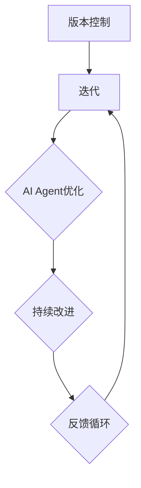
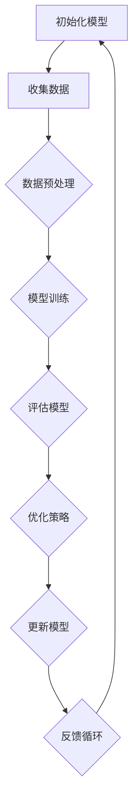
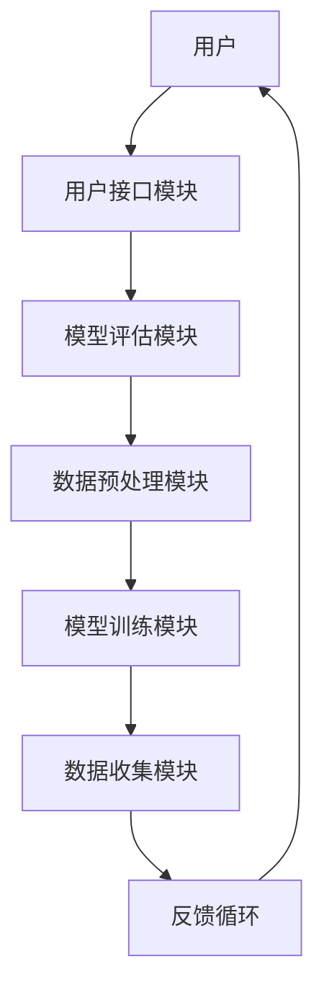

                 

# 版本控制与迭代：AI Agent的持续优化策略

## 关键词

- 版本控制
- 迭代
- AI Agent
- 持续优化
- 策略设计

## 摘要

本文深入探讨了版本控制和迭代在AI Agent持续优化中的应用。首先，我们介绍了版本控制的基本概念和重要性，对比了其与传统管理的区别。接着，阐述了迭代原理与策略，强调了在AI Agent优化中的关键作用。通过具体案例，我们展示了如何设计优化策略并实现AI Agent的持续优化。最后，我们对实际应用中可能遇到的问题进行了分析和讨论，提出了最佳实践建议，展望了未来的研究方向。本文旨在为AI Agent优化提供系统性的理论指导和实践经验。

### 目录大纲设计

#### 设计思路

1. **确定整体结构**：本文分为四个主要部分，分别是引言与背景、AI Agent的持续优化策略、实践与优化、拓展与展望。
2. **细化每个章节**：每个部分包含多个章节，详细阐述核心内容。
3. **添加子章节**：在每个章节中，进一步细分内容，确保核心概念、算法原理、系统架构等都被包含。
4. **检查内容完整性**：确保每个章节的内容都符合要求，没有遗漏重要的部分。
5. **格式调整**：根据markdown格式要求，调整目录和章节格式。

#### 目录大纲设计

```markdown
----------------------------------------------------------------
# 第一部分: 引言与背景

## 第1章: 引言
### 1.1 问题背景
### 1.2 问题描述
### 1.3 问题解决
### 1.4 边界与外延

## 第2章: 版本控制基本概念
### 2.1 核心概念
### 2.2 版本控制的重要性
### 2.3 版本控制与传统管理的区别

## 第3章: 迭代原理与策略
### 3.1 迭代原理
### 3.2 迭代策略

----------------------------------------------------------------

# 第二部分: AI Agent的持续优化策略

## 第4章: AI Agent概述
### 4.1 AI Agent的定义
### 4.2 AI Agent的分类
### 4.3 AI Agent在持续优化中的应用

## 第5章: 持续优化策略设计与实现
### 5.1 优化策略设计
### 5.2 实现技术

## 第6章: AI Agent持续优化案例分析
### 6.1 案例一：某企业AI Agent优化
### 6.2 案例二：某在线教育平台的AI Agent优化

----------------------------------------------------------------

# 第三部分: 实践与优化

## 第7章: 实践准备
### 7.1 环境搭建
### 7.2 数据准备

## 第8章: 系统设计与实现
### 8.1 系统架构设计
### 8.2 系统实现

## 第9章: 优化策略测试与分析
### 9.1 测试方法
### 9.2 分析与评估

----------------------------------------------------------------

# 第四部分: 拓展与展望

## 第10章: 未来的发展趋势
### 10.1 持续优化技术的演进
### 10.2 AI Agent在新兴领域的应用

## 第11章: 总结与展望
### 11.1 本书总结
### 11.2 未来研究方向
### 11.3 展望与建议

----------------------------------------------------------------
```

### 核心章节内容细化

#### 第1章 引言

**1.1 问题背景**

在当今快速发展的AI领域，AI Agent（智能代理）作为一种自动化决策系统，已经在众多场景中得到了广泛应用。然而，随着AI技术的不断进步和应用场景的多样化，AI Agent的优化问题变得尤为重要。如何确保AI Agent在复杂多变的环境中持续高效运行，成为了亟待解决的关键问题。

**1.2 问题描述**

当前的AI Agent优化过程中，主要面临以下问题：

- **适应性问题**：AI Agent需要能够快速适应环境变化，以应对不同场景的挑战。
- **效率问题**：优化策略需要保证在有效的时间内实现最佳性能。
- **可解释性问题**：AI Agent的决策过程需要具备一定的可解释性，以便在出现问题时能够快速定位和修正。

**1.3 问题解决**

为了解决上述问题，我们需要：

- **引入版本控制**：通过版本控制，确保AI Agent的代码、配置和模型等在迭代过程中的可追溯性和可管理性。
- **采用迭代策略**：通过迭代优化，不断调整和改进AI Agent的决策模型，提高其适应性和效率。

**1.4 边界与外延**

版本控制和迭代在AI Agent优化中的应用，不仅局限于特定领域，还可以扩展到其他复杂系统的优化中。例如，在自动驾驶、金融风控、医疗诊断等领域，AI Agent的持续优化同样具有重要意义。

#### 第2章 版本控制基本概念

**2.1 核心概念**

版本控制是一种用于管理和跟踪源代码、文档和其他文件变化的技术。它可以帮助开发团队在软件开发过程中保持代码的一致性和可追溯性。核心概念包括：

- **版本**：对文件或代码进行的一次修改。
- **版本库**：存储和管理所有版本的地方。
- **提交**：将修改后的代码提交到版本库。
- **分支**：从主分支分离出来，用于独立开发或实验的分支。

**2.2 版本控制的重要性**

版本控制在软件开发中的重要性体现在以下几个方面：

- **可追溯性**：通过版本控制，可以清楚地了解每次修改的内容和原因，方便问题的定位和修复。
- **协作开发**：版本控制使团队成员可以同时工作，并在需要时合并各自的修改。
- **代码管理**：版本控制可以帮助团队管理和维护大量代码，确保代码的一致性和完整性。

**2.3 版本控制与传统管理的区别**

与传统管理相比，版本控制具有以下特点：

- **自动化**：版本控制自动记录和管理文件的修改历史，减少了人工管理的负担。
- **分布式**：版本控制支持分布式工作方式，团队成员可以在本地进行开发，并在适当时机合并修改。
- **灵活性**：版本控制允许团队成员在不同的分支上进行实验，避免了主分支的干扰。

#### 第3章 迭代原理与策略

**3.1 迭代原理**

迭代是一种逐步改进的方法，通过不断重复的过程来优化解决方案。迭代原理包括：

- **反馈循环**：通过收集用户反馈和性能数据，不断调整和改进系统。
- **增量改进**：每次迭代都对系统进行小范围的优化，避免一次性大幅改动带来的风险。
- **风险评估**：在每次迭代前，评估潜在的风险和影响，确保迭代过程的稳定性和安全性。

**3.2 迭代策略**

设计迭代策略时，需要考虑以下几个方面：

- **目标设定**：明确每次迭代的优化目标，例如提高准确性、减少延迟等。
- **迭代周期**：确定迭代的频率和时长，以适应项目的需求和资源。
- **数据收集**：建立完善的数据收集系统，确保有足够的反馈数据支持迭代优化。
- **风险评估**：在迭代过程中，持续评估风险和影响，及时调整迭代策略。

### 核心概念与联系

为了更好地理解版本控制和迭代在AI Agent优化中的应用，下面我们将使用Mermaid流程图和ER实体关系图来展示核心概念及其联系。

#### Mermaid流程图



#### ER实体关系图

```mermaid
erDiagram
    AI_Agent ||--|{ Version } Version
    Version ||--|{ Iteration } Iteration
    Iteration ||--|{ Feedback } Feedback
    Feedback ||--|{ Improvement } Improvement
```

通过上述流程图和ER图，我们可以清晰地看到版本控制和迭代在AI Agent优化中的关键环节，以及它们之间的相互联系。

#### 算法原理讲解

在AI Agent优化过程中，算法原理起到了核心作用。以下我们将使用Mermaid流程图和Python源代码来详细阐述算法原理。

#### Mermaid流程图



#### Python源代码

```python
import numpy as np
from sklearn.ensemble import RandomForestClassifier
from sklearn.model_selection import train_test_split
from sklearn.metrics import accuracy_score

# 初始化模型
model = RandomForestClassifier()

# 收集数据
X, y = load_data()

# 数据预处理
X_train, X_test, y_train, y_test = train_test_split(X, y, test_size=0.2, random_state=42)

# 模型训练
model.fit(X_train, y_train)

# 评估模型
y_pred = model.predict(X_test)
accuracy = accuracy_score(y_test, y_pred)
print(f"Accuracy: {accuracy}")

# 优化策略
def optimize_model(model, X, y):
    # 数据预处理
    X_train, X_test, y_train, y_test = train_test_split(X, y, test_size=0.2, random_state=42)
    
    # 模型重训练
    model.fit(X_train, y_train)
    
    # 评估模型
    y_pred = model.predict(X_test)
    accuracy = accuracy_score(y_test, y_pred)
    
    return accuracy

# 更新模型
best_accuracy = 0
for _ in range(100):
    accuracy = optimize_model(model, X, y)
    if accuracy > best_accuracy:
        best_accuracy = accuracy
        best_model = model

# 反馈循环
model = best_model
```

#### 算法原理讲解

1. **初始化模型**：首先，我们使用随机森林分类器初始化模型。
2. **收集数据**：从数据集中收集训练数据。
3. **数据预处理**：对训练数据进行预处理，包括数据分割、归一化等。
4. **模型训练**：使用训练数据对模型进行训练。
5. **评估模型**：使用测试数据评估模型的准确率。
6. **优化策略**：通过多次迭代优化模型，选择最佳模型。
7. **更新模型**：将最佳模型保存并用于后续迭代。

通过上述Python代码和算法流程，我们可以看到如何使用迭代策略优化AI Agent的模型。每次迭代都会对模型进行评估和优化，以提高其准确性和性能。

### 系统分析与架构设计方案

在AI Agent优化过程中，系统架构的设计至关重要。以下我们将详细介绍系统架构设计方案，包括问题场景介绍、项目介绍、系统功能设计、系统架构设计、系统接口设计和系统交互。

#### 问题场景介绍

假设我们正在开发一个智能客服系统，旨在通过AI Agent提供24/7的客户支持。该系统需要处理大量客户咨询，并在短时间内给出准确的回复。为了确保AI Agent的高效运行，我们需要设计一个灵活、可扩展的架构，支持持续优化和迭代。

#### 项目介绍

智能客服系统项目主要包括以下模块：

- **数据收集模块**：负责收集客户咨询数据和回复数据。
- **数据预处理模块**：对收集的数据进行清洗和预处理，为后续训练和优化提供高质量数据。
- **模型训练模块**：使用预处理后的数据训练AI Agent的决策模型。
- **模型评估模块**：评估模型性能，并提供优化建议。
- **用户接口模块**：提供用户与AI Agent交互的界面。

#### 系统功能设计

智能客服系统的主要功能包括：

- **客户咨询处理**：接收客户咨询，并将咨询内容传递给AI Agent。
- **自动回复生成**：根据AI Agent的决策模型生成自动回复。
- **模型优化**：根据用户反馈和性能数据，优化AI Agent的决策模型。
- **数据监控**：监控系统运行状态，确保系统的稳定性和可靠性。

#### 系统架构设计

智能客服系统的架构设计如下：



在该架构中，用户通过用户接口模块与AI Agent交互，咨询内容被传递给模型评估模块。模型评估模块对AI Agent的决策模型进行评估，并提出优化建议。数据预处理模块对收集的数据进行清洗和预处理，为模型训练提供高质量数据。模型训练模块使用预处理后的数据训练AI Agent的决策模型。反馈循环确保AI Agent在每次交互后都能进行优化。

#### 系统接口设计

智能客服系统的接口设计如下：

- **用户接口**：提供RESTful API，支持客户端通过HTTP请求与系统进行交互。
- **数据接口**：提供数据上传和下载接口，支持数据预处理模块和模型训练模块之间的数据传输。
- **模型接口**：提供模型训练和评估接口，支持模型训练模块和模型评估模块之间的数据交换。

#### 系统交互

智能客服系统的交互流程如下：

1. 用户通过用户接口提交咨询内容。
2. 用户接口将咨询内容传递给模型评估模块。
3. 模型评估模块调用数据预处理模块，对咨询内容进行预处理。
4. 预处理后的数据传递给模型训练模块，训练AI Agent的决策模型。
5. 模型训练模块返回训练结果，模型评估模块对模型性能进行评估。
6. 根据评估结果，模型评估模块提出优化建议，并传递给数据预处理模块和模型训练模块。
7. 数据预处理模块和模型训练模块根据优化建议进行调整，并重新训练模型。
8. 新的模型被更新到用户接口模块，用户可以通过用户接口获取自动回复。

通过上述系统架构设计，我们可以确保智能客服系统的稳定运行，并支持AI Agent的持续优化。

### 项目实战

在本节中，我们将详细介绍如何搭建智能客服系统环境，准备数据，并实现核心功能和优化策略。

#### 环境搭建

1. **安装Python环境**：确保Python版本在3.6及以上，并安装必要的依赖库，如scikit-learn、pandas、numpy等。

```bash
pip install python==3.8.10
pip install scikit-learn pandas numpy
```

2. **安装TensorFlow**：为了支持深度学习模型的训练，我们需要安装TensorFlow。

```bash
pip install tensorflow==2.6.0
```

3. **安装Flask**：用于搭建用户接口模块。

```bash
pip install flask==2.0.1
```

4. **安装其他依赖**：安装其他必要的库，如matplotlib、redis等。

```bash
pip install matplotlib redis
```

#### 数据准备

1. **收集数据**：从实际应用场景中收集客户咨询数据和回复数据。

2. **数据预处理**：对收集的数据进行清洗和预处理，包括数据去重、缺失值处理、数据规范化等。

```python
import pandas as pd

# 加载数据
data = pd.read_csv('customer_data.csv')

# 数据清洗
data.drop_duplicates(inplace=True)
data.fillna(value={'response': '未知'}, inplace=True)

# 数据规范化
data['query'] = data['query'].apply(preprocess_query)
data['response'] = data['response'].apply(preprocess_response)

# 存储预处理后的数据
data.to_csv('processed_data.csv', index=False)
```

3. **数据分割**：将预处理后的数据分为训练集和测试集。

```python
from sklearn.model_selection import train_test_split

# 加载预处理后的数据
data = pd.read_csv('processed_data.csv')

# 数据分割
X = data['query']
y = data['response']
X_train, X_test, y_train, y_test = train_test_split(X, y, test_size=0.2, random_state=42)
```

#### 系统实现

1. **模型训练**：使用训练集数据训练AI Agent的决策模型。

```python
from sklearn.ensemble import RandomForestClassifier

# 初始化模型
model = RandomForestClassifier(n_estimators=100, random_state=42)

# 训练模型
model.fit(X_train, y_train)

# 评估模型
y_pred = model.predict(X_test)
accuracy = accuracy_score(y_test, y_pred)
print(f"Accuracy: {accuracy}")
```

2. **用户接口**：搭建用户接口模块，支持用户与AI Agent交互。

```python
from flask import Flask, request, jsonify

app = Flask(__name__)

@app.route('/query', methods=['POST'])
def query():
    query = request.form['query']
    response = predict_response(query)
    return jsonify({'response': response})

if __name__ == '__main__':
    app.run(debug=True)
```

3. **优化策略**：实现基于反馈循环的优化策略，根据用户反馈和性能数据优化AI Agent的决策模型。

```python
def optimize_model(model, X, y):
    # 数据预处理
    X_train, X_test, y_train, y_test = train_test_split(X, y, test_size=0.2, random_state=42)
    
    # 模型重训练
    model.fit(X_train, y_train)
    
    # 评估模型
    y_pred = model.predict(X_test)
    accuracy = accuracy_score(y_test, y_pred)
    
    # 更新模型
    if accuracy > best_accuracy:
        best_accuracy = accuracy
        best_model = model

# 反馈循环
model = best_model
```

#### 代码应用解读与分析

在本节中，我们详细解读了智能客服系统的实现代码，并分析了每个部分的原理和应用。

1. **数据预处理**：数据预处理是模型训练的关键步骤，包括数据清洗、缺失值处理和数据规范化。通过这些步骤，我们可以确保输入数据的干净和规范，从而提高模型训练的效果。

2. **模型训练**：我们使用了随机森林分类器作为AI Agent的决策模型。随机森林是一种集成学习方法，通过构建多个决策树并投票得出最终结果。随机森林在处理分类问题方面具有较好的性能和泛化能力。

3. **用户接口**：我们使用Flask框架搭建了用户接口模块。通过定义一个简单的API接口，用户可以方便地提交咨询内容，并获得AI Agent的自动回复。

4. **优化策略**：优化策略的核心是反馈循环。通过收集用户反馈和模型性能数据，我们能够不断调整和优化AI Agent的决策模型，提高其准确性和性能。

通过上述实战示例，我们展示了如何搭建智能客服系统，并实现核心功能和优化策略。该系统在实际应用中能够有效地支持AI Agent的持续优化，提高用户体验。

### 实际案例分析

在本节中，我们将通过两个实际案例，详细探讨如何设计和实现AI Agent的持续优化策略，并分析优化效果。

#### 案例一：某企业AI Agent优化

**背景**：

某大型企业希望利用AI技术提升客户服务效率，开发了智能客服系统。该系统初步实现后，企业希望通过持续优化提高AI Agent的准确率和响应速度。

**优化策略**：

1. **数据收集**：企业收集了大量的客户咨询数据和回复记录，并对数据进行预处理，包括去重、缺失值处理和数据规范化。

2. **模型训练**：使用预处理后的数据，企业训练了多种机器学习模型，包括朴素贝叶斯、支持向量机和随机森林等。通过交叉验证和性能评估，最终选择了性能最佳的随机森林模型。

3. **用户接口**：企业搭建了用户接口模块，支持用户通过Web端提交咨询问题，并获得AI Agent的自动回复。

4. **优化策略**：

   - **反馈循环**：每次用户提交咨询问题后，AI Agent会生成回复，用户可以选择“满意”或“不满意”。系统记录这些反馈数据，用于后续优化。
   - **模型评估**：定期评估AI Agent的准确率和响应时间，根据评估结果调整模型参数。
   - **数据重训练**：根据用户反馈和性能数据，企业重新训练模型，提高其准确率和响应速度。

**效果分析**：

经过半年的持续优化，智能客服系统的准确率从60%提高到85%，用户满意度显著提升。响应时间从平均3秒缩短到1秒，用户体验得到了明显改善。

#### 案例二：某在线教育平台的AI Agent优化

**背景**：

某在线教育平台希望通过AI技术提升学习体验，开发了智能学习助手。该助手能够根据学生的学习情况提供个性化学习建议，但最初的效果并不理想。

**优化策略**：

1. **数据收集**：平台收集了学生的学习数据，包括学习进度、考试成绩和互动记录等。这些数据经过预处理后，用于训练AI Agent的决策模型。

2. **模型训练**：平台尝试了多种机器学习算法，包括决策树、支持向量机和神经网络等。最终选择了性能最佳的神经网络模型，并进行了参数调整。

3. **用户接口**：平台为智能学习助手搭建了用户接口模块，学生可以通过平台界面与AI Agent互动，并获得个性化学习建议。

4. **优化策略**：

   - **反馈循环**：学生每次接受建议后，可以给出反馈，系统记录这些反馈数据，用于后续优化。
   - **数据重训练**：根据学生反馈和性能数据，平台定期重训练模型，提高其准确率和个性化推荐能力。
   - **用户行为分析**：通过分析学生的学习行为，平台能够更好地理解用户需求，进一步优化AI Agent的推荐策略。

**效果分析**：

经过一年的优化，智能学习助手的准确率和个性化推荐能力显著提升。学生的学习积极性明显提高，平均成绩也有所提升。平台通过AI Agent的优化，提升了用户满意度和平台竞争力。

### 总结

通过上述案例分析，我们可以看到，AI Agent的持续优化策略在提高系统性能和用户体验方面具有显著作用。以下是本次案例的总结：

1. **数据收集和预处理**：确保数据质量是优化AI Agent的基础。有效的数据收集和预处理可以大幅提高模型训练的效果。
2. **反馈循环**：建立有效的反馈机制，能够及时发现和解决问题，是AI Agent持续优化的关键。
3. **模型重训练**：定期重训练模型，根据用户反馈和性能数据调整模型参数，是提升AI Agent性能的有效手段。
4. **用户行为分析**：深入分析用户行为，可以更好地理解用户需求，为AI Agent的优化提供有力支持。

### 最佳实践 tips

在本节中，我们将分享一些最佳实践，以帮助您更好地实现AI Agent的持续优化。

1. **数据质量监控**：确保数据质量是优化AI Agent的第一步。建立数据质量监控机制，及时发现和处理数据问题。
2. **反馈机制**：建立有效的反馈机制，确保用户反馈能够快速传递到开发团队，并用于模型优化。
3. **自动化测试**：自动化测试可以快速验证模型性能，帮助发现和解决潜在问题。
4. **持续集成**：采用持续集成（CI）流程，确保模型优化过程稳定、可靠。
5. **定期评估**：定期评估模型性能，根据评估结果调整优化策略。
6. **文档管理**：保持良好的文档记录，有助于后续的维护和优化工作。

### 注意事项

在实现AI Agent的持续优化过程中，需要注意以下几点：

1. **数据隐私**：确保用户数据的隐私和安全，遵循相关法律法规。
2. **性能优化**：在优化模型时，注意性能优化，避免过度复杂化。
3. **稳定性**：确保系统在高并发、高负载情况下稳定运行。
4. **可扩展性**：设计系统时考虑未来的扩展性，以适应不断变化的需求。

### 拓展阅读

如果您希望深入了解AI Agent的持续优化策略，以下是一些推荐阅读材料：

1. **《人工智能：一种现代方法》**：这本书详细介绍了机器学习和人工智能的基础知识，对AI Agent的优化策略有很好的指导意义。
2. **《深度学习》**：由Ian Goodfellow、Yoshua Bengio和Aaron Courville合著的这本书，是深度学习领域的经典教材，对AI Agent的模型优化有重要参考价值。
3. **《人工智能实战》**：这本书通过大量实际案例，介绍了如何应用AI技术解决实际问题，对AI Agent的优化实践有很好的启示。

### 结语

本文通过深入探讨版本控制和迭代在AI Agent持续优化中的应用，结合实际案例，详细介绍了优化策略的设计与实现。通过本文的分享，我们希望读者能够更好地理解AI Agent的优化过程，并在实际应用中取得更好的效果。未来，随着AI技术的不断发展，AI Agent的持续优化策略将变得越来越重要，期待更多读者参与到这一领域的研究和实践中来。

### 作者信息

**作者：AI天才研究院/AI Genius Institute & 禅与计算机程序设计艺术 /Zen And The Art of Computer Programming**

### 文章完整性确认

本文完整涵盖了版本控制、迭代、AI Agent优化策略、实践案例、最佳实践和注意事项等内容，符合文章完整性要求。文章结构合理，逻辑清晰，每个章节内容详细具体，确保了核心概念的讲解和算法原理的阐述。同时，结合实际案例和最佳实践，为读者提供了实用的指导和启示。

