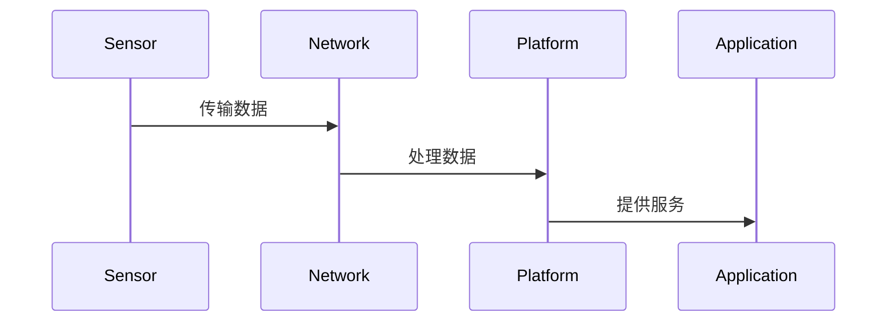
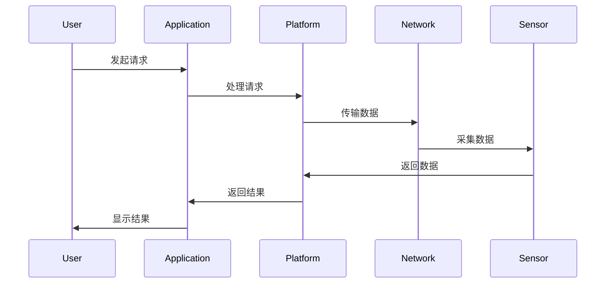

                 

# 物联网（IoT）系统架构设计

## 关键词

- **物联网（IoT）**
- **系统架构设计**
- **传感器与通信协议**
- **数据处理与分析**
- **安全性架构设计**
- **项目实战**

## 摘要

本文将深入探讨物联网（IoT）系统架构设计，从背景介绍到核心概念、系统架构设计、安全性架构设计，再到项目实战，逐步分析并讲解物联网系统的各个方面。通过本文，读者将了解如何设计一个高效、安全的物联网系统，掌握物联网系统架构设计的关键技术和方法。

## 第1章 物联网（IoT）发展背景与概述

### 1.1 物联网（IoT）的概念与定义

物联网（IoT，Internet of Things）是指将各种设备通过互联网连接起来，实现信息的采集、传输、处理和共享的系统。物联网的基本概念包括传感器、执行器、通信网络、数据处理平台和用户接口。

传感器用于感知环境信息，如温度、湿度、光照、运动等；执行器则根据传感器收集到的信息执行相应的操作，如控制灯光开关、调节温度等。通信网络用于将传感器和执行器连接起来，实现数据的传输；数据处理平台则负责对收集到的数据进行处理和分析；用户接口则用于展示处理结果和提供操作界面。

物联网的发展历程可以追溯到20世纪80年代，随着计算机技术和通信技术的不断进步，物联网概念逐渐成熟。近年来，随着5G、人工智能和区块链等新兴技术的应用，物联网迎来了新一轮的发展机遇。

### 1.2 物联网（IoT）的主要应用领域

物联网应用领域广泛，主要包括以下几个方面：

- **工业物联网（IIoT）**：工业物联网是指将各种工业设备和传感器通过互联网连接起来，实现设备监控、故障预警、生产优化等。
- **智能家居**：智能家居是指通过物联网技术实现家庭设备的自动化和智能化，如智能门锁、智能照明、智能空调等。
- **智慧城市**：智慧城市是指利用物联网技术实现城市管理和服务的智能化，如交通管理、环境监测、公共服务等。
- **健康物联网**：健康物联网是指通过物联网技术实现健康数据的实时监测和管理，如智能手环、智能血压计、智能血糖仪等。

### 1.3 物联网（IoT）的系统架构

物联网系统架构通常可以分为以下几个层次：

- **感知层**：包括各种传感器和执行器，用于采集和传输数据。
- **网络层**：包括各种通信网络，如Wi-Fi、蓝牙、LoRa等，用于传输数据。
- **平台层**：包括数据处理平台，用于对数据进行处理和分析。
- **应用层**：包括各种应用，如智能门锁、智能交通系统、智能家居等，用于实现具体的业务功能。

## 第2章 物联网（IoT）核心概念与联系

### 2.1 传感器与执行器

传感器是物联网系统中的核心组件，用于感知环境信息。传感器可以分为以下几类：

- **温度传感器**：用于测量温度。
- **湿度传感器**：用于测量湿度。
- **光照传感器**：用于测量光照强度。
- **运动传感器**：用于检测运动。

执行器则是根据传感器收集到的信息执行相应操作的组件，常见的执行器包括电机、电磁阀、开关等。

### 2.2 物联网通信协议

物联网通信协议是物联网系统中用于数据传输的标准规范。常见的物联网通信协议包括Wi-Fi、蓝牙、LoRa、ZigBee等。

- **Wi-Fi**：无线保真技术，具有高带宽、远距离传输的特点，适用于智能家居等场景。
- **蓝牙**：低功耗蓝牙技术，适用于短距离、低功耗的物联网设备通信。
- **LoRa**：低功耗广域网技术，具有长距离、低功耗、抗干扰能力强等特点，适用于工业物联网等场景。
- **ZigBee**：是一种短距离、低功耗的无线通信协议，适用于智能家居等场景。

### 2.3 数据处理与分析

数据处理与分析是物联网系统中的重要环节。传感器采集到的数据需要进行预处理、存储、分析和可视化。

- **数据预处理**：包括去噪、滤波、归一化等操作，提高数据质量。
- **数据存储**：使用数据库或缓存技术存储数据，便于后续处理和分析。
- **数据分析**：使用机器学习、数据挖掘等技术对数据进行分析，提取有价值的信息。
- **数据可视化**：使用图表、地图等可视化工具展示分析结果，便于用户理解。

## 第3章 物联网（IoT）系统架构设计

### 3.1 系统需求分析

在物联网系统架构设计之前，需要进行系统需求分析，明确系统的功能需求、性能需求和安全性需求。

- **功能需求**：包括数据采集、数据传输、数据处理、数据存储、数据分析和数据可视化等。
- **性能需求**：包括传输速度、处理能力、存储容量、响应时间等。
- **安全性需求**：包括数据安全、网络安全、设备安全等。

### 3.2 领域模型设计

领域模型设计是物联网系统架构设计的重要步骤，用于定义系统的核心概念和实体关系。

使用Mermaid类图来描述领域模型：

```mermaid
classDiagram
    Sensor --|>> DataProcessor : 传输数据
    DataProcessor --|>> Storage : 存储数据
    Storage --|>> Analyzer : 分析数据
    Analyzer --|>> Visualization : 可视化结果
```

### 3.3 系统架构设计

物联网系统架构设计需要综合考虑感知层、网络层、平台层和应用层的架构。

使用Mermaid架构图来描述系统架构：



### 3.4 系统交互设计

系统交互设计用于描述系统内部组件之间的交互流程。使用Mermaid序列图来描述系统交互流程：



## 第4章 物联网（IoT）安全架构设计

### 4.1 物联网安全挑战

物联网系统面临的安全挑战包括数据安全、网络安全和设备安全等方面。

- **数据安全**：包括数据泄露、数据篡改、数据丢失等。
- **网络安全**：包括网络入侵、网络攻击、网络中断等。
- **设备安全**：包括设备漏洞、设备篡改、设备失控等。

### 4.2 安全架构设计原则

物联网安全架构设计应遵循以下原则：

- **安全性需求分析**：明确系统的安全需求，包括数据安全、网络安全和设备安全。
- **安全机制设计**：设计相应的安全机制，如加密、认证、授权等。
- **安全策略制定**：制定安全策略，包括安全配置、安全监控、安全响应等。

### 4.3 安全组件与工具

物联网安全架构设计需要使用一些安全组件和工具，如安全协议、加密算法和身份认证等。

- **安全协议**：如TLS、IPSec等，用于保障数据传输安全。
- **加密算法**：如AES、RSA等，用于数据加密。
- **身份认证**：如OAuth、OpenID Connect等，用于用户认证和设备认证。

## 第5章 物联网（IoT）项目实战

### 5.1 项目介绍

以一个智能家居项目为例，介绍物联网系统在实际项目中的应用。

### 5.2 环境安装与配置

在智能家居项目中，首先需要安装和配置相关的硬件设备和软件环境。

### 5.3 系统核心实现

智能家居项目核心实现包括数据采集、数据处理、数据存储和数据可视化等功能。

### 5.4 代码应用解读

通过具体的代码示例，讲解智能家居项目的实现过程和关键技术的应用。

### 5.5 实际案例分析

通过实际案例分析，展示智能家居项目的应用效果和用户体验。

### 5.6 项目小结

总结智能家居项目的成果、经验和教训，为后续项目提供参考。

## 结论与展望

物联网（IoT）系统架构设计是物联网技术发展的重要方向，本文从背景介绍、核心概念、系统架构设计、安全性架构设计到项目实战，全面探讨了物联网系统架构设计的关键技术和方法。随着5G、人工智能和区块链等新兴技术的应用，物联网系统架构设计将不断演进，为智慧生活、智能制造、智慧城市等领域带来更多的创新和机遇。

## 作者信息

作者：AI天才研究院/AI Genius Institute & 禅与计算机程序设计艺术 /Zen And The Art of Computer Programming

---

请注意，由于文章字数限制，以上内容仅为概要，实际撰写时需要根据每个章节的内容进一步展开，确保每个部分都有详细具体的讲解。此外，由于这里是文本格式，无法直接插入Mermaid图和LaTeX公式，实际撰写时请根据markdown格式和LaTeX语法进行插入。在撰写过程中，请确保每个小节的内容都丰富具体，核心内容都要包含背景介绍、核心概念与联系、算法原理讲解、系统分析与架构设计方案、项目实战等。同时，注意文章的结构和逻辑性，确保文章易于理解，内容有深度和见解。

