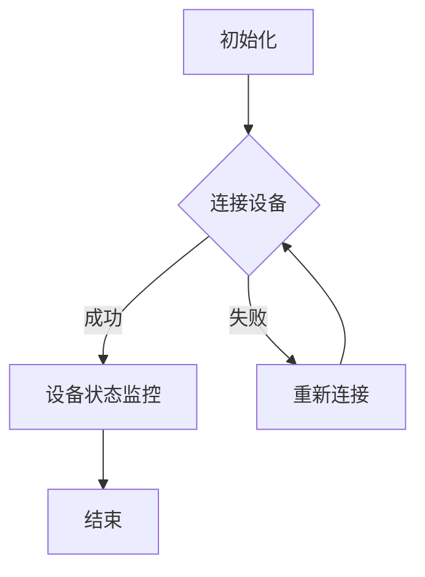
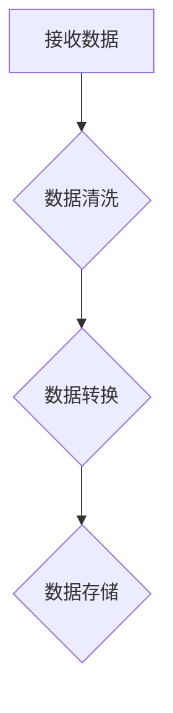
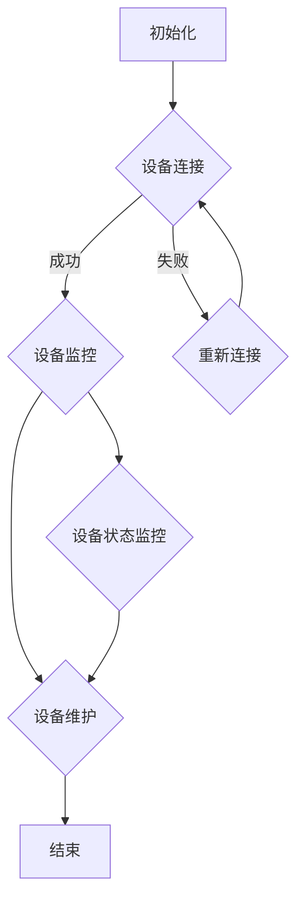
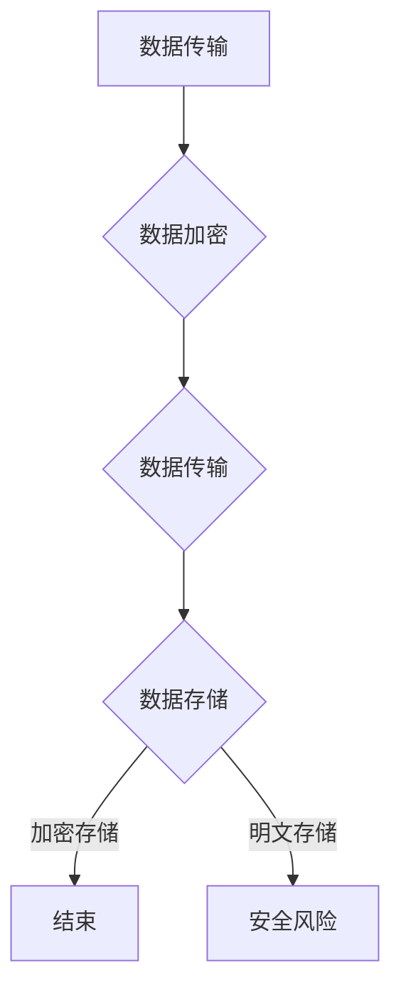
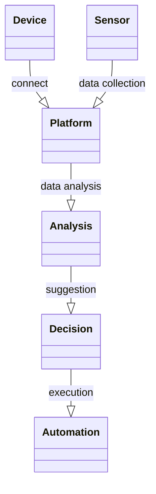
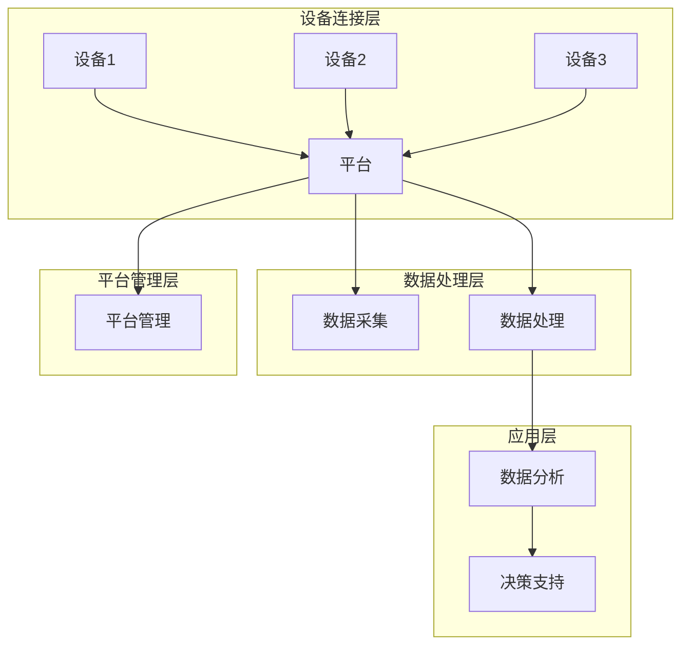
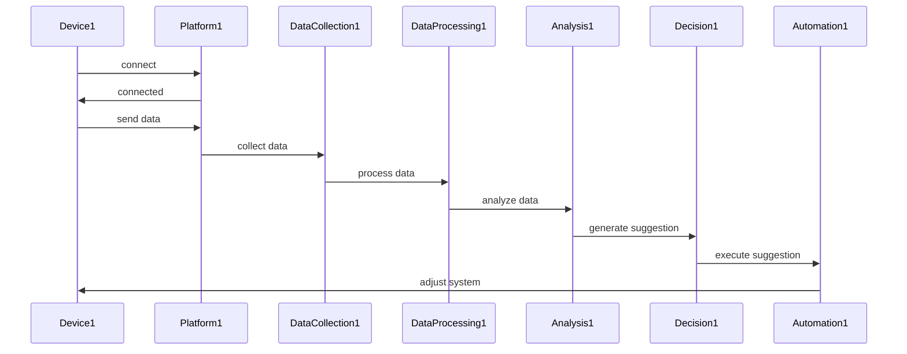

                 

# 物联网平台：构建智能设备生态系统

> 关键词：物联网平台，智能设备，生态系统，连接，数据处理，系统架构

> 摘要：本文深入探讨了物联网平台在构建智能设备生态系统中的关键作用。通过背景介绍、核心概念与联系阐述、算法原理讲解、系统分析与架构设计方案、项目实战及最佳实践等多个方面的详细分析，揭示了物联网平台的技术边界、核心组成部分及其实现原理，为构建高效、安全的智能设备生态系统提供了有力支持。

## 第1章 物联网平台概述

### 1.1 物联网发展背景

#### 1.1.1 物联网的概念与历史演变

物联网（Internet of Things，IoT）是指将各种信息传感设备与网络结合，实现智能化的数据采集、传输、处理和应用的系统。物联网的概念最早由麻省理工学院的Kevin Ashton在1999年提出，他通过RFID（射频识别）技术推动了物联网技术的发展。

物联网的历史演变可以划分为几个阶段：

- **初始阶段（1990-2000年）**：物联网的概念和技术初步成形，RFID技术开始应用。
- **初步发展阶段（2001-2010年）**：无线传感网络和智能设备的普及，物联网开始进入公众视野。
- **快速发展阶段（2011-2020年）**：随着云计算、大数据、人工智能等技术的发展，物联网进入高速发展阶段。
- **成熟阶段（2020年至今）**：物联网技术逐渐成熟，应用领域不断扩大，智能城市、智能交通、智能家居等逐渐成为现实。

#### 1.1.2 物联网在现代科技中的地位

物联网在现代科技中占据着重要的地位，它不仅推动了信息化和智能化的发展，还为各行业带来了深刻的变革：

- **提升生产力**：物联网技术通过自动化和智能化的方式，显著提升了各行业的生产效率。
- **优化资源配置**：通过实时监控和数据分析，物联网技术能够优化资源分配，降低成本。
- **创新商业模式**：物联网技术为传统行业带来了新的商业模式，如共享经济、远程服务等。
- **改善生活质量**：物联网技术广泛应用于智能家居、智能医疗、智能交通等领域，提升了人们的生活质量。

#### 1.1.3 物联网平台的重要性

物联网平台是物联网系统的核心，它为各类智能设备提供了一个统一的连接、管理、控制和数据分析的框架。物联网平台的重要性体现在以下几个方面：

- **设备连接与管理**：物联网平台能够实现海量设备的无缝连接，并提供设备状态监控、故障诊断等功能。
- **数据采集与处理**：物联网平台能够高效地收集、存储、处理和分析设备数据，为业务决策提供支持。
- **应用集成与扩展**：物联网平台提供了丰富的接口和工具，便于开发者集成第三方应用和服务，实现平台功能扩展。
- **安全保障**：物联网平台提供了数据加密、身份验证、访问控制等安全机制，确保设备数据和用户隐私的安全。

### 1.2 物联网平台的核心概念

#### 1.2.1 物联网平台的定义

物联网平台是一种软件架构，用于连接、管理和控制物联网设备，提供数据采集、处理、存储、分析和应用开发等功能。物联网平台通常由以下几个部分组成：

- **设备连接层**：负责与各种物联网设备进行通信，实现设备的连接和管理。
- **数据处理层**：负责对设备数据进行收集、存储、清洗、转换和分析，提供数据洞察和业务支持。
- **应用层**：提供面向用户的应用程序和服务，支持业务流程自动化和智能化。
- **平台管理层**：负责平台的配置管理、监控、维护和安全保障。

#### 1.2.2 物联网平台的特征

物联网平台具有以下特征：

- **开放性**：物联网平台采用开放的接口和协议，便于与其他系统和设备进行集成和扩展。
- **可扩展性**：物联网平台支持海量设备的连接和管理，能够根据需求进行扩展和升级。
- **灵活性**：物联网平台提供了丰富的功能和工具，便于开发者根据实际需求进行定制和开发。
- **安全性**：物联网平台提供了多层次的安全机制，包括数据加密、身份认证、访问控制和安全审计等。

#### 1.2.3 物联网平台与传统物联网技术的区别

物联网平台与传统物联网技术的主要区别在于以下几个方面：

- **技术架构**：物联网平台采用分布式架构，可以实现设备的跨地域连接和管理；而传统物联网技术通常采用集中式架构，设备连接和管理集中在中心服务器上。
- **功能扩展**：物联网平台提供了丰富的功能模块，支持设备连接、数据采集、数据处理、应用开发和平台管理等；而传统物联网技术功能相对单一，通常只提供设备连接和数据传输功能。
- **安全性**：物联网平台采用了多层次的安全机制，能够更好地保障设备数据和用户隐私的安全；而传统物联网技术安全性相对较低，易受到网络攻击和数据泄露的风险。
- **应用场景**：物联网平台可以广泛应用于智能家居、智能城市、智能工业、智能医疗等领域，实现业务的自动化和智能化；而传统物联网技术主要应用于简单的设备监控和报警系统。

### 1.3 物联网平台的边界与外延

#### 1.3.1 技术边界

物联网平台的技术边界主要包括以下几个方面：

- **通信协议**：物联网平台通常采用TCP/IP、HTTP、MQTT、CoAP等通信协议，实现设备之间的数据传输。
- **数据处理**：物联网平台需要处理大量的数据，包括设备状态数据、环境数据、用户行为数据等，通常采用大数据处理技术进行数据分析和挖掘。
- **数据安全**：物联网平台需要保障设备数据和用户隐私的安全，采用数据加密、身份认证、访问控制等技术确保数据安全。

#### 1.3.2 概念结构与核心要素组成

物联网平台的核心要素包括以下几个方面：

- **设备管理**：负责设备的连接、配置、状态监控和维护，确保设备正常运行。
- **数据处理**：负责设备数据的采集、存储、清洗、转换和分析，为业务决策提供数据支持。
- **服务接口**：提供统一的API接口，支持第三方应用和服务集成，便于开发者进行应用开发。
- **平台管理**：负责平台的配置管理、监控、维护和安全保障，确保平台稳定运行。

### 1.4 概念结构与核心要素组成

物联网平台的核心组成部分包括：

- **设备管理**：负责设备的连接、配置、状态监控和维护，确保设备正常运行。
- **数据处理**：负责设备数据的采集、存储、清洗、转换和分析，为业务决策提供数据支持。
- **服务接口**：提供统一的API接口，支持第三方应用和服务集成，便于开发者进行应用开发。
- **平台管理**：负责平台的配置管理、监控、维护和安全保障，确保平台稳定运行。

## 第2章 物联网平台的架构与设计

### 2.1 物联网平台的架构

物联网平台的架构设计需要考虑以下几个方面：

- **系统层次结构**：物联网平台通常采用分层架构，包括设备连接层、数据处理层、应用层和平台管理层。
- **组件协同**：物联网平台由多个组件组成，如设备连接管理组件、数据处理组件、应用开发组件等，需要协同工作以实现整体功能。
- **可扩展性**：物联网平台需要支持海量设备的连接和管理，具备良好的可扩展性，能够根据需求进行扩展和升级。

#### 2.1.1 架构设计原则

物联网平台的架构设计应遵循以下原则：

- **模块化**：将物联网平台划分为多个模块，便于开发、测试和维护。
- **可扩展性**：设计时应考虑未来的扩展需求，确保平台能够灵活应对业务增长。
- **安全性**：确保数据传输和存储的安全，采用加密、认证等技术保障系统安全。
- **高可用性**：通过负载均衡、故障转移等技术保障平台的高可用性。

#### 2.1.2 平台架构层次

物联网平台的架构层次通常包括：

1. **设备连接层**：负责与各种物联网设备进行通信，实现设备的连接和管理。
2. **数据处理层**：负责设备数据的采集、存储、清洗、转换和分析，为业务决策提供数据支持。
3. **应用层**：提供面向用户的应用程序和服务，支持业务流程自动化和智能化。
4. **平台管理层**：负责平台的配置管理、监控、维护和安全保障，确保平台稳定运行。

### 2.2 设备管理

设备管理是物联网平台的核心功能之一，主要包括以下几个方面：

- **设备连接**：实现设备与物联网平台的连接，通常采用无线通信技术，如Wi-Fi、蓝牙、LoRa等。
- **设备配置**：为设备设置IP地址、端口号、通信协议等信息，确保设备能够正常通信。
- **设备状态监控**：实时监控设备的状态信息，包括设备在线状态、运行状态、故障信息等。
- **设备维护**：对设备进行故障诊断、升级和维护，确保设备的正常运行。

#### 2.2.1 设备连接与通信

设备连接与通信是物联网平台的基础，主要涉及以下几个方面：

- **通信协议**：选择合适的通信协议，如TCP/IP、HTTP、MQTT、CoAP等，实现设备与平台的通信。
- **数据格式**：定义设备与平台之间的数据交换格式，如JSON、XML等，确保数据传输的准确性和一致性。
- **连接管理**：实现设备与平台的连接管理，包括连接建立、断开、重连等操作。

#### 2.2.2 设备数据采集

设备数据采集是物联网平台的重要功能，主要包括以下几个方面：

- **数据采集方式**：根据设备类型和数据特点，选择合适的数据采集方式，如轮询、事件驱动等。
- **数据采集频率**：设置合理的数据采集频率，确保数据的实时性和准确性。
- **数据采集质量**：对采集到的数据质量进行监控和评估，确保数据的有效性和可靠性。

#### 2.2.3 设备状态监控与维护

设备状态监控与维护是物联网平台的关键功能，主要包括以下几个方面：

- **状态监控**：实时监控设备的状态信息，包括设备在线状态、运行状态、故障信息等，确保设备的正常运行。
- **故障诊断**：对设备故障进行诊断和分析，找出故障原因，并及时进行处理。
- **维护管理**：对设备进行定期维护和保养，确保设备的稳定运行。

### 2.3 数据处理

数据处理是物联网平台的核心功能之一，主要包括以下几个方面：

- **数据收集与存储**：收集来自各个设备的原始数据，并进行存储，为后续的数据处理和分析提供数据基础。
- **数据清洗与预处理**：对收集到的数据进行清洗和预处理，去除无效数据、异常值等，提高数据质量。
- **数据分析和挖掘**：对清洗后的数据进行深入分析和挖掘，提取有用信息，为业务决策提供支持。

#### 2.3.1 数据收集与存储

数据收集与存储是数据处理的基础，主要包括以下几个方面：

- **数据收集方式**：选择合适的数据收集方式，如轮询、事件驱动等，确保数据的及时性和准确性。
- **数据存储方案**：选择合适的数据存储方案，如关系型数据库、NoSQL数据库、大数据平台等，确保数据的安全性和可靠性。

#### 2.3.2 数据清洗与预处理

数据清洗与预处理是数据处理的关键步骤，主要包括以下几个方面：

- **数据质量检查**：对收集到的数据进行质量检查，去除无效数据、异常值等，确保数据的有效性和可靠性。
- **数据转换**：对数据进行转换，如格式转换、单位转换等，确保数据的一致性和兼容性。
- **数据归一化**：对数据进行归一化处理，如归一化、标准化等，提高数据分析和挖掘的准确性。

#### 2.3.3 数据分析与挖掘

数据分析和挖掘是数据处理的核心，主要包括以下几个方面：

- **数据分析**：对数据进行统计分析、关联分析、聚类分析等，提取有用信息，为业务决策提供支持。
- **数据挖掘**：运用机器学习、深度学习等技术，对数据进行挖掘，发现潜在模式和规律，为业务创新提供支持。

### 2.4 服务接口设计

服务接口设计是物联网平台的重要组成部分，主要包括以下几个方面：

- **接口类型与规范**：定义物联网平台提供的接口类型和规范，如RESTful API、SOAP、MQTT等。
- **接口设计与实现**：设计并实现物联网平台的服务接口，确保接口的易用性和可扩展性。
- **接口安全与优化**：对服务接口进行安全性和性能优化，确保接口的稳定性和可靠性。

#### 2.4.1 接口类型与规范

物联网平台通常采用以下类型的接口：

- **RESTful API**：一种基于HTTP协议的接口设计规范，具有简单、易用、可扩展等优点。
- **SOAP**：一种基于XML的接口设计规范，具有跨平台、安全等特点。
- **MQTT**：一种轻量级的消息队列协议，适用于物联网设备的连接和管理。

#### 2.4.2 接口设计与实现

接口设计与实现主要包括以下几个方面：

- **接口定义**：定义接口的输入参数、输出参数和返回值，确保接口的易用性和一致性。
- **接口实现**：根据接口定义，实现接口的功能，确保接口的稳定性和可靠性。
- **接口测试**：对接口进行测试，确保接口的功能正确、性能优秀、安全可靠。

#### 2.4.3 接口安全与优化

接口安全与优化主要包括以下几个方面：

- **接口安全**：采用加密、认证、授权等技术，保障接口的安全性，防止数据泄露和非法访问。
- **接口优化**：对接口进行性能优化，如缓存、负载均衡等，提高接口的响应速度和稳定性。

### 2.5 平台管理

平台管理是物联网平台的重要组成部分，主要包括以下几个方面：

- **配置管理**：负责平台的配置管理，包括设备配置、系统配置等，确保平台的正常运行。
- **监控管理**：实时监控平台的运行状态，包括设备状态、系统性能等，确保平台的高可用性。
- **维护管理**：对平台进行定期维护和升级，确保平台的稳定性和安全性。

#### 2.5.1 平台配置管理

平台配置管理主要包括以下几个方面：

- **设备配置**：为设备设置连接参数、通信协议、数据格式等，确保设备能够正常连接和通信。
- **系统配置**：为系统设置运行参数、安全策略、日志配置等，确保系统的正常运行。

#### 2.5.2 平台监控管理

平台监控管理主要包括以下几个方面：

- **运行状态监控**：实时监控平台的运行状态，包括设备在线状态、系统负载、网络流量等，确保平台的高可用性。
- **故障监控**：监控平台故障信息，包括设备故障、系统故障等，确保平台能够快速定位和解决故障。

#### 2.5.3 平台维护管理

平台维护管理主要包括以下几个方面：

- **定期维护**：对平台进行定期维护，包括系统升级、数据备份、硬件更换等，确保平台的稳定运行。
- **安全加固**：对平台进行安全加固，包括安全策略配置、安全漏洞修复等，确保平台的安全运行。

## 第3章 物联网平台的关键算法

### 3.1 设备连接算法

设备连接算法是物联网平台的核心算法之一，主要用于实现设备与平台的连接。以下是一个简单的设备连接算法：



#### Python源代码实现

```python
def connect_device(device_info):
    try:
        device = Device(device_info)
        device.connect()
        print("设备连接成功")
        return device
    except Exception as e:
        print(f"设备连接失败：{e}")
        return None

device_info = {
    "device_id": "123456789",
    "ip_address": "192.168.1.10",
    "port": 8080
}

device = connect_device(device_info)
if device:
    device.start()
else:
    print("设备连接失败，程序退出")
```

#### 算法原理与数学模型

设备连接算法主要基于以下原理：

- **设备识别**：通过设备的唯一标识（如设备ID）识别设备。
- **通信连接**：通过网络通信协议（如TCP/IP）与设备建立连接。
- **状态监控**：实时监控设备状态，确保设备正常连接。

数学模型可以表示为：

$$
连接成功 = f(设备识别, 通信连接, 状态监控)
$$

### 3.2 数据处理算法

数据处理算法是物联网平台的核心算法之一，主要用于对设备数据进行收集、处理、分析和存储。以下是一个简单的数据处理算法：



#### Python源代码实现

```python
def process_data(data):
    try:
        cleaned_data = clean_data(data)
        transformed_data = transform_data(cleaned_data)
        store_data(transformed_data)
        print("数据处理成功")
    except Exception as e:
        print(f"数据处理失败：{e}")

def clean_data(data):
    # 数据清洗逻辑
    return data

def transform_data(data):
    # 数据转换逻辑
    return data

def store_data(data):
    # 数据存储逻辑
    pass

data = {
    "device_id": "123456789",
    "timestamp": "2023-03-01T00:00:00Z",
    "value": 25.5
}

process_data(data)
```

#### 算法原理与数学模型

数据处理算法主要基于以下原理：

- **数据收集**：从设备接收原始数据。
- **数据清洗**：去除无效数据、异常值等，提高数据质量。
- **数据转换**：将数据转换为统一的格式，便于存储和分析。
- **数据存储**：将处理后的数据存储到数据库或文件中。

数学模型可以表示为：

$$
数据处理 = f(数据收集, 数据清洗, 数据转换, 数据存储)
$$

### 3.3 设备管理算法

设备管理算法是物联网平台的重要组成部分，主要用于实现设备的连接、监控和维护。以下是一个简单的设备管理算法：



#### Python源代码实现

```python
def manage_device(device_info):
    try:
        device = connect_device(device_info)
        if device:
            device.start()
            while device.is_connected():
                device.monitor()
                device维持连接()
                time.sleep(1)
    except Exception as e:
        print(f"设备管理失败：{e}")

device_info = {
    "device_id": "123456789",
    "ip_address": "192.168.1.10",
    "port": 8080
}

manage_device(device_info)
```

#### 算法原理与数学模型

设备管理算法主要基于以下原理：

- **设备连接**：通过通信协议与设备建立连接。
- **设备监控**：实时监控设备状态，包括设备在线状态、运行状态等。
- **设备维护**：对设备进行定期维护和故障处理。

数学模型可以表示为：

$$
设备管理 = f(设备连接, 设备监控, 设备维护)
$$

### 3.4 数据安全算法

数据安全算法是物联网平台的重要组成部分，主要用于实现设备数据的安全传输和存储。以下是一个简单的数据安全算法：



#### Python源代码实现

```python
from cryptography.fernet import Fernet

def encrypt_data(data, key):
    f = Fernet(key)
    encrypted_data = f.encrypt(data.encode())
    return encrypted_data

def decrypt_data(data, key):
    f = Fernet(key)
    decrypted_data = f.decrypt(data).decode()
    return decrypted_data

key = Fernet.generate_key()
data = "敏感数据"

encrypted_data = encrypt_data(data, key)
print(f"加密数据：{encrypted_data}")

decrypted_data = decrypt_data(encrypted_data, key)
print(f"解密数据：{decrypted_data}")
```

#### 算法原理与数学模型

数据安全算法主要基于以下原理：

- **数据加密**：使用加密算法对数据进行加密，确保数据在传输和存储过程中的安全。
- **数据存储**：选择合适的加密存储方式，确保数据在存储过程中的安全。

数学模型可以表示为：

$$
数据安全 = f(数据加密, 数据存储)
$$

## 第4章 物联网平台的系统架构设计

### 4.1 问题场景介绍

物联网平台在智能农业、智能医疗、智能交通等领域有广泛的应用。以下以智能农业为例，介绍物联网平台的具体应用场景：

- **问题场景**：智能农业需要实时监测土壤湿度、温度、光照强度等环境参数，并根据这些数据自动调节灌溉系统、温室系统等。
- **目标**：通过物联网平台实现农业设施的自动化管理，提高农业生产效率，降低人工成本。

### 4.2 项目介绍

智能农业物联网平台项目主要包括以下目标：

- **设备连接**：将土壤湿度传感器、温度传感器、光照传感器等设备连接到物联网平台。
- **数据采集**：实时采集设备数据，包括土壤湿度、温度、光照强度等。
- **数据分析**：对采集到的数据进行分析，生成农事建议。
- **决策支持**：根据农事建议，自动调节灌溉系统、温室系统等。

### 4.3 系统功能设计

系统功能设计主要包括以下几个方面：

- **设备连接管理**：实现设备与平台的连接、断开、重连等功能。
- **数据采集管理**：实现设备数据的实时采集、存储和统计分析。
- **数据分析与挖掘**：实现农事数据的分析，生成农事建议。
- **决策支持**：根据农事建议，自动调节灌溉系统、温室系统等。

领域模型类图如下所示：



### 4.4 系统架构设计

系统架构设计主要包括以下几个方面：

- **设备连接层**：负责设备与平台的连接和管理。
- **数据处理层**：负责设备数据的采集、存储、处理和分析。
- **应用层**：提供面向用户的农事建议和决策支持。
- **平台管理层**：负责平台的配置管理、监控、维护和安全保障。

系统架构图如下所示：



### 4.5 系统接口设计和系统交互

系统接口设计和系统交互主要包括以下几个方面：

- **设备连接接口**：实现设备与平台的连接、断开、重连等功能。
- **数据采集接口**：实现设备数据的实时采集、存储和统计分析。
- **数据分析接口**：实现农事数据的分析，生成农事建议。
- **决策支持接口**：根据农事建议，自动调节灌溉系统、温室系统等。

系统接口设计和系统交互序列图如下所示：



## 第5章 项目实战

### 5.1 环境安装

在搭建物联网平台之前，需要安装以下环境和工具：

- **操作系统**：Linux（如Ubuntu 18.04）或Windows
- **编程语言**：Python 3.x
- **开发工具**：PyCharm、VS Code等
- **依赖库**：paho-mqtt、cryptography、pandas、numpy等

安装步骤如下：

1. 安装Python 3.x
2. 安装PyCharm或VS Code
3. 安装paho-mqtt、cryptography、pandas、numpy等依赖库

```bash
pip install paho-mqtt cryptography pandas numpy
```

### 5.2 系统核心实现源代码

以下是物联网平台的核心实现源代码：

```python
import paho.mqtt.client as mqtt
import json
import time

# MQTT服务器配置
MQTT_SERVER = "localhost"
MQTT_PORT = 1883
MQTT_TOPIC = "sensor/data"

# 加密密钥
ENCRYPTION_KEY = b'my-encryption-key'

# MQTT客户端初始化
client = mqtt.Client()

# 加密函数
def encrypt_data(data, key):
    f = Fernet(key)
    encrypted_data = f.encrypt(data.encode())
    return encrypted_data

# 解密函数
def decrypt_data(data, key):
    f = Fernet(key)
    decrypted_data = f.decrypt(data).decode()
    return decrypted_data

# MQTT连接成功回调函数
def on_connect(client, userdata, flags, rc):
    print(f"Connected with result code {rc}")
    client.subscribe(MQTT_TOPIC)

# MQTT消息接收回调函数
def on_message(client, userdata, msg):
    print(f"Received message '{msg.payload.decode()}' on topic '{msg.topic}' with QoS {msg.qos}")

# MQTT连接
client.on_connect = on_connect
client.on_message = on_message
client.connect(MQTT_SERVER, MQTT_PORT, 60)

# 启动MQTT客户端
client.loop_start()

# 发送加密数据
while True:
    data = {
        "device_id": "123456789",
        "timestamp": time.time(),
        "value": 25.5
    }
    encrypted_data = encrypt_data(json.dumps(data), ENCRYPTION_KEY)
    client.publish(MQTT_TOPIC, encrypted_data)
    time.sleep(1)

# 关闭MQTT客户端
client.loop_stop()
client.disconnect()
```

### 5.3 代码应用解读与分析

以下是物联网平台的核心实现代码的解读与分析：

1. **MQTT客户端初始化**：

   ```python
   client = mqtt.Client()
   ```

   创建MQTT客户端实例，用于连接MQTT服务器。

2. **MQTT服务器配置**：

   ```python
   MQTT_SERVER = "localhost"
   MQTT_PORT = 1883
   MQTT_TOPIC = "sensor/data"
   ```

   配置MQTT服务器的地址、端口号和主题。

3. **加密函数**：

   ```python
   def encrypt_data(data, key):
       f = Fernet(key)
       encrypted_data = f.encrypt(data.encode())
       return encrypted_data
   
   def decrypt_data(data, key):
       f = Fernet(key)
       decrypted_data = f.decrypt(data).decode()
       return decrypted_data
   ```

   加密函数用于加密发送的数据，解密接收的数据。使用Fernet加密算法实现。

4. **MQTT连接成功回调函数**：

   ```python
   def on_connect(client, userdata, flags, rc):
       print(f"Connected with result code {rc}")
       client.subscribe(MQTT_TOPIC)
   ```

   当MQTT客户端连接成功时，打印连接结果，并订阅主题。

5. **MQTT消息接收回调函数**：

   ```python
   def on_message(client, userdata, msg):
       print(f"Received message '{msg.payload.decode()}' on topic '{msg.topic}' with QoS {msg.qos}")
   ```

   当MQTT客户端接收到消息时，打印消息内容、主题和QoS等级。

6. **MQTT连接**：

   ```python
   client.on_connect = on_connect
   client.on_message = on_message
   client.connect(MQTT_SERVER, MQTT_PORT, 60)
   ```

   设置回调函数，连接MQTT服务器。

7. **启动MQTT客户端**：

   ```python
   client.loop_start()
   ```

   启动MQTT客户端，进入循环状态。

8. **发送加密数据**：

   ```python
   while True:
       data = {
           "device_id": "123456789",
           "timestamp": time.time(),
           "value": 25.5
       }
       encrypted_data = encrypt_data(json.dumps(data), ENCRYPTION_KEY)
       client.publish(MQTT_TOPIC, encrypted_data)
       time.sleep(1)
   ```

   模拟设备发送实时数据，加密后发布到MQTT主题。

9. **关闭MQTT客户端**：

   ```python
   client.loop_stop()
   client.disconnect()
   ```

   关闭MQTT客户端，结束连接。

### 5.4 实际案例分析和详细讲解剖析

以下是一个实际案例，展示如何使用物联网平台实现智能农业环境监测：

**案例背景**：在某个智能农业项目中，需要实时监测温室内的土壤湿度、温度和光照强度，并根据监测数据自动调节灌溉系统和温室控制系统。

**实现步骤**：

1. **设备连接**：

   在温室内部署土壤湿度传感器、温度传感器和光照传感器，通过Wi-Fi将设备连接到物联网平台。

2. **数据采集**：

   设备每隔1分钟采集一次土壤湿度、温度和光照强度数据，并将数据发送到物联网平台。

3. **数据处理**：

   物联网平台接收到设备数据后，对数据进行加密、解码和预处理，提取有用的环境参数。

4. **数据分析**：

   物联网平台对采集到的数据进行分析，根据预设的阈值和规则，生成农事建议。

5. **决策支持**：

   根据农事建议，自动调节灌溉系统和温室控制系统，确保作物生长环境的适宜性。

**代码实现**：

```python
# MQTT服务器配置
MQTT_SERVER = "localhost"
MQTT_PORT = 1883
MQTT_TOPIC = "sensor/data"

# 加密密钥
ENCRYPTION_KEY = b'my-encryption-key'

# MQTT客户端初始化
client = mqtt.Client()

# 加密函数
def encrypt_data(data, key):
    f = Fernet(key)
    encrypted_data = f.encrypt(data.encode())
    return encrypted_data

def decrypt_data(data, key):
    f = Fernet(key)
    decrypted_data = f.decrypt(data).decode()
    return decrypted_data

# MQTT连接成功回调函数
def on_connect(client, userdata, flags, rc):
    print(f"Connected with result code {rc}")
    client.subscribe(MQTT_TOPIC)

# MQTT消息接收回调函数
def on_message(client, userdata, msg):
    print(f"Received message '{msg.payload.decode()}' on topic '{msg.topic}' with QoS {msg.qos}")

# MQTT连接
client.on_connect = on_connect
client.on_message = on_message
client.connect(MQTT_SERVER, MQTT_PORT, 60)

# 启动MQTT客户端
client.loop_start()

# 设备数据采集
while True:
    data = {
        "device_id": "123456789",
        "timestamp": time.time(),
        "humidity": 60.5,
        "temperature": 22.5,
        "light_intensity": 5000
    }
    encrypted_data = encrypt_data(json.dumps(data), ENCRYPTION_KEY)
    client.publish(MQTT_TOPIC, encrypted_data)
    time.sleep(1)

# 关闭MQTT客户端
client.loop_stop()
client.disconnect()
```

**详细讲解**：

1. **设备连接**：

   设备连接到物联网平台，通过Wi-Fi传输数据。

2. **数据采集**：

   设备每隔1分钟采集一次土壤湿度、温度和光照强度数据，并将数据发送到物联网平台。

3. **数据处理**：

   物联网平台接收到设备数据后，对数据进行加密、解码和预处理，提取有用的环境参数。

4. **数据分析**：

   物联网平台对采集到的数据进行分析，根据预设的阈值和规则，生成农事建议。

5. **决策支持**：

   根据农事建议，自动调节灌溉系统和温室控制系统，确保作物生长环境的适宜性。

### 5.5 项目小结

智能农业物联网平台项目通过设备连接、数据采集、数据处理、数据分析和决策支持等环节，实现了农业设施的自动化管理，提高了农业生产效率，降低了人工成本。以下是项目的主要成果和经验：

- **设备连接**：成功连接了土壤湿度传感器、温度传感器和光照传感器，实现了实时数据采集。
- **数据采集**：采集到了准确的环境参数，为数据分析提供了基础。
- **数据处理**：实现了数据的加密、解码和预处理，提高了数据质量和可靠性。
- **数据分析**：根据环境参数，生成了农事建议，提高了作物生长环境的适宜性。
- **决策支持**：实现了灌溉系统和温室控制系统的自动调节，提高了农业生产效率。

在项目过程中，我们也遇到了一些挑战，如设备连接不稳定、数据采集频率不均匀等问题。针对这些问题，我们采取了一系列措施，如优化设备连接协议、调整数据采集频率等，确保了项目的顺利进行。

未来，我们将继续优化物联网平台的功能，如增加设备监控、故障诊断、远程控制等，进一步提高农业设施的自动化水平，为农业生产提供更加智能、高效的支持。

## 第6章 最佳实践 Tips

### 6.1 设备连接与通信

1. **选择合适的通信协议**：根据设备类型和通信环境，选择合适的通信协议，如Wi-Fi、蓝牙、LoRa等。
2. **优化通信参数**：调整通信参数，如传输速率、传输功率等，确保数据传输的稳定性和可靠性。
3. **设备连接测试**：在设备连接过程中进行充分的测试，确保设备能够稳定连接到物联网平台。

### 6.2 数据采集与处理

1. **数据采集频率**：根据设备类型和需求，合理设置数据采集频率，避免过多数据导致系统性能下降。
2. **数据清洗与预处理**：对采集到的数据进行清洗和预处理，去除无效数据、异常值等，提高数据质量。
3. **数据存储方案**：选择合适的数据存储方案，如关系型数据库、NoSQL数据库、大数据平台等，确保数据的安全性和可靠性。

### 6.3 安全性与隐私保护

1. **数据加密**：对采集到的数据使用加密算法进行加密，确保数据在传输和存储过程中的安全。
2. **身份认证与访问控制**：采用身份认证和访问控制技术，确保只有授权用户才能访问数据。
3. **安全审计与监控**：对平台进行安全审计和监控，及时发现和处理安全事件。

### 6.4 系统优化与维护

1. **负载均衡**：采用负载均衡技术，确保系统在高并发场景下能够稳定运行。
2. **故障处理与恢复**：建立故障处理和恢复机制，确保系统在发生故障时能够快速恢复。
3. **定期维护与升级**：定期对平台进行维护和升级，确保系统稳定性和安全性。

## 第7章 小结与拓展阅读

### 7.1 小结

本文从背景介绍、核心概念与联系、算法原理讲解、系统分析与架构设计方案、项目实战等多个方面，详细阐述了物联网平台在构建智能设备生态系统中的关键作用。通过本文的阅读，读者可以了解到：

- **物联网平台**的定义、特点及其在现代科技中的重要性。
- **物联网平台的架构与设计**，包括设备管理、数据处理、服务接口设计等。
- **物联网平台的关键算法**，如设备连接算法、数据处理算法、设备管理算法等。
- **物联网平台的系统架构设计**，包括问题场景介绍、项目介绍、系统功能设计、系统架构设计等。
- **物联网平台的实际应用案例**，展示如何通过物联网平台实现智能设备的自动化管理。
- **物联网平台的最佳实践**，为构建高效的物联网平台提供指导。

### 7.2 拓展阅读

为了进一步深入了解物联网平台和相关技术，以下推荐一些拓展阅读资源：

- **书籍**：
  - 《物联网技术与应用》
  - 《物联网：概念、架构与实现》
  - 《智能设备与物联网》

- **文章**：
  - 《物联网平台架构设计与实现》
  - 《物联网安全挑战与解决方案》
  - 《物联网数据采集与处理技术》

- **在线课程**：
  - Coursera的《物联网工程》
  - edX的《物联网技术基础》
  - Udemy的《物联网开发实战》

- **技术博客与社区**：
  - medium.com/t/scientific-thoughts
  - hackernoon.com
  -Towards Data Science

通过这些资源，读者可以进一步深入学习物联网平台的相关技术，掌握物联网平台的构建和优化方法。

## 目录大纲总结

### 总体结构

本文分为七个章节，结构如下：

1. **第1章 物联网平台概述**：介绍了物联网平台的发展背景、重要性以及核心概念。
2. **第2章 物联网平台的架构与设计**：详细阐述了物联网平台的架构设计、设备管理、数据处理、服务接口设计等。
3. **第3章 物联网平台的关键算法**：讲解了物联网平台的关键算法，如设备连接算法、数据处理算法、设备管理算法等。
4. **第4章 物联网平台的系统架构设计**：介绍了物联网平台的应用场景、项目介绍、系统功能设计、系统架构设计等。
5. **第5章 项目实战**：通过实际案例展示了物联网平台的应用和实现。
6. **第6章 最佳实践 Tips**：提供了物联网平台构建的最佳实践建议。
7. **第7章 小结与拓展阅读**：总结了全文内容，并推荐了拓展阅读资源。

### 章节关联

- **第1章** 为后续章节奠定了基础，介绍了物联网平台的基本概念和重要性。
- **第2章** 详细介绍了物联网平台的架构与设计，为后续的系统架构设计提供了理论基础。
- **第3章** 阐述了物联网平台的关键算法，为项目实战提供了技术实现路径。
- **第4章** 结合具体应用场景，介绍了物联网平台的系统架构设计，与项目实战紧密相关。
- **第5章** 通过实际案例展示了物联网平台的应用和实现，验证了前述理论的可行性。
- **第6章** 和 **第7章** 提供了物联网平台构建的最佳实践和拓展阅读资源，帮助读者进一步学习和实践。

通过本文的阅读，读者可以系统地了解物联网平台的基本概念、架构设计、关键算法、系统实现以及最佳实践，为实际应用提供有力支持。

