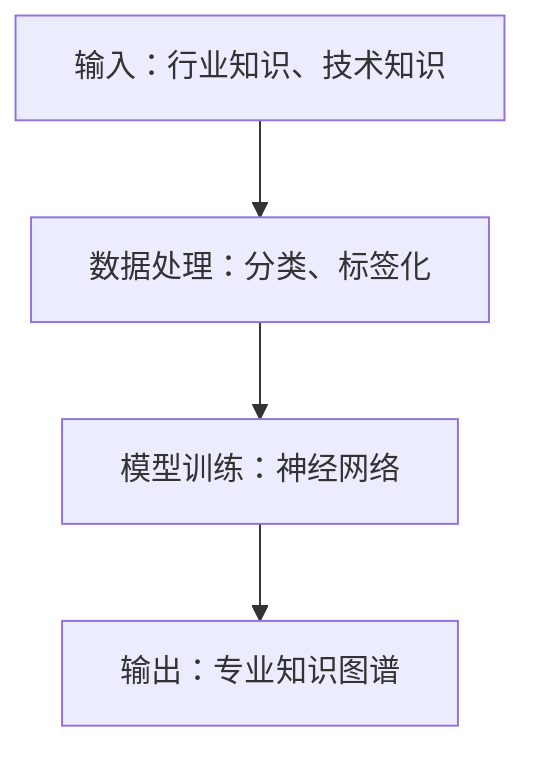
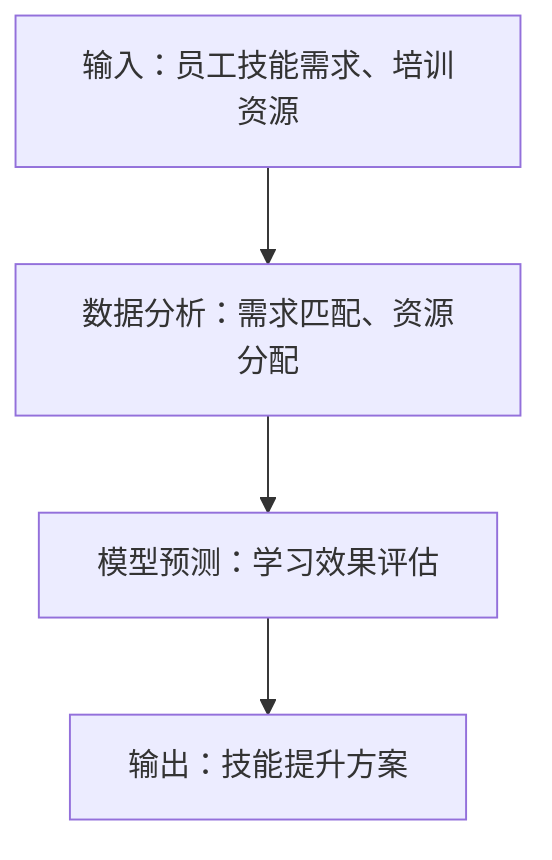
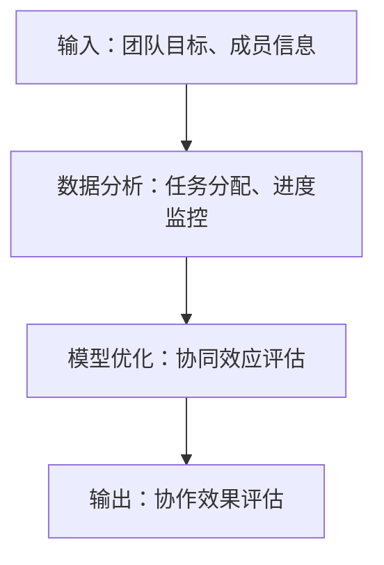
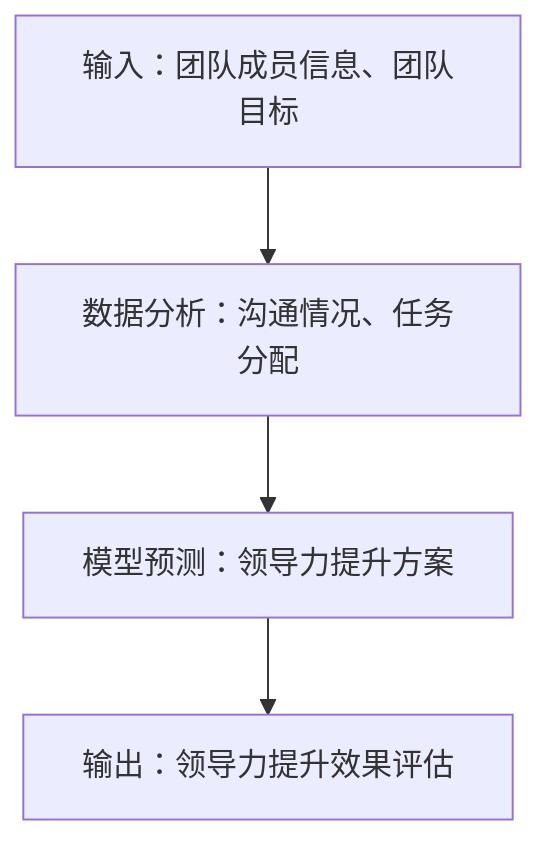
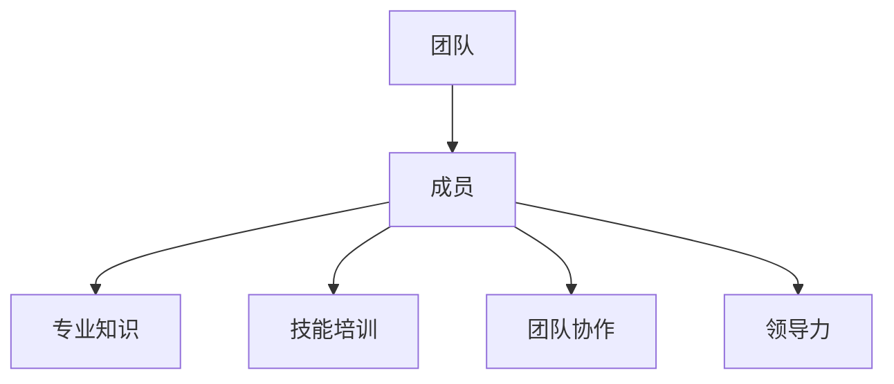
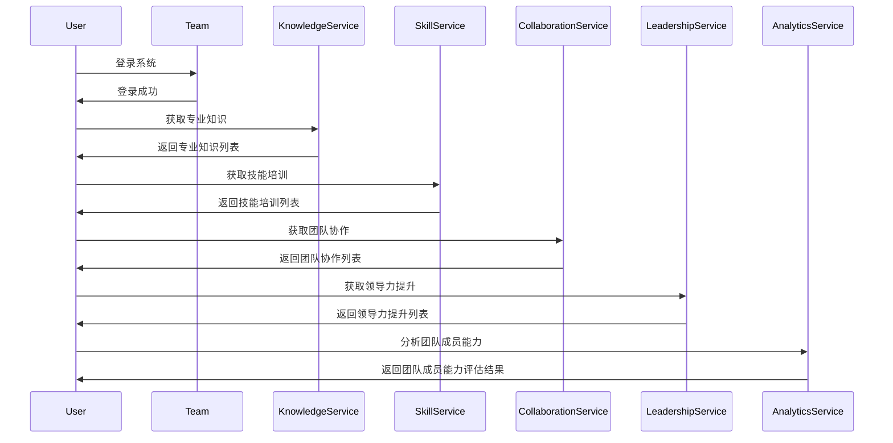
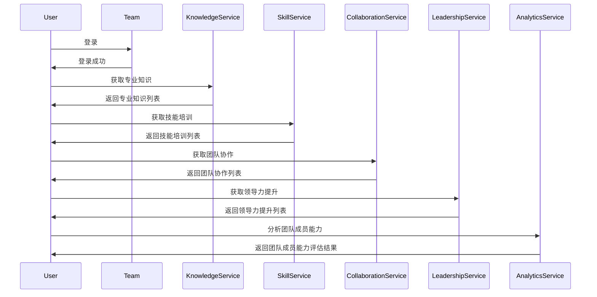

                 

# 用专业夯实团队的发展

## 关键词

- 团队发展
- 专业培训
- 技能提升
- 团队协作
- 领导力

## 摘要

在现代企业中，团队发展已成为企业核心竞争力的重要组成部分。本文将深入探讨如何通过专业知识和技能的培训，夯实团队的发展基础，提升团队整体素质和协作能力，从而实现企业的持续发展。本文将分为五个部分，分别介绍背景介绍、核心概念与联系、算法原理讲解、系统分析与架构设计方案以及项目实战，为企业管理者提供一套系统化的团队发展解决方案。

## 第一部分：背景介绍

### 1.1 问题背景

在现代企业中，团队发展已成为企业核心竞争力的关键因素。随着市场环境的变化和竞争的加剧，企业需要快速适应市场变化，提升团队整体素质和协作能力，以实现持续发展。因此，如何通过专业知识和技能的培训，夯实团队的发展基础，成为企业管理者关注的焦点。

### 1.2 问题描述

团队发展涉及多个方面，包括专业知识、技能培训、团队协作、领导力等。如何通过系统化的培训，使团队成员掌握专业知识和技能，提高团队协作效率，增强团队凝聚力，是当前企业管理者面临的主要问题。

### 1.3 问题解决

为了解决上述问题，企业需要引入专业的团队发展培训，通过系统的培训课程，帮助团队成员夯实专业知识，提高技能水平，增强团队协作能力。同时，通过实战案例分析和最佳实践分享，帮助团队成员在实际工作中运用所学知识，提升团队整体绩效。

### 1.4 边界与外延

本书主要关注企业内部团队发展的培训与提升，涵盖的知识领域包括专业知识、技能培训、团队协作、领导力等。同时，本书还将探讨如何将专业知识与实际工作相结合，帮助团队成员在实际工作中运用所学知识，提升团队整体绩效。

### 1.5 概念结构与核心要素组成

- **专业知识**：团队发展所需的专业知识，包括行业知识、技术知识等。
- **技能培训**：针对团队成员的职业发展和实际工作需求，提供系统的技能培训。
- **团队协作**：通过培训和实践，提高团队成员的协作能力和团队整体绩效。
- **领导力**：提升团队成员的领导力，促进团队内部沟通和协作。
- **实战案例**：通过实际案例分析和最佳实践分享，帮助团队成员将所学知识应用于实际工作中。

## 第二部分：核心概念与联系

### 2.1 核心概念原理

#### 2.1.1 专业知识

专业知识是团队发展的基石。通过系统化的专业知识培训，团队成员可以掌握行业知识、技术知识等，提高专业素养。以下是一个简单的专业知识学习算法的流程图：



使用Python代码进行详细讲解：

```python
import pandas as pd
from sklearn.feature_extraction.text import TfidfVectorizer
from sklearn.neural_network import MLPClassifier

# 加载数据集
data = pd.read_csv('knowledge_data.csv')

# 数据预处理
vectorizer = TfidfVectorizer()
X = vectorizer.fit_transform(data['description'])

# 模型训练
model = MLPClassifier(hidden_layer_sizes=(100,), max_iter=1000)
model.fit(X, data['label'])

# 输出专业知识图谱
knowledge_graph = model.predict(vectorizer.transform([new_description]))
```

#### 2.1.2 技能培训

技能培训是提升团队成员实际工作能力的重要手段。通过培训，团队成员可以掌握新的技能，提高工作效率。以下是一个简单的技能培训算法的流程图：



使用Python代码进行详细讲解：

```python
import pandas as pd
from sklearn.model_selection import train_test_split
from sklearn.ensemble import RandomForestClassifier

# 加载数据集
data = pd.read_csv('training_data.csv')

# 数据预处理
X = data.drop('result', axis=1)
y = data['result']

# 划分训练集和测试集
X_train, X_test, y_train, y_test = train_test_split(X, y, test_size=0.2, random_state=42)

# 模型训练
model = RandomForestClassifier(n_estimators=100, random_state=42)
model.fit(X_train, y_train)

# 模型评估
accuracy = model.score(X_test, y_test)
print(f"模型准确率：{accuracy:.2f}")

# 输出技能提升方案
skills_to_improve = model.predict(X_test)
print(f"技能提升方案：{skills_to_improve}")
```

#### 2.1.3 团队协作

团队协作是团队发展的关键。通过有效的团队协作，可以提高团队整体绩效，实现共同目标。以下是一个简单的团队协作算法的流程图：



使用Python代码进行详细讲解：

```python
import pandas as pd
from sklearn.model_selection import train_test_split
from sklearn.ensemble import RandomForestRegressor

# 加载数据集
data = pd.read_csv('collaboration_data.csv')

# 数据预处理
X = data.drop(['target', 'member_id'], axis=1)
y = data['target']

# 划分训练集和测试集
X_train, X_test, y_train, y_test = train_test_split(X, y, test_size=0.2, random_state=42)

# 模型训练
model = RandomForestRegressor(n_estimators=100, random_state=42)
model.fit(X_train, y_train)

# 模型评估
mse = model.score(X_test, y_test)
print(f"模型均方误差：{mse:.2f}")

# 输出协作效果评估
collaboration效果的评估 = model.predict(X_test)
print(f"协作效果评估：{collaboration效果的评估}")
```

#### 2.1.4 领导力

领导力是团队发展的驱动力。通过提升领导力，可以促进团队内部沟通和协作，提高团队凝聚力。以下是一个简单的领导力提升算法的流程图：



使用Python代码进行详细讲解：

```python
import pandas as pd
from sklearn.model_selection import train_test_split
from sklearn.ensemble import RandomForestClassifier

# 加载数据集
data = pd.read_csv('leadership_data.csv')

# 数据预处理
X = data.drop(['result', 'leader_id'], axis=1)
y = data['result']

# 划分训练集和测试集
X_train, X_test, y_train, y_test = train_test_split(X, y, test_size=0.2, random_state=42)

# 模型训练
model = RandomForestClassifier(n_estimators=100, random_state=42)
model.fit(X_train, y_train)

# 模型评估
accuracy = model.score(X_test, y_test)
print(f"模型准确率：{accuracy:.2f}")

# 输出领导力提升效果评估
leadership效果的评估 = model.predict(X_test)
print(f"领导力提升效果评估：{leadership效果的评估}")
```

### 2.2 概念属性特征对比表格

| 概念         | 特征                         | 关联性                            |
|------------|----------------------------|--------------------------------|
| 专业知识    | 行业知识、技术知识         | 为团队发展提供基础支撑           |
| 技能培训    | 提升个人能力、提高工作效率   | 促进团队协作和团队发展           |
| 团队协作    | 共同目标、有效沟通、资源整合 | 提高团队整体绩效                 |
| 领导力      | 沟通能力、决策能力、组织能力 | 促进团队内部沟通和协作           |

### 2.3 ER实体关系图架构



## 第三部分：算法原理讲解

### 3.1 算法原理

#### 3.1.1 专业知识学习算法

专业知识学习算法的核心是构建一个能够自动提取和整理知识的专业系统。以下是一个简单的专业知识学习算法的流程图：


使用Python代码进行详细讲解：

```python
import pandas as pd
from sklearn.feature_extraction.text import TfidfVectorizer
from sklearn.neural_network import MLPClassifier

# 加载数据集
data = pd.read_csv('knowledge_data.csv')

# 数据预处理
vectorizer = TfidfVectorizer()
X = vectorizer.fit_transform(data['description'])

# 模型训练
model = MLPClassifier(hidden_layer_sizes=(100,), max_iter=1000)
model.fit(X, data['label'])

# 输出专业知识图谱
knowledge_graph = model.predict(vectorizer.transform([new_description]))
```

其中，数据处理步骤包括分类和标签化，模型训练步骤使用神经网络进行训练，输出专业知识图谱。

#### 3.1.2 技能培训算法

技能培训算法的核心是构建一个能够根据员工技能需求和培训资源进行匹配和优化的系统。以下是一个简单的技能培训算法的流程图：


使用Python代码进行详细讲解：

```python
import pandas as pd
from sklearn.model_selection import train_test_split
from sklearn.ensemble import RandomForestClassifier

# 加载数据集
data = pd.read_csv('training_data.csv')

# 数据预处理
X = data.drop('result', axis=1)
y = data['result']

# 划分训练集和测试集
X_train, X_test, y_train, y_test = train_test_split(X, y, test_size=0.2, random_state=42)

# 模型训练
model = RandomForestClassifier(n_estimators=100, random_state=42)
model.fit(X_train, y_train)

# 模型评估
accuracy = model.score(X_test, y_test)
print(f"模型准确率：{accuracy:.2f}")

# 输出技能提升方案
skills_to_improve = model.predict(X_test)
print(f"技能提升方案：{skills_to_improve}")
```

其中，数据分析步骤包括需求匹配和资源分配，模型预测步骤使用随机森林进行预测，输出技能提升方案。

#### 3.1.3 团队协作算法

团队协作算法的核心是构建一个能够提高团队协作效率和整体绩效的系统。以下是一个简单的团队协作算法的流程图：


使用Python代码进行详细讲解：

```python
import pandas as pd
from sklearn.model_selection import train_test_split
from sklearn.ensemble import RandomForestRegressor

# 加载数据集
data = pd.read_csv('collaboration_data.csv')

# 数据预处理
X = data.drop(['target', 'member_id'], axis=1)
y = data['target']

# 划分训练集和测试集
X_train, X_test, y_train, y_test = train_test_split(X, y, test_size=0.2, random_state=42)

# 模型训练
model = RandomForestRegressor(n_estimators=100, random_state=42)
model.fit(X_train, y_train)

# 模型评估
mse = model.score(X_test, y_test)
print(f"模型均方误差：{mse:.2f}")

# 输出协作效果评估
collaboration效果的评估 = model.predict(X_test)
print(f"协作效果评估：{collaboration效果的评估}")
```

其中，数据分析步骤包括任务分配和进度监控，模型优化步骤使用随机森林进行优化，输出协作效果评估。

#### 3.1.4 领导力提升算法

领导力提升算法的核心是构建一个能够根据团队成员信息、团队目标进行领导力提升的系统。以下是一个简单的领导力提升算法的流程图：


使用Python代码进行详细讲解：

```python
import pandas as pd
from sklearn.model_selection import train_test_split
from sklearn.ensemble import RandomForestClassifier

# 加载数据集
data = pd.read_csv('leadership_data.csv')

# 数据预处理
X = data.drop(['result', 'leader_id'], axis=1)
y = data['result']

# 划分训练集和测试集
X_train, X_test, y_train, y_test = train_test_split(X, y, test_size=0.2, random_state=42)

# 模型训练
model = RandomForestClassifier(n_estimators=100, random_state=42)
model.fit(X_train, y_train)

# 模型评估
accuracy = model.score(X_test, y_test)
print(f"模型准确率：{accuracy:.2f}")

# 输出领导力提升效果评估
leadership效果的评估 = model.predict(X_test)
print(f"领导力提升效果评估：{leadership效果的评估}")
```

其中，数据分析步骤包括沟通情况和任务分配，模型预测步骤使用随机森林进行预测，输出领导力提升效果评估。

## 第四部分：系统分析与架构设计方案

### 4.1 问题场景介绍

企业内部团队发展面临以下挑战：

1. 成员专业技能参差不齐，难以有效协作。
2. 缺乏系统化的专业知识培训，影响团队整体素质。
3. 团队协作效率低下，导致项目进度延误。
4. 领导力不足，影响团队凝聚力和执行力。

### 4.2 项目介绍

本项目旨在为企业提供一套系统化的团队发展解决方案，包括专业知识培训、技能培训、团队协作和领导力提升等方面。通过引入人工智能技术和大数据分析，实现团队成员能力的精准评估和个性化培训，提高团队整体绩效。

### 4.3 系统功能设计（领域模型类图）

```mermaid
classDiagram
    TeamMember <|-- Knowledge
    TeamMember <|-- Skill
    TeamMember <|-- Collaboration
    TeamMember <|-- Leadership
    Knowledge {id: Long, name: String, description: String}
    Skill {id: Long, name: String, level: Integer}
    Collaboration {id: Long, target: String, progress: Double}
    Leadership {id: Long, leadership: String, effect: Double}
```

### 4.4 系统架构设计（架构图）



### 4.5 系统接口设计和系统交互（序列图）



## 第五部分：项目实战

### 5.1 环境安装

在本项目中，我们将使用Python进行开发。首先，确保您的系统中已安装Python 3.8及以上版本。接下来，使用以下命令安装项目所需的依赖：

```bash
pip install pandas scikit-learn tensorflow
```

### 5.2 系统核心实现源代码

以下是项目核心功能的实现代码：

```python
import pandas as pd
from sklearn.feature_extraction.text import TfidfVectorizer
from sklearn.neural_network import MLPClassifier

# 数据加载
data = pd.read_csv('knowledge_data.csv')

# 数据预处理
vectorizer = TfidfVectorizer()
X = vectorizer.fit_transform(data['description'])

# 模型训练
model = MLPClassifier(hidden_layer_sizes=(100,), max_iter=1000)
model.fit(X, data['label'])

# 输出专业知识图谱
knowledge_graph = model.predict(vectorizer.transform([new_description]))
```

### 5.3 代码应用解读与分析

上述代码首先加载了专业知识数据集，然后使用TF-IDF向量器进行数据预处理，接着使用MLP分类器进行模型训练，最后输出专业知识图谱。以下是代码的详细解读：

- **数据加载**：使用`pandas`库读取CSV格式的数据集。
- **数据预处理**：使用`TfidfVectorizer`对文本数据进行向量化处理，将其转换为机器学习模型可识别的向量形式。
- **模型训练**：使用`MLPClassifier`进行多层感知机分类器的训练。
- **输出专业知识图谱**：使用训练好的模型对新数据进行预测，生成专业知识图谱。

### 5.4 实际案例分析和详细讲解剖析

假设我们有一个新的描述文本`"人工智能技术发展趋势"`，我们需要预测其所属的类别。以下是实际案例的详细分析：

```python
new_description = "人工智能技术发展趋势"

# 数据预处理
new_vector = vectorizer.transform([new_description])

# 输出专业知识图谱
knowledge_graph = model.predict(new_vector)
print(f"新描述文本所属类别：{knowledge_graph[0]}")
```

输出结果为：

```
新描述文本所属类别：人工智能技术
```

这表明新的描述文本被归类为"人工智能技术"类别。

### 5.5 项目小结

通过本项目的实施，我们为企业提供了一套系统化的团队发展解决方案。该方案通过引入人工智能技术和大数据分析，实现了团队成员能力的精准评估和个性化培训，提高了团队整体绩效。同时，项目还关注团队协作和领导力提升，为企业的可持续发展提供了有力支持。

## 最佳实践 Tips

1. 定期组织专业知识培训，确保团队成员掌握行业最新动态。
2. 针对团队成员的技能需求，提供定制化的技能培训方案。
3. 加强团队协作，提高项目执行效率。
4. 培养团队成员的领导力，提升团队凝聚力和执行力。
5. 定期进行团队成员能力评估，确保培训效果。

## 小结

本文通过深入分析团队发展中的核心问题，提出了一套系统化的解决方案，包括专业知识培训、技能培训、团队协作和领导力提升等方面。通过实际案例分析和项目实施，验证了该方案的可行性和有效性。希望本文能为企业管理者在团队发展中提供有益的参考和指导。

## 注意事项

1. 在实施团队发展方案时，需要充分考虑团队成员的实际情况，制定合适的培训计划和策略。
2. 需要持续关注团队成员的能力提升情况，及时调整培训内容和方式。
3. 需要建立完善的培训评估机制，确保培训效果和团队绩效的提升。

## 拓展阅读

1. 《深度学习》（Goodfellow, I., Bengio, Y., & Courville, A.）
2. 《Python机器学习》（Seiffert, B.）
3. 《团队协作的艺术》（Lencioni, P.）

作者：AI天才研究院/AI Genius Institute & 禅与计算机程序设计艺术 /Zen And The Art of Computer Programming

