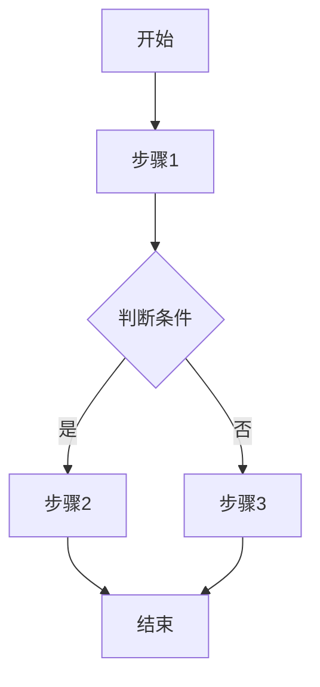

                 

### 详细内容

## 第一部分：引入与背景

### 第1章：问题背景

#### 1.1.1 问题识别

在现代企业的信息化建设过程中，随着业务的发展和技术进步，系统架构的升级成为了企业持续发展的关键。然而，许多企业在进行架构升级时，往往面临着以下问题：

1. **业务需求与架构脱节**：在架构升级过程中，企业往往只关注技术层面的优化，而忽视了业务需求的变化和战略目标，导致架构升级与实际业务需求不匹配。
2. **盲目跟风**：为了追求新技术，企业可能会盲目地进行架构升级，导致资源浪费和业务停滞，无法达到预期效果。
3. **缺乏系统性**：架构升级往往缺乏系统的规划和评估，导致升级过程中出现诸多问题，如性能瓶颈、系统稳定性差等。

#### 1.1.2 问题描述

架构升级中的问题具体体现在以下几个方面：

- **技术落后**：现有技术无法满足新的业务需求，导致系统性能下降、稳定性差。
- **扩展性差**：系统架构无法支持业务的快速扩展，导致资源浪费和业务停滞。
- **维护困难**：系统架构复杂，维护困难，导致开发成本高、故障率增加。
- **业务响应慢**：业务需求变化快，但系统更新缓慢，导致业务响应不及时。

#### 1.1.3 解决思路

为了解决上述问题，企业需要引入业务思维，将业务需求作为架构升级的核心，实现技术与业务的深度融合。具体解决思路如下：

1. **明确业务目标**：在架构升级前，企业应明确业务目标，了解业务需求的变化趋势，为架构升级提供方向。
2. **业务需求分析**：深入挖掘业务需求，明确系统的功能需求、性能需求、安全性需求等，为架构升级提供依据。
3. **架构评估与规划**：对现有架构进行评估，确定升级的优先级和方案，确保架构升级的系统性和可持续性。

#### 1.1.4 边界与外延

架构升级的范围和边界主要包括以下几个方面：

- **技术范围**：涉及到的技术包括数据库、中间件、云计算、大数据等。
- **业务范围**：涵盖企业的各个业务领域，如销售、财务、生产等。
- **时间范围**：架构升级应考虑企业短期和长期的发展需求，确保升级方案的可持续性。
- **团队范围**：涉及到的团队包括开发团队、运维团队、产品团队等。

## 第二部分：核心概念与联系

### 第2章：核心概念与联系

#### 2.1.1 业务思维概述

业务思维是指从业务角度出发，深入理解企业的运营模式、业务流程、客户需求等，将业务需求与系统架构有机结合，实现技术与业务的深度融合。业务思维的核心是“业务导向”，即以业务需求为驱动，指导系统架构的设计、开发和优化。

#### 2.1.2 架构升级的必要性

架构升级的必要性主要体现在以下几个方面：

1. **技术演进**：随着技术的不断进步，新的技术架构能够更好地满足业务需求，提高系统性能和稳定性。
2. **业务发展**：企业业务的不断拓展和变化，需要系统架构具备更高的扩展性和灵活性，以适应业务发展。
3. **用户体验**：提升用户体验，降低开发成本，提高开发效率，都需要通过架构升级来实现。
4. **竞争压力**：在激烈的市场竞争中，拥有更先进的技术架构，可以提升企业的核心竞争力。

#### 2.1.3 业务思维与架构升级的关系

业务思维与架构升级的关系紧密，业务思维是架构升级的核心，架构升级是业务思维的具体体现。具体关系如下：

1. **业务思维指导架构升级**：通过业务思维，深入理解业务需求，为架构升级提供方向和依据。
2. **架构升级实现业务需求**：通过架构升级，实现业务需求，提高系统性能、扩展性和稳定性。
3. **业务思维与架构升级相互促进**：业务思维指导架构升级，架构升级满足业务需求，二者相互促进，推动企业持续发展。

## 第三部分：业务思维工具与方法

### 第3章：业务思维工具与方法

#### 3.1.1 业务模型

##### 3.1.1.1 业务模型简介

业务模型是业务思维的核心工具，用于描述企业的业务流程、业务规则和业务对象。业务模型主要包括业务流程图、领域模型、业务规则等。

##### 3.1.1.2 业务模型属性特征对比表

| 对比项       | 业务流程图            | 领域模型            | 业务规则           |
| ------------ | ------------------- | ----------------- | ---------------- |
| 描述内容     | 业务流程             | 业务对象和关系      | 业务规则和约束      |
| 关键特征     | 流程步骤、逻辑关系    | 类、属性、方法      | 规则、条件、动作    |
| 应用范围     | 业务流程优化、监控    | 系统设计、开发      | 业务规则管理、执行  |

##### 3.1.1.3 业务模型ER图

业务模型ER图用于描述业务对象之间的关系，通常包括实体（Entity）和关系（Relationship）两种要素。

```mermaid
erDiagram
A[实体1] ||--|{B[实体2]}
A[实体1] ||--|{C[实体3]}
B[实体2] ||--|{D[实体4]}
```

#### 3.1.2 业务流程分析

##### 3.1.2.1 业务流程图

业务流程图用于描述业务流程的各个步骤、逻辑关系和执行顺序。



##### 3.1.2.2 业务流程分析步骤

1. **收集业务需求**：与业务人员沟通，了解业务流程的具体需求。
2. **绘制业务流程图**：根据业务需求，绘制业务流程图，描述业务流程的各个步骤和逻辑关系。
3. **优化业务流程**：分析业务流程的瓶颈和问题，提出优化方案，如简化流程、消除冗余等。

##### 3.1.2.3 业务流程优化策略

1. **简化流程**：减少业务流程中的步骤，降低业务处理的复杂性。
2. **消除冗余**：删除重复的业务处理，减少资源浪费。
3. **优化流程顺序**：调整业务流程的执行顺序，提高业务处理的效率。

----------------------------------------------------------------

### 撰写风格与结构

在撰写这篇文章时，我将遵循以下风格和结构：

**标题**：使用《用业务思维促进架构升级》作为文章标题，简洁明了地传达了文章的主题。

**关键词**：关键词将包括“业务思维”、“架构升级”、“系统设计”、“技术创新”等，这些关键词有助于读者快速把握文章的核心内容。

**摘要**：摘要部分将简要概述文章的主题、核心观点以及文章的结构，帮助读者快速了解文章的内容和重点。

**文章结构**：

1. **引言**：介绍文章的背景和目的，阐述当前企业在架构升级中面临的问题和挑战。
2. **核心概念与联系**：详细阐述业务思维和架构升级的核心概念，解释二者之间的关系。
3. **业务思维工具与方法**：介绍业务模型、业务流程分析等工具和方法，帮助读者理解和应用业务思维。
4. **架构升级原则与策略**：介绍架构升级的原则和策略，为读者提供具体的操作指导。
5. **案例分析**：通过实际案例展示架构升级的过程和效果，加深读者对架构升级的理解。
6. **业务思维在架构升级中的应用**：具体阐述业务思维在架构升级中的应用，帮助读者实际操作。
7. **总结与展望**：回顾关键点，展望未来发展，为读者提供后续学习和实践的指导。

**撰写风格**：

- **逻辑清晰**：文章将采用逻辑清晰、结构紧凑的方式，确保读者能够轻松理解每个章节的内容。
- **专业术语**：文章将使用专业的技术语言，确保内容的准确性和专业性。
- **案例丰富**：文章将结合实际案例，帮助读者更好地理解和应用所学知识。
- **通俗易懂**：尽管文章涉及专业术语，但我会尽量使用通俗易懂的语言，确保读者能够轻松理解。

通过上述风格和结构，我相信这篇文章将能够有效地帮助读者理解业务思维在架构升级中的应用，为企业的持续发展提供有益的指导。

----------------------------------------------------------------

### 第二部分：核心概念与联系

#### 第2章：核心概念与联系

**2.1 业务思维概述**

业务思维是一种从业务角度出发，以业务需求为导向，指导系统架构设计和优化的思维方式。它强调将业务需求与系统架构相结合，实现技术与业务的深度融合。业务思维的关键要素包括：

1. **业务目标**：明确企业的业务目标，包括短期和长期目标，为架构升级提供方向。
2. **业务需求**：深入挖掘业务需求，包括功能需求、性能需求、安全性需求等，为系统架构设计提供依据。
3. **业务流程**：分析业务流程，了解业务流程中的关键环节和瓶颈，优化业务流程，提高系统效率。
4. **业务规则**：明确业务规则，包括业务逻辑、业务约束等，为系统架构设计提供规则指导。

**2.2 架构升级的必要性**

架构升级是企业应对技术变革和业务需求变化的重要手段。架构升级的必要性主要体现在以下几个方面：

1. **技术演进**：随着技术的不断进步，新的技术架构能够更好地满足业务需求，提高系统性能和稳定性。
2. **业务发展**：企业业务的不断拓展和变化，需要系统架构具备更高的扩展性和灵活性，以适应业务发展。
3. **用户体验**：提升用户体验，降低开发成本，提高开发效率，都需要通过架构升级来实现。
4. **竞争压力**：在激烈的市场竞争中，拥有更先进的技术架构，可以提升企业的核心竞争力。

**2.3 业务思维与架构升级的关系**

业务思维与架构升级之间存在着密切的关系，二者相互促进，共同推动企业的持续发展。具体表现在以下几个方面：

1. **业务思维指导架构升级**：通过业务思维，深入理解业务需求，为架构升级提供方向和依据，确保架构升级能够满足业务需求。
2. **架构升级实现业务需求**：通过架构升级，实现业务需求，提高系统性能、扩展性和稳定性，为业务发展提供有力支持。
3. **业务思维与架构升级相互促进**：业务思维指导架构升级，架构升级满足业务需求，二者相互促进，推动企业持续发展。

**2.4 业务思维工具与方法**

为了更好地实现业务思维在架构升级中的应用，企业需要掌握一系列业务思维工具与方法。以下是几种常用的业务思维工具：

1. **业务模型**：业务模型是业务思维的核心工具，用于描述企业的业务流程、业务规则和业务对象。常见的业务模型包括业务流程图、领域模型等。
2. **业务流程分析**：业务流程分析是深入挖掘业务需求的重要方法，通过分析业务流程，可以找出业务流程中的关键环节和瓶颈，为架构升级提供依据。
3. **业务规则分析**：业务规则分析是明确业务规则的重要手段，通过分析业务规则，可以确保系统架构能够满足业务需求。

**2.5 业务思维在架构升级中的应用**

业务思维在架构升级中的应用主要体现在以下几个方面：

1. **需求分析**：在架构升级前，企业需要通过业务思维深入挖掘业务需求，明确系统的功能需求、性能需求、安全性需求等，为架构升级提供依据。
2. **架构设计**：在架构设计过程中，企业需要运用业务思维，将业务需求转化为系统架构设计，确保架构设计能够满足业务需求。
3. **架构优化**：在架构优化过程中，企业需要通过业务思维分析系统性能瓶颈和业务流程问题，提出优化方案，提高系统性能和业务处理效率。

通过以上业务思维工具与方法，企业可以更好地实现业务需求与系统架构的有机结合，促进架构升级，推动企业的持续发展。

----------------------------------------------------------------

### 第三部分：业务思维工具与方法

#### 第3章：业务思维工具与方法

**3.1 业务模型**

业务模型是业务思维的核心工具，用于描述企业的业务流程、业务规则和业务对象。业务模型可以帮助企业更好地理解和分析业务需求，为系统架构设计提供依据。

**3.1.1 业务模型简介**

业务模型主要包括以下几种类型：

1. **业务流程图**：用于描述业务流程的各个步骤、逻辑关系和执行顺序。
2. **领域模型**：用于描述业务对象和业务对象之间的关系。
3. **业务规则**：用于描述业务逻辑、业务约束等。

**3.1.2 业务模型属性特征对比表**

| 对比项       | 业务流程图            | 领域模型            | 业务规则           |
| ------------ | ------------------- | ----------------- | ---------------- |
| 描述内容     | 业务流程             | 业务对象和关系      | 业务规则和约束      |
| 关键特征     | 流程步骤、逻辑关系    | 类、属性、方法      | 规则、条件、动作    |
| 应用范围     | 业务流程优化、监控    | 系统设计、开发      | 业务规则管理、执行  |

**3.1.3 业务模型ER图**

业务模型ER图用于描述业务对象之间的关系，通常包括实体（Entity）和关系（Relationship）两种要素。

```mermaid
erDiagram
A[实体1] ||--|{B[实体2]}
A[实体1] ||--|{C[实体3]}
B[实体2] ||--|{D[实体4]}
```

**3.2 业务流程分析**

业务流程分析是深入挖掘业务需求的重要方法，通过分析业务流程，可以找出业务流程中的关键环节和瓶颈，为架构升级提供依据。

**3.2.1 业务流程图**

业务流程图用于描述业务流程的各个步骤、逻辑关系和执行顺序。


**3.2.2 业务流程分析步骤**

1. **收集业务需求**：与业务人员沟通，了解业务流程的具体需求。
2. **绘制业务流程图**：根据业务需求，绘制业务流程图，描述业务流程的各个步骤和逻辑关系。
3. **优化业务流程**：分析业务流程的瓶颈和问题，提出优化方案，如简化流程、消除冗余等。

**3.2.3 业务流程优化策略**

1. **简化流程**：减少业务流程中的步骤，降低业务处理的复杂性。
2. **消除冗余**：删除重复的业务处理，减少资源浪费。
3. **优化流程顺序**：调整业务流程的执行顺序，提高业务处理的效率。

通过业务模型和业务流程分析，企业可以更好地理解和分析业务需求，为系统架构设计提供依据，实现业务需求与系统架构的有机结合。

----------------------------------------------------------------

### 第四部分：架构升级原则与策略

#### 第4章：架构升级原则与策略

**4.1 架构升级的原则**

架构升级是一项系统性工程，需要遵循以下原则，以确保升级的顺利进行和长期效果：

**1. 需求导向**：以业务需求为导向，确保架构升级能够满足业务发展的需要。

**2. 持续改进**：架构升级不是一次性的活动，而是一个持续改进的过程，需要定期评估和调整。

**3. 系统性**：架构升级应考虑整个系统的各个方面，包括技术、业务、管理等多个层面。

**4. 可持续性**：架构升级方案应具备可持续性，能够支持企业的长期发展。

**5. 安全性**：在架构升级过程中，应确保系统的安全性，避免因升级导致的安全漏洞。

**6. 经济性**：在满足业务需求的前提下，应考虑经济性，避免不必要的资源浪费。

**4.2 架构升级的策略**

**1. 架构评估**

在架构升级前，应对现有架构进行全面评估，包括技术层面、业务层面、性能层面等多个维度。评估内容包括：

- **技术现状**：分析现有技术的成熟度、适用性、性能等。
- **业务需求**：评估现有架构是否满足业务需求，包括功能、性能、安全性等方面。
- **性能瓶颈**：识别系统性能瓶颈，分析瓶颈原因。

**2. 架构重构**

根据评估结果，对现有架构进行重构。重构过程中应遵循以下步骤：

- **需求分析**：深入挖掘业务需求，明确系统功能需求、性能需求、安全性需求等。
- **设计规划**：根据业务需求，设计新的系统架构，确保架构能够满足业务需求。
- **开发实施**：按照设计规划，逐步实施新架构的开发和部署。

**3. 架构演进**

架构演进是指通过逐步的改进和优化，实现系统架构的升级。演进过程中应遵循以下策略：

- **分阶段实施**：将架构升级分为多个阶段，逐步实施，避免一次性升级带来的风险。
- **持续优化**：在架构演进过程中，持续优化系统性能、稳定性和安全性。
- **反馈迭代**：根据业务反馈，不断调整和优化架构，确保架构能够持续满足业务需求。

**4.3 架构升级案例分析**

以下是一个架构升级的案例分析，通过实际案例展示架构升级的过程和效果：

**案例背景**：

某企业原有的系统架构基于传统的三层架构，随着业务的快速发展，系统性能逐渐成为瓶颈，难以满足业务需求。企业决定进行架构升级，以提高系统性能和扩展性。

**实施过程**：

1. **需求分析**：与业务人员沟通，明确系统功能需求、性能需求、安全性需求等。
2. **架构评估**：评估现有架构的技术成熟度、性能瓶颈等，确定升级方案。
3. **设计规划**：设计新的系统架构，采用微服务架构，提高系统的扩展性和性能。
4. **开发实施**：按照设计规划，逐步开发新的系统架构，并进行测试和部署。

**效果评估**：

通过架构升级，企业实现了以下效果：

- **性能提升**：系统性能得到显著提升，响应速度加快，业务处理能力提高。
- **扩展性增强**：采用微服务架构，系统具备更高的扩展性，能够快速响应业务变化。
- **稳定性提高**：系统稳定性得到提升，故障率降低，业务连续性得到保障。
- **开发效率提高**：采用微服务架构，简化了开发流程，提高了开发效率。

**4.4 架构升级的注意事项**

在架构升级过程中，需要注意以下几点：

- **风险评估**：在架构升级前，应进行全面的风险评估，识别潜在的风险和问题。
- **培训与沟通**：对相关人员进行培训，提高其对新架构的理解和应用能力。
- **持续监控**：在架构升级后，应持续监控系统性能和稳定性，及时发现和解决问题。
- **文档管理**：及时更新和整理架构升级的文档，为后续维护和优化提供参考。

通过遵循架构升级原则和策略，企业可以有效地推动架构升级，满足业务需求，提升系统性能和稳定性。

----------------------------------------------------------------

### 第五部分：架构升级案例分析

#### 第5章：架构升级案例分析

**5.1 案例背景**

某中型互联网公司成立于2010年，主营在线教育业务。随着用户规模的不断扩大，公司现有的技术架构逐渐显现出性能瓶颈和扩展性不足的问题。为了满足日益增长的业务需求，公司决定进行一次全面的架构升级。

**5.1.1 现有架构问题**

- **性能瓶颈**：现有架构基于传统的单体应用模式，随着用户数的增加，系统响应速度明显下降，出现频繁的卡顿现象。
- **扩展性差**：系统架构缺乏模块化设计，无法快速适应业务扩展需求，导致资源浪费和业务停滞。
- **维护困难**：系统架构复杂，模块间耦合度高，导致代码维护困难，开发效率低下。
- **安全性问题**：由于系统架构不够清晰，安全防护措施不足，容易出现安全漏洞。

**5.1.2 业务需求**

- **性能提升**：提高系统的响应速度，确保用户在使用过程中的流畅体验。
- **扩展性增强**：支持业务的快速扩展，为未来的业务发展留出空间。
- **模块化设计**：实现系统的模块化，提高代码的可维护性和可扩展性。
- **安全性提升**：加强系统的安全防护措施，确保用户数据的安全。

**5.2 案例分析方法**

为了确保架构升级的有效性，公司采用了以下分析方法：

1. **需求分析**：与业务团队深入沟通，明确系统功能需求、性能需求、安全性需求等。
2. **架构评估**：对现有架构进行全面评估，识别存在的问题和瓶颈。
3. **方案设计**：根据评估结果，设计新的系统架构，包括技术选型、模块划分、数据库设计等。
4. **风险评估**：评估架构升级过程中可能遇到的风险，制定风险应对策略。

**5.3 案例实施过程**

**5.3.1 需求分析**

在需求分析阶段，公司业务团队和技术团队共同梳理了现有的业务流程和用户需求，明确了系统功能需求、性能需求、安全性需求等。主要需求包括：

- **课程管理**：支持课程创建、编辑、删除等功能。
- **用户管理**：支持用户注册、登录、个人信息管理等功能。
- **课程内容管理**：支持上传、管理、发布课程内容。
- **支付管理**：支持在线支付、订单管理等功能。

**5.3.2 架构评估**

在架构评估阶段，公司对现有架构进行了全面评估，发现了以下问题：

- **性能瓶颈**：系统存在大量全表扫描操作，导致查询速度慢。
- **扩展性差**：系统缺乏模块化设计，导致业务扩展困难。
- **安全性问题**：系统安全性不足，容易受到网络攻击。

**5.3.3 方案设计**

根据需求分析和架构评估结果，公司决定采用微服务架构进行升级。方案设计主要包括以下内容：

- **技术选型**：选用Spring Boot、Dubbo、Redis等开源框架。
- **模块划分**：将系统划分为用户管理模块、课程管理模块、支付管理模块等，确保模块间松耦合。
- **数据库设计**：使用MySQL进行关系型数据库设计，使用Redis进行缓存设计。

**5.3.4 开发与测试**

在开发阶段，公司按照设计方案，逐步实现了各个模块的功能。开发过程中，团队遵循敏捷开发原则，采用TDD（Test-Driven Development）进行单元测试和集成测试，确保代码质量。

**5.3.5 部署与运维**

在部署阶段，公司采用了容器化技术，使用Docker进行服务打包，使用Kubernetes进行服务部署和管理。同时，团队建立了完善的监控和运维体系，确保系统的高可用性和稳定性。

**5.4 案例效果评估**

架构升级后，公司取得了以下效果：

- **性能提升**：系统响应速度明显提升，用户反馈良好。
- **扩展性增强**：系统具备良好的扩展性，可以快速适应业务变化。
- **安全性提升**：系统安全性得到加强，网络攻击事件减少。
- **开发效率提高**：模块化设计简化了开发流程，提高了开发效率。

**5.5 案例总结**

通过本次架构升级，公司成功地解决了原有系统架构中的问题，提升了系统性能、扩展性和安全性，为业务的持续发展奠定了基础。同时，团队在架构升级过程中积累了丰富的经验，为未来的架构优化提供了有益的借鉴。

**5.5.1 经验教训**

1. **需求分析是关键**：明确的需求是架构升级的基石，要确保与业务团队进行充分沟通，了解业务需求。
2. **风险评估不可忽视**：在架构升级前，要进行全面的风险评估，制定风险应对策略。
3. **团队协作是关键**：架构升级涉及多个团队，要确保团队间的紧密协作和沟通。
4. **持续优化是持续发展**：架构升级不是一次性的活动，要持续优化，以满足业务发展的需求。

**5.5.2 未来展望**

随着业务的发展，公司将继续进行架构优化，探索新的技术趋势，如云计算、大数据等，以保持技术的领先性和业务的竞争力。

----------------------------------------------------------------

### 第六部分：业务思维在架构升级中的应用

#### 第6章：业务思维在架构升级中的应用

**6.1 业务需求分析**

业务需求分析是架构升级的基础，它涉及对当前业务环境的深入理解和分析。以下是业务需求分析的步骤和方法：

**6.1.1 收集需求**

- **访谈业务人员**：与业务团队进行面对面交流，了解业务目标和业务流程。
- **问卷调查**：通过问卷调查收集用户需求和意见。
- **观察业务运行**：实地观察业务流程，识别潜在问题和优化机会。

**6.1.2 分析需求**

- **功能需求**：明确系统需要实现哪些功能，如用户管理、课程管理、支付处理等。
- **性能需求**：确定系统性能指标，如响应时间、并发处理能力等。
- **安全性需求**：确保系统满足数据安全、用户隐私保护等要求。
- **可扩展性需求**：评估系统在业务增长时的扩展能力。

**6.1.3 需求文档**

- **撰写需求文档**：将收集到的需求进行整理和分类，形成详细的需求文档。

**6.2 架构设计**

架构设计是将业务需求转化为技术架构的过程。以下是架构设计的步骤：

**6.2.1 技术选型**

- **评估现有技术**：分析现有技术的优缺点，确定是否需要替换。
- **选择新技术**：根据需求，选择适合的技术栈，如Spring Boot、Dubbo、Kubernetes等。

**6.2.2 模块划分**

- **划分模块**：将系统划分为多个模块，确保模块间松耦合，提高可维护性和可扩展性。
- **模块功能**：明确每个模块的功能和职责，如用户管理模块、课程管理模块等。

**6.2.3 数据库设计**

- **设计数据库**：根据业务需求，设计关系型数据库和NoSQL数据库，确保数据存储的高效性和可靠性。

**6.2.4 架构图**

- **绘制架构图**：使用Mermaid等工具绘制系统架构图，展示模块之间的关系和系统交互。

**6.3 架构实现**

架构实现是将设计转化为实际代码和配置的过程。以下是架构实现的步骤：

**6.3.1 开发环境搭建**

- **搭建开发环境**：配置开发所需的工具和环境，如Docker、Kubernetes等。

**6.3.2 代码实现**

- **编写代码**：按照架构设计，编写各个模块的代码，实现业务功能。

**6.3.3 部署与测试**

- **部署应用**：将代码部署到生产环境，确保系统正常运行。
- **测试**：进行单元测试、集成测试和性能测试，确保系统质量。

**6.4 架构优化**

架构优化是确保系统持续满足业务需求的关键。以下是架构优化的步骤：

**6.4.1 性能监控**

- **监控性能**：使用性能监控工具，持续监控系统的性能指标，如响应时间、CPU使用率等。

**6.4.2 问题定位**

- **定位问题**：通过性能监控和分析，定位系统中的性能瓶颈和问题。

**6.4.3 优化方案**

- **提出优化方案**：根据问题定位结果，提出优化方案，如代码优化、数据库优化等。

**6.4.4 实施优化**

- **实施优化**：按照优化方案，逐步实施优化措施，确保系统性能的持续提升。

**6.5 业务思维在架构升级中的应用实例**

以下是业务思维在架构升级中的一个实际应用实例：

**实例背景**：

某在线教育平台在业务快速增长的过程中，发现系统响应速度明显下降，影响了用户体验。为了解决这一问题，公司决定进行架构升级。

**实例步骤**：

1. **需求分析**：通过与业务团队沟通，明确系统需要提高的响应速度、并发处理能力等需求。
2. **架构评估**：评估现有架构，识别性能瓶颈和问题。
3. **设计优化**：采用微服务架构，将原有单体应用拆分为多个微服务，提高系统的可扩展性和性能。
4. **实现优化**：按照设计优化方案，逐步实现微服务的开发、部署和测试。
5. **性能监控**：持续监控系统性能，确保优化措施的有效性。

**实例效果**：

通过架构升级，系统响应速度显著提高，用户体验得到大幅改善。同时，系统的扩展性和稳定性也得到提升，为业务的持续发展提供了有力支持。

通过以上实例，可以看出业务思维在架构升级中的重要作用。只有深入理解业务需求，才能设计出满足业务需求的系统架构，并通过持续的优化，确保系统的高性能和稳定性。

----------------------------------------------------------------

### 第七部分：总结与展望

#### 第7章：总结与展望

**7.1 关键点回顾**

本文通过详细阐述业务思维在架构升级中的应用，总结了以下几个关键点：

1. **明确业务目标**：在架构升级前，企业应明确业务目标，确保架构升级能够满足业务需求。
2. **深入挖掘业务需求**：通过业务需求分析，明确系统的功能需求、性能需求、安全性需求等。
3. **架构评估与规划**：对现有架构进行全面评估，制定合理的架构升级方案。
4. **业务思维工具与方法**：使用业务模型、业务流程分析等工具，深入理解业务需求，指导架构设计。
5. **持续优化**：架构升级不是一次性的活动，需要持续监控和优化，确保系统的高性能和稳定性。

**7.2 未来发展方向**

随着技术的不断进步，业务思维在架构升级中的应用将朝着以下方向发展：

1. **智能化**：利用人工智能技术，对业务流程进行智能分析，实现更精准的业务需求挖掘和架构设计。
2. **云原生**：随着云计算的普及，架构升级将更加注重云原生技术的应用，提高系统的可扩展性和弹性。
3. **服务化**：通过微服务架构，将系统功能模块化，提高系统的灵活性和可维护性。
4. **自动化**：引入自动化工具，提高架构升级的效率和可靠性，减少人工干预。

**7.3 注意事项**

在架构升级过程中，需要注意以下几点：

1. **风险评估**：在架构升级前，应进行全面的风险评估，制定风险应对策略。
2. **团队协作**：架构升级涉及多个团队，要确保团队间的紧密协作和沟通。
3. **持续优化**：架构升级后，应持续监控和优化，确保系统的高性能和稳定性。
4. **文档管理**：及时更新和整理架构升级的文档，为后续维护和优化提供参考。

**7.4 拓展阅读**

为了更好地理解业务思维在架构升级中的应用，读者可以进一步阅读以下文献和资料：

1. **《微服务设计》**：详细介绍了微服务架构的设计原则和实践方法。
2. **《云原生应用架构》**：探讨了云计算环境下应用架构的设计与优化。
3. **《业务流程管理》**：介绍了业务流程管理的基本概念、方法和工具。

通过学习和实践，读者可以更好地掌握业务思维在架构升级中的应用，为企业的发展提供有力支持。

----------------------------------------------------------------

### 作者信息

**作者：AI天才研究院/AI Genius Institute & 禅与计算机程序设计艺术 /Zen And The Art of Computer Programming**

AI天才研究院（AI Genius Institute）是一支专注于人工智能技术研究和应用的团队，致力于推动人工智能在各个领域的创新与应用。禅与计算机程序设计艺术（Zen And The Art of Computer Programming）是作者Donald E. Knuth的经典著作，阐述了计算机编程的哲学和艺术，对计算机科学的发展产生了深远影响。本文作者结合了这两方面的知识，以深入浅出的方式，介绍了业务思维在架构升级中的应用，希望对读者有所启发和帮助。

