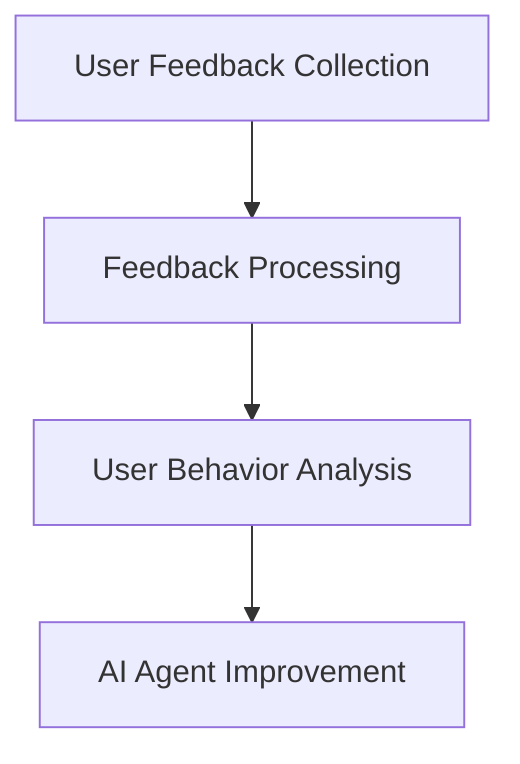
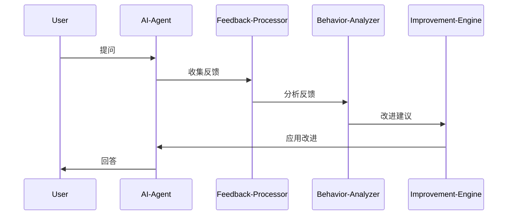
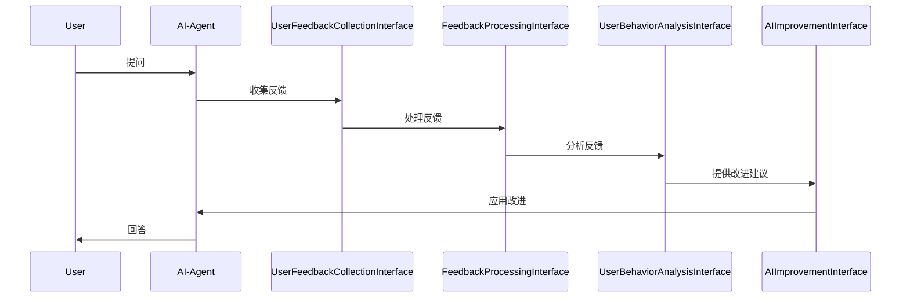

                 

# 用户反馈处理：不断改进AI Agent的表现

## 关键词
- 用户反馈
- AI Agent
- 持续改进
- 机器学习
- 交互界面设计

## 摘要
本文旨在探讨用户反馈在人工智能代理（AI Agent）性能提升中的关键作用。通过详细分析用户反馈的类型和处理方法，本文将介绍如何通过用户反馈不断优化AI Agent的表现，实现更智能、更人性化的交互体验。

---

## Step 1: 背景介绍

### 问题背景
随着人工智能技术的不断发展，AI Agent已经成为自动化和智能化服务的重要组成部分。然而，用户在使用AI Agent时可能会遇到各种问题，产生不同的反馈。如何有效地处理这些反馈，并利用它们来持续改进AI Agent的表现，成为当前研究的热点。

### 问题描述
用户反馈处理是一个复杂的过程，包括用户反馈的收集、处理、分析和反馈。在AI Agent的应用中，如何从大量的用户反馈中提取有价值的信息，并将其转化为具体的改进措施，是一个具有挑战性的问题。

### 问题解决
本文将提供一套系统化的用户反馈处理方法，包括用户反馈的收集、处理和分析，以及如何基于反馈对AI Agent进行改进。通过理论研究和实际案例分析，本文旨在为研究人员和实践者提供有价值的参考。

### 边界与外延
用户反馈处理不仅涉及技术层面，还涵盖用户行为分析和产品设计等领域。本文将在技术层面上探讨用户反馈的处理方法，但也会涉及到一些跨学科的知识。

### 概念结构与核心要素组成

#### 用户反馈
用户反馈是用户在使用AI Agent过程中产生的反馈信息，可以是正面反馈、负面反馈或中立反馈。

#### 反馈类型
- 正面反馈：表示用户对AI Agent的性能表示满意。
- 负面反馈：表示用户对AI Agent的性能表示不满。
- 中立反馈：表示用户对AI Agent的性能没有明显的好恶。

#### 反馈处理
反馈处理是对用户反馈进行收集、分析和处理的过程，目的是从反馈中提取有价值的信息。

#### AI agent改进
AI agent改进是基于用户反馈，对AI agent的算法、模型和交互界面进行优化和改进，以提高其性能。

---

## Step 2: 核心概念与联系

### 核心概念原理

#### 用户反馈机制
用户反馈机制是用于收集、处理和反馈用户信息的系统。它通常包括反馈收集模块、处理模块和反馈展示模块。

#### 机器学习算法
机器学习算法用于分析用户反馈，提取关键特征，为AI agent提供改进方向。常见的算法包括决策树、支持向量机和神经网络等。

#### 用户行为分析
用户行为分析是通过分析用户的行为数据，了解用户的需求和偏好。这通常需要大量的用户行为数据进行统计分析。

#### 交互界面设计
交互界面设计是优化AI agent与用户的交互方式，提高用户满意度。这包括界面布局、交互逻辑和视觉设计等方面。

### 概念属性特征对比表格

| 概念       | 属性特征                         |
|------------|----------------------------------|
| 用户反馈机制 | 实时性、准确性、多样性           |
| 机器学习算法 | 数据依赖性、模型复杂性、训练效率 |
| 用户行为分析 | 数据收集范围、分析精度、应用场景 |
| 交互界面设计 | 用户体验、操作便捷性、界面美观性 |

### ER实体关系图架构的 Mermaid 流程图

```mermaid
erDiagram
  User -->|User Feedback| AI-Agent
  User ||--|| Feedback-Mechanism
  AI-Agent ||--|| Machine-Learning-Algorithm
  AI-Agent ||--|| User-Behavior-Analysis
  AI-Agent ||--|| Interaction-Interface-Design
```

---

## Step 3: 算法原理讲解

### 算法mermaid流程图



### Python源代码

```python
# 用户反馈收集
def collect_feedback():
    feedback = get_user_input()
    return feedback

# 用户反馈处理
def process_feedback(feedback):
    processed_feedback = analyze_feedback(feedback)
    return processed_feedback

# 用户行为分析
def analyze_feedback(feedback):
    analysis = perform_analysis(feedback)
    return analysis

# AI agent改进
def improve_agent(analysis):
    improved_agent = apply_improvements(analysis)
    return improved_agent
```

### 算法原理的数学模型和公式

#### 用户反馈处理
$$ f(\text{feedback}) = \text{process_feedback}(\text{feedback}) $$

#### 用户行为分析
$$ a(\text{feedback}) = \text{analyze_feedback}(\text{feedback}) $$

#### AI agent改进
$$ i(\text{analysis}) = \text{improve_agent}(\text{analysis}) $$

### 详细讲解和举例说明

#### 假设用户A对AI agent提出了一个正面反馈：“非常好，帮我找到了我想找的信息。”

1. **用户反馈收集**：AI agent通过交互界面收集到用户A的正面反馈。
2. **用户反馈处理**：AI agent对用户反馈进行处理，提取关键信息，如“帮我找到了我想找的信息”。
3. **用户行为分析**：AI agent分析用户反馈，确认用户需求得到满足，提高满意度。
4. **AI agent改进**：AI agent根据分析结果，对搜索算法进行优化，提高搜索准确性。

通过这样的用户反馈处理流程，AI agent能够不断改进其性能，为用户提供更好的服务。

---

## 系统分析与架构设计

### 问题场景介绍
在当前智能客服系统中，AI Agent扮演着重要的角色。然而，AI Agent的性能和用户体验仍需提升。通过用户反馈处理，可以实现AI Agent的持续改进。

### 项目介绍
本项目旨在通过用户反馈处理，不断优化AI Agent的表现，提高用户满意度。

### 系统功能设计

#### 领域模型Mermaid类图

```mermaid
classDiagram
  UserFeedback <<class>> UserFeedback
  AIAgent <<class>> AIAgent
  FeedbackProcessor <<class>> FeedbackProcessor
  BehaviorAnalyzer <<class>> BehaviorAnalyzer
  ImprovementEngine <<class>> ImprovementEngine
  User -> UserFeedback
  AIAgent -> UserFeedback
  AIAgent -> FeedbackProcessor
  AIAgent -> BehaviorAnalyzer
  AIAgent -> ImprovementEngine
```

### 系统架构设计

#### Mermaid架构图



### 系统接口设计

#### Mermaid接口图

```mermaid
graph LR
  subgraph 系统接口
    UserFeedbackCollectionInterface[用户反馈收集接口]
    FeedbackProcessingInterface[用户反馈处理接口]
    UserBehaviorAnalysisInterface[用户行为分析接口]
    AIImprovementInterface[AI改进接口]
  end
  UserFeedbackCollectionInterface -> FeedbackProcessingInterface
  FeedbackProcessingInterface -> UserBehaviorAnalysisInterface
  UserBehaviorAnalysisInterface -> AIImprovementInterface
```

### 系统交互

#### Mermaid序列图



---

## 项目实战

### 环境安装

1. 安装Python环境
2. 安装所需的机器学习库，如scikit-learn、tensorflow等
3. 安装交互界面设计库，如Flask、Django等

### 系统核心实现源代码

```python
# 用户反馈收集
def collect_feedback():
    # 收集用户反馈
    feedback = get_user_input()
    return feedback

# 用户反馈处理
def process_feedback(feedback):
    # 处理用户反馈
    processed_feedback = analyze_feedback(feedback)
    return processed_feedback

# 用户行为分析
def analyze_feedback(feedback):
    # 分析用户反馈
    analysis = perform_analysis(feedback)
    return analysis

# AI agent改进
def improve_agent(analysis):
    # 改进AI agent
    improved_agent = apply_improvements(analysis)
    return improved_agent
```

### 代码应用解读与分析

1. **用户反馈收集**：通过交互界面收集用户反馈，这是整个系统的入口。
2. **用户反馈处理**：对收集到的反馈进行处理，提取有价值的信息。
3. **用户行为分析**：对处理后的反馈进行分析，以了解用户需求和偏好。
4. **AI agent改进**：根据分析结果，对AI agent进行优化和改进。

### 实际案例分析和详细讲解剖析

假设有一个用户对AI Agent提出了以下反馈：“AI Agent的回答不够准确，很多情况下都没有理解我的问题。”

1. **用户反馈收集**：AI Agent收集到用户的负面反馈。
2. **用户反馈处理**：分析反馈内容，识别出关键信息：“回答不够准确”。
3. **用户行为分析**：进一步分析用户的行为数据，发现用户多次提出了类似的问题，但AI Agent的回答都存在不准确的情况。
4. **AI agent改进**：针对分析结果，优化AI Agent的问答算法，提高问答准确性。

通过这样的实际案例，可以看出用户反馈处理在AI Agent性能提升中的关键作用。

### 项目小结

通过用户反馈处理，可以实现AI Agent的持续改进，提高用户满意度。在实际应用中，需要充分利用用户反馈，结合机器学习算法和用户行为分析，不断优化AI Agent的表现。

---

## 最佳实践 Tips

1. 设计灵活的用户反馈收集机制，确保反馈的全面性和准确性。
2. 建立高效的反馈处理流程，确保反馈能够及时转化为具体的改进措施。
3. 定期对AI Agent进行评估，确保其性能始终处于最佳状态。

## 小结

本文探讨了用户反馈处理在AI Agent性能提升中的关键作用。通过用户反馈收集、处理和分析，可以实现AI Agent的持续改进，提高用户满意度。在实际应用中，需要充分利用用户反馈，结合机器学习算法和用户行为分析，不断优化AI Agent的表现。

## 注意事项

1. 用户反馈处理是一个复杂的过程，需要充分考虑用户需求和行为。
2. 在处理用户反馈时，应确保用户隐私和数据安全。

## 拓展阅读

1. 《机器学习实战》
2. 《用户行为分析：方法与实践》
3. 《人工智能交互设计：原理与应用》

## 作者信息

作者：AI天才研究院/AI Genius Institute & 禅与计算机程序设计艺术 /Zen And The Art of Computer Programming

