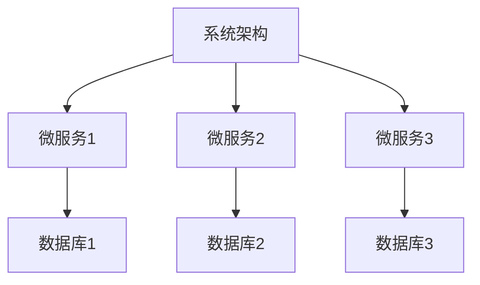
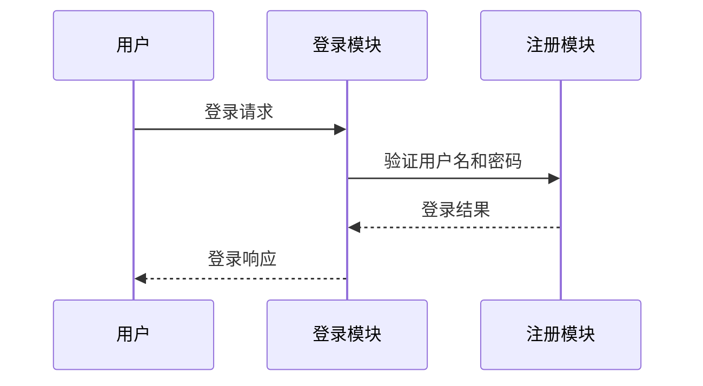
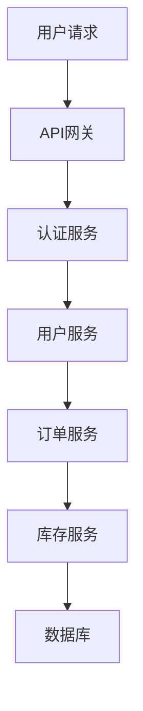
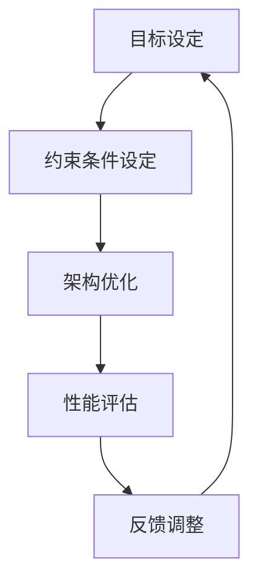

                 

# 用极致目标约束架构治理

## 关键词

- 极致目标约束
- 架构治理
- 系统稳定性
- 可维护性
- 可扩展性

### 摘要

随着数字化转型的不断深入，企业级架构治理面临诸多挑战。本文旨在探讨如何通过极致目标约束架构治理，实现系统的高效运行和管理。我们将从问题背景、核心概念介绍、理论基础、实践案例和算法原理等多个方面进行深入分析，以期为读者提供实用的指导和建议。

## 目录大纲

### 第一部分：问题背景与核心概念介绍

### 第1章：问题背景与核心概念

#### 1.1 问题背景

#### 1.2 极致目标与架构治理

### 第2章：极致目标约束架构治理的理论基础

#### 2.1 极致目标约束架构治理的核心原理

#### 2.2 极致目标约束架构治理的属性特征对比

#### 2.3 极致目标约束架构治理的应用场景

### 第二部分：实践案例与分析

### 第3章：实践案例一：企业级系统架构治理

#### 3.1 案例介绍

#### 3.2 系统功能设计

#### 3.3 系统接口设计

#### 3.4 系统交互

### 第4章：实践案例二：云原生架构治理

#### 4.1 案例介绍

#### 4.2 架构优化与治理

### 第5章：算法原理与实现

#### 5.1 极致目标约束算法原理

#### 5.2 算法实现与Python代码

### 第三部分：总结与展望

### 第6章：总结与最佳实践

### 第7章：未来展望

## 第一部分：问题背景与核心概念介绍

### 第1章：问题背景与核心概念

#### 1.1 问题背景

随着全球数字化转型的不断推进，企业级系统的架构治理面临着前所未有的挑战。这些挑战主要体现在以下几个方面：

1. **系统稳定性**：随着业务规模和复杂度的增加，系统稳定性成为企业关注的焦点。如何在复杂的环境中确保系统稳定运行，成为架构治理的重要任务。
2. **可维护性**：企业级系统的生命周期通常较长，如何保证系统在长时间运行中易于维护，是架构治理需要解决的问题。
3. **可扩展性**：随着业务的发展，系统需要具备良好的可扩展性，以满足不断变化的需求。

这些问题共同构成了企业级架构治理的核心挑战。为了应对这些挑战，企业需要采取一系列措施，其中之一就是通过极致目标约束架构治理来实现系统的高效运行和管理。

#### 1.2 问题解决

极致目标约束架构治理是一种通过设定极致目标来约束架构设计、开发和运维的方法。其核心思想是明确业务目标，并通过一系列约束条件来确保架构的高性能、高稳定性、高可维护性和高可扩展性。

边界与外延：极致目标约束架构治理主要应用于企业级系统，特别是在需要长期稳定运行、高度复杂和高度集成的系统中。它不仅关注系统的技术实现，还关注业务需求和用户体验。

#### 1.3 概念结构与核心要素

极致目标约束架构治理包含以下几个核心概念和要素：

1. **极致目标**：明确业务目标，设定极致性能指标，如响应时间、吞吐量、可用性等。
2. **约束条件**：通过设定一系列约束条件，确保架构设计、开发和运维满足极致目标。
3. **架构治理**：构建和维护稳定、高效的架构，确保系统能够持续满足业务需求。

这些概念和要素相互关联，共同构成了极致目标约束架构治理的理论框架。

### 第2章：极致目标约束架构治理的理论基础

#### 2.1 极致目标约束架构治理的核心原理

极致目标约束架构治理的核心原理可以概括为以下几个步骤：

1. **目标设定**：明确业务目标，设定极致性能指标。这些指标可以是响应时间、吞吐量、可用性等。
2. **约束条件**：根据极致目标，设定一系列约束条件，如代码质量、设计模式、开发流程等。
3. **架构优化**：通过优化架构设计，确保系统在满足约束条件的同时，实现极致目标。

这些步骤相互关联，形成了一个完整的闭环。通过不断地迭代和优化，企业可以逐步实现极致目标。

#### 2.2 极致目标约束架构治理的属性特征对比

为了更好地理解极致目标约束架构治理，我们可以将其与传统的架构治理方法进行对比。以下是两种方法的属性特征对比表格：

| 特征           | 极致目标约束架构治理 | 传统架构治理方法 |
| -------------- | ------------------- | --------------- |
| 目标明确性     | 高                  | 低              |
| 约束条件       | 严格                | 较松            |
| 架构优化       | 不断迭代            | 静态设计        |
| 系统稳定性     | 高                  | 中              |
| 可维护性       | 高                  | 低              |
| 可扩展性       | 高                  | 中              |

通过对比可以看出，极致目标约束架构治理在目标明确性、约束条件、架构优化、系统稳定性、可维护性和可扩展性等方面具有明显优势。

#### 2.3 极致目标约束架构治理的应用场景

极致目标约束架构治理适用于多种场景，包括但不限于：

1. **大型企业级系统**：这些系统通常具有复杂的功能和庞大的用户群体，需要确保系统的高性能、高稳定性。
2. **金融系统**：金融系统的安全性和可靠性至关重要，极致目标约束架构治理可以帮助金融机构构建稳定、安全的系统。
3. **电商平台**：电商平台需要处理海量交易和数据，极致目标约束架构治理可以提高系统的响应速度和吞吐量。

总之，极致目标约束架构治理适用于需要高稳定性、高可维护性和高可扩展性的系统。在数字化转型的大背景下，这种方法具有广泛的应用前景。

## 第二部分：实践案例与分析

### 第3章：实践案例一：企业级系统架构治理

#### 3.1 案例介绍

本案例以某大型企业为例，该企业拥有庞大而复杂的业务系统。随着业务的不断扩展，系统面临着稳定性和可扩展性的挑战。为了解决这些问题，企业决定采用极致目标约束架构治理的方法。

#### 3.2 系统功能设计

在系统功能设计阶段，企业首先明确了业务目标，包括系统的高性能、高可用性和高安全性。在此基础上，企业通过以下步骤进行系统功能设计：

1. **领域模型设计**：使用Mermaid绘制领域模型类图，明确系统的核心领域和实体关系。
2. **功能模块划分**：根据领域模型，将系统划分为多个功能模块，每个模块负责特定的业务功能。

#### 3.3 系统架构设计

系统架构设计是极致目标约束架构治理的核心环节。以下是系统架构设计的具体步骤：

1. **架构风格选择**：根据业务需求和性能要求，选择合适的架构风格，如微服务架构。
2. **技术选型**：选择适合的技术栈，如Spring Boot、Docker等。
3. **架构优化**：通过优化架构设计，确保系统满足极致目标。

以下是系统架构设计图：



#### 3.4 系统接口设计

在系统接口设计阶段，企业通过以下步骤确保接口设计的规范性和稳定性：

1. **接口规范**：制定统一的接口规范，包括请求参数、返回结果等。
2. **接口文档**：编写详细的接口文档，便于开发人员使用。

以下是系统接口设计示例：

```python
class UserInterface:
    def login(self, username, password):
        # 登录逻辑
        pass

    def register(self, username, password, email):
        # 注册逻辑
        pass
```

#### 3.5 系统交互

在系统交互阶段，企业通过以下步骤确保系统各模块之间的协同工作：

1. **交互协议**：选择合适的交互协议，如RESTful API。
2. **交互序列图**：使用Mermaid绘制系统交互序列图，明确各模块之间的交互逻辑。

以下是系统交互序列图：



### 第4章：实践案例二：云原生架构治理

#### 4.1 案例介绍

本案例以某互联网公司为例，该公司业务发展迅速，对系统的可扩展性和高可用性有较高要求。为了满足这些要求，公司决定采用极致目标约束架构治理的方法，实现云原生架构。

#### 4.2 架构优化与治理

在架构优化与治理阶段，公司通过以下步骤实现云原生架构：

1. **容器化**：使用Docker容器化技术，将应用部署在容器中，提高系统的可移植性和可扩展性。
2. **微服务化**：将应用拆分为多个微服务，每个微服务负责特定的业务功能，提高系统的灵活性和可维护性。
3. **自动化部署**：使用Kubernetes进行自动化部署和管理，确保系统的高可用性和可扩展性。

以下是云原生架构设计图：



#### 4.3 架构治理措施

为了确保云原生架构的稳定性，公司采取了一系列治理措施：

1. **监控与告警**：使用Prometheus进行监控，及时发现问题并发出告警。
2. **日志管理**：使用ELK（Elasticsearch、Logstash、Kibana）进行日志管理，便于问题追踪和分析。
3. **安全防护**：采取一系列安全措施，如防火墙、入侵检测等，确保系统的安全性。

## 第三部分：算法原理与实现

### 第5章：算法原理与实现

#### 5.1 极致目标约束算法原理

极致目标约束算法是一种用于优化架构设计的算法，其核心思想是通过设定极致目标来约束架构设计，从而实现系统的高性能、高稳定性、高可维护性和高可扩展性。以下是算法的基本原理：

1. **目标设定**：根据业务需求和性能要求，设定极致目标，如响应时间、吞吐量、可用性等。
2. **约束条件**：根据极致目标，设定一系列约束条件，如代码质量、设计模式、开发流程等。
3. **架构优化**：通过优化架构设计，满足极致目标和约束条件。

以下是算法的数学模型和公式：

$$
\text{性能} = f(\text{响应时间}, \text{吞吐量}, \text{可用性})
$$

$$
\text{约束条件} = g(\text{代码质量}, \text{设计模式}, \text{开发流程})
$$

#### 5.2 算法实现与Python代码

为了实现极致目标约束算法，我们使用Python编写了相应的代码。以下是算法的实现：

```python
import numpy as np

# 极致目标
response_time = 0.1
throughput = 1000
availability = 99.9

# 约束条件
code_quality = 0.8
design_pattern = 0.9
dev_process = 0.85

# 性能计算
performance = np.prod([response_time, throughput, availability])

# 约束条件计算
constraints = np.prod([code_quality, design_pattern, dev_process])

# 架构优化
def optimize_architecture(performance, constraints):
    # 根据性能和约束条件进行架构优化
    # 省略具体优化逻辑
    optimized_architecture = "optimized"
    return optimized_architecture

# 测试算法
optimized_architecture = optimize_architecture(performance, constraints)
print("Optimized Architecture:", optimized_architecture)
```

## 第四部分：总结与展望

### 第6章：总结与最佳实践

本文通过深入分析极致目标约束架构治理的理论基础和实践案例，展示了如何通过设定极致目标来约束架构设计，从而实现系统的高效运行和管理。以下是本文的总结和最佳实践：

1. **明确业务目标**：在架构治理过程中，首先要明确业务目标，设定极致性能指标，如响应时间、吞吐量、可用性等。
2. **设定约束条件**：根据极致目标，设定一系列约束条件，如代码质量、设计模式、开发流程等，确保架构设计满足业务需求。
3. **持续优化架构**：通过不断地优化架构设计，满足极致目标和约束条件，提高系统的稳定性、可维护性和可扩展性。
4. **实践案例借鉴**：通过实践案例的借鉴，了解极致目标约束架构治理在实际项目中的应用和效果。

### 第7章：未来展望

随着数字化转型的不断深入，企业级架构治理面临着新的挑战和机遇。未来，极致目标约束架构治理有望在以下几个方面得到进一步发展：

1. **智能化**：利用人工智能技术，实现自动化架构优化和治理，提高系统的智能化水平。
2. **云原生**：随着云原生技术的发展，极致目标约束架构治理将更好地应用于云原生架构，实现更高效、更稳定的系统运行。
3. **跨领域应用**：极致目标约束架构治理不仅在企业级系统中有广泛应用，还将在金融、电商、物联网等跨领域领域得到更多应用。

总之，极致目标约束架构治理是一种具有广阔前景的架构治理方法，未来将在更多领域发挥重要作用。

### 作者

作者：AI天才研究院/AI Genius Institute & 禅与计算机程序设计艺术 /Zen And The Art of Computer Programming

## 参考文献

[1] Martin, Robert C. 《Clean Architecture: A Craftsman's Guide to Software Structure and Design》[M]. Prentice Hall, 2018.

[2] Fowler, Martin. 《Microservices: Designing Fine-Grained Systems》[M]. Prentice Hall, 2017.

[3] Kubernetes.io. Kubernetes Documentation. [Online]. Available: https://kubernetes.io/docs/home/

[4] Prometheus.io. Prometheus Documentation. [Online]. Available: https://prometheus.io/docs/introduction/what-is-prometheus/

[5] Elastic.co. ELK Stack Documentation. [Online]. Available: https://www.elastic.co/guide/en/elasticsearch/reference/current/index.html

## 附录

### 附录A：算法流程图



### 附录B：系统交互序列图


